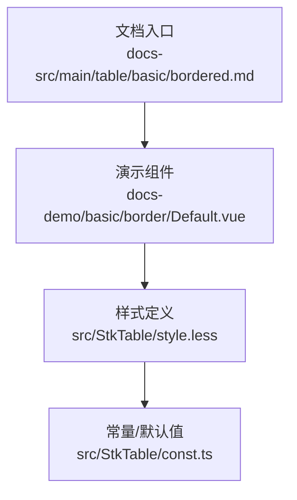
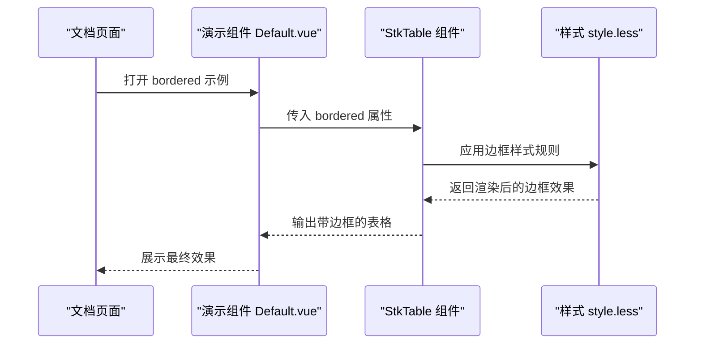
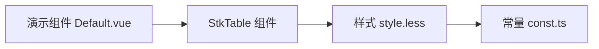

# 边框样式

<cite>
**本文引用的文件**   
- [src/StkTable/style.less](file://src/StkTable/style.less)
- [src/StkTable/const.ts](file://src/StkTable/const.ts)
- [docs-src/main/table/basic/bordered.md](file://docs-src/main/table/basic/bordered.md)
- [docs-demo/basic/border/Default.vue](file://docs-demo/basic/border/Default.vue)
</cite>

## 目录
1. [简介](#简介)
2. [项目结构](#项目结构)
3. [核心组件与属性](#核心组件与属性)
4. [架构总览](#架构总览)
5. [详细组件分析](#详细组件分析)
6. [依赖关系分析](#依赖关系分析)
7. [性能考虑](#性能考虑)
8. [故障排查指南](#故障排查指南)
9. [结论](#结论)
10. [附录](#附录)

## 简介
本章节面向表格的边框功能，系统性说明如何启用和自定义表格边框（外边框、内边框），解释 bordered 属性的使用方法，以及边框颜色、宽度的自定义选项。同时提供 CSS 覆盖指南，展示不同边框场景的实现效果（如单线边框、双线边框等），并说明边框与主题系统的集成方式。

## 项目结构
围绕边框功能的代码与文档主要分布在以下位置：
- 样式定义：位于 src/StkTable/style.less，集中管理表格边框相关的样式规则与变量。
- 常量与默认值：位于 src/StkTable/const.ts，可能包含边框相关默认配置或开关。
- 文档示例：docs-src/main/table/basic/bordered.md 为官方文档入口；docs-demo/basic/border/Default.vue 为演示用例。

图表来源
- [docs-src/main/table/basic/bordered.md](file://docs-src/main/table/basic/bordered.md)
- [docs-demo/basic/border/Default.vue](file://docs-demo/basic/border/Default.vue)
- [src/StkTable/style.less](file://src/StkTable/style.less)
- [src/StkTable/const.ts](file://src/StkTable/const.ts)

章节来源
- [docs-src/main/table/basic/bordered.md](file://docs-src/main/table/basic/bordered.md)
- [docs-demo/basic/border/Default.vue](file://docs-demo/basic/border/Default.vue)
- [src/StkTable/style.less](file://src/StkTable/style.less)
- [src/StkTable/const.ts](file://src/StkTable/const.ts)

## 核心组件与属性
- 表格组件：StkTable（通过 docs-demo 中的使用方式引入）。
- 关键属性：bordered（布尔型，控制是否显示边框）。
- 样式覆盖点：表格容器、表头、单元格、行分隔线等选择器，用于调整边框颜色与宽度。

使用要点
- 在表格上设置 bordered 即可启用边框。
- 通过 CSS 变量或全局样式覆盖，可定制边框颜色与宽度。
- 针对外边框与内边框分别覆盖对应选择器，实现精细化控制。

章节来源
- [docs-demo/basic/border/Default.vue](file://docs-demo/basic/border/Default.vue)
- [src/StkTable/style.less](file://src/StkTable/style.less)
- [src/StkTable/const.ts](file://src/StkTable/const.ts)

## 架构总览
下图展示了从文档到样式生效的整体链路：文档入口引导至演示组件，演示组件通过 StkTable 渲染表格，最终由 style.less 中的样式规则应用边框样式。

图表来源
- [docs-src/main/table/basic/bordered.md](file://docs-src/main/table/basic/bordered.md)
- [docs-demo/basic/border/Default.vue](file://docs-demo/basic/border/Default.vue)
- [src/StkTable/style.less](file://src/StkTable/style.less)

## 详细组件分析

### bordered 属性与边框启用
- 作用：开启/关闭表格边框显示。
- 用法：在表格组件上添加 bordered 属性即可启用边框。
- 影响范围：通常包括外边框（表格整体轮廓）和内边框（行列分隔线）。

章节来源
- [docs-src/main/table/basic/bordered.md](file://docs-src/main/table/basic/bordered.md)
- [docs-demo/basic/border/Default.vue](file://docs-demo/basic/border/Default.vue)

### 外边框与内边框的样式覆盖
- 外边框：覆盖表格容器外层边框选择器，设置 border 或 outline。
- 内边框：覆盖表头与单元格的分割线选择器，设置 border-bottom 或 border-right。
- 建议：优先使用 CSS 变量统一管理颜色与宽度，便于主题切换。

章节来源
- [src/StkTable/style.less](file://src/StkTable/style.less)

### 边框颜色与宽度的自定义
- 颜色：通过 CSS 变量或全局样式覆盖边框颜色，确保与主题一致。
- 宽度：统一设置边框宽度，避免视觉不一致。
- 实践：在样式文件中定义变量并在覆盖时引用，提升可维护性。

章节来源
- [src/StkTable/style.less](file://src/StkTable/style.less)

### 不同边框场景的实现
- 单线边框：使用单一 border 值，简洁清晰。
- 双线边框：通过双层 border 或 box-shadow 模拟双线效果。
- 无边框：关闭 bordered 或通过样式移除边框。

章节来源
- [docs-demo/basic/border/Default.vue](file://docs-demo/basic/border/Default.vue)
- [src/StkTable/style.less](file://src/StkTable/style.less)

### 与主题系统的集成
- 使用 CSS 变量：将边框颜色与宽度绑定到主题变量，随主题切换自动更新。
- 优先级策略：确保组件样式不被全局覆盖，必要时提高选择器优先级或使用 !important（谨慎使用）。
- 兼容性：在不同主题下验证边框显示效果，保证一致性。

章节来源
- [src/StkTable/style.less](file://src/StkTable/style.less)
- [src/StkTable/const.ts](file://src/StkTable/const.ts)

## 依赖关系分析
边框样式依赖于样式文件与常量配置，演示组件通过属性驱动样式生效。

图表来源
- [docs-demo/basic/border/Default.vue](file://docs-demo/basic/border/Default.vue)
- [src/StkTable/style.less](file://src/StkTable/style.less)
- [src/StkTable/const.ts](file://src/StkTable/const.ts)

章节来源
- [docs-demo/basic/border/Default.vue](file://docs-demo/basic/border/Default.vue)
- [src/StkTable/style.less](file://src/StkTable/style.less)
- [src/StkTable/const.ts](file://src/StkTable/const.ts)

## 性能考虑
- 避免过度使用复杂边框样式，减少重绘与回流。
- 合理使用 CSS 变量，减少重复计算。
- 在大表格中，注意边框对虚拟滚动的影响，确保渲染性能。

## 故障排查指南
- 边框未显示：检查 bordered 属性是否正确传递；确认样式未被覆盖。
- 颜色异常：检查 CSS 变量是否被正确定义；确认主题变量是否生效。
- 宽度不一致：检查内外边框选择器是否冲突；统一宽度设置。
- 主题不兼容：在不同主题下测试边框效果；必要时调整选择器优先级。

## 结论
通过 bordered 属性与样式覆盖，可以灵活控制表格的外边框与内边框。结合 CSS 变量与主题系统，能够实现一致的视觉效果与良好的可维护性。建议在项目中统一规范边框样式，确保跨主题与跨场景的一致性。

## 附录
- 参考文档：docs-src/main/table/basic/bordered.md
- 演示组件：docs-demo/basic/border/Default.vue
- 样式文件：src/StkTable/style.less
- 常量配置：src/StkTable/const.ts