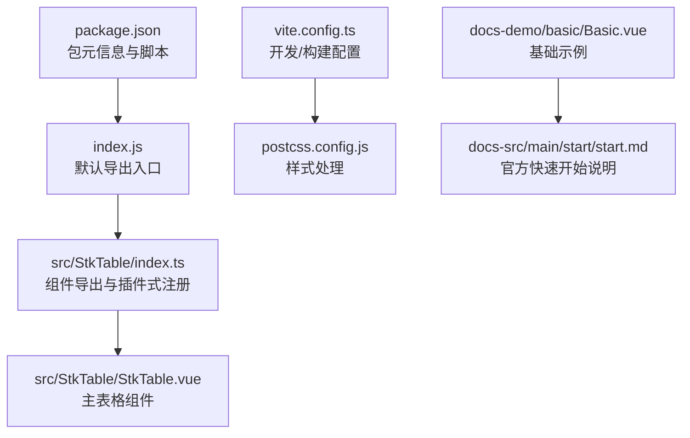
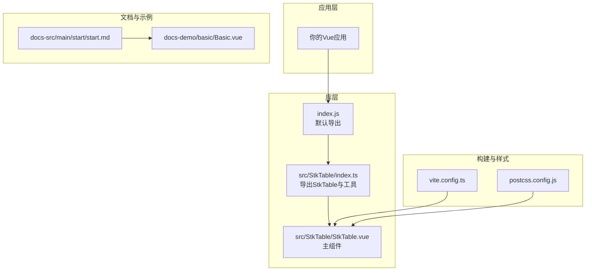
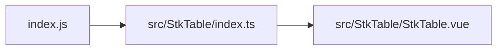

# 快速开始

<cite>
**本文引用的文件**   
- [package.json](file://package.json)
- [index.js](file://index.js)
- [src/StkTable/index.ts](file://src/StkTable/index.ts)
- [src/StkTable/StkTable.vue](file://src/StkTable/StkTable.vue)
- [docs-src/main/start/start.md](file://docs-src/main/start/start.md)
- [docs-demo/basic/Basic.vue](file://docs-demo/basic/Basic.vue)
- [docs-demo/start/Start.vue](file://docs-demo/start/Start.vue)
- [vite.config.ts](file://vite.config.ts)
- [postcss.config.js](file://postcss.config.js)
</cite>

## 更新摘要
**已进行的更改**   
- 更新了安装说明，强调推荐使用最新版本 1.0.2
- 新增了关于固定列边框渲染修复的重要提示
- 增强了故障排查部分，包含固定列相关问题的解决方案
- 更新了依赖关系分析，突出版本兼容性要求

## 目录
1. [简介](#简介)
2. [项目结构](#项目结构)
3. [核心组件与入口](#核心组件与入口)
4. [架构总览](#架构总览)
5. [详细使用指南](#详细使用指南)
6. [依赖关系分析](#依赖关系分析)
7. [性能注意事项](#性能注意事项)
8. [故障排查](#故障排查)
9. [结论](#结论)
10. [附录：从零到运行示例](#附录从零到运行示例)

## 简介
本指南面向首次接触 stk-table-vue 的开发者，提供从安装、配置到第一个表格运行的完整步骤。你将学会如何引入并注册组件、定义列与数据绑定，并在最短时间内运行一个功能完整的表格。同时包含常见环境问题的定位与解决方案。

**重要提示**：建议使用最新版本 1.0.2，该版本包含了重要的 bug 修复和改进，特别是固定列边框渲染问题的修复。

## 项目结构
仓库采用"源码 + 文档示例"的组织方式：
- src/StkTable：核心组件与特性实现
- docs-demo：丰富的演示用例（基础、高级、API）
- docs-src：VitePress 文档站点源码
- 根目录：包管理、构建配置与入口导出

**图表来源** 
- [package.json](file://package.json)
- [index.js](file://index.js)
- [src/StkTable/index.ts](file://src/StkTable/index.ts)
- [src/StkTable/StkTable.vue](file://src/StkTable/StkTable.vue)
- [vite.config.ts](file://vite.config.ts)
- [postcss.config.js](file://postcss.config.js)
- [docs-demo/basic/Basic.vue](file://docs-demo/basic/Basic.vue)
- [docs-src/main/start/start.md](file://docs-src/main/start/start.md)

**章节来源**
- [package.json](file://package.json)
- [index.js](file://index.js)
- [src/StkTable/index.ts](file://src/StkTable/index.ts)
- [src/StkTable/StkTable.vue](file://src/StkTable/StkTable.vue)
- [vite.config.ts](file://vite.config.ts)
- [postcss.config.js](file://postcss.config.js)
- [docs-demo/basic/Basic.vue](file://docs-demo/basic/Basic.vue)
- [docs-src/main/start/start.md](file://docs-src/main/start/start.md)

## 核心组件与入口
- 包入口 index.js：对外暴露组件与插件式安装能力，便于按需或全局引入。
- src/StkTable/index.ts：统一导出 StkTable 组件及类型、工具函数等。
- src/StkTable/StkTable.vue：表格主体实现，包含列渲染、排序、固定列、虚拟滚动等特性。

典型用法路径：
- 全局安装：在应用入口引入并调用 install/use 方法注册组件。
- 局部引入：在单文件中直接 import 并使用。

**章节来源**
- [index.js](file://index.js)
- [src/StkTable/index.ts](file://src/StkTable/index.ts)
- [src/StkTable/StkTable.vue](file://src/StkTable/StkTable.vue)

## 架构总览
stk-table-vue 以 Vue 组件为核心，通过统一的导出入口暴露给上层业务。构建链路由 Vite 驱动，样式经 PostCSS 处理。文档站点基于 VitePress，示例代码位于 docs-demo。

**图表来源** 
- [index.js](file://index.js)
- [src/StkTable/index.ts](file://src/StkTable/index.ts)
- [src/StkTable/StkTable.vue](file://src/StkTable/StkTable.vue)
- [vite.config.ts](file://vite.config.ts)
- [postcss.config.js](file://postcss.config.js)
- [docs-src/main/start/start.md](file://docs-src/main/start/start.md)
- [docs-demo/basic/Basic.vue](file://docs-demo/basic/Basic.vue)

## 详细使用指南

### 1. 安装
支持多种包管理器，任选其一执行：
- npm: npm install stk-table-vue@latest
- yarn: yarn add stk-table-vue@latest
- pnpm: pnpm add stk-table-vue@latest

**重要提示**：强烈建议使用 `@latest` 标签安装最新版本 1.0.2，该版本包含了重要的 bug 修复，特别是固定列边框渲染问题的修复。

提示：确保 Node.js 版本满足项目要求（参考 package.json 中的 engines 字段）。

**章节来源**
- [package.json](file://package.json)

### 2. 引入与注册
两种常用方式：
- 全局注册（推荐在 main.ts / main.js）
  - 引入包入口 index.js 提供的 install 方法
  - 在 app.use() 中注册
- 局部引入（在单个 .vue 文件中）
  - 直接 import StkTable 组件
  - 在 components 中声明并使用

注意：若需要样式，请确保样式被正确加载（见"常见问题"一节）。

**章节来源**
- [index.js](file://index.js)
- [src/StkTable/index.ts](file://src/StkTable/index.ts)

### 3. 基础配置
- 列定义：通过 columns 属性传入列配置数组，至少包含 key、title 等必要字段。
- 数据绑定：通过 data 属性绑定行数据数组，每行需具备唯一标识（如 id）。
- 尺寸与主题：可通过 size、theme 等属性调整外观与交互体验。
- 国际化：如需中文文案，可在初始化时配置语言包（参考官方文档）。

**章节来源**
- [src/StkTable/StkTable.vue](file://src/StkTable/StkTable.vue)

### 4. 第一个表格示例（从零到运行）
以下流程帮助你快速搭建并运行一个最小可用的表格页面：
- 新建一个 Vue 项目（Vite/Vue CLI 均可）
- 安装 stk-table-vue（推荐使用最新版本 1.0.2）
- 在页面中引入并注册组件
- 定义 columns 与 data 并渲染表格
- 启动开发服务器，访问页面查看效果

你可以参考官方示例的结构与用法：
- 官方快速开始说明：[docs-src/main/start/start.md](file://docs-src/main/start/start.md)
- 基础示例组件：[docs-demo/basic/Basic.vue](file://docs-demo/basic/Basic.vue)
- 快速开始页示例：[docs-demo/start/Start.vue](file://docs-demo/start/Start.vue)

**章节来源**
- [docs-src/main/start/start.md](file://docs-src/main/start/start.md)
- [docs-demo/basic/Basic.vue](file://docs-demo/basic/Basic.vue)
- [docs-demo/start/Start.vue](file://docs-demo/start/Start.vue)

### 5. 列定义与数据绑定要点
- 列 key：必须唯一，用于单元格数据映射与排序/筛选等特性。
- 标题 title：列头显示文本。
- 数据类型：根据列内容设置合适的 formatter、sorter、filter 等。
- 数据项 id：保证行唯一性，利于内部更新与选择状态管理。

**章节来源**
- [src/StkTable/StkTable.vue](file://src/StkTable/StkTable.vue)

### 6. 样式与主题
- 默认样式由库内样式文件提供，确保构建系统能解析 CSS/LESS。
- 可通过 CSS 变量覆盖主题色、字号、间距等。
- 若出现样式未生效，检查 PostCSS 与 Vite 的样式处理链是否包含该库。

**章节来源**
- [postcss.config.js](file://postcss.config.js)
- [vite.config.ts](file://vite.config.ts)

## 依赖关系分析
- 包入口 index.js 负责对外导出，简化用户引入方式。
- src/StkTable/index.ts 集中导出组件与工具，保持 API 稳定。
- 主组件 StkTable.vue 依赖若干 hooks 与工具（如排序、固定列、虚拟滚动等），这些在后续进阶使用中逐步启用。

**版本兼容性**：建议使用版本 1.0.2 或更高版本，以获得最佳的固定列边框渲染效果和 bug 修复。

**图表来源** 
- [index.js](file://index.js)
- [src/StkTable/index.ts](file://src/StkTable/index.ts)
- [src/StkTable/StkTable.vue](file://src/StkTable/StkTable.vue)

**章节来源**
- [index.js](file://index.js)
- [src/StkTable/index.ts](file://src/StkTable/index.ts)
- [src/StkTable/StkTable.vue](file://src/StkTable/StkTable.vue)

## 性能注意事项
- 大数据量：开启虚拟滚动（按列/行）以提升渲染性能。
- 列宽自适应：合理设置列宽，避免频繁重排。
- 排序与筛选：优先服务端处理，客户端仅做轻量操作。
- 固定列：谨慎使用，过多固定列会影响布局计算。

**版本优化**：版本 1.0.2 对固定列的边框渲染进行了优化，建议升级以获得更好的性能和视觉效果。

[本节为通用建议，不直接分析具体文件]

## 故障排查
常见问题与解决思路：
- 样式未生效
  - 确认 PostCSS 已正确配置，且能处理库内样式。
  - 检查 Vite 的 css.preprocessorOptions 与模块解析路径。
- 组件无法识别
  - 全局注册是否正确调用 app.use(StkTable)。
  - 局部引入是否在 components 中声明并在模板中使用。
- 列数据不显示
  - 检查 columns.key 是否与数据字段一致。
  - 确认 data 数组中的每项具有唯一 id。
- 排序/筛选无效
  - 检查 sorter/filter 回调是否返回正确比较结果。
  - 对于远程数据，确保接口支持相应参数。
- **固定列边框问题**（版本 1.0.2 修复）
  - 如果遇到固定列边框渲染异常，请升级到最新版本 1.0.2。
  - 该版本专门修复了固定列边框渲染的问题。
  - 确保使用的是 `stk-table-vue@latest` 或明确指定 `@1.0.2` 版本。

**章节来源**
- [postcss.config.js](file://postcss.config.js)
- [vite.config.ts](file://vite.config.ts)
- [src/StkTable/StkTable.vue](file://src/StkTable/StkTable.vue)

## 结论
通过以上步骤，你可以在几分钟内完成 stk-table-vue 的安装、配置与首个表格的运行。**强烈建议使用最新版本 1.0.2**，该版本包含了重要的 bug 修复和改进，特别是固定列边框渲染问题的修复。建议在掌握基础用法后，逐步探索排序、筛选、虚拟滚动、自定义单元格等高级特性，以满足复杂业务场景。

[本节为总结性内容，不直接分析具体文件]

## 附录：从零到运行示例
- 创建项目：使用 Vite 创建 Vue 项目
- 安装依赖：**npm/yarn/pnpm 安装 stk-table-vue@latest**（推荐使用最新版本）
- 引入与注册：在入口文件或页面中引入并注册组件
- 定义列与数据：编写 columns 与 data
- 启动服务：运行开发服务器并访问页面

可参考的示例位置：
- 官方快速开始说明：[docs-src/main/start/start.md](file://docs-src/main/start/start.md)
- 基础示例组件：[docs-demo/basic/Basic.vue](file://docs-demo/basic/Basic.vue)
- 快速开始页示例：[docs-demo/start/Start.vue](file://docs-demo/start/Start.vue)

**版本建议**：始终使用最新版本以获得最佳体验和 bug 修复。

**章节来源**
- [docs-src/main/start/start.md](file://docs-src/main/start/start.md)
- [docs-demo/basic/Basic.vue](file://docs-demo/basic/Basic.vue)
- [docs-demo/start/Start.vue](file://docs-demo/start/Start.vue)