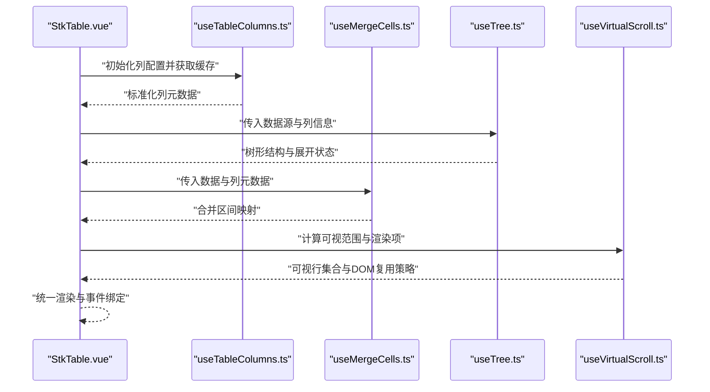
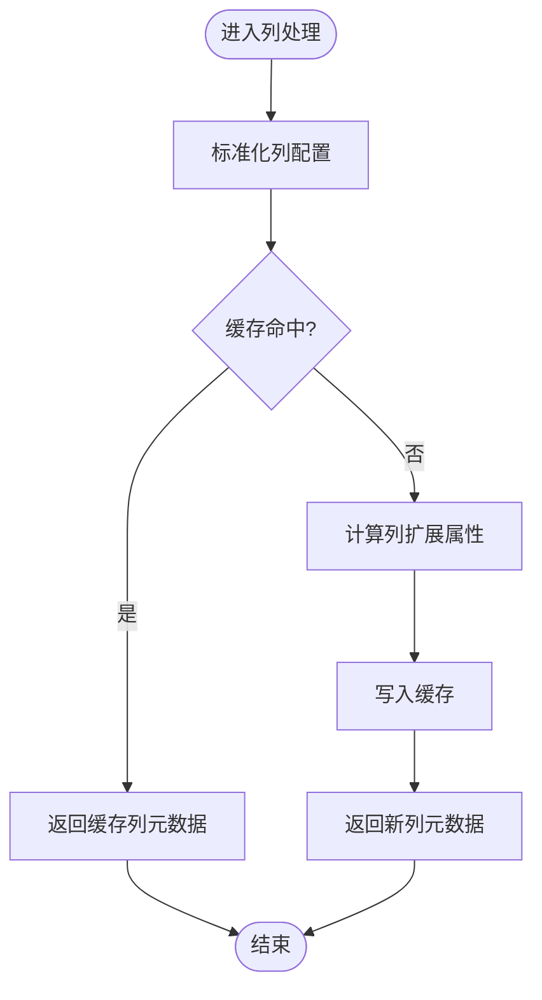
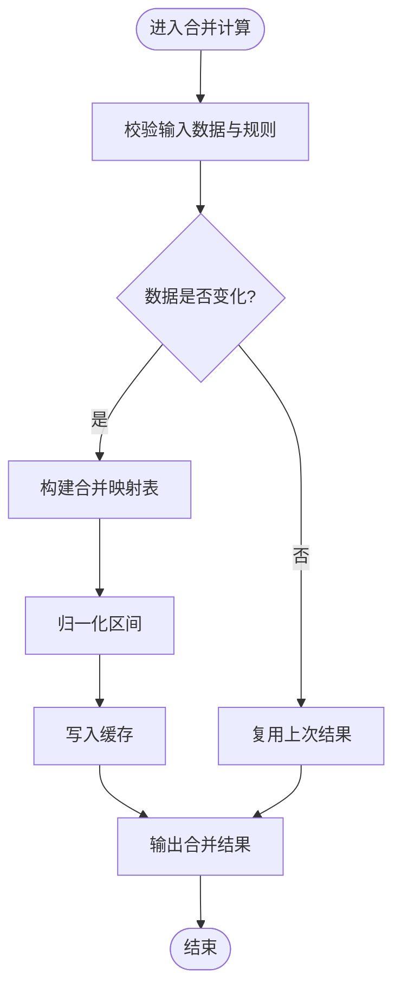
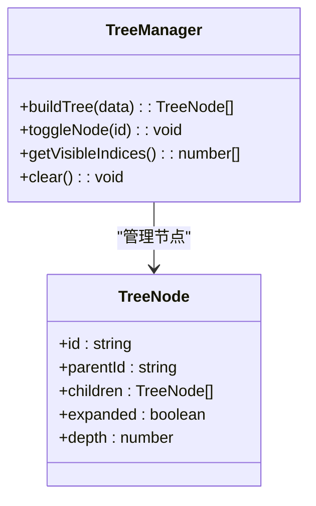
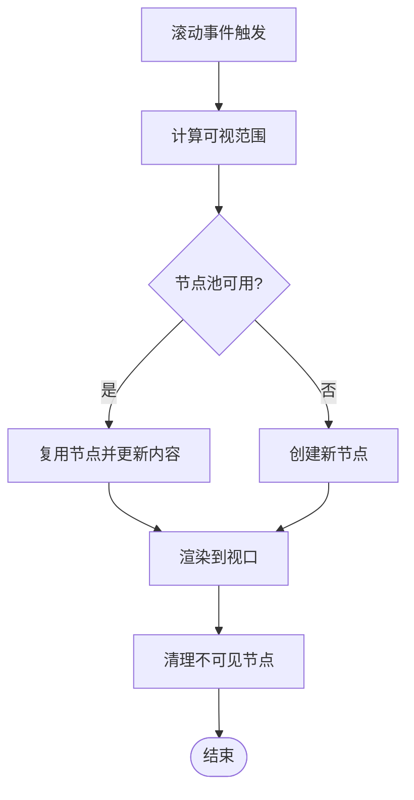
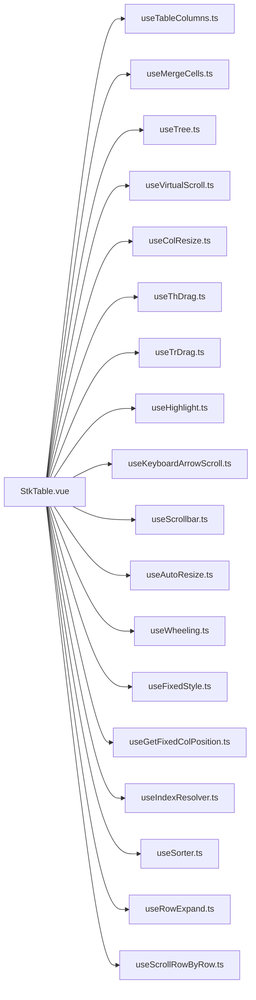

# 内存管理优化

<cite>
**本文引用的文件**   
- [useTableColumns.ts](file://src/StkTable/useTableColumns.ts)
- [useMergeCells.ts](file://src/StkTable/useMergeCells.ts)
- [useTree.ts](file://src/StkTable/useTree.ts)
- [StkTable.vue](file://src/StkTable/StkTable.vue)
- [useVirtualScroll.ts](file://src/StkTable/useVirtualScroll.ts)
- [useMaxRowSpan.ts](file://src/StkTable/useMaxRowSpan.ts)
- [useColResize.ts](file://src/StkTable/useColResize.ts)
- [useThDrag.ts](file://src/StkTable/useThDrag.ts)
- [useTrDrag.ts](file://src/StkTable/useTrDrag.ts)
- [useHighlight.ts](file://src/StkTable/useHighlight.ts)
- [useKeyboardArrowScroll.ts](file://src/StkTable/useKeyboardArrowScroll.ts)
- [useScrollbar.ts](file://src/StkTable/useScrollbar.ts)
- [useAutoResize.ts](file://src/StkTable/useAutoResize.ts)
- [useWheeling.ts](file://src/StkTable/useWheeling.ts)
- [useFixedStyle.ts](file://src/StkTable/useFixedStyle.ts)
- [useGetFixedColPosition.ts](file://src/StkTable/useGetFixedColPosition.ts)
- [useIndexResolver.ts](file://src/StkTable/useIndexResolver.ts)
- [useSorter.ts](file://src/StkTable/useSorter.ts)
- [useRowExpand.ts](file://src/StkTable/useRowExpand.ts)
- [useScrollRowByRow.ts](file://src/StkTable/useScrollRowByRow.ts)
- [constRefUtils.ts](file://src/StkTable/utils/constRefUtils.ts)
- [useTriggerRef.ts](file://src/StkTable/utils/useTriggerRef.ts)
- [index.ts](file://src/StkTable/index.ts)
</cite>

## 目录
1. [引言](#引言)
2. [项目结构](#项目结构)
3. [核心组件](#核心组件)
4. [架构总览](#架构总览)
5. [详细组件分析](#详细组件分析)
6. [依赖分析](#依赖分析)
7. [性能考虑](#性能考虑)
8. [故障排查指南](#故障排查指南)
9. [结论](#结论)
10. [附录](#附录)

## 引言
本文件面向 stk-table-vue 的内存管理与性能优化，聚焦于表格在复杂功能（列定义、合并单元格、树形结构等）下的生命周期内分配与释放策略。文档将围绕 useTableColumns.ts、useMergeCells.ts、useTree.ts 等核心模块，系统阐述：
- 数据与视图的解耦与缓存策略
- 事件监听器、定时器、DOM 引用在组件销毁时的清理机制
- 虚拟滚动与大数据场景下的内存占用控制
- 常见内存泄漏定位方法与修复实践
- 监控与性能分析工具的使用建议

## 项目结构
stk-table-vue 的核心逻辑集中在 src/StkTable 目录下，采用“按能力划分”的 hooks 组织方式，每个 hook 负责一个特性或子系统，便于职责单一、依赖清晰、易于测试与优化。关键目录与文件：
- StkTable.vue：表格主组件，组合各 hooks，协调渲染与交互
- useTableColumns.ts：列定义解析、缓存与变更检测
- useMergeCells.ts：合并单元格计算与结果缓存
- useTree.ts：树形数据结构构建、展开状态与节点索引映射
- useVirtualScroll.ts：虚拟滚动核心，视口行范围计算与 DOM 复用
- 其他 hooks：拖拽、排序、高亮、键盘导航、滚动、固定列样式、行展开、逐行滚动等

```mermaid
graph TB
A["StkTable.vue"] --> B["useTableColumns.ts"]
A --> C["useMergeCells.ts"]
A --> D["useTree.ts"]
A --> E["useVirtualScroll.ts"]
A --> F["useColResize.ts"]
A --> G["useThDrag.ts"]
A --> H["useTrDrag.ts"]
A --> I["useHighlight.ts"]
A --> J["useKeyboardArrowScroll.ts"]
A --> K["useScrollbar.ts"]
A --> L["useAutoResize.ts"]
A --> M["useWheeling.ts"]
A --> N["useFixedStyle.ts"]
A --> O["useGetFixedColPosition.ts"]
A --> P["useIndexResolver.ts"]
A --> Q["useSorter.ts"]
A --> R["useRowExpand.ts"]
A --> S["useScrollRowByRow.ts"]
```

图表来源
- [StkTable.vue](file://src/StkTable/StkTable.vue)
- [useTableColumns.ts](file://src/StkTable/useTableColumns.ts)
- [useMergeCells.ts](file://src/StkTable/useMergeCells.ts)
- [useTree.ts](file://src/StkTable/useTree.ts)
- [useVirtualScroll.ts](file://src/StkTable/useVirtualScroll.ts)

章节来源
- [StkTable.vue](file://src/StkTable/StkTable.vue)
- [index.ts](file://src/StkTable/index.ts)

## 核心组件
本节对与内存管理密切相关的核心模块进行概览性说明，重点在于其职责边界与数据流，为后续深入分析奠定基础。

- useTableColumns.ts：负责列配置的解析、规范化、缓存与变更检测；避免重复计算与不必要的响应式更新；提供稳定的列引用以支持后续模块复用。
- useMergeCells.ts：基于列与数据源计算合并区间，维护合并映射表；通过键控与增量更新降低重算成本；在数据变化时仅更新受影响区域。
- useTree.ts：将扁平数据转换为树形结构，维护节点层级、父子关系、展开状态与可见索引映射；在增删改时局部重建子树，避免全量重建。
- useVirtualScroll.ts：根据视口尺寸与行高估算可视范围，复用 DOM 节点，减少长列表渲染开销；在滚动过程中动态调整渲染窗口，保持内存稳定。

章节来源
- [useTableColumns.ts](file://src/StkTable/useTableColumns.ts)
- [useMergeCells.ts](file://src/StkTable/useMergeCells.ts)
- [useTree.ts](file://src/StkTable/useTree.ts)
- [useVirtualScroll.ts](file://src/StkTable/useVirtualScroll.ts)

## 架构总览
下图展示了表格主组件与各能力模块之间的依赖关系与数据流向。StkTable.vue 作为编排层，聚合各 hooks 的输出，形成统一的渲染上下文；hooks 之间通过共享状态与纯函数计算协作，尽量减少跨模块耦合与全局状态污染。

图表来源
- [StkTable.vue](file://src/StkTable/StkTable.vue)
- [useTableColumns.ts](file://src/StkTable/useTableColumns.ts)
- [useMergeCells.ts](file://src/StkTable/useMergeCells.ts)
- [useTree.ts](file://src/StkTable/useTree.ts)
- [useVirtualScroll.ts](file://src/StkTable/useVirtualScroll.ts)

## 详细组件分析

### useTableColumns.ts：列定义与缓存
- 设计要点
  - 列配置标准化：将用户传入的列定义转换为内部统一结构，便于后续模块消费。
  - 变更检测与缓存：对列配置建立稳定的键（如 id、key），仅在必要时重新计算，避免频繁创建新对象。
  - 稳定引用：对外暴露稳定的列数组与单列引用，减少 Vue 响应式系统的比较开销。
- 内存优化策略
  - 使用 Map/Set 存储列元数据，避免重复计算与冗余对象。
  - 惰性初始化：按需生成列扩展属性（如宽度、对齐、插槽名）。
  - 浅拷贝优先：仅在必要时深拷贝，避免大对象复制带来的 GC 压力。
- 常见问题与修复
  - 列配置每次渲染都新建导致缓存失效：确保 key/id 稳定，或使用外部常量。
  - 未清理临时引用：在组件卸载时清空缓存或重置引用。

图表来源
- [useTableColumns.ts](file://src/StkTable/useTableColumns.ts)

章节来源
- [useTableColumns.ts](file://src/StkTable/useTableColumns.ts)

### useMergeCells.ts：合并单元格计算与缓存
- 设计要点
  - 合并规则输入：由上层传入合并规则（行/列跨度、条件判断）。
  - 增量计算：当数据或规则变化时，仅重算受影响区域，避免全表重算。
  - 结果缓存：以行列坐标为键存储合并区间，支持快速查找与去重。
- 内存优化策略
  - 使用二维或一维映射表存储合并区间，避免嵌套对象过多。
  - 合并区间归一化：统一方向与边界，减少重复条目。
  - 清理策略：在数据替换或组件销毁时清空映射表。
- 常见问题与修复
  - 合并规则不稳定导致频繁重算：确保规则对象引用稳定或使用 memoization。
  - 未处理边界情况：如合并跨越虚拟滚动边界时需限制计算范围。

图表来源
- [useMergeCells.ts](file://src/StkTable/useMergeCells.ts)

章节来源
- [useMergeCells.ts](file://src/StkTable/useMergeCells.ts)

### useTree.ts：树形结构与展开状态
- 设计要点
  - 树构建：将扁平数据转换为树形结构，维护父子关系与层级深度。
  - 展开状态：维护节点展开/折叠状态，支持默认展开与受控模式。
  - 可见索引：计算展开后的可见行索引，供虚拟滚动与渲染使用。
- 内存优化策略
  - 增量更新：新增/删除节点时仅重建相关子树，避免全量重建。
  - 状态分离：将展开状态与节点数据分离，减少不必要的数据拷贝。
  - 索引缓存：对常用查询（如父节点、兄弟节点）建立索引，提升查找效率。
- 常见问题与修复
  - 展开状态与数据不同步：确保状态更新与数据变更在同一事务中完成。
  - 大量节点导致内存膨胀：结合虚拟滚动限制渲染范围，及时释放不可见节点引用。

图表来源
- [useTree.ts](file://src/StkTable/useTree.ts)

章节来源
- [useTree.ts](file://src/StkTable/useTree.ts)

### useVirtualScroll.ts：虚拟滚动与 DOM 复用
- 设计要点
  - 视口计算：根据容器高度、行高与滚动位置计算可视范围。
  - 行高估计：支持固定行高与自适应行高，后者需测量与缓存。
  - DOM 复用：仅渲染可视范围内的行，滚动时复用 DOM 节点，避免频繁创建销毁。
- 内存优化策略
  - 池化策略：维护行节点池，复用已创建的 DOM 元素。
  - 懒加载：仅在需要时测量行高，避免初始渲染阻塞。
  - 清理策略：在组件卸载或数据切换时清空池化节点与缓存。
- 常见问题与修复
  - 行高测量不准确导致错位：确保测量时机正确，必要时使用 requestAnimationFrame。
  - 滚动过程中内存增长：检查是否有未释放的事件监听器或闭包引用。

图表来源
- [useVirtualScroll.ts](file://src/StkTable/useVirtualScroll.ts)

章节来源
- [useVirtualScroll.ts](file://src/StkTable/useVirtualScroll.ts)

### 其他关键模块的内存考量
- useMaxRowSpan.ts：用于计算最大行跨度，避免不必要的递归与重复计算。
- useColResize.ts / useThDrag.ts / useTrDrag.ts：拖拽与列宽调整涉及鼠标事件与 DOM 操作，需在组件卸载时移除监听器与临时样式。
- useHighlight.ts：高亮状态应使用轻量级标记，避免在全量数据上维护复杂对象。
- useKeyboardArrowScroll.ts：键盘导航需绑定/解绑事件，防止多实例冲突。
- useScrollbar.ts：自定义滚动条样式与行为，注意滚动事件节流与防抖。
- useAutoResize.ts：自动调整容器大小，避免频繁 reflow，使用 ResizeObserver 并合理节流。
- useWheeling.ts：滚轮事件处理，注意事件冒泡与阻止默认行为。
- useFixedStyle.ts / useGetFixedColPosition.ts：固定列样式与位置计算，避免重复计算布局。
- useIndexResolver.ts：索引解析与映射，确保键值稳定，避免哈希冲突。
- useSorter.ts：排序算法与稳定性，避免频繁交换导致的数据拷贝。
- useRowExpand.ts：行展开状态管理，与树形结构类似，需注意状态同步与内存释放。
- useScrollRowByRow.ts：逐行滚动，需精确控制滚动位置与动画帧。

章节来源
- [useMaxRowSpan.ts](file://src/StkTable/useMaxRowSpan.ts)
- [useColResize.ts](file://src/StkTable/useColResize.ts)
- [useThDrag.ts](file://src/StkTable/useThDrag.ts)
- [useTrDrag.ts](file://src/StkTable/useTrDrag.ts)
- [useHighlight.ts](file://src/StkTable/useHighlight.ts)
- [useKeyboardArrowScroll.ts](file://src/StkTable/useKeyboardArrowScroll.ts)
- [useScrollbar.ts](file://src/StkTable/useScrollbar.ts)
- [useAutoResize.ts](file://src/StkTable/useAutoResize.ts)
- [useWheeling.ts](file://src/StkTable/useWheeling.ts)
- [useFixedStyle.ts](file://src/StkTable/useFixedStyle.ts)
- [useGetFixedColPosition.ts](file://src/StkTable/useGetFixedColPosition.ts)
- [useIndexResolver.ts](file://src/StkTable/useIndexResolver.ts)
- [useSorter.ts](file://src/StkTable/useSorter.ts)
- [useRowExpand.ts](file://src/StkTable/useRowExpand.ts)
- [useScrollRowByRow.ts](file://src/StkTable/useScrollRowByRow.ts)

## 依赖分析
下图展示了 StkTable.vue 与各 hooks 之间的依赖关系，以及 hooks 内部的潜在循环依赖风险。通过职责分离与单向数据流，降低耦合度，提升可维护性与内存安全性。

图表来源
- [StkTable.vue](file://src/StkTable/StkTable.vue)
- [useTableColumns.ts](file://src/StkTable/useTableColumns.ts)
- [useMergeCells.ts](file://src/StkTable/useMergeCells.ts)
- [useTree.ts](file://src/StkTable/useTree.ts)
- [useVirtualScroll.ts](file://src/StkTable/useVirtualScroll.ts)

章节来源
- [StkTable.vue](file://src/StkTable/StkTable.vue)

## 性能考虑
- 数据与视图分离：尽量使用纯函数计算中间结果，避免在模板中进行复杂逻辑。
- 缓存与去重：对昂贵计算（如列解析、合并区间、树构建）建立缓存，使用稳定键避免缓存失效。
- 事件与定时器管理：所有事件监听器、定时器、观察者应在组件卸载时清理，防止内存泄漏。
- 虚拟滚动与懒加载：结合视口与行高估计，仅渲染必要内容，减少初始负载与滚动抖动。
- 对象池与复用：对频繁创建销毁的对象（如 DOM 节点、计算中间结果）使用池化策略。
- 避免深层响应式：对大型数据使用 shallowRef 或外部状态管理，减少 Vue 响应式追踪开销。

[本节为通用指导，不直接分析具体文件]

## 故障排查指南
- 内存泄漏检测
  - 使用浏览器开发者工具的 Memory 面板，拍摄堆快照对比，查找未释放的 DOM 节点与闭包引用。
  - 使用 Performance 面板录制滚动、排序、展开等操作，观察长时间运行后的内存增长趋势。
  - 在开发环境启用 Vue DevTools 的组件检查，确认组件是否正确卸载。
- 常见问题定位
  - 事件监听器未清理：检查 drag、scroll、resize、wheel 等事件是否在 beforeUnmount/onUnmount 中移除。
  - 定时器未清除：setInterval/setTimeout 应在组件销毁时 clearInterval/clearTimeout。
  - 闭包引用：避免在回调中捕获大对象，必要时使用弱引用或显式清理。
  - 缓存未清理：Map/Set/数组缓存应在数据切换或组件卸载时清空。
- 修复最佳实践
  - 统一封装生命周期钩子：在 onMounted 注册，在 onUnmounted 清理。
  - 使用可取消的请求与观察者：AbortController、IntersectionObserver 的 disconnect。
  - 日志与断点：在关键路径添加调试日志，定位异常增长点。

章节来源
- [useColResize.ts](file://src/StkTable/useColResize.ts)
- [useThDrag.ts](file://src/StkTable/useThDrag.ts)
- [useTrDrag.ts](file://src/StkTable/useTrDrag.ts)
- [useScrollbar.ts](file://src/StkTable/useScrollbar.ts)
- [useAutoResize.ts](file://src/StkTable/useAutoResize.ts)
- [useWheeling.ts](file://src/StkTable/useWheeling.ts)

## 结论
stk-table-vue 的内存管理优化依赖于清晰的模块边界、稳定的数据引用、合理的缓存策略与严格的资源清理。通过 useTableColumns.ts、useMergeCells.ts、useTree.ts 等核心模块的协同，结合虚拟滚动与 DOM 复用，可在大数据与复杂功能场景下保持稳定的内存占用。建议在开发过程中持续使用内存分析工具，结合本文的最佳实践，及时发现并修复潜在的内存问题。

[本节为总结性内容，不直接分析具体文件]

## 附录
- 推荐工具
  - Chrome DevTools：Memory 与 Performance 面板
  - Vue DevTools：组件状态与生命周期检查
  - Node.js 内存分析：heapdump、clinic.js（服务端或 SSR 场景）
- 参考实践
  - 事件监听器统一注册与清理
  - 定时器与异步任务的生命周期管理
  - 大对象池化与惰性加载
  - 虚拟滚动与行高估计的最佳实践

[本节为补充信息，不直接分析具体文件]