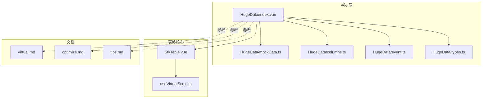
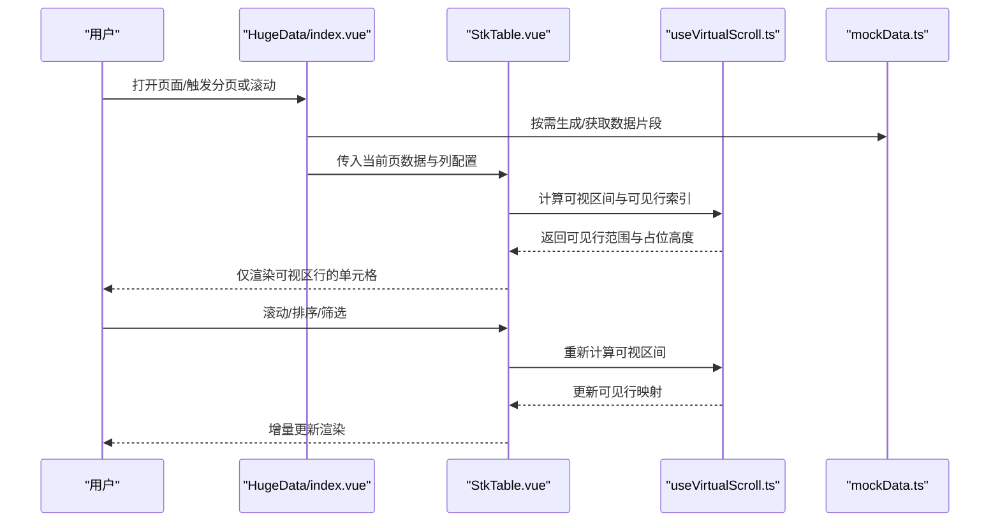
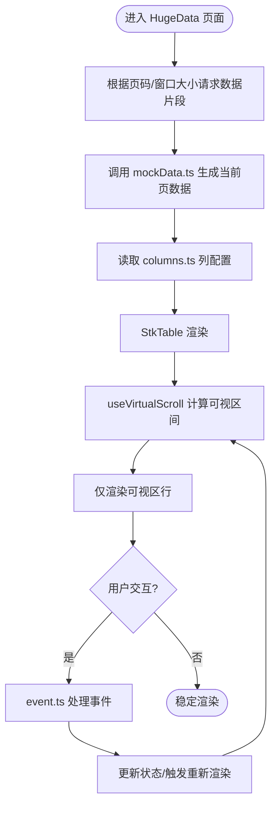
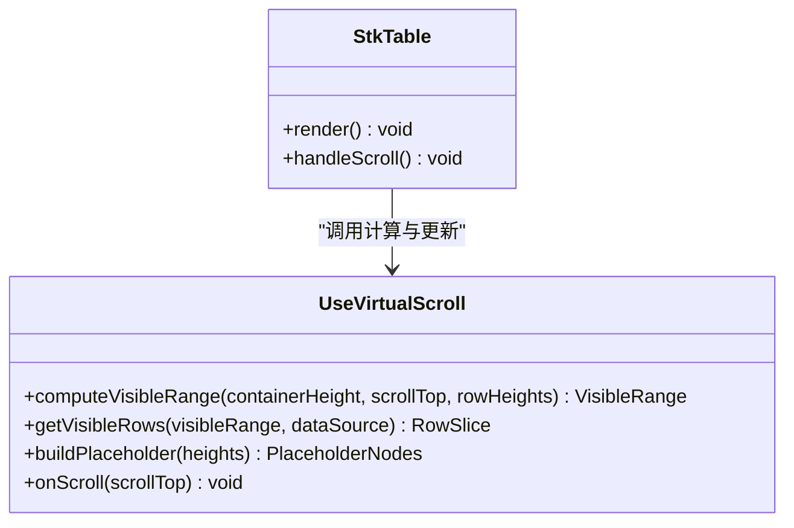
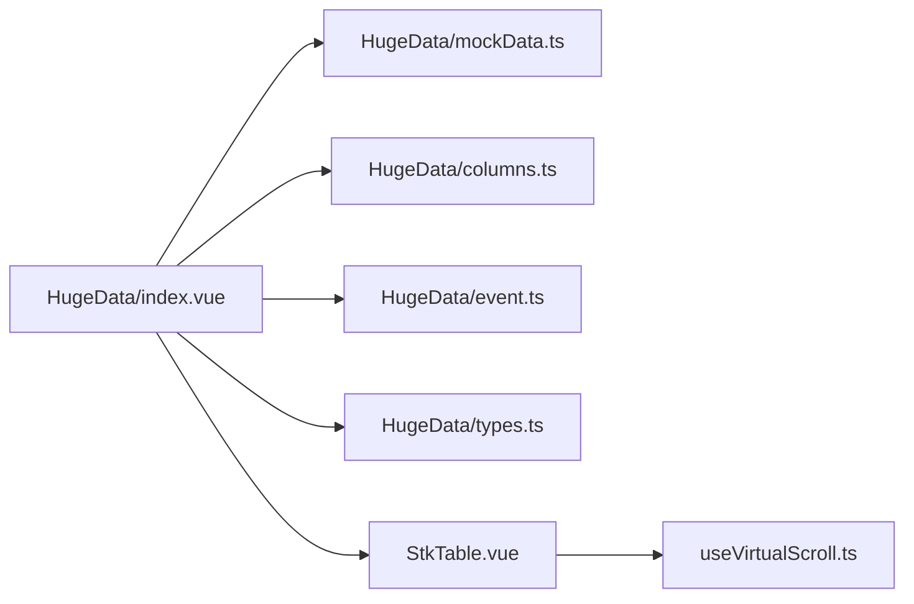

# 大数据量处理

<cite>
**本文引用的文件**   
- [HugeData/index.vue](file://docs-demo/demos/HugeData/index.vue)
- [HugeData/mockData.ts](file://docs-demo/demos/HugeData/mockData.ts)
- [HugeData/columns.ts](file://docs-demo/demos/HugeData/columns.ts)
- [HugeData/event.ts](file://docs-demo/demos/HugeData/event.ts)
- [HugeData/types.ts](file://docs-demo/demos/HugeData/types.ts)
- [useVirtualScroll.ts](file://src/StkTable/useVirtualScroll.ts)
- [StkTable.vue](file://src/StkTable/StkTable.vue)
- [virtual.md](file://docs-src/main/table/advanced/virtual.md)
- [optimize.md](file://docs-src/main/other/optimize.md)
- [tips.md](file://docs-src/main/other/tips.md)
</cite>

## 目录
1. [简介](#简介)
2. [项目结构](#项目结构)
3. [核心组件](#核心组件)
4. [架构总览](#架构总览)
5. [详细组件分析](#详细组件分析)
6. [依赖关系分析](#依赖关系分析)
7. [性能考量](#性能考量)
8. [故障排查指南](#故障排查指南)
9. [结论](#结论)
10. [附录](#附录)

## 简介
本指南面向在 stk-table-vue 中处理百万级数据场景的开发者，聚焦以下目标：
- 数据分页、懒加载与增量渲染策略
- mockData.ts 的数据生成与优化方法
- HugeData 示例的最佳实践
- 内存管理（缓存、垃圾回收、泄漏防护）
- 大数据场景下的性能监控指标与调优方法

## 项目结构
围绕大数据能力，仓库包含演示与文档两部分关键内容：
- docs-demo/demos/HugeData：百万级数据的演示实现，包含数据生成、列定义、事件处理与类型声明
- src/StkTable：表格核心实现，包含虚拟滚动等关键能力
- docs-src：官方文档，包含虚拟滚动与优化建议

图表来源
- [HugeData/index.vue](file://docs-demo/demos/HugeData/index.vue)
- [HugeData/mockData.ts](file://docs-demo/demos/HugeData/mockData.ts)
- [HugeData/columns.ts](file://docs-demo/demos/HugeData/columns.ts)
- [HugeData/event.ts](file://docs-demo/demos/HugeData/event.ts)
- [HugeData/types.ts](file://docs-demo/demos/HugeData/types.ts)
- [StkTable.vue](file://src/StkTable/StkTable.vue)
- [useVirtualScroll.ts](file://src/StkTable/useVirtualScroll.ts)
- [virtual.md](file://docs-src/main/table/advanced/virtual.md)
- [optimize.md](file://docs-src/main/other/optimize.md)
- [tips.md](file://docs-src/main/other/tips.md)

章节来源
- [HugeData/index.vue](file://docs-demo/demos/HugeData/index.vue)
- [HugeData/mockData.ts](file://docs-demo/demos/HugeData/mockData.ts)
- [HugeData/columns.ts](file://docs-demo/demos/HugeData/columns.ts)
- [HugeData/event.ts](file://docs-demo/demos/HugeData/event.ts)
- [HugeData/types.ts](file://docs-demo/demos/HugeData/types.ts)
- [StkTable.vue](file://src/StkTable/StkTable.vue)
- [useVirtualScroll.ts](file://src/StkTable/useVirtualScroll.ts)
- [virtual.md](file://docs-src/main/table/advanced/virtual.md)
- [optimize.md](file://docs-src/main/other/optimize.md)
- [tips.md](file://docs-src/main/other/tips.md)

## 核心组件
- 虚拟滚动（useVirtualScroll.ts）：仅渲染可视区域行，显著降低 DOM 节点数量与重排开销
- 主表组件（StkTable.vue）：整合列、排序、固定列、合并单元格等功能，并与虚拟滚动协同工作
- HugeData 演示（index.vue + mockData.ts + columns.ts + event.ts + types.ts）：展示百万级数据加载、分页、懒加载与交互流程

章节来源
- [useVirtualScroll.ts](file://src/StkTable/useVirtualScroll.ts)
- [StkTable.vue](file://src/StkTable/StkTable.vue)
- [HugeData/index.vue](file://docs-demo/demos/HugeData/index.vue)
- [HugeData/mockData.ts](file://docs-demo/demos/HugeData/mockData.ts)
- [HugeData/columns.ts](file://docs-demo/demos/HugeData/columns.ts)
- [HugeData/event.ts](file://docs-demo/demos/HugeData/event.ts)
- [HugeData/types.ts](file://docs-demo/demos/HugeData/types.ts)

## 架构总览
下图展示了从用户操作到数据渲染的关键路径，以及虚拟滚动如何减少渲染压力。

图表来源
- [HugeData/index.vue](file://docs-demo/demos/HugeData/index.vue)
- [StkTable.vue](file://src/StkTable/StkTable.vue)
- [useVirtualScroll.ts](file://src/StkTable/useVirtualScroll.ts)
- [HugeData/mockData.ts](file://docs-demo/demos/HugeData/mockData.ts)

## 详细组件分析

### 百万级数据渲染流程（HugeData 示例）
- 数据源：通过 mockData.ts 按页或分块生成数据，避免一次性构建全量对象
- 列定义：columns.ts 定义列结构与渲染器，尽量使用轻量插槽与纯函数
- 事件处理：event.ts 集中处理排序、选择、展开等交互，避免在渲染路径上执行重逻辑
- 类型约束：types.ts 明确数据结构，便于静态检查与重构

图表来源
- [HugeData/index.vue](file://docs-demo/demos/HugeData/index.vue)
- [HugeData/mockData.ts](file://docs-demo/demos/HugeData/mockData.ts)
- [HugeData/columns.ts](file://docs-demo/demos/HugeData/columns.ts)
- [HugeData/event.ts](file://docs-demo/demos/HugeData/event.ts)
- [useVirtualScroll.ts](file://src/StkTable/useVirtualScroll.ts)

章节来源
- [HugeData/index.vue](file://docs-demo/demos/HugeData/index.vue)
- [HugeData/mockData.ts](file://docs-demo/demos/HugeData/mockData.ts)
- [HugeData/columns.ts](file://docs-demo/demos/HugeData/columns.ts)
- [HugeData/event.ts](file://docs-demo/demos/HugeData/event.ts)
- [HugeData/types.ts](file://docs-demo/demos/HugeData/types.ts)
- [useVirtualScroll.ts](file://src/StkTable/useVirtualScroll.ts)

### 虚拟滚动机制（useVirtualScroll.ts）
- 可视区间计算：基于容器高度、行高与滚动偏移，确定首尾可见索引
- 占位高度：为不可见区域生成占位元素，保持滚动条比例正确
- 增量更新：滚动时仅更新可见行映射，避免全量重渲染
- 边界处理：处理动态行高、固定列与合并单元格的兼容

图表来源
- [useVirtualScroll.ts](file://src/StkTable/useVirtualScroll.ts)
- [StkTable.vue](file://src/StkTable/StkTable.vue)

章节来源
- [useVirtualScroll.ts](file://src/StkTable/useVirtualScroll.ts)
- [StkTable.vue](file://src/StkTable/StkTable.vue)

### 数据生成与优化（mockData.ts）
- 分块生成：按页或批次生成数据，避免一次性创建百万级对象
- 惰性字段：仅在需要时计算或附加字段，减少初始内存占用
- 去重与复用：对重复值进行引用复用，降低 GC 压力
- 可预测性：保证相同输入产生相同输出，便于缓存与测试

章节来源
- [HugeData/mockData.ts](file://docs-demo/demos/HugeData/mockData.ts)

### 列与事件（columns.ts / event.ts）
- 列渲染：优先使用轻量插槽与纯函数，避免复杂计算放入渲染路径
- 事件解耦：将排序、选择、展开等逻辑集中在 event.ts，减少组件耦合
- 性能提示：避免在列渲染中执行 I/O 或同步阻塞操作

章节来源
- [HugeData/columns.ts](file://docs-demo/demos/HugeData/columns.ts)
- [HugeData/event.ts](file://docs-demo/demos/HugeData/event.ts)

### 类型与契约（types.ts）
- 数据结构：明确每行字段类型与可选性，提升可读性与稳定性
- 接口约定：统一列配置与事件回调签名，便于扩展与维护

章节来源
- [HugeData/types.ts](file://docs-demo/demos/HugeData/types.ts)

## 依赖关系分析
- 演示层依赖：HugeData/index.vue 依赖 mockData.ts、columns.ts、event.ts、types.ts
- 核心层依赖：StkTable.vue 依赖 useVirtualScroll.ts 提供虚拟滚动能力
- 文档参考：virtual.md、optimize.md、tips.md 提供最佳实践与注意事项

图表来源
- [HugeData/index.vue](file://docs-demo/demos/HugeData/index.vue)
- [HugeData/mockData.ts](file://docs-demo/demos/HugeData/mockData.ts)
- [HugeData/columns.ts](file://docs-demo/demos/HugeData/columns.ts)
- [HugeData/event.ts](file://docs-demo/demos/HugeData/event.ts)
- [HugeData/types.ts](file://docs-demo/demos/HugeData/types.ts)
- [StkTable.vue](file://src/StkTable/StkTable.vue)
- [useVirtualScroll.ts](file://src/StkTable/useVirtualScroll.ts)

章节来源
- [HugeData/index.vue](file://docs-demo/demos/HugeData/index.vue)
- [StkTable.vue](file://src/StkTable/StkTable.vue)
- [useVirtualScroll.ts](file://src/StkTable/useVirtualScroll.ts)

## 性能考量
- 分页与懒加载
  - 服务端分页：每次只拉取当前页数据，避免全量传输
  - 客户端懒加载：滚动到底部时预加载下一页，平滑过渡
  - 增量渲染：仅更新变化行，避免整表重渲染
- 虚拟滚动
  - 控制可视区行数，合理设置行高与缓冲区
  - 避免动态行高导致的频繁重算
- 数据生成
  - 分批生成与惰性求值，减少峰值内存
  - 复用常量与短字符串，降低 GC 频率
- 渲染优化
  - 列渲染函数保持纯函数化，避免副作用
  - 使用稳定的 key，减少不必要的重建
- 监控指标
  - FPS、长任务时长、主线程阻塞时间
  - 内存快照对比（堆大小、对象数量）
  - 滚动帧率与重绘次数

章节来源
- [virtual.md](file://docs-src/main/table/advanced/virtual.md)
- [optimize.md](file://docs-src/main/other/optimize.md)
- [tips.md](file://docs-src/main/other/tips.md)

## 故障排查指南
- 卡顿与掉帧
  - 检查是否在全量数据上进行排序/筛选
  - 确认虚拟滚动参数（行高、缓冲区）是否合理
- 内存泄漏
  - 确保事件监听在组件销毁时移除
  - 避免闭包持有大对象引用
- 滚动异常
  - 校验占位高度是否与真实行高一致
  - 检查固定列与合并单元格对可视区计算的影响
- 数据不一致
  - 验证分页参数与后端返回一致性
  - 检查缓存键是否唯一且稳定

章节来源
- [optimize.md](file://docs-src/main/other/optimize.md)
- [tips.md](file://docs-src/main/other/tips.md)

## 结论
在百万级数据场景下，stk-table-vue 通过虚拟滚动、分页与懒加载的组合策略，有效降低渲染与内存压力。配合合理的 mock 数据生成、轻量列渲染与严格的事件解耦，可实现流畅的用户体验。持续的性能监控与内存管理是保障长期稳定性的关键。

## 附录
- 推荐实践清单
  - 始终启用虚拟滚动并合理配置行高
  - 采用服务端分页与客户端预加载
  - 将重逻辑移出渲染路径
  - 使用稳定 key 与纯函数渲染
  - 定期采集内存快照与 FPS，定位瓶颈
- 相关文档
  - 虚拟滚动：[virtual.md](file://docs-src/main/table/advanced/virtual.md)
  - 优化建议：[optimize.md](file://docs-src/main/other/optimize.md)
  - 实用技巧：[tips.md](file://docs-src/main/other/tips.md)