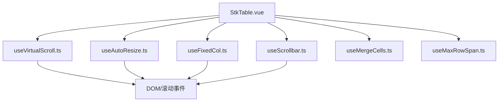
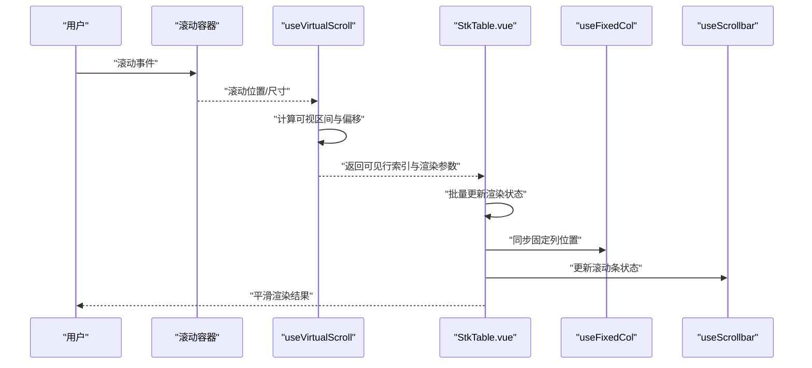
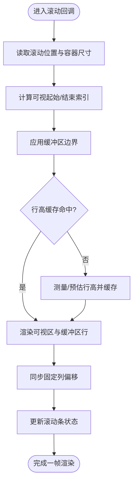
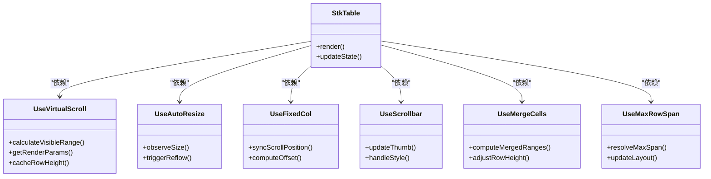

# 性能优化

<cite>
**本文引用的文件**   
- [src/StkTable/useVirtualScroll.ts](file://src/StkTable/useVirtualScroll.ts)
- [src/StkTable/StkTable.vue](file://src/StkTable/StkTable.vue)
- [src/StkTable/useAutoResize.ts](file://src/StkTable/useAutoResize.ts)
- [src/StkTable/useFixedCol.ts](file://src/StkTable/useFixedCol.ts)
- [src/StkTable/useScrollbar.ts](file://src/StkTable/useScrollbar.ts)
- [src/StkTable/useMaxRowSpan.ts](file://src/StkTable/useMaxRowSpan.ts)
- [src/StkTable/useMergeCells.ts](file://src/StkTable/useMergeCells.ts)
- [docs-demo/demos/HugeData/index.vue](file://docs-demo/demos/HugeData/index.vue)
- [docs-demo/demos/LazyLoad/index.vue](file://docs-demo/demos/LazyLoad/index.vue)
- [docs-demo/advanced/virtual/VirtualX.vue](file://docs-demo/advanced/virtual/VirtualX.vue)
- [docs-demo/advanced/virtual/VirtualY.vue](file://docs-demo/advanced/virtual/VirtualY.vue)
- [docs-demo/basic/fixed/FixedVirtual.vue](file://docs-demo/basic/fixed/FixedVirtual.vue)
- [docs-demo/basic/tree/TreeVirtualList.vue](file://docs-demo/basic/tree/TreeVirtualList.vue)
- [docs-src/main/table/advanced/optimize.md](file://docs-src/main/table/advanced/optimize.md)
</cite>

## 目录
1. [简介](#简介)
2. [项目结构](#项目结构)
3. [核心组件](#核心组件)
4. [架构总览](#架构总览)
5. [详细组件分析](#详细组件分析)
6. [依赖关系分析](#依赖关系分析)
7. [性能考量](#性能考量)
8. [故障排查指南](#故障排查指南)
9. [结论](#结论)
10. [附录](#附录)

## 简介
本指南面向使用 stk-table-vue 的开发者，聚焦大数据量场景下的渲染与交互性能。内容涵盖虚拟滚动原理、数据分页与懒加载策略、内存管理与防抖节流、浏览器兼容性与移动端适配、渲染性能提升技巧，以及大型应用的架构建议与基准测试方法。通过结合源码分析与最佳实践，帮助你在保证功能完整性的前提下，获得稳定流畅的用户体验。

## 项目结构
stk-table-vue 的核心能力由多个组合式 Hook 与 Vue 组件协同实现：
- 虚拟滚动：useVirtualScroll.ts 负责可视区域行计算、偏移与增量渲染
- 自适应尺寸：useAutoResize.ts 监听容器尺寸变化，触发重排
- 固定列：useFixedCol.ts 处理左右固定列布局与同步滚动
- 滚动条：useScrollbar.ts 管理滚动条样式与行为
- 合并单元格与最大行跨度：useMergeCells.ts、useMaxRowSpan.ts 影响行高与布局
- 主表组件：StkTable.vue 聚合上述能力并暴露 API

图表来源
- [src/StkTable/StkTable.vue](file://src/StkTable/StkTable.vue)
- [src/StkTable/useVirtualScroll.ts](file://src/StkTable/useVirtualScroll.ts)
- [src/StkTable/useAutoResize.ts](file://src/StkTable/useAutoResize.ts)
- [src/StkTable/useFixedCol.ts](file://src/StkTable/useFixedCol.ts)
- [src/StkTable/useScrollbar.ts](file://src/StkTable/useScrollbar.ts)
- [src/StkTable/useMergeCells.ts](file://src/StkTable/useMergeCells.ts)
- [src/StkTable/useMaxRowSpan.ts](file://src/StkTable/useMaxRowSpan.ts)

章节来源
- [src/StkTable/StkTable.vue](file://src/StkTable/StkTable.vue)
- [src/StkTable/useVirtualScroll.ts](file://src/StkTable/useVirtualScroll.ts)

## 核心组件
- 虚拟滚动（useVirtualScroll）
  - 作用：根据容器高度与行高估算可视范围，仅渲染可见及缓冲区的行，显著降低 DOM 节点数量与重绘压力
  - 关键点：滚动位置采样、可视区间计算、行高缓存、增量更新
- 自适应尺寸（useAutoResize）
  - 作用：监听容器尺寸变化，避免频繁全量重算；在必要时触发局部重排
- 固定列（useFixedCol）
  - 作用：将首尾列固定在视口两侧，保持横向滚动时关键信息可见
- 滚动条（useScrollbar）
  - 作用：统一滚动条样式与行为，减少跨浏览器差异带来的抖动
- 合并单元格与最大行跨度（useMergeCells、useMaxRowSpan）
  - 作用：合并单元格会影响行高与布局，需配合虚拟滚动进行行高预估与修正

章节来源
- [src/StkTable/useVirtualScroll.ts](file://src/StkTable/useVirtualScroll.ts)
- [src/StkTable/useAutoResize.ts](file://src/StkTable/useAutoResize.ts)
- [src/StkTable/useFixedCol.ts](file://src/StkTable/useFixedCol.ts)
- [src/StkTable/useScrollbar.ts](file://src/StkTable/useScrollbar.ts)
- [src/StkTable/useMergeCells.ts](file://src/StkTable/useMergeCells.ts)
- [src/StkTable/useMaxRowSpan.ts](file://src/StkTable/useMaxRowSpan.ts)

## 架构总览
下图展示了虚拟滚动在表格中的整体调用链与数据流：用户滚动触发事件，虚拟滚动模块计算可视区间，主组件按需渲染行，固定列与滚动条协同保证布局一致性。

图表来源
- [src/StkTable/useVirtualScroll.ts](file://src/StkTable/useVirtualScroll.ts)
- [src/StkTable/StkTable.vue](file://src/StkTable/StkTable.vue)
- [src/StkTable/useFixedCol.ts](file://src/StkTable/useFixedCol.ts)
- [src/StkTable/useScrollbar.ts](file://src/StkTable/useScrollbar.ts)

## 详细组件分析

### 虚拟滚动（useVirtualScroll）深度解析
- 原理要点
  - 基于容器高度与行高估算可视起始/结束索引
  - 维护“缓冲区”以覆盖滚动过程中的过渡帧，减少闪烁
  - 行高缓存与动态行高修正（如合并单元格、展开行）
  - 增量渲染：仅对可视区与缓冲区内的行执行渲染
- 性能调优策略
  - 合理设置缓冲区大小，平衡内存占用与滚动流畅度
  - 行高预估优先，避免频繁测量导致回流
  - 合并单元格与复杂单元格需提前计算行高或延迟测量
  - 使用 requestAnimationFrame 或微任务批处理更新，避免阻塞主线程
- 常见问题
  - 行高不一致导致错位：需确保行高预估准确或在变更后重新计算
  - 固定列与虚拟滚动冲突：需同步滚动位置与偏移计算
  - 大数据量下内存增长：及时释放不可见行的引用与缓存

图表来源
- [src/StkTable/useVirtualScroll.ts](file://src/StkTable/useVirtualScroll.ts)

章节来源
- [src/StkTable/useVirtualScroll.ts](file://src/StkTable/useVirtualScroll.ts)

### 大数据量处理最佳实践
- 数据分页
  - 服务端分页：按页请求数据，减少前端内存占用
  - 客户端分页：对已加载数据进行本地分页，适合中等规模数据
- 懒加载
  - 滚动到可视区再加载详情或子树数据
  - 预取下一页数据，提升翻页体验
- 内存管理
  - 及时释放不可见行的引用与缓存
  - 避免闭包持有大对象引用
  - 使用弱引用或池化技术复用对象
- 示例参考
  - 大数据演示：[docs-demo/demos/HugeData/index.vue](file://docs-demo/demos/HugeData/index.vue)
  - 懒加载演示：[docs-demo/demos/LazyLoad/index.vue](file://docs-demo/demos/LazyLoad/index.vue)

章节来源
- [docs-demo/demos/HugeData/index.vue](file://docs-demo/demos/HugeData/index.vue)
- [docs-demo/demos/LazyLoad/index.vue](file://docs-demo/demos/LazyLoad/index.vue)

### 浏览器兼容性与移动端适配
- 兼容性
  - 滚动事件与尺寸监听在不同浏览器存在差异，建议使用统一的 polyfill 或特性检测
  - 滚动条样式与行为需做降级处理，避免影响可访问性
- 移动端
  - 触摸滚动与惯性滚动需特殊处理，避免与虚拟滚动冲突
  - 屏幕密度与 DPR 影响行高测量，需考虑缩放与像素对齐
- 示例参考
  - 固定列+虚拟滚动：[docs-demo/basic/fixed/FixedVirtual.vue](file://docs-demo/basic/fixed/FixedVirtual.vue)
  - 树形列表虚拟滚动：[docs-demo/basic/tree/TreeVirtualList.vue](file://docs-demo/basic/tree/TreeVirtualList.vue)

章节来源
- [docs-demo/basic/fixed/FixedVirtual.vue](file://docs-demo/basic/fixed/FixedVirtual.vue)
- [docs-demo/basic/tree/TreeVirtualList.vue](file://docs-demo/basic/tree/TreeVirtualList.vue)

### 渲染性能提升关键技术点
- 行高预估与缓存
  - 首次渲染前预估行高，避免频繁测量
  - 合并单元格与展开行需单独处理行高
- 增量更新与批处理
  - 使用批量更新减少重排次数
  - 利用 Vue 的响应式优化（如 v-memo、computed 缓存）
- 固定列与滚动条协同
  - 固定列偏移与滚动位置同步，避免视觉抖动
  - 滚动条样式与行为统一，减少跨浏览器差异
- 示例参考
  - 横向虚拟滚动：[docs-demo/advanced/virtual/VirtualX.vue](file://docs-demo/advanced/virtual/VirtualX.vue)
  - 纵向虚拟滚动：[docs-demo/advanced/virtual/VirtualY.vue](file://docs-demo/advanced/virtual/VirtualY.vue)

章节来源
- [docs-demo/advanced/virtual/VirtualX.vue](file://docs-demo/advanced/virtual/VirtualX.vue)
- [docs-demo/advanced/virtual/VirtualY.vue](file://docs-demo/advanced/virtual/VirtualY.vue)

## 依赖关系分析
虚拟滚动与表格其他模块的耦合关系如下：
- StkTable.vue 作为入口，聚合 useVirtualScroll、useAutoResize、useFixedCol、useScrollbar 等能力
- useVirtualScroll 依赖 DOM 滚动事件与尺寸信息，输出可视区间与渲染参数
- useFixedCol 与 useScrollbar 需要与虚拟滚动的偏移计算保持一致，避免布局错乱
- useMergeCells 与 useMaxRowSpan 影响行高预估，需在虚拟滚动中参与行高计算

图表来源
- [src/StkTable/StkTable.vue](file://src/StkTable/StkTable.vue)
- [src/StkTable/useVirtualScroll.ts](file://src/StkTable/useVirtualScroll.ts)
- [src/StkTable/useAutoResize.ts](file://src/StkTable/useAutoResize.ts)
- [src/StkTable/useFixedCol.ts](file://src/StkTable/useFixedCol.ts)
- [src/StkTable/useScrollbar.ts](file://src/StkTable/useScrollbar.ts)
- [src/StkTable/useMergeCells.ts](file://src/StkTable/useMergeCells.ts)
- [src/StkTable/useMaxRowSpan.ts](file://src/StkTable/useMaxRowSpan.ts)

章节来源
- [src/StkTable/StkTable.vue](file://src/StkTable/StkTable.vue)
- [src/StkTable/useVirtualScroll.ts](file://src/StkTable/useVirtualScroll.ts)

## 性能考量
- 虚拟滚动缓冲区大小
  - 过小：滚动过程中可能出现闪烁
  - 过大：内存占用增加，影响低端设备性能
  - 建议：根据设备性能与数据量动态调整
- 行高测量与缓存
  - 避免在高频回调中进行 DOM 测量
  - 使用预估行高并在必要时修正
- 合并单元格与复杂单元格
  - 提前计算行高或延迟测量，减少重排
- 固定列与滚动条
  - 同步滚动位置与偏移，避免视觉抖动
- 内存管理
  - 及时释放不可见行的引用与缓存
  - 避免闭包持有大对象引用

章节来源
- [src/StkTable/useVirtualScroll.ts](file://src/StkTable/useVirtualScroll.ts)
- [src/StkTable/useMergeCells.ts](file://src/StkTable/useMergeCells.ts)
- [src/StkTable/useMaxRowSpan.ts](file://src/StkTable/useMaxRowSpan.ts)

## 故障排查指南
- 常见症状
  - 滚动卡顿：检查虚拟滚动缓冲区与行高缓存
  - 行错位：确认行高预估是否准确，尤其是合并单元格与展开行
  - 固定列抖动：核对固定列偏移与滚动位置同步逻辑
  - 内存泄漏：检查闭包引用与未释放的缓存
- 调试工具
  - 浏览器性能面板：记录滚动帧与主线程占用
  - 内存快照：定位未释放的大对象与闭包引用
  - 日志埋点：在滚动回调与渲染阶段输出关键指标
- 参考文档
  - 优化指南：[docs-src/main/table/advanced/optimize.md](file://docs-src/main/table/advanced/optimize.md)

章节来源
- [docs-src/main/table/advanced/optimize.md](file://docs-src/main/table/advanced/optimize.md)

## 结论
通过合理的虚拟滚动实现、数据分页与懒加载策略、内存管理与渲染优化，stk-table-vue 能够在大数据量场景下提供流畅稳定的用户体验。建议在开发过程中持续监控性能指标，结合业务需求调整缓冲区大小、行高预估与缓存策略，确保在不同设备与浏览器上的一致性表现。

## 附录
- 基准测试建议
  - 构建不同数据规模的测试用例（如 1k、10k、100k 行）
  - 记录首屏渲染时间、滚动 FPS、内存占用峰值
  - 对比开启/关闭虚拟滚动与不同缓冲区大小的性能差异
- 架构建议
  - 将数据加载与渲染解耦，支持分页与懒加载
  - 使用 Worker 或 WebAssembly 处理复杂计算，避免阻塞主线程
  - 为大型表格提供配置开关，允许按需启用高级特性