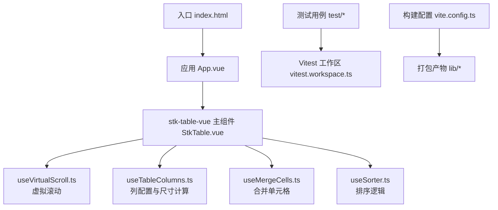
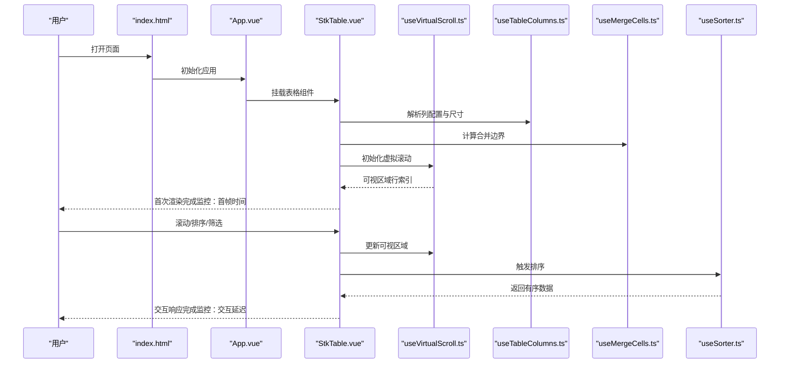
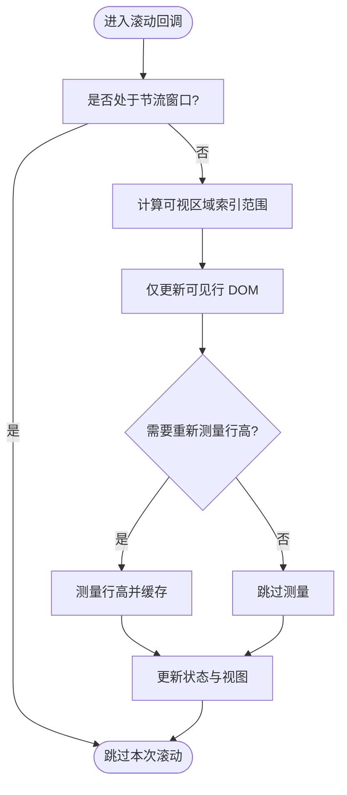
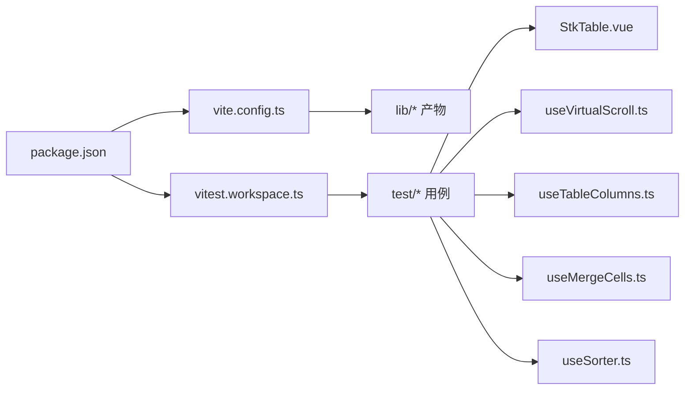

# 性能监控与分析

<cite>
**本文引用的文件**   
- [package.json](file://package.json)
- [vite.config.ts](file://vite.config.ts)
- [vitest.workspace.ts](file://vitest.workspace.ts)
- [StkTable.vue](file://src/StkTable/StkTable.vue)
- [useVirtualScroll.ts](file://src/StkTable/useVirtualScroll.ts)
- [useTableColumns.ts](file://src/StkTable/useTableColumns.ts)
- [useMergeCells.ts](file://src/StkTable/useMergeCells.ts)
- [useSorter.ts](file://src/StkTable/useSorter.ts)
- [index.html](file://index.html)
- [App.vue](file://App.vue)
- [StkTableHugeData.vue](file://test/StkTableHugeData.vue)
- [StkTable.browser.test.js](file://test/StkTable.browser.test.js)
- [defaultSort.test.js](file://test/defaultSort.test.js)
- [formatNumber.test.ts](file://test/formatNumber.test.ts)
- [insertToOrderedArray.test.js](file://test/insertToOrderedArray.test.js)
- [setSorter.test.js](file://test/setSorter.test.js)
</cite>

## 目录
1. [简介](#简介)
2. [项目结构](#项目结构)
3. [核心组件](#核心组件)
4. [架构总览](#架构总览)
5. [详细组件分析](#详细组件分析)
6. [依赖分析](#依赖分析)
7. [性能注意事项](#性能注意事项)
8. [故障排查指南](#故障排查指南)
9. [结论](#结论)
10. [附录](#附录)

## 简介
本指南面向 stk-table-vue 的使用者与贡献者，系统讲解如何在浏览器开发者工具中进行性能分析与优化，包括 Performance、Memory、Network 面板的实战技巧；如何集成第三方性能监控库（如 Web Vitals、Lighthouse）；以及如何定义与采集自定义性能指标（渲染时间、内存使用、交互响应等），并编写自动化性能测试与回归检测。文档同时结合仓库中的虚拟滚动、列计算、合并单元格、排序等关键实现，给出可落地的优化建议与验证方法。

## 项目结构
本项目采用 Vue 3 + Vite 构建，核心表格组件位于 src/StkTable，配套大量 hooks 用于虚拟滚动、列宽计算、合并单元格、排序等功能；测试用例位于 test 目录，使用 Vitest；文档示例位于 docs-demo 与 docs-src。

图表来源 
- [index.html:1-200](file://index.html#L1-L200)
- [App.vue:1-200](file://App.vue#L1-L200)
- [StkTable.vue:1-200](file://src/StkTable/StkTable.vue#L1-L200)
- [useVirtualScroll.ts:1-200](file://src/StkTable/useVirtualScroll.ts#L1-L200)
- [useTableColumns.ts:1-200](file://src/StkTable/useTableColumns.ts#L1-L200)
- [useMergeCells.ts:1-200](file://src/StkTable/useMergeCells.ts#L1-L200)
- [useSorter.ts:1-200](file://src/StkTable/useSorter.ts#L1-L200)
- [vitest.workspace.ts:1-200](file://vitest.workspace.ts#L1-L200)
- [vite.config.ts:1-200](file://vite.config.ts#L1-L200)

章节来源
- [package.json:1-200](file://package.json#L1-L200)
- [vite.config.ts:1-200](file://vite.config.ts#L1-L200)
- [vitest.workspace.ts:1-200](file://vitest.workspace.ts#L1-L200)

## 核心组件
- StkTable.vue：表格主组件，聚合各项能力（虚拟滚动、列管理、合并单元格、排序、拖拽等）。
- useVirtualScroll.ts：负责可视区域行计算、滚动事件处理与 DOM 更新策略。
- useTableColumns.ts：列配置解析、列宽计算与自适应布局。
- useMergeCells.ts：合并单元格边界计算与渲染优化。
- useSorter.ts：排序算法与数据重排逻辑。

章节来源
- [StkTable.vue:1-200](file://src/StkTable/StkTable.vue#L1-L200)
- [useVirtualScroll.ts:1-200](file://src/StkTable/useVirtualScroll.ts#L1-L200)
- [useTableColumns.ts:1-200](file://src/StkTable/useTableColumns.ts#L1-L200)
- [useMergeCells.ts:1-200](file://src/StkTable/useMergeCells.ts#L1-L200)
- [useSorter.ts:1-200](file://src/StkTable/useSorter.ts#L1-L200)

## 架构总览
下图展示了从页面加载到表格渲染的关键路径，以及性能监控点（标记为“监控”）的位置。

图表来源 
- [index.html:1-200](file://index.html#L1-L200)
- [App.vue:1-200](file://App.vue#L1-L200)
- [StkTable.vue:1-200](file://src/StkTable/StkTable.vue#L1-L200)
- [useVirtualScroll.ts:1-200](file://src/StkTable/useVirtualScroll.ts#L1-L200)
- [useTableColumns.ts:1-200](file://src/StkTable/useTableColumns.ts#L1-L200)
- [useMergeCells.ts:1-200](file://src/StkTable/useMergeCells.ts#L1-L200)
- [useSorter.ts:1-200](file://src/StkTable/useSorter.ts#L1-L200)

## 详细组件分析

### 虚拟滚动（useVirtualScroll.ts）
- 职责：根据容器高度与行高估算可视区域，监听滚动事件，仅渲染可见行，减少 DOM 节点数量。
- 性能关键点：
  - 滚动节流/防抖：避免高频滚动导致频繁重排。
  - 行高缓存：对固定行高或测量后的行高进行缓存，降低重复测量开销。
  - 增量更新：只更新变化区域的 DOM，避免全量重建。
- 监控点：
  - 首次渲染耗时（从挂载到首帧绘制）。
  - 滚动帧率（FPS）与长任务（Long Task）占比。
  - 内存峰值（在大数据集场景下尤为关键）。

图表来源 
- [useVirtualScroll.ts:1-200](file://src/StkTable/useVirtualScroll.ts#L1-L200)

章节来源
- [useVirtualScroll.ts:1-200](file://src/StkTable/useVirtualScroll.ts#L1-L200)

### 列管理与尺寸计算（useTableColumns.ts）
- 职责：解析列配置、计算列宽、处理自适应与固定列。
- 性能关键点：
  - 列宽计算缓存：避免重复计算相同配置的列宽。
  - 文本测量优化：对超长文本使用截断或省略策略，减少测量成本。
  - 固定列布局：合理拆分固定与可变区域，降低重排范围。
- 监控点：
  - 列宽计算耗时。
  - 重排次数与持续时间。

章节来源
- [useTableColumns.ts:1-200](file://src/StkTable/useTableColumns.ts#L1-L200)

### 合并单元格（useMergeCells.ts）
- 职责：计算合并边界，生成合并映射，影响渲染与选择行为。
- 性能关键点：
  - 合并边界计算复杂度控制，避免 O(n^2) 的暴力匹配。
  - 增量更新：数据变化时仅重算受影响区域。
- 监控点：
  - 合并计算耗时。
  - 渲染帧时长。

章节来源
- [useMergeCells.ts:1-200](file://src/StkTable/useMergeCells.ts#L1-L200)

### 排序（useSorter.ts）
- 职责：执行排序逻辑，支持多字段、自定义比较器。
- 性能关键点：
  - 稳定排序算法，避免不必要的数组拷贝。
  - 缓存排序结果，仅在数据或规则变化时重算。
- 监控点：
  - 排序耗时。
  - 排序后首次渲染耗时。

章节来源
- [useSorter.ts:1-200](file://src/StkTable/useSorter.ts#L1-L200)

### 主组件（StkTable.vue）
- 职责：协调各 hooks，提供统一 API，处理事件分发与状态同步。
- 性能关键点：
  - 事件去抖与批量更新，减少多次 re-render。
  - 按需加载功能模块，避免无关逻辑阻塞首屏。
- 监控点：
  - 组件挂载耗时。
  - 事件处理端到端延迟。

章节来源
- [StkTable.vue:1-200](file://src/StkTable/StkTable.vue#L1-L200)

## 依赖分析
- 构建与运行：Vite 作为开发服务器与打包工具，Vue 3 运行时驱动组件渲染。
- 测试：Vitest 工作区组织单元测试与浏览器测试，便于性能回归。
- 示例与文档：docs-demo 与 docs-src 提供演示与文档站点。

图表来源 
- [package.json:1-200](file://package.json#L1-L200)
- [vite.config.ts:1-200](file://vite.config.ts#L1-L200)
- [vitest.workspace.ts:1-200](file://vitest.workspace.ts#L1-L200)
- [StkTable.vue:1-200](file://src/StkTable/StkTable.vue#L1-L200)
- [useVirtualScroll.ts:1-200](file://src/StkTable/useVirtualScroll.ts#L1-L200)
- [useTableColumns.ts:1-200](file://src/StkTable/useTableColumns.ts#L1-L200)
- [useMergeCells.ts:1-200](file://src/StkTable/useMergeCells.ts#L1-L200)
- [useSorter.ts:1-200](file://src/StkTable/useSorter.ts#L1-L200)

章节来源
- [package.json:1-200](file://package.json#L1-L200)
- [vite.config.ts:1-200](file://vite.config.ts#L1-L200)
- [vitest.workspace.ts:1-200](file://vitest.workspace.ts#L1-L200)

## 性能注意事项
- 浏览器开发者工具
  - Performance 面板：录制滚动、排序、筛选等操作，关注 FPS、长任务、脚本执行时间与布局抖动。
  - Memory 面板：使用堆快照对比不同操作前后内存占用，定位潜在泄漏。
  - Network 面板：检查资源加载顺序与体积，确保静态资源与代码分割合理。
- 第三方监控
  - Web Vitals：采集 LCP、FID、CLS 等核心指标，结合上报平台形成趋势。
  - Lighthouse：定期扫描构建产物或线上地址，获取性能评分与建议。
- 自定义指标
  - 渲染时间：从组件挂载到首帧绘制的时间差。
  - 内存使用：通过 performance.memory 或 DevTools API 采样。
  - 交互响应：从用户事件到 UI 更新的端到端延迟。
- 大数据与虚拟化
  - 合理设置视口大小与行高缓存，避免频繁测量。
  - 对复杂单元格内容做懒渲染与占位策略。
- 排序与合并
  - 使用稳定且高效的排序算法，避免深拷贝大对象。
  - 合并边界计算增量更新，限制重算范围。

[本节为通用指导，不直接分析具体文件]

## 故障排查指南
- 常见症状
  - 滚动卡顿：检查滚动回调是否节流、是否存在长任务或强制同步布局。
  - 内存增长：查看堆快照中未释放的闭包、事件监听器与 DOM 引用。
  - 首屏慢：分析网络请求与 JS 执行时间，确认是否加载了非必要模块。
- 定位步骤
  - 使用 Performance 录制问题场景，识别热点函数与调用栈。
  - 使用 Memory 对比快照，查找持续增长的对象与引用链。
  - 使用 Network 过滤 XHR/Fetch，确认接口耗时与重试策略。
- 回归检测
  - 基于 Vitest 编写性能基准用例，记录关键指标阈值，CI 中自动失败告警。
  - 使用 Lighthouse CI 定期扫描，防止性能退化。

章节来源
- [StkTable.browser.test.js:1-200](file://test/StkTable.browser.test.js#L1-L200)
- [defaultSort.test.js:1-200](file://test/defaultSort.test.js#L1-L200)
- [formatNumber.test.ts:1-200](file://test/formatNumber.test.ts#L1-L200)
- [insertToOrderedArray.test.js:1-200](file://test/insertToOrderedArray.test.js#L1-L200)
- [setSorter.test.js:1-200](file://test/setSorter.test.js#L1-L200)

## 结论
通过对浏览器开发者工具的熟练运用与第三方监控库的集成，结合 stk-table-vue 的核心实现（虚拟滚动、列管理、合并单元格、排序），可以系统化地采集与优化关键性能指标。建议在开发阶段即建立性能基线与回归检测，持续跟踪与改进，确保在大体量数据与复杂交互场景下的流畅体验。

[本节为总结性内容，不直接分析具体文件]

## 附录

### 使用浏览器开发者工具进行性能分析
- Performance 面板
  - 开启“录制”，模拟典型用户流程（滚动、排序、筛选）。
  - 关注 FPS、脚本执行、布局与绘制阶段，识别长任务与强制同步布局。
- Memory 面板
  - 使用“堆快照”对比操作前后内存差异，定位未释放引用。
  - 使用“Allocation instrumentation”捕获分配热点。
- Network 面板
  - 过滤 XHR/Fetch，分析接口耗时与重试策略。
  - 检查资源压缩与缓存策略，优化首屏加载。

[本节为通用指导，不直接分析具体文件]

### 集成第三方性能监控库
- Web Vitals
  - 引入库并采集 LCP、FID、CLS 等指标。
  - 将指标上报至监控平台，形成趋势与告警。
- Lighthouse
  - 本地或 CI 环境运行审计，获取性能评分与建议。
  - 定期扫描线上地址，持续改进。

[本节为通用指导，不直接分析具体文件]

### 自定义性能指标的定义与收集
- 渲染时间
  - 从组件挂载到首帧绘制的时间差，可通过 requestAnimationFrame 与性能时间戳计算。
- 内存使用
  - 使用 performance.memory 或 DevTools API 采样，记录峰值与均值。
- 交互响应
  - 从用户事件到 UI 更新的端到端延迟，结合事件监听与渲染完成回调统计。

[本节为通用指导，不直接分析具体文件]

### 性能测试用例与自动化回归
- 基准测试
  - 使用 Vitest 编写性能基准用例，记录关键指标（渲染时间、内存峰值、FPS）。
  - 设定阈值，超出阈值则失败并告警。
- 浏览器测试
  - 使用 Puppeteer/Playwright 模拟真实用户操作，采集性能指标。
- CI 集成
  - 在流水线中运行性能测试与 Lighthouse 审计，阻止性能退化提交。

章节来源
- [vitest.workspace.ts:1-200](file://vitest.workspace.ts#L1-L200)
- [StkTable.browser.test.js:1-200](file://test/StkTable.browser.test.js#L1-L200)
- [defaultSort.test.js:1-200](file://test/defaultSort.test.js#L1-L200)
- [formatNumber.test.ts:1-200](file://test/formatNumber.test.ts#L1-L200)
- [insertToOrderedArray.test.js:1-200](file://test/insertToOrderedArray.test.js#L1-L200)
- [setSorter.test.js:1-200](file://test/setSorter.test.js#L1-L200)

### 针对大数据场景的优化建议
- 使用 StkTableHugeData.vue 作为参考，观察大数据渲染与交互的性能表现。
- 启用虚拟滚动与懒加载，减少初始渲染压力。
- 对复杂单元格内容进行分页或异步加载。

章节来源
- [StkTableHugeData.vue:1-200](file://test/StkTableHugeData.vue#L1-L200)