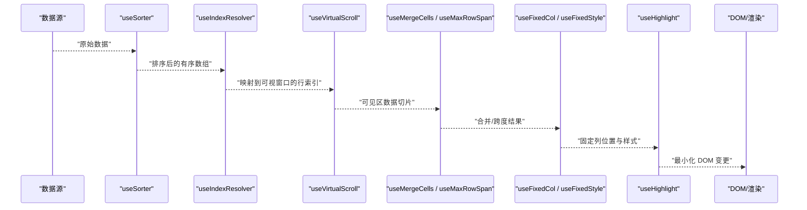
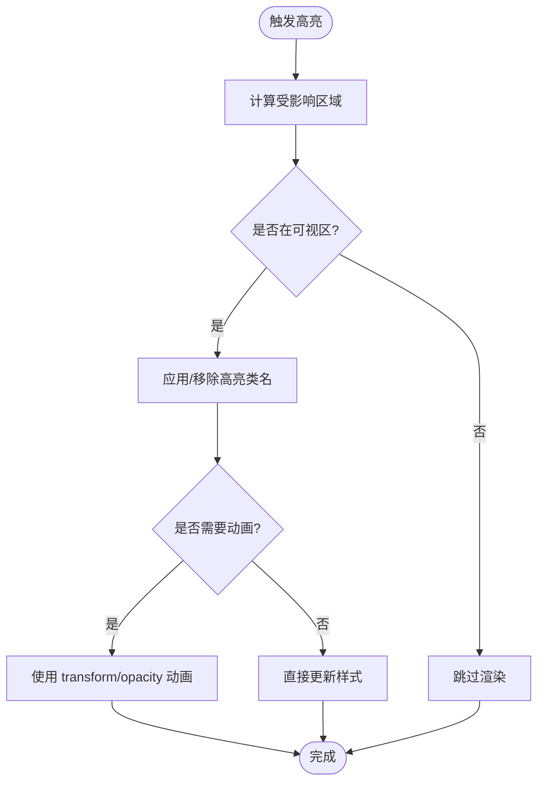
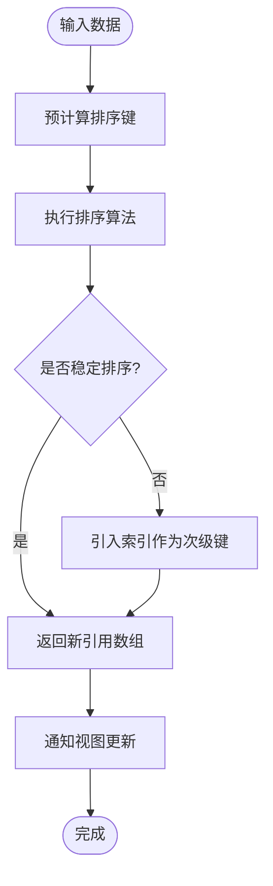
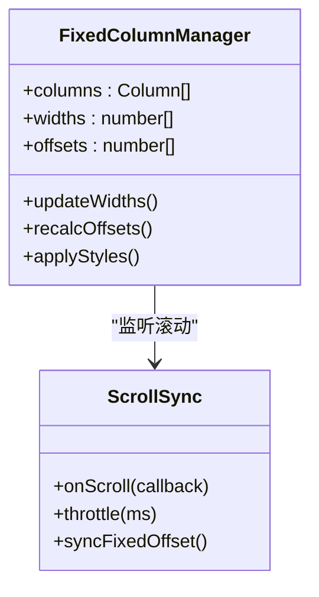
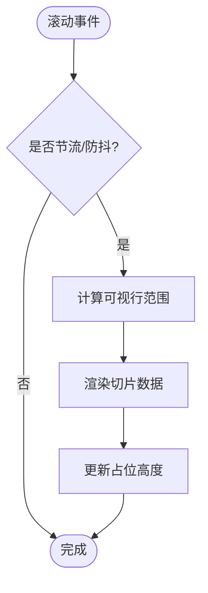
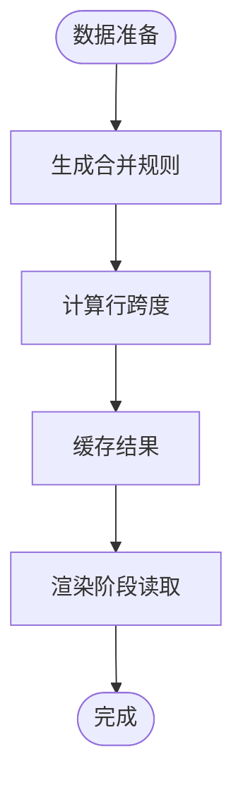
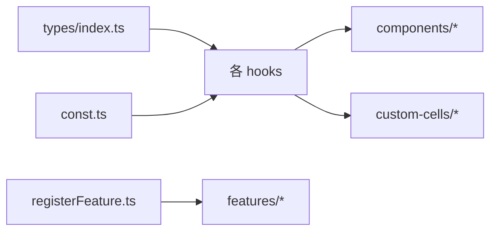

# 渲染性能优化

<cite>
**本文引用的文件**   
- [src/StkTable/useHighlight.ts](file://src/StkTable/useHighlight.ts)
- [src/StkTable/useSorter.ts](file://src/StkTable/useSorter.ts)
- [src/StkTable/useFixedCol.ts](file://src/StkTable/useFixedCol.ts)
- [src/StkTable/useVirtualScroll.ts](file://src/StkTable/useVirtualScroll.ts)
- [src/StkTable/useMergeCells.ts](file://src/StkTable/useMergeCells.ts)
- [src/StkTable/useMaxRowSpan.ts](file://src/StkTable/useMaxRowSpan.ts)
- [src/StkTable/useTableColumns.ts](file://src/StkTable/useTableColumns.ts)
- [src/StkTable/useAutoResize.ts](file://src/StkTable/useAutoResize.ts)
- [src/StkTable/useScrollbar.ts](file://src/StkTable/useScrollbar.ts)
- [src/StkTable/useThDrag.ts](file://src/StkTable/useThDrag.ts)
- [src/StkTable/useTrDrag.ts](file://src/StkTable/useTrDrag.ts)
- [src/StkTable/useTree.ts](file://src/StkTable/useTree.ts)
- [src/StkTable/useKeyboardArrowScroll.ts](file://src/StkTable/useKeyboardArrowScroll.ts)
- [src/StkTable/useWheeling.ts](file://src/StkTable/useWheeling.ts)
- [src/StkTable/useIndexResolver.ts](file://src/StkTable/useIndexResolver.ts)
- [src/StkTable/useGetFixedColPosition.ts](file://src/StkTable/useGetFixedColPosition.ts)
- [src/StkTable/useFixedStyle.ts](file://src/StkTable/useFixedStyle.ts)
- [src/StkTable/components/TreeNodeCell.vue](file://src/StkTable/components/TreeNodeCell.vue)
- [src/StkTable/custom-cells/FilterCell/Filter.vue](file://src/StkTable/custom-cells/FilterCell/Filter.vue)
- [src/StkTable/custom-cells/EditableCell/EditableCell.vue](file://src/StkTable/custom-cells/EditableCell/EditableCell.vue)
- [src/StkTable/custom-cells/CheckboxCell/CheckboxCell.vue](file://src/StkTable/custom-cells/CheckboxCell/CheckboxCell.vue)
- [src/StkTable/custom-cells/NumberCell/index.ts](file://src/StkTable/custom-cells/NumberCell/index.ts)
- [src/StkTable/custom-cells/ChangeCell/createChangeCell.ts](file://src/StkTable/custom-cells/ChangeCell/createChangeCell.ts)
- [src/StkTable/custom-cells/FilterCell/createFilterCell.ts](file://src/StkTable/custom-cells/FilterCell/createFilterCell.ts)
- [src/StkTable/custom-cells/EditableCell/createEditableCell.ts](file://src/StkTable/custom-cells/EditableCell/createEditableCell.ts)
- [src/StkTable/custom-cells/CheckboxCell/createCheckboxCell.ts](file://src/StkTable/custom-cells/CheckboxCell/createCheckboxCell.ts)
- [src/StkTable/utils/useTriggerRef.ts](file://src/StkTable/utils/useTriggerRef.ts)
- [src/StkTable/utils/constRefUtils.ts](file://src/StkTable/utils/constRefUtils.ts)
- [src/StkTable/types/index.ts](file://src/StkTable/types/index.ts)
- [src/StkTable/types/highlightDimOptions.ts](file://src/StkTable/types/highlightDimOptions.ts)
- [src/StkTable/const.ts](file://src/StkTable/const.ts)
- [src/StkTable/registerFeature.ts](file://src/StkTable/registerFeature.ts)
- [src/StkTable/features/useAreaSelection.ts](file://src/StkTable/features/useAreaSelection.ts)
- [docs-demo/advanced/highlight/HighlightBase.vue](file://docs-demo/advanced/highlight/HighlightBase.vue)
- [docs-demo/advanced/highlight/HighlightAnimation.vue](file://docs-demo/advanced/highlight/HighlightAnimation.vue)
- [docs-demo/advanced/highlight/HighlightCss.vue](file://docs-demo/advanced/highlight/HighlightCss.vue)
- [docs-demo/advanced/virtual/VirtualX.vue](file://docs-demo/advanced/virtual/VirtualX.vue)
- [docs-demo/advanced/virtual/VirtualY.vue](file://docs-demo/advanced/virtual/VirtualY.vue)
- [docs-demo/demos/HugeData/index.vue](file://docs-demo/demos/HugeData/index.vue)
</cite>

## 目录
1. [简介](#简介)
2. [项目结构](#项目结构)
3. [核心组件与模块](#核心组件与模块)
4. [架构总览](#架构总览)
5. [关键渲染路径与优化策略](#关键渲染路径与优化策略)
6. [useHighlight.ts 渲染优化分析](#usehighlightts-渲染优化分析)
7. [useSorter.ts 排序与渲染优化](#usesorterts-排序与渲染优化)
8. [useFixedCol.ts 固定列与重绘控制](#usefixedcolts-固定列与重绘控制)
9. [虚拟滚动与批量更新](#虚拟滚动与批量更新)
10. [合并单元格与行高计算](#合并单元格与行高计算)
11. [Vue 3 响应式系统优化技巧](#vue-3-响应式系统优化技巧)
12. [浏览器渲染机制与跨浏览器兼容](#浏览器渲染机制与跨浏览器兼容)
13. [依赖关系分析](#依赖关系分析)
14. [性能考量与基准建议](#性能考量与基准建议)
15. [故障排查指南](#故障排查指南)
16. [结论](#结论)
17. [附录：示例与参考](#附录示例与参考)

## 简介
本指南聚焦 stk-table-vue 的表格渲染性能优化，围绕 DOM 操作、重绘重排减少、批量更新策略展开，深入剖析 useHighlight.ts、useSorter.ts、useFixedCol.ts 等关键模块的实现思路与优化点。同时结合 Vue 3 响应式系统（computed、watch、组件拆分）给出可落地的实践建议，并补充浏览器渲染机制分析与跨浏览器兼容性策略，帮助在大数据量、复杂交互场景下获得稳定流畅的表格体验。

## 项目结构
stk-table-vue 采用“功能钩子 + 组件”的组织方式：核心渲染逻辑被拆分为多个 hooks（如 useVirtualScroll、useSorter、useFixedCol、useHighlight 等），通过组合式 API 在 StkTable 主组件中聚合；自定义单元格与高级特性以插件化形式注册。该结构天然支持按需启用、细粒度优化与独立测试。

```mermaid
graph TB
ST["StkTable 主组件"] --> VS["useVirtualScroll<br/>虚拟滚动"]
ST --> SC["useSorter<br/>排序"]
ST --> FC["useFixedCol<br/>固定列"]
ST --> HL["useHighlight<br/>高亮"]
ST --> MC["useMergeCells<br/>合并单元格"]
ST --> MS["useMaxRowSpan<br/>最大行跨度"]
ST --> TC["useTableColumns<br/>列配置"]
ST --> AR["useAutoResize<br/>自适应尺寸"]
ST --> SB["useScrollbar<br/>滚动条"]
ST --> THD["useThDrag<br/>表头拖拽"]
ST --> TRD["useTrDrag<br/>行拖拽"]
ST --> TREE["useTree<br/>树形数据"]
ST --> KAS["useKeyboardArrowScroll<br/>键盘导航"]
ST --> WHEEL["useWheeling<br/>滚轮节流"]
ST --> IR["useIndexResolver<br/>索引解析"]
ST --> GFCP["useGetFixedColPosition<br/>固定列定位"]
ST --> FST["useFixedStyle<br/>固定样式"]
```

图表来源
- [src/StkTable/useVirtualScroll.ts](file://src/StkTable/useVirtualScroll.ts)
- [src/StkTable/useSorter.ts](file://src/StkTable/useSorter.ts)
- [src/StkTable/useFixedCol.ts](file://src/StkTable/useFixedCol.ts)
- [src/StkTable/useHighlight.ts](file://src/StkTable/useHighlight.ts)
- [src/StkTable/useMergeCells.ts](file://src/StkTable/useMergeCells.ts)
- [src/StkTable/useMaxRowSpan.ts](file://src/StkTable/useMaxRowSpan.ts)
- [src/StkTable/useTableColumns.ts](file://src/StkTable/useTableColumns.ts)
- [src/StkTable/useAutoResize.ts](file://src/StkTable/useAutoResize.ts)
- [src/StkTable/useScrollbar.ts](file://src/StkTable/useScrollbar.ts)
- [src/StkTable/useThDrag.ts](file://src/StkTable/useThDrag.ts)
- [src/StkTable/useTrDrag.ts](file://src/StkTable/useTrDrag.ts)
- [src/StkTable/useTree.ts](file://src/StkTable/useTree.ts)
- [src/StkTable/useKeyboardArrowScroll.ts](file://src/StkTable/useKeyboardArrowScroll.ts)
- [src/StkTable/useWheeling.ts](file://src/StkTable/useWheeling.ts)
- [src/StkTable/useIndexResolver.ts](file://src/StkTable/useIndexResolver.ts)
- [src/StkTable/useGetFixedColPosition.ts](file://src/StkTable/useGetFixedColPosition.ts)
- [src/StkTable/useFixedStyle.ts](file://src/StkTable/useFixedStyle.ts)

章节来源
- [src/StkTable/useVirtualScroll.ts](file://src/StkTable/useVirtualScroll.ts)
- [src/StkTable/useSorter.ts](file://src/StkTable/useSorter.ts)
- [src/StkTable/useFixedCol.ts](file://src/StkTable/useFixedCol.ts)
- [src/StkTable/useHighlight.ts](file://src/StkTable/useHighlight.ts)

## 核心组件与模块
- 虚拟滚动：按可视区域渲染可见行列，避免全量 DOM 生成。
- 排序：对数据进行不可变排序，配合 computed 派生视图层，减少不必要的重渲染。
- 固定列：通过分层布局与样式隔离，降低重排范围。
- 高亮：基于最小变更集与 CSS 类切换，避免整行重绘。
- 合并单元格与行跨度：预计算布局信息，减少运行时计算开销。
- 列配置与自适应：缓存列宽、延迟测量，避免频繁 reflow。
- 滚动与交互：节流/防抖、事件委托、增量更新。

章节来源
- [src/StkTable/useVirtualScroll.ts](file://src/StkTable/useVirtualScroll.ts)
- [src/StkTable/useSorter.ts](file://src/StkTable/useSorter.ts)
- [src/StkTable/useFixedCol.ts](file://src/StkTable/useFixedCol.ts)
- [src/StkTable/useHighlight.ts](file://src/StkTable/useHighlight.ts)
- [src/StkTable/useMergeCells.ts](file://src/StkTable/useMergeCells.ts)
- [src/StkTable/useMaxRowSpan.ts](file://src/StkTable/useMaxRowSpan.ts)
- [src/StkTable/useTableColumns.ts](file://src/StkTable/useTableColumns.ts)
- [src/StkTable/useAutoResize.ts](file://src/StkTable/useAutoResize.ts)
- [src/StkTable/useScrollbar.ts](file://src/StkTable/useScrollbar.ts)
- [src/StkTable/useThDrag.ts](file://src/StkTable/useThDrag.ts)
- [src/StkTable/useTrDrag.ts](file://src/StkTable/useTrDrag.ts)
- [src/StkTable/useTree.ts](file://src/StkTable/useTree.ts)
- [src/StkTable/useKeyboardArrowScroll.ts](file://src/StkTable/useKeyboardArrowScroll.ts)
- [src/StkTable/useWheeling.ts](file://src/StkTable/useWheeling.ts)
- [src/StkTable/useIndexResolver.ts](file://src/StkTable/useIndexResolver.ts)
- [src/StkTable/useGetFixedColPosition.ts](file://src/StkTable/useGetFixedColPosition.ts)
- [src/StkTable/useFixedStyle.ts](file://src/StkTable/useFixedStyle.ts)

## 架构总览
下图展示了表格渲染的关键路径：数据源进入后，先经排序与索引解析，再根据虚拟滚动窗口裁剪出可见数据；随后进行合并单元格与行跨度计算，最后由固定列与高亮模块完成局部样式与 DOM 更新。

图表来源
- [src/StkTable/useSorter.ts](file://src/StkTable/useSorter.ts)
- [src/StkTable/useIndexResolver.ts](file://src/StkTable/useIndexResolver.ts)
- [src/StkTable/useVirtualScroll.ts](file://src/StkTable/useVirtualScroll.ts)
- [src/StkTable/useMergeCells.ts](file://src/StkTable/useMergeCells.ts)
- [src/StkTable/useMaxRowSpan.ts](file://src/StkTable/useMaxRowSpan.ts)
- [src/StkTable/useFixedCol.ts](file://src/StkTable/useFixedCol.ts)
- [src/StkTable/useFixedStyle.ts](file://src/StkTable/useFixedStyle.ts)
- [src/StkTable/useHighlight.ts](file://src/StkTable/useHighlight.ts)

## 关键渲染路径与优化策略
- 数据不可变更新：排序、过滤、分页等操作返回新引用，便于 Vue 精确追踪变化。
- 计算属性缓存：将昂贵计算（如排序键、合并区间、固定列位置）放入 computed，避免重复计算。
- 可视区裁剪：仅渲染可见行/列，大幅降低 DOM 节点数量。
- 增量更新：使用 key、diff 优化、条件渲染与 v-memo（或等价手段）减少重渲染范围。
- 批量更新：合并多次状态变更，利用 nextTick 或 requestAnimationFrame 统一提交。
- 样式优先：尽量通过 class 切换与 CSS 动画实现视觉反馈，避免直接操作 style。

章节来源
- [src/StkTable/useSorter.ts](file://src/StkTable/useSorter.ts)
- [src/StkTable/useVirtualScroll.ts](file://src/StkTable/useVirtualScroll.ts)
- [src/StkTable/useHighlight.ts](file://src/StkTable/useHighlight.ts)
- [src/StkTable/useFixedCol.ts](file://src/StkTable/useFixedCol.ts)

## useHighlight.ts 渲染优化分析
- 最小变更集：维护高亮集合（如行/列/单元格坐标），仅在变更时更新对应元素，避免整表重绘。
- 样式驱动：通过 class 切换与 CSS 过渡，减少 JS 干预；必要时使用 transform/opacity 触发合成层优化。
- 批处理高亮：高频操作（如筛选、搜索）中使用节流/防抖，合并多次高亮请求。
- 与虚拟滚动协同：仅对可视区内的高亮目标生效，非可视区不创建/更新节点。

图表来源
- [src/StkTable/useHighlight.ts](file://src/StkTable/useHighlight.ts)
- [docs-demo/advanced/highlight/HighlightBase.vue](file://docs-demo/advanced/highlight/HighlightBase.vue)
- [docs-demo/advanced/highlight/HighlightAnimation.vue](file://docs-demo/advanced/highlight/HighlightAnimation.vue)
- [docs-demo/advanced/highlight/HighlightCss.vue](file://docs-demo/advanced/highlight/HighlightCss.vue)

章节来源
- [src/StkTable/useHighlight.ts](file://src/StkTable/useHighlight.ts)
- [docs-demo/advanced/highlight/HighlightBase.vue](file://docs-demo/advanced/highlight/HighlightBase.vue)
- [docs-demo/advanced/highlight/HighlightAnimation.vue](file://docs-demo/advanced/highlight/HighlightAnimation.vue)
- [docs-demo/advanced/highlight/HighlightCss.vue](file://docs-demo/advanced/highlight/HighlightCss.vue)

## useSorter.ts 排序与渲染优化
- 不可变排序：每次排序生成新的有序数组，避免原地修改导致 diff 失效。
- 计算排序键：对需要比较的字段预先计算排序键，减少比较函数中的重复计算。
- 多列排序：维护稳定的排序优先级，保证相同值下的稳定性。
- 与虚拟滚动协作：排序后重新计算可视窗口映射，确保索引正确。

图表来源
- [src/StkTable/useSorter.ts](file://src/StkTable/useSorter.ts)

章节来源
- [src/StkTable/useSorter.ts](file://src/StkTable/useSorter.ts)

## useFixedCol.ts 固定列与重绘控制
- 分层布局：固定列与滚动区域分离，减少滚动时的整体重排。
- 样式隔离：固定列使用绝对定位与 z-index 管理，避免影响其他区域布局。
- 位置计算缓存：固定列宽度与偏移量缓存，避免频繁测量。
- 与滚动同步：滚动事件节流，批量更新固定列偏移，避免每帧重排。

图表来源
- [src/StkTable/useFixedCol.ts](file://src/StkTable/useFixedCol.ts)
- [src/StkTable/useFixedStyle.ts](file://src/StkTable/useFixedStyle.ts)
- [src/StkTable/useGetFixedColPosition.ts](file://src/StkTable/useGetFixedColPosition.ts)

章节来源
- [src/StkTable/useFixedCol.ts](file://src/StkTable/useFixedCol.ts)
- [src/StkTable/useFixedStyle.ts](file://src/StkTable/useFixedStyle.ts)
- [src/StkTable/useGetFixedColPosition.ts](file://src/StkTable/useGetFixedColPosition.ts)

## 虚拟滚动与批量更新
- 可视窗口计算：根据滚动位置与行高估算首尾可见索引，仅渲染该区间。
- 占位容器：使用透明占位保持滚动高度，避免内容抖动。
- 行高策略：固定行高或异步测量行高，避免同步 reflow。
- 批量更新：滚动事件中使用 requestAnimationFrame 或 nextTick 合并多次更新。

图表来源
- [src/StkTable/useVirtualScroll.ts](file://src/StkTable/useVirtualScroll.ts)
- [docs-demo/advanced/virtual/VirtualX.vue](file://docs-demo/advanced/virtual/VirtualX.vue)
- [docs-demo/advanced/virtual/VirtualY.vue](file://docs-demo/advanced/virtual/VirtualY.vue)

章节来源
- [src/StkTable/useVirtualScroll.ts](file://src/StkTable/useVirtualScroll.ts)
- [docs-demo/advanced/virtual/VirtualX.vue](file://docs-demo/advanced/virtual/VirtualX.vue)
- [docs-demo/advanced/virtual/VirtualY.vue](file://docs-demo/advanced/virtual/VirtualY.vue)

## 合并单元格与行高计算
- 预计算合并区间：在数据层生成合并规则，渲染阶段直接读取，避免运行时计算。
- 行跨度优化：合并单元格与最大行跨度联动，减少重复渲染。
- 异步测量：对动态行高使用异步测量与缓存，避免阻塞渲染。

图表来源
- [src/StkTable/useMergeCells.ts](file://src/StkTable/useMergeCells.ts)
- [src/StkTable/useMaxRowSpan.ts](file://src/StkTable/useMaxRowSpan.ts)

章节来源
- [src/StkTable/useMergeCells.ts](file://src/StkTable/useMergeCells.ts)
- [src/StkTable/useMaxRowSpan.ts](file://src/StkTable/useMaxRowSpan.ts)

## Vue 3 响应式系统优化技巧
- computed 使用：将排序键、合并区间、固定列偏移等昂贵计算放入 computed，避免重复计算。
- watch 优化：使用 immediate:false、deep:false，必要时使用 getter 函数限定依赖。
- 组件拆分：将单元格、工具栏、弹窗等拆分为独立组件，缩小 diff 范围。
- 列表渲染优化：为每项提供稳定 key，合理使用 v-if/v-show 与条件渲染。
- 批量更新：使用 nextTick 或 requestAnimationFrame 合并多次状态更新。
- 避免深层响应式：大对象使用 shallowRef/reactive 限制响应式深度。

章节来源
- [src/StkTable/utils/useTriggerRef.ts](file://src/StkTable/utils/useTriggerRef.ts)
- [src/StkTable/utils/constRefUtils.ts](file://src/StkTable/utils/constRefUtils.ts)
- [src/StkTable/types/index.ts](file://src/StkTable/types/index.ts)

## 浏览器渲染机制与跨浏览器兼容
- 渲染管线：JS → Style → Layout → Paint → Composite。尽量减少 Layout 与 Paint 次数。
- 重排优化：批量读写 DOM，避免强制同步布局；使用 transform/opacity 触发合成层。
- 滚动优化：使用 will-change、contain、overflow 等 CSS 提示浏览器优化。
- 兼容性：对旧版浏览器降级（如禁用复杂动画、使用 polyfill 或替代方案）。
- 性能监控：使用 Performance API、Chrome DevTools 的 Rendering 面板定位瓶颈。

章节来源
- [src/StkTable/useAutoResize.ts](file://src/StkTable/useAutoResize.ts)
- [src/StkTable/useScrollbar.ts](file://src/StkTable/useScrollbar.ts)
- [src/StkTable/useWheeling.ts](file://src/StkTable/useWheeling.ts)

## 依赖关系分析
- 低耦合：各 hooks 职责单一，通过 props/events/state 通信，避免强耦合。
- 可选特性：通过 registerFeature 按需启用功能，减少无关代码加载。
- 类型安全：集中定义 types，确保数据结构一致，降低运行时错误。

图表来源
- [src/StkTable/types/index.ts](file://src/StkTable/types/index.ts)
- [src/StkTable/const.ts](file://src/StkTable/const.ts)
- [src/StkTable/registerFeature.ts](file://src/StkTable/registerFeature.ts)
- [src/StkTable/features/useAreaSelection.ts](file://src/StkTable/features/useAreaSelection.ts)

章节来源
- [src/StkTable/types/index.ts](file://src/StkTable/types/index.ts)
- [src/StkTable/const.ts](file://src/StkTable/const.ts)
- [src/StkTable/registerFeature.ts](file://src/StkTable/registerFeature.ts)
- [src/StkTable/features/useAreaSelection.ts](file://src/StkTable/features/useAreaSelection.ts)

## 性能考量与基准建议
- 大数据集：优先启用虚拟滚动，固定行高或异步测量行高。
- 复杂单元格：懒加载与按需渲染，避免重型组件常驻。
- 交互热点：对排序、筛选、拖拽等高频操作做节流/防抖与批量更新。
- 内存管理：及时释放事件监听与定时器，避免泄漏。
- 基准测试：使用 Lighthouse、Performance API 对比优化前后指标（FPS、长任务数、重排次数）。

[本节为通用指导，无需特定文件来源]

## 故障排查指南
- 卡顿问题：检查是否存在同步 layout 读取、频繁 DOM 操作、未节流滚动事件。
- 闪烁问题：确认占位容器高度是否正确、虚拟滚动边界计算是否准确。
- 高亮异常：核对高亮集合与可视区交集计算，避免非可视区更新。
- 固定列错位：检查列宽缓存与偏移量更新时机，确保与滚动同步。
- 排序不稳定：确认次级排序键（如索引）参与排序，保证稳定性。

章节来源
- [src/StkTable/useHighlight.ts](file://src/StkTable/useHighlight.ts)
- [src/StkTable/useFixedCol.ts](file://src/StkTable/useFixedCol.ts)
- [src/StkTable/useSorter.ts](file://src/StkTable/useSorter.ts)
- [src/StkTable/useVirtualScroll.ts](file://src/StkTable/useVirtualScroll.ts)

## 结论
通过模块化 hooks 设计、虚拟滚动、不可变数据流、计算属性缓存与样式驱动的局部更新，stk-table-vue 能够在大数据量与复杂交互场景下保持良好性能。遵循本文的优化策略与最佳实践，可进一步降低重绘重排、提升 FPS，并获得更稳定的用户体验。

[本节为总结性内容，无需特定文件来源]

## 附录：示例与参考
- 高亮示例：基础、动画、CSS 三种实现方式，便于对比选择。
- 虚拟滚动示例：横向与纵向虚拟滚动演示，验证可视区裁剪效果。
- 大数据示例：HugeData 演示页展示百万级数据的渲染能力。

章节来源
- [docs-demo/advanced/highlight/HighlightBase.vue](file://docs-demo/advanced/highlight/HighlightBase.vue)
- [docs-demo/advanced/highlight/HighlightAnimation.vue](file://docs-demo/advanced/highlight/HighlightAnimation.vue)
- [docs-demo/advanced/highlight/HighlightCss.vue](file://docs-demo/advanced/highlight/HighlightCss.vue)
- [docs-demo/advanced/virtual/VirtualX.vue](file://docs-demo/advanced/virtual/VirtualX.vue)
- [docs-demo/advanced/virtual/VirtualY.vue](file://docs-demo/advanced/virtual/VirtualY.vue)
- [docs-demo/demos/HugeData/index.vue](file://docs-demo/demos/HugeData/index.vue)