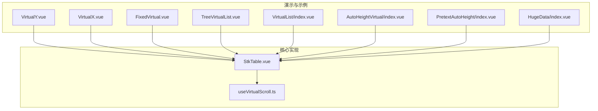
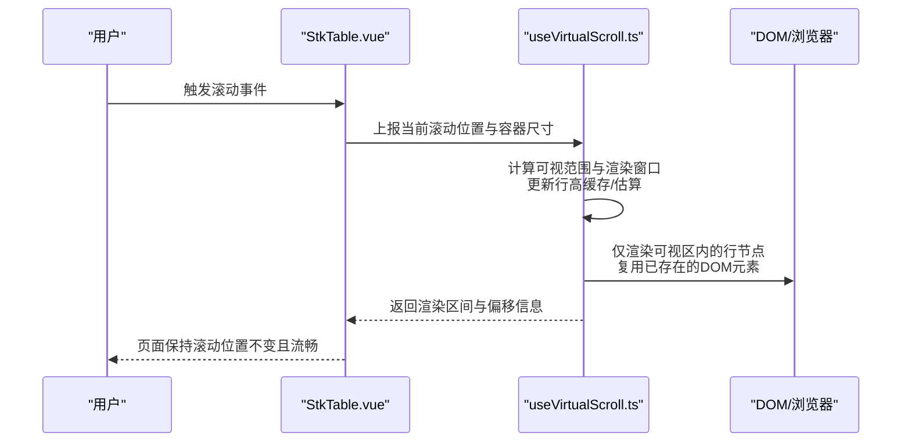
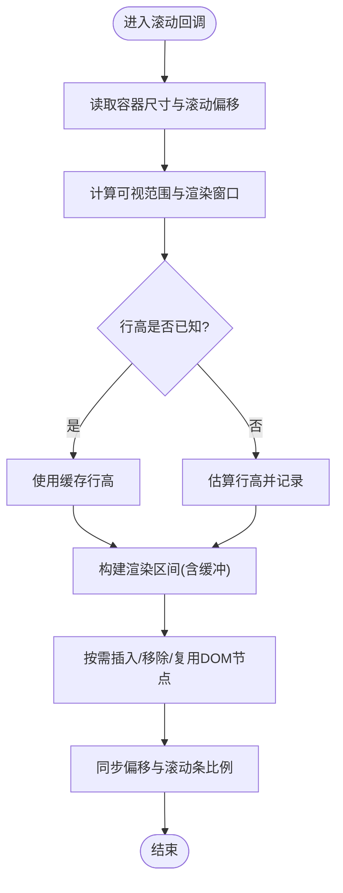
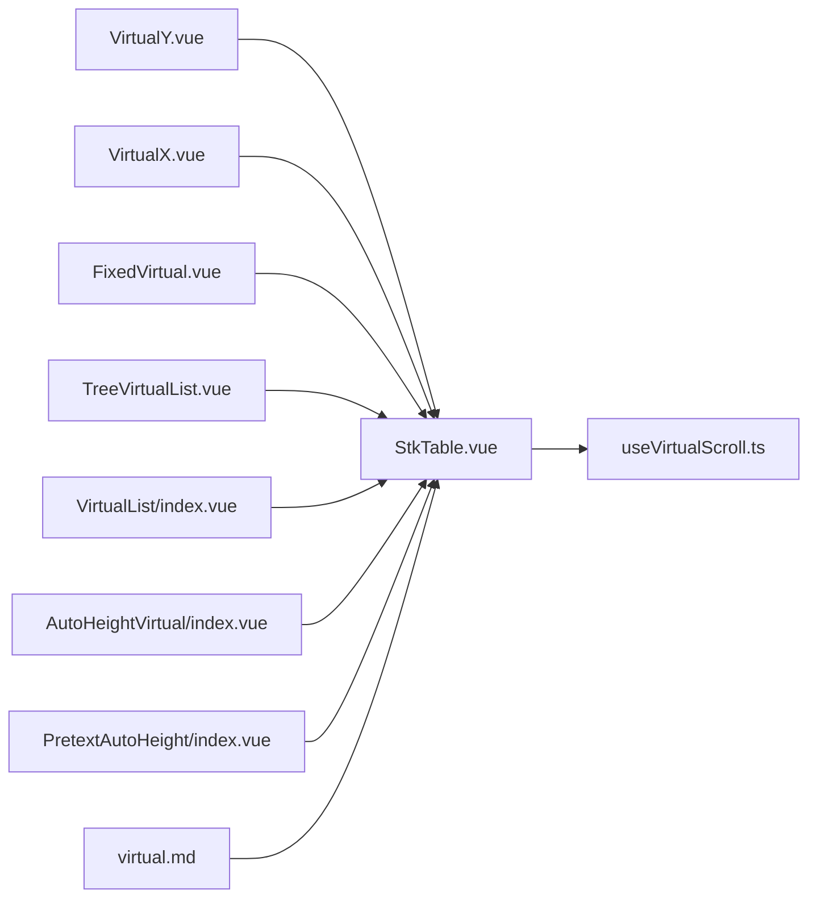

# 虚拟滚动优化

<cite>
**本文引用的文件**   
- [useVirtualScroll.ts](file://src/StkTable/useVirtualScroll.ts)
- [StkTable.vue](file://src/StkTable/StkTable.vue)
- [virtual.md](file://docs-src/main/table/advanced/virtual.md)
- [AutoHeightVirtual/index.vue](file://docs-demo/advanced/auto-height-virtual/AutoHeightVirtual/index.vue)
- [PretextAutoHeight/index.vue](file://docs-demo/advanced/auto-height-virtual/PretextAutoHeight/index.vue)
- [VirtualX.vue](file://docs-demo/advanced/virtual/VirtualX.vue)
- [VirtualY.vue](file://docs-demo/advanced/virtual/VirtualY.vue)
- [FixedVirtual.vue](file://docs-demo/basic/fixed/FixedVirtual.vue)
- [TreeVirtualList.vue](file://docs-demo/basic/tree/TreeVirtualList.vue)
- [VirtualList/index.vue](file://docs-demo/demos/VirtualList/index.vue)
- [VirtualList/Panel.vue](file://docs-demo/demos/VirtualList/Panel.vue)
- [AutoHeightVirtualList/index.vue](file://docs-demo/demos/VirtualList/AutoHeightVirtualList/index.vue)
- [AutoHeightVirtualList/Panel.vue](file://docs-demo/demos/VirtualList/AutoHeightVirtualList/Panel.vue)
- [HugeData/index.vue](file://docs-demo/demos/HugeData/index.vue)
- [HugeData/mockData.ts](file://docs-demo/demos/HugeData/mockData.ts)
- [HugeData/columns.ts](file://docs-demo/demos/HugeData/columns.ts)
</cite>

## 目录
1. [简介](#简介)
2. [项目结构](#项目结构)
3. [核心组件](#核心组件)
4. [架构总览](#架构总览)
5. [详细组件分析](#详细组件分析)
6. [依赖关系分析](#依赖关系分析)
7. [性能考量与调优](#性能考量与调优)
8. [故障排查指南](#故障排查指南)
9. [结论](#结论)
10. [附录](#附录)

## 简介
本文件面向 stk-table-vue 的虚拟滚动能力，系统性阐述其核心原理与实现细节，重点围绕 useVirtualScroll.ts 的行高计算、偏移量管理、渲染窗口控制、滚动事件处理等关键机制。同时给出配置项与调优建议（如缓冲区大小、预加载策略），并结合不同数据规模场景提供性能分析与优化实践，帮助读者在大规模数据表格中稳定获得流畅交互体验。

## 项目结构
stk-table-vue 将虚拟滚动作为独立特性模块组织在 StkTable 目录下，并通过 hooks 形式被主表格组件集成。演示与文档位于 docs-demo 与 docs-src，覆盖基础虚拟滚动、固定列、树形列表、自动高度等多种使用场景。

图表来源
- [StkTable.vue](file://src/StkTable/StkTable.vue)
- [useVirtualScroll.ts](file://src/StkTable/useVirtualScroll.ts)
- [VirtualY.vue](file://docs-demo/advanced/virtual/VirtualY.vue)
- [VirtualX.vue](file://docs-demo/advanced/virtual/VirtualX.vue)
- [FixedVirtual.vue](file://docs-demo/basic/fixed/FixedVirtual.vue)
- [TreeVirtualList.vue](file://docs-demo/basic/tree/TreeVirtualList.vue)
- [VirtualList/index.vue](file://docs-demo/demos/VirtualList/index.vue)
- [AutoHeightVirtual/index.vue](file://docs-demo/advanced/auto-height-virtual/AutoHeightVirtual/index.vue)
- [PretextAutoHeight/index.vue](file://docs-demo/advanced/auto-height-virtual/PretextAutoHeight/index.vue)
- [HugeData/index.vue](file://docs-demo/demos/HugeData/index.vue)

章节来源
- [StkTable.vue](file://src/StkTable/StkTable.vue)
- [useVirtualScroll.ts](file://src/StkTable/useVirtualScroll.ts)
- [virtual.md](file://docs-src/main/table/advanced/virtual.md)

## 核心组件
- useVirtualScroll.ts：虚拟滚动的核心逻辑封装，负责可视区域计算、行高缓存与估算、偏移量与滚动位置同步、渲染窗口边界控制、DOM元素复用与重排最小化。
- StkTable.vue：表格容器，订阅滚动事件并委托给虚拟滚动 hook，协调列宽、固定列、合并单元格等与虚拟滚动相关的布局更新。

章节来源
- [useVirtualScroll.ts](file://src/StkTable/useVirtualScroll.ts)
- [StkTable.vue](file://src/StkTable/StkTable.vue)

## 架构总览
虚拟滚动通过“只渲染可见区域 + 少量缓冲”的策略，将 DOM 节点数量控制在常量级别，从而避免大数据量导致的渲染卡顿。整体流程如下：

图表来源
- [StkTable.vue](file://src/StkTable/StkTable.vue)
- [useVirtualScroll.ts](file://src/StkTable/useVirtualScroll.ts)

## 详细组件分析

### useVirtualScroll.ts 深度解析
该模块是虚拟滚动的中枢，主要职责包括：
- 可视区域计算：基于容器高度、滚动偏移、行高估算，确定首尾可见索引与渲染窗口。
- 行高管理与缓存：维护行高缓存表，支持固定行高、自适应行高与动态测量；对未知行高采用估算与增量修正。
- 偏移量与滚动同步：维持滚动偏移与实际内容高度的映射，确保滚动条比例正确且不抖动。
- 渲染窗口控制：引入缓冲区（前后各若干行）减少频繁重绘；根据滚动速度或阈值调整预加载策略。
- DOM 元素复用：按索引池化管理节点，避免重复创建销毁，降低 GC 压力。
- 事件节流与防抖：对高频滚动事件进行节流/防抖，结合 requestAnimationFrame 批量更新。

关键流程示意（算法级）：

图表来源
- [useVirtualScroll.ts](file://src/StkTable/useVirtualScroll.ts)

章节来源
- [useVirtualScroll.ts](file://src/StkTable/useVirtualScroll.ts)

### StkTable.vue 与虚拟滚动的集成
- 监听滚动事件并将容器尺寸、滚动位置传递给 useVirtualScroll。
- 接收渲染区间后，仅渲染对应行的单元格，保证与列宽、固定列、合并单元格等布局一致。
- 在列宽变化、数据变更、窗口尺寸变化时，触发行高缓存失效与重新计算。

章节来源
- [StkTable.vue](file://src/StkTable/StkTable.vue)

### 典型使用场景与示例
- 基础纵向虚拟滚动：适用于大量行数据的常规表格。
- 横向虚拟滚动：列数极多时的列方向虚拟化。
- 固定列+虚拟滚动：左侧/右侧固定列与可滚动区域的协同。
- 树形列表虚拟滚动：展开/折叠状态下的行高变化与索引映射。
- 自动高度虚拟滚动：行内容高度不固定时的动态测量与缓存。

章节来源
- [VirtualY.vue](file://docs-demo/advanced/virtual/VirtualY.vue)
- [VirtualX.vue](file://docs-demo/advanced/virtual/VirtualX.vue)
- [FixedVirtual.vue](file://docs-demo/basic/fixed/FixedVirtual.vue)
- [TreeVirtualList.vue](file://docs-demo/basic/tree/TreeVirtualList.vue)
- [AutoHeightVirtual/index.vue](file://docs-demo/advanced/auto-height-virtual/AutoHeightVirtual/index.vue)
- [PretextAutoHeight/index.vue](file://docs-demo/advanced/auto-height-virtual/PretextAutoHeight/index.vue)
- [VirtualList/index.vue](file://docs-demo/demos/VirtualList/index.vue)
- [VirtualList/Panel.vue](file://docs-demo/demos/VirtualList/Panel.vue)
- [AutoHeightVirtualList/index.vue](file://docs-demo/demos/VirtualList/AutoHeightVirtualList/index.vue)
- [AutoHeightVirtualList/Panel.vue](file://docs-demo/demos/VirtualList/AutoHeightVirtualList/Panel.vue)

## 依赖关系分析
- StkTable.vue 依赖 useVirtualScroll.ts 提供的虚拟滚动能力。
- 各类演示组件通过 StkTable 间接使用虚拟滚动，展示不同业务场景下的行为差异。
- 文档 virtual.md 提供 API 与配置说明，指导使用者合理设置参数以获得最佳性能。

图表来源
- [StkTable.vue](file://src/StkTable/StkTable.vue)
- [useVirtualScroll.ts](file://src/StkTable/useVirtualScroll.ts)
- [VirtualY.vue](file://docs-demo/advanced/virtual/VirtualY.vue)
- [VirtualX.vue](file://docs-demo/advanced/virtual/VirtualX.vue)
- [FixedVirtual.vue](file://docs-demo/basic/fixed/FixedVirtual.vue)
- [TreeVirtualList.vue](file://docs-demo/basic/tree/TreeVirtualList.vue)
- [VirtualList/index.vue](file://docs-demo/demos/VirtualList/index.vue)
- [AutoHeightVirtual/index.vue](file://docs-demo/advanced/auto-height-virtual/AutoHeightVirtual/index.vue)
- [PretextAutoHeight/index.vue](file://docs-demo/advanced/auto-height-virtual/PretextAutoHeight/index.vue)
- [virtual.md](file://docs-src/main/table/advanced/virtual.md)

章节来源
- [StkTable.vue](file://src/StkTable/StkTable.vue)
- [useVirtualScroll.ts](file://src/StkTable/useVirtualScroll.ts)
- [virtual.md](file://docs-src/main/table/advanced/virtual.md)

## 性能考量与调优

### 核心原理速览
- 可视区域计算：依据容器高度与滚动偏移，快速定位首尾可见行索引。
- DOM 元素复用：以索引为键复用节点，避免频繁创建/销毁。
- 滚动事件处理：节流/防抖 + rAF 批处理，降低主线程压力。
- 行高缓存与估算：固定行高直接命中缓存；自适应行高通过测量与估算逐步收敛。

### 关键配置与调优参数
以下为实践中常用的可调参数类别（具体字段名以实际 API 为准）：
- 缓冲区大小：可视区上下额外渲染的行数，平衡内存与重绘频率。
- 预加载策略：滚动速度阈值触发提前加载，减少空白闪烁。
- 行高模式：固定行高、自适应行高、混合模式（部分固定、部分自适应）。
- 事件节流间隔：滚动事件的节流时间，兼顾响应性与性能。
- 渲染批次：单次最大渲染行数，避免长任务阻塞。
- 缓存上限：行高缓存的最大条目数，防止内存增长。

调优建议：
- 大数据量（万级以上）：增大缓冲区至 3~5 行，启用预加载，限制单批次渲染行数。
- 自适应行高：优先预估常见行高，减少测量次数；对频繁变化的内容使用占位高度。
- 固定列：固定列区域与可滚动区域分离渲染，避免联动重排。
- 树形列表：展开/折叠时局部刷新，避免全量重算。

### 不同数据量场景的性能表现与建议
- 小数据量（数百行）：默认配置即可，关注交互流畅度与动画效果。
- 中等数据量（数千行）：开启行高缓存与适度缓冲，避免每行都测量。
- 大数据量（数万行及以上）：严格限制渲染批次，启用预加载与节流，必要时分页/懒加载。

章节来源
- [virtual.md](file://docs-src/main/table/advanced/virtual.md)
- [HugeData/index.vue](file://docs-demo/demos/HugeData/index.vue)
- [HugeData/mockData.ts](file://docs-demo/demos/HugeData/mockData.ts)
- [HugeData/columns.ts](file://docs-demo/demos/HugeData/columns.ts)

## 故障排查指南
常见问题与定位思路：
- 滚动抖动或跳变：检查行高缓存是否失效、容器尺寸变化是否触发重算、滚动偏移同步是否正确。
- 渲染空白或错位：确认渲染窗口边界计算是否包含足够缓冲，DOM 复用键是否与索引一致。
- 性能回退：审查滚动事件节流间隔、单批次渲染行数、自适应行高的测量频率。
- 固定列错位：核对固定列与可滚动区域的宽度与偏移计算是否同步更新。

排查步骤建议：
- 打开开发者工具 Performance 面板，录制滚动过程，定位长任务与重排。
- 打印渲染区间与行高缓存命中率，评估缓存有效性。
- 对比不同缓冲区大小与节流间隔下的帧率与内存占用。

章节来源
- [useVirtualScroll.ts](file://src/StkTable/useVirtualScroll.ts)
- [StkTable.vue](file://src/StkTable/StkTable.vue)

## 结论
虚拟滚动通过可视区域计算、DOM 元素复用与高效的滚动事件处理，显著降低了大数据量表格的渲染成本。结合合理的行高缓存、缓冲区与预加载策略，可在多种业务场景下取得稳定流畅的体验。建议在开发初期即明确行高模式与数据规模，选择合适的参数组合，并在上线前进行性能基准测试与回归验证。

## 附录
- 相关文档与示例路径：
  - 虚拟滚动使用说明：[virtual.md](file://docs-src/main/table/advanced/virtual.md)
  - 基础纵向/横向虚拟滚动示例：[VirtualY.vue](file://docs-demo/advanced/virtual/VirtualY.vue)、[VirtualX.vue](file://docs-demo/advanced/virtual/VirtualX.vue)
  - 固定列+虚拟滚动示例：[FixedVirtual.vue](file://docs-demo/basic/fixed/FixedVirtual.vue)
  - 树形列表虚拟滚动示例：[TreeVirtualList.vue](file://docs-demo/basic/tree/TreeVirtualList.vue)
  - 自动高度虚拟滚动示例：[AutoHeightVirtual/index.vue](file://docs-demo/advanced/auto-height-virtual/AutoHeightVirtual/index.vue)、[PretextAutoHeight/index.vue](file://docs-demo/advanced/auto-height-virtual/PretextAutoHeight/index.vue)
  - 通用虚拟列表示例：[VirtualList/index.vue](file://docs-demo/demos/VirtualList/index.vue)、[AutoHeightVirtualList/index.vue](file://docs-demo/demos/VirtualList/AutoHeightVirtualList/index.vue)
  - 海量数据示例：[HugeData/index.vue](file://docs-demo/demos/HugeData/index.vue)