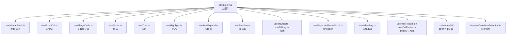
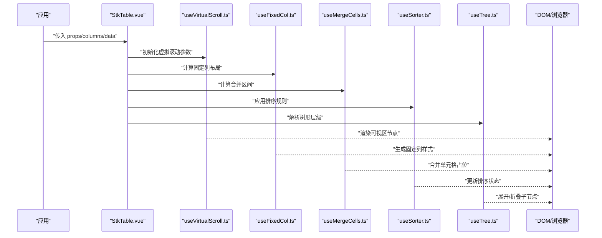

# 故障排除

<cite>
**本文引用的文件**   
- [package.json](file://package.json)
- [vite.config.ts](file://vite.config.ts)
- [src/StkTable/StkTable.vue](file://src/StkTable/StkTable.vue)
- [src/StkTable/index.ts](file://src/StkTable/index.ts)
- [src/StkTable/useVirtualScroll.ts](file://src/StkTable/useVirtualScroll.ts)
- [src/StkTable/useFixedCol.ts](file://src/StkTable/useFixedCol.ts)
- [src/StkTable/useMergeCells.ts](file://src/StkTable/useMergeCells.ts)
- [src/StkTable/useSorter.ts](file://src/StkTable/useSorter.ts)
- [src/StkTable/useTree.ts](file://src/StkTable/useTree.ts)
- [src/StkTable/useHighlight.ts](file://src/StkTable/useHighlight.ts)
- [src/StkTable/useRowExpand.ts](file://src/StkTable/useRowExpand.ts)
- [src/StkTable/useScrollbar.ts](file://src/StkTable/useScrollbar.ts)
- [src/StkTable/useMaxRowSpan.ts](file://src/StkTable/useMaxRowSpan.ts)
- [src/StkTable/useGetFixedColPosition.ts](file://src/StkTable/useGetFixedColPosition.ts)
- [src/StkTable/useThDrag.ts](file://src/StkTable/useThDrag.ts)
- [src/StkTable/useTrDrag.ts](file://src/StkTable/useTrDrag.ts)
- [src/StkTable/useKeyboardArrowScroll.ts](file://src/StkTable/useKeyboardArrowScroll.ts)
- [src/StkTable/useWheeling.ts](file://src/StkTable/useWheeling.ts)
- [src/StkTable/useAutoResize.ts](file://src/StkTable/useAutoResize.ts)
- [src/StkTable/useColResize.ts](file://src/StkTable/useColResize.ts)
- [src/StkTable/custom-cells/FilterCell/createFilterCell.ts](file://src/StkTable/custom-cells/FilterCell/createFilterCell.ts)
- [src/StkTable/custom-cells/EditableCell/createEditableCell.ts](file://src/StkTable/custom-cells/EditableCell/createEditableCell.ts)
- [src/StkTable/custom-cells/CheckboxCell/createCheckboxCell.ts](file://src/StkTable/custom-cells/CheckboxCell/createCheckboxCell.ts)
- [src/StkTable/custom-cells/ChangeCell/createChangeCell.ts](file://src/StkTable/custom-cells/ChangeCell/createChangeCell.ts)
- [src/StkTable/custom-cells/NumberCell/createNumberCell.ts](file://src/StkTable/custom-cells/NumberCell/createNumberCell.ts)
- [src/StkTable/features/useAreaSelection.ts](file://src/StkTable/features/useAreaSelection.ts)
- [test/StkTable.browser.test.js](file://test/StkTable.browser.test.js)
- [test/defaultSort.test.js](file://test/defaultSort.test.js)
- [test/formatNumber.test.ts](file://test/formatNumber.test.ts)
- [test/insertToOrderedArray.test.js](file://test/insertToOrderedArray.test.js)
- [test/setSorter.test.js](file://test/setSorter.test.js)
- [docs-src/main/other/qa.md](file://docs-src/main/other/qa.md)
</cite>

## 目录
1. [简介](#简介)
2. [项目结构](#项目结构)
3. [核心组件](#核心组件)
4. [架构总览](#架构总览)
5. [详细组件分析](#详细组件分析)
6. [依赖分析](#依赖分析)
7. [性能注意事项](#性能注意事项)
8. [故障排除指南](#故障排除指南)
9. [结论](#结论)
10. [附录](#附录)

## 简介
本指南面向使用 stk-table-vue 的开发者与实施人员，聚焦安装、配置、运行时异常等常见问题的定位与解决，提供可操作的调试步骤、诊断工具使用方法以及性能优化建议。内容基于仓库中的源码与测试用例归纳整理，旨在帮助用户快速自助排障，降低技术支持成本。

## 项目结构
stk-table-vue 采用模块化设计：
- 核心表格组件位于 src/StkTable，包含主组件与多个组合式 Hook（useXxx），分别负责虚拟滚动、固定列、合并单元格、排序、树形、高亮、展开行、滚动条、拖拽、键盘导航等功能。
- 自定义单元格实现位于 custom-cells，提供筛选、编辑、复选框、数值格式化等常用能力。
- 特性扩展位于 features，如区域选择。
- 构建与开发配置在 vite.config.ts 与 package.json 中。
- 测试覆盖浏览器行为与关键算法，便于回归验证。

图表来源
- [src/StkTable/StkTable.vue](file://src/StkTable/StkTable.vue)
- [src/StkTable/useVirtualScroll.ts](file://src/StkTable/useVirtualScroll.ts)
- [src/StkTable/useFixedCol.ts](file://src/StkTable/useFixedCol.ts)
- [src/StkTable/useMergeCells.ts](file://src/StkTable/useMergeCells.ts)
- [src/StkTable/useSorter.ts](file://src/StkTable/useSorter.ts)
- [src/StkTable/useTree.ts](file://src/StkTable/useTree.ts)
- [src/StkTable/useHighlight.ts](file://src/StkTable/useHighlight.ts)
- [src/StkTable/useRowExpand.ts](file://src/StkTable/useRowExpand.ts)
- [src/StkTable/useScrollbar.ts](file://src/StkTable/useScrollbar.ts)
- [src/StkTable/useThDrag.ts](file://src/StkTable/useThDrag.ts)
- [src/StkTable/useTrDrag.ts](file://src/StkTable/useTrDrag.ts)
- [src/StkTable/useKeyboardArrowScroll.ts](file://src/StkTable/useKeyboardArrowScroll.ts)
- [src/StkTable/useWheeling.ts](file://src/StkTable/useWheeling.ts)
- [src/StkTable/useAutoResize.ts](file://src/StkTable/useAutoResize.ts)
- [src/StkTable/useColResize.ts](file://src/StkTable/useColResize.ts)
- [src/StkTable/custom-cells/FilterCell/createFilterCell.ts](file://src/StkTable/custom-cells/FilterCell/createFilterCell.ts)
- [src/StkTable/custom-cells/EditableCell/createEditableCell.ts](file://src/StkTable/custom-cells/EditableCell/createEditableCell.ts)
- [src/StkTable/custom-cells/CheckboxCell/createCheckboxCell.ts](file://src/StkTable/custom-cells/CheckboxCell/createCheckboxCell.ts)
- [src/StkTable/custom-cells/ChangeCell/createChangeCell.ts](file://src/StkTable/custom-cells/ChangeCell/createChangeCell.ts)
- [src/StkTable/custom-cells/NumberCell/createNumberCell.ts](file://src/StkTable/custom-cells/NumberCell/createNumberCell.ts)
- [src/StkTable/features/useAreaSelection.ts](file://src/StkTable/features/useAreaSelection.ts)

章节来源
- [package.json](file://package.json)
- [vite.config.ts](file://vite.config.ts)
- [src/StkTable/index.ts](file://src/StkTable/index.ts)

## 核心组件
- StkTable.vue：聚合所有功能 Hook，协调数据流、事件与渲染。
- 各 useXxx 模块：以组合式函数形式封装具体能力，便于按需启用与独立测试。
- custom-cells：通过工厂方法创建可复用的单元格组件，统一交互与样式。
- features：可选特性扩展，避免默认包体膨胀。

章节来源
- [src/StkTable/StkTable.vue](file://src/StkTable/StkTable.vue)
- [src/StkTable/index.ts](file://src/StkTable/index.ts)

## 架构总览
下图展示主组件与各能力模块之间的调用关系，有助于理解错误传播路径与性能瓶颈定位。

图表来源
- [src/StkTable/StkTable.vue](file://src/StkTable/StkTable.vue)
- [src/StkTable/useVirtualScroll.ts](file://src/StkTable/useVirtualScroll.ts)
- [src/StkTable/useFixedCol.ts](file://src/StkTable/useFixedCol.ts)
- [src/StkTable/useMergeCells.ts](file://src/StkTable/useMergeCells.ts)
- [src/StkTable/useSorter.ts](file://src/StkTable/useSorter.ts)
- [src/StkTable/useTree.ts](file://src/StkTable/useTree.ts)

## 详细组件分析

### 虚拟滚动（useVirtualScroll）
- 常见问题
  - 高度未设置或动态变化导致滚动容器高度为 0，出现空白或无法滚动。
  - 数据量过大时内存占用高，页面卡顿。
  - 嵌套滚动容器造成滚动冲突。
- 排查要点
  - 确认外层容器具有明确高度或 flex 布局撑满。
  - 检查数据项高度是否稳定；若行高不固定，需开启自适应高度并评估性能。
  - 避免在虚拟列表内部再放置可滚动元素。
- 优化建议
  - 合理设置缓存行数与预估行高，减少重排。
  - 对复杂单元格进行懒加载与虚拟化。
  - 使用稳定的 key，避免不必要的重新渲染。

章节来源
- [src/StkTable/useVirtualScroll.ts](file://src/StkTable/useVirtualScroll.ts)

### 固定列（useFixedCol / useGetFixedColPosition / useFixedStyle）
- 常见问题
  - 固定列错位或重叠，尤其在多表头或合并单元格场景。
  - 横向滚动时固定列与主体不同步。
- 排查要点
  - 检查列宽计算逻辑与最小宽度限制。
  - 在多表头场景下确认叶子列与父级列的宽度分配策略。
  - 监听窗口尺寸变化，确保位置同步更新。
- 优化建议
  - 将固定列样式计算结果缓存，避免频繁重算。
  - 使用 requestAnimationFrame 批量更新 DOM。

章节来源
- [src/StkTable/useFixedCol.ts](file://src/StkTable/useFixedCol.ts)
- [src/StkTable/useGetFixedColPosition.ts](file://src/StkTable/useGetFixedColPosition.ts)

### 合并单元格（useMergeCells / useMaxRowSpan）
- 常见问题
  - 合并后行列错位，尤其是配合虚拟滚动与固定列。
  - 动态数据变更导致合并区间失效。
- 排查要点
  - 校验合并键值稳定性与唯一性。
  - 确认合并范围未超出可视区边界。
- 优化建议
  - 增量计算合并区间，避免全量重算。
  - 对大数据集使用分页或懒加载。

章节来源
- [src/StkTable/useMergeCells.ts](file://src/StkTable/useMergeCells.ts)
- [src/StkTable/useMaxRowSpan.ts](file://src/StkTable/useMaxRowSpan.ts)

### 排序（useSorter）
- 常见问题
  - 排序结果不稳定或空值处理不一致。
  - 远程排序与本地排序混用导致状态错乱。
- 排查要点
  - 检查排序字段类型与比较函数返回值。
  - 确认默认排序与多列排序配置。
- 优化建议
  - 对大数组排序前进行浅拷贝或使用不可变数据结构。
  - 服务端排序时仅传递必要参数。

章节来源
- [src/StkTable/useSorter.ts](file://src/StkTable/useSorter.ts)
- [test/defaultSort.test.js](file://test/defaultSort.test.js)
- [test/setSorter.test.js](file://test/setSorter.test.js)

### 树形（useTree）
- 常见问题
  - 展开/折叠后索引错乱或选中态丢失。
  - 异步加载子节点时渲染闪烁。
- 排查要点
  - 校验节点 key 的唯一性与层级关系。
  - 检查懒加载触发时机与缓存策略。
- 优化建议
  - 使用虚拟滚动结合树形，限制渲染深度。
  - 预取下一层数据，提升交互流畅度。

章节来源
- [src/StkTable/useTree.ts](file://src/StkTable/useTree.ts)

### 高亮（useHighlight）
- 常见问题
  - 高亮闪烁或延迟。
  - 与虚拟滚动叠加时定位不准。
- 排查要点
  - 确认高亮条件与 diff 策略。
  - 检查可视区映射与偏移计算。
- 优化建议
  - 使用 CSS 动画替代 JS 频繁操作。
  - 限制高亮范围与持续时间。

章节来源
- [src/StkTable/useHighlight.ts](file://src/StkTable/useHighlight.ts)

### 行展开（useRowExpand）
- 常见问题
  - 展开内容高度变化导致滚动跳动。
  - 嵌套表格或复杂布局引发布局抖动。
- 排查要点
  - 预估展开高度或使用测量后再渲染。
  - 避免在展开内容中进行重型计算。
- 优化建议
  - 使用占位高度与骨架屏过渡。
  - 延迟渲染非关键内容。

章节来源
- [src/StkTable/useRowExpand.ts](file://src/StkTable/useRowExpand.ts)

### 滚动条与键盘导航（useScrollbar / useKeyboardArrowScroll / useWheeling）
- 常见问题
  - 自定义滚动条样式覆盖导致滚动异常。
  - 键盘方向键移动焦点与表格滚动冲突。
- 排查要点
  - 检查滚动容器与滚动条容器的层级关系。
  - 禁用默认滚动行为或在事件中阻止冒泡。
- 优化建议
  - 统一滚动容器，避免多层嵌套。
  - 使用节流/防抖优化高频事件。

章节来源
- [src/StkTable/useScrollbar.ts](file://src/StkTable/useScrollbar.ts)
- [src/StkTable/useKeyboardArrowScroll.ts](file://src/StkTable/useKeyboardArrowScroll.ts)
- [src/StkTable/useWheeling.ts](file://src/StkTable/useWheeling.ts)

### 拖拽（useThDrag / useTrDrag）
- 常见问题
  - 拖拽过程中样式错乱或事件被拦截。
  - 与第三方拖拽库冲突。
- 排查要点
  - 检查事件捕获顺序与 z-index。
  - 避免与原生拖拽行为同时启用。
- 优化建议
  - 使用 Pointer Events 兼容多端。
  - 记录拖拽状态，便于回滚与恢复。

章节来源
- [src/StkTable/useThDrag.ts](file://src/StkTable/useThDrag.ts)
- [src/StkTable/useTrDrag.ts](file://src/StkTable/useTrDrag.ts)

### 自适应与列宽（useAutoResize / useColResize）
- 常见问题
  - 列宽调整导致布局溢出或换行异常。
  - 响应式断点切换时宽度计算不准确。
- 排查要点
  - 确认最小/最大列宽限制。
  - 监听容器尺寸变化并重新计算。
- 优化建议
  - 缓存列宽比例，减少重复计算。
  - 使用 ResizeObserver 替代 window resize。

章节来源
- [src/StkTable/useAutoResize.ts](file://src/StkTable/useAutoResize.ts)
- [src/StkTable/useColResize.ts](file://src/StkTable/useColResize.ts)

### 自定义单元格（custom-cells）
- 筛选（createFilterCell）
  - 问题：筛选条件未生效或下拉框遮挡。
  - 排查：确认筛选回调与数据源更新链路；检查弹出层 z-index。
- 编辑（createEditableCell）
  - 问题：输入失焦后值未保存或表单校验失败。
  - 排查：检查 onBlur 与 onChange 绑定；确认提交时机。
- 复选框（createCheckboxCell）
  - 问题：全选/反选状态不同步。
  - 排查：校验选中集合更新逻辑与 key 唯一性。
- 数值（createNumberCell）
  - 问题：格式化后显示异常或精度丢失。
  - 排查：确认小数位数与舍入策略。
- 变更（createChangeCell）
  - 问题：变更历史未正确记录或撤销失败。
  - 排查：检查快照生成与差异对比逻辑。

章节来源
- [src/StkTable/custom-cells/FilterCell/createFilterCell.ts](file://src/StkTable/custom-cells/FilterCell/createFilterCell.ts)
- [src/StkTable/custom-cells/EditableCell/createEditableCell.ts](file://src/StkTable/custom-cells/EditableCell/createEditableCell.ts)
- [src/StkTable/custom-cells/CheckboxCell/createCheckboxCell.ts](file://src/StkTable/custom-cells/CheckboxCell/createCheckboxCell.ts)
- [src/StkTable/custom-cells/ChangeCell/createChangeCell.ts](file://src/StkTable/custom-cells/ChangeCell/createChangeCell.ts)
- [src/StkTable/custom-cells/NumberCell/createNumberCell.ts](file://src/StkTable/custom-cells/NumberCell/createNumberCell.ts)

### 区域选择（features/useAreaSelection）
- 常见问题
  - 区域选择与虚拟滚动叠加时坐标计算偏差。
  - 多选与键盘导航冲突。
- 排查要点
  - 校验可视区坐标映射与偏移。
  - 统一事件处理顺序，避免重复触发。
- 优化建议
  - 使用离屏计算与批量更新。
  - 限制选择范围与最大数量。

章节来源
- [src/StkTable/features/useAreaSelection.ts](file://src/StkTable/features/useAreaSelection.ts)

## 依赖分析
- 构建与打包
  - 使用 Vite 作为构建工具，确保依赖版本与插件配置一致。
  - 注意生产环境压缩与代码分割策略对调试的影响。
- 运行时依赖
  - Vue 版本兼容性需与项目整体保持一致。
  - 第三方 UI 库或样式框架可能与表格样式冲突，需隔离作用域。

章节来源
- [package.json](file://package.json)
- [vite.config.ts](file://vite.config.ts)

## 性能注意事项
- 数据层面
  - 控制单次渲染的数据量，优先使用分页或懒加载。
  - 避免在列渲染函数中进行重型计算，必要时缓存结果。
- 渲染层面
  - 合理使用虚拟滚动，确保行高稳定或开启自适应高度。
  - 减少不必要的响应式更新，使用浅比较与 memoization。
- 事件层面
  - 对高频事件（滚动、拖拽、输入）使用节流/防抖。
  - 避免在事件回调中直接修改大量响应式数据。
- 样式层面
  - 避免过度使用复杂 CSS 选择器与滤镜。
  - 固定列与合并单元格的样式计算应缓存并复用。

[本节为通用指导，不直接分析具体文件]

## 故障排除指南

### 安装与引入问题
- 症状
  - 控制台报错找不到组件或样式缺失。
  - 构建成功但页面空白。
- 排查步骤
  - 检查 package.json 中依赖版本是否与项目其他模块兼容。
  - 确认导入路径与导出方式是否正确。
  - 检查样式是否被打包或引入。
- 解决方案
  - 对齐 Vue 与构建工具版本。
  - 使用命名导入并确保样式文件被加载。
  - 清理缓存并重新安装依赖。

章节来源
- [package.json](file://package.json)
- [src/StkTable/index.ts](file://src/StkTable/index.ts)

### 配置错误
- 症状
  - 表格高度异常、列宽错乱、固定列错位。
- 排查步骤
  - 检查容器高度与布局模式（flex/grid）。
  - 确认列定义中的 width、minWidth、fixed 等属性。
  - 验证多表头与合并单元格的层级关系。
- 解决方案
  - 为表格容器设置明确高度或使其自适应父容器。
  - 修正列宽与固定列配置，确保叶子列宽度可计算。
  - 在多表头场景下，保证父子列宽度分配合理。

章节来源
- [src/StkTable/useFixedCol.ts](file://src/StkTable/useFixedCol.ts)
- [src/StkTable/useMergeCells.ts](file://src/StkTable/useMergeCells.ts)

### 运行时异常
- 症状
  - 排序无效、树形展开异常、高亮错位。
- 排查步骤
  - 打开浏览器开发者工具，查看控制台错误与警告。
  - 使用断点调试相关 Hook 的输入输出。
  - 检查数据结构的稳定性与唯一 key。
- 解决方案
  - 修复数据类型与比较函数。
  - 确保 key 唯一且稳定，避免重渲染。
  - 对异步数据变更增加加载态与错误态处理。

章节来源
- [src/StkTable/useSorter.ts](file://src/StkTable/useSorter.ts)
- [src/StkTable/useTree.ts](file://src/StkTable/useTree.ts)
- [src/StkTable/useHighlight.ts](file://src/StkTable/useHighlight.ts)

### 性能问题定位
- 症状
  - 大数据量下卡顿、滚动掉帧、内存增长。
- 排查步骤
  - 使用性能面板录制滚动与交互过程，查找长任务。
  - 检查虚拟滚动缓存与可视区大小设置。
  - 分析自定义单元格渲染耗时。
- 解决方案
  - 降低单行复杂度，拆分重型组件。
  - 使用 Web Workers 处理计算密集型任务。
  - 启用按需加载与懒渲染。

章节来源
- [src/StkTable/useVirtualScroll.ts](file://src/StkTable/useVirtualScroll.ts)
- [src/StkTable/custom-cells/FilterCell/createFilterCell.ts](file://src/StkTable/custom-cells/FilterCell/createFilterCell.ts)

### 已知限制与兼容性
- 限制
  - 极大数据量（百万级）仍需分页或后端支持。
  - 某些浏览器对 ResizeObserver 或 Pointer Events 支持有限。
- 兼容性
  - Vue 版本需与项目整体一致。
  - 第三方样式库可能与表格样式冲突，需隔离。
- 应对策略
  - 使用降级方案与 polyfill。
  - 在目标浏览器上进行充分测试。

[本节为通用指导，不直接分析具体文件]

### 调试方法与诊断工具
- 浏览器开发者工具
  - 使用 Elements 面板检查 DOM 结构与样式。
  - 使用 Performance 面板分析渲染耗时与长任务。
  - 使用 Memory 面板检测内存泄漏。
- 单元测试与端到端测试
  - 运行现有测试用例验证核心逻辑。
  - 新增针对异常路径的测试，确保回归安全。
- 日志与埋点
  - 在关键 Hook 中添加日志，记录输入输出与耗时。
  - 使用错误上报服务收集线上异常。

章节来源
- [test/StkTable.browser.test.js](file://test/StkTable.browser.test.js)
- [test/defaultSort.test.js](file://test/defaultSort.test.js)
- [test/formatNumber.test.ts](file://test/formatNumber.test.ts)
- [test/insertToOrderedArray.test.js](file://test/insertToOrderedArray.test.js)
- [test/setSorter.test.js](file://test/setSorter.test.js)

### 常见问题速查
- 表格空白
  - 检查容器高度与虚拟滚动配置。
- 固定列错位
  - 核对列宽与固定列配置，确保叶子列宽度可计算。
- 排序无效
  - 校验排序字段类型与比较函数。
- 树形展开异常
  - 检查节点 key 唯一性与层级关系。
- 高亮错位
  - 确认可视区映射与偏移计算。
- 滚动冲突
  - 统一滚动容器，避免多层嵌套。
- 自定义单元格不生效
  - 检查工厂方法返回与插槽绑定。

章节来源
- [docs-src/main/other/qa.md](file://docs-src/main/other/qa.md)

## 结论
通过系统化地梳理 stk-table-vue 的核心组件与常见故障点，结合调试工具与测试用例，用户可以快速定位并解决问题。建议在项目中建立标准化的排障流程与性能监控机制，持续优化用户体验。

## 附录
- 参考文档
  - 官方问答与提示文档，便于查阅常见问题与最佳实践。
- 测试用例
  - 利用现有测试用例验证修复效果，确保回归安全。

[本节为通用指导，不直接分析具体文件]