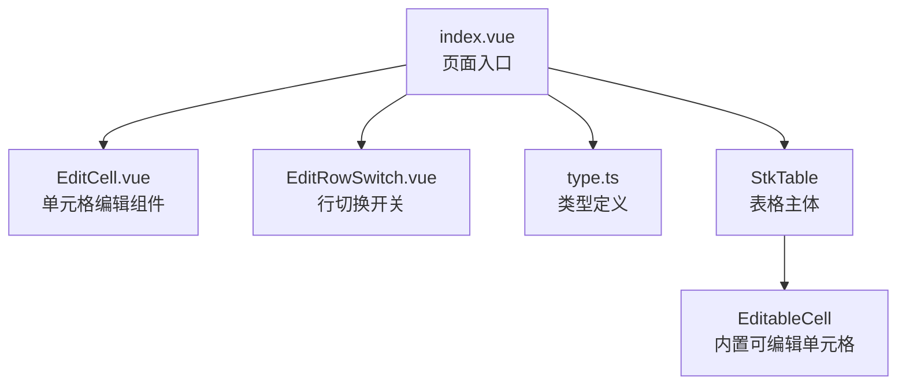
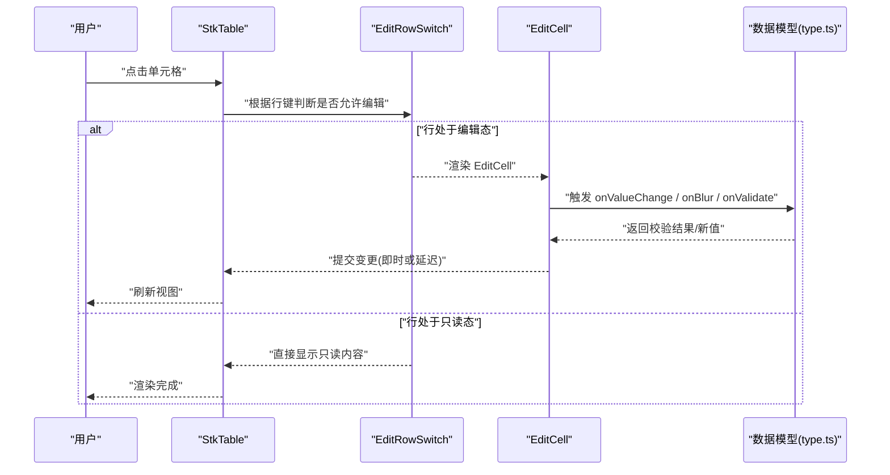
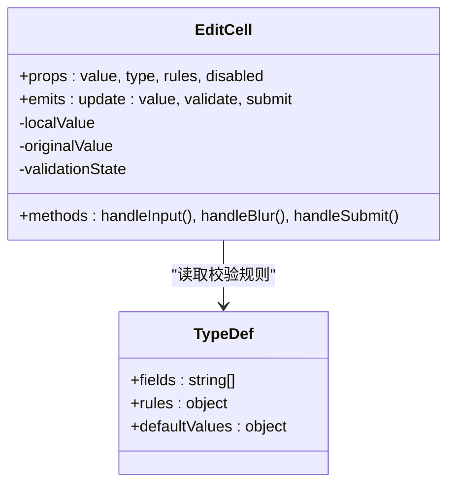
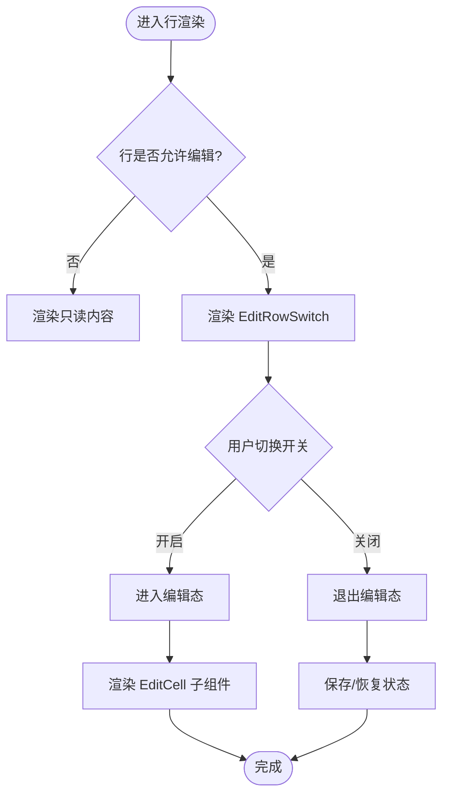
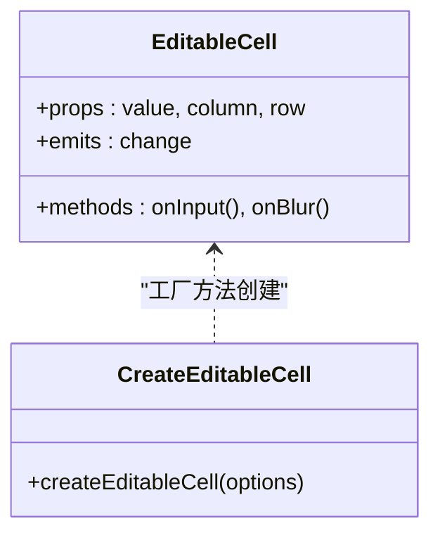
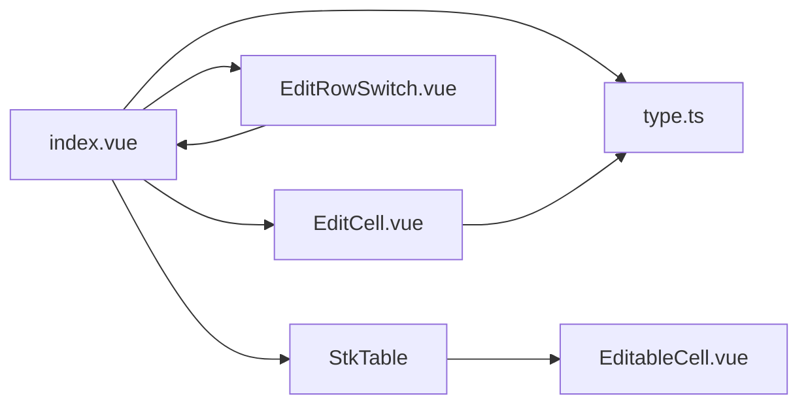

# 单元格编辑示例

<cite>
**本文引用的文件**   
- [demos/CellEdit/index.vue](file://docs-demo/demos/CellEdit/index.vue)
- [demos/CellEdit/EditCell.vue](file://docs-demo/demos/CellEdit/EditCell.vue)
- [demos/CellEdit/EditRowSwitch.vue](file://docs-demo/demos/CellEdit/EditRowSwitch.vue)
- [demos/CellEdit/type.ts](file://docs-demo/demos/CellEdit/type.ts)
- [src/StkTable/custom-cells/EditableCell/EditableCell.vue](file://src/StkTable/custom-cells/EditableCell/EditableCell.vue)
- [src/StkTable/custom-cells/EditableCell/createEditableCell.ts](file://src/StkTable/custom-cells/EditableCell/createEditableCell.ts)
- [src/StkTable/custom-cells/EditableCell/index.ts](file://src/StkTable/custom-cells/EditableCell/index.ts)
- [src/StkTable/custom-cells/EditableCell/EditableCell.less](file://src/StkTable/custom-cells/EditableCell/EditableCell.less)
- [docs-src/main/table/advanced/custom-cells/editable-cell.md](file://docs-src/main/table/advanced/custom-cells/editable-cell.md)
</cite>

## 目录
1. [简介](#简介)
2. [项目结构](#项目结构)
3. [核心组件](#核心组件)
4. [架构总览](#架构总览)
5. [详细组件分析](#详细组件分析)
6. [依赖关系分析](#依赖关系分析)
7. [性能考虑](#性能考虑)
8. [故障排查指南](#故障排查指南)
9. [结论](#结论)
10. [附录](#附录)

## 简介
本示例演示如何在基于 StkTable 的表格中实现可编辑单元格，覆盖单行编辑、多行编辑、数据验证与状态管理。文档围绕 EditCell 组件与 EditRowSwitch 行切换功能展开，详细说明数据类型定义、事件处理与双向数据绑定，并给出实际项目中的常见使用场景与最佳实践。

## 项目结构
本示例位于 docs-demo/demos/CellEdit 目录下，包含：
- index.vue：页面入口，组织列配置、数据源与编辑交互逻辑
- EditCell.vue：单元格编辑组件，负责输入、校验与值回写
- EditRowSwitch.vue：行切换开关，控制整行的编辑模式
- type.ts：类型定义，统一字段类型与校验规则

图表来源
- [demos/CellEdit/index.vue](file://docs-demo/demos/CellEdit/index.vue)
- [demos/CellEdit/EditCell.vue](file://docs-demo/demos/CellEdit/EditCell.vue)
- [demos/CellEdit/EditRowSwitch.vue](file://docs-demo/demos/CellEdit/EditRowSwitch.vue)
- [demos/CellEdit/type.ts](file://docs-demo/demos/CellEdit/type.ts)
- [src/StkTable/custom-cells/EditableCell/EditableCell.vue](file://src/StkTable/custom-cells/EditableCell/EditableCell.vue)

章节来源
- [demos/CellEdit/index.vue](file://docs-demo/demos/CellEdit/index.vue)
- [demos/CellEdit/EditCell.vue](file://docs-demo/demos/CellEdit/EditCell.vue)
- [demos/CellEdit/EditRowSwitch.vue](file://docs-demo/demos/CellEdit/EditRowSwitch.vue)
- [demos/CellEdit/type.ts](file://docs-demo/demos/CellEdit/type.ts)

## 核心组件
- EditCell：封装输入控件（如文本框、数字框等），提供聚焦、失焦、键盘回车确认、错误提示与值回写能力。通过事件将变更同步到父级数据模型，支持即时或延迟提交策略。
- EditRowSwitch：以布尔开关控制某一行是否进入“编辑态”，在编辑态下渲染 EditCell；在非编辑态仅显示只读内容。
- 类型定义（type.ts）：集中声明行数据结构、字段类型、校验规则与默认值，确保 EditCell 与上层数据一致。

章节来源
- [demos/CellEdit/EditCell.vue](file://docs-demo/demos/CellEdit/EditCell.vue)
- [demos/CellEdit/EditRowSwitch.vue](file://docs-demo/demos/CellEdit/EditRowSwitch.vue)
- [demos/CellEdit/type.ts](file://docs-demo/demos/CellEdit/type.ts)

## 架构总览
下图展示了从用户操作到数据更新的完整流程，包括 EditCell 与 EditRowSwitch 的协作，以及 StkTable 的可编辑单元格（EditableCell）如何参与渲染与事件分发。

图表来源
- [demos/CellEdit/index.vue](file://docs-demo/demos/CellEdit/index.vue)
- [demos/CellEdit/EditCell.vue](file://docs-demo/demos/CellEdit/EditCell.vue)
- [demos/CellEdit/EditRowSwitch.vue](file://docs-demo/demos/CellEdit/EditRowSwitch.vue)
- [demos/CellEdit/type.ts](file://docs-demo/demos/CellEdit/type.ts)
- [src/StkTable/custom-cells/EditableCell/EditableCell.vue](file://src/StkTable/custom-cells/EditableCell/EditableCell.vue)

## 详细组件分析

### EditCell 组件分析
职责与特性
- 输入与展示：根据字段类型渲染不同输入控件（文本、数字、选择器等）。
- 数据绑定：通过 v-model 或 props/emits 与父级数据双向绑定，支持即时更新或失焦/回车后提交。
- 数据验证：集成 type.ts 中的校验规则，实时反馈错误信息，阻止非法提交。
- 事件处理：暴露 onInput、onBlur、onValidate、onSubmit 等事件，便于上层统一处理。
- 状态管理：维护本地临时值与原始值，支持撤销/恢复（可选）。

图表来源
- [demos/CellEdit/EditCell.vue](file://docs-demo/demos/CellEdit/EditCell.vue)
- [demos/CellEdit/type.ts](file://docs-demo/demos/CellEdit/type.ts)

章节来源
- [demos/CellEdit/EditCell.vue](file://docs-demo/demos/CellEdit/EditCell.vue)
- [demos/CellEdit/type.ts](file://docs-demo/demos/CellEdit/type.ts)

### EditRowSwitch 行切换分析
职责与特性
- 行级编辑开关：控制当前行是否进入编辑态，影响单元格渲染与交互。
- 批量编辑支持：结合多选或工具栏，实现多行同时进入编辑态。
- 状态同步：与父级数据模型保持同步，避免状态不一致。
- 权限控制：根据业务规则限制某些行不可编辑。

图表来源
- [demos/CellEdit/EditRowSwitch.vue](file://docs-demo/demos/CellEdit/EditRowSwitch.vue)
- [demos/CellEdit/index.vue](file://docs-demo/demos/CellEdit/index.vue)

章节来源
- [demos/CellEdit/EditRowSwitch.vue](file://docs-demo/demos/CellEdit/EditRowSwitch.vue)
- [demos/CellEdit/index.vue](file://docs-demo/demos/CellEdit/index.vue)

### 数据类型定义（type.ts）
- 字段类型：统一字符串、数字、日期、枚举等类型，供 EditCell 渲染与校验使用。
- 校验规则：必填、范围、格式、自定义函数等，集中管理，便于复用。
- 默认值：为新增行或空字段提供初始值，保证表单一致性。
- 行结构：定义每行的主键、字段集合与扩展属性，支撑复杂业务。

章节来源
- [demos/CellEdit/type.ts](file://docs-demo/demos/CellEdit/type.ts)

### 内置可编辑单元格（EditableCell）
StkTable 提供了内置的 EditableCell，可用于快速实现基础编辑能力。其特点：
- 开箱即用：无需额外封装即可启用单元格编辑。
- 事件驱动：通过 emits 上报变更，便于上层统一处理。
- 样式可控：提供 less 样式文件，便于主题定制。

图表来源
- [src/StkTable/custom-cells/EditableCell/EditableCell.vue](file://src/StkTable/custom-cells/EditableCell/EditableCell.vue)
- [src/StkTable/custom-cells/EditableCell/createEditableCell.ts](file://src/StkTable/custom-cells/EditableCell/createEditableCell.ts)
- [src/StkTable/custom-cells/EditableCell/index.ts](file://src/StkTable/custom-cells/EditableCell/index.ts)

章节来源
- [src/StkTable/custom-cells/EditableCell/EditableCell.vue](file://src/StkTable/custom-cells/EditableCell/EditableCell.vue)
- [src/StkTable/custom-cells/EditableCell/createEditableCell.ts](file://src/StkTable/custom-cells/EditableCell/createEditableCell.ts)
- [src/StkTable/custom-cells/EditableCell/index.ts](file://src/StkTable/custom-cells/EditableCell/index.ts)
- [src/StkTable/custom-cells/EditableCell/EditableCell.less](file://src/StkTable/custom-cells/EditableCell/EditableCell.less)

## 依赖关系分析
- index.vue 依赖 EditCell、EditRowSwitch 与 type.ts，用于组合页面逻辑与数据模型。
- EditCell 依赖 type.ts 的校验规则与类型定义，确保输入合法性。
- EditRowSwitch 依赖 index.vue 的行状态，控制编辑态切换。
- StkTable 的 EditableCell 作为内置能力，可与自定义 EditCell 并存，满足不同复杂度需求。

图表来源
- [demos/CellEdit/index.vue](file://docs-demo/demos/CellEdit/index.vue)
- [demos/CellEdit/EditCell.vue](file://docs-demo/demos/CellEdit/EditCell.vue)
- [demos/CellEdit/EditRowSwitch.vue](file://docs-demo/demos/CellEdit/EditRowSwitch.vue)
- [demos/CellEdit/type.ts](file://docs-demo/demos/CellEdit/type.ts)
- [src/StkTable/custom-cells/EditableCell/EditableCell.vue](file://src/StkTable/custom-cells/EditableCell/EditableCell.vue)

章节来源
- [demos/CellEdit/index.vue](file://docs-demo/demos/CellEdit/index.vue)
- [demos/CellEdit/EditCell.vue](file://docs-demo/demos/CellEdit/EditCell.vue)
- [demos/CellEdit/EditRowSwitch.vue](file://docs-demo/demos/CellEdit/EditRowSwitch.vue)
- [demos/CellEdit/type.ts](file://docs-demo/demos/CellEdit/type.ts)
- [src/StkTable/custom-cells/EditableCell/EditableCell.vue](file://src/StkTable/custom-cells/EditableCell/EditableCell.vue)

## 性能考虑
- 局部更新：优先使用 v-model 或精确的 props/emits 更新，避免全表重渲染。
- 虚拟滚动：大数据量时启用虚拟滚动，减少 DOM 节点数量。
- 校验优化：对高频输入进行防抖或节流，减少重复计算。
- 按需渲染：仅在行进入编辑态时渲染 EditCell，降低非编辑态开销。
- 样式隔离：使用 scoped 样式或 CSS 变量，避免全局污染。

## 故障排查指南
常见问题与解决思路
- 输入值未同步：检查 EditCell 的 update:value 事件是否正确触发，父级是否监听并更新数据。
- 校验不生效：确认 type.ts 中的规则是否与字段匹配，必要时增加调试日志。
- 行切换无效：检查 EditRowSwitch 的状态是否与数据模型同步，避免状态不一致。
- 样式异常：核对 EditableCell.less 的样式优先级，必要时调整选择器作用域。

章节来源
- [demos/CellEdit/EditCell.vue](file://docs-demo/demos/CellEdit/EditCell.vue)
- [demos/CellEdit/EditRowSwitch.vue](file://docs-demo/demos/CellEdit/EditRowSwitch.vue)
- [src/StkTable/custom-cells/EditableCell/EditableCell.less](file://src/StkTable/custom-cells/EditableCell/EditableCell.less)

## 结论
通过 EditCell 与 EditRowSwitch 的组合，可以在 StkTable 中灵活实现单元格编辑，涵盖单行与多行编辑、数据验证与状态管理。结合内置 EditableCell 与统一的类型定义，既能满足简单场景的快速接入，也能支撑复杂业务的定制化需求。建议在实际项目中遵循上述最佳实践，确保性能与可维护性。

## 附录
- 参考文档：[可编辑单元格说明](file://docs-src/main/table/advanced/custom-cells/editable-cell.md)
- 示例入口：[CellEdit 示例入口](file://docs-demo/demos/CellEdit/index.vue)