# 大数据处理示例

<cite>
**本文引用的文件**   
- [demos/demos/HugeData/index.vue](file://demos/demos/HugeData/index.vue)
- [demos/demos/HugeData/mockData.ts](file://demos/demos/HugeData/mockData.ts)
- [demos/demos/HugeData/columns.ts](file://demos/demos/HugeData/columns.ts)
- [demos/demos/HugeData/event.ts](file://demos/demos/HugeData/event.ts)
- [demos/demos/HugeData/types.ts](file://demos/demos/HugeData/types.ts)
- [src/StkTable/useVirtualScroll.ts](file://src/StkTable/useVirtualScroll.ts)
- [src/StkTable/StkTable.vue](file://src/StkTable/StkTable.vue)
- [src/StkTable/useTableColumns.ts](file://src/StkTable/useTableColumns.ts)
- [src/StkTable/useSorter.ts](file://src/StkTable/useSorter.ts)
- [src/StkTable/useMergeCells.ts](file://src/StkTable/useMergeCells.ts)
- [src/StkTable/useRowExpand.ts](file://src/StkTable/useRowExpand.ts)
- [src/StkTable/useTree.ts](file://src/StkTable/useTree.ts)
- [src/StkTable/useThDrag.ts](file://src/StkTable/useThDrag.ts)
- [src/StkTable/useTrDrag.ts](file://src/StkTable/useTrDrag.ts)
- [src/StkTable/useHighlight.ts](file://src/StkTable/useHighlight.ts)
- [src/StkTable/useFixedCol.ts](file://src/StkTable/useFixedCol.ts)
- [src/StkTable/useScrollbar.ts](file://src/StkTable/useScrollbar.ts)
- [src/StkTable/useMaxRowSpan.ts](file://src/StkTable/useMaxRowSpan.ts)
- [src/StkTable/useIndexResolver.ts](file://src/StkTable/useIndexResolver.ts)
- [src/StkTable/useKeyboardArrowScroll.ts](file://src/StkTable/useKeyboardArrowScroll.ts)
- [src/StkTable/useScrollRowByRow.ts](file://src/StkTable/useScrollRowByRow.ts)
- [src/StkTable/useAutoResize.ts](file://src/StkTable/useAutoResize.ts)
- [src/StkTable/useColResize.ts](file://src/StkTable/useColResize.ts)
- [src/StkTable/useWheeling.ts](file://src/StkTable/useWheeling.ts)
- [docs-demo/demos/VirtualList/index.vue](file://docs-demo/demos/VirtualList/index.vue)
- [docs-demo/demos/LazyLoad/index.vue](file://docs-demo/demos/LazyLoad/index.vue)
- [docs-demo/demos/Matrix/index.vue](file://docs-demo/demos/Matrix/index.vue)
- [docs-demo/hooks/useI18n/zh.ts](file://docs-demo/hooks/useI18n/zh.ts)
</cite>

## 更新摘要
**所做更改**   
- 新增性能监控功能章节，详细说明三个关键性能指标的实现
- 更新性能优化策略部分，加入 Performance API 的使用说明
- 增强详细组件分析中的 HugeData 示例部分，包含性能监控实现细节
- 更新架构图表以反映性能监控流程

## 目录
1. [简介](#简介)
2. [项目结构](#项目结构)
3. [核心组件与能力](#核心组件与能力)
4. [架构总览](#架构总览)
5. [详细组件分析](#详细组件分析)
6. [依赖关系分析](#依赖关系分析)
7. [性能优化策略](#性能优化策略)
8. [性能监控机制](#性能监控机制)
9. [故障排查指南](#故障排查指南)
10. [结论](#结论)
11. [附录：实战示例与最佳实践](#附录实战示例与最佳实践)

## 简介
本文件围绕"大数据量表格处理"的完整示例，系统讲解如何在成千上万条数据场景下实现高性能渲染与交互。内容涵盖虚拟滚动、分页加载、数据缓存、内存管理、渲染优化与用户体验提升等关键主题，并结合真实业务场景给出可落地的解决方案。文档同时提供 mockData 生成器、columns 配置与事件处理机制的说明，帮助读者快速搭建生产级的大数据表格方案。**最新更新**：新增了完整的性能监控机制，通过 Performance API 实时监测 mock 数据生成时间、排序操作时间和表格渲染时间，为性能优化提供量化依据。

## 项目结构
仓库采用"示例 + 源码 + 文档"的分层组织方式：
- 示例层（demos）：包含 HugeData、VirtualList、LazyLoad、Matrix 等典型场景示例
- 源码层（src/StkTable）：表格核心能力与 hooks，如虚拟滚动、列宽调整、排序、合并单元格、树形、拖拽、高亮、固定列、滚动行为等
- 文档层（docs-src/docs-demo）：VitePress 文档与演示页面

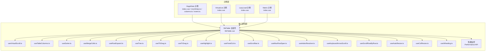

图表来源
- [demos/demos/HugeData/index.vue](file://demos/demos/HugeData/index.vue)
- [src/StkTable/StkTable.vue](file://src/StkTable/StkTable.vue)
- [src/StkTable/useVirtualScroll.ts](file://src/StkTable/useVirtualScroll.ts)

章节来源
- [demos/demos/HugeData/index.vue](file://demos/demos/HugeData/index.vue)
- [src/StkTable/StkTable.vue](file://src/StkTable/StkTable.vue)

## 核心组件与能力
- 虚拟滚动：通过可视区域计算只渲染可见行，显著降低 DOM 节点数量与重排开销
- 列配置与渲染：支持自定义列、插槽、对齐、宽度自适应、固定列等
- 排序与筛选：内置多列排序与扩展筛选能力，支持服务端或客户端排序
- 合并单元格与最大行跨度：复杂报表场景下的行列合并与跨行展示
- 行展开与树形：层级数据展示与动态展开收起
- 拖拽与交互：表头拖拽调整列宽、行拖拽排序、键盘方向键滚动、滚轮优化
- 高亮与滚动定位：行/单元格高亮、按行滚动、自动高度适配
- 滚动条与尺寸：自定义滚动条样式、容器尺寸自适应
- **性能监控**：基于 Performance API 的三大核心指标监测，包括 mock 数据生成时间、排序操作时间和表格渲染时间

章节来源
- [src/StkTable/useVirtualScroll.ts](file://src/StkTable/useVirtualScroll.ts)
- [src/StkTable/useTableColumns.ts](file://src/StkTable/useTableColumns.ts)
- [src/StkTable/useSorter.ts](file://src/StkTable/useSorter.ts)
- [src/StkTable/useMergeCells.ts](file://src/StkTable/useMergeCells.ts)
- [src/StkTable/useRowExpand.ts](file://src/StkTable/useRowExpand.ts)
- [src/StkTable/useTree.ts](file://src/StkTable/useTree.ts)
- [src/StkTable/useThDrag.ts](file://src/StkTable/useThDrag.ts)
- [src/StkTable/useTrDrag.ts](file://src/StkTable/useTrDrag.ts)
- [src/StkTable/useHighlight.ts](file://src/StkTable/useHighlight.ts)
- [src/StkTable/useFixedCol.ts](file://src/StkTable/useFixedCol.ts)
- [src/StkTable/useScrollbar.ts](file://src/StkTable/useScrollbar.ts)
- [src/StkTable/useMaxRowSpan.ts](file://src/StkTable/useMaxRowSpan.ts)
- [src/StkTable/useIndexResolver.ts](file://src/StkTable/useIndexResolver.ts)
- [src/StkTable/useKeyboardArrowScroll.ts](file://src/StkTable/useKeyboardArrowScroll.ts)
- [src/StkTable/useScrollRowByRow.ts](file://src/StkTable/useScrollRowByRow.ts)
- [src/StkTable/useAutoResize.ts](file://src/StkTable/useAutoResize.ts)
- [src/StkTable/useColResize.ts](file://src/StkTable/useColResize.ts)
- [src/StkTable/useWheeling.ts](file://src/StkTable/useWheeling.ts)

## 架构总览
StkTable 以组合式 hooks 为核心，将渲染、布局、交互与数据流解耦。HugeData 示例通过 mockData 生成器、columns 配置与事件处理器，串联起虚拟滚动、分页加载与缓存策略，形成端到端的高性能表格方案。**新增性能监控层**：在数据生成、排序和渲染的关键节点插入性能测量，通过 Performance API 获取精确的时间戳，为性能优化提供数据支撑。

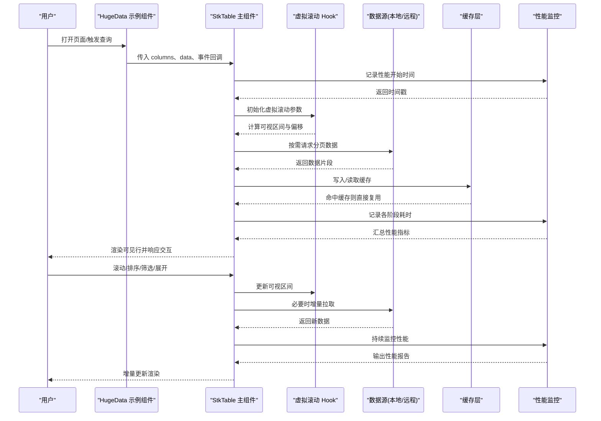

图表来源
- [demos/demos/HugeData/index.vue](file://demos/demos/HugeData/index.vue)
- [src/StkTable/StkTable.vue](file://src/StkTable/StkTable.vue)
- [src/StkTable/useVirtualScroll.ts](file://src/StkTable/useVirtualScroll.ts)

## 详细组件分析

### HugeData 示例：mockData、columns 与事件
- mockData 生成器：用于批量构造字段、类型、长度与随机值，便于模拟真实业务数据规模
- columns 配置：定义列标识、标题、宽度、对齐、格式化、插槽、排序与筛选等
- 事件处理：封装点击、双击、选择、排序、筛选、展开等回调，统一转发至 StkTable
- **性能监控集成**：在数据生成、排序和渲染的关键节点使用 Performance API 进行精确计时

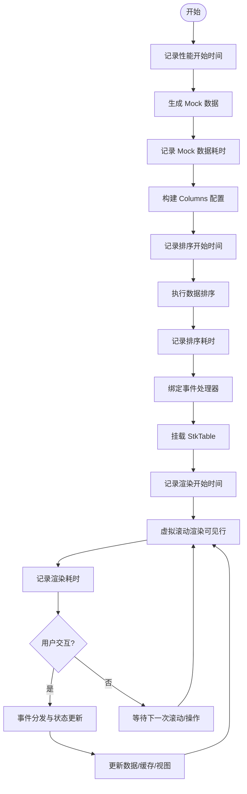

图表来源
- [demos/demos/HugeData/mockData.ts](file://demos/demos/HugeData/mockData.ts)
- [demos/demos/HugeData/columns.ts](file://demos/demos/HugeData/columns.ts)
- [demos/demos/HugeData/event.ts](file://demos/demos/HugeData/event.ts)
- [demos/demos/HugeData/index.vue](file://demos/demos/HugeData/index.vue)

章节来源
- [demos/demos/HugeData/mockData.ts](file://demos/demos/HugeData/mockData.ts)
- [demos/demos/HugeData/columns.ts](file://demos/demos/HugeData/columns.ts)
- [demos/demos/HugeData/event.ts](file://demos/demos/HugeData/event.ts)
- [demos/demos/HugeData/index.vue](file://demos/demos/HugeData/index.vue)
- [demos/demos/HugeData/types.ts](file://demos/demos/HugeData/types.ts)

### 虚拟滚动与索引解析
- 可视区计算：根据容器高度、行高与滚动位置计算首尾索引
- 占位与偏移：使用占位元素维持滚动条高度，避免抖动
- 索引解析：在排序、筛选、树形展开后重新映射逻辑索引到物理索引

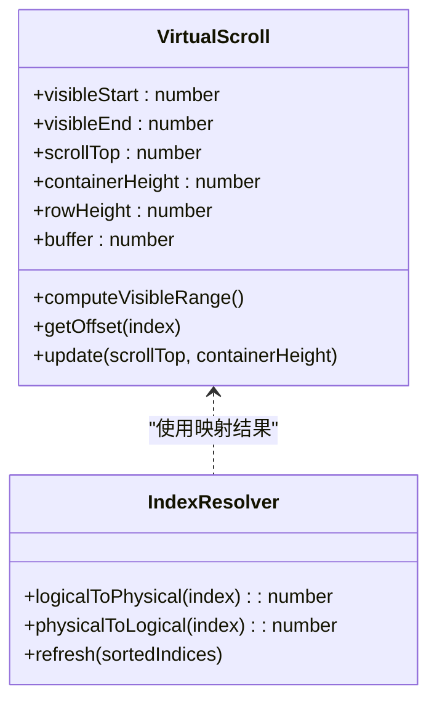

图表来源
- [src/StkTable/useVirtualScroll.ts](file://src/StkTable/useVirtualScroll.ts)
- [src/StkTable/useIndexResolver.ts](file://src/StkTable/useIndexResolver.ts)

章节来源
- [src/StkTable/useVirtualScroll.ts](file://src/StkTable/useVirtualScroll.ts)
- [src/StkTable/useIndexResolver.ts](file://src/StkTable/useIndexResolver.ts)

### 列配置与渲染管线
- 列解析：将 columns 转换为内部列模型，计算宽度、对齐、是否固定
- 渲染管线：头部、主体、底部、冻结列、合并单元格、展开行、树形节点
- 插槽与自定义单元格：通过插槽注入复杂渲染逻辑

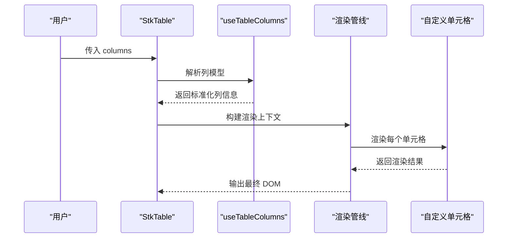

图表来源
- [src/StkTable/useTableColumns.ts](file://src/StkTable/useTableColumns.ts)
- [src/StkTable/StkTable.vue](file://src/StkTable/StkTable.vue)

章节来源
- [src/StkTable/useTableColumns.ts](file://src/StkTable/useTableColumns.ts)
- [src/StkTable/StkTable.vue](file://src/StkTable/StkTable.vue)

### 排序、筛选与数据缓存
- 排序：支持单列/多列排序，客户端排序优先，服务端排序回写
- 筛选：基于列配置的过滤函数，支持条件组合
- 缓存：对已加载页码的数据进行缓存，减少重复请求；结合虚拟滚动仅维护必要缓存

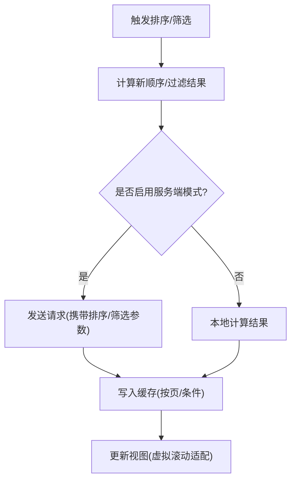

图表来源
- [src/StkTable/useSorter.ts](file://src/StkTable/useSorter.ts)
- [src/StkTable/StkTable.vue](file://src/StkTable/StkTable.vue)

章节来源
- [src/StkTable/useSorter.ts](file://src/StkTable/useSorter.ts)
- [src/StkTable/StkTable.vue](file://src/StkTable/StkTable.vue)

### 合并单元格与最大行跨度
- 合并规则：根据列配置与数据特征计算合并范围
- 最大行跨度：在虚拟滚动环境下保证合并单元格的视觉连续性

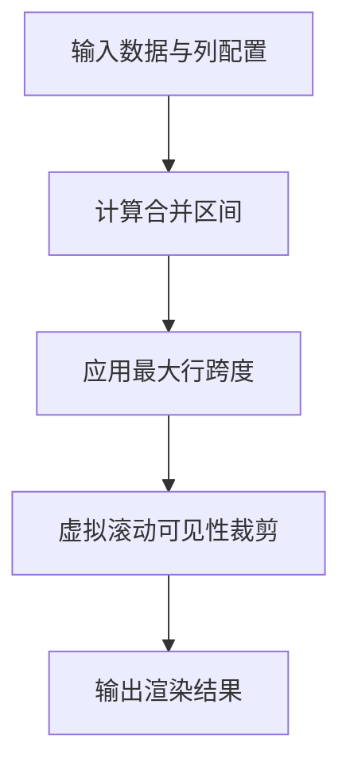

图表来源
- [src/StkTable/useMergeCells.ts](file://src/StkTable/useMergeCells.ts)
- [src/StkTable/useMaxRowSpan.ts](file://src/StkTable/useMaxRowSpan.ts)

章节来源
- [src/StkTable/useMergeCells.ts](file://src/StkTable/useMergeCells.ts)
- [src/StkTable/useMaxRowSpan.ts](file://src/StkTable/useMaxRowSpan.ts)

### 行展开与树形
- 行展开：支持嵌套详情、子表格或额外信息
- 树形：层级数据的展开/收起、默认展开策略、虚拟滚动兼容

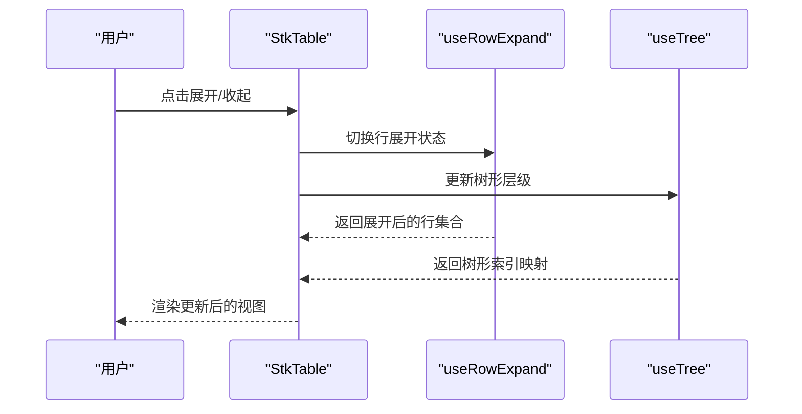

图表来源
- [src/StkTable/useRowExpand.ts](file://src/StkTable/useRowExpand.ts)
- [src/StkTable/useTree.ts](file://src/StkTable/useTree.ts)

章节来源
- [src/StkTable/useRowExpand.ts](file://src/StkTable/useRowExpand.ts)
- [src/StkTable/useTree.ts](file://src/StkTable/useTree.ts)

### 拖拽与交互增强
- 表头拖拽：调整列宽、记忆列宽配置
- 行拖拽：排序、移动行位置
- 键盘与滚轮：方向键滚动、滚轮平滑滚动、滚动条样式定制

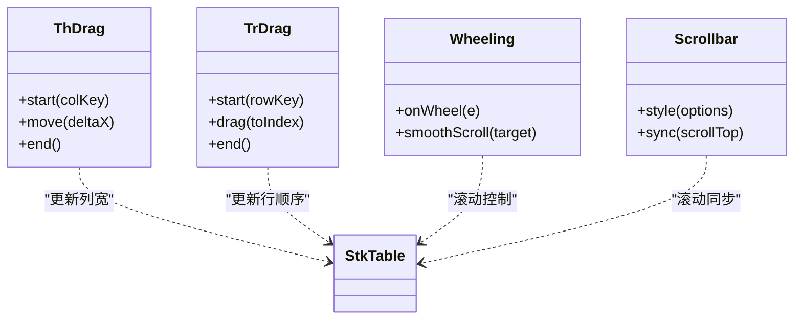

图表来源
- [src/StkTable/useThDrag.ts](file://src/StkTable/useThDrag.ts)
- [src/StkTable/useTrDrag.ts](file://src/StkTable/useTrDrag.ts)
- [src/StkTable/useWheeling.ts](file://src/StkTable/useWheeling.ts)
- [src/StkTable/useScrollbar.ts](file://src/StkTable/useScrollbar.ts)

章节来源
- [src/StkTable/useThDrag.ts](file://src/StkTable/useThDrag.ts)
- [src/StkTable/useTrDrag.ts](file://src/StkTable/useTrDrag.ts)
- [src/StkTable/useWheeling.ts](file://src/StkTable/useWheeling.ts)
- [src/StkTable/useScrollbar.ts](file://src/StkTable/useScrollbar.ts)

### 高亮与滚动定位
- 高亮：按条件标记行/单元格，支持动画与清除
- 滚动定位：按行号滚动到指定位置，支持平滑过渡

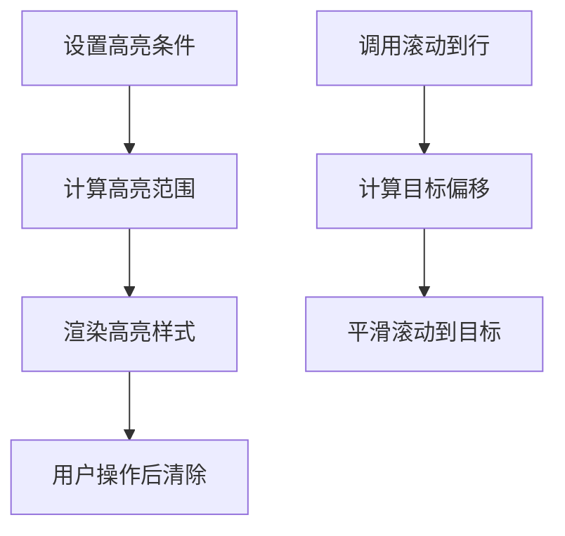

图表来源
- [src/StkTable/useHighlight.ts](file://src/StkTable/useHighlight.ts)
- [src/StkTable/useScrollRowByRow.ts](file://src/StkTable/useScrollRowByRow.ts)

章节来源
- [src/StkTable/useHighlight.ts](file://src/StkTable/useHighlight.ts)
- [src/StkTable/useScrollRowByRow.ts](file://src/StkTable/useScrollRowByRow.ts)

### 固定列与自适应
- 固定列：左右固定列在滚动时保持可见
- 自适应：容器尺寸变化时自动调整列宽与布局

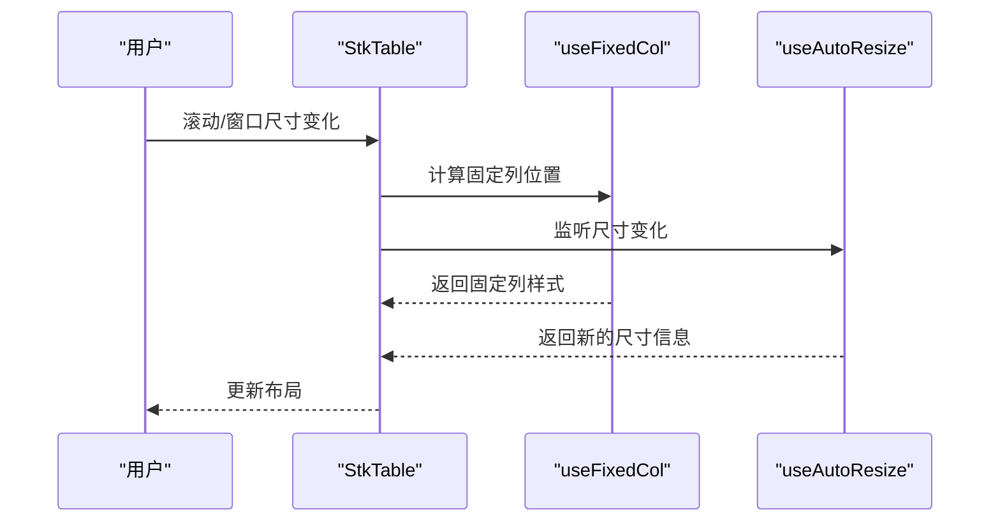

图表来源
- [src/StkTable/useFixedCol.ts](file://src/StkTable/useFixedCol.ts)
- [src/StkTable/useAutoResize.ts](file://src/StkTable/useAutoResize.ts)

章节来源
- [src/StkTable/useFixedCol.ts](file://src/StkTable/useFixedCol.ts)
- [src/StkTable/useAutoResize.ts](file://src/StkTable/useAutoResize.ts)

## 依赖关系分析
StkTable 主组件作为编排中心，依赖多个 hooks 完成具体职责。HugeData 示例通过 columns、mockData 与事件处理器与 StkTable 集成。

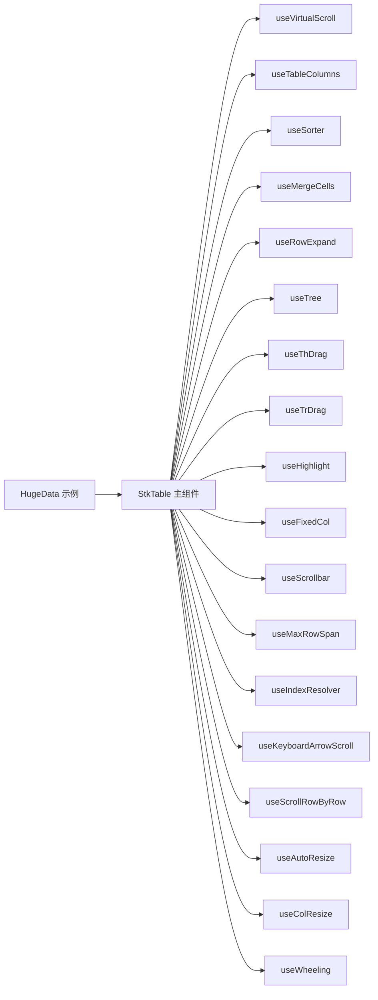

图表来源
- [demos/demos/HugeData/index.vue](file://demos/demos/HugeData/index.vue)
- [src/StkTable/StkTable.vue](file://src/StkTable/StkTable.vue)

章节来源
- [demos/demos/HugeData/index.vue](file://demos/demos/HugeData/index.vue)
- [src/StkTable/StkTable.vue](file://src/StkTable/StkTable.vue)

## 性能优化策略
- 虚拟滚动：仅渲染可视区域，减少 DOM 节点与重排
- 分页加载：按页拉取数据，避免一次性加载全部数据
- 数据缓存：按页码或条件缓存已加载数据，减少重复请求
- 列宽与布局：合理设置列宽，避免频繁计算；使用固定列减少重绘
- 事件节流：滚动与拖拽事件进行节流/防抖
- 内存管理：及时释放不再使用的数据与缓存；避免大对象引用泄漏
- 渲染优化：使用稳定的 key、最小化 re-render、避免不必要的深度比较
- 用户体验：骨架屏、懒加载、平滑滚动、错误边界与降级策略
- **性能监控**：使用 Performance API 精确测量关键操作耗时，建立性能基线

## 性能监控机制

### 三大核心性能指标
HugeData 示例实现了完整的性能监控体系，通过 Performance API 精确测量以下三个关键指标：

1. **Mock 数据生成时间** (`mockDataCost`)
   - 测量从 `performance.now()` 开始到数据生成完成的耗时
   - 用于评估大数据量模拟的性能瓶颈
   - 支持不同数据规模的对比测试

2. **排序操作时间** (`sortDataCost`) 
   - 测量 `tableSort` 函数的执行时间
   - 反映大数据量排序算法的效率
   - 可用于优化排序逻辑和数据结构

3. **表格渲染时间** (`renderCost`)
   - 测量 Vue 组件渲染的完整周期
   - 包含虚拟滚动计算、DOM 更新等操作
   - 帮助识别渲染性能问题

### 性能监控实现原理

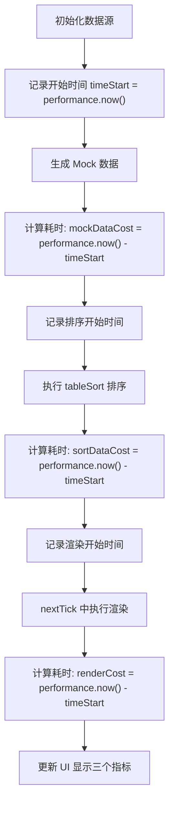

图表来源
- [demos/demos/HugeData/index.vue](file://demos/demos/HugeData/index.vue)

### 性能指标展示与国际化
性能指标通过简洁的 UI 界面展示，支持中英文切换：

- **中文显示**：创建mock数据耗时、排序耗时、渲染耗时
- **英文显示**：对应英文文本，确保国际化支持
- **实时更新**：每次数据操作后自动刷新性能指标
- **单位统一**：所有时间单位为毫秒(ms)，便于对比分析

### 性能监控的最佳实践

1. **精确的时间点选择**
   - Mock 数据生成：在数据构造循环前后测量
   - 排序操作：在 `tableSort` 函数调用前后测量  
   - 渲染过程：在 `nextTick` 回调中测量完整渲染周期

2. **避免监控代码影响性能**
   - 使用 `Math.floor()` 确保时间值为整数
   - 只在开发环境或特定条件下启用监控
   - 监控代码本身不应成为性能瓶颈

3. **数据驱动的性能优化**
   - 基于实际测量数据进行优化决策
   - 建立性能基线和回归测试
   - 持续监控性能趋势变化

**Section sources**
- [demos/demos/HugeData/index.vue:49-115](file://demos/demos/HugeData/index.vue#L49-L115)
- [demos/demos/HugeData/index.vue:310-312](file://demos/demos/HugeData/index.vue#L310-L312)
- [docs-demo/hooks/useI18n/zh.ts:4-6](file://docs-demo/hooks/useI18n/zh.ts#L4-L6)

## 故障排查指南
- 虚拟滚动错位：检查行高一致性、占位元素高度与容器高度计算
- 排序/筛选异常：确认排序键与筛选条件是否正确传递到服务端或本地计算
- 合并单元格显示异常：验证合并区间计算与最大行跨度逻辑
- 固定列重叠：检查固定列宽度与滚动偏移计算
- 拖拽卡顿：确认事件节流与渲染频率
- 内存增长：监控缓存大小与未释放引用，必要时清理历史数据
- **性能问题诊断**：利用性能监控指标定位瓶颈环节，重点关注超过 100ms 的操作

章节来源
- [src/StkTable/useVirtualScroll.ts](file://src/StkTable/useVirtualScroll.ts)
- [src/StkTable/useSorter.ts](file://src/StkTable/useSorter.ts)
- [src/StkTable/useMergeCells.ts](file://src/StkTable/useMergeCells.ts)
- [src/StkTable/useFixedCol.ts](file://src/StkTable/useFixedCol.ts)
- [src/StkTable/useThDrag.ts](file://src/StkTable/useThDrag.ts)

## 结论
通过 StkTable 的组合式架构与 HugeData 示例的实践，可以在大规模数据场景下实现流畅的表格体验。虚拟滚动、分页加载与数据缓存是性能优化的三大支柱；配合列配置、事件处理与交互增强，可满足复杂业务需求。**新增的性能监控机制**为性能优化提供了量化依据，使开发者能够精准定位性能瓶颈并进行针对性优化。建议在生产环境中结合服务端能力与前端缓存策略，持续监控性能指标与内存占用，确保稳定与高效。

## 附录：实战示例与最佳实践
- 虚拟列表：参考 VirtualList 示例，了解长列表渲染与性能调优
- 懒加载：参考 LazyLoad 示例，掌握按需加载与缓存策略
- 矩阵表格：参考 Matrix 示例，学习复杂单元格与布局技巧
- **性能监控实践**：参考 HugeData 示例中的 Performance API 使用，建立自己的性能监控体系

章节来源
- [docs-demo/demos/VirtualList/index.vue](file://docs-demo/demos/VirtualList/index.vue)
- [docs-demo/demos/LazyLoad/index.vue](file://docs-demo/demos/LazyLoad/index.vue)
- [docs-demo/demos/Matrix/index.vue](file://docs-demo/demos/Matrix/index.vue)