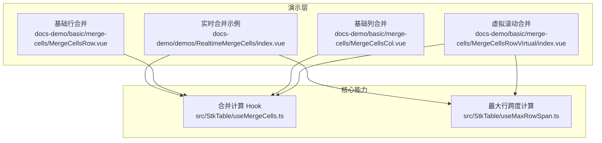
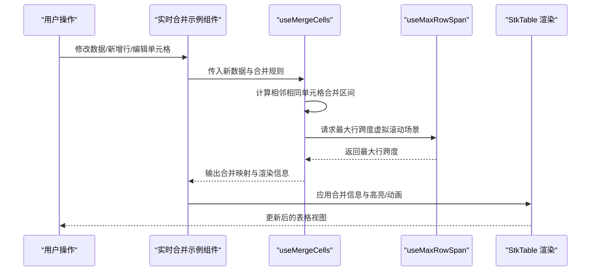
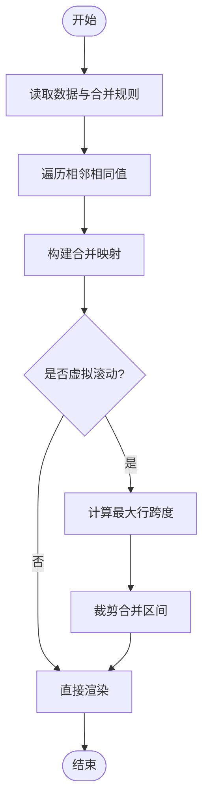
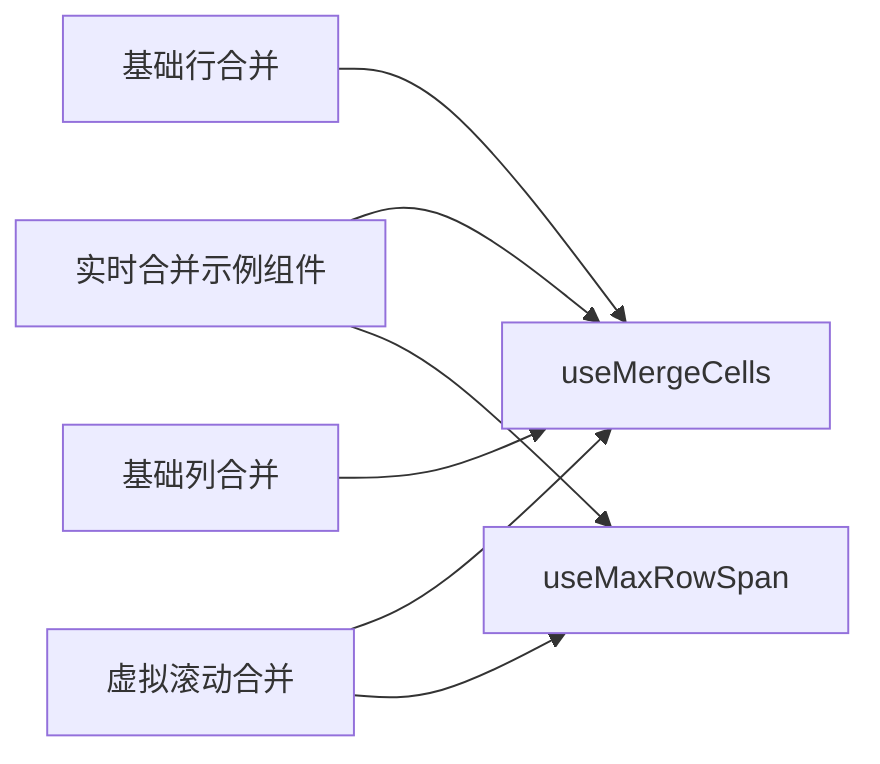

# 实时合并单元格示例

<cite>
**本文引用的文件**   
- [src/StkTable/useMergeCells.ts](file://src/StkTable/useMergeCells.ts)
- [src/StkTable/useMaxRowSpan.ts](file://src/StkTable/useMaxRowSpan.ts)
- [docs-demo/demos/RealtimeMergeCells/index.vue](file://docs-demo/demos/RealtimeMergeCells/index.vue)
- [docs-src/demos/realtime-merge-cells.md](file://docs-src/demos/realtime-merge-cells.md)
- [docs-src/en/demos/realtime-merge-cells.md](file://docs-src/en/demos/realtime-merge-cells.md)
- [docs-src/ja/demos/realtime-merge-cells.md](file://docs-src/ja/demos/realtime-merge-cells.md)
- [docs-src/ko/demos/realtime-merge-cells.md](file://docs-src/ko/demos/realtime-merge-cells.md)
- [docs-demo/basic/merge-cells/MergeCellsRow.vue](file://docs-demo/basic/merge-cells/MergeCellsRow.vue)
- [docs-demo/basic/merge-cells/MergeCellsCol.vue](file://docs-demo/basic/merge-cells/MergeCellsCol.vue)
- [docs-demo/basic/merge-cells/MergeCellsRowVirtual/index.vue](file://docs-demo/basic/merge-cells/MergeCellsRowVirtual/index.vue)
- [docs-demo/basic/merge-cells/MergeCellsRowVirtual/Special.vue](file://docs-demo/basic/merge-cells/MergeCellsRowVirtual/Special.vue)
- [docs-demo/basic/merge-cells/MergeCellsRowVirtual/dataSource.ts](file://docs-demo/basic/merge-cells/MergeCellsRowVirtual/dataSource.ts)
</cite>

## 目录
1. [简介](#简介)
2. [项目结构](#项目结构)
3. [核心组件](#核心组件)
4. [架构总览](#架构总览)
5. [详细组件分析](#详细组件分析)
6. [依赖关系分析](#依赖关系分析)
7. [性能考量](#性能考量)
8. [故障排查指南](#故障排查指南)
9. [结论](#结论)
10. [附录](#附录)

## 简介
本示例围绕“实时合并单元格”能力，展示当数据变化时自动合并相邻相同单元格的完整方案。该方案支持：
- 基于列值或行值的相邻相同单元格自动合并
- 实时更新与动画效果（通过表格高亮与过渡）
- 大数据量下的虚拟滚动兼容
- 报表统计、数据汇总等常见业务场景的扩展模式

## 项目结构
与“实时合并单元格”直接相关的代码主要分布在以下位置：
- 核心算法与逻辑：useMergeCells.ts、useMaxRowSpan.ts
- 演示示例：docs-demo/demos/RealtimeMergeCells/index.vue
- 文档说明：docs-src/demos/realtime-merge-cells.md 及多语言版本
- 基础合并示例：docs-demo/basic/merge-cells/*（行合并、列合并、虚拟滚动合并、特殊场景）

图表来源
- [docs-demo/demos/RealtimeMergeCells/index.vue](file://docs-demo/demos/RealtimeMergeCells/index.vue)
- [docs-demo/basic/merge-cells/MergeCellsRow.vue](file://docs-demo/basic/merge-cells/MergeCellsRow.vue)
- [docs-demo/basic/merge-cells/MergeCellsCol.vue](file://docs-demo/basic/merge-cells/MergeCellsCol.vue)
- [docs-demo/basic/merge-cells/MergeCellsRowVirtual/index.vue](file://docs-demo/basic/merge-cells/MergeCellsRowVirtual/index.vue)
- [src/StkTable/useMergeCells.ts](file://src/StkTable/useMergeCells.ts)
- [src/StkTable/useMaxRowSpan.ts](file://src/StkTable/useMaxRowSpan.ts)

章节来源
- [docs-demo/demos/RealtimeMergeCells/index.vue](file://docs-demo/demos/RealtimeMergeCells/index.vue)
- [docs-src/demos/realtime-merge-cells.md](file://docs-src/demos/realtime-merge-cells.md)
- [src/StkTable/useMergeCells.ts](file://src/StkTable/useMergeCells.ts)
- [src/StkTable/useMaxRowSpan.ts](file://src/StkTable/useMaxRowSpan.ts)

## 核心组件
- useMergeCells：提供合并配置、增量更新、边界处理与渲染所需合并信息的生成。
- useMaxRowSpan：在虚拟滚动等场景下，计算跨行的最大跨度，确保合并区域正确显示。
- 实时合并示例组件：封装数据源、变更事件、动画与高亮策略，驱动表格进行动态合并。

章节来源
- [src/StkTable/useMergeCells.ts](file://src/StkTable/useMergeCells.ts)
- [src/StkTable/useMaxRowSpan.ts](file://src/StkTable/useMaxRowSpan.ts)
- [docs-demo/demos/RealtimeMergeCells/index.vue](file://docs-demo/demos/RealtimeMergeCells/index.vue)

## 架构总览
下图展示了从数据变更到合并结果渲染的整体流程，以及动画与高亮的触发点。

图表来源
- [docs-demo/demos/RealtimeMergeCells/index.vue](file://docs-demo/demos/RealtimeMergeCells/index.vue)
- [src/StkTable/useMergeCells.ts](file://src/StkTable/useMergeCells.ts)
- [src/StkTable/useMaxRowSpan.ts](file://src/StkTable/useMaxRowSpan.ts)

## 详细组件分析

### 合并算法与数据结构
- 输入：当前数据数组、列定义、合并规则（按列值或行值）、是否启用虚拟滚动。
- 处理：
  - 对指定列进行相邻相同值扫描，构建合并区间（起始行、结束行、跨度）。
  - 在虚拟滚动场景下，结合可视区域与最大行跨度，裁剪并修正合并区间，避免越界。
  - 输出渲染所需的合并映射，供表格渲染器使用。
- 复杂度：线性扫描 O(n)，n 为可见行数；在大数据集上配合虚拟滚动可保持良好性能。

图表来源
- [src/StkTable/useMergeCells.ts](file://src/StkTable/useMergeCells.ts)
- [src/StkTable/useMaxRowSpan.ts](file://src/StkTable/useMaxRowSpan.ts)

章节来源
- [src/StkTable/useMergeCells.ts](file://src/StkTable/useMergeCells.ts)
- [src/StkTable/useMaxRowSpan.ts](file://src/StkTable/useMaxRowSpan.ts)

### 实时合并示例组件
- 职责：维护数据源、监听数据变化、调用合并 Hook、控制动画与高亮、向表格传递合并信息。
- 关键点：
  - 数据变更时仅重新计算受影响区域，减少不必要的重算。
  - 通过高亮与过渡实现“合并区域出现/消失”的视觉反馈。
  - 在虚拟滚动模式下，确保合并区间与可视范围一致。

章节来源
- [docs-demo/demos/RealtimeMergeCells/index.vue](file://docs-demo/demos/RealtimeMergeCells/index.vue)

### 基础合并示例
- 行合并：按列值相邻相同合并，适合分组统计、层级展示。
- 列合并：按行值相邻相同合并，适合横向分组与汇总。
- 虚拟滚动合并：在大量数据下保证合并区间的正确性与性能。
- 特殊场景：空值、NaN、类型差异、排序/过滤后合并区间的再计算。

章节来源
- [docs-demo/basic/merge-cells/MergeCellsRow.vue](file://docs-demo/basic/merge-cells/MergeCellsRow.vue)
- [docs-demo/basic/merge-cells/MergeCellsCol.vue](file://docs-demo/basic/merge-cells/MergeCellsCol.vue)
- [docs-demo/basic/merge-cells/MergeCellsRowVirtual/index.vue](file://docs-demo/basic/merge-cells/MergeCellsRowVirtual/index.vue)
- [docs-demo/basic/merge-cells/MergeCellsRowVirtual/Special.vue](file://docs-demo/basic/merge-cells/MergeCellsRowVirtual/Special.vue)
- [docs-demo/basic/merge-cells/MergeCellsRowVirtual/dataSource.ts](file://docs-demo/basic/merge-cells/MergeCellsRowVirtual/dataSource.ts)

### 文档与多语言说明
- 中文、英文、日文、韩文文档均包含“实时合并单元格”的使用说明与示例链接，便于不同读者快速上手。

章节来源
- [docs-src/demos/realtime-merge-cells.md](file://docs-src/demos/realtime-merge-cells.md)
- [docs-src/en/demos/realtime-merge-cells.md](file://docs-src/en/demos/realtime-merge-cells.md)
- [docs-src/ja/demos/realtime-merge-cells.md](file://docs-src/ja/demos/realtime-merge-cells.md)
- [docs-src/ko/demos/realtime-merge-cells.md](file://docs-src/ko/demos/realtime-merge-cells.md)

## 依赖关系分析
- 演示组件依赖合并 Hook 与最大行跨度 Hook。
- 基础示例复用同一套合并能力，覆盖更多边界场景。
- 文档页面作为入口，引导用户查看对应示例与说明。

图表来源
- [docs-demo/demos/RealtimeMergeCells/index.vue](file://docs-demo/demos/RealtimeMergeCells/index.vue)
- [docs-demo/basic/merge-cells/MergeCellsRow.vue](file://docs-demo/basic/merge-cells/MergeCellsRow.vue)
- [docs-demo/basic/merge-cells/MergeCellsCol.vue](file://docs-demo/basic/merge-cells/MergeCellsCol.vue)
- [docs-demo/basic/merge-cells/MergeCellsRowVirtual/index.vue](file://docs-demo/basic/merge-cells/MergeCellsRowVirtual/index.vue)
- [src/StkTable/useMergeCells.ts](file://src/StkTable/useMergeCells.ts)
- [src/StkTable/useMaxRowSpan.ts](file://src/StkTable/useMaxRowSpan.ts)

章节来源
- [docs-demo/demos/RealtimeMergeCells/index.vue](file://docs-demo/demos/RealtimeMergeCells/index.vue)
- [docs-demo/basic/merge-cells/MergeCellsRow.vue](file://docs-demo/basic/merge-cells/MergeCellsRow.vue)
- [docs-demo/basic/merge-cells/MergeCellsCol.vue](file://docs-demo/basic/merge-cells/MergeCellsCol.vue)
- [docs-demo/basic/merge-cells/MergeCellsRowVirtual/index.vue](file://docs-demo/basic/merge-cells/MergeCellsRowVirtual/index.vue)
- [src/StkTable/useMergeCells.ts](file://src/StkTable/useMergeCells.ts)
- [src/StkTable/useMaxRowSpan.ts](file://src/StkTable/useMaxRowSpan.ts)

## 性能考量
- 增量计算：仅在数据变化区域重新计算合并区间，避免全表重算。
- 虚拟滚动：结合可视区域与最大行跨度，限制计算范围，降低内存与 CPU 占用。
- 缓存策略：对稳定列值与排序状态进行缓存，减少重复比较。
- 渲染优化：合并映射扁平化，减少渲染时的条件判断开销。

[本节为通用指导，不直接分析具体文件]

## 故障排查指南
- 合并错位：检查相邻相同值判定逻辑（类型、空值、NaN），确认排序/过滤后的数据顺序。
- 虚拟滚动异常：确认可视区域与最大行跨度计算是否正确，合并区间是否被越界裁剪。
- 动画闪烁：检查高亮与过渡触发时机，避免频繁重绘。
- 性能抖动：观察数据变更频率与规模，必要时引入防抖或分页加载。

章节来源
- [docs-demo/basic/merge-cells/MergeCellsRowVirtual/Special.vue](file://docs-demo/basic/merge-cells/MergeCellsRowVirtual/Special.vue)
- [docs-demo/basic/merge-cells/MergeCellsRowVirtual/index.vue](file://docs-demo/basic/merge-cells/MergeCellsRowVirtual/index.vue)

## 结论
通过 useMergeCells 与 useMaxRowSpan 的组合，可以在实时数据变更场景下高效、准确地完成相邻相同单元格的合并，并在虚拟滚动与大数据量下保持稳定性能。结合高亮与动画，可提供直观的用户反馈。对于报表统计与数据汇总等业务场景，可按列或行维度灵活扩展合并规则，满足多样化需求。

[本节为总结性内容，不直接分析具体文件]

## 附录
- 相关示例与文档路径：
  - 实时合并示例：docs-demo/demos/RealtimeMergeCells/index.vue
  - 基础行合并：docs-demo/basic/merge-cells/MergeCellsRow.vue
  - 基础列合并：docs-demo/basic/merge-cells/MergeCellsCol.vue
  - 虚拟滚动合并：docs-demo/basic/merge-cells/MergeCellsRowVirtual/index.vue
  - 特殊场景：docs-demo/basic/merge-cells/MergeCellsRowVirtual/Special.vue
  - 数据源：docs-demo/basic/merge-cells/MergeCellsRowVirtual/dataSource.ts
  - 文档说明：docs-src/demos/realtime-merge-cells.md 及多语言版本

[本节为索引信息，不直接分析具体文件]