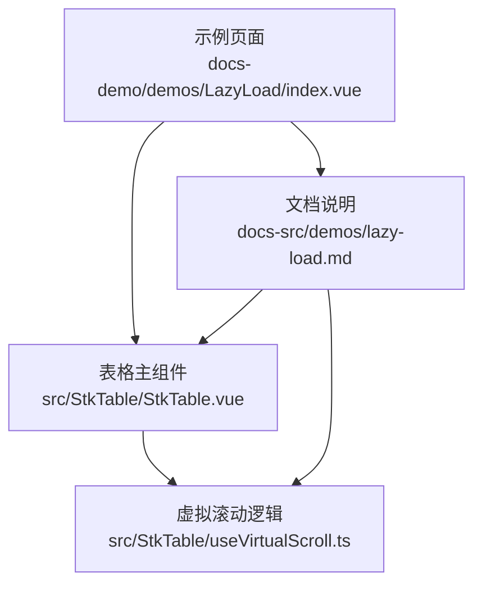
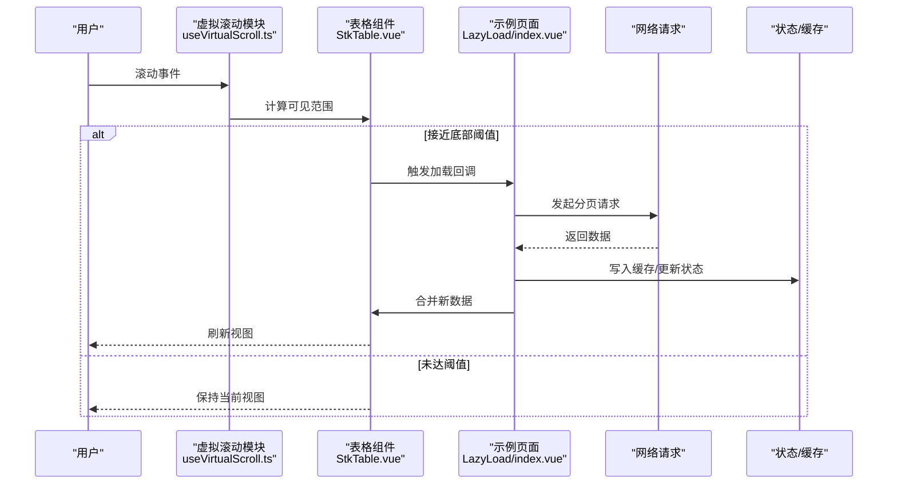

# 懒加载示例

<cite>
**本文引用的文件**   
- [LazyLoad/index.vue](file://docs-demo/demos/LazyLoad/index.vue)
- [lazy-load.md](file://docs-src/demos/lazy-load.md)
- [StkTable.vue](file://src/StkTable/StkTable.vue)
- [useVirtualScroll.ts](file://src/StkTable/useVirtualScroll.ts)
- [table-props.md](file://docs-src/main/api/table-props.md)
</cite>

## 目录
1. [简介](#简介)
2. [项目结构](#项目结构)
3. [核心组件与能力](#核心组件与能力)
4. [架构总览](#架构总览)
5. [详细实现分析](#详细实现分析)
6. [依赖关系分析](#依赖关系分析)
7. [性能考量](#性能考量)
8. [故障排查指南](#故障排查指南)
9. [结论](#结论)
10. [附录：配置项与触发时机](#附录配置项与触发时机)

## 简介
本示例聚焦于表格的“懒加载”能力，展示如何在用户滚动到可视区域附近时按需加载数据，从而降低首屏体积、缩短初始渲染时间并提升用户体验。文档涵盖：
- 懒加载的配置选项与触发时机控制
- 数据预加载策略（如视口外推、分页边界）
- 错误重试机制与加载状态反馈
- 网络请求优化与缓存策略最佳实践

## 项目结构
懒加载示例位于演示目录中，配套文档说明在 docs-src 下，核心表格组件与虚拟滚动逻辑位于 src 目录。

图表来源
- [LazyLoad/index.vue](file://docs-demo/demos/LazyLoad/index.vue)
- [lazy-load.md](file://docs-src/demos/lazy-load.md)
- [StkTable.vue](file://src/StkTable/StkTable.vue)
- [useVirtualScroll.ts](file://src/StkTable/useVirtualScroll.ts)

章节来源
- [LazyLoad/index.vue](file://docs-demo/demos/LazyLoad/index.vue)
- [lazy-load.md](file://docs-src/demos/lazy-load.md)
- [StkTable.vue](file://src/StkTable/StkTable.vue)
- [useVirtualScroll.ts](file://src/StkTable/useVirtualScroll.ts)

## 核心组件与能力
- 示例页面：通过 props 或插槽向表格传入列定义与数据源，并在滚动接近底部时触发数据加载。
- 表格主组件：提供统一的 API，包括分页、排序、筛选、虚拟滚动等；懒加载通常与虚拟滚动配合使用。
- 虚拟滚动：根据可视区域计算需要渲染的行范围，减少 DOM 节点数量，提高长列表性能。

章节来源
- [LazyLoad/index.vue](file://docs-demo/demos/LazyLoad/index.vue)
- [StkTable.vue](file://src/StkTable/StkTable.vue)
- [useVirtualScroll.ts](file://src/StkTable/useVirtualScroll.ts)

## 架构总览
懒加载的典型流程如下：
- 用户滚动触发可视区域变化
- 虚拟滚动计算当前可见行范围
- 若接近边界（如底部），则触发数据加载回调
- 业务层发起网络请求获取下一页数据
- 更新表格数据并维持滚动位置
- 失败时进行重试与错误提示

图表来源
- [useVirtualScroll.ts](file://src/StkTable/useVirtualScroll.ts)
- [StkTable.vue](file://src/StkTable/StkTable.vue)
- [LazyLoad/index.vue](file://docs-demo/demos/LazyLoad/index.vue)

## 详细实现分析

### 示例页面 LazyLoad/index.vue
- 职责：定义列、维护分页参数、处理加载回调、管理加载状态与错误提示。
- 关键点：
  - 监听滚动或接收表格回调以判断是否继续加载
  - 调用接口获取下一页数据，避免重复请求
  - 将新数据追加到现有数据集，保持滚动位置稳定
  - 显示加载中占位与错误重试入口

章节来源
- [LazyLoad/index.vue](file://docs-demo/demos/LazyLoad/index.vue)

### 表格主组件 StkTable.vue
- 职责：统一暴露表格 API，协调各功能模块（排序、筛选、虚拟滚动、懒加载）。
- 关键点：
  - 对外暴露加载回调与分页相关属性
  - 与虚拟滚动模块协作，决定何时触发加载
  - 管理内部状态（如 loading、error、data）

章节来源
- [StkTable.vue](file://src/StkTable/StkTable.vue)

### 虚拟滚动 useVirtualScroll.ts
- 职责：基于容器尺寸与行高估算，计算可视范围内的行索引区间，支持边界检测。
- 关键点：
  - 监听滚动事件，节流/防抖处理
  - 计算“接近底部”的阈值（如剩余行数小于 N）
  - 输出可见范围与边界信号供上层触发加载

章节来源
- [useVirtualScroll.ts](file://src/StkTable/useVirtualScroll.ts)

### 文档 lazy-load.md
- 职责：说明懒加载的使用方式、配置项、注意事项与常见问题。
- 关键点：
  - 如何启用懒加载与设置阈值
  - 与分页、虚拟滚动的组合用法
  - 常见陷阱与调试建议

章节来源
- [lazy-load.md](file://docs-src/demos/lazy-load.md)

## 依赖关系分析
- 示例页面依赖表格组件提供的加载回调与状态管理。
- 表格组件依赖虚拟滚动模块进行边界检测与性能优化。
- 文档为使用者提供配置与最佳实践指导。

图表来源
- [LazyLoad/index.vue](file://docs-demo/demos/LazyLoad/index.vue)
- [StkTable.vue](file://src/StkTable/StkTable.vue)
- [useVirtualScroll.ts](file://src/StkTable/useVirtualScroll.ts)
- [lazy-load.md](file://docs-src/demos/lazy-load.md)

章节来源
- [LazyLoad/index.vue](file://docs-demo/demos/LazyLoad/index.vue)
- [StkTable.vue](file://src/StkTable/StkTable.vue)
- [useVirtualScroll.ts](file://src/StkTable/useVirtualScroll.ts)
- [lazy-load.md](file://docs-src/demos/lazy-load.md)

## 性能考量
- 虚拟滚动：仅渲染可视区域行，显著降低 DOM 节点数量与重排开销。
- 请求去重：对同一页的请求进行去重，避免并发重复拉取。
- 节流/防抖：滚动事件处理需节流，避免频繁计算与触发。
- 增量更新：只追加新数据，不重置整个数据集，保持滚动位置。
- 内存管理：及时释放不再需要的数据引用，防止内存泄漏。
- 图片与富内容：延迟加载单元格内图片与复杂组件，减少首屏压力。

[本节为通用性能建议，不直接分析具体文件]

## 故障排查指南
- 症状：滚动到底部无数据加载
  - 检查阈值设置是否过小或过大
  - 确认滚动容器是否正确绑定与尺寸计算
  - 查看是否有重复请求被拦截
- 症状：加载后滚动位置跳动
  - 确保新增数据后不重置 scrollTop
  - 检查行高估算是否准确
- 症状：错误后无法恢复
  - 提供重试按钮并保留上次请求参数
  - 记录错误日志与堆栈信息

章节来源
- [lazy-load.md](file://docs-src/demos/lazy-load.md)

## 结论
通过结合虚拟滚动与懒加载，可以在大数据量场景下显著提升首屏性能与交互流畅度。合理设置阈值、做好请求去重与错误重试，并结合缓存策略，可进一步优化用户体验。

[本节为总结性内容，不直接分析具体文件]

## 附录：配置项与触发时机
- 常用配置项（参考表格属性文档）：
  - 分页参数：页码、每页条数、总条数
  - 加载回调：onLoadNextPage、onLoadPrevPage
  - 阈值控制：距离底部触发阈值（行数或像素）
  - 状态字段：loading、error、hasMore
- 触发时机：
  - 滚动至可视区域底部前 N 行时触发
  - 首次渲染后可选择预加载下一批数据
- 预加载策略：
  - 视口外推：提前加载即将进入可视区的行
  - 空闲加载：在主线程空闲时发起请求
- 错误重试：
  - 指数退避重试
  - 用户手动重试入口
- 缓存策略：
  - 按页码缓存响应数据
  - 失效策略：过期时间或脏写回退
- 网络优化：
  - 请求合并与去重
  - 压缩与分页大小调优
  - CDN 与静态资源缓存

章节来源
- [table-props.md](file://docs-src/main/api/table-props.md)