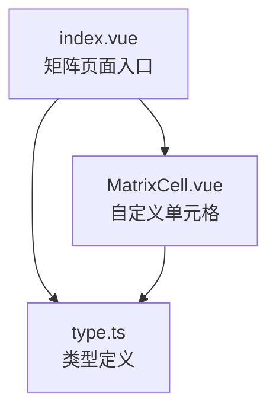
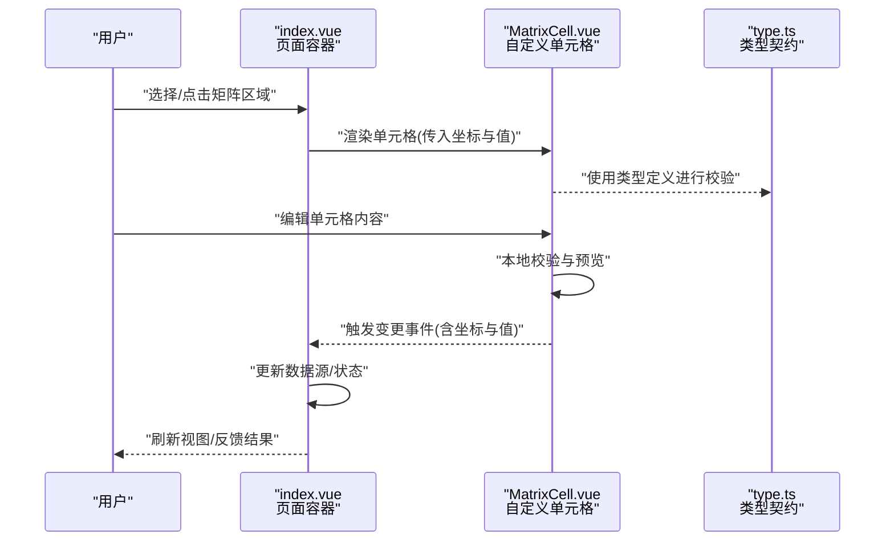
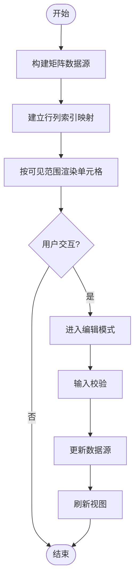
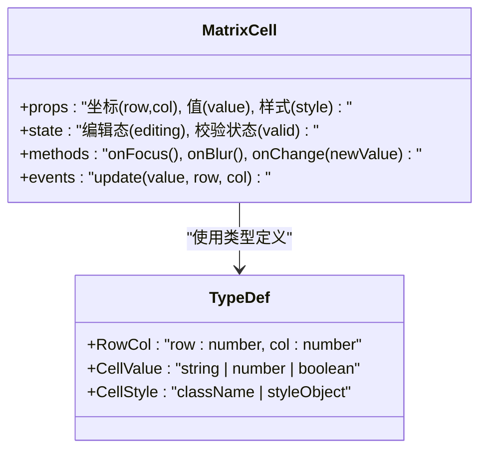
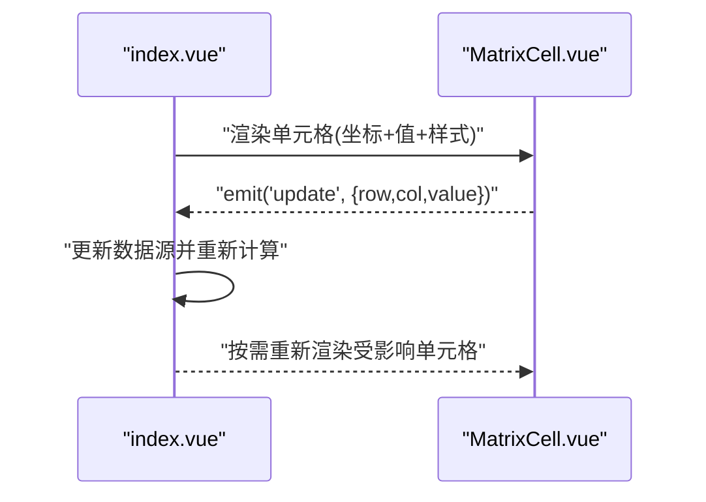
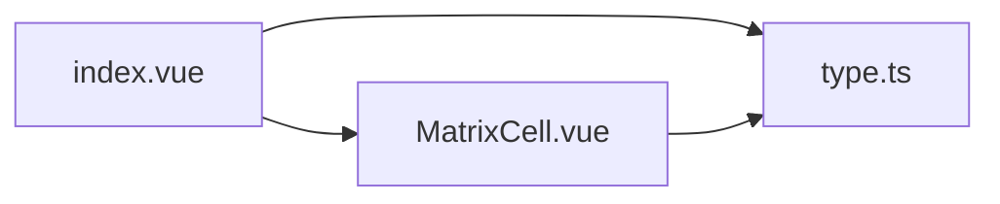

# 矩阵表格示例

<cite>
**本文引用的文件**   
- [MatrixCell.vue](file://docs-demo/demos/Matrix/MatrixCell.vue)
- [index.vue](file://docs-demo/demos/Matrix/index.vue)
- [type.ts](file://docs-demo/demos/Matrix/type.ts)
</cite>

## 目录
1. [简介](#简介)
2. [项目结构](#项目结构)
3. [核心组件](#核心组件)
4. [架构总览](#架构总览)
5. [详细组件分析](#详细组件分析)
6. [依赖关系分析](#依赖关系分析)
7. [性能考虑](#性能考虑)
8. [故障排查指南](#故障排查指南)
9. [结论](#结论)
10. [附录：应用场景与实现方案](#附录应用场景与实现方案)

## 简介
本示例聚焦“矩阵表格”能力，展示如何在二维数据场景中实现行列交叉点的数据编辑、样式定制与交互控制。通过自定义单元格 MatrixCell 与矩阵数据结构设计，提供坐标映射与事件处理逻辑，适用于财务报表、数据分析等复杂场景。

## 项目结构
矩阵示例位于 demos/Matrix 目录下，包含三个关键文件：
- index.vue：页面入口，负责矩阵数据准备、列头与行头的渲染配置、以及整体布局与交互编排。
- MatrixCell.vue：自定义单元格组件，承载交叉点数据的显示与编辑、样式定制与事件回调。
- type.ts：类型定义，描述矩阵数据结构、单元格属性、坐标与事件参数等。

**图表来源** 
- [index.vue](file://docs-demo/demos/Matrix/index.vue)
- [MatrixCell.vue](file://docs-demo/demos/Matrix/MatrixCell.vue)
- [type.ts](file://docs-demo/demos/Matrix/type.ts)

**章节来源**
- [index.vue](file://docs-demo/demos/Matrix/index.vue)
- [MatrixCell.vue](file://docs-demo/demos/Matrix/MatrixCell.vue)
- [type.ts](file://docs-demo/demos/Matrix/type.ts)

## 核心组件
- 矩阵页面（index.vue）
  - 职责：组织矩阵数据源、定义行列维度、绑定单元格渲染与编辑事件、管理选中状态与批量操作。
  - 关键点：行列标题渲染、单元格插槽或自定义组件注入、事件分发到上层业务逻辑。
- 自定义单元格（MatrixCell.vue）
  - 职责：渲染单个交叉点内容，支持文本、数值、格式化显示；提供编辑模式切换、输入校验、失焦保存、键盘导航。
  - 关键点：接收坐标与值、触发变更事件、根据样式策略渲染高亮/禁用/只读态。
- 类型定义（type.ts）
  - 职责：统一矩阵数据结构、单元格属性、坐标对象、事件参数类型，确保前后端一致性与可维护性。
  - 关键点：坐标映射（行索引/列索引）、单元格值类型、编辑态标志、样式类名约定。

**章节来源**
- [index.vue](file://docs-demo/demos/Matrix/index.vue)
- [MatrixCell.vue](file://docs-demo/demos/Matrix/MatrixCell.vue)
- [type.ts](file://docs-demo/demos/Matrix/type.ts)

## 架构总览
矩阵表格由“页面容器 + 自定义单元格 + 类型契约”构成。页面容器负责数据装配与事件编排，单元格专注渲染与交互，类型定义贯穿全链路保证一致性。

**图表来源** 
- [index.vue](file://docs-demo/demos/Matrix/index.vue)
- [MatrixCell.vue](file://docs-demo/demos/Matrix/MatrixCell.vue)
- [type.ts](file://docs-demo/demos/Matrix/type.ts)

## 详细组件分析

### 矩阵数据结构与坐标映射
- 数据结构设计
  - 采用二维数组或键值映射表示矩阵，行维度与列维度分别独立管理，便于扩展与虚拟化。
  - 单元格值类型支持字符串、数字、布尔及富文本，必要时封装为统一 Value 类型。
- 坐标映射
  - 坐标对象包含行索引与列索引，用于快速定位数据源中的单元格。
  - 行列标题与数据体分离，避免在大数据量时产生不必要的计算。

**图表来源** 
- [index.vue](file://docs-demo/demos/Matrix/index.vue)
- [type.ts](file://docs-demo/demos/Matrix/type.ts)

**章节来源**
- [index.vue](file://docs-demo/demos/Matrix/index.vue)
- [type.ts](file://docs-demo/demos/Matrix/type.ts)

### 自定义单元格 MatrixCell
- 渲染策略
  - 根据值类型与样式策略决定显示形态（如数值千分位、百分比、颜色标记）。
  - 支持只读、禁用、高亮、错误态等视觉反馈。
- 编辑流程
  - 双击或回车进入编辑，输入框获得焦点；失焦或确认提交后触发变更事件。
  - 支持撤销/重做、批量粘贴、快捷键导航（上下左右移动）。
- 事件契约
  - 变更事件携带坐标与新旧值，便于上层数据同步与审计日志记录。

**图表来源** 
- [MatrixCell.vue](file://docs-demo/demos/Matrix/MatrixCell.vue)
- [type.ts](file://docs-demo/demos/Matrix/type.ts)

**章节来源**
- [MatrixCell.vue](file://docs-demo/demos/Matrix/MatrixCell.vue)
- [type.ts](file://docs-demo/demos/Matrix/type.ts)

### 页面容器 index.vue
- 数据装配
  - 将原始数据转换为矩阵结构，并生成行列标题与元信息（如单位、格式、是否可编辑）。
- 事件编排
  - 监听单元格变更事件，合并更新数据源，触发必要的副作用（如汇总计算、导出）。
- 样式与主题
  - 通过 CSS 变量或类名控制网格线、对齐方式、悬停与选中态样式。

**图表来源** 
- [index.vue](file://docs-demo/demos/Matrix/index.vue)
- [MatrixCell.vue](file://docs-demo/demos/Matrix/MatrixCell.vue)

**章节来源**
- [index.vue](file://docs-demo/demos/Matrix/index.vue)
- [MatrixCell.vue](file://docs-demo/demos/Matrix/MatrixCell.vue)

## 依赖关系分析
- 组件耦合
  - index.vue 依赖 MatrixCell.vue 的 props 与事件接口；两者共同遵循 type.ts 的类型契约。
- 外部依赖
  - 无重型第三方库依赖，主要基于 Vue 组件模型与 TypeScript 类型系统。
- 潜在循环依赖
  - 通过类型解耦与事件驱动，避免直接双向绑定导致的循环依赖。

**图表来源** 
- [index.vue](file://docs-demo/demos/Matrix/index.vue)
- [MatrixCell.vue](file://docs-demo/demos/Matrix/MatrixCell.vue)
- [type.ts](file://docs-demo/demos/Matrix/type.ts)

**章节来源**
- [index.vue](file://docs-demo/demos/Matrix/index.vue)
- [MatrixCell.vue](file://docs-demo/demos/Matrix/MatrixCell.vue)
- [type.ts](file://docs-demo/demos/Matrix/type.ts)

## 性能考虑
- 虚拟滚动
  - 对超大矩阵建议启用行列虚拟滚动，仅渲染可视区域，降低 DOM 压力。
- 增量更新
  - 单元格变更仅更新受影响行/列，避免全表重渲染。
- 计算优化
  - 汇总与格式化计算应缓存结果，并在数据变化时惰性更新。
- 内存管理
  - 及时释放临时对象与事件监听器，防止内存泄漏。

[本节为通用指导，不直接分析具体文件]

## 故障排查指南
- 常见问题
  - 坐标错位：检查行列索引映射是否正确，边界条件（空行/空列）处理是否完备。
  - 编辑失效：确认单元格是否处于可编辑态，输入校验规则是否过于严格。
  - 样式错乱：核对样式类名与主题变量，避免覆盖冲突。
- 调试技巧
  - 打印坐标与值的变化轨迹，定位数据流问题。
  - 使用浏览器开发者工具观察组件生命周期与事件冒泡。

**章节来源**
- [index.vue](file://docs-demo/demos/Matrix/index.vue)
- [MatrixCell.vue](file://docs-demo/demos/Matrix/MatrixCell.vue)
- [type.ts](file://docs-demo/demos/Matrix/type.ts)

## 结论
本示例通过清晰的组件分层与类型契约，实现了矩阵表格的核心能力：二维数据展示、交叉点编辑、样式定制与交互控制。该模式可扩展至更多复杂场景，如动态行列、条件格式、联动计算等。

[本节为总结性内容，不直接分析具体文件]

## 附录：应用场景与实现方案
- 财务报表
  - 行列维度：科目×期间；单元格：金额、同比、环比；样式：正负色、千分位、合计行。
  - 交互：批量修改、公式校验、导出 Excel。
- 数据分析
  - 行列维度：指标×时间/地区；单元格：数值、占比、趋势箭头；样式：热力图、阈值告警。
  - 交互：筛选、排序、钻取、联动更新。
- 生产排程
  - 行列维度：产线×班次；单元格：计划量、实际量、达成率；样式：进度条、异常标红。
  - 交互：拖拽调整、冲突检测、自动平衡。

[本节为概念性说明，不直接分析具体文件]