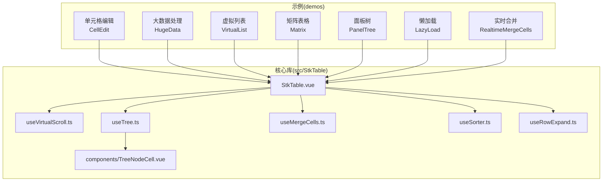
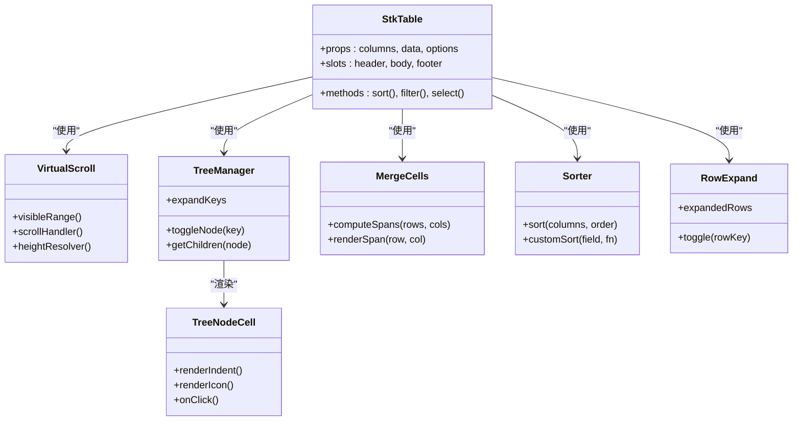
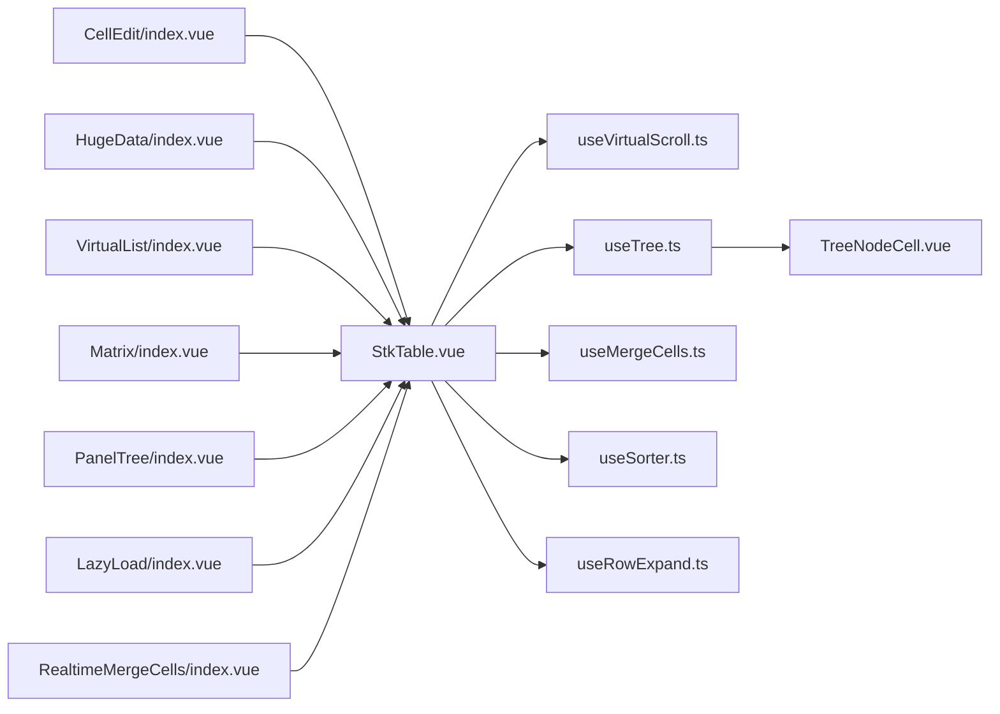

# 示例演示

<cite>
**本文引用的文件**   
- [docs-demo/demos/CellEdit/index.vue](file://docs-demo/demos/CellEdit/index.vue)
- [docs-demo/demos/CellEdit/EditCell.vue](file://docs-demo/demos/CellEdit/EditCell.vue)
- [docs-demo/demos/CellEdit/type.ts](file://docs-demo/demos/CellEdit/type.ts)
- [docs-demo/demos/HugeData/index.vue](file://docs-demo/demos/HugeData/index.vue)
- [docs-demo/demos/HugeData/mockData.ts](file://docs-demo/demos/HugeData/mockData.ts)
- [docs-demo/demos/HugeData/columns.ts](file://docs-demo/demos/HugeData/columns.ts)
- [docs-demo/demos/HugeData/event.ts](file://docs-demo/demos/HugeData/event.ts)
- [docs-demo/demos/HugeData/custom-cells/ExpandCell.vue](file://docs-demo/demos/HugeData/custom-cells/ExpandCell.vue)
- [docs-demo/demos/HugeData/custom-cells/SourceCell.vue](file://docs-demo/demos/HugeData/custom-cells/SourceCell.vue)
- [docs-demo/demos/VirtualList/index.vue](file://docs-demo/demos/VirtualList/index.vue)
- [docs-demo/demos/VirtualList/Panel.vue](file://docs-demo/demos/VirtualList/Panel.vue)
- [docs-demo/demos/VirtualList/types.ts](file://docs-demo/demos/VirtualList/types.ts)
- [docs-demo/demos/VirtualList/AutoHeightVirtualList/index.vue](file://docs-demo/demos/VirtualList/AutoHeightVirtualList/index.vue)
- [docs-demo/demos/VirtualList/AutoHeightVirtualList/Panel.vue](file://docs-demo/demos/VirtualList/AutoHeightVirtualList/Panel.vue)
- [docs-demo/demos/VirtualList/AutoHeightVirtualList/types.ts](file://docs-demo/demos/VirtualList/AutoHeightVirtualList/types.ts)
- [docs-demo/demos/Matrix/index.vue](file://docs-demo/demos/Matrix/index.vue)
- [docs-demo/demos/Matrix/MatrixCell.vue](file://docs-demo/demos/Matrix/MatrixCell.vue)
- [docs-demo/demos/Matrix/type.ts](file://docs-demo/demos/Matrix/type.ts)
- [docs-demo/demos/PanelTree/index.vue](file://docs-demo/demos/PanelTree/index.vue)
- [docs-demo/demos/PanelTree/type.ts](file://docs-demo/demos/PanelTree/type.ts)
- [docs-demo/demos/LazyLoad/index.vue](file://docs-demo/demos/LazyLoad/index.vue)
- [docs-demo/demos/RealtimeMergeCells/index.vue](file://docs-demo/demos/RealtimeMergeCells/index.vue)
- [src/StkTable/StkTable.vue](file://src/StkTable/StkTable.vue)
- [src/StkTable/useVirtualScroll.ts](file://src/StkTable/useVirtualScroll.ts)
- [src/StkTable/useTree.ts](file://src/StkTable/useTree.ts)
- [src/StkTable/useMergeCells.ts](file://src/StkTable/useMergeCells.ts)
- [src/StkTable/useSorter.ts](file://src/StkTable/useSorter.ts)
- [src/StkTable/useRowExpand.ts](file://src/StkTable/useRowExpand.ts)
- [src/StkTable/components/TreeNodeCell.vue](file://src/StkTable/components/TreeNodeCell.vue)
</cite>

## 目录
1. [简介](#简介)
2. [项目结构](#项目结构)
3. [核心组件与能力](#核心组件与能力)
4. [架构总览](#架构总览)
5. [详细示例分析](#详细示例分析)
6. [依赖关系分析](#依赖关系分析)
7. [性能优化建议](#性能优化建议)
8. [故障排查指南](#故障排查指南)
9. [结论](#结论)
10. [附录：在线演示与源码路径](#附录在线演示与源码路径)

## 简介
本示例演示集合围绕 stk-table-vue 的核心能力，提供一系列贴近真实业务场景的完整实现方案，涵盖单元格编辑、大数据处理、虚拟列表、矩阵表格、面板树等复杂场景。每个示例均包含完整的源代码、关键实现思路说明以及可复用的最佳实践，帮助你在实际项目中快速集成并高效使用 stk-table-vue。

## 项目结构
示例代码主要位于 docs-demo/demos 目录下，按功能维度组织；核心库实现位于 src/StkTable 目录，包括表格主体、虚拟滚动、树形、合并单元格、排序、行展开等能力。

图表来源
- [src/StkTable/StkTable.vue](file://src/StkTable/StkTable.vue)
- [src/StkTable/useVirtualScroll.ts](file://src/StkTable/useVirtualScroll.ts)
- [src/StkTable/useTree.ts](file://src/StkTable/useTree.ts)
- [src/StkTable/useMergeCells.ts](file://src/StkTable/useMergeCells.ts)
- [src/StkTable/useSorter.ts](file://src/StkTable/useSorter.ts)
- [src/StkTable/useRowExpand.ts](file://src/StkTable/useRowExpand.ts)
- [src/StkTable/components/TreeNodeCell.vue](file://src/StkTable/components/TreeNodeCell.vue)

章节来源
- [docs-demo/demos/CellEdit/index.vue](file://docs-demo/demos/CellEdit/index.vue)
- [docs-demo/demos/HugeData/index.vue](file://docs-demo/demos/HugeData/index.vue)
- [docs-demo/demos/VirtualList/index.vue](file://docs-demo/demos/VirtualList/index.vue)
- [docs-demo/demos/Matrix/index.vue](file://docs-demo/demos/Matrix/index.vue)
- [docs-demo/demos/PanelTree/index.vue](file://docs-demo/demos/PanelTree/index.vue)
- [docs-demo/demos/LazyLoad/index.vue](file://docs-demo/demos/LazyLoad/index.vue)
- [docs-demo/demos/RealtimeMergeCells/index.vue](file://docs-demo/demos/RealtimeMergeCells/index.vue)
- [src/StkTable/StkTable.vue](file://src/StkTable/StkTable.vue)

## 核心组件与能力
- StkTable 主组件：统一渲染表格、协调列配置、事件分发、插槽扩展与样式管理。
- useVirtualScroll：虚拟滚动核心逻辑，支持纵向/横向虚拟滚动与自适应高度。
- useTree：树形数据管理与节点展开/折叠状态维护。
- useMergeCells：行列合并计算与渲染策略。
- useSorter：多列排序、自定义排序器与远程排序支持。
- useRowExpand：行展开/收起与嵌套内容渲染。
- TreeNodeCell：树节点单元格渲染（含缩进、图标、点击交互）。

章节来源
- [src/StkTable/StkTable.vue](file://src/StkTable/StkTable.vue)
- [src/StkTable/useVirtualScroll.ts](file://src/StkTable/useVirtualScroll.ts)
- [src/StkTable/useTree.ts](file://src/StkTable/useTree.ts)
- [src/StkTable/useMergeCells.ts](file://src/StkTable/useMergeCells.ts)
- [src/StkTable/useSorter.ts](file://src/StkTable/useSorter.ts)
- [src/StkTable/useRowExpand.ts](file://src/StkTable/useRowExpand.ts)
- [src/StkTable/components/TreeNodeCell.vue](file://src/StkTable/components/TreeNodeCell.vue)

## 架构总览
stk-table-vue 采用“主表 + 能力 Hook”的架构模式。示例通过组合不同的能力 Hook 与自定义单元格，灵活拼装出复杂业务场景。

图表来源
- [src/StkTable/StkTable.vue](file://src/StkTable/StkTable.vue)
- [src/StkTable/useVirtualScroll.ts](file://src/StkTable/useVirtualScroll.ts)
- [src/StkTable/useTree.ts](file://src/StkTable/useTree.ts)
- [src/StkTable/useMergeCells.ts](file://src/StkTable/useMergeCells.ts)
- [src/StkTable/useSorter.ts](file://src/StkTable/useSorter.ts)
- [src/StkTable/useRowExpand.ts](file://src/StkTable/useRowExpand.ts)
- [src/StkTable/components/TreeNodeCell.vue](file://src/StkTable/components/TreeNodeCell.vue)

## 详细示例分析

### 单元格编辑（CellEdit）
- 目标：在表格中实现行内编辑、校验、提交与撤销。
- 关键点：
  - 使用自定义单元格组件封装输入控件与校验逻辑。
  - 通过事件回调将变更同步到数据源或触发保存流程。
  - 支持整行切换编辑态，提升批量操作体验。
- 推荐用法：
  - 为需要编辑的列配置自定义单元格类型。
  - 在父组件中集中处理保存与错误提示。

章节来源
- [docs-demo/demos/CellEdit/index.vue](file://docs-demo/demos/CellEdit/index.vue)
- [docs-demo/demos/CellEdit/EditCell.vue](file://docs-demo/demos/CellEdit/EditCell.vue)
- [docs-demo/demos/CellEdit/type.ts](file://docs-demo/demos/CellEdit/type.ts)

### 大数据处理（HugeData）
- 目标：展示万级数据的高效渲染与交互。
- 关键点：
  - 结合虚拟滚动减少 DOM 数量。
  - 使用惰性加载与分页/增量更新策略。
  - 自定义单元格按需渲染，避免重排重绘。
- 推荐用法：
  - 开启虚拟滚动并合理设置预估行高。
  - 对复杂单元格进行懒渲染与缓存。

章节来源
- [docs-demo/demos/HugeData/index.vue](file://docs-demo/demos/HugeData/index.vue)
- [docs-demo/demos/HugeData/mockData.ts](file://docs-demo/demos/HugeData/mockData.ts)
- [docs-demo/demos/HugeData/columns.ts](file://docs-demo/demos/HugeData/columns.ts)
- [docs-demo/demos/HugeData/event.ts](file://docs-demo/demos/HugeData/event.ts)
- [docs-demo/demos/HugeData/custom-cells/ExpandCell.vue](file://docs-demo/demos/HugeData/custom-cells/ExpandCell.vue)
- [docs-demo/demos/HugeData/custom-cells/SourceCell.vue](file://docs-demo/demos/HugeData/custom-cells/SourceCell.vue)

### 虚拟列表（VirtualList）
- 目标：超长列表的流畅滚动与自动高度适配。
- 关键点：
  - 纵向/横向虚拟滚动与可视区域计算。
  - 自适应高度列表（AutoHeight）与面板式布局。
  - 滚动位置保持与键盘导航。
- 推荐用法：
  - 为固定高度列表启用精确行高以提升性能。
  - 动态高度场景配合估算与测量回退策略。

章节来源
- [docs-demo/demos/VirtualList/index.vue](file://docs-demo/demos/VirtualList/index.vue)
- [docs-demo/demos/VirtualList/Panel.vue](file://docs-demo/demos/VirtualList/Panel.vue)
- [docs-demo/demos/VirtualList/types.ts](file://docs-demo/demos/VirtualList/types.ts)
- [docs-demo/demos/VirtualList/AutoHeightVirtualList/index.vue](file://docs-demo/demos/VirtualList/AutoHeightVirtualList/index.vue)
- [docs-demo/demos/VirtualList/AutoHeightVirtualList/Panel.vue](file://docs-demo/demos/VirtualList/AutoHeightVirtualList/Panel.vue)
- [docs-demo/demos/VirtualList/AutoHeightVirtualList/types.ts](file://docs-demo/demos/VirtualList/AutoHeightVirtualList/types.ts)

### 矩阵表格（Matrix）
- 目标：二维矩阵数据的可视化与交互（如热力图、评分矩阵）。
- 关键点：
  - 行列双向索引映射与单元格样式绑定。
  - 自定义单元格渲染（颜色映射、数值格式化）。
  - 鼠标悬停/点击反馈与选中区域联动。
- 推荐用法：
  - 将矩阵数据扁平化为行列坐标，配合虚拟滚动提升性能。
  - 使用插槽定制单元格显示与交互。

章节来源
- [docs-demo/demos/Matrix/index.vue](file://docs-demo/demos/Matrix/index.vue)
- [docs-demo/demos/Matrix/MatrixCell.vue](file://docs-demo/demos/Matrix/MatrixCell.vue)
- [docs-demo/demos/Matrix/type.ts](file://docs-demo/demos/Matrix/type.ts)

### 面板树（PanelTree）
- 目标：树形面板与表格结合的复合视图（如分类+明细）。
- 关键点：
  - 树节点展开/折叠与层级缩进。
  - 节点选择与表格数据联动过滤。
  - 虚拟树与表格数据的双向同步。
- 推荐用法：
  - 使用树能力 Hook 管理节点状态，表格根据选中节点过滤数据。
  - 大体积树数据采用懒加载与虚拟渲染。

章节来源
- [docs-demo/demos/PanelTree/index.vue](file://docs-demo/demos/PanelTree/index.vue)
- [docs-demo/demos/PanelTree/type.ts](file://docs-demo/demos/PanelTree/type.ts)

### 懒加载（LazyLoad）
- 目标：按需加载数据以减少首屏压力。
- 关键点：
  - 基于滚动触发的增量加载。
  - 占位骨架屏与错误重试机制。
  - 去抖与并发控制。
- 推荐用法：
  - 结合虚拟滚动与分页接口，保证滚动流畅与内存可控。

章节来源
- [docs-demo/demos/LazyLoad/index.vue](file://docs-demo/demos/LazyLoad/index.vue)

### 实时合并（RealtimeMergeCells）
- 目标：根据数据变化动态计算并渲染合并单元格。
- 关键点：
  - 合并规则引擎与增量更新。
  - 与排序、筛选、虚拟滚动的兼容。
  - 性能优化：局部重算与缓存。
- 推荐用法：
  - 将合并规则抽象为纯函数，便于测试与复用。

章节来源
- [docs-demo/demos/RealtimeMergeCells/index.vue](file://docs-demo/demos/RealtimeMergeCells/index.vue)

## 依赖关系分析
示例与核心库之间的依赖关系如下：示例通过 props、插槽与事件与 StkTable 交互；复杂场景通过组合 use* Hook 实现。

图表来源
- [docs-demo/demos/CellEdit/index.vue](file://docs-demo/demos/CellEdit/index.vue)
- [docs-demo/demos/HugeData/index.vue](file://docs-demo/demos/HugeData/index.vue)
- [docs-demo/demos/VirtualList/index.vue](file://docs-demo/demos/VirtualList/index.vue)
- [docs-demo/demos/Matrix/index.vue](file://docs-demo/demos/Matrix/index.vue)
- [docs-demo/demos/PanelTree/index.vue](file://docs-demo/demos/PanelTree/index.vue)
- [docs-demo/demos/LazyLoad/index.vue](file://docs-demo/demos/LazyLoad/index.vue)
- [docs-demo/demos/RealtimeMergeCells/index.vue](file://docs-demo/demos/RealtimeMergeCells/index.vue)
- [src/StkTable/StkTable.vue](file://src/StkTable/StkTable.vue)
- [src/StkTable/useVirtualScroll.ts](file://src/StkTable/useVirtualScroll.ts)
- [src/StkTable/useTree.ts](file://src/StkTable/useTree.ts)
- [src/StkTable/useMergeCells.ts](file://src/StkTable/useMergeCells.ts)
- [src/StkTable/useSorter.ts](file://src/StkTable/useSorter.ts)
- [src/StkTable/useRowExpand.ts](file://src/StkTable/useRowExpand.ts)
- [src/StkTable/components/TreeNodeCell.vue](file://src/StkTable/components/TreeNodeCell.vue)

章节来源
- [src/StkTable/StkTable.vue](file://src/StkTable/StkTable.vue)
- [src/StkTable/useVirtualScroll.ts](file://src/StkTable/useVirtualScroll.ts)
- [src/StkTable/useTree.ts](file://src/StkTable/useTree.ts)
- [src/StkTable/useMergeCells.ts](file://src/StkTable/useMergeCells.ts)
- [src/StkTable/useSorter.ts](file://src/StkTable/useSorter.ts)
- [src/StkTable/useRowExpand.ts](file://src/StkTable/useRowExpand.ts)
- [src/StkTable/components/TreeNodeCell.vue](file://src/StkTable/components/TreeNodeCell.vue)

## 性能优化建议
- 虚拟滚动优先：长列表务必启用虚拟滚动，合理设置预估行高与缓冲区间。
- 单元格懒渲染：复杂单元格按需渲染，必要时使用占位与骨架屏。
- 数据不可变更新：使用不可变数据结构，减少不必要的重渲染。
- 合并与排序增量计算：仅对受影响区域重算，避免全量刷新。
- 事件节流与防抖：滚动、搜索、筛选等操作进行节流/防抖处理。
- 内存管理：及时释放监听器与定时器，避免内存泄漏。

[本节为通用指导，不直接分析具体文件]

## 故障排查指南
- 虚拟滚动错位：检查行高估算是否准确，必要时启用精确行高模式或测量回退。
- 树节点状态异常：确认 key 唯一性与展开状态存储是否正确同步。
- 合并单元格失效：验证合并规则是否与排序/筛选顺序一致，确保增量更新覆盖所有分支。
- 自定义单元格未更新：检查 props 传递与响应式依赖，避免浅比较导致的更新遗漏。
- 大数据卡顿：关闭非必要的动画与高亮，简化单元格渲染逻辑，增加分页与懒加载。

[本节为通用指导，不直接分析具体文件]

## 结论
通过组合 stk-table-vue 的核心能力与示例中的实战模式，你可以快速构建高性能、可扩展的表格应用。建议在复杂场景中优先采用虚拟滚动、懒加载与增量更新策略，并结合自定义单元格与插槽满足多样化需求。

[本节为总结性内容，不直接分析具体文件]

## 附录：在线演示与源码路径
- 单元格编辑
  - 源码路径：[docs-demo/demos/CellEdit/index.vue](file://docs-demo/demos/CellEdit/index.vue)
  - 相关组件：[docs-demo/demos/CellEdit/EditCell.vue](file://docs-demo/demos/CellEdit/EditCell.vue)、[docs-demo/demos/CellEdit/type.ts](file://docs-demo/demos/CellEdit/type.ts)
- 大数据处理
  - 源码路径：[docs-demo/demos/HugeData/index.vue](file://docs-demo/demos/HugeData/index.vue)
  - 辅助模块：[docs-demo/demos/HugeData/mockData.ts](file://docs-demo/demos/HugeData/mockData.ts)、[docs-demo/demos/HugeData/columns.ts](file://docs-demo/demos/HugeData/columns.ts)、[docs-demo/demos/HugeData/event.ts](file://docs-demo/demos/HugeData/event.ts)
  - 自定义单元格：[docs-demo/demos/HugeData/custom-cells/ExpandCell.vue](file://docs-demo/demos/HugeData/custom-cells/ExpandCell.vue)、[docs-demo/demos/HugeData/custom-cells/SourceCell.vue](file://docs-demo/demos/HugeData/custom-cells/SourceCell.vue)
- 虚拟列表
  - 源码路径：[docs-demo/demos/VirtualList/index.vue](file://docs-demo/demos/VirtualList/index.vue)
  - 面板与类型：[docs-demo/demos/VirtualList/Panel.vue](file://docs-demo/demos/VirtualList/Panel.vue)、[docs-demo/demos/VirtualList/types.ts](file://docs-demo/demos/VirtualList/types.ts)
  - 自适应高度：[docs-demo/demos/VirtualList/AutoHeightVirtualList/index.vue](file://docs-demo/demos/VirtualList/AutoHeightVirtualList/index.vue)、[docs-demo/demos/VirtualList/AutoHeightVirtualList/Panel.vue](file://docs-demo/demos/VirtualList/AutoHeightVirtualList/Panel.vue)、[docs-demo/demos/VirtualList/AutoHeightVirtualList/types.ts](file://docs-demo/demos/VirtualList/AutoHeightVirtualList/types.ts)
- 矩阵表格
  - 源码路径：[docs-demo/demos/Matrix/index.vue](file://docs-demo/demos/Matrix/index.vue)
  - 单元格与类型：[docs-demo/demos/Matrix/MatrixCell.vue](file://docs-demo/demos/Matrix/MatrixCell.vue)、[docs-demo/demos/Matrix/type.ts](file://docs-demo/demos/Matrix/type.ts)
- 面板树
  - 源码路径：[docs-demo/demos/PanelTree/index.vue](file://docs-demo/demos/PanelTree/index.vue)
  - 类型定义：[docs-demo/demos/PanelTree/type.ts](file://docs-demo/demos/PanelTree/type.ts)
- 懒加载
  - 源码路径：[docs-demo/demos/LazyLoad/index.vue](file://docs-demo/demos/LazyLoad/index.vue)
- 实时合并
  - 源码路径：[docs-demo/demos/RealtimeMergeCells/index.vue](file://docs-demo/demos/RealtimeMergeCells/index.vue)

[本节为路径汇总，不直接分析具体文件]