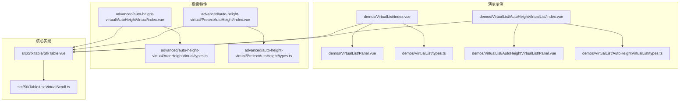
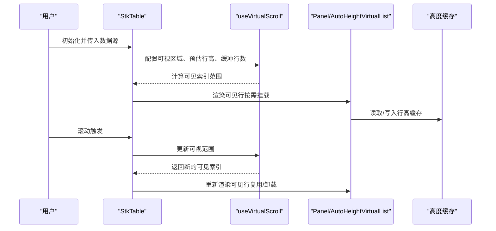
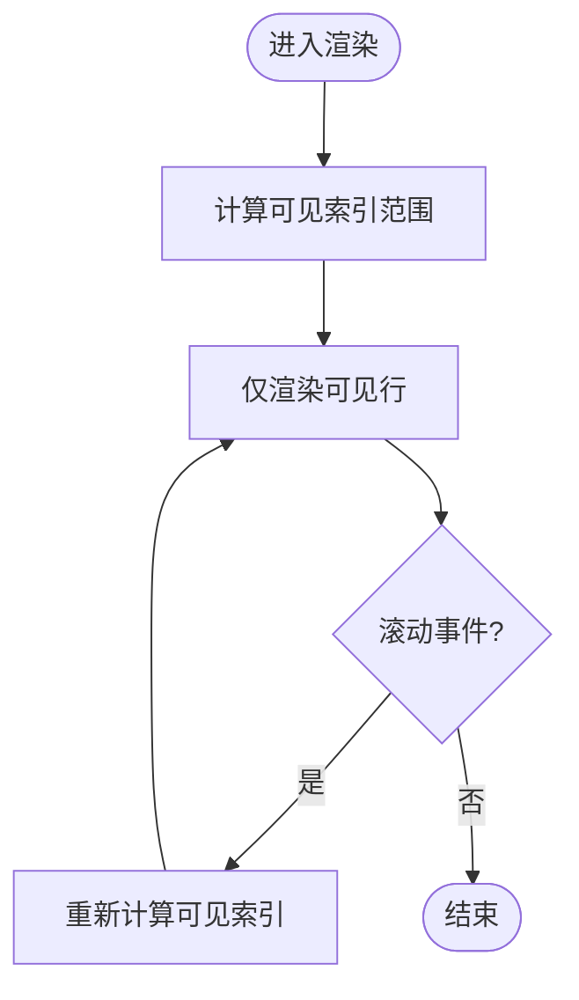
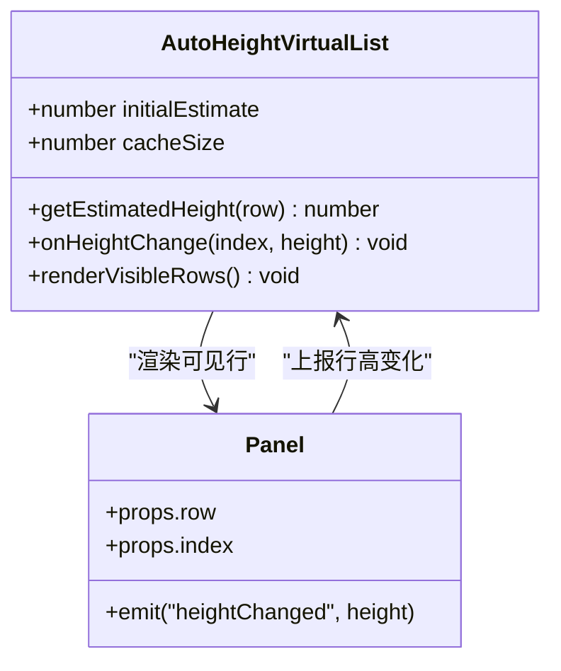
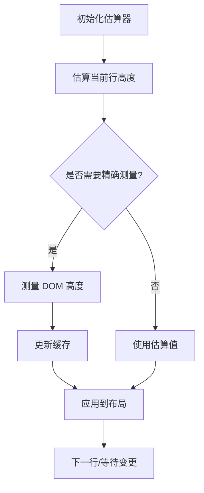
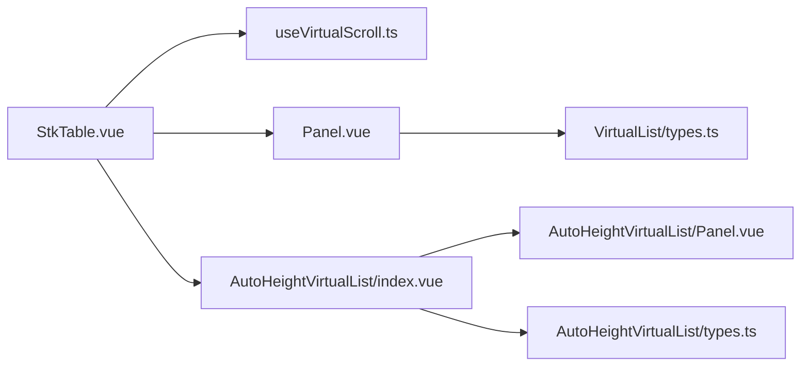

# 虚拟列表示例

<cite>
**本文引用的文件**   
- [AutoHeightVirtual/index.vue](file://docs-demo/advanced/auto-height-virtual/AutoHeightVirtual/index.vue)
- [AutoHeightVirtual/types.ts](file://docs-demo/advanced/auto-height-virtual/AutoHeightVirtual/types.ts)
- [PretextAutoHeight/index.vue](file://docs-demo/advanced/auto-height-virtual/PretextAutoHeight/index.vue)
- [PretextAutoHeight/types.ts](file://docs-demo/advanced/auto-height-virtual/PretextAutoHeight/types.ts)
- [VirtualList/index.vue](file://docs-demo/demos/VirtualList/index.vue)
- [VirtualList/Panel.vue](file://docs-demo/demos/VirtualList/Panel.vue)
- [VirtualList/types.ts](file://docs-demo/demos/VirtualList/types.ts)
- [AutoHeightVirtualList/index.vue](file://docs-demo/demos/VirtualList/AutoHeightVirtualList/index.vue)
- [AutoHeightVirtualList/Panel.vue](file://docs-demo/demos/VirtualList/AutoHeightVirtualList/Panel.vue)
- [AutoHeightVirtualList/types.ts](file://docs-demo/demos/VirtualList/AutoHeightVirtualList/types.ts)
- [useVirtualScroll.ts](file://src/StkTable/useVirtualScroll.ts)
- [StkTable.vue](file://src/StkTable/StkTable.vue)
</cite>

## 目录
1. [简介](#简介)
2. [项目结构](#项目结构)
3. [核心组件与类型](#核心组件与类型)
4. [架构总览](#架构总览)
5. [详细组件分析](#详细组件分析)
6. [依赖关系分析](#依赖关系分析)
7. [性能优化要点](#性能优化要点)
8. [故障排查指南](#故障排查指南)
9. [结论](#结论)
10. [附录：示例清单](#附录示例清单)

## 简介
本文件围绕“虚拟列表”能力，提供从固定高度到自适应高度的完整示例与实践指南。重点包括：
- 如何使用 Panel 组件配合虚拟滚动渲染大量数据
- AutoHeightVirtualList 的高级用法与自定义高度计算逻辑
- 滚动性能优化、内存使用与交互体验的平衡策略
- 在 StkTable 中启用并配置虚拟滚动的关键参数

## 项目结构
本项目将虚拟列表相关示例集中在 docs-demo 目录下，分为两类：
- 高级特性示例：docs-demo/advanced/auto-height-virtual（包含 AutoHeightVirtual 与 PretextAutoHeight）
- 演示用例：docs-demo/demos/VirtualList（包含基础虚拟列表与 AutoHeightVirtualList）

图表来源
- [VirtualList/index.vue](file://docs-demo/demos/VirtualList/index.vue)
- [VirtualList/Panel.vue](file://docs-demo/demos/VirtualList/Panel.vue)
- [VirtualList/types.ts](file://docs-demo/demos/VirtualList/types.ts)
- [AutoHeightVirtualList/index.vue](file://docs-demo/demos/VirtualList/AutoHeightVirtualList/index.vue)
- [AutoHeightVirtualList/Panel.vue](file://docs-demo/demos/VirtualList/AutoHeightVirtualList/Panel.vue)
- [AutoHeightVirtualList/types.ts](file://docs-demo/demos/VirtualList/AutoHeightVirtualList/types.ts)
- [AutoHeightVirtual/index.vue](file://docs-demo/advanced/auto-height-virtual/AutoHeightVirtual/index.vue)
- [AutoHeightVirtual/types.ts](file://docs-demo/advanced/auto-height-virtual/AutoHeightVirtual/types.ts)
- [PretextAutoHeight/index.vue](file://docs-demo/advanced/auto-height-virtual/PretextAutoHeight/index.vue)
- [PretextAutoHeight/types.ts](file://docs-demo/advanced/auto-height-virtual/PretextAutoHeight/types.ts)
- [StkTable.vue](file://src/StkTable/StkTable.vue)
- [useVirtualScroll.ts](file://src/StkTable/useVirtualScroll.ts)

章节来源
- [VirtualList/index.vue](file://docs-demo/demos/VirtualList/index.vue)
- [AutoHeightVirtualList/index.vue](file://docs-demo/demos/VirtualList/AutoHeightVirtualList/index.vue)
- [AutoHeightVirtual/index.vue](file://docs-demo/advanced/auto-height-virtual/AutoHeightVirtual/index.vue)
- [PretextAutoHeight/index.vue](file://docs-demo/advanced/auto-height-virtual/PretextAutoHeight/index.vue)
- [StkTable.vue](file://src/StkTable/StkTable.vue)
- [useVirtualScroll.ts](file://src/StkTable/useVirtualScroll.ts)

## 核心组件与类型
- Panel 组件
  - 用于承载单行内容，支持固定高度或自适应高度两种模式
  - 在自适应模式下，通过回调函数返回每行的高度，供虚拟滚动容器进行布局估算
- AutoHeightVirtualList
  - 基于 StkTable 的虚拟滚动能力，专门处理行高不固定的场景
  - 暴露高度计算接口，允许根据单元格内容动态估算行高
- 类型定义
  - types.ts 中定义了 Panel 的 props、事件以及 AutoHeightVirtualList 的配置项，如初始估计高度、缓存策略等

章节来源
- [VirtualList/Panel.vue](file://docs-demo/demos/VirtualList/Panel.vue)
- [VirtualList/types.ts](file://docs-demo/demos/VirtualList/types.ts)
- [AutoHeightVirtualList/Panel.vue](file://docs-demo/demos/VirtualList/AutoHeightVirtualList/Panel.vue)
- [AutoHeightVirtualList/types.ts](file://docs-demo/demos/VirtualList/AutoHeightVirtualList/types.ts)
- [AutoHeightVirtual/types.ts](file://docs-demo/advanced/auto-height-virtual/AutoHeightVirtual/types.ts)
- [PretextAutoHeight/types.ts](file://docs-demo/advanced/auto-height-virtual/PretextAutoHeight/types.ts)

## 架构总览
虚拟列表的核心由 StkTable 与 useVirtualScroll 组合实现。Panel 作为行渲染单元，按需挂载与卸载，从而控制 DOM 数量与内存占用。AutoHeightVirtualList 在此基础上扩展了自适应高度的估算与缓存机制。

图表来源
- [StkTable.vue](file://src/StkTable/StkTable.vue)
- [useVirtualScroll.ts](file://src/StkTable/useVirtualScroll.ts)
- [VirtualList/Panel.vue](file://docs-demo/demos/VirtualList/Panel.vue)
- [AutoHeightVirtualList/Panel.vue](file://docs-demo/demos/VirtualList/AutoHeightVirtualList/Panel.vue)

## 详细组件分析

### 固定高度虚拟列表（Panel + StkTable）
- 适用场景：行高固定且可预测，适合大数据量表格的快速渲染
- 关键点：
  - 设置固定行高，减少高度计算开销
  - 合理配置可视区域与缓冲行数，平衡滚动流畅度与内存占用
  - 避免在 Panel 中进行重计算，必要时使用 memoization

章节来源
- [VirtualList/index.vue](file://docs-demo/demos/VirtualList/index.vue)
- [VirtualList/Panel.vue](file://docs-demo/demos/VirtualList/Panel.vue)
- [VirtualList/types.ts](file://docs-demo/demos/VirtualList/types.ts)
- [useVirtualScroll.ts](file://src/StkTable/useVirtualScroll.ts)

### 自适应高度虚拟列表（AutoHeightVirtualList）
- 适用场景：行内容高度不确定（如富文本、图片、折叠面板）
- 关键点：
  - 提供初始估计高度，提升首屏渲染速度
  - 使用高度缓存，避免重复测量
  - 在内容变化时更新缓存并触发重排

图表来源
- [AutoHeightVirtualList/index.vue](file://docs-demo/demos/VirtualList/AutoHeightVirtualList/index.vue)
- [AutoHeightVirtualList/Panel.vue](file://docs-demo/demos/VirtualList/AutoHeightVirtualList/Panel.vue)
- [AutoHeightVirtualList/types.ts](file://docs-demo/demos/VirtualList/AutoHeightVirtualList/types.ts)

章节来源
- [AutoHeightVirtualList/index.vue](file://docs-demo/demos/VirtualList/AutoHeightVirtualList/index.vue)
- [AutoHeightVirtualList/Panel.vue](file://docs-demo/demos/VirtualList/AutoHeightVirtualList/Panel.vue)
- [AutoHeightVirtualList/types.ts](file://docs-demo/demos/VirtualList/AutoHeightVirtualList/types.ts)

### 高级用法：AutoHeightVirtual 与 PretextAutoHeight
- AutoHeightVirtual：通用自适应高度方案，适用于任意复杂行内容
- PretextAutoHeight：针对预知内容的快速估算方案，适合已知结构的行（如标题+摘要）

图表来源
- [AutoHeightVirtual/index.vue](file://docs-demo/advanced/auto-height-virtual/AutoHeightVirtual/index.vue)
- [AutoHeightVirtual/types.ts](file://docs-demo/advanced/auto-height-virtual/AutoHeightVirtual/types.ts)
- [PretextAutoHeight/index.vue](file://docs-demo/advanced/auto-height-virtual/PretextAutoHeight/index.vue)
- [PretextAutoHeight/types.ts](file://docs-demo/advanced/auto-height-virtual/PretextAutoHeight/types.ts)

章节来源
- [AutoHeightVirtual/index.vue](file://docs-demo/advanced/auto-height-virtual/AutoHeightVirtual/index.vue)
- [AutoHeightVirtual/types.ts](file://docs-demo/advanced/auto-height-virtual/AutoHeightVirtual/types.ts)
- [PretextAutoHeight/index.vue](file://docs-demo/advanced/auto-height-virtual/PretextAutoHeight/index.vue)
- [PretextAutoHeight/types.ts](file://docs-demo/advanced/auto-height-virtual/PretextAutoHeight/types.ts)

### Panel 组件使用方法与类型定义
- 基本用法
  - 作为 StkTable 的行渲染单元，接收 row 与 index 属性
  - 在自适应模式下，通过事件或回调上报实际高度
- 类型定义要点
  - props：row、index、可选的样式与事件绑定
  - events：高度变化事件、点击/编辑等交互事件
  - 在 AutoHeightVirtualList 中，需遵循其高度上报约定

章节来源
- [VirtualList/Panel.vue](file://docs-demo/demos/VirtualList/Panel.vue)
- [VirtualList/types.ts](file://docs-demo/demos/VirtualList/types.ts)
- [AutoHeightVirtualList/Panel.vue](file://docs-demo/demos/VirtualList/AutoHeightVirtualList/Panel.vue)
- [AutoHeightVirtualList/types.ts](file://docs-demo/demos/VirtualList/AutoHeightVirtualList/types.ts)

## 依赖关系分析
- StkTable 负责整体布局与事件分发
- useVirtualScroll 提供可视区域计算与索引管理
- Panel 与 AutoHeightVirtualList 作为渲染层，向上汇报高度信息
- 类型定义集中管理接口契约，降低耦合

图表来源
- [StkTable.vue](file://src/StkTable/StkTable.vue)
- [useVirtualScroll.ts](file://src/StkTable/useVirtualScroll.ts)
- [VirtualList/Panel.vue](file://docs-demo/demos/VirtualList/Panel.vue)
- [VirtualList/types.ts](file://docs-demo/demos/VirtualList/types.ts)
- [AutoHeightVirtualList/index.vue](file://docs-demo/demos/VirtualList/AutoHeightVirtualList/index.vue)
- [AutoHeightVirtualList/Panel.vue](file://docs-demo/demos/VirtualList/AutoHeightVirtualList/Panel.vue)
- [AutoHeightVirtualList/types.ts](file://docs-demo/demos/VirtualList/AutoHeightVirtualList/types.ts)

章节来源
- [StkTable.vue](file://src/StkTable/StkTable.vue)
- [useVirtualScroll.ts](file://src/StkTable/useVirtualScroll.ts)
- [VirtualList/types.ts](file://docs-demo/demos/VirtualList/types.ts)
- [AutoHeightVirtualList/types.ts](file://docs-demo/demos/VirtualList/AutoHeightVirtualList/types.ts)

## 性能优化要点
- 固定高度优先：若行高稳定，尽量使用固定高度以减少测量与重排
- 合理估算与缓存：为自适应高度提供准确的初始估算，并限制缓存大小
- 可视区域与缓冲：根据设备性能调整可视区域与缓冲行数，避免过多 DOM
- 避免重计算：在 Panel 内对昂贵计算做 memoization，或使用计算属性
- 事件节流：滚动与输入事件进行节流/防抖，降低主线程压力
- 懒加载与分页：结合后端分页或前端懒加载，减少一次性数据量

[本节为通用指导，不直接分析具体文件]

## 故障排查指南
- 行高不正确
  - 检查自适应高度回调是否被正确调用
  - 确认高度缓存未过期或被错误覆盖
- 滚动卡顿
  - 评估可视区域与缓冲行数是否过大
  - 检查 Panel 内是否存在阻塞渲染的计算
- 内存泄漏
  - 确保不可见行的监听器与定时器已清理
  - 避免在 Panel 中持有长生命周期引用

章节来源
- [useVirtualScroll.ts](file://src/StkTable/useVirtualScroll.ts)
- [AutoHeightVirtualList/index.vue](file://docs-demo/demos/VirtualList/AutoHeightVirtualList/index.vue)
- [AutoHeightVirtual/index.vue](file://docs-demo/advanced/auto-height-virtual/AutoHeightVirtual/index.vue)

## 结论
通过 StkTable 与 useVirtualScroll 的组合，可以在保证交互流畅的前提下高效渲染海量数据。对于行高不确定的场景，AutoHeightVirtualList 提供了灵活的估算与缓存机制。合理使用 Panel 组件与类型定义，能够构建出高性能、易维护的虚拟列表应用。

[本节为总结性内容，不直接分析具体文件]

## 附录：示例清单
- 固定高度虚拟列表
  - 入口：docs-demo/demos/VirtualList/index.vue
  - 行组件：docs-demo/demos/VirtualList/Panel.vue
  - 类型：docs-demo/demos/VirtualList/types.ts
- 自适应高度虚拟列表
  - 入口：docs-demo/demos/VirtualList/AutoHeightVirtualList/index.vue
  - 行组件：docs-demo/demos/VirtualList/AutoHeightVirtualList/Panel.vue
  - 类型：docs-demo/demos/VirtualList/AutoHeightVirtualList/types.ts
- 高级自适应高度
  - AutoHeightVirtual：docs-demo/advanced/auto-height-virtual/AutoHeightVirtual/index.vue
  - PretextAutoHeight：docs-demo/advanced/auto-height-virtual/PretextAutoHeight/index.vue

章节来源
- [VirtualList/index.vue](file://docs-demo/demos/VirtualList/index.vue)
- [VirtualList/Panel.vue](file://docs-demo/demos/VirtualList/Panel.vue)
- [VirtualList/types.ts](file://docs-demo/demos/VirtualList/types.ts)
- [AutoHeightVirtualList/index.vue](file://docs-demo/demos/VirtualList/AutoHeightVirtualList/index.vue)
- [AutoHeightVirtualList/Panel.vue](file://docs-demo/demos/VirtualList/AutoHeightVirtualList/Panel.vue)
- [AutoHeightVirtualList/types.ts](file://docs-demo/demos/VirtualList/AutoHeightVirtualList/types.ts)
- [AutoHeightVirtual/index.vue](file://docs-demo/advanced/auto-height-virtual/AutoHeightVirtual/index.vue)
- [PretextAutoHeight/index.vue](file://docs-demo/advanced/auto-height-virtual/PretextAutoHeight/index.vue)