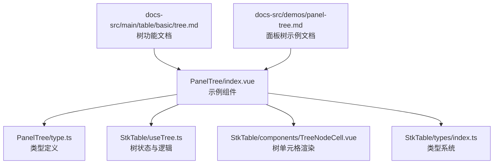
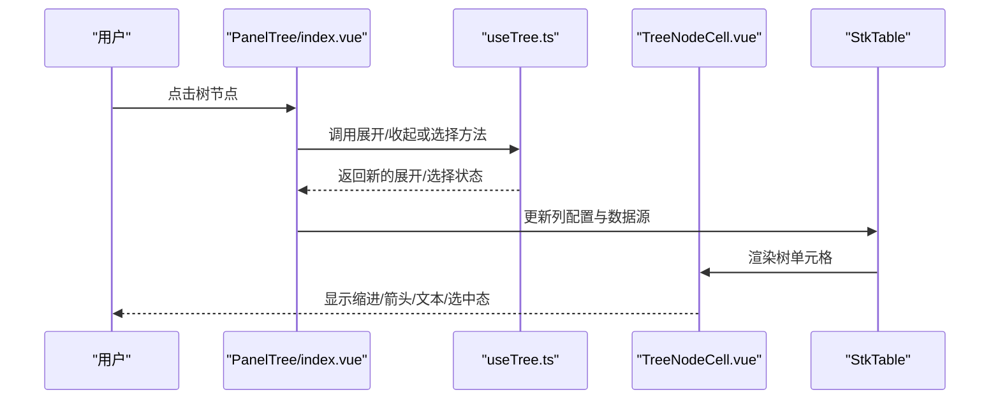
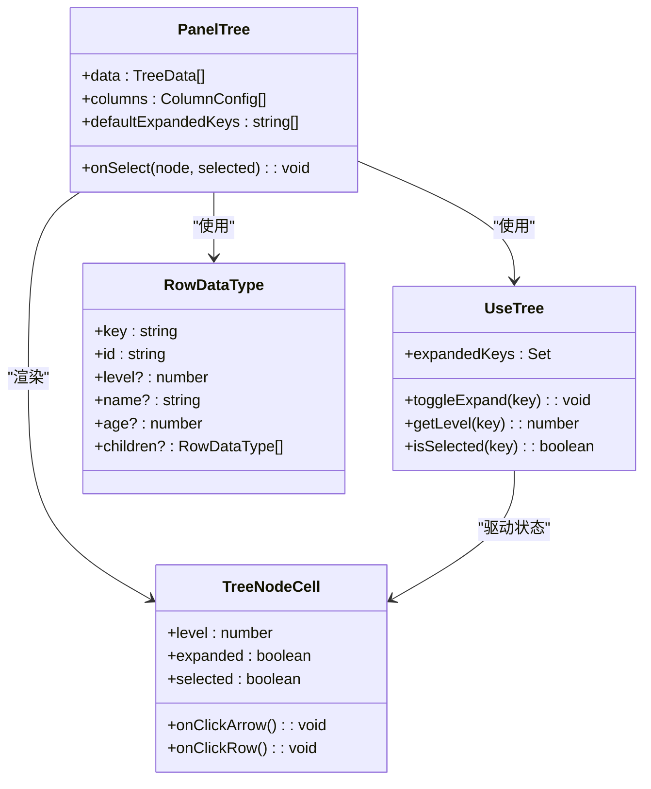
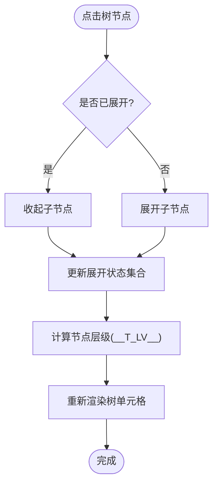
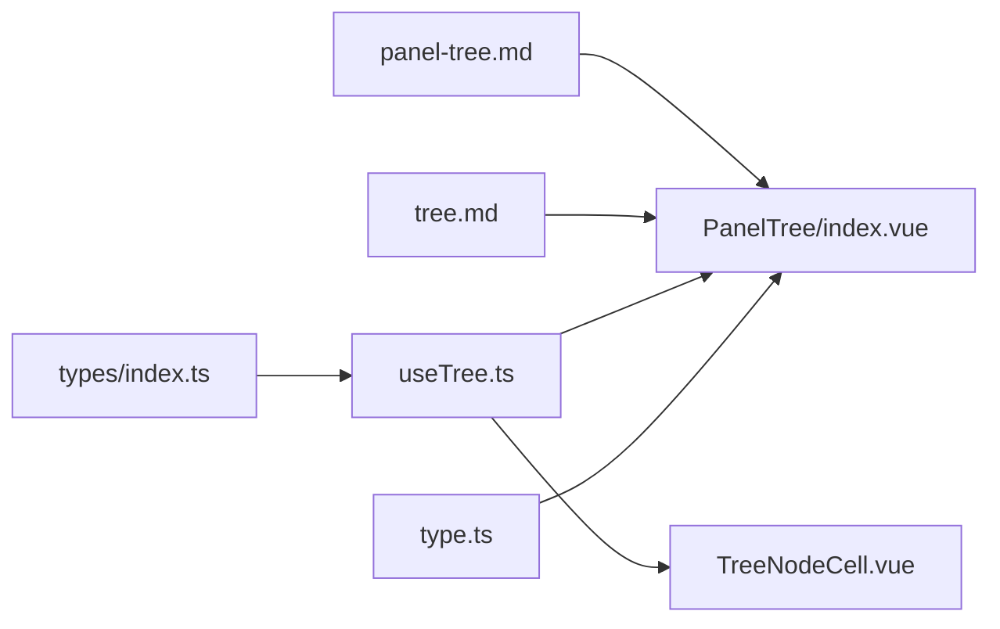

# 面板树示例

<cite>
**本文引用的文件**   
- [PanelTree/index.vue](file://docs-demo/demos/PanelTree/index.vue)
- [PanelTree/type.ts](file://docs-demo/demos/PanelTree/type.ts)
- [src/StkTable/useTree.ts](file://src/StkTable/useTree.ts)
- [src/StkTable/components/TreeNodeCell.vue](file://src/StkTable/components/TreeNodeCell.vue)
- [src/StkTable/types/index.ts](file://src/StkTable/types/index.ts)
- [src/StkTable/style.less](file://src/StkTable/style.less)
- [docs-src/main/table/basic/tree.md](file://docs-src/main/table/basic/tree.md)
- [docs-src/demos/panel-tree.md](file://docs-src/demos/panel-tree.md)
</cite>

## 更新摘要
**变更内容**   
- 增强了行分类逻辑，支持 level 属性（level 0, 1, 2）用于层级标识
- 改进了列配置使用 v-model:columns 进行双向绑定
- 优化了边框样式和视觉效果
- 更新了数据结构以支持更清晰的层级管理
- 增强了面板头行的样式处理和交互体验

## 目录
1. [简介](#简介)
2. [项目结构](#项目结构)
3. [核心组件与能力](#核心组件与能力)
4. [架构总览](#架构总览)
5. [详细组件分析](#详细组件分析)
6. [依赖关系分析](#依赖关系分析)
7. [性能考量](#性能考量)
8. [故障排查指南](#故障排查指南)
9. [结论](#结论)
10. [附录：类型定义与数据结构](#附录类型定义与数据结构)

## 简介
本示例聚焦"面板树"在表格中的集成方案，展示如何在表格中呈现树形数据，支持节点展开收起、层级缩进显示与选择操作。文档覆盖数据类型设计、数据处理逻辑、性能优化策略与用户体验要点，并提供组织架构、分类管理等常见业务场景的实现模式。

**更新** 最新版本增强了层级管理能力，通过 level 属性明确标识节点层级（0、1、2），改进了列配置的双向绑定机制，并优化了面板头行的视觉样式和交互体验。

## 项目结构
面板树示例位于演示目录 docs-demo/demos/PanelTree，包含组件实现与类型定义；表格侧的树能力由 StkTable 内部 useTree 与 TreeNodeCell 提供支撑；文档说明位于 docs-src。

**图表来源**
- [PanelTree/index.vue](file://docs-demo/demos/PanelTree/index.vue)
- [PanelTree/type.ts](file://docs-demo/demos/PanelTree/type.ts)
- [src/StkTable/useTree.ts](file://src/StkTable/useTree.ts)
- [src/StkTable/components/TreeNodeCell.vue](file://src/StkTable/components/TreeNodeCell.vue)
- [src/StkTable/types/index.ts](file://src/StkTable/types/index.ts)
- [docs-src/main/table/basic/tree.md](file://docs-src/main/table/basic/tree.md)
- [docs-src/demos/panel-tree.md](file://docs-src/demos/panel-tree.md)

章节来源
- [PanelTree/index.vue](file://docs-demo/demos/PanelTree/index.vue)
- [PanelTree/type.ts](file://docs-demo/demos/PanelTree/type.ts)
- [src/StkTable/useTree.ts](file://src/StkTable/useTree.ts)
- [src/StkTable/components/TreeNodeCell.vue](file://src/StkTable/components/TreeNodeCell.vue)
- [docs-src/main/table/basic/tree.md](file://docs-src/main/table/basic/tree.md)
- [docs-src/demos/panel-tree.md](file://docs-src/demos/panel-tree.md)

## 核心组件与能力
- 示例组件 PanelTree：组织表格列配置、树数据源、默认展开键/层级等，并绑定选择事件。
- 类型定义 type.ts：定义树节点、列配置、选择回调等接口，确保类型安全。
- useTree：管理树节点的展开/收起状态、层级计算、虚拟滚动适配等核心逻辑。
- TreeNodeCell：渲染树节点图标（展开/折叠）、缩进、文本及自定义内容插槽。
- 类型系统 types/index.ts：提供完整的类型定义，包括 PrivateRowDT 的 __T_LV__ 层级属性。

**更新** 新增了 level 属性的层级管理机制，支持更精确的行分类和样式控制。

章节来源
- [PanelTree/index.vue](file://docs-demo/demos/PanelTree/index.vue)
- [PanelTree/type.ts](file://docs-demo/demos/PanelTree/type.ts)
- [src/StkTable/useTree.ts](file://src/StkTable/useTree.ts)
- [src/StkTable/components/TreeNodeCell.vue](file://src/StkTable/components/TreeNodeCell.vue)
- [src/StkTable/types/index.ts](file://src/StkTable/types/index.ts)

## 架构总览
面板树在表格中的交互流程如下：用户点击树节点触发展开/收起或选择，useTree 更新状态并驱动视图重渲染；TreeNodeCell 根据层级与展开状态渲染缩进与箭头图标；示例组件负责将数据与列配置注入表格。

**图表来源**
- [PanelTree/index.vue](file://docs-demo/demos/PanelTree/index.vue)
- [src/StkTable/useTree.ts](file://src/StkTable/useTree.ts)
- [src/StkTable/components/TreeNodeCell.vue](file://src/StkTable/components/TreeNodeCell.vue)

## 详细组件分析

### 示例组件 PanelTree
- 职责：组装树数据、列配置、默认展开键/层级、选择回调；将配置传递给 StkTable。
- 关键点：
  - 树数据需包含唯一标识字段用于展开/收起与选择定位。
  - 通过列配置启用树单元格渲染，并在需要时传入自定义渲染插槽。
  - 处理选择事件，维护已选节点集合或单项选择状态。
  - **新增** 使用 v-model:columns 实现列配置的双向绑定。
  - **增强** 通过 row-class-name 和 row-active.disabled 实现面板头行的特殊样式和交互控制。

**更新** 改进了列配置的管理方式，使用 v-model:columns 提供更好的响应式支持。

章节来源
- [PanelTree/index.vue](file://docs-demo/demos/PanelTree/index.vue)
- [PanelTree/type.ts](file://docs-demo/demos/PanelTree/type.ts)

### 类型定义 type.ts
- 职责：定义树节点、列配置、选择回调等类型，保证类型一致性与可维护性。
- 关键点：
  - 树节点类型应包含 id、label、children、可选的 expanded、selected 等字段。
  - 列配置需声明树单元格渲染方式与插槽。
  - 选择回调类型明确入参与返回值，便于上层状态管理。
  - **新增** level 属性用于标识节点层级（0、1、2）。

**更新** 添加了 level 可选属性，支持更精确的层级管理。

章节来源
- [PanelTree/type.ts](file://docs-demo/demos/PanelTree/type.ts)

### 树逻辑 useTree.ts
- 职责：管理树节点的展开/收起、层级计算、虚拟滚动下的可见行映射、选择状态同步。
- 关键点：
  - 使用稳定的 key 标识节点，避免不必要的重渲染。
  - 展开/收起状态以 Map/Set 存储，提升查找与更新效率。
  - 与虚拟滚动协作，仅渲染可视区域节点，降低内存占用。
  - **增强** 通过 __T_LV__ 属性管理节点层级信息。

**更新** 改进了层级计算逻辑，支持 level 属性的精确控制。

章节来源
- [src/StkTable/useTree.ts](file://src/StkTable/useTree.ts)

### 树单元格 TreeNodeCell.vue
- 职责：渲染树节点的前缀图标（展开/折叠）、缩进、文本与自定义内容。
- 关键点：
  - 根据层级计算缩进样式，确保视觉层次清晰。
  - 点击箭头触发展开/收起，点击整行触发选择。
  - 支持插槽扩展，满足复杂内容的定制需求。
  - **优化** 使用 row.__T_LV__ 进行缩进计算。

**更新** 改进了缩进计算逻辑，使用 __T_LV__ 属性提供更准确的层级缩进。

章节来源
- [src/StkTable/components/TreeNodeCell.vue](file://src/StkTable/components/TreeNodeCell.vue)

#### 类图（代码级）

**图表来源**
- [PanelTree/index.vue](file://docs-demo/demos/PanelTree/index.vue)
- [PanelTree/type.ts](file://docs-demo/demos/PanelTree/type.ts)
- [src/StkTable/useTree.ts](file://src/StkTable/useTree.ts)
- [src/StkTable/components/TreeNodeCell.vue](file://src/StkTable/components/TreeNodeCell.vue)

#### 流程图（展开/收起算法）

**图表来源**
- [src/StkTable/useTree.ts](file://src/StkTable/useTree.ts)
- [src/StkTable/components/TreeNodeCell.vue](file://src/StkTable/components/TreeNodeCell.vue)

## 依赖关系分析
- PanelTree 依赖 type.ts 的类型定义，确保数据与列配置的结构一致性。
- PanelTree 依赖 useTree 提供的树状态管理与行为方法。
- TreeNodeCell 依赖 useTree 的状态输出进行渲染。
- 文档 tree.md 与 panel-tree.md 为使用指引与示例说明。
- **新增** 依赖 types/index.ts 中的 PrivateRowDT 类型，包含 __T_LV__ 层级属性。

**图表来源**
- [PanelTree/index.vue](file://docs-demo/demos/PanelTree/index.vue)
- [PanelTree/type.ts](file://docs-demo/demos/PanelTree/type.ts)
- [src/StkTable/useTree.ts](file://src/StkTable/useTree.ts)
- [src/StkTable/components/TreeNodeCell.vue](file://src/StkTable/components/TreeNodeCell.vue)
- [src/StkTable/types/index.ts](file://src/StkTable/types/index.ts)
- [docs-src/main/table/basic/tree.md](file://docs-src/main/table/basic/tree.md)
- [docs-src/demos/panel-tree.md](file://docs-src/demos/panel-tree.md)

章节来源
- [PanelTree/index.vue](file://docs-demo/demos/PanelTree/index.vue)
- [PanelTree/type.ts](file://docs-demo/demos/PanelTree/type.ts)
- [src/StkTable/useTree.ts](file://src/StkTable/useTree.ts)
- [src/StkTable/components/TreeNodeCell.vue](file://src/StkTable/components/TreeNodeCell.vue)
- [docs-src/main/table/basic/tree.md](file://docs-src/main/table/basic/tree.md)
- [docs-src/demos/panel-tree.md](file://docs-src/demos/panel-tree.md)

## 性能考量
- 稳定 Key：为每个树节点分配稳定且唯一的 key，减少不必要的 DOM 重建。
- 增量更新：使用 Set/Map 管理展开与选择状态，O(1) 查询与更新。
- 虚拟滚动：结合表格虚拟滚动，仅渲染可视区域节点，降低内存与渲染开销。
- 懒加载：对深层或大数据集采用按需加载子节点，避免一次性构建庞大树。
- 防抖与节流：对频繁的用户输入或滚动事件做节流，减少重渲染频率。
- 批量更新：合并多次状态变更，统一触发一次渲染，降低抖动。
- **新增** 层级缓存：通过 __T_LV__ 属性缓存层级信息，避免重复计算。

[本节为通用性能建议，不直接分析具体文件]

## 故障排查指南
- 节点无法展开/收起：检查节点 key 是否稳定且唯一；确认 useTree 的展开状态集合是否正确更新。
- 层级缩进异常：确认层级计算逻辑与缩进样式是否匹配；检查 children 数组是否为空导致层级误判。
- 选择状态不同步：核对选择回调是否更新到正确的状态容器；确保选择 key 与节点 key 一致。
- 虚拟滚动错位：验证可见行映射与节点 key 的一致性；避免动态插入导致索引漂移。
- 自定义插槽未生效：确认列配置中插槽名称与 TreeNodeCell 支持的插槽一致。
- **新增** 面板头行样式问题：检查 row-class-name 是否正确应用 panel-header-row 类名。
- **新增** level 属性相关错误：确认数据中的 level 属性值是否在有效范围内（0、1、2）。

章节来源
- [src/StkTable/useTree.ts](file://src/StkTable/useTree.ts)
- [src/StkTable/components/TreeNodeCell.vue](file://src/StkTable/components/TreeNodeCell.vue)

## 结论
面板树在表格中的集成通过清晰的类型定义、稳健的树状态管理与高效的渲染单元实现。借助 useTree 与 TreeNodeCell，开发者可以快速构建具备展开收起、层级显示与选择能力的树形表格，适用于组织架构、分类管理等常见业务场景。遵循稳定性、性能与可维护性的最佳实践，可获得良好的用户体验与开发体验。

**更新** 最新版本的增强功能提供了更精确的层级管理和更好的用户体验，特别是通过 level 属性和改进的列配置机制，使得面板树的实现更加灵活和强大。

[本节为总结性内容，不直接分析具体文件]

## 附录：类型定义与数据结构
- 树节点类型：包含 id、label、children、可选的 expanded、selected 等字段，确保唯一标识与层级关系。
- 列配置类型：声明树单元格渲染方式、插槽与事件绑定，支持自定义内容扩展。
- 选择回调类型：明确入参（节点、选择状态）与返回值（新状态），便于上层状态管理。
- 默认展开配置：支持默认展开键集合或默认展开层级，便于初始化展示。
- **新增** 层级属性：level 属性用于标识节点层级（0、1、2），支持更精确的行分类和样式控制。

**更新** 类型系统现在支持 level 属性，为面板树提供了更强大的层级管理能力。

章节来源
- [PanelTree/type.ts](file://docs-demo/demos/PanelTree/type.ts)
- [src/StkTable/types/index.ts](file://src/StkTable/types/index.ts)
- [docs-src/main/table/basic/tree.md](file://docs-src/main/table/basic/tree.md)
- [docs-src/demos/panel-tree.md](file://docs-src/demos/panel-tree.md)