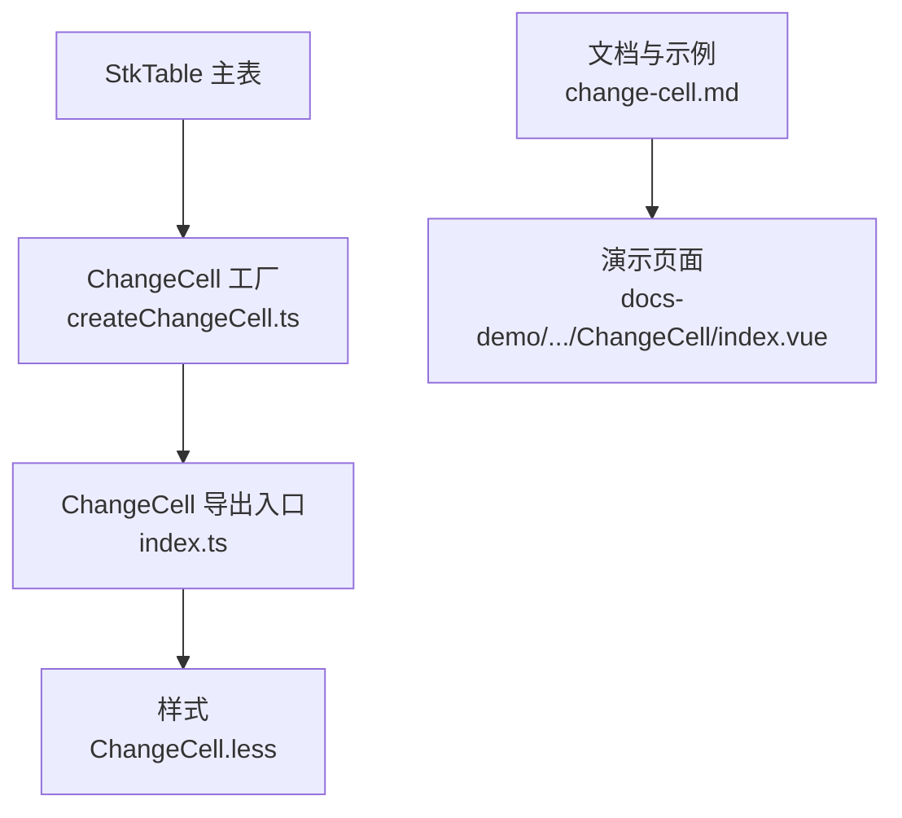
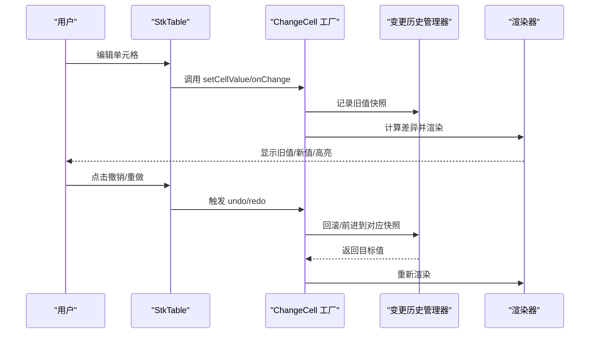
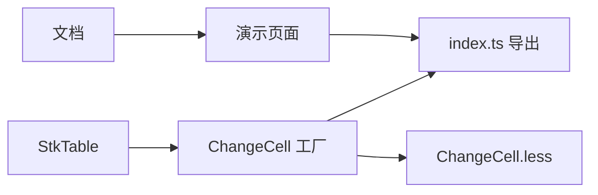
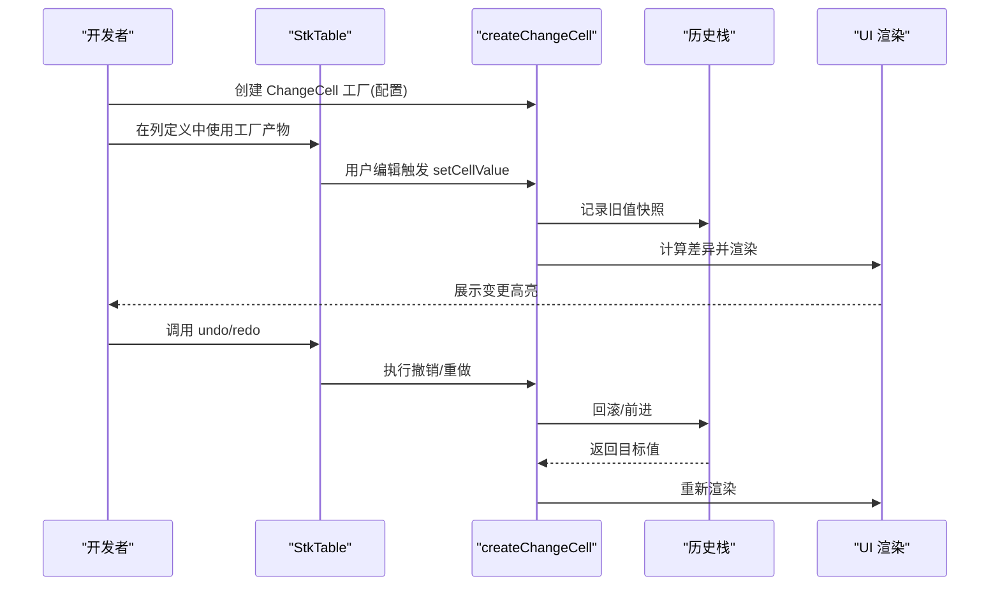
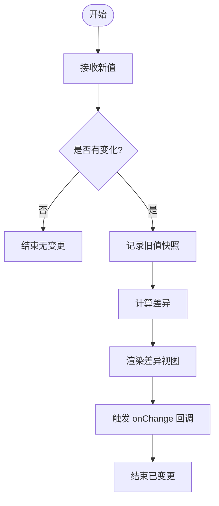

# 变更单元格

<cite>
**本文引用的文件**   
- [src/StkTable/custom-cells/ChangeCell/index.ts](file://src/StkTable/custom-cells/ChangeCell/index.ts)
- [src/StkTable/custom-cells/ChangeCell/createChangeCell.ts](file://src/StkTable/custom-cells/ChangeCell/createChangeCell.ts)
- [src/StkTable/custom-cells/ChangeCell/ChangeCell.less](file://src/StkTable/custom-cells/ChangeCell/ChangeCell.less)
- [docs-demo/advanced/custom-cells/ChangeCell/index.vue](file://docs-demo/advanced/custom-cells/ChangeCell/index.vue)
- [docs-src/main/table/advanced/custom-cells/change-cell.md](file://docs-src/main/table/advanced/custom-cells/change-cell.md)
</cite>

## 目录
1. [简介](#简介)
2. [项目结构](#项目结构)
3. [核心组件](#核心组件)
4. [架构总览](#架构总览)
5. [详细组件分析](#详细组件分析)
6. [依赖关系分析](#依赖关系分析)
7. [性能考量](#性能考量)
8. [故障排查指南](#故障排查指南)
9. [结论](#结论)
10. [附录：API 参考与示例](#附录api-参考与示例)

## 简介
本文件为 stk-table-vue 的“变更单元格”（ChangeCell）组件提供完整的开发文档。该组件用于在表格中可视化并追踪单元格的值变更，支持差异高亮、变更历史、撤销/重做等能力，并提供统一的 API 进行变更监听、回调与状态管理。通过工厂函数 createChangeCell 可快速生成具备变更追踪能力的自定义单元格类型，并与 StkTable 无缝集成。

## 项目结构
变更单元格相关代码位于 src/StkTable/custom-cells/ChangeCell 目录下，包含样式、工厂实现与导出入口；演示与文档分别位于 docs-demo 与 docs-src。

图表来源
- [src/StkTable/custom-cells/ChangeCell/createChangeCell.ts](file://src/StkTable/custom-cells/ChangeCell/createChangeCell.ts)
- [src/StkTable/custom-cells/ChangeCell/index.ts](file://src/StkTable/custom-cells/ChangeCell/index.ts)
- [src/StkTable/custom-cells/ChangeCell/ChangeCell.less](file://src/StkTable/custom-cells/ChangeCell/ChangeCell.less)
- [docs-src/main/table/advanced/custom-cells/change-cell.md](file://docs-src/main/table/advanced/custom-cells/change-cell.md)
- [docs-demo/advanced/custom-cells/ChangeCell/index.vue](file://docs-demo/advanced/custom-cells/ChangeCell/index.vue)

章节来源
- [src/StkTable/custom-cells/ChangeCell/index.ts](file://src/StkTable/custom-cells/ChangeCell/index.ts)
- [src/StkTable/custom-cells/ChangeCell/createChangeCell.ts](file://src/StkTable/custom-cells/ChangeCell/createChangeCell.ts)
- [src/StkTable/custom-cells/ChangeCell/ChangeCell.less](file://src/StkTable/custom-cells/ChangeCell/ChangeCell.less)
- [docs-src/main/table/advanced/custom-cells/change-cell.md](file://docs-src/main/table/advanced/custom-cells/change-cell.md)
- [docs-demo/advanced/custom-cells/ChangeCell/index.vue](file://docs-demo/advanced/custom-cells/ChangeCell/index.vue)

## 核心组件
- ChangeCell 工厂函数 createChangeCell：封装变更检测、历史记录、撤销/重做、渲染差异等逻辑，返回一个可用于 StkTable 的单元格类型。
- index.ts：统一导出 ChangeCell 工厂及类型定义，便于上层按需引入。
- ChangeCell.less：变更高亮、旧值/新值展示、操作按钮等样式。

章节来源
- [src/StkTable/custom-cells/ChangeCell/createChangeCell.ts](file://src/StkTable/custom-cells/ChangeCell/createChangeCell.ts)
- [src/StkTable/custom-cells/ChangeCell/index.ts](file://src/StkTable/custom-cells/ChangeCell/index.ts)
- [src/StkTable/custom-cells/ChangeCell/ChangeCell.less](file://src/StkTable/custom-cells/ChangeCell/ChangeCell.less)

## 架构总览
ChangeCell 以“工厂 + 配置”的方式工作：上层通过 createChangeCell(options) 生成单元格类型，并在列定义中使用。内部维护变更快照栈，支持撤销/重做；渲染时对比新旧值，输出差异视图。

图表来源
- [src/StkTable/custom-cells/ChangeCell/createChangeCell.ts](file://src/StkTable/custom-cells/ChangeCell/createChangeCell.ts)
- [src/StkTable/custom-cells/ChangeCell/index.ts](file://src/StkTable/custom-cells/ChangeCell/index.ts)

## 详细组件分析

### 工厂函数 createChangeCell
- 职责
  - 接收配置项，生成具有变更追踪能力的单元格类型。
  - 维护变更历史栈（支持撤销/重做）。
  - 提供差异计算与渲染钩子。
  - 暴露变更事件与回调接口。
- 关键行为
  - 数据修改检测：基于深度比较或自定义 diff 策略识别变化。
  - 变更历史：每次有效变更入栈，限制最大长度，避免内存泄漏。
  - 撤销/重做：按时间顺序回退或前进一步，保持状态一致性。
  - 渲染差异：根据新旧值生成差异片段，配合样式高亮。
- 扩展点
  - 自定义 diff 函数：针对复杂数据类型（对象、数组、Map/Set）提供高效比较。
  - 自定义渲染：通过插槽或回调定制差异展示样式与交互。
  - 持久化：将变更日志序列化后对接审计系统或版本控制。

章节来源
- [src/StkTable/custom-cells/ChangeCell/createChangeCell.ts](file://src/StkTable/custom-cells/ChangeCell/createChangeCell.ts)

### 导出入口 index.ts
- 职责
  - 对外暴露 createChangeCell 工厂方法与必要的类型定义。
  - 保证模块边界清晰，便于按需引入与 Tree Shaking。
- 使用方式
  - 在列定义中引用工厂生成的单元格类型。
  - 结合 StkTable 的事件系统订阅变更回调。

章节来源
- [src/StkTable/custom-cells/ChangeCell/index.ts](file://src/StkTable/custom-cells/ChangeCell/index.ts)

### 样式 ChangeCell.less
- 职责
  - 定义变更高亮色、旧值删除线、新值底色、操作按钮布局等。
  - 提供主题变量以便全局定制。
- 关键点
  - 高亮动画：变更出现时的淡入/闪烁提示。
  - 响应式适配：在小屏设备上折叠操作区。

章节来源
- [src/StkTable/custom-cells/ChangeCell/ChangeCell.less](file://src/StkTable/custom-cells/ChangeCell/ChangeCell.less)

### 演示与文档
- 演示页面 docs-demo/advanced/custom-cells/ChangeCell/index.vue：展示基础用法、撤销/重做、不同数据类型的变更处理。
- 文档 docs-src/main/table/advanced/custom-cells/change-cell.md：说明属性、事件、方法、最佳实践与常见问题。

章节来源
- [docs-demo/advanced/custom-cells/ChangeCell/index.vue](file://docs-demo/advanced/custom-cells/ChangeCell/index.vue)
- [docs-src/main/table/advanced/custom-cells/change-cell.md](file://docs-src/main/table/advanced/custom-cells/change-cell.md)

## 依赖关系分析
- 组件内聚性
  - createChangeCell 集中了变更追踪与历史管理逻辑，index.ts 仅负责导出，耦合度低。
- 外部依赖
  - 与 StkTable 的列定义与事件系统集成。
  - 可选依赖：diff 库（若未内置），用于复杂数据结构比较。
- 潜在循环依赖
  - 工厂不反向依赖具体业务组件，避免循环。

图表来源
- [src/StkTable/custom-cells/ChangeCell/createChangeCell.ts](file://src/StkTable/custom-cells/ChangeCell/createChangeCell.ts)
- [src/StkTable/custom-cells/ChangeCell/index.ts](file://src/StkTable/custom-cells/ChangeCell/index.ts)
- [src/StkTable/custom-cells/ChangeCell/ChangeCell.less](file://src/StkTable/custom-cells/ChangeCell/ChangeCell.less)
- [docs-demo/advanced/custom-cells/ChangeCell/index.vue](file://docs-demo/advanced/custom-cells/ChangeCell/index.vue)
- [docs-src/main/table/advanced/custom-cells/change-cell.md](file://docs-src/main/table/advanced/custom-cells/change-cell.md)

章节来源
- [src/StkTable/custom-cells/ChangeCell/createChangeCell.ts](file://src/StkTable/custom-cells/ChangeCell/createChangeCell.ts)
- [src/StkTable/custom-cells/ChangeCell/index.ts](file://src/StkTable/custom-cells/ChangeCell/index.ts)

## 性能考量
- 变更检测
  - 优先使用浅比较；对复杂对象启用增量 diff，避免全量比对。
  - 对大数组采用分块比较或哈希指纹优化。
- 历史栈
  - 设置最大历史长度，超出时丢弃最旧条目，防止内存增长。
  - 对快照进行不可变更新，减少拷贝开销。
- 渲染
  - 差异渲染仅在必要时触发，避免频繁重排。
  - 使用 CSS 动画替代 JS 动画，提升流畅度。
- 大数据场景
  - 虚拟滚动下仅对可见行启用变更追踪。
  - 批量更新合并为一次快照，降低事件风暴。

[本节为通用指导，无需源码引用]

## 故障排查指南
- 常见现象
  - 变更未高亮：检查 diff 策略是否匹配数据类型；确认样式已加载。
  - 撤销/重做无效：确认历史栈未越界；确保 setCellValue 被正确调用。
  - 内存占用过高：检查历史长度限制与快照大小；避免保留闭包引用。
- 定位步骤
  - 打开控制台查看变更事件与历史栈长度。
  - 临时关闭动画与额外渲染逻辑，验证是否为渲染问题。
  - 使用最小复现用例隔离问题。

章节来源
- [src/StkTable/custom-cells/ChangeCell/createChangeCell.ts](file://src/StkTable/custom-cells/ChangeCell/createChangeCell.ts)
- [src/StkTable/custom-cells/ChangeCell/ChangeCell.less](file://src/StkTable/custom-cells/ChangeCell/ChangeCell.less)

## 结论
ChangeCell 通过工厂模式将变更追踪、历史管理与差异渲染解耦，既保证了与 StkTable 的良好集成，又提供了灵活的扩展点。合理配置 diff 策略与历史上限，可在保证用户体验的同时兼顾性能与可维护性。

[本节为总结性内容，无需源码引用]

## 附录：API 参考与示例

### 工厂选项（createChangeCell）
- 必填
  - cellType：单元格类型标识
  - render：差异渲染函数（或插槽名）
- 可选
  - diff：自定义差异计算函数
  - maxHistory：历史最大长度（默认建议 50）
  - onBeforeChange：变更前置回调（可拦截）
  - onChange：变更成功回调
  - onUndo：撤销回调
  - onRedo：重做回调
  - persist：持久化开关（对接审计/版本控制）

章节来源
- [src/StkTable/custom-cells/ChangeCell/createChangeCell.ts](file://src/StkTable/custom-cells/ChangeCell/createChangeCell.ts)

### 事件与回调
- 变更监听
  - onChange(rowKey, colKey, oldValue, newValue)
- 撤销/重做
  - onUndo(rowKey, colKey, targetValue)
  - onRedo(rowKey, colKey, targetValue)
- 前置校验
  - onBeforeChange(rowKey, colKey, newValue) => boolean | Promise<boolean>

章节来源
- [src/StkTable/custom-cells/ChangeCell/createChangeCell.ts](file://src/StkTable/custom-cells/ChangeCell/createChangeCell.ts)

### 状态管理
- 当前值：由 StkTable 数据源驱动
- 历史栈：内部维护，可通过回调读取
- 差异视图：由 render 函数决定

章节来源
- [src/StkTable/custom-cells/ChangeCell/createChangeCell.ts](file://src/StkTable/custom-cells/ChangeCell/createChangeCell.ts)

### 数据类型变更处理示例（路径）
- 字符串/数字：直接比较
- 布尔：切换高亮
- 对象：字段级差异对比
- 数组：元素新增/删除/替换高亮
- Map/Set：键值存在性变化

章节来源
- [docs-demo/advanced/custom-cells/ChangeCell/index.vue](file://docs-demo/advanced/custom-cells/ChangeCell/index.vue)
- [src/StkTable/custom-cells/ChangeCell/createChangeCell.ts](file://src/StkTable/custom-cells/ChangeCell/createChangeCell.ts)

### 与版本控制/审计日志集成
- 方案一：本地持久化
  - 将变更事件序列化为 JSON，写入 localStorage 或 IndexedDB。
- 方案二：远程上报
  - 在 onChange/onUndo/onRedo 中异步上报至后端审计服务。
- 方案三：版本快照
  - 定期生成整行快照，作为版本分支的基础。

章节来源
- [src/StkTable/custom-cells/ChangeCell/createChangeCell.ts](file://src/StkTable/custom-cells/ChangeCell/createChangeCell.ts)
- [docs-src/main/table/advanced/custom-cells/change-cell.md](file://docs-src/main/table/advanced/custom-cells/change-cell.md)

### 使用流程（序列图）

图表来源
- [src/StkTable/custom-cells/ChangeCell/createChangeCell.ts](file://src/StkTable/custom-cells/ChangeCell/createChangeCell.ts)
- [src/StkTable/custom-cells/ChangeCell/index.ts](file://src/StkTable/custom-cells/ChangeCell/index.ts)

### 流程图：变更检测与渲染

图表来源
- [src/StkTable/custom-cells/ChangeCell/createChangeCell.ts](file://src/StkTable/custom-cells/ChangeCell/createChangeCell.ts)