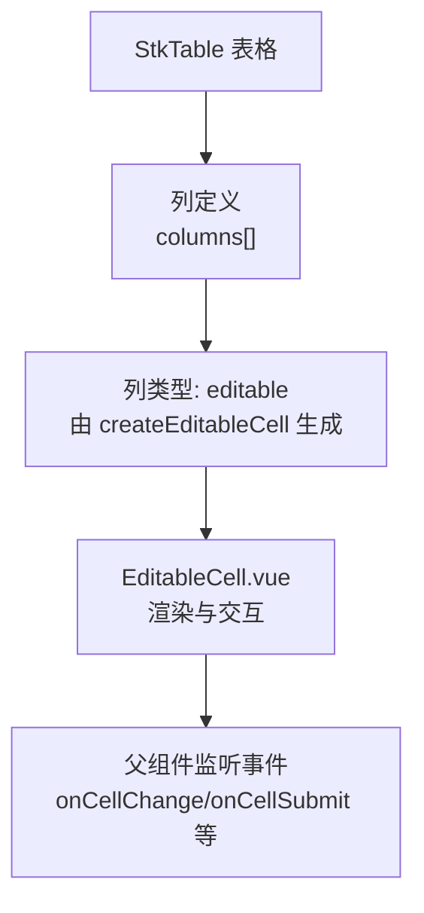
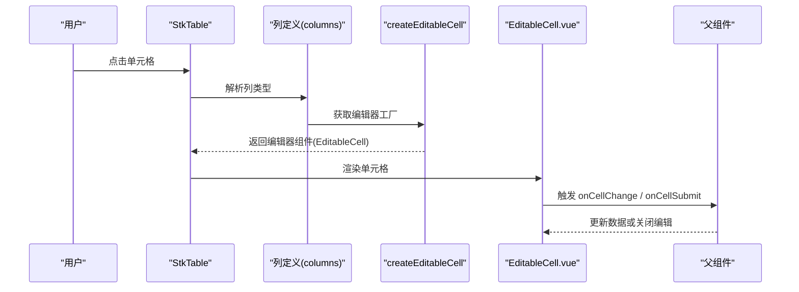
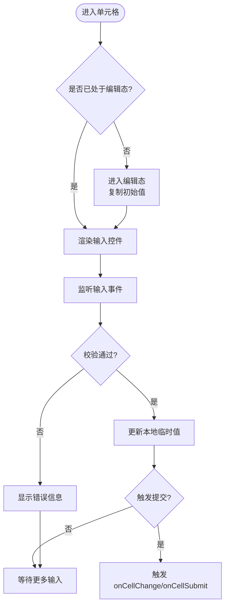
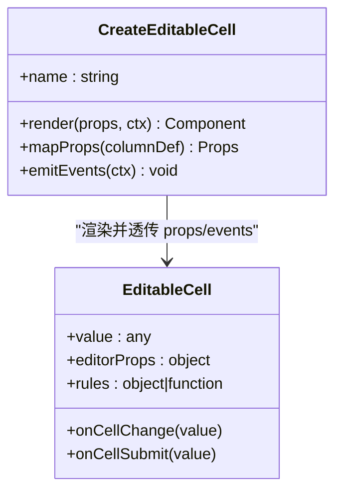
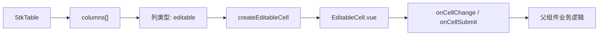

# 可编辑单元格

<cite>
**本文引用的文件**   
- [EditableCell.vue](file://src/StkTable/custom-cells/EditableCell/EditableCell.vue)
- [createEditableCell.ts](file://src/StkTable/custom-cells/EditableCell/createEditableCell.ts)
- [index.ts](file://src/StkTable/custom-cells/EditableCell/index.ts)
- [editable-cell.md](file://docs-src/main/table/advanced/custom-cells/editable-cell.md)
- [EditCell.vue](file://docs-demo/demos/CellEdit/EditCell.vue)
- [index.vue](file://docs-demo/demos/CellEdit/index.vue)
- [type.ts](file://docs-demo/demos/CellEdit/type.ts)
- [EditableCellDemo.vue](file://test/EditableCellDemo.vue)
</cite>

## 目录
1. [简介](#简介)
2. [项目结构](#项目结构)
3. [核心组件](#核心组件)
4. [架构总览](#架构总览)
5. [详细组件分析](#详细组件分析)
6. [依赖分析](#依赖分析)
7. [性能考虑](#性能考虑)
8. [故障排查指南](#故障排查指南)
9. [结论](#结论)
10. [附录：API 参考与示例](#附录api-参考与示例)

## 简介
本章节面向 stk-table-vue 的可编辑单元格组件（EditableCell），系统性阐述其实现原理、配置项、事件与插槽，以及在不同编辑场景下的使用方法。文档覆盖以下主题：
- 如何启用单元格编辑功能（编辑模式切换、数据验证、提交处理）
- EditableCell 的 API（props、事件、插槽）
- 常见编辑场景示例（文本输入、数字输入、日期选择等）
- 与表单验证库集成的方法与最佳实践

## 项目结构
可编辑单元格位于 custom-cells 子模块中，采用“Vue 组件 + 工厂函数”的组织方式：
- Vue 组件负责渲染与交互
- 工厂函数用于将组件注册为列类型，并暴露统一的 props 接口
- 文档与示例分别位于 docs-src 与 docs-demo/test 目录

图表来源
- [index.ts](file://src/StkTable/custom-cells/EditableCell/index.ts)
- [createEditableCell.ts](file://src/StkTable/custom-cells/EditableCell/createEditableCell.ts)
- [EditableCell.vue](file://src/StkTable/custom-cells/EditableCell/EditableCell.vue)

章节来源
- [index.ts](file://src/StkTable/custom-cells/EditableCell/index.ts)
- [createEditableCell.ts](file://src/StkTable/custom-cells/EditableCell/createEditableCell.ts)
- [EditableCell.vue](file://src/StkTable/custom-cells/EditableCell/EditableCell.vue)

## 核心组件
- EditableCell.vue：单元格编辑视图与交互逻辑的实现，包含编辑态切换、输入控制、校验与提交回调。
- createEditableCell.ts：将 EditableCell 包装为 StkTable 的列类型，统一 props 映射与事件转发。
- index.ts：对外导出列类型，便于在 columns 中使用。

章节来源
- [EditableCell.vue](file://src/StkTable/custom-cells/EditableCell/EditableCell.vue)
- [createEditableCell.ts](file://src/StkTable/custom-cells/EditableCell/createEditableCell.ts)
- [index.ts](file://src/StkTable/custom-cells/EditableCell/index.ts)

## 架构总览
下图展示了从列定义到单元格渲染、再到事件回传的完整链路。

图表来源
- [createEditableCell.ts](file://src/StkTable/custom-cells/EditableCell/createEditableCell.ts)
- [EditableCell.vue](file://src/StkTable/custom-cells/EditableCell/EditableCell.vue)
- [index.ts](file://src/StkTable/custom-cells/EditableCell/index.ts)

## 详细组件分析

### EditableCell.vue
- 职责
  - 管理编辑状态（是否处于编辑态）
  - 接收并展示当前单元格的值
  - 根据配置渲染不同的输入控件（文本、数字、日期等）
  - 执行本地校验（如必填、范围限制）
  - 通过事件向父组件提交变更
- 关键行为
  - 双击或聚焦进入编辑态
  - 失焦或回车确认提交
  - 取消键退出编辑态并恢复原值
  - 校验失败时阻止提交并提示错误

图表来源
- [EditableCell.vue](file://src/StkTable/custom-cells/EditableCell/EditableCell.vue)

章节来源
- [EditableCell.vue](file://src/StkTable/custom-cells/EditableCell/EditableCell.vue)

### createEditableCell.ts
- 职责
  - 将 EditableCell 封装为 StkTable 的列类型
  - 将列配置（如 type、editorProps、rules 等）映射为组件 props
  - 统一事件转发（变更、提交、校验结果）
- 关键点
  - 支持自定义 editorProps，以适配不同输入控件
  - 支持 rules 或 validator 函数进行校验
  - 提供默认行为与扩展点

图表来源
- [createEditableCell.ts](file://src/StkTable/custom-cells/EditableCell/createEditableCell.ts)
- [EditableCell.vue](file://src/StkTable/custom-cells/EditableCell/EditableCell.vue)

章节来源
- [createEditableCell.ts](file://src/StkTable/custom-cells/EditableCell/createEditableCell.ts)

### index.ts
- 职责
  - 导出可复用的列类型，供 columns 使用
- 使用方式
  - 在 columns 中指定 type 为 editable，并传入 editorProps/rules 等

章节来源
- [index.ts](file://src/StkTable/custom-cells/EditableCell/index.ts)

## 依赖分析
- 组件内部依赖
  - EditableCell.vue 依赖父组件的事件回调机制（onCellChange、onCellSubmit）
  - createEditableCell.ts 依赖 StkTable 的列类型约定
- 外部集成
  - 可与第三方表单验证库集成（如 vee-validate、async-validator），通过 rules 或 validator 函数注入校验逻辑

图表来源
- [index.ts](file://src/StkTable/custom-cells/EditableCell/index.ts)
- [createEditableCell.ts](file://src/StkTable/custom-cells/EditableCell/createEditableCell.ts)
- [EditableCell.vue](file://src/StkTable/custom-cells/EditableCell/EditableCell.vue)

章节来源
- [index.ts](file://src/StkTable/custom-cells/EditableCell/index.ts)
- [createEditableCell.ts](file://src/StkTable/custom-cells/EditableCell/createEditableCell.ts)
- [EditableCell.vue](file://src/StkTable/custom-cells/EditableCell/EditableCell.vue)

## 性能考虑
- 避免不必要的重渲染：仅在编辑态或值变化时更新 DOM
- 输入防抖：对高频输入（如文本搜索）进行防抖处理
- 校验延迟：复杂校验建议异步化，避免阻塞主线程
- 虚拟滚动兼容：确保编辑态与虚拟滚动状态同步，防止错位

## 故障排查指南
- 编辑无法进入
  - 检查列类型是否为 editable
  - 确认单元格未被禁用或锁定
- 校验不生效
  - 检查 rules 或 validator 是否正确挂载
  - 确认校验规则返回值格式符合预期
- 提交未触发
  - 检查 onCellChange/onCellSubmit 是否绑定
  - 确认提交条件（回车、失焦）是否满足
- 样式异常
  - 检查编辑器容器高度与行高匹配
  - 确认 z-index 层级正确

章节来源
- [EditableCell.vue](file://src/StkTable/custom-cells/EditableCell/EditableCell.vue)
- [createEditableCell.ts](file://src/StkTable/custom-cells/EditableCell/createEditableCell.ts)

## 结论
EditableCell 提供了开箱即用的单元格编辑能力，并通过工厂函数与 StkTable 深度集成。借助灵活的 editorProps 与校验机制，开发者可以快速构建多种编辑场景，并与现有表单验证体系无缝对接。

## 附录：API 参考与示例

### 启用编辑功能
- 在 columns 中为需要编辑的列设置 type 为 editable
- 通过 editorProps 传入输入控件的配置（如 placeholder、type、format 等）
- 可选地提供 rules 或 validator 进行校验

章节来源
- [editable-cell.md](file://docs-src/main/table/advanced/custom-cells/editable-cell.md)
- [index.ts](file://src/StkTable/custom-cells/EditableCell/index.ts)

### Props（列定义侧）
- type: 固定为 editable
- editorProps: 传递给编辑器的属性对象（例如文本框的 placeholder、数字框的 min/max、日期框的 format/locale）
- rules: 校验规则对象或函数（支持同步/异步校验）
- disabled: 是否禁用该列的编辑
- readonly: 只读模式（仅展示，不可编辑）

章节来源
- [createEditableCell.ts](file://src/StkTable/custom-cells/EditableCell/createEditableCell.ts)
- [editable-cell.md](file://docs-src/main/table/advanced/custom-cells/editable-cell.md)

### 事件（组件侧）
- onCellChange(value): 单元格值变更时触发，适合实时保存草稿
- onCellSubmit(value): 提交时触发，适合批量或最终提交
- onCellValidate(result): 校验结果回调（若实现）

章节来源
- [EditableCell.vue](file://src/StkTable/custom-cells/EditableCell/EditableCell.vue)
- [createEditableCell.ts](file://src/StkTable/custom-cells/EditableCell/createEditableCell.ts)

### 插槽（组件侧）
- 默认插槽：用于自定义单元格内容（非编辑态）
- 编辑插槽：用于自定义编辑器 UI（高级场景）

章节来源
- [EditableCell.vue](file://src/StkTable/custom-cells/EditableCell/EditableCell.vue)

### 常见编辑场景示例
- 文本输入
  - 使用 editorProps.type='text'，配合 placeholder 与 maxlength
  - 适用于姓名、地址等短文本
- 数字输入
  - 使用 editorProps.type='number'，配置 min/max/step
  - 适用于价格、数量等数值字段
- 日期选择
  - 使用 editorProps.type='date'，配置 format/locale
  - 适用于生日、截止日期等日期字段

章节来源
- [EditCell.vue](file://docs-demo/demos/CellEdit/EditCell.vue)
- [index.vue](file://docs-demo/demos/CellEdit/index.vue)
- [type.ts](file://docs-demo/demos/CellEdit/type.ts)
- [EditableCellDemo.vue](file://test/EditableCellDemo.vue)

### 与表单验证库集成
- 使用 rules 对象
  - 将第三方库的规则转换为编辑器支持的规则格式
  - 支持必填、长度、正则、范围等常用校验
- 使用 validator 函数
  - 对于复杂或异步校验，提供函数形式的 validator
  - 返回 Promise 或布尔值，指示校验结果
- 最佳实践
  - 将校验逻辑集中管理，便于复用与维护
  - 对用户友好的错误提示，结合单元格位置定位错误

章节来源
- [createEditableCell.ts](file://src/StkTable/custom-cells/EditableCell/createEditableCell.ts)
- [EditableCell.vue](file://src/StkTable/custom-cells/EditableCell/EditableCell.vue)