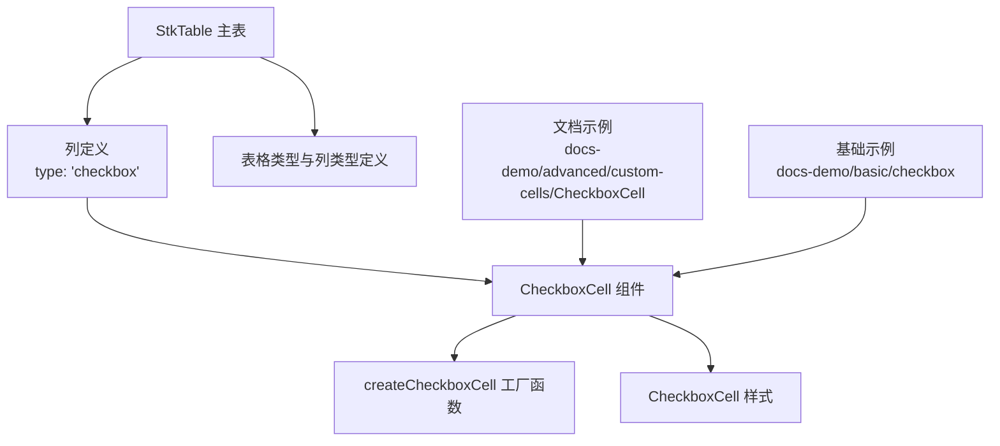
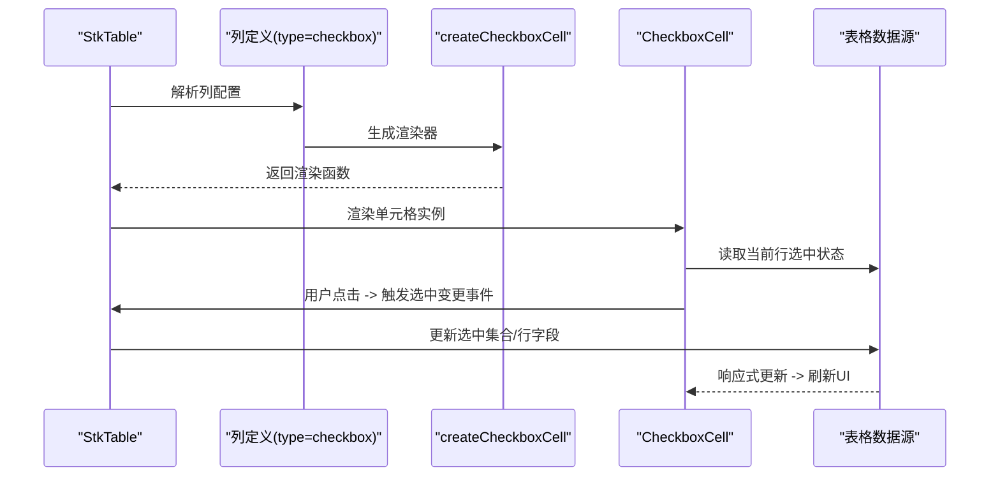
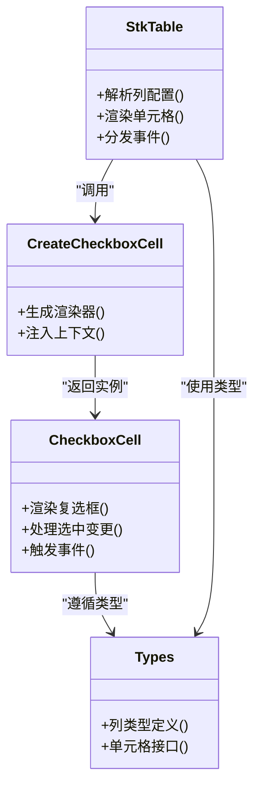

# 复选框单元格

<cite>
**本文引用的文件**   
- [src/StkTable/custom-cells/CheckboxCell/CheckboxCell.vue](file://src/StkTable/custom-cells/CheckboxCell/CheckboxCell.vue)
- [src/StkTable/custom-cells/CheckboxCell/createCheckboxCell.ts](file://src/StkTable/custom-cells/CheckboxCell/createCheckboxCell.ts)
- [src/StkTable/custom-cells/CheckboxCell/index.ts](file://src/StkTable/custom-cells/CheckboxCell/index.ts)
- [src/StkTable/custom-cells/CheckboxCell/CheckboxCell.less](file://src/StkTable/custom-cells/CheckboxCell/CheckboxCell.less)
- [docs-demo/advanced/custom-cells/CheckboxCell/index.vue](file://docs-demo/advanced/custom-cells/CheckboxCell/index.vue)
- [docs-demo/advanced/custom-cells/CheckboxCell/CheckboxComponentCell.vue](file://docs-demo/advanced/custom-cells/CheckboxCell/CheckboxComponentCell.vue)
- [docs-demo/basic/checkbox/Checkbox.vue](file://docs-demo/basic/checkbox/Checkbox.vue)
- [src/StkTable/StkTable.vue](file://src/StkTable/StkTable.vue)
- [src/StkTable/types/index.ts](file://src/StkTable/types/index.ts)
</cite>

## 目录
1. [简介](#简介)
2. [项目结构](#项目结构)
3. [核心组件](#核心组件)
4. [架构总览](#架构总览)
5. [详细组件分析](#详细组件分析)
6. [依赖关系分析](#依赖关系分析)
7. [性能考量](#性能考量)
8. [故障排查指南](#故障排查指南)
9. [结论](#结论)
10. [附录：API 参考与示例](#附录api-参考与示例)

## 简介
本文件面向开发者，系统性说明 stk-table-vue 的复选框单元格（CheckboxCell）的功能特性、配置项、事件与样式定制方法。内容覆盖单选、多选、全选、级联选择、条件禁用、批量操作、数据绑定以及与表格其他能力的集成方式，帮助你在不同交互场景下快速落地。

## 项目结构
复选框单元格位于 custom-cells 目录下，采用“组件 + 工厂函数”的组织方式，便于按需注册与扩展。文档演示与基础示例分别位于 docs-demo 的 advanced 与 basic 目录中。

图表来源
- [src/StkTable/StkTable.vue](file://src/StkTable/StkTable.vue)
- [src/StkTable/custom-cells/CheckboxCell/CheckboxCell.vue](file://src/StkTable/custom-cells/CheckboxCell/CheckboxCell.vue)
- [src/StkTable/custom-cells/CheckboxCell/createCheckboxCell.ts](file://src/StkTable/custom-cells/CheckboxCell/createCheckboxCell.ts)
- [src/StkTable/custom-cells/CheckboxCell/CheckboxCell.less](file://src/StkTable/custom-cells/CheckboxCell/CheckboxCell.less)
- [src/StkTable/types/index.ts](file://src/StkTable/types/index.ts)
- [docs-demo/advanced/custom-cells/CheckboxCell/index.vue](file://docs-demo/advanced/custom-cells/CheckboxCell/index.vue)
- [docs-demo/basic/checkbox/Checkbox.vue](file://docs-demo/basic/checkbox/Checkbox.vue)

章节来源
- [src/StkTable/custom-cells/CheckboxCell/index.ts](file://src/StkTable/custom-cells/CheckboxCell/index.ts)
- [src/StkTable/custom-cells/CheckboxCell/CheckboxCell.vue](file://src/StkTable/custom-cells/CheckboxCell/CheckboxCell.vue)
- [src/StkTable/custom-cells/CheckboxCell/createCheckboxCell.ts](file://src/StkTable/custom-cells/CheckboxCell/createCheckboxCell.ts)
- [docs-demo/advanced/custom-cells/CheckboxCell/index.vue](file://docs-demo/advanced/custom-cells/CheckboxCell/index.vue)
- [docs-demo/basic/checkbox/Checkbox.vue](file://docs-demo/basic/checkbox/Checkbox.vue)

## 核心组件
- CheckboxCell.vue：复选框单元格的 UI 与交互实现，负责渲染复选框、处理选中状态变化、触发事件、支持禁用与自定义插槽等。
- createCheckboxCell.ts：工厂函数，用于将 CheckboxCell 包装为表格可识别的列渲染器，并注入必要的上下文（如行数据、列配置、事件回调）。
- index.ts：导出模块入口，提供统一的注册与使用方式。
- CheckboxCell.less：复选框单元格的样式文件，支持主题变量与覆盖。

章节来源
- [src/StkTable/custom-cells/CheckboxCell/CheckboxCell.vue](file://src/StkTable/custom-cells/CheckboxCell/CheckboxCell.vue)
- [src/StkTable/custom-cells/CheckboxCell/createCheckboxCell.ts](file://src/StkTable/custom-cells/CheckboxCell/createCheckboxCell.ts)
- [src/StkTable/custom-cells/CheckboxCell/index.ts](file://src/StkTable/custom-cells/CheckboxCell/index.ts)
- [src/StkTable/custom-cells/CheckboxCell/CheckboxCell.less](file://src/StkTable/custom-cells/CheckboxCell/CheckboxCell.less)

## 架构总览
CheckboxCell 作为表格的一个“自定义单元格”，通过列定义 type 指向 checkbox，由 StkTable 在渲染时调用 createCheckboxCell 生成的渲染器，最终挂载 CheckboxCell 组件。组件内部维护选中状态并与表格的数据层进行双向同步，同时向上抛出事件供父组件监听，完成批量操作与联动逻辑。

图表来源
- [src/StkTable/StkTable.vue](file://src/StkTable/StkTable.vue)
- [src/StkTable/custom-cells/CheckboxCell/createCheckboxCell.ts](file://src/StkTable/custom-cells/CheckboxCell/createCheckboxCell.ts)
- [src/StkTable/custom-cells/CheckboxCell/CheckboxCell.vue](file://src/StkTable/custom-cells/CheckboxCell/CheckboxCell.vue)

## 详细组件分析

### CheckboxCell 组件职责与行为
- 渲染复选框，展示当前行的选中状态。
- 支持只读/禁用状态，根据列或行级别配置控制。
- 处理用户交互，触发选中变更事件，与表格数据层同步。
- 支持插槽扩展，允许在复选框前后插入额外内容。
- 与表格的全选、级联选择、批量操作等功能协作。

章节来源
- [src/StkTable/custom-cells/CheckboxCell/CheckboxCell.vue](file://src/StkTable/custom-cells/CheckboxCell/CheckboxCell.vue)

### createCheckboxCell 工厂函数
- 将 CheckboxCell 封装为表格可识别的渲染器。
- 注入行数据、列配置、事件回调等上下文。
- 统一处理选中状态的计算与派发。

章节来源
- [src/StkTable/custom-cells/CheckboxCell/createCheckboxCell.ts](file://src/StkTable/custom-cells/CheckboxCell/createCheckboxCell.ts)

### 模块入口与注册
- index.ts 提供对外导出，方便在表格中按列类型引用。
- 通常配合表格的列定义使用，无需手动引入组件。

章节来源
- [src/StkTable/custom-cells/CheckboxCell/index.ts](file://src/StkTable/custom-cells/CheckboxCell/index.ts)

### 样式与主题
- CheckboxCell.less 定义了复选框单元格的样式，可通过 CSS 变量或覆盖类名进行主题定制。
- 建议通过全局样式覆盖或 scoped 样式调整外观，避免直接修改源码。

章节来源
- [src/StkTable/custom-cells/CheckboxCell/CheckboxCell.less](file://src/StkTable/custom-cells/CheckboxCell/CheckboxCell.less)

### 文档与基础示例
- docs-demo/advanced/custom-cells/CheckboxCell：高级用法示例，包括级联选择、条件禁用、批量操作等。
- docs-demo/basic/checkbox：基础用法示例，展示最简单的复选框列配置与事件监听。

章节来源
- [docs-demo/advanced/custom-cells/CheckboxCell/index.vue](file://docs-demo/advanced/custom-cells/CheckboxCell/index.vue)
- [docs-demo/advanced/custom-cells/CheckboxCell/CheckboxComponentCell.vue](file://docs-demo/advanced/custom-cells/CheckboxCell/CheckboxComponentCell.vue)
- [docs-demo/basic/checkbox/Checkbox.vue](file://docs-demo/basic/checkbox/Checkbox.vue)

## 依赖关系分析
- StkTable 负责列解析与渲染调度。
- createCheckboxCell 作为中间层，桥接列配置与 CheckboxCell 组件。
- CheckboxCell 依赖表格的数据层与事件总线，完成状态同步与事件上报。
- 类型定义集中在 types/index.ts，确保列与单元格类型的类型安全。

图表来源
- [src/StkTable/StkTable.vue](file://src/StkTable/StkTable.vue)
- [src/StkTable/custom-cells/CheckboxCell/createCheckboxCell.ts](file://src/StkTable/custom-cells/CheckboxCell/createCheckboxCell.ts)
- [src/StkTable/custom-cells/CheckboxCell/CheckboxCell.vue](file://src/StkTable/custom-cells/CheckboxCell/CheckboxCell.vue)
- [src/StkTable/types/index.ts](file://src/StkTable/types/index.ts)

章节来源
- [src/StkTable/types/index.ts](file://src/StkTable/types/index.ts)

## 性能考量
- 虚拟滚动与复选框：在大数据量场景下，确保复选框的状态计算与渲染尽量轻量，避免不必要的重渲染。
- 批量操作：优先使用集合操作（如 Set）管理选中状态，减少遍历与重复计算。
- 事件节流：对高频交互（如快速切换）进行节流或防抖，降低事件风暴影响。
- 样式覆盖：尽量使用 CSS 变量与类名覆盖，避免频繁 DOM 操作。

[本节为通用指导，不直接分析具体文件]

## 故障排查指南
- 复选框无法勾选：检查列配置是否正确设置 type 为 checkbox；确认行数据是否包含必要字段；查看事件是否被阻止冒泡。
- 全选无效：确认全选逻辑是否正确更新选中集合；检查是否有外部数据源覆盖选中状态。
- 禁用状态异常：检查列或行级别的禁用配置；确认条件判断逻辑是否符合预期。
- 样式错乱：检查样式覆盖优先级；确认未直接修改源码样式；必要时使用浏览器开发者工具定位类名。

章节来源
- [src/StkTable/custom-cells/CheckboxCell/CheckboxCell.vue](file://src/StkTable/custom-cells/CheckboxCell/CheckboxCell.vue)
- [src/StkTable/custom-cells/CheckboxCell/CheckboxCell.less](file://src/StkTable/custom-cells/CheckboxCell/CheckboxCell.less)

## 结论
CheckboxCell 提供了灵活、可扩展的复选框单元格能力，能够与表格的其他功能无缝集成。通过合理的配置与事件处理，可以实现单选、多选、全选、级联选择、条件禁用以及批量操作等常见业务场景。建议在开发过程中遵循类型定义与样式规范，确保代码的可维护性与一致性。

[本节为总结性内容，不直接分析具体文件]

## 附录：API 参考与示例

### 列配置（props）
- type: 指定列类型为 checkbox，启用复选框单元格。
- disabled: 控制整列或单行的禁用状态。
- selectable: 控制某行是否可选。
- checked: 控制某行的初始选中状态。
- indeterminate: 控制某行的半选状态（常用于级联选择）。
- label: 列头显示文本（可选）。
- width: 列宽（可选）。
- align: 对齐方式（可选）。
- slot: 自定义插槽名称，用于扩展单元格内容。

章节来源
- [src/StkTable/custom-cells/CheckboxCell/CheckboxCell.vue](file://src/StkTable/custom-cells/CheckboxCell/CheckboxCell.vue)
- [src/StkTable/types/index.ts](file://src/StkTable/types/index.ts)

### 事件（emits）
- change: 选中状态变化时触发，携带行索引与新的选中状态。
- select-all: 全选/取消全选时触发，携带当前选中集合。
- cascade-change: 级联选择变化时触发，携带受影响的行集合。

章节来源
- [src/StkTable/custom-cells/CheckboxCell/CheckboxCell.vue](file://src/StkTable/custom-cells/CheckboxCell/CheckboxCell.vue)

### 插槽（slots）
- default: 默认插槽，可在复选框前后插入自定义内容。
- header: 列头插槽，用于自定义列头内容。

章节来源
- [src/StkTable/custom-cells/CheckboxCell/CheckboxCell.vue](file://src/StkTable/custom-cells/CheckboxCell/CheckboxCell.vue)

### 常用交互场景示例路径
- 基础单选/多选：[docs-demo/basic/checkbox/Checkbox.vue](file://docs-demo/basic/checkbox/Checkbox.vue)
- 级联选择：[docs-demo/advanced/custom-cells/CheckboxCell/index.vue](file://docs-demo/advanced/custom-cells/CheckboxCell/index.vue)
- 条件禁用：[docs-demo/advanced/custom-cells/CheckboxCell/CheckboxComponentCell.vue](file://docs-demo/advanced/custom-cells/CheckboxCell/CheckboxComponentCell.vue)
- 批量操作：[docs-demo/advanced/custom-cells/CheckboxCell/index.vue](file://docs-demo/advanced/custom-cells/CheckboxCell/index.vue)

章节来源
- [docs-demo/basic/checkbox/Checkbox.vue](file://docs-demo/basic/checkbox/Checkbox.vue)
- [docs-demo/advanced/custom-cells/CheckboxCell/index.vue](file://docs-demo/advanced/custom-cells/CheckboxCell/index.vue)
- [docs-demo/advanced/custom-cells/CheckboxCell/CheckboxComponentCell.vue](file://docs-demo/advanced/custom-cells/CheckboxCell/CheckboxComponentCell.vue)

### 与表格其他功能的集成
- 排序：复选框列通常不参与排序，可在列配置中禁用排序。
- 筛选：如需基于选中状态筛选，可在上层逻辑中维护选中集合并过滤数据。
- 固定列：复选框列可设置为固定列，提升操作便捷性。
- 合并单元格：复选框列一般不建议合并，如需合并请谨慎处理选中状态。
- 树形表格：结合级联选择，实现父子节点的联动选中。

章节来源
- [src/StkTable/StkTable.vue](file://src/StkTable/StkTable.vue)
- [src/StkTable/custom-cells/CheckboxCell/CheckboxCell.vue](file://src/StkTable/custom-cells/CheckboxCell/CheckboxCell.vue)