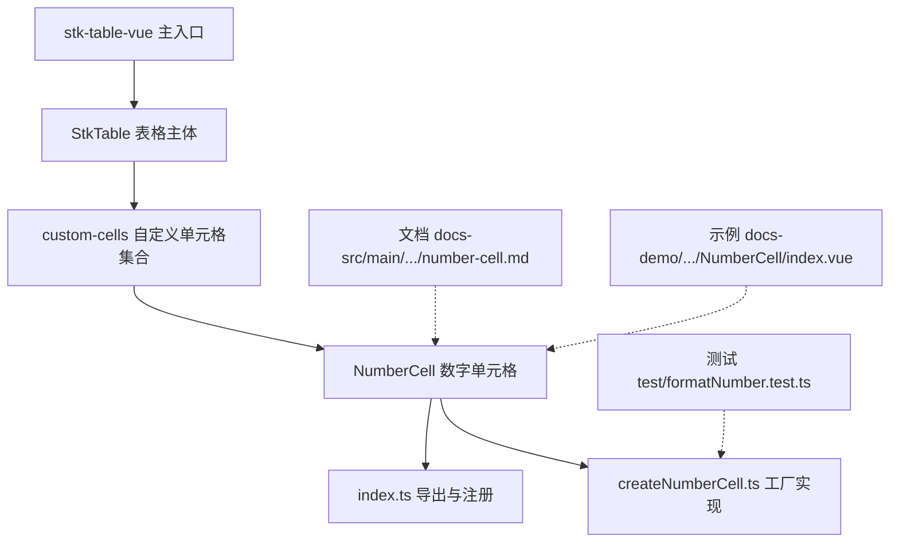
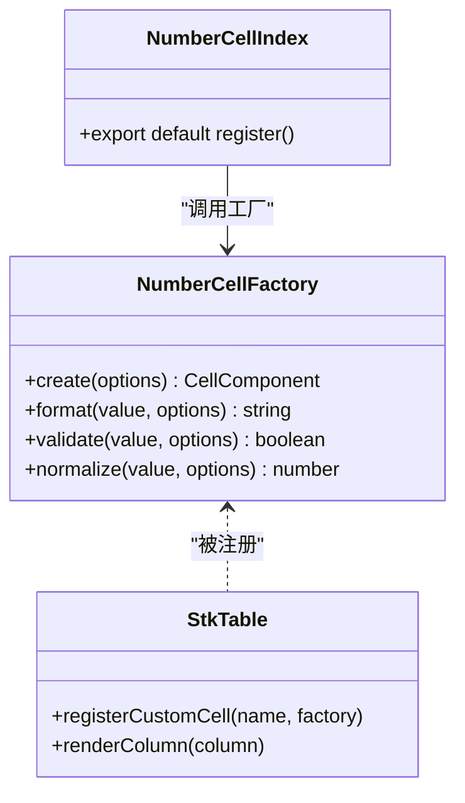
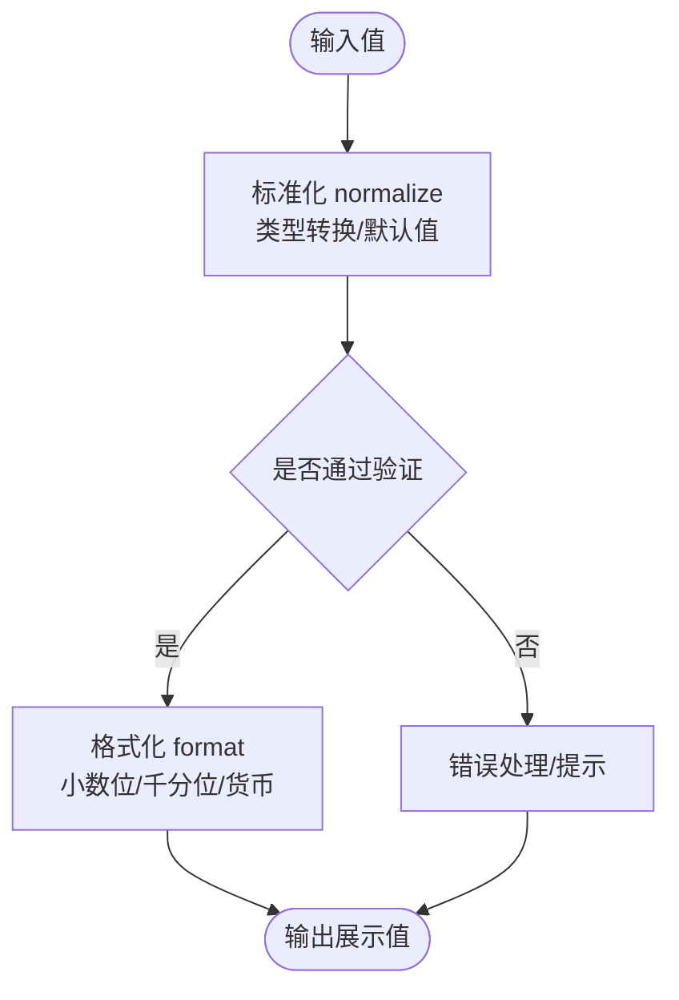

# 数字单元格

<cite>
**本文引用的文件**   
- [src/StkTable/custom-cells/NumberCell/index.ts](file://src/StkTable/custom-cells/NumberCell/index.ts)
- [src/StkTable/custom-cells/NumberCell/createNumberCell.ts](file://src/StkTable/custom-cells/NumberCell/createNumberCell.ts)
- [docs-src/main/table/advanced/custom-cells/number-cell.md](file://docs-src/main/table/advanced/custom-cells/number-cell.md)
- [docs-demo/advanced/custom-cells/NumberCell/index.vue](file://docs-demo/advanced/custom-cells/NumberCell/index.vue)
- [test/formatNumber.test.ts](file://test/formatNumber.test.ts)
</cite>

## 目录
1. [简介](#简介)
2. [项目结构](#项目结构)
3. [核心组件与能力](#核心组件与能力)
4. [架构总览](#架构总览)
5. [详细组件分析](#详细组件分析)
6. [依赖关系分析](#依赖关系分析)
7. [性能考量](#性能考量)
8. [故障排查指南](#故障排查指南)
9. [结论](#结论)
10. [附录：配置项速查](#附录配置项速查)

## 简介
本章节面向 stk-table-vue 的数字单元格（NumberCell）开发文档，聚焦以下目标：
- 数据格式化：小数位数、千分位分隔符、货币格式等显示需求
- 输入验证：范围限制、默认值、非法输入处理
- 计算能力：在编辑或变更时进行数值校验与规范化
- 集成使用：与排序、筛选功能的协同工作
- 配置说明：精度控制、范围限制、默认值设置等完整选项

## 项目结构
数字单元格位于自定义单元格模块中，采用“工厂函数 + 类型定义”的组织方式，便于按需注册与扩展。

图表来源
- [src/StkTable/custom-cells/NumberCell/index.ts](file://src/StkTable/custom-cells/NumberCell/index.ts)
- [src/StkTable/custom-cells/NumberCell/createNumberCell.ts](file://src/StkTable/custom-cells/NumberCell/createNumberCell.ts)
- [docs-src/main/table/advanced/custom-cells/number-cell.md](file://docs-src/main/table/advanced/custom-cells/number-cell.md)
- [docs-demo/advanced/custom-cells/NumberCell/index.vue](file://docs-demo/advanced/custom-cells/NumberCell/index.vue)
- [test/formatNumber.test.ts](file://test/formatNumber.test.ts)

章节来源
- [src/StkTable/custom-cells/NumberCell/index.ts](file://src/StkTable/custom-cells/NumberCell/index.ts)
- [src/StkTable/custom-cells/NumberCell/createNumberCell.ts](file://src/StkTable/custom-cells/NumberCell/createNumberCell.ts)
- [docs-src/main/table/advanced/custom-cells/number-cell.md](file://docs-src/main/table/advanced/custom-cells/number-cell.md)
- [docs-demo/advanced/custom-cells/NumberCell/index.vue](file://docs-demo/advanced/custom-cells/NumberCell/index.vue)
- [test/formatNumber.test.ts](file://test/formatNumber.test.ts)

## 核心组件与能力
- 数据格式化
  - 支持小数位数控制（四舍五入/截断策略由实现决定）
  - 支持千分位分隔符（如 1,234,567.89）
  - 支持货币格式（币种符号、小数位、分组规则）
- 输入验证
  - 范围限制（最小值、最大值）
  - 默认值填充（空值或缺失时的回退）
  - 非法输入拦截与提示（非数字字符过滤、越界修正）
- 计算与规范化
  - 输入后标准化为数值类型
  - 根据精度配置对结果进行舍入
- 与排序、筛选集成
  - 排序：基于数值比较，避免字符串排序问题
  - 筛选：支持区间筛选、精确匹配、包含/不包含等

章节来源
- [src/StkTable/custom-cells/NumberCell/createNumberCell.ts](file://src/StkTable/custom-cells/NumberCell/createNumberCell.ts)
- [test/formatNumber.test.ts](file://test/formatNumber.test.ts)

## 架构总览
数字单元格通过工厂函数 createNumberCell 生成可复用的单元格渲染与交互逻辑，再由 index.ts 统一导出并供 StkTable 注册使用。

图表来源
- [src/StkTable/custom-cells/NumberCell/createNumberCell.ts](file://src/StkTable/custom-cells/NumberCell/createNumberCell.ts)
- [src/StkTable/custom-cells/NumberCell/index.ts](file://src/StkTable/custom-cells/NumberCell/index.ts)

章节来源
- [src/StkTable/custom-cells/NumberCell/createNumberCell.ts](file://src/StkTable/custom-cells/NumberCell/createNumberCell.ts)
- [src/StkTable/custom-cells/NumberCell/index.ts](file://src/StkTable/custom-cells/NumberCell/index.ts)

## 详细组件分析

### 工厂函数 createNumberCell
- 职责
  - 接收配置项（精度、范围、默认值、格式化选项）
  - 提供 format、validate、normalize 等核心方法
  - 返回用于渲染与交互的单元格组件或渲染函数
- 关键流程
  - 输入值进入 normalize：类型转换、空值处理、默认值回填
  - 校验 validate：范围检查、非法字符过滤、错误状态标记
  - 输出 format：按配置生成展示字符串（含小数位、千分位、货币符号）

图表来源
- [src/StkTable/custom-cells/NumberCell/createNumberCell.ts](file://src/StkTable/custom-cells/NumberCell/createNumberCell.ts)

章节来源
- [src/StkTable/custom-cells/NumberCell/createNumberCell.ts](file://src/StkTable/custom-cells/NumberCell/createNumberCell.ts)

### 导出与注册 index.ts
- 职责
  - 暴露 NumberCell 的创建与注册接口
  - 与 StkTable 的自定义单元格机制对接
- 典型用法
  - 在表格初始化前调用注册函数
  - 在列定义中使用 name: 'number' 指向已注册的单元格

章节来源
- [src/StkTable/custom-cells/NumberCell/index.ts](file://src/StkTable/custom-cells/NumberCell/index.ts)

### 文档与示例
- 文档
  - 官方文档路径：docs-src/main/table/advanced/custom-cells/number-cell.md
  - 涵盖配置项、使用方式、常见问题
- 示例
  - 演示文件：docs-demo/advanced/custom-cells/NumberCell/index.vue
  - 展示不同格式化与验证场景的组合用法

章节来源
- [docs-src/main/table/advanced/custom-cells/number-cell.md](file://docs-src/main/table/advanced/custom-cells/number-cell.md)
- [docs-demo/advanced/custom-cells/NumberCell/index.vue](file://docs-demo/advanced/custom-cells/NumberCell/index.vue)

### 单元测试与行为验证
- 测试文件：test/formatNumber.test.ts
- 覆盖点
  - 格式化边界值（负数、零、极大值）
  - 小数位舍入策略
  - 千分位分隔符生效情况
  - 货币符号与区域化格式

章节来源
- [test/formatNumber.test.ts](file://test/formatNumber.test.ts)

## 依赖关系分析
- 内部依赖
  - createNumberCell.ts 提供核心逻辑
  - index.ts 负责对外导出与注册
- 外部依赖
  - StkTable 的自定义单元格注册机制
  - 可选的区域化库（若涉及货币与本地化）

图表来源
- [src/StkTable/custom-cells/NumberCell/createNumberCell.ts](file://src/StkTable/custom-cells/NumberCell/createNumberCell.ts)
- [src/StkTable/custom-cells/NumberCell/index.ts](file://src/StkTable/custom-cells/NumberCell/index.ts)

章节来源
- [src/StkTable/custom-cells/NumberCell/createNumberCell.ts](file://src/StkTable/custom-cells/NumberCell/createNumberCell.ts)
- [src/StkTable/custom-cells/NumberCell/index.ts](file://src/StkTable/custom-cells/NumberCell/index.ts)

## 性能考量
- 格式化开销
  - 大量数据渲染时，建议缓存格式化结果或使用惰性计算
- 输入验证频率
  - 防抖或节流输入事件，减少频繁校验带来的重渲染
- 虚拟滚动
  - 结合表格虚拟滚动特性，仅渲染可视区域内的单元格
- 内存占用
  - 避免在每次渲染中创建新的对象或闭包，尽量复用常量与工具函数

[本节为通用指导，不直接分析具体文件]

## 故障排查指南
- 常见症状
  - 显示异常：小数位不正确、千分位未生效、货币符号缺失
  - 输入异常：非法字符未被过滤、范围限制无效、默认值未回填
  - 排序异常：字符串排序导致顺序错乱
- 排查步骤
  - 检查配置项是否正确传入（精度、范围、默认值、格式化选项）
  - 查看 normalize 与 validate 的执行路径，确认输入值类型与范围
  - 确认 format 的输出是否符合预期（区域化设置、分隔符开关）
  - 验证排序字段是否为数值类型，避免字符串比较
- 定位手段
  - 参考单元测试用例，对比期望行为与实际输出
  - 在浏览器控制台打印中间值，观察格式化与验证过程

章节来源
- [test/formatNumber.test.ts](file://test/formatNumber.test.ts)
- [src/StkTable/custom-cells/NumberCell/createNumberCell.ts](file://src/StkTable/custom-cells/NumberCell/createNumberCell.ts)

## 结论
数字单元格通过工厂函数与清晰的职责划分，提供了强大的数据格式化、输入验证与计算能力。配合 StkTable 的排序与筛选机制，可满足复杂业务场景下的数值展示与交互需求。建议在大规模数据场景中关注性能优化，并通过单元测试保障行为稳定性。

[本节为总结性内容，不直接分析具体文件]

## 附录：配置项速查
- 精度控制
  - 小数位数：指定保留的小数位数量
  - 舍入策略：四舍五入或截断（由实现决定）
- 显示格式
  - 千分位分隔符：开启/关闭
  - 货币格式：币种符号、区域化规则
- 输入验证
  - 范围限制：最小值、最大值
  - 默认值：空值或缺失时的回退值
  - 非法输入处理：过滤非数字字符、越界修正
- 与排序、筛选集成
  - 排序：确保字段类型为数值，避免字符串排序
  - 筛选：支持区间、精确匹配、包含/不包含等

章节来源
- [docs-src/main/table/advanced/custom-cells/number-cell.md](file://docs-src/main/table/advanced/custom-cells/number-cell.md)
- [src/StkTable/custom-cells/NumberCell/createNumberCell.ts](file://src/StkTable/custom-cells/NumberCell/createNumberCell.ts)