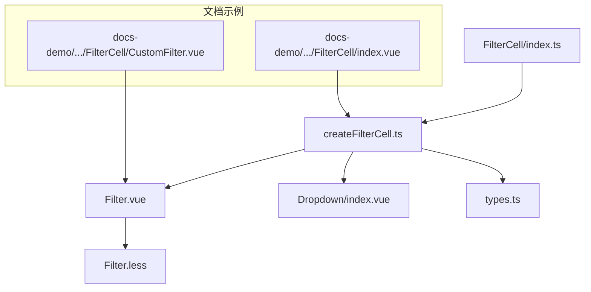
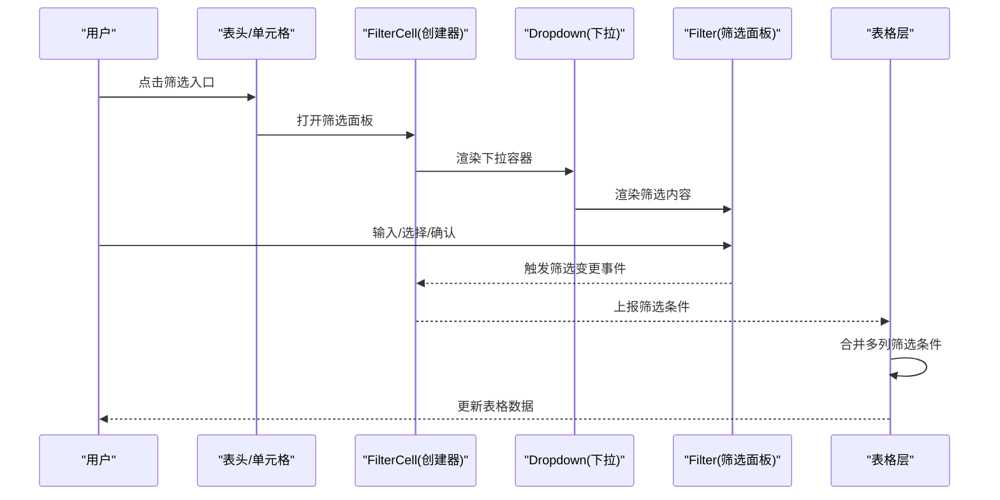
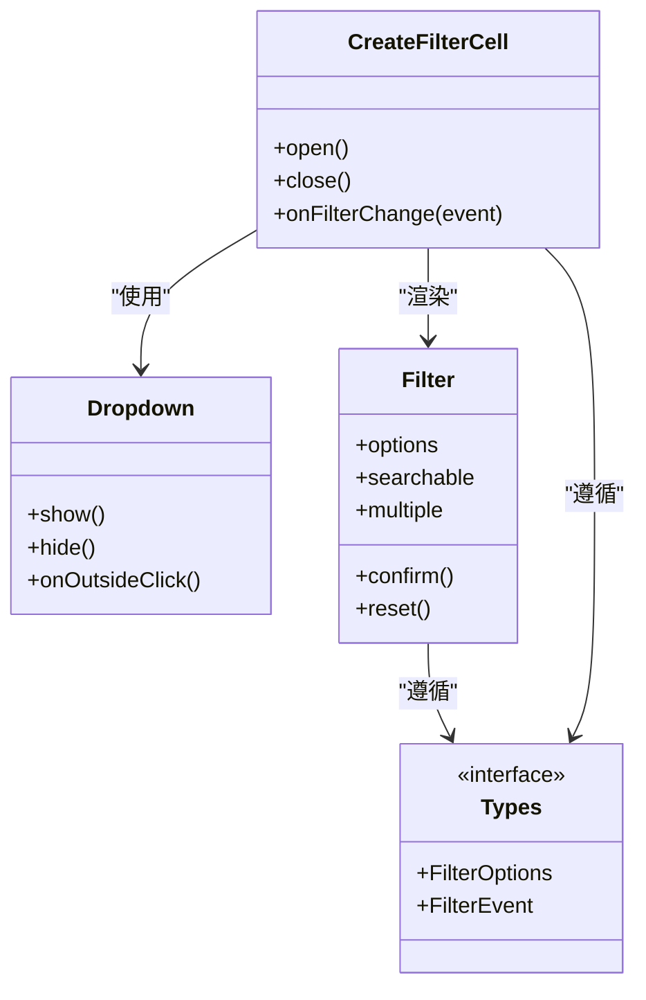

# 筛选单元格

<cite>
**本文引用的文件**   
- [FilterCell/index.ts](file://src/StkTable/custom-cells/FilterCell/index.ts)
- [FilterCell/createFilterCell.ts](file://src/StkTable/custom-cells/FilterCell/createFilterCell.ts)
- [FilterCell/Filter.vue](file://src/StkTable/custom-cells/FilterCell/Filter.vue)
- [FilterCell/Dropdown/index.vue](file://src/StkTable/custom-cells/FilterCell/Dropdown/index.vue)
- [FilterCell/Dropdown/index.ts](file://src/StkTable/custom-cells/FilterCell/Dropdown/index.ts)
- [FilterCell/types.ts](file://src/StkTable/custom-cells/FilterCell/types.ts)
- [FilterCell/Filter.less](file://src/StkTable/custom-cells/FilterCell/Filter.less)
- [docs-demo/advanced/custom-cells/FilterCell/index.vue](file://docs-demo/advanced/custom-cells/FilterCell/index.vue)
- [docs-demo/advanced/custom-cells/FilterCell/CustomFilter.vue](file://docs-demo/advanced/custom-cells/FilterCell/CustomFilter.vue)
- [docs-src/main/table/advanced/custom-cells/filter-cell.md](file://docs-src/main/table/advanced/custom-cells/filter-cell.md)
</cite>

## 目录
1. [简介](#简介)
2. [项目结构](#项目结构)
3. [核心组件与能力](#核心组件与能力)
4. [架构总览](#架构总览)
5. [详细组件分析](#详细组件分析)
6. [依赖关系分析](#依赖关系分析)
7. [性能考量](#性能考量)
8. [故障排查指南](#故障排查指南)
9. [结论](#结论)
10. [附录：API 参考](#附录api-参考)

## 简介
本文件面向开发者，系统化说明 stk-table-vue 的筛选单元格（FilterCell）的实现与使用方式。内容覆盖下拉筛选、搜索过滤、多条件筛选等常见场景；提供自定义筛选器的完整指南（筛选逻辑、UI 交互、数据联动）；给出 API 参考（配置项、事件、样式定制），并附带典型示例路径，帮助快速落地文本筛选、范围筛选、多选筛选等需求。同时说明与表格数据源的集成方式与性能优化建议。

## 项目结构
筛选单元格位于 custom-cells/FilterCell 目录下，采用“工厂函数 + Vue 组件 + 类型定义”的组织方式：
- index.ts：对外导出 FilterCell 创建方法，便于在列配置中注册使用
- createFilterCell.ts：封装筛选单元格的创建逻辑，统一处理筛选状态、事件派发与渲染
- Filter.vue：筛选面板 UI，包含搜索框、选项列表、确认/重置按钮等
- Dropdown/index.vue：下拉容器组件，负责弹出定位、遮罩与键盘交互
- types.ts：筛选相关类型定义（筛选器接口、配置项、事件参数等）
- Filter.less：筛选面板样式

图表来源
- [FilterCell/index.ts](file://src/StkTable/custom-cells/FilterCell/index.ts)
- [FilterCell/createFilterCell.ts](file://src/StkTable/custom-cells/FilterCell/createFilterCell.ts)
- [FilterCell/Filter.vue](file://src/StkTable/custom-cells/FilterCell/Filter.vue)
- [FilterCell/Dropdown/index.vue](file://src/StkTable/custom-cells/FilterCell/Dropdown/index.vue)
- [FilterCell/types.ts](file://src/StkTable/custom-cells/FilterCell/types.ts)
- [FilterCell/Filter.less](file://src/StkTable/custom-cells/FilterCell/Filter.less)
- [docs-demo/advanced/custom-cells/FilterCell/index.vue](file://docs-demo/advanced/custom-cells/FilterCell/index.vue)
- [docs-demo/advanced/custom-cells/FilterCell/CustomFilter.vue](file://docs-demo/advanced/custom-cells/FilterCell/CustomFilter.vue)

章节来源
- [FilterCell/index.ts](file://src/StkTable/custom-cells/FilterCell/index.ts)
- [FilterCell/createFilterCell.ts](file://src/StkTable/custom-cells/FilterCell/createFilterCell.ts)
- [FilterCell/Filter.vue](file://src/StkTable/custom-cells/FilterCell/Filter.vue)
- [FilterCell/Dropdown/index.vue](file://src/StkTable/custom-cells/FilterCell/Dropdown/index.vue)
- [FilterCell/types.ts](file://src/StkTable/custom-cells/FilterCell/types.ts)
- [FilterCell/Filter.less](file://src/StkTable/custom-cells/FilterCell/Filter.less)

## 核心组件与能力
- 下拉筛选：点击表头或单元格触发下拉面板，支持搜索与选项选择
- 搜索过滤：输入关键词即时过滤选项列表，提升大数据量下的可用性
- 多条件筛选：支持单列内多值组合（如多选、范围），并可与其他列筛选叠加
- 自定义筛选器：通过插槽或自定义组件替换默认 UI，实现业务专属交互
- 事件驱动：筛选变更通过事件上报，由表格层统一聚合与刷新
- 样式定制：提供样式变量与类名约定，便于主题化与覆盖

章节来源
- [FilterCell/Filter.vue](file://src/StkTable/custom-cells/FilterCell/Filter.vue)
- [FilterCell/Dropdown/index.vue](file://src/StkTable/custom-cells/FilterCell/Dropdown/index.vue)
- [FilterCell/types.ts](file://src/StkTable/custom-cells/FilterCell/types.ts)

## 架构总览
FilterCell 以工厂函数形式暴露，内部由创建器协调 UI 与事件流。用户侧通过列配置启用筛选，并在需要时注入自定义筛选组件。筛选结果以结构化对象形式上报，表格层据此对数据源进行过滤与渲染。

图表来源
- [FilterCell/createFilterCell.ts](file://src/StkTable/custom-cells/FilterCell/createFilterCell.ts)
- [FilterCell/Dropdown/index.vue](file://src/StkTable/custom-cells/FilterCell/Dropdown/index.vue)
- [FilterCell/Filter.vue](file://src/StkTable/custom-cells/FilterCell/Filter.vue)

## 详细组件分析

### FilterCell 工厂与创建器
- 职责
  - 提供统一的创建入口，接收列配置与上下文
  - 管理筛选面板的显示/隐藏、定位与生命周期
  - 将筛选面板产生的变更转换为标准事件，交由表格层处理
- 关键点
  - 与 Dropdown 协作完成弹出定位与遮罩
  - 与 Filter 组件通信，传递初始值、选项、搜索回调等
  - 维护当前列的筛选状态，避免重复计算

章节来源
- [FilterCell/index.ts](file://src/StkTable/custom-cells/FilterCell/index.ts)
- [FilterCell/createFilterCell.ts](file://src/StkTable/custom-cells/FilterCell/createFilterCell.ts)

### Filter 筛选面板
- 职责
  - 展示搜索框、选项列表、操作按钮（确认/重置）
  - 处理搜索节流与选项高亮
  - 将最终筛选条件提交给上层
- 关键点
  - 支持可插拔的筛选器 UI（插槽或自定义组件）
  - 与 Dropdown 解耦，专注筛选交互与数据绑定
  - 提供清晰的视觉反馈（选中态、禁用态、空态）

章节来源
- [FilterCell/Filter.vue](file://src/StkTable/custom-cells/FilterCell/Filter.vue)
- [FilterCell/Filter.less](file://src/StkTable/custom-cells/FilterCell/Filter.less)

### Dropdown 下拉容器
- 职责
  - 控制弹出位置、尺寸与层级
  - 处理点击外部关闭、ESC 关闭、焦点管理
- 关键点
  - 与平台滚动容器兼容，避免溢出遮挡
  - 为 Filter 提供稳定的挂载点与事件总线

章节来源
- [FilterCell/Dropdown/index.vue](file://src/StkTable/custom-cells/FilterCell/Dropdown/index.vue)
- [FilterCell/Dropdown/index.ts](file://src/StkTable/custom-cells/FilterCell/Dropdown/index.ts)

### 类型与契约
- 筛选器接口
  - 定义筛选器应暴露的属性与方法（如 options、searchable、multiple、confirm/reset 等）
- 配置项
  - 列级筛选开关、默认值、选项生成策略、搜索行为等
- 事件参数
  - 筛选变更事件的载荷结构（字段名、条件对象、时间戳等）

章节来源
- [FilterCell/types.ts](file://src/StkTable/custom-cells/FilterCell/types.ts)

### 自定义筛选器开发指南
- 何时自定义
  - 需要复杂交互（如区间滑块、级联选择、日期范围）
  - 需要与外部系统联动（远程搜索、权限过滤）
- 如何接入
  - 通过插槽或替换默认 Filter 组件，遵循类型契约
  - 确保在用户确认后触发筛选事件，并携带结构化条件
- 数据联动
  - 根据已选条件动态加载选项（防抖/分页）
  - 跨列联动时，监听其他列筛选变化，更新当前选项集

章节来源
- [FilterCell/Filter.vue](file://src/StkTable/custom-cells/FilterCell/Filter.vue)
- [FilterCell/types.ts](file://src/StkTable/custom-cells/FilterCell/types.ts)

### 典型场景与示例路径
- 文本筛选：基于关键词匹配，支持大小写与模糊匹配
  - 示例路径：[docs-demo/advanced/custom-cells/FilterCell/index.vue](file://docs-demo/advanced/custom-cells/FilterCell/index.vue)
- 范围筛选：数值区间、日期范围等
  - 示例路径：[docs-demo/advanced/custom-cells/FilterCell/CustomFilter.vue](file://docs-demo/advanced/custom-cells/FilterCell/CustomFilter.vue)
- 多选筛选：复选框列表、全选/反选、计数提示
  - 示例路径：[docs-demo/advanced/custom-cells/FilterCell/index.vue](file://docs-demo/advanced/custom-cells/FilterCell/index.vue)

章节来源
- [docs-demo/advanced/custom-cells/FilterCell/index.vue](file://docs-demo/advanced/custom-cells/FilterCell/index.vue)
- [docs-demo/advanced/custom-cells/FilterCell/CustomFilter.vue](file://docs-demo/advanced/custom-cells/FilterCell/CustomFilter.vue)

## 依赖关系分析
FilterCell 的依赖关系清晰且低耦合：
- 创建器依赖类型定义，保证契约一致性
- 面板组件依赖下拉容器，屏蔽定位细节
- 与表格层通过事件协议交互，不直接访问数据源

图表来源
- [FilterCell/createFilterCell.ts](file://src/StkTable/custom-cells/FilterCell/createFilterCell.ts)
- [FilterCell/Dropdown/index.vue](file://src/StkTable/custom-cells/FilterCell/Dropdown/index.vue)
- [FilterCell/Filter.vue](file://src/StkTable/custom-cells/FilterCell/Filter.vue)
- [FilterCell/types.ts](file://src/StkTable/custom-cells/FilterCell/types.ts)

章节来源
- [FilterCell/createFilterCell.ts](file://src/StkTable/custom-cells/FilterCell/createFilterCell.ts)
- [FilterCell/Dropdown/index.vue](file://src/StkTable/custom-cells/FilterCell/Dropdown/index.vue)
- [FilterCell/Filter.vue](file://src/StkTable/custom-cells/FilterCell/Filter.vue)
- [FilterCell/types.ts](file://src/StkTable/custom-cells/FilterCell/types.ts)

## 性能考量
- 搜索优化
  - 输入防抖与节流，减少频繁计算
  - 选项列表虚拟滚动，应对海量选项
- 渲染优化
  - 按需渲染筛选面板，避免常驻开销
  - 使用稳定 key，降低重排
- 数据联动
  - 远程搜索分页加载，避免一次性拉取全量
  - 缓存常用选项，结合失效策略
- 事件合并
  - 多列筛选条件合并时，增量更新而非全量重算
- 样式与布局
  - 避免大计算量样式，优先 CSS 变量与类切换

[本节为通用指导，不直接分析具体文件]

## 故障排查指南
- 筛选无效
  - 检查事件是否上报成功，确认条件结构是否符合契约
  - 核对列字段名与数据源字段映射
- 下拉定位异常
  - 检查容器滚动与层级设置，必要时调整 z-index
- 搜索无响应
  - 确认防抖配置与输入事件绑定
  - 检查选项生成逻辑是否为空
- 样式错乱
  - 检查主题变量覆盖是否正确
  - 确认样式作用域与全局样式冲突

章节来源
- [FilterCell/Filter.less](file://src/StkTable/custom-cells/FilterCell/Filter.less)
- [FilterCell/Dropdown/index.vue](file://src/StkTable/custom-cells/FilterCell/Dropdown/index.vue)

## 结论
FilterCell 提供了开箱即用的筛选能力，并通过清晰的类型契约与事件协议，使自定义扩展变得简单可靠。借助下拉容器与面板组件的解耦设计，可在保持性能的同时满足多样化业务需求。推荐在复杂筛选场景中优先采用自定义筛选器，并结合远程搜索与虚拟滚动优化体验。

[本节为总结性内容，不直接分析具体文件]

## 附录：API 参考

### 列级筛选配置
- 启用筛选：在列配置中开启筛选开关
- 默认值：设置初始筛选条件
- 选项来源：静态数组或动态函数（支持异步）
- 搜索行为：是否支持搜索、搜索延迟、最大展示数
- 多选模式：是否允许多选、是否支持全选
- 确认策略：手动确认或实时应用

章节来源
- [FilterCell/types.ts](file://src/StkTable/custom-cells/FilterCell/types.ts)
- [FilterCell/createFilterCell.ts](file://src/StkTable/custom-cells/FilterCell/createFilterCell.ts)

### 事件与回调
- 筛选变更事件：携带字段名、条件对象、时间戳
- 确认/重置回调：用于二次确认或清空状态
- 搜索回调：用于远程搜索与选项更新

章节来源
- [FilterCell/Filter.vue](file://src/StkTable/custom-cells/FilterCell/Filter.vue)
- [FilterCell/types.ts](file://src/StkTable/custom-cells/FilterCell/types.ts)

### 样式定制
- 类名约定：面板、选项、搜索框、按钮等元素类名
- 主题变量：颜色、字号、间距等 CSS 变量
- 覆盖策略：局部样式与作用域隔离

章节来源
- [FilterCell/Filter.less](file://src/StkTable/custom-cells/FilterCell/Filter.less)

### 与表格数据源集成
- 条件合并：多列筛选条件按字段聚合
- 过滤执行：在数据层执行过滤，避免前端全量计算
- 远端过滤：将条件透传给后端，服务端返回过滤结果

章节来源
- [docs-src/main/table/advanced/custom-cells/filter-cell.md](file://docs-src/main/table/advanced/custom-cells/filter-cell.md)