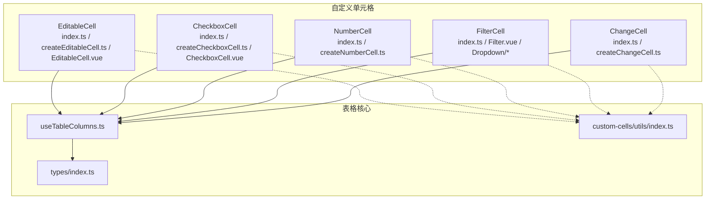
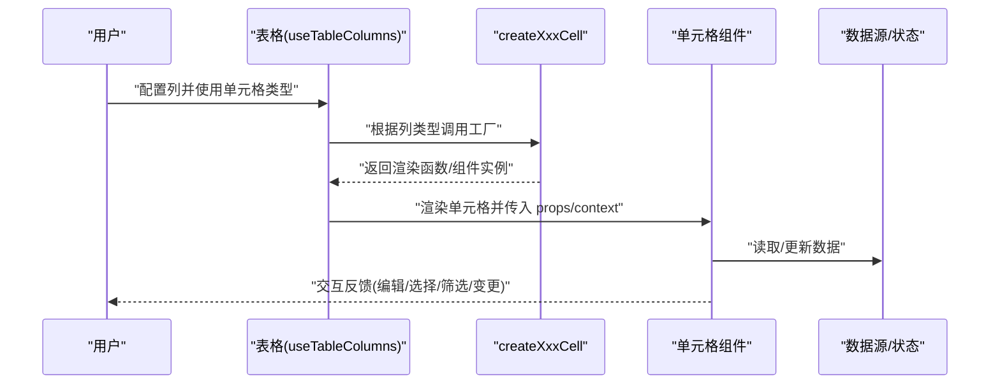
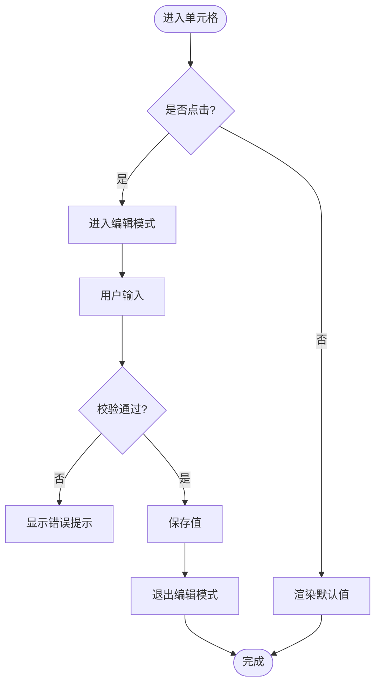
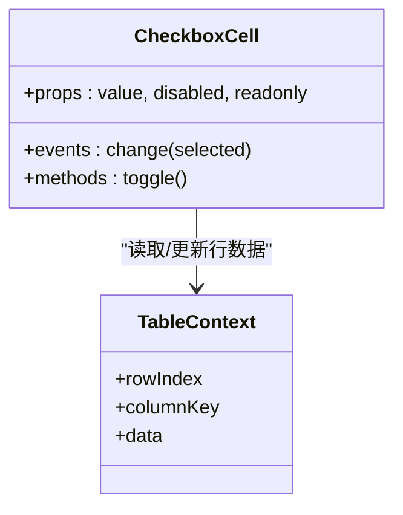
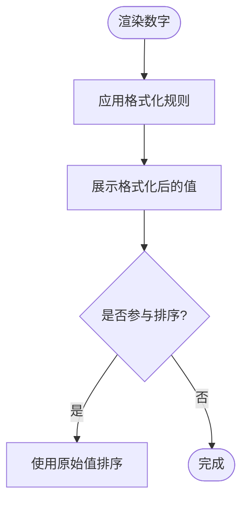
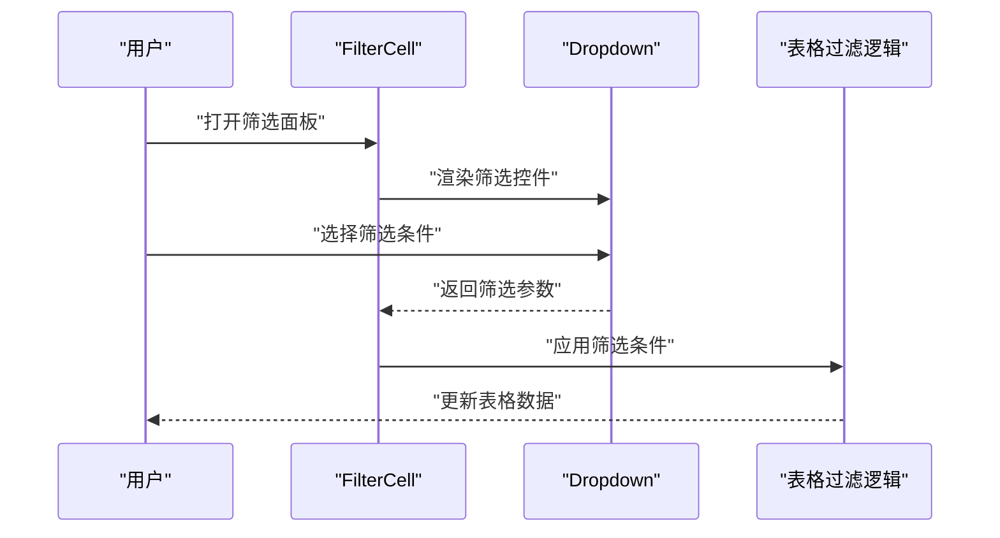
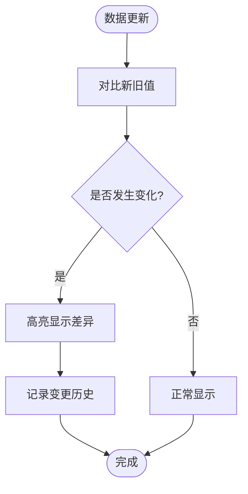
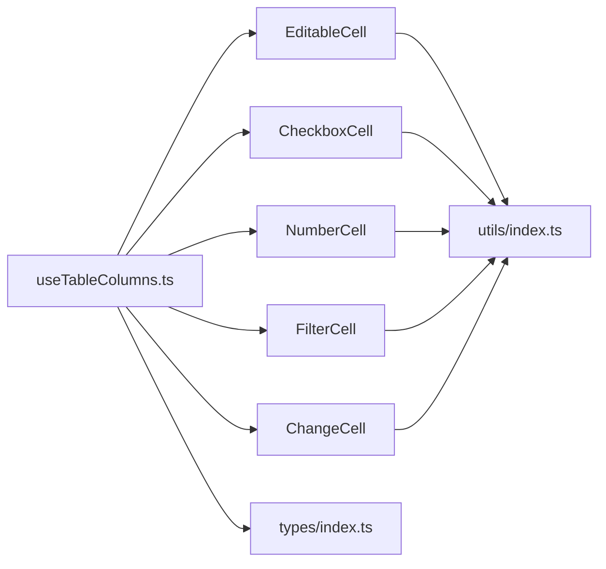

# 自定义单元格

<cite>
**本文引用的文件**   
- [src/StkTable/custom-cells/EditableCell/index.ts](file://src/StkTable/custom-cells/EditableCell/index.ts)
- [src/StkTable/custom-cells/EditableCell/EditableCell.vue](file://src/StkTable/custom-cells/EditableCell/EditableCell.vue)
- [src/StkTable/custom-cells/EditableCell/createEditableCell.ts](file://src/StkTable/custom-cells/EditableCell/createEditableCell.ts)
- [src/StkTable/custom-cells/CheckboxCell/index.ts](file://src/StkTable/custom-cells/CheckboxCell/index.ts)
- [src/StkTable/custom-cells/CheckboxCell/CheckboxCell.vue](file://src/StkTable/custom-cells/CheckboxCell/CheckboxCell.vue)
- [src/StkTable/custom-cells/CheckboxCell/createCheckboxCell.ts](file://src/StkTable/custom-cells/CheckboxCell/createCheckboxCell.ts)
- [src/StkTable/custom-cells/NumberCell/index.ts](file://src/StkTable/custom-cells/NumberCell/index.ts)
- [src/StkTable/custom-cells/NumberCell/createNumberCell.ts](file://src/StkTable/custom-cells/NumberCell/createNumberCell.ts)
- [src/StkTable/custom-cells/FilterCell/index.ts](file://src/StkTable/custom-cells/FilterCell/index.ts)
- [src/StkTable/custom-cells/FilterCell/Filter.vue](file://src/StkTable/custom-cells/FilterCell/Filter.vue)
- [src/StkTable/custom-cells/FilterCell/Dropdown/index.ts](file://src/StkTable/custom-cells/FilterCell/Dropdown/index.ts)
- [src/StkTable/custom-cells/FilterCell/Dropdown/index.vue](file://src/StkTable/custom-cells/FilterCell/Dropdown/index.vue)
- [src/StkTable/custom-cells/ChangeCell/index.ts](file://src/StkTable/custom-cells/ChangeCell/index.ts)
- [src/StkTable/custom-cells/ChangeCell/createChangeCell.ts](file://src/StkTable/custom-cells/ChangeCell/createChangeCell.ts)
- [src/StkTable/custom-cells/utils/index.ts](file://src/StkTable/custom-cells/utils/index.ts)
- [src/StkTable/types/index.ts](file://src/StkTable/types/index.ts)
- [src/StkTable/useTableColumns.ts](file://src/StkTable/useTableColumns.ts)
- [docs-demo/advanced/custom-cells/EditableCell/index.vue](file://docs-demo/advanced/custom-cells/EditableCell/index.vue)
- [docs-demo/advanced/custom-cells/CheckboxCell/index.vue](file://docs-demo/advanced/custom-cells/CheckboxCell/index.vue)
- [docs-demo/advanced/custom-cells/NumberCell/index.vue](file://docs-demo/advanced/custom-cells/NumberCell/index.vue)
- [docs-demo/advanced/custom-cells/FilterCell/index.vue](file://docs-demo/advanced/custom-cells/FilterCell/index.vue)
- [docs-demo/advanced/custom-cells/FilterCell/CustomFilter.vue](file://docs-demo/advanced/custom-cells/FilterCell/CustomFilter.vue)
- [docs-demo/advanced/custom-cells/ChangeCell/index.vue](file://docs-demo/advanced/custom-cells/ChangeCell/index.vue)
- [docs-demo/advanced/custom-cell/CustomCell/index.vue](file://docs-demo/advanced/custom-cell/CustomCell/index.vue)
- [docs-demo/advanced/custom-cell/CustomCell/YieldCell.vue](file://docs-demo/advanced/custom-cell/CustomCell/YieldCell.vue)
- [docs-demo/advanced/custom-cell/CustomCell/types.ts](file://docs-demo/advanced/custom-cell/CustomCell/types.ts)
</cite>

## 目录
1. [简介](#简介)
2. [项目结构](#项目结构)
3. [核心组件与类型](#核心组件与类型)
4. [架构总览](#架构总览)
5. [详细组件分析](#详细组件分析)
6. [依赖关系分析](#依赖关系分析)
7. [性能考量](#性能考量)
8. [故障排查指南](#故障排查指南)
9. [结论](#结论)
10. [附录：API 参考与最佳实践](#附录api-参考与最佳实践)

## 简介
本文件面向开发者，系统化阐述 stk-table-vue 的自定义单元格体系。内容覆盖内置的自定义单元格类型（可编辑单元格、复选框单元格、数字单元格、筛选单元格、变更单元格）的实现原理与使用方法；并提供从零到一创建自定义单元格的完整指南，包括生命周期钩子、事件处理、样式定制、TypeScript 类型定义、API 参考与最佳实践。通过本文档，读者可以高效地扩展表格能力，构建从简单文本显示到复杂交互的单元格组件。

## 项目结构
stk-table-vue 将自定义单元格按功能模块划分在 src/StkTable/custom-cells 目录下，每个单元格类型包含：
- index.ts：对外导出注册函数或工厂方法
- createXxxCell.ts：工厂实现，负责生成单元格渲染逻辑与行为
- XxxCell.vue：可选的 Vue 组件实现（用于需要 UI 的单元格）
- types.ts（部分模块）：类型定义
- utils：通用工具函数

示例结构如下：
- EditableCell：可编辑单元格
- CheckboxCell：复选框单元格
- NumberCell：数字单元格
- FilterCell：筛选单元格（含下拉筛选组件）
- ChangeCell：变更单元格（高亮变更等）

此外，文档演示位于 docs-demo/advanced/custom-cells，提供各单元格的用法示例。

图表来源
- [src/StkTable/custom-cells/EditableCell/index.ts](file://src/StkTable/custom-cells/EditableCell/index.ts)
- [src/StkTable/custom-cells/CheckboxCell/index.ts](file://src/StkTable/custom-cells/CheckboxCell/index.ts)
- [src/StkTable/custom-cells/NumberCell/index.ts](file://src/StkTable/custom-cells/NumberCell/index.ts)
- [src/StkTable/custom-cells/FilterCell/index.ts](file://src/StkTable/custom-cells/FilterCell/index.ts)
- [src/StkTable/custom-cells/ChangeCell/index.ts](file://src/StkTable/custom-cells/ChangeCell/index.ts)
- [src/StkTable/useTableColumns.ts](file://src/StkTable/useTableColumns.ts)
- [src/StkTable/types/index.ts](file://src/StkTable/types/index.ts)
- [src/StkTable/custom-cells/utils/index.ts](file://src/StkTable/custom-cells/utils/index.ts)

章节来源
- [src/StkTable/custom-cells/EditableCell/index.ts](file://src/StkTable/custom-cells/EditableCell/index.ts)
- [src/StkTable/custom-cells/CheckboxCell/index.ts](file://src/StkTable/custom-cells/CheckboxCell/index.ts)
- [src/StkTable/custom-cells/NumberCell/index.ts](file://src/StkTable/custom-cells/NumberCell/index.ts)
- [src/StkTable/custom-cells/FilterCell/index.ts](file://src/StkTable/custom-cells/FilterCell/index.ts)
- [src/StkTable/custom-cells/ChangeCell/index.ts](file://src/StkTable/custom-cells/ChangeCell/index.ts)
- [src/StkTable/useTableColumns.ts](file://src/StkTable/useTableColumns.ts)
- [src/StkTable/types/index.ts](file://src/StkTable/types/index.ts)
- [src/StkTable/custom-cells/utils/index.ts](file://src/StkTable/custom-cells/utils/index.ts)

## 核心组件与类型
- 可编辑单元格（EditableCell）：支持点击进入编辑状态、输入校验、失焦保存、键盘导航等交互。
- 复选框单元格（CheckboxCell）：支持选中/取消选中、批量操作联动、禁用态。
- 数字单元格（NumberCell）：数值格式化、精度控制、千分位、单位展示。
- 筛选单元格（FilterCell）：列级筛选面板，支持多条件组合、自定义筛选器。
- 变更单元格（ChangeCell）：数据变更高亮、差异对比、撤销/重做联动。

这些单元格通过工厂函数（createXxxCell）生成统一的渲染接口，供表格列配置使用。类型定义集中在 types/index.ts，确保 TypeScript 开发体验。

章节来源
- [src/StkTable/custom-cells/EditableCell/index.ts](file://src/StkTable/custom-cells/EditableCell/index.ts)
- [src/StkTable/custom-cells/CheckboxCell/index.ts](file://src/StkTable/custom-cells/CheckboxCell/index.ts)
- [src/StkTable/custom-cells/NumberCell/index.ts](file://src/StkTable/custom-cells/NumberCell/index.ts)
- [src/StkTable/custom-cells/FilterCell/index.ts](file://src/StkTable/custom-cells/FilterCell/index.ts)
- [src/StkTable/custom-cells/ChangeCell/index.ts](file://src/StkTable/custom-cells/ChangeCell/index.ts)
- [src/StkTable/types/index.ts](file://src/StkTable/types/index.ts)

## 架构总览
自定义单元格系统采用“工厂 + 组件”的模式：
- 工厂函数（createXxxCell）：封装渲染逻辑、事件绑定、状态管理，返回统一接口供表格列使用。
- 组件实现（*.vue）：负责具体 UI 呈现与交互细节。
- 表格集成（useTableColumns）：解析列配置，选择并挂载对应的单元格渲染器。
- 类型系统（types/index.ts）：定义单元格属性、事件、上下文对象，保障类型安全。

图表来源
- [src/StkTable/useTableColumns.ts](file://src/StkTable/useTableColumns.ts)
- [src/StkTable/custom-cells/EditableCell/createEditableCell.ts](file://src/StkTable/custom-cells/EditableCell/createEditableCell.ts)
- [src/StkTable/custom-cells/CheckboxCell/createCheckboxCell.ts](file://src/StkTable/custom-cells/CheckboxCell/createCheckboxCell.ts)
- [src/StkTable/custom-cells/NumberCell/createNumberCell.ts](file://src/StkTable/custom-cells/NumberCell/createNumberCell.ts)
- [src/StkTable/custom-cells/FilterCell/createFilterCell.ts](file://src/StkTable/custom-cells/FilterCell/createFilterCell.ts)
- [src/StkTable/custom-cells/ChangeCell/createChangeCell.ts](file://src/StkTable/custom-cells/ChangeCell/createChangeCell.ts)

## 详细组件分析

### 可编辑单元格（EditableCell）
- 功能要点
  - 点击进入编辑模式，支持输入校验与错误提示
  - 失焦自动保存，支持键盘导航（回车确认、Esc 取消）
  - 与表格行/列上下文联动，支持只读/禁用态
- 关键文件
  - 工厂与导出：[src/StkTable/custom-cells/EditableCell/index.ts](file://src/StkTable/custom-cells/EditableCell/index.ts)、[src/StkTable/custom-cells/EditableCell/createEditableCell.ts](file://src/StkTable/custom-cells/EditableCell/createEditableCell.ts)
  - 组件实现：[src/StkTable/custom-cells/EditableCell/EditableCell.vue](file://src/StkTable/custom-cells/EditableCell/EditableCell.vue)
- 使用方式
  - 在列配置中指定单元格类型为可编辑单元格，并传入编辑器选项（如输入类型、校验规则）
  - 监听保存/取消事件，完成数据同步
- 生命周期与事件
  - 初始化时接收行/列上下文
  - 编辑开始/结束事件，便于外部状态同步
  - 校验失败回调，展示错误信息

图表来源
- [src/StkTable/custom-cells/EditableCell/EditableCell.vue](file://src/StkTable/custom-cells/EditableCell/EditableCell.vue)
- [src/StkTable/custom-cells/EditableCell/createEditableCell.ts](file://src/StkTable/custom-cells/EditableCell/createEditableCell.ts)

章节来源
- [src/StkTable/custom-cells/EditableCell/index.ts](file://src/StkTable/custom-cells/EditableCell/index.ts)
- [src/StkTable/custom-cells/EditableCell/createEditableCell.ts](file://src/StkTable/custom-cells/EditableCell/createEditableCell.ts)
- [src/StkTable/custom-cells/EditableCell/EditableCell.vue](file://src/StkTable/custom-cells/EditableCell/EditableCell.vue)
- [docs-demo/advanced/custom-cells/EditableCell/index.vue](file://docs-demo/advanced/custom-cells/EditableCell/index.vue)

### 复选框单元格（CheckboxCell）
- 功能要点
  - 支持选中/取消选中，联动行选择状态
  - 支持禁用态与只读态
  - 可与批量操作联动，触发表格级事件
- 关键文件
  - 工厂与导出：[src/StkTable/custom-cells/CheckboxCell/index.ts](file://src/StkTable/custom-cells/CheckboxCell/index.ts)、[src/StkTable/custom-cells/CheckboxCell/createCheckboxCell.ts](file://src/StkTable/custom-cells/CheckboxCell/createCheckboxCell.ts)
  - 组件实现：[src/StkTable/custom-cells/CheckboxCell/CheckboxCell.vue](file://src/StkTable/custom-cells/CheckboxCell/CheckboxCell.vue)
- 使用方式
  - 在列配置中指定复选框单元格，绑定行数据字段
  - 监听选中变化事件，执行业务逻辑（如启用批量删除）

图表来源
- [src/StkTable/custom-cells/CheckboxCell/CheckboxCell.vue](file://src/StkTable/custom-cells/CheckboxCell/CheckboxCell.vue)
- [src/StkTable/custom-cells/CheckboxCell/createCheckboxCell.ts](file://src/StkTable/custom-cells/CheckboxCell/createCheckboxCell.ts)

章节来源
- [src/StkTable/custom-cells/CheckboxCell/index.ts](file://src/StkTable/custom-cells/CheckboxCell/index.ts)
- [src/StkTable/custom-cells/CheckboxCell/createCheckboxCell.ts](file://src/StkTable/custom-cells/CheckboxCell/createCheckboxCell.ts)
- [src/StkTable/custom-cells/CheckboxCell/CheckboxCell.vue](file://src/StkTable/custom-cells/CheckboxCell/CheckboxCell.vue)
- [docs-demo/advanced/custom-cells/CheckboxCell/index.vue](file://docs-demo/advanced/custom-cells/CheckboxCell/index.vue)

### 数字单元格（NumberCell）
- 功能要点
  - 数值格式化（千分位、小数位数、单位）
  - 支持排序与比较
  - 可选编辑模式（与可编辑单元格结合）
- 关键文件
  - 工厂与导出：[src/StkTable/custom-cells/NumberCell/index.ts](file://src/StkTable/custom-cells/NumberCell/index.ts)、[src/StkTable/custom-cells/NumberCell/createNumberCell.ts](file://src/StkTable/custom-cells/NumberCell/createNumberCell.ts)
- 使用方式
  - 在列配置中指定数字单元格，设置格式选项
  - 如需编辑，可嵌套可编辑单元格

图表来源
- [src/StkTable/custom-cells/NumberCell/createNumberCell.ts](file://src/StkTable/custom-cells/NumberCell/createNumberCell.ts)

章节来源
- [src/StkTable/custom-cells/NumberCell/index.ts](file://src/StkTable/custom-cells/NumberCell/index.ts)
- [src/StkTable/custom-cells/NumberCell/createNumberCell.ts](file://src/StkTable/custom-cells/NumberCell/createNumberCell.ts)
- [docs-demo/advanced/custom-cells/NumberCell/index.vue](file://docs-demo/advanced/custom-cells/NumberCell/index.vue)

### 筛选单元格（FilterCell）
- 功能要点
  - 列级筛选面板，支持多条件组合
  - 内置下拉筛选组件，支持自定义筛选器
  - 与表格过滤逻辑联动，实时更新结果
- 关键文件
  - 工厂与导出：[src/StkTable/custom-cells/FilterCell/index.ts](file://src/StkTable/custom-cells/FilterCell/index.ts)
  - 组件实现：[src/StkTable/custom-cells/FilterCell/Filter.vue](file://src/StkTable/custom-cells/FilterCell/Filter.vue)
  - 下拉筛选：[src/StkTable/custom-cells/FilterCell/Dropdown/index.vue](file://src/StkTable/custom-cells/FilterCell/Dropdown/index.vue)、[src/StkTable/custom-cells/FilterCell/Dropdown/index.ts](file://src/StkTable/custom-cells/FilterCell/Dropdown/index.ts)
- 使用方式
  - 在列配置中启用筛选，传入筛选器配置
  - 可通过自定义筛选器组件扩展筛选逻辑

图表来源
- [src/StkTable/custom-cells/FilterCell/Filter.vue](file://src/StkTable/custom-cells/FilterCell/Filter.vue)
- [src/StkTable/custom-cells/FilterCell/Dropdown/index.vue](file://src/StkTable/custom-cells/FilterCell/Dropdown/index.vue)
- [src/StkTable/custom-cells/FilterCell/index.ts](file://src/StkTable/custom-cells/FilterCell/index.ts)

章节来源
- [src/StkTable/custom-cells/FilterCell/index.ts](file://src/StkTable/custom-cells/FilterCell/index.ts)
- [src/StkTable/custom-cells/FilterCell/Filter.vue](file://src/StkTable/custom-cells/FilterCell/Filter.vue)
- [src/StkTable/custom-cells/FilterCell/Dropdown/index.vue](file://src/StkTable/custom-cells/FilterCell/Dropdown/index.vue)
- [src/StkTable/custom-cells/FilterCell/Dropdown/index.ts](file://src/StkTable/custom-cells/FilterCell/Dropdown/index.ts)
- [docs-demo/advanced/custom-cells/FilterCell/index.vue](file://docs-demo/advanced/custom-cells/FilterCell/index.vue)
- [docs-demo/advanced/custom-cells/FilterCell/CustomFilter.vue](file://docs-demo/advanced/custom-cells/FilterCell/CustomFilter.vue)

### 变更单元格（ChangeCell）
- 功能要点
  - 数据变更高亮显示，支持差异对比
  - 与撤销/重做机制联动
  - 可配置高亮样式与动画
- 关键文件
  - 工厂与导出：[src/StkTable/custom-cells/ChangeCell/index.ts](file://src/StkTable/custom-cells/ChangeCell/index.ts)、[src/StkTable/custom-cells/ChangeCell/createChangeCell.ts](file://src/StkTable/custom-cells/ChangeCell/createChangeCell.ts)
- 使用方式
  - 在列配置中启用变更单元格，绑定数据字段
  - 监听变更事件，记录历史或触发通知

图表来源
- [src/StkTable/custom-cells/ChangeCell/createChangeCell.ts](file://src/StkTable/custom-cells/ChangeCell/createChangeCell.ts)

章节来源
- [src/StkTable/custom-cells/ChangeCell/index.ts](file://src/StkTable/custom-cells/ChangeCell/index.ts)
- [src/StkTable/custom-cells/ChangeCell/createChangeCell.ts](file://src/StkTable/custom-cells/ChangeCell/createChangeCell.ts)
- [docs-demo/advanced/custom-cells/ChangeCell/index.vue](file://docs-demo/advanced/custom-cells/ChangeCell/index.vue)

### 自定义单元格（通用）
- 功能要点
  - 通过插槽或自定义组件实现任意渲染逻辑
  - 支持 yield 插槽，灵活注入内容
  - 与表格上下文深度集成，获取行/列数据
- 关键文件
  - 示例组件：[docs-demo/advanced/custom-cell/CustomCell/index.vue](file://docs-demo/advanced/custom-cell/CustomCell/index.vue)、[docs-demo/advanced/custom-cell/CustomCell/YieldCell.vue](file://docs-demo/advanced/custom-cell/CustomCell/YieldCell.vue)
  - 类型定义：[docs-demo/advanced/custom-cell/CustomCell/types.ts](file://docs-demo/advanced/custom-cell/CustomCell/types.ts)
- 使用方式
  - 在列配置中使用自定义组件，或通过工厂函数生成渲染器
  - 利用插槽机制注入动态内容

章节来源
- [docs-demo/advanced/custom-cell/CustomCell/index.vue](file://docs-demo/advanced/custom-cell/CustomCell/index.vue)
- [docs-demo/advanced/custom-cell/CustomCell/YieldCell.vue](file://docs-demo/advanced/custom-cell/CustomCell/YieldCell.vue)
- [docs-demo/advanced/custom-cell/CustomCell/types.ts](file://docs-demo/advanced/custom-cell/CustomCell/types.ts)

## 依赖关系分析
- useTableColumns 负责解析列配置，选择并挂载对应的单元格渲染器。
- 各单元格的工厂函数（createXxxCell）提供统一的渲染接口。
- 类型定义（types/index.ts）确保单元格 API 的类型安全。
- 工具函数（utils/index.ts）提供通用能力（如格式化、校验等）。

图表来源
- [src/StkTable/useTableColumns.ts](file://src/StkTable/useTableColumns.ts)
- [src/StkTable/custom-cells/utils/index.ts](file://src/StkTable/custom-cells/utils/index.ts)
- [src/StkTable/types/index.ts](file://src/StkTable/types/index.ts)

章节来源
- [src/StkTable/useTableColumns.ts](file://src/StkTable/useTableColumns.ts)
- [src/StkTable/custom-cells/utils/index.ts](file://src/StkTable/custom-cells/utils/index.ts)
- [src/StkTable/types/index.ts](file://src/StkTable/types/index.ts)

## 性能考量
- 虚拟滚动：大数据场景下，结合表格的虚拟滚动能力，避免大量 DOM 节点渲染。
- 懒加载：按需加载单元格组件，减少初始包体积。
- 计算优化：对数值格式化、筛选条件等计算进行缓存与惰性求值。
- 事件节流：高频交互（如输入、滚动）使用节流/防抖策略。

## 故障排查指南
- 编辑状态不同步：检查单元格的生命周期钩子是否正确绑定，确保数据双向绑定。
- 筛选无效：确认筛选条件是否正确传递至表格过滤逻辑，检查数据类型与比较规则。
- 变更高亮不生效：核对数据引用是否更新，确保变更检测机制正常工作。
- 样式冲突：检查单元格样式作用域，必要时使用 CSS 变量或命名空间隔离。

## 结论
stk-table-vue 的自定义单元格系统以工厂 + 组件为核心，提供了丰富且可扩展的单元格类型。通过统一的 API 与类型定义，开发者可以快速构建从简单显示到复杂交互的单元格组件。遵循本文档的最佳实践，可有效提升开发效率与用户体验。

## 附录：API 参考与最佳实践
- 工厂函数
  - createEditableCell(options)：创建可编辑单元格渲染器
  - createCheckboxCell(options)：创建复选框单元格渲染器
  - createNumberCell(options)：创建数字单元格渲染器
  - createFilterCell(options)：创建筛选单元格渲染器
  - createChangeCell(options)：创建变更单元格渲染器
- 列配置
  - cellType：指定单元格类型
  - props：传递给单元格的属性
  - events：监听单元格事件（如 change、save、filter）
- 最佳实践
  - 使用 TypeScript 定义单元格类型，确保类型安全
  - 合理拆分单元格组件，保持单一职责
  - 使用插槽与上下文，增强灵活性
  - 对复杂交互进行单元测试，保证稳定性

章节来源
- [src/StkTable/custom-cells/EditableCell/createEditableCell.ts](file://src/StkTable/custom-cells/EditableCell/createEditableCell.ts)
- [src/StkTable/custom-cells/CheckboxCell/createCheckboxCell.ts](file://src/StkTable/custom-cells/CheckboxCell/createCheckboxCell.ts)
- [src/StkTable/custom-cells/NumberCell/createNumberCell.ts](file://src/StkTable/custom-cells/NumberCell/createNumberCell.ts)
- [src/StkTable/custom-cells/FilterCell/index.ts](file://src/StkTable/custom-cells/FilterCell/index.ts)
- [src/StkTable/custom-cells/ChangeCell/createChangeCell.ts](file://src/StkTable/custom-cells/ChangeCell/createChangeCell.ts)
- [src/StkTable/types/index.ts](file://src/StkTable/types/index.ts)