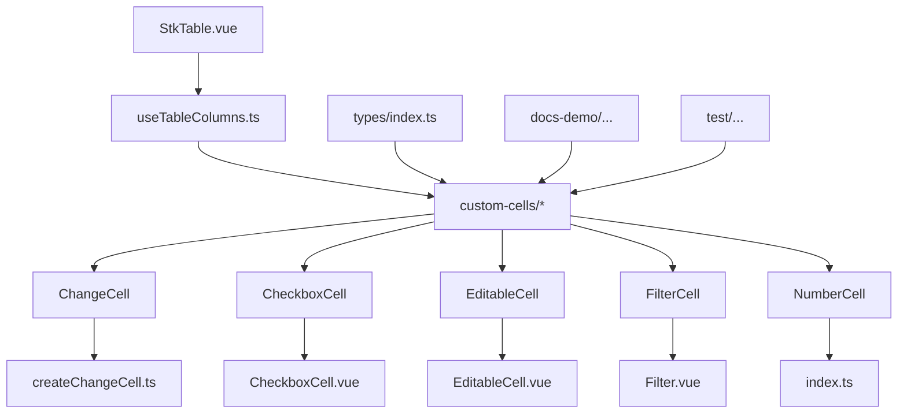
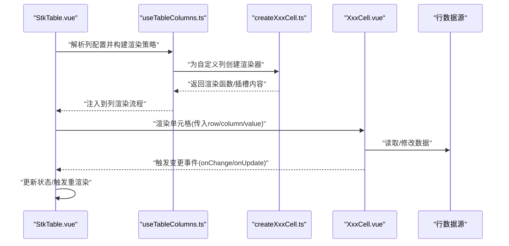
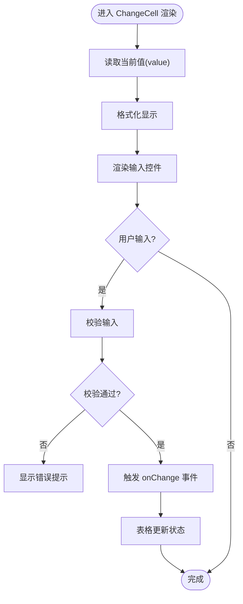
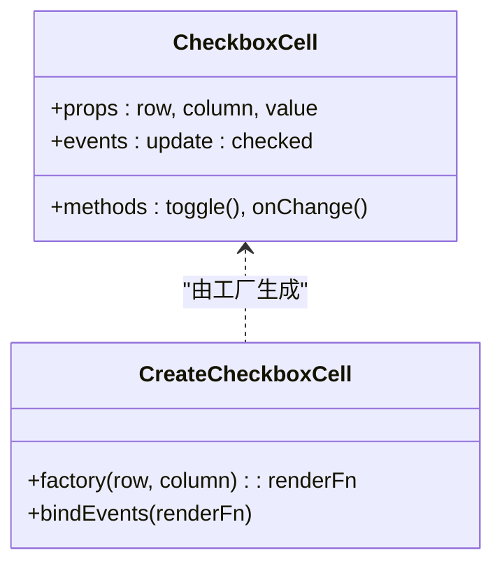
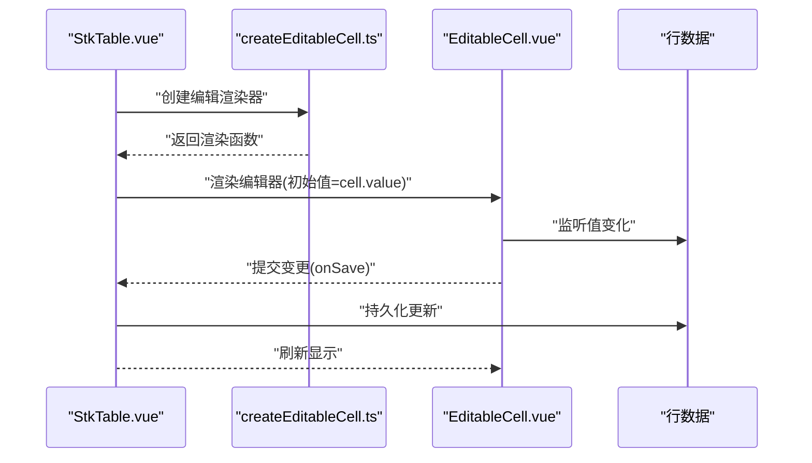
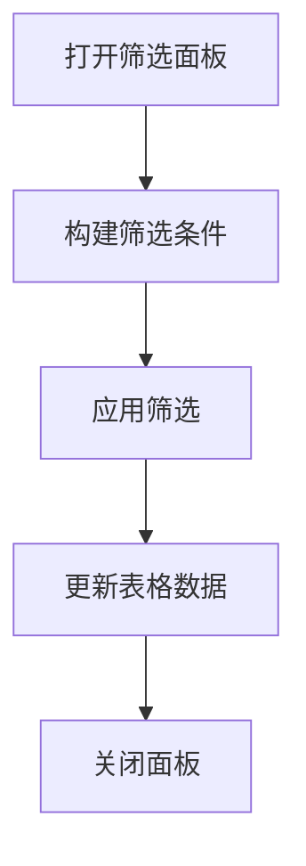
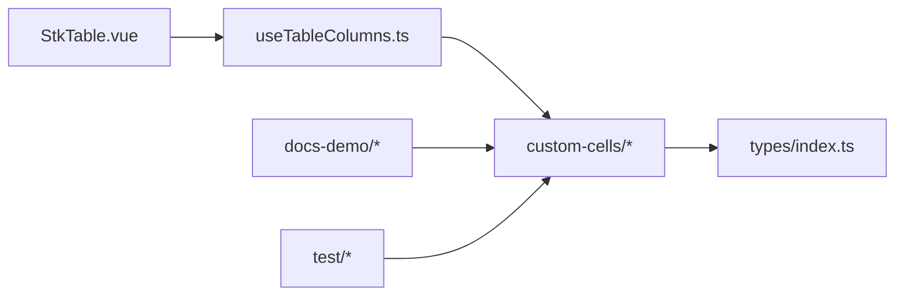

# 自定义单元格开发指南

<cite>
**本文档引用的文件**
- [src/StkTable/custom-cells/ChangeCell/index.ts](file://src/StkTable/custom-cells/ChangeCell/index.ts)
- [src/StkTable/custom-cells/ChangeCell/createChangeCell.ts](file://src/StkTable/custom-cells/ChangeCell/createChangeCell.ts)
- [src/StkTable/custom-cells/CheckboxCell/index.ts](file://src/StkTable/custom-cells/CheckboxCell/index.ts)
- [src/StkTable/custom-cells/CheckboxCell/CheckboxCell.vue](file://src/StkTable/custom-cells/CheckboxCell/CheckboxCell.vue)
- [src/StkTable/custom-cells/EditableCell/index.ts](file://src/StkTable/custom-cells/EditableCell/index.ts)
- [src/StkTable/custom-cells/EditableCell/EditableCell.vue](file://src/StkTable/custom-cells/EditableCell/EditableCell.vue)
- [src/StkTable/custom-cells/FilterCell/index.ts](file://src/StkTable/custom-cells/FilterCell/index.ts)
- [src/StkTable/custom-cells/FilterCell/Filter.vue](file://src/StkTable/custom-cells/FilterCell/Filter.vue)
- [src/StkTable/custom-cells/NumberCell/index.ts](file://src/StkTable/custom-cells/NumberCell/index.ts)
- [src/StkTable/custom-cells/utils/index.ts](file://src/StkTable/custom-cells/utils/index.ts)
- [src/StkTable/types/index.ts](file://src/StkTable/types/index.ts)
- [src/StkTable/useTableColumns.ts](file://src/StkTable/useTableColumns.ts)
- [src/StkTable/StkTable.vue](file://src/StkTable/StkTable.vue)
- [docs-demo/advanced/custom-cell/CustomCell/index.vue](file://docs-demo/advanced/custom-cell/CustomCell/index.vue)
- [docs-demo/advanced/custom-cell/CustomCell/YieldCell.vue](file://docs-demo/advanced/custom-cell/CustomCell/YieldCell.vue)
- [docs-demo/advanced/custom-cell/CustomCell/types.ts](file://docs-demo/advanced/custom-cell/CustomCell/types.ts)
- [docs-demo/advanced/custom-cells/CheckboxCell/index.vue](file://docs-demo/advanced/custom-cells/CheckboxCell/index.vue)
- [docs-demo/advanced/custom-cells/CheckboxCell/CheckboxComponentCell.vue](file://docs-demo/advanced/custom-cells/CheckboxCell/CheckboxComponentCell.vue)
- [docs-demo/advanced/custom-cells/Editabl eCell/index.vue](file://docs-demo/advanced/custom-cells/EditableCell/index.vue)
- [docs-demo/advanced/custom-cells/FilterCell/index.vue](file://docs-demo/advanced/custom-cells/FilterCell/index.vue)
- [docs-demo/advanced/custom-cells/NumberCell/index.vue](file://docs-demo/advanced/custom-cells/NumberCell/index.vue)
- [docs-demo/demos/C ellEdit/index.vue](file://docs-demo/demos/CellEdit/index.vue)
- [docs-demo/demos/C ellEdit/EditCell.vue](file://docs-demo/demos/CellEdit/EditCell.vue)
- [test/EditableCellDemo.vue](file://test/EditableCellDemo.vue)
- [test/NumberChangeCellDemo.vue](file://test/NumberChangeCellDemo.vue)
</cite>

## 目录
1. [简介](#简介)
2. [项目结构](#项目结构)
3. [核心组件与类型](#核心组件与类型)
4. [架构总览](#架构总览)
5. [详细组件分析](#详细组件分析)
6. [依赖关系分析](#依赖关系分析)
7. [性能与渲染优化](#性能与渲染优化)
8. [开发与调试模板](#开发与调试模板)
9. [故障排查](#故障排查)
10. [结论](#结论)

## 简介
本指南面向希望在 stk-table-vue 中从零开始实现“自定义单元格”的开发者。内容覆盖：
- 自定义单元格的组件结构设计、生命周期管理、事件处理机制
- 单元格与表格核心功能的集成方式（数据绑定、渲染优化、内存管理）
- 完整的开发模板与工具函数（含 TypeScript 类型定义、单元测试框架、调试技巧）
- 复杂业务场景下的单元格实现方案与最佳实践

通过阅读本指南，你将掌握如何基于现有内置单元格模式快速扩展出符合业务需求的自定义单元格，并在大数据量、虚拟滚动、合并单元格等高级特性下保持良好性能与稳定性。

## 项目结构
stk-table-vue 将“自定义单元格”能力集中在 src/StkTable/custom-cells 目录下，每个单元格通常由以下部分组成：
- index.ts：导出工厂函数或注册入口
- createXxxCell.ts：工厂实现，封装与表格核心的交互逻辑
- XxxCell.vue：UI 组件，负责渲染与用户交互
- types.ts（可选）：该单元格的类型定义
- utils（可选）：通用工具函数

此外，docs-demo 和 test 目录提供了大量示例与测试用例，便于参考与验证。

图表来源
- [src/StkTable/StkTable.vue](file://src/StkTable/StkTable.vue)
- [src/StkTable/useTableColumns.ts](file://src/StkTable/useTableColumns.ts)
- [src/StkTable/custom-cells/ChangeCell/createChangeCell.ts](file://src/StkTable/custom-cells/ChangeCell/createChangeCell.ts)
- [src/StkTable/custom-cells/CheckboxCell/CheckboxCell.vue](file://src/StkTable/custom-cells/CheckboxCell/CheckboxCell.vue)
- [src/StkTable/custom-cells/EditableCell/EditableCell.vue](file://src/StkTable/custom-cells/EditableCell/EditableCell.vue)
- [src/StkTable/custom-cells/FilterCell/Filter.vue](file://src/StkTable/custom-cells/FilterCell/Filter.vue)
- [src/StkTable/custom-cells/NumberCell/index.ts](file://src/StkTable/custom-cells/NumberCell/index.ts)
- [src/StkTable/types/index.ts](file://src/StkTable/types/index.ts)

章节来源
- [src/StkTable/StkTable.vue](file://src/StkTable/StkTable.vue)
- [src/StkTable/useTableColumns.ts](file://src/StkTable/useTableColumns.ts)
- [src/StkTable/custom-cells/ChangeCell/createChangeCell.ts](file://src/StkTable/custom-cells/ChangeCell/createChangeCell.ts)
- [src/StkTable/custom-cells/CheckboxCell/CheckboxCell.vue](file://src/StkTable/custom-cells/CheckboxCell/CheckboxCell.vue)
- [src/StkTable/custom-cells/EditableCell/EditableCell.vue](file://src/StkTable/custom-cells/EditableCell/EditableCell.vue)
- [src/StkTable/custom-cells/FilterCell/Filter.vue](file://src/StkTable/custom-cells/Filter.vue)
- [src/StkTable/custom-cells/NumberCell/index.ts](file://src/StkTable/custom-cells/NumberCell/index.ts)
- [src/StkTable/types/index.ts](file://src/StkTable/types/index.ts)

## 核心组件与类型
- 单元格工厂模式：每个单元格提供 createXxxCell 工厂函数，用于生成与表格核心集成的渲染器或插槽内容。工厂函数内部封装了与列配置、行数据、事件回调的绑定逻辑。
- 单元格 UI 组件：Vue 单文件组件，负责展示与交互。通常接收 props（如 row、column、value、onChange 等），并通过 emit 向表格层上报变更。
- 类型定义：在 types/index.ts 中集中声明单元格相关接口，确保类型安全与 IDE 提示。
- 工具函数：utils/index.ts 提供格式化、校验、防抖节流等通用能力，减少重复代码。

章节来源
- [src/StkTable/custom-cells/ChangeCell/createChangeCell.ts](file://src/StkTable/custom-cells/ChangeCell/createChangeCell.ts)
- [src/StkTable/custom-cells/CheckboxCell/CheckboxCell.vue](file://src/StkTable/custom-cells/CheckboxCell/CheckboxCell.vue)
- [src/StkTable/custom-cells/EditableCell/EditableCell.vue](file://src/StkTable/custom-cells/EditableCell/EditableCell.vue)
- [src/StkTable/custom-cells/FilterCell/Filter.vue](file://src/StkTable/custom-cells/FilterCell/Filter.vue)
- [src/StkTable/custom-cells/NumberCell/index.ts](file://src/StkTable/custom-cells/NumberCell/index.ts)
- [src/StkTable/types/index.ts](file://src/StkTable/types/index.ts)
- [src/StkTable/custom-cells/utils/index.ts](file://src/StkTable/custom-cells/utils/index.ts)

## 架构总览
自定义单元格与表格核心的集成路径如下：
- StkTable.vue 解析列配置，调用 useTableColumns.ts 构建列元数据与渲染策略
- 针对需要自定义渲染的列，使用对应的 createXxxCell 工厂生成渲染器或插槽内容
- 单元格 UI 组件通过 props 获取行数据与列信息，通过事件回调通知表格更新
- 表格层统一处理数据变更、排序、筛选、虚拟滚动等特性，保证一致性体验

图表来源
- [src/StkTable/StkTable.vue](file://src/StkTable/StkTable.vue)
- [src/StkTable/useTableColumns.ts](file://src/StkTable/useTableColumns.ts)
- [src/StkTable/custom-cells/ChangeCell/createChangeCell.ts](file://src/StkTable/custom-cells/ChangeCell/createChangeCell.ts)
- [src/StkTable/custom-cells/CheckboxCell/CheckboxCell.vue](file://src/StkTable/custom-cells/CheckboxCell/CheckboxCell.vue)
- [src/StkTable/custom-cells/EditableCell/EditableCell.vue](file://src/StkTable/custom-cells/EditableCell/EditableCell.vue)
- [src/StkTable/custom-cells/FilterCell/Filter.vue](file://src/StkTable/custom-cells/FilterCell/Filter.vue)

## 详细组件分析

### ChangeCell（数值变化单元格）
- 职责：提供数值输入与变化反馈，支持格式化显示与校验
- 工厂函数：createChangeCell.ts 封装与表格的绑定逻辑，包括 value 同步、onChange 派发、键盘事件处理
- UI 组件：ChangeCell.vue（若存在）或内联渲染，聚焦于输入控件与样式
- 集成点：在列配置中使用 createChangeCell 作为 cellRender 或插槽内容

图表来源
- [src/StkTable/custom-cells/ChangeCell/createChangeCell.ts](file://src/StkTable/custom-cells/ChangeCell/createChangeCell.ts)
- [src/StkTable/custom-cells/ChangeCell/index.ts](file://src/StkTable/custom-cells/ChangeCell/index.ts)

章节来源
- [src/StkTable/custom-cells/ChangeCell/createChangeCell.ts](file://src/StkTable/custom-cells/ChangeCell/createChangeCell.ts)
- [src/StkTable/custom-cells/ChangeCell/index.ts](file://src/StkTable/custom-cells/ChangeCell/index.ts)

### CheckboxCell（复选框单元格）
- 职责：提供布尔值选择与双向绑定
- 工厂函数：createCheckboxCell.ts 封装选中状态与 onChange 派发
- UI 组件：CheckboxCell.vue 或 CheckboxComponentCell.vue，处理点击与焦点管理
- 集成点：常用于多选、全选、状态切换等场景

图表来源
- [src/StkTable/custom-cells/CheckboxCell/CheckboxCell.vue](file://src/StkTable/custom-cells/CheckboxCell/CheckboxCell.vue)
- [src/StkTable/custom-cells/CheckboxCell/index.ts](file://src/StkTable/custom-cells/CheckboxCell/index.ts)

章节来源
- [src/StkTable/custom-cells/CheckboxCell/CheckboxCell.vue](file://src/StkTable/custom-cells/CheckboxCell/CheckboxCell.vue)
- [src/StkTable/custom-cells/CheckboxCell/index.ts](file://src/StkTable/custom-cells/CheckboxCell/index.ts)

### EditableCell（可编辑单元格）
- 职责：通用编辑能力，支持文本、数字、日期等多种编辑器
- 工厂函数：createEditableCell.ts 管理编辑态、失焦保存、取消编辑
- UI 组件：EditableCell.vue 或外部编辑器组件，处理输入与确认
- 集成点：适用于表单化表格、批量编辑、实时协作等场景

图表来源
- [src/StkTable/custom-cells/EditableCell/EditableCell.vue](file://src/StkTable/custom-cells/EditableCell/EditableCell.vue)
- [src/StkTable/custom-cells/EditableCell/index.ts](file://src/StkTable/custom-cells/EditableCell/index.ts)

章节来源
- [src/StkTable/custom-cells/EditableCell/EditableCell.vue](file://src/StkTable/custom-cells/EditableCell/EditableCell.vue)
- [src/StkTable/custom-cells/EditableCell/index.ts](file://src/StkTable/custom-cells/EditableCell/index.ts)

### FilterCell（筛选单元格）
- 职责：提供列级筛选能力，支持下拉、搜索、范围选择等
- 工厂函数：createFilterCell.ts 管理筛选条件与过滤逻辑
- UI 组件：Filter.vue 或自定义筛选面板，处理条件构建与应用
- 集成点：与表格筛选功能联动，支持多列组合筛选

图表来源
- [src/StkTable/custom-cells/FilterCell/Filter.vue](file://src/StkTable/custom-cells/FilterCell/Filter.vue)
- [src/StkTable/custom-cells/FilterCell/index.ts](file://src/StkTable/custom-cells/FilterCell/index.ts)

章节来源
- [src/StkTable/custom-cells/FilterCell/Filter.vue](file://src/StkTable/custom-cells/FilterCell/Filter.vue)
- [src/StkTable/custom-cells/FilterCell/index.ts](file://src/StkTable/custom-cells/FilterCell/index.ts)

### NumberCell（数值单元格）
- 职责：数值格式化、千分位、小数位数控制
- 工厂函数：createNumberCell.ts 封装格式化与显示逻辑
- 集成点：常用于金额、统计指标等场景

章节来源
- [src/StkTable/custom-cells/NumberCell/index.ts](file://src/StkTable/custom-cells/NumberCell/index.ts)

### 文档与测试中的自定义单元格示例
- docs-demo/advanced/custom-cell/CustomCell：演示如何通过插槽与 yield 机制实现高度可定制的单元格
- docs-demo/advanced/custom-cells/*：包含多种内置单元格的用法示例
- test/*：提供可运行的测试用例，便于验证单元格行为与边界情况

章节来源
- [docs-demo/advanced/custom-cell/CustomCell/index.vue](file://docs-demo/advanced/custom-cell/CustomCell/index.vue)
- [docs-demo/advanced/custom-cell/CustomCell/YieldCell.vue](file://docs-demo/advanced/custom-cell/CustomCell/YieldCell.vue)
- [docs-demo/advanced/custom-cell/CustomCell/types.ts](file://docs-demo/advanced/custom-cell/CustomCell/types.ts)
- [docs-demo/advanced/custom-cells/CheckboxCell/index.vue](file://docs-demo/advanced/custom-cells/CheckboxCell/index.vue)
- [docs-demo/advanced/custom-cells/CheckboxCell/CheckboxComponentCell.vue](file://docs-demo/advanced/custom-cells/CheckboxCell/CheckboxComponentCell.vue)
- [docs-demo/advanced/custom-cells/EditableCell/index.vue](file://docs-demo/advanced/custom-cells/EditableCell/index.vue)
- [docs-demo/advanced/custom-cells/FilterCell/index.vue](file://docs-demo/advanced/custom-cells/FilterCell/index.vue)
- [docs-demo/advanced/custom-cells/NumberCell/index.vue](file://docs-demo/advanced/custom-cells/NumberCell/index.vue)
- [test/EditableCellDemo.vue](file://test/EditableCellDemo.vue)
- [test/NumberChangeCellDemo.vue](file://test/NumberChangeCellDemo.vue)

## 依赖关系分析
- StkTable.vue 作为根组件，协调列渲染与事件分发
- useTableColumns.ts 负责列元数据构建与渲染策略选择
- custom-cells/* 提供具体单元格的工厂与 UI 组件
- types/index.ts 集中类型定义，确保跨模块类型一致
- docs-demo 与 test 提供示例与验证，帮助快速上手

图表来源
- [src/StkTable/StkTable.vue](file://src/StkTable/StkTable.vue)
- [src/StkTable/useTableColumns.ts](file://src/StkTable/useTableColumns.ts)
- [src/StkTable/custom-cells/ChangeCell/createChangeCell.ts](file://src/StkTable/custom-cells/ChangeCell/createChangeCell.ts)
- [src/StkTable/types/index.ts](file://src/StkTable/types/index.ts)

章节来源
- [src/StkTable/StkTable.vue](file://src/StkTable/StkTable.vue)
- [src/StkTable/useTableColumns.ts](file://src/StkTable/useTableColumns.ts)
- [src/StkTable/types/index.ts](file://src/StkTable/types/index.ts)

## 性能与渲染优化
- 虚拟滚动：结合 useVirtualScroll.ts，避免一次性渲染大量 DOM
- 列宽自适应：useColResize.ts 与 useFixedStyle.ts 协同，减少重排重绘
- 数据不可变性：通过浅比较与 key 优化，降低不必要的重渲染
- 事件去抖：对高频输入（如搜索、筛选）进行防抖/节流
- 内存管理：及时销毁监听器与定时器，避免泄漏

[本节为通用指导，不直接分析具体文件]

## 开发与调试模板
- TypeScript 类型定义：在 types/index.ts 中扩展单元格接口，确保 props/events 类型安全
- 单元测试框架：使用 vitest 编写单元格用例，模拟用户交互与数据变更
- 调试技巧：
  - 在浏览器 DevTools 中观察组件 props 与 state 变化
  - 使用 console.log 或日志库记录关键事件流
  - 借助 docs-demo 与 test 目录中的示例快速验证

章节来源
- [src/StkTable/types/index.ts](file://src/StkTable/types/index.ts)
- [vitest.workspace.ts](file://vitest.workspace.ts)

## 故障排查
- 常见问题：
  - 单元格值未更新：检查 onChange 是否正确派发，父组件是否监听并更新
  - 虚拟滚动错位：确认 rowKey 唯一性与稳定索引
  - 筛选失效：检查筛选条件构建逻辑与数据源匹配
  - 内存泄漏：确保在 onUnmounted 中清理副作用
- 定位方法：
  - 使用 Vue DevTools 查看组件树与响应式数据
  - 在工厂函数与 UI 组件中添加断点
  - 参考 test/* 中的用例对比差异

章节来源
- [test/EditableCellDemo.vue](file://test/EditableCellDemo.vue)
- [test/NumberChangeCellDemo.vue](file://test/NumberChangeCellDemo.vue)

## 结论
通过遵循本指南，你可以高效地实现 stk-table-vue 的自定义单元格，涵盖从结构设计、生命周期管理、事件处理到性能优化的完整链路。建议以内置单元格为模板，结合业务需求进行扩展，并利用 docs-demo 与 test 资源加速开发与验证过程。