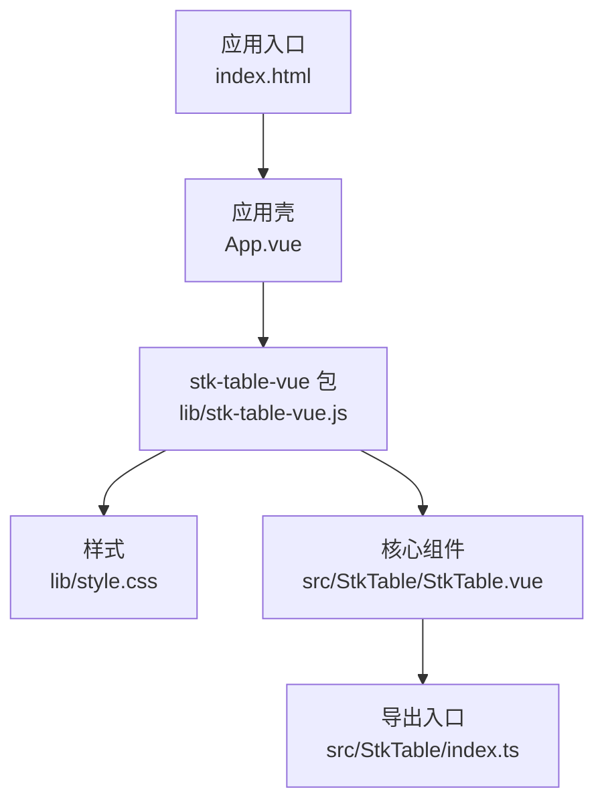
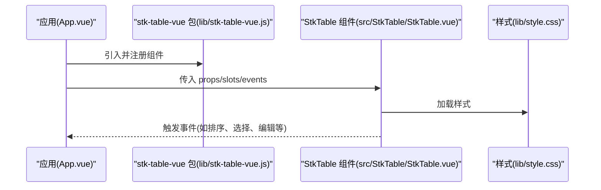
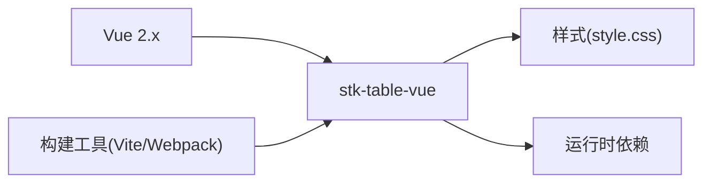

# Vue 2 集成

<cite>
**本文引用的文件**   
- [package.json](file://package.json)
- [vite.config.ts](file://vite.config.ts)
- [src/StkTable/index.ts](file://src/StkTable/index.ts)
- [src/StkTable/StkTable.vue](file://src/StkTable/StkTable.vue)
- [docs-src/main/start/vue2-usage.md](file://docs-src/main/start/vue2-usage.md)
- [docs-src/main/table/advanced/vue2-scroll-optimize.md](file://docs-src/main/table/advanced/vue2-scroll-optimize.md)
- [lib/stk-table-vue.js](file://lib/stk-table-vue.js)
- [lib/style.css](file://lib/style.css)
- [index.html](file://index.html)
- [App.vue](file://App.vue)
</cite>

## 目录
1. [简介](#简介)
2. [项目结构](#项目结构)
3. [核心组件](#核心组件)
4. [架构总览](#架构总览)
5. [详细组件分析](#详细组件分析)
6. [依赖分析](#依赖分析)
7. [性能考虑](#性能考虑)
8. [故障排查指南](#故障排查指南)
9. [结论](#结论)
10. [附录](#附录)

## 简介
本文件面向在 Vue 2 项目中集成 stk-table-vue 的开发者，提供从安装、配置到使用与优化的完整指南。内容涵盖版本兼容性、依赖管理、组件注册、Vue 2 特有的响应式数据绑定、事件处理与插槽用法差异，以及基于 Webpack/Vite 的构建配置与生产优化建议。文档同时给出常见问题的定位思路与解决方案，帮助快速落地并稳定运行。

## 项目结构
仓库采用多语言文档与示例分离的组织方式：
- docs-src：官方文档源（含 Vue 2 使用说明与高级特性）
- src：库源码（StkTable 主组件与功能模块）
- lib：打包产物（供直接引入的 UMD/CJS 包与样式）
- index.html/App.vue：本地开发入口与示例页面

图表来源 
- [index.html](file://index.html)
- [App.vue](file://App.vue)
- [lib/stk-table-vue.js](file://lib/stk-table-vue.js)
- [lib/style.css](file://lib/style.css)
- [src/StkTable/StkTable.vue](file://src/StkTable/StkTable.vue)
- [src/StkTable/index.ts](file://src/StkTable/index.ts)

章节来源
- [package.json](file://package.json)
- [vite.config.ts](file://vite.config.ts)

## 核心组件
- StkTable：表格主组件，提供列定义、排序、筛选、固定列、虚拟滚动、树形、合并单元格等能力。
- 导出入口：统一暴露组件与类型，便于按需或全局注册。

章节来源
- [src/StkTable/StkTable.vue](file://src/StkTable/StkTable.vue)
- [src/StkTable/index.ts](file://src/StkTable/index.ts)

## 架构总览
下图展示了 Vue 2 应用中引入 stk-table-vue 的典型调用链与数据流：应用通过入口引入包，注册组件后在模板中使用；表格内部根据 props 与 slots 渲染列与行，并通过事件向父组件回传交互状态。

图表来源 
- [App.vue](file://App.vue)
- [lib/stk-table-vue.js](file://lib/stk-table-vue.js)
- [src/StkTable/StkTable.vue](file://src/StkTable/StkTable.vue)
- [lib/style.css](file://lib/style.css)

## 详细组件分析

### 安装与版本兼容
- 推荐在 Vue 2 项目中使用与 Vue 2 兼容的发行版。请优先参考文档中的“Vue 2 使用说明”以获取准确的版本范围与安装命令。
- 若使用 CDN 引入，可直接引用 lib 下的脚本与样式文件。

章节来源
- [docs-src/main/start/vue2-usage.md](file://docs-src/main/start/vue2-usage.md)
- [lib/stk-table-vue.js](file://lib/stk-table-vue.js)
- [lib/style.css](file://lib/style.css)

### 依赖管理与构建工具配置
- Vite：确保 vite.config.ts 中正确解析 .vue 与 TypeScript，并按需引入样式。
- Webpack：确保 vue-loader、style-loader/css-loader 等已配置，且能正确处理 CSS 与字体资源。
- 生产环境：开启压缩、Tree Shaking 与代码分割，按需引入组件以减少体积。

章节来源
- [vite.config.ts](file://vite.config.ts)
- [package.json](file://package.json)

### 组件注册与基本用法
- 全局注册：在应用入口处引入并注册 StkTable 组件，随后在任意模板中直接使用。
- 局部注册：在单文件组件内 import 并 components 注册，避免全局污染。
- 基础列与数据：通过 columns 与 dataSource 定义列结构与数据源，即可渲染表格。

章节来源
- [src/StkTable/index.ts](file://src/StkTable/index.ts)
- [src/StkTable/StkTable.vue](file://src/StkTable/StkTable.vue)

### Vue 2 特有差异与注意事项
- 响应式数据绑定
  - 使用 data() 返回的对象作为数据源，修改数据时遵循 Vue 2 的响应式规则（数组索引更新建议使用 $set）。
  - 列定义 columns 变更时，注意 key 与唯一标识，避免不必要的重渲染。
- 事件处理
  - 使用 @event 语法绑定事件回调，回调参数由组件 emit 提供。
  - 复杂交互建议在父组件集中处理，保持子组件职责单一。
- 插槽使用
  - 支持具名插槽与作用域插槽，用于自定义单元格、头部、底部等区域。
  - 在 Vue 2 中，插槽作用域变量通过 slot-scope 或 v-slot 语法访问。

章节来源
- [docs-src/main/start/vue2-usage.md](file://docs-src/main/start/vue2-usage.md)
- [src/StkTable/StkTable.vue](file://src/StkTable/StkTable.vue)

### 高级配置与常见问题
- 滚动优化（Vue 2）
  - 大数据量场景下启用虚拟滚动，结合高度自适应与分页策略，减少 DOM 节点数量。
  - 针对浏览器滚动行为差异，可参考“Vue 2 滚动优化”说明进行调优。
- 固定列与多表头
  - 固定列需配合容器宽度与滚动容器计算，确保对齐与性能。
  - 多级表头需明确层级关系与合并规则。
- 树形与合并单元格
  - 树形数据需提供展开/收起状态与层级字段。
  - 合并单元格需保证行列跨度合法，避免布局错乱。

章节来源
- [docs-src/main/table/advanced/vue2-scroll-optimize.md](file://docs-src/main/table/advanced/vue2-scroll-optimize.md)
- [src/StkTable/StkTable.vue](file://src/StkTable/StkTable.vue)

### 构建产物与引入方式
- 包引入：通过 npm/yarn/pnpm 安装后，在代码中 import 并使用。
- CDN 引入：直接引入 lib 下的 JS 与 CSS 文件，适用于快速原型或简单页面。
- 样式引入：确保样式文件被正确加载，必要时在构建配置中排除重复注入。

章节来源
- [lib/stk-table-vue.js](file://lib/stk-table-vue.js)
- [lib/style.css](file://lib/style.css)
- [index.html](file://index.html)

## 依赖分析
- 运行时依赖
  - Vue 2.x：确保版本与组件兼容。
  - 构建工具：Vite/Webpack 需正确解析 .vue 与 TS。
- 可选依赖
  - 国际化、主题、图标库等按需引入，减少包体。
- 外部样式
  - 表格样式通过独立 CSS 文件提供，避免与业务样式冲突。

图表来源 
- [package.json](file://package.json)
- [vite.config.ts](file://vite.config.ts)
- [lib/style.css](file://lib/style.css)

章节来源
- [package.json](file://package.json)
- [vite.config.ts](file://vite.config.ts)

## 性能考虑
- 虚拟滚动：大数据集务必启用，合理设置行高与可视区域。
- 列宽与固定列：避免频繁重排，尽量静态计算列宽。
- 事件节流：高频事件（滚动、输入）做节流/防抖处理。
- 按需加载：仅引入需要的功能模块，减少首屏体积。
- 生产优化：开启压缩、Tree Shaking、CSS 提取与缓存策略。

[本节为通用指导，不直接分析具体文件]

## 故障排查指南
- 样式未生效
  - 检查样式文件是否被引入，构建配置是否正确处理 CSS。
- 事件不触发
  - 确认事件名与组件 emit 一致，父组件监听语法正确。
- 数据不更新
  - 遵循 Vue 2 响应式规则，数组更新使用 $set 或替换数组。
- 滚动异常
  - 检查容器高度与 overflow 设置，参考“Vue 2 滚动优化”说明。
- 版本不兼容
  - 核对 Vue 2 版本与组件要求，必要时降级或升级。

章节来源
- [docs-src/main/start/vue2-usage.md](file://docs-src/main/start/vue2-usage.md)
- [docs-src/main/table/advanced/vue2-scroll-optimize.md](file://docs-src/main/table/advanced/vue2-scroll-optimize.md)

## 结论
在 Vue 2 项目中集成 stk-table-vue，关键在于正确的版本选择、依赖管理与构建配置，以及遵循 Vue 2 的响应式与事件规范。通过启用虚拟滚动、按需引入与生产优化，可获得稳定且高性能的表格体验。遇到问题时，优先对照文档与本章排查要点定位原因。

[本节为总结性内容，不直接分析具体文件]

## 附录
- 快速上手清单
  - 安装依赖并注册组件
  - 配置构建工具解析 .vue 与 TS
  - 引入样式文件
  - 定义 columns 与 dataSource
  - 绑定事件与插槽
  - 启用虚拟滚动与按需加载
- 参考路径
  - Vue 2 使用说明：[docs-src/main/start/vue2-usage.md](file://docs-src/main/start/vue2-usage.md)
  - Vue 2 滚动优化：[docs-src/main/table/advanced/vue2-scroll-optimize.md](file://docs-src/main/table/advanced/vue2-scroll-optimize.md)
  - 组件导出入口：[src/StkTable/index.ts](file://src/StkTable/index.ts)
  - 主组件实现：[src/StkTable/StkTable.vue](file://src/StkTable/StkTable.vue)
  - 构建配置：[vite.config.ts](file://vite.config.ts)
  - 包与样式：[lib/stk-table-vue.js](file://lib/stk-table-vue.js), [lib/style.css](file://lib/style.css)