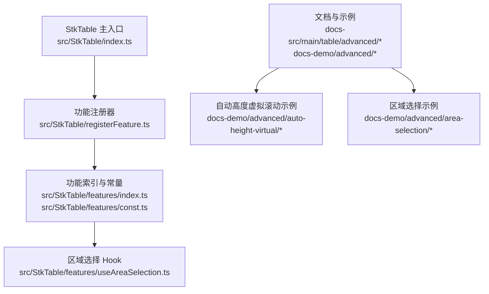
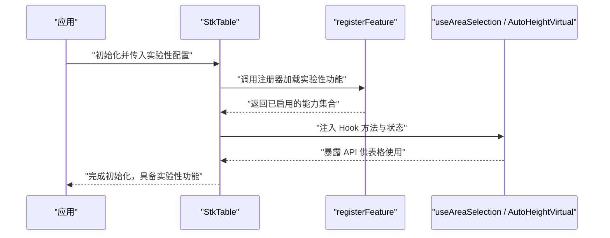
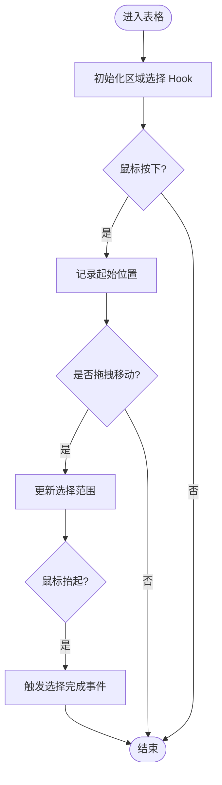
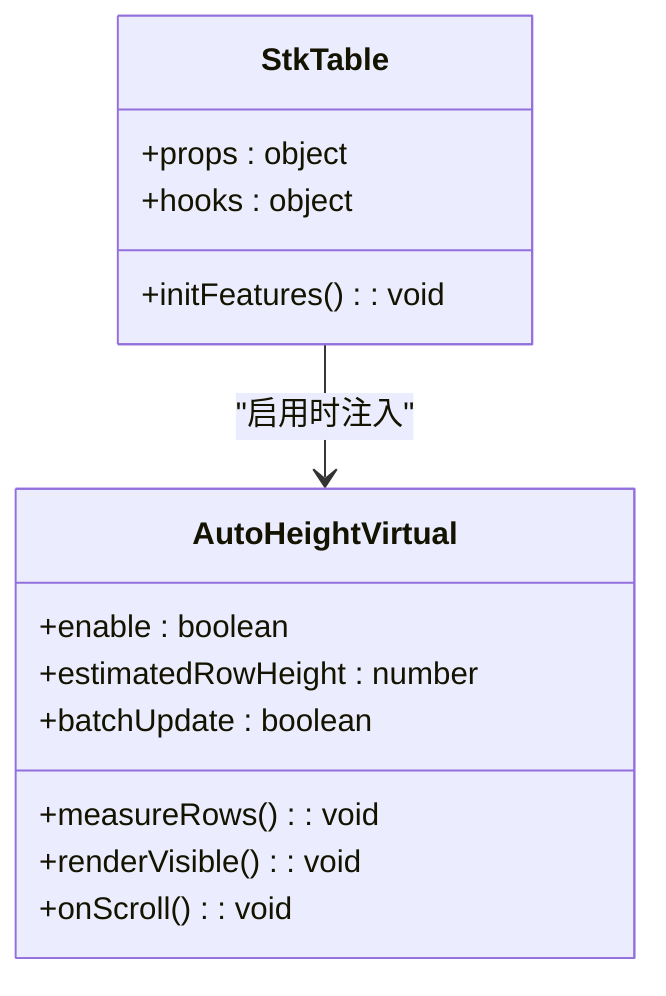
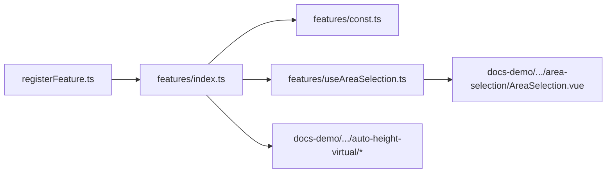

# 实验性功能

<cite>
**本文引用的文件**   
- [src/StkTable/registerFeature.ts](file://src/StkTable/registerFeature.ts)
- [src/StkTable/features/index.ts](file://src/StkTable/features/index.ts)
- [src/StkTable/features/const.ts](file://src/StkTable/features/const.ts)
- [src/StkTable/features/useAreaSelection.ts](file://src/StkTable/features/useAreaSelection.ts)
- [docs-src/main/table/advanced/auto-height-virtual.md](file://docs-src/main/table/advanced/auto-height-virtual.md)
- [docs-src/main/table/advanced/area-selection.md](file://docs-src/main/table/advanced/area-selection.md)
- [docs-demo/advanced/auto-height-virtual/AutoHeightVirtual/index.vue](file://docs-demo/advanced/auto-height-virtual/AutoHeightVirtual/index.vue)
- [docs-demo/advanced/auto-height-virtual/AutoHeightVirtual/types.ts](file://docs-demo/advanced/auto-height-virtual/AutoHeightVirtual/types.ts)
- [docs-demo/advanced/auto-height-virtual/PretextAutoHeight/index.vue](file://docs-demo/advanced/auto-height-virtual/PretextAutoHeight/index.vue)
- [docs-demo/advanced/auto-height-virtual/PretextAutoHeight/types.ts](file://docs-demo/advanced/auto-height-virtual/PretextAutoHeight/types.ts)
- [docs-demo/advanced/area-selection/AreaSelection.vue](file://docs-demo/advanced/area-selection/AreaSelection.vue)
- [docs-src/main/other/experimental.md](file://docs-src/main/other/experimental.md)
</cite>

## 目录
1. [简介](#简介)
2. [项目结构](#项目结构)
3. [核心组件与能力](#核心组件与能力)
4. [架构总览](#架构总览)
5. [详细组件分析](#详细组件分析)
6. [依赖关系分析](#依赖关系分析)
7. [性能考量](#性能考量)
8. [故障排查指南](#故障排查指南)
9. [结论](#结论)
10. [附录：API 参考与配置选项](#附录api-参考与配置选项)

## 简介
本章节面向 stk-table-vue 的实验性功能，说明如何启用和配置这些特性（包括全局配置与按需启用），并介绍当前可用的实验性功能（如区域选择、自动高度虚拟滚动等）的使用方法、API 参考、使用限制、已知问题与潜在风险，以及从实验性功能迁移到稳定版本的指导。同时提供贡献指南，帮助开发者测试与反馈问题。

## 项目结构
stk-table-vue 将实验性功能以“插件化”的方式组织在 features 目录中，并通过统一的注册机制进行加载与管理。文档与示例分别位于 docs-src 与 docs-demo 目录，便于查阅与演示。

图表来源
- [src/StkTable/registerFeature.ts](file://src/StkTable/registerFeature.ts)
- [src/StkTable/features/index.ts](file://src/StkTable/features/index.ts)
- [src/StkTable/features/const.ts](file://src/StkTable/features/const.ts)
- [src/StkTable/features/useAreaSelection.ts](file://src/StkTable/features/useAreaSelection.ts)
- [docs-src/main/table/advanced/auto-height-virtual.md](file://docs-src/main/table/advanced/auto-height-virtual.md)
- [docs-src/main/table/advanced/area-selection.md](file://docs-src/main/table/advanced/area-selection.md)
- [docs-demo/advanced/auto-height-virtual/AutoHeightVirtual/index.vue](file://docs-demo/advanced/auto-height-virtual/AutoHeightVirtual/index.vue)
- [docs-demo/advanced/auto-height-virtual/PretextAutoHeight/index.vue](file://docs-demo/advanced/auto-height-virtual/PretextAutoHeight/index.vue)
- [docs-demo/advanced/area-selection/AreaSelection.vue](file://docs-demo/advanced/area-selection/AreaSelection.vue)

章节来源
- [src/StkTable/registerFeature.ts](file://src/StkTable/registerFeature.ts)
- [src/StkTable/features/index.ts](file://src/StkTable/features/index.ts)
- [src/StkTable/features/const.ts](file://src/StkTable/features/const.ts)
- [src/StkTable/features/useAreaSelection.ts](file://src/StkTable/features/useAreaSelection.ts)
- [docs-src/main/table/advanced/auto-height-virtual.md](file://docs-src/main/table/advanced/auto-height-virtual.md)
- [docs-src/main/table/advanced/area-selection.md](file://docs-src/main/table/advanced/area-selection.md)
- [docs-demo/advanced/auto-height-virtual/AutoHeightVirtual/index.vue](file://docs-demo/advanced/auto-height-virtual/AutoHeightVirtual/index.vue)
- [docs-demo/advanced/auto-height-virtual/PretextAutoHeight/index.vue](file://docs-demo/advanced/auto-height-virtual/PretextAutoHeight/index.vue)
- [docs-demo/advanced/area-selection/AreaSelection.vue](file://docs-demo/advanced/area-selection/AreaSelection.vue)

## 核心组件与能力
- 区域选择（Area Selection）：通过 Hook 暴露交互逻辑，支持鼠标拖拽或按键组合实现单元格区域选择。
- 自动高度虚拟滚动（Auto Height Virtual）：根据内容自适应行高并进行虚拟渲染，提升大数据量下的滚动性能。
- 其他实验性能力：可通过 registerFeature 扩展新的能力，保持与主表格的解耦与可插拔。

章节来源
- [src/StkTable/features/useAreaSelection.ts](file://src/StkTable/features/useAreaSelection.ts)
- [docs-src/main/table/advanced/auto-height-virtual.md](file://docs-src/main/table/advanced/auto-height-virtual.md)
- [docs-src/main/table/advanced/area-selection.md](file://docs-src/main/table/advanced/area-selection.md)

## 架构总览
实验性功能采用“注册 + Hook”的架构模式：
- 注册器负责统一注册与生命周期管理；
- 各功能以 Hook 形式提供状态与行为；
- 文档与示例驱动使用方式与最佳实践。

图表来源
- [src/StkTable/registerFeature.ts](file://src/StkTable/registerFeature.ts)
- [src/StkTable/features/index.ts](file://src/StkTable/features/index.ts)
- [src/StkTable/features/useAreaSelection.ts](file://src/StkTable/features/useAreaSelection.ts)

## 详细组件分析

### 区域选择（Area Selection）
区域选择通过 useAreaSelection Hook 提供交互能力，典型用法包括：
- 启用开关：在表格配置中开启区域选择能力；
- 事件回调：监听选择开始、结束、更新等事件；
- 数据绑定：获取选中行列范围及对应数据；
- 键盘辅助：结合 Shift/Ctrl 等键实现多选或扩展选择。

图表来源
- [src/StkTable/features/useAreaSelection.ts](file://src/StkTable/features/useAreaSelection.ts)
- [docs-demo/advanced/area-selection/AreaSelection.vue](file://docs-demo/advanced/area-selection/AreaSelection.vue)

章节来源
- [src/StkTable/features/useAreaSelection.ts](file://src/StkTable/features/useAreaSelection.ts)
- [docs-src/main/table/advanced/area-selection.md](file://docs-src/main/table/advanced/area-selection.md)
- [docs-demo/advanced/area-selection/AreaSelection.vue](file://docs-demo/advanced/area-selection/AreaSelection.vue)

### 自动高度虚拟滚动（Auto Height Virtual）
自动高度虚拟滚动针对行高不固定的场景，动态测量行高并进行虚拟渲染，关键要点：
- 启用方式：在表格配置中开启自动高度虚拟滚动；
- 性能优化：合理设置预估行高、批处理更新；
- 兼容性：注意嵌套滚动容器与固定列的协同；
- 示例参考：查看 AutoHeightVirtual 与 PretextAutoHeight 两个示例。

图表来源
- [docs-demo/advanced/auto-height-virtual/AutoHeightVirtual/index.vue](file://docs-demo/advanced/auto-height-virtual/AutoHeightVirtual/index.vue)
- [docs-demo/advanced/auto-height-virtual/AutoHeightVirtual/types.ts](file://docs-demo/advanced/auto-height-virtual/AutoHeightVirtual/types.ts)
- [docs-demo/advanced/auto-height-virtual/PretextAutoHeight/index.vue](file://docs-demo/advanced/auto-height-virtual/PretextAutoHeight/index.vue)
- [docs-demo/advanced/auto-height-virtual/PretextAutoHeight/types.ts](file://docs-demo/advanced/auto-height-virtual/PretextAutoHeight/types.ts)
- [docs-src/main/table/advanced/auto-height-virtual.md](file://docs-src/main/table/advanced/auto-height-virtual.md)

章节来源
- [docs-src/main/table/advanced/auto-height-virtual.md](file://docs-src/main/table/advanced/auto-height-virtual.md)
- [docs-demo/advanced/auto-height-virtual/AutoHeightVirtual/index.vue](file://docs-demo/advanced/auto-height-virtual/AutoHeightVirtual/index.vue)
- [docs-demo/advanced/auto-height-virtual/AutoHeightVirtual/types.ts](file://docs-demo/advanced/auto-height-virtual/AutoHeightVirtual/types.ts)
- [docs-demo/advanced/auto-height-virtual/PretextAutoHeight/index.vue](file://docs-demo/advanced/auto-height-virtual/PretextAutoHeight/index.vue)
- [docs-demo/advanced/auto-height-virtual/PretextAutoHeight/types.ts](file://docs-demo/advanced/auto-height-virtual/PretextAutoHeight/types.ts)

## 依赖关系分析
实验性功能通过 registerFeature 统一注册，避免与主表格强耦合。useAreaSelection 作为独立 Hook，仅依赖必要的 DOM 事件与状态管理。

图表来源
- [src/StkTable/registerFeature.ts](file://src/StkTable/registerFeature.ts)
- [src/StkTable/features/index.ts](file://src/StkTable/features/index.ts)
- [src/StkTable/features/const.ts](file://src/StkTable/features/const.ts)
- [src/StkTable/features/useAreaSelection.ts](file://src/StkTable/features/useAreaSelection.ts)
- [docs-demo/advanced/area-selection/AreaSelection.vue](file://docs-demo/advanced/area-selection/AreaSelection.vue)
- [docs-demo/advanced/auto-height-virtual/AutoHeightVirtual/index.vue](file://docs-demo/advanced/auto-height-virtual/AutoHeightVirtual/index.vue)

章节来源
- [src/StkTable/registerFeature.ts](file://src/StkTable/registerFeature.ts)
- [src/StkTable/features/index.ts](file://src/StkTable/features/index.ts)
- [src/StkTable/features/const.ts](file://src/StkTable/features/const.ts)
- [src/StkTable/features/useAreaSelection.ts](file://src/StkTable/features/useAreaSelection.ts)

## 性能考量
- 区域选择：避免频繁重排，批量更新选择范围；在大数据集上建议限制单次操作的数据量。
- 自动高度虚拟滚动：合理设置预估行高以减少测量次数；开启批处理更新以降低渲染压力；注意滚动容器的尺寸变化对测量精度的影响。
- 资源占用：实验性功能可能引入额外内存与计算开销，建议在开发环境充分验证后再在生产环境启用。

[本节为通用性能建议，不直接分析具体文件]

## 故障排查指南
- 区域选择无效：检查是否正确启用 Hook，确认事件绑定与阻止默认行为；核对选择范围计算逻辑。
- 自动高度虚拟滚动异常：检查预估行高与实际行高的差异；确认滚动容器尺寸与定位样式；观察是否存在嵌套滚动导致的冲突。
- 日志与调试：在开发模式下输出关键状态变化，逐步定位问题。

章节来源
- [docs-src/main/other/experimental.md](file://docs-src/main/other/experimental.md)

## 结论
stk-table-vue 的实验性功能以插件化与 Hook 为核心，提供了区域选择与自动高度虚拟滚动等能力。通过统一的注册机制与清晰的文档示例，开发者可以快速集成与扩展。建议在充分测试后谨慎在生产环境启用，并遵循迁移指南逐步过渡到稳定版本。

[本节为总结性内容，不直接分析具体文件]

## 附录：API 参考与配置选项
- 启用方式
  - 全局配置：在表格初始化时传入实验性功能开关，统一启用所需能力。
  - 按需启用：在需要的位置单独启用特定功能，减少不必要的开销。
- 区域选择 API
  - 启用开关：在配置中开启区域选择；
  - 事件回调：选择开始、结束、更新等事件；
  - 数据访问：获取选中行列范围与数据；
  - 键盘辅助：Shift/Ctrl 等多选与扩展选择。
- 自动高度虚拟滚动 API
  - 启用开关：在配置中开启自动高度虚拟滚动；
  - 预估行高：设置合理的预估行高以提升性能；
  - 批处理更新：开启批处理以减少渲染压力；
  - 滚动适配：处理滚动容器尺寸变化与固定列协同。
- 使用限制与已知问题
  - 区域选择：在超大数据集上可能出现性能瓶颈；与某些自定义单元格可能存在兼容性问题。
  - 自动高度虚拟滚动：行高变化频繁时可能导致闪烁或错位；需关注滚动容器样式与布局。
- 迁移指导
  - 从实验性功能迁移至稳定版本：优先替换不稳定 API，逐步收敛到稳定接口；保留回滚方案以便快速恢复。
- 贡献指南
  - 测试方法：在 docs-demo 中添加用例，覆盖边界条件与异常路径；
  - 反馈问题：提交最小可复现示例与日志信息，便于定位与修复。

章节来源
- [docs-src/main/other/experimental.md](file://docs-src/main/other/experimental.md)
- [docs-src/main/table/advanced/area-selection.md](file://docs-src/main/table/advanced/area-selection.md)
- [docs-src/main/table/advanced/auto-height-virtual.md](file://docs-src/main/table/advanced/auto-height-virtual.md)
- [src/StkTable/registerFeature.ts](file://src/StkTable/registerFeature.ts)
- [src/StkTable/features/index.ts](file://src/StkTable/features/index.ts)
- [src/StkTable/features/const.ts](file://src/StkTable/features/const.ts)
- [src/StkTable/features/useAreaSelection.ts](file://src/StkTable/features/useAreaSelection.ts)
- [docs-demo/advanced/area-selection/AreaSelection.vue](file://docs-demo/advanced/area-selection/AreaSelection.vue)
- [docs-demo/advanced/auto-height-virtual/AutoHeightVirtual/index.vue](file://docs-demo/advanced/auto-height-virtual/AutoHeightVirtual/index.vue)
- [docs-demo/advanced/auto-height-virtual/PretextAutoHeight/index.vue](file://docs-demo/advanced/auto-height-virtual/PretextAutoHeight/index.vue)