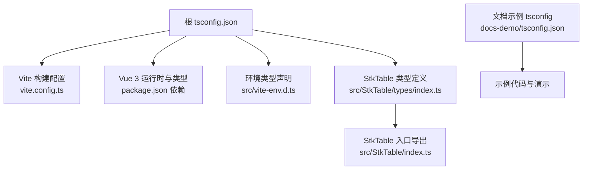
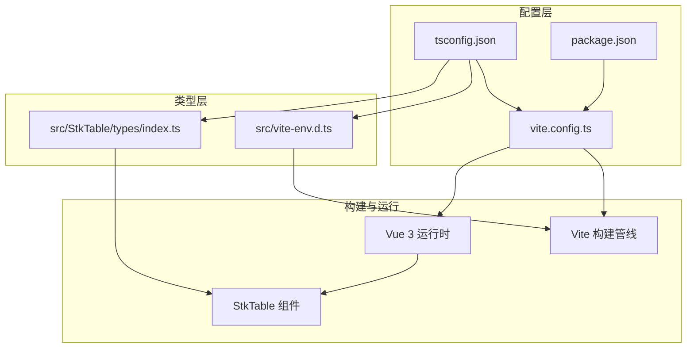
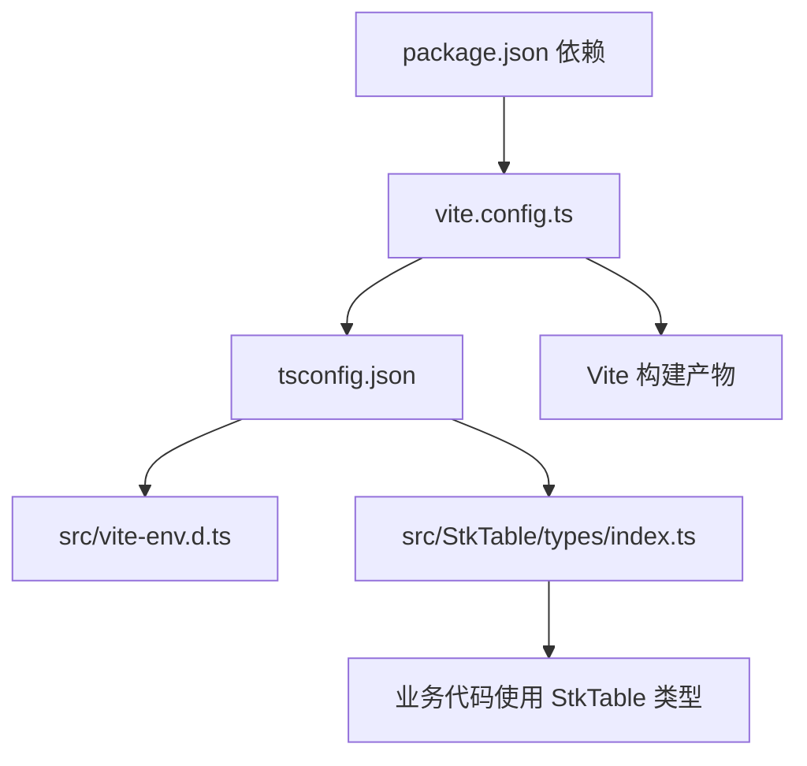

# TypeScript 配置

<cite>
**本文引用的文件**   
- [tsconfig.json](file://tsconfig.json)
- [vite.config.ts](file://vite.config.ts)
- [package.json](file://package.json)
- [src/vite-env.d.ts](file://src/vite-env.d.ts)
- [src/StkTable/index.ts](file://src/StkTable/index.ts)
- [src/StkTable/types/index.ts](file://src/StkTable/types/index.ts)
- [docs-demo/tsconfig.json](file://docs-demo/tsconfig.json)
</cite>

## 目录
1. [简介](#简介)
2. [项目结构](#项目结构)
3. [核心组件](#核心组件)
4. [架构总览](#架构总览)
5. [详细组件分析](#详细组件分析)
6. [依赖分析](#依赖分析)
7. [性能考虑](#性能考虑)
8. [故障排查指南](#故障排查指南)
9. [结论](#结论)
10. [附录](#附录)

## 简介
本指南面向 stk-table-vue 项目的 TypeScript 配置与使用，重点围绕 tsconfig.json 的关键选项（编译目标、模块解析、路径映射、类型检查等），类型声明文件的组织方式，第三方库的类型支持策略，以及与 Vue 3 的集成（单文件组件类型支持、组合式 API 类型推断）。同时提供类型安全的最佳实践与常见问题解决方案，帮助你在开发与维护过程中获得更稳定的类型体验。

## 项目结构
本项目采用 Vite + Vue 3 的工程化方案，TypeScript 配置集中在根目录 tsconfig.json，并在文档示例子项目中通过独立的 tsconfig.json 进行差异化配置。Vite 通过 vite.config.ts 管理构建与插件，package.json 定义依赖与脚本。类型声明文件位于 src/vite-env.d.ts，用于扩展全局命名空间与模块声明。StkTable 组件的类型定义集中在 src/StkTable/types/index.ts，并通过入口 index.ts 统一导出。

图表来源
- [tsconfig.json](file://tsconfig.json)
- [vite.config.ts](file://vite.config.ts)
- [package.json](file://package.json)
- [src/vite-env.d.ts](file://src/vite-env.d.ts)
- [src/StkTable/types/index.ts](file://src/StkTable/types/index.ts)
- [src/StkTable/index.ts](file://src/StkTable/index.ts)
- [docs-demo/tsconfig.json](file://docs-demo/tsconfig.json)

章节来源
- [tsconfig.json](file://tsconfig.json)
- [vite.config.ts](file://vite.config.ts)
- [package.json](file://package.json)
- [src/vite-env.d.ts](file://src/vite-env.d.ts)
- [src/StkTable/types/index.ts](file://src/StkTable/types/index.ts)
- [src/StkTable/index.ts](file://src/StkTable/index.ts)
- [docs-demo/tsconfig.json](file://docs-demo/tsconfig.json)

## 核心组件
- 根 tsconfig.json：集中管理编译目标、模块系统、路径别名、严格模式、排除目录等关键选项，确保全项目一致的 TS 行为。
- Vite 配置：与 TS 协同工作，处理 .vue 单文件组件、TS 转译、插件链（如 @vitejs/plugin-vue）以及类型感知。
- 类型声明与环境：src/vite-env.d.ts 为 Vite 注入的全局变量与模块提供类型，避免未声明标识符报错。
- StkTable 类型体系：在 types/index.ts 中定义表格列、数据行、事件、插槽等类型，并通过 index.ts 暴露给外部使用。
- 文档示例 tsconfig：docs-demo/tsconfig.json 针对演示场景调整编译与解析策略，便于独立运行与类型检查。

章节来源
- [tsconfig.json](file://tsconfig.json)
- [vite.config.ts](file://vite.config.ts)
- [src/vite-env.d.ts](file://src/vite-env.d.ts)
- [src/StkTable/types/index.ts](file://src/StkTable/types/index.ts)
- [src/StkTable/index.ts](file://src/StkTable/index.ts)
- [docs-demo/tsconfig.json](file://docs-demo/tsconfig.json)

## 架构总览
下图展示了 TypeScript 在项目中的角色与交互关系：tsconfig.json 驱动编译器与 IDE 类型检查；Vite 在构建时利用 TS 能力并配合 Vue 插件处理 SFC；类型声明文件扩展全局与模块类型；StkTable 的类型定义被业务代码引用，形成从配置到类型再到组件的完整链路。

图表来源
- [tsconfig.json](file://tsconfig.json)
- [vite.config.ts](file://vite.config.ts)
- [package.json](file://package.json)
- [src/vite-env.d.ts](file://src/vite-env.d.ts)
- [src/StkTable/types/index.ts](file://src/StkTable/types/index.ts)

## 详细组件分析

### tsconfig.json 关键配置项说明
- 编译目标与模块系统
  - target：指定输出 JavaScript 版本，影响语言特性降级与内置对象可用性。
  - module：选择模块系统（如 ESNext/ES2020/CommonJS），需与 Vite 和运行环境一致。
  - moduleResolution：模块解析策略（Node/Bundler），推荐 Bundler 以适配 Vite。
  - jsx/jsxFactory/jsxFragment：若使用 JSX 或 Vue SFC，需与 Vite 插件保持一致。
- 路径映射与别名
  - paths：定义路径别名（如 @/ 指向 src），提升导入可读性与可维护性。
  - baseUrl：配合 paths 使用，确定相对基准目录。
- 类型检查规则
  - strict：开启严格模式，包含 noImplicitAny、strictNullChecks 等，提高类型安全。
  - esModuleInterop：兼容 CommonJS/ESM 混用，减少导入差异。
  - skipLibCheck：跳过第三方库类型检查，加速构建（谨慎使用）。
  - noEmit：仅做类型检查不生成 JS（与 Vite 构建分离）。
  - include/exclude：控制参与类型检查的文件范围，避免无关文件干扰。
- 与 Vite/Vue 的协同
  - 确保 moduleResolution 与 Vite 的解析策略一致。
  - 若启用 noEmit，IDE 仍可进行类型检查与补全。
  - 保持 target/module 与浏览器/Node 运行环境匹配。

章节来源
- [tsconfig.json](file://tsconfig.json)

### 类型声明文件与环境扩展
- src/vite-env.d.ts：为 Vite 注入的全局变量（如 import.meta.env.*）提供类型，避免未声明错误。
- 自定义模块声明：对于无类型的第三方库，可在 d.ts 文件中声明模块接口，保证类型安全。
- 建议将环境相关类型与业务类型分离，便于维护与复用。

章节来源
- [src/vite-env.d.ts](file://src/vite-env.d.ts)

### StkTable 类型体系与导出
- src/StkTable/types/index.ts：集中定义表格列、数据行、事件、插槽、排序、合并单元格等类型，确保组件 API 的类型一致性。
- src/StkTable/index.ts：统一导出 StkTable 组件及其类型，供外部引用，简化依赖管理。
- 建议在业务代码中优先使用这些类型，避免重复定义与不一致。

章节来源
- [src/StkTable/types/index.ts](file://src/StkTable/types/index.ts)
- [src/StkTable/index.ts](file://src/StkTable/index.ts)

### 文档示例 tsconfig 的差异
- docs-demo/tsconfig.json：针对演示场景调整编译目标、模块解析与路径映射，确保示例代码可独立运行与类型检查。
- 通常关闭严格模式或放宽某些规则，以提升示例的可读性与易用性。

章节来源
- [docs-demo/tsconfig.json](file://docs-demo/tsconfig.json)

### 与 Vue 3 的集成配置
- 单文件组件类型支持：Vite 通过 @vitejs/plugin-vue 处理 .vue 文件，tsconfig 需与之协同（jsx/jsxFactory 等）。
- 组合式 API 类型推断：确保 strict 模式开启，充分利用 TS 对 ref、reactive、computed 等的推断能力。
- 模板类型检查：Vite + Vue 插件链会结合 tsconfig 进行模板类型检查，确保模板表达式与组件 props/events 类型一致。

章节来源
- [vite.config.ts](file://vite.config.ts)
- [tsconfig.json](file://tsconfig.json)

## 依赖分析
- package.json：定义 TypeScript、Vite、Vue 及相关插件的版本依赖，确保类型与构建工具链一致。
- Vite 构建管线：读取 tsconfig.json 与 vite.config.ts，协调 TS 转译、SFC 处理与插件链。
- 类型依赖：@types/* 包提供第三方库的类型定义，若无对应包则需自行声明。

图表来源
- [package.json](file://package.json)
- [vite.config.ts](file://vite.config.ts)
- [tsconfig.json](file://tsconfig.json)
- [src/vite-env.d.ts](file://src/vite-env.d.ts)
- [src/StkTable/types/index.ts](file://src/StkTable/types/index.ts)

章节来源
- [package.json](file://package.json)
- [vite.config.ts](file://vite.config.ts)
- [tsconfig.json](file://tsconfig.json)

## 性能考虑
- 合理设置 include/exclude：仅纳入必要文件，减少类型检查范围。
- 使用 skipLibCheck：在大型项目中跳过第三方库类型检查，缩短构建时间。
- 避免过高的 target：根据目标浏览器选择合适版本，避免不必要的降级。
- 分离开发/生产配置：通过不同 tsconfig 或环境变量优化开发体验与构建速度。

[本节为通用指导，无需具体文件引用]

## 故障排查指南
- 模块解析失败
  - 检查 moduleResolution 是否与 Vite 一致（Bundler/Node）。
  - 确认 paths 与 baseUrl 配置正确，且路径存在。
- 未声明标识符
  - 确保 src/vite-env.d.ts 已包含所需全局变量类型。
  - 对于无类型第三方库，添加模块声明文件。
- 模板类型错误
  - 检查组件 props/events 类型定义是否完整。
  - 确保 strict 模式开启以获得更好的推断。
- 构建缓慢
  - 启用 skipLibCheck，缩小 include 范围。
  - 避免在 include 中包含测试或临时文件。

章节来源
- [tsconfig.json](file://tsconfig.json)
- [src/vite-env.d.ts](file://src/vite-env.d.ts)
- [src/StkTable/types/index.ts](file://src/StkTable/types/index.ts)

## 结论
通过合理的 tsconfig.json 配置、类型声明文件组织以及与 Vite/Vue 3 的良好集成，stk-table-vue 项目能够在类型安全、开发体验与构建性能之间取得平衡。遵循本文的最佳实践与故障排查建议，可有效减少类型问题，提升代码质量与维护效率。

[本节为总结性内容，无需具体文件引用]

## 附录
- 常见类型问题与解决方案
  - any 滥用：尽量使用 unknown 或泛型，逐步收窄类型。
  - 空值处理：启用 strictNullChecks，显式处理 null/undefined。
  - 第三方库无类型：创建 d.ts 文件声明必要接口，或使用 @ts-ignore 谨慎绕过。
  - 模板与逻辑类型不一致：统一使用组件导出的类型，避免重复定义。
- 推荐工具
  - IDE：VS Code + Vue 插件，获得最佳类型提示与诊断。
  - 命令行：tsc --noEmit 进行纯类型检查，vitest 进行单元测试类型验证。

[本节为补充信息，无需具体文件引用]