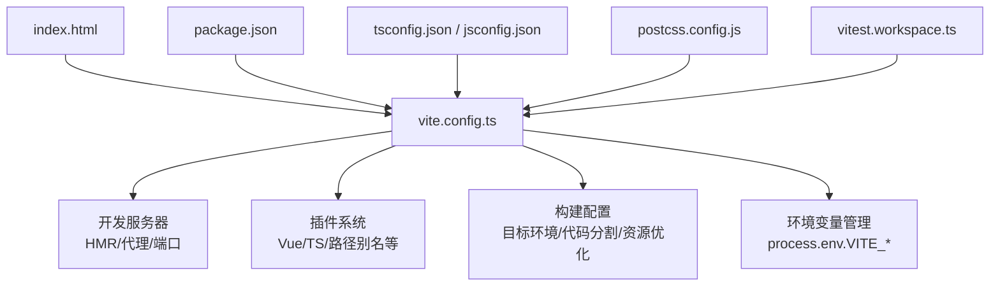
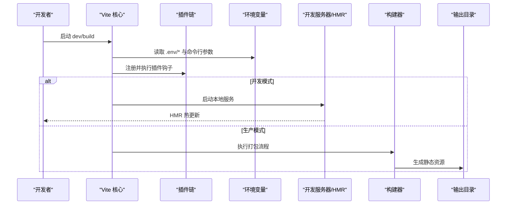
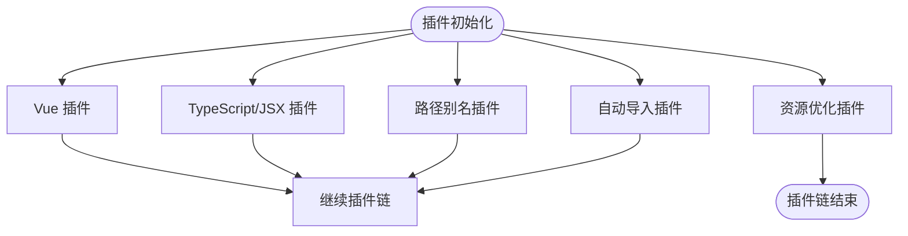
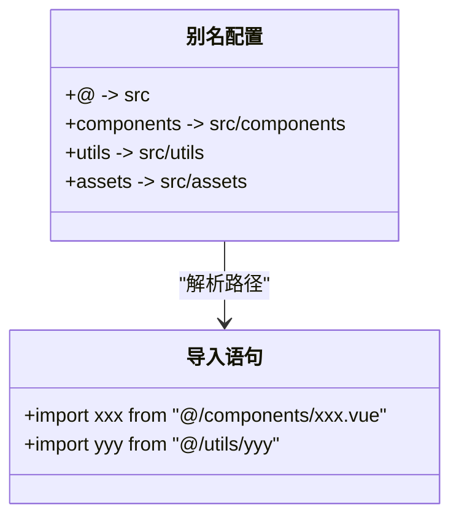
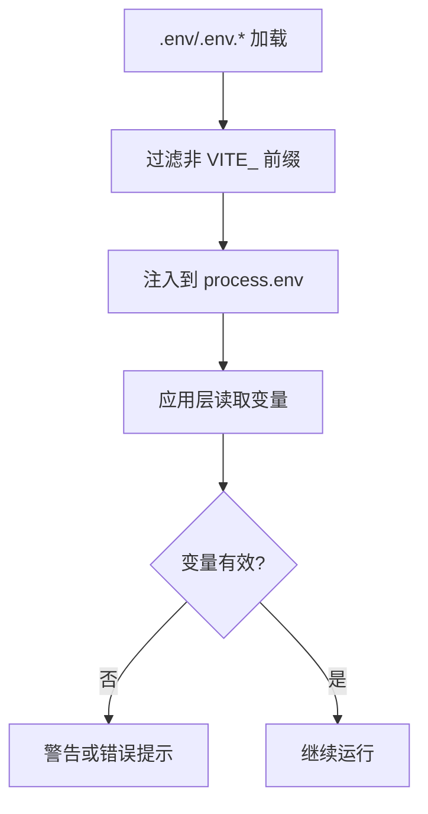
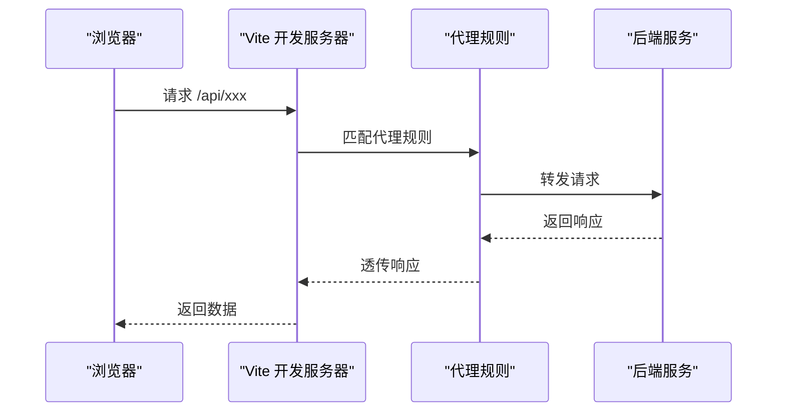
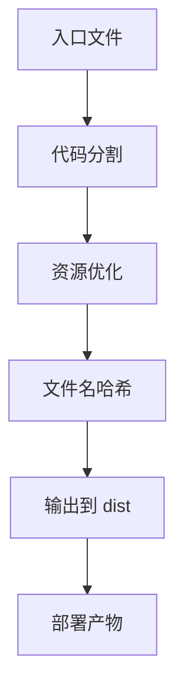
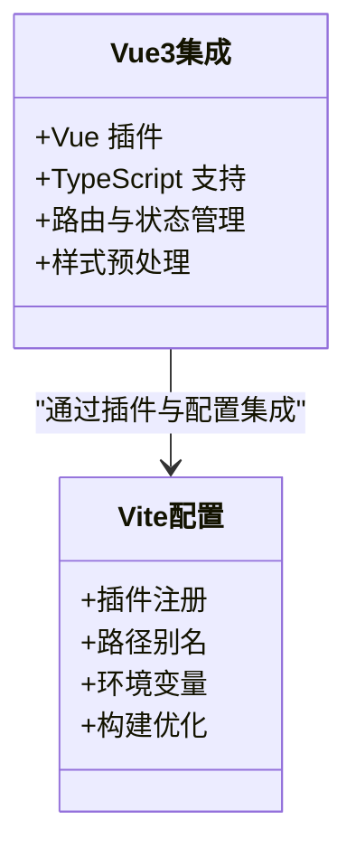
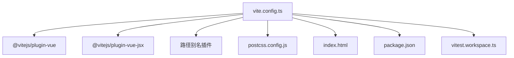

# Vite 配置

<cite>
**本文引用的文件**   
- [vite.config.ts](file://vite.config.ts)
- [package.json](file://package.json)
- [index.html](file://index.html)
- [tsconfig.json](file://tsconfig.json)
- [jsconfig.json](file://jsconfig.json)
- [postcss.config.js](file://postcss.config.js)
- [vitest.workspace.ts](file://vitest.workspace.ts)
</cite>

## 目录
1. [简介](#简介)
2. [项目结构](#项目结构)
3. [核心组件](#核心组件)
4. [架构总览](#架构总览)
5. [详细组件分析](#详细组件分析)
6. [依赖分析](#依赖分析)
7. [性能考虑](#性能考虑)
8. [故障排查指南](#故障排查指南)
9. [结论](#结论)
10. [附录](#附录)

## 简介
本文件面向 stk-table-vue 项目的 Vite 构建与开发体验，系统性说明 vite.config.ts 中的关键配置项与实践建议，涵盖插件、别名、环境变量、开发服务器与代理、热重载、生产构建优化（代码分割、资源优化、输出目录）、与 Vue 3 的集成方式，以及常见问题定位与解决方案。文档力求兼顾初学者与有经验的开发者，提供可操作的指导与图示化的流程说明。

## 项目结构
stk-table-vue 采用典型的现代前端工程化结构：Vite 作为构建与开发工具，Vue 3 作为 UI 框架，TypeScript/JavaScript 混合使用，PostCSS 处理样式，Vitest 负责测试。根目录下的 vite.config.ts 是构建与开发的核心入口，配合 package.json、HTML 模板、TS/JS 配置与 PostCSS 配置共同完成从源码到产物的完整链路。

图表来源
- [vite.config.ts](file://vite.config.ts)
- [package.json](file://package.json)
- [index.html](file://index.html)
- [tsconfig.json](file://tsconfig.json)
- [jsconfig.json](file://jsconfig.json)
- [postcss.config.js](file://postcss.config.js)
- [vitest.workspace.ts](file://vitest.workspace.ts)

章节来源
- [vite.config.ts](file://vite.config.ts)
- [package.json](file://package.json)
- [index.html](file://index.html)
- [tsconfig.json](file://tsconfig.json)
- [jsconfig.json](file://jsconfig.json)
- [postcss.config.js](file://postcss.config.js)
- [vitest.workspace.ts](file://vitest.workspace.ts)

## 核心组件
本节聚焦 vite.config.ts 的关键模块与职责划分，帮助快速理解配置的组织方式与扩展点。

- 插件配置
  - Vue 插件：用于解析 .vue 单文件组件、模板编译、脚本与样式处理。
  - TypeScript/JSX 插件：类型检查与语法支持。
  - 路径别名：统一导入路径，提升可读性与跨平台兼容性。
  - 其他常用插件：如自动导入、按需加载、压缩、图片处理等（按项目需要启用）。

- 别名设置
  - @ 指向 src 目录，便于模块化组织与引用。
  - 可选为第三方库或公共模块设置别名，减少重复路径。

- 环境变量管理
  - 通过 process.env.VITE_ 前缀暴露给客户端。
  - 区分开发、测试、生产环境，避免敏感信息泄露。

- 构建优化
  - 目标环境：指定浏览器兼容范围，控制 polyfill 与语法降级。
  - 代码分割：按路由或功能模块拆分，提升首屏加载速度。
  - 资源优化：图片、字体等资源压缩与缓存策略。
  - 输出目录：自定义 dist 目录结构与文件名哈希策略。

- 开发服务器与代理
  - 端口、主机、HTTPS、Open 行为。
  - 代理转发后端接口，解决跨域问题。
  - HMR 热重载：保持状态、增量更新，提升开发效率。

章节来源
- [vite.config.ts](file://vite.config.ts)

## 架构总览
下图展示了 Vite 在 stk-table-vue 中的整体工作流：从源码与模板出发，经过插件链处理、环境变量注入、开发与构建两个阶段，最终产出静态资源并部署。

图表来源
- [vite.config.ts](file://vite.config.ts)
- [package.json](file://package.json)
- [index.html](file://index.html)

## 详细组件分析

### 插件配置
- Vue 插件：解析 .vue 文件，支持组合式 API、模板编译、样式预处理。
- TypeScript/JSX 插件：确保类型安全与 JSX/TSX 语法支持。
- 路径别名插件：将 @ 映射到 src，简化导入。
- 按需加载与自动导入：减少包体积，提高加载性能。
- 压缩与资源处理：对 JS/CSS/图片等进行压缩与优化。

图表来源
- [vite.config.ts](file://vite.config.ts)

章节来源
- [vite.config.ts](file://vite.config.ts)

### 别名设置
- 默认将 @ 指向 src 目录，便于统一导入风格。
- 可为特定模块设置别名，例如将 components、utils、assets 等映射到短路径。
- 注意与 tsconfig.json 的 paths 保持一致，避免 IDE 与构建不一致。

图表来源
- [vite.config.ts](file://vite.config.ts)
- [tsconfig.json](file://tsconfig.json)
- [jsconfig.json](file://jsconfig.json)

章节来源
- [vite.config.ts](file://vite.config.ts)
- [tsconfig.json](file://tsconfig.json)
- [jsconfig.json](file://jsconfig.json)

### 环境变量管理
- 客户端可见变量需以 VITE_ 开头，通过 process.env 访问。
- 支持 .env、.env.development、.env.production 等多环境文件。
- 建议在开发时隔离敏感信息，生产构建时仅包含必要变量。

图表来源
- [vite.config.ts](file://vite.config.ts)
- [package.json](file://package.json)

章节来源
- [vite.config.ts](file://vite.config.ts)
- [package.json](file://package.json)

### 开发服务器与代理
- 端口与主机：自定义监听端口与主机名，支持 HTTPS。
- 代理转发：将 API 请求转发至后端服务，解决跨域。
- HMR：增量更新，保持组件状态，提升开发效率。

图表来源
- [vite.config.ts](file://vite.config.ts)

章节来源
- [vite.config.ts](file://vite.config.ts)

### 生产构建配置
- 目标环境：根据浏览器兼容性选择 ES 版本与 polyfill。
- 代码分割：按路由或功能模块拆分，减少首屏体积。
- 资源优化：压缩 JS/CSS，图片与字体优化，缓存策略。
- 输出目录：自定义 dist 目录结构与文件名哈希。

图表来源
- [vite.config.ts](file://vite.config.ts)
- [package.json](file://package.json)

章节来源
- [vite.config.ts](file://vite.config.ts)
- [package.json](file://package.json)

### 与 Vue 3 的集成配置
- 启用 Vue 插件以支持 .vue 单文件组件。
- 配置 TypeScript 与 JSX/TSX 支持。
- 结合路由与状态管理插件（如 Vue Router、Pinia）进行按需加载。
- 样式预处理（Less/Sass）与 CSS 变量支持。

图表来源
- [vite.config.ts](file://vite.config.ts)
- [package.json](file://package.json)

章节来源
- [vite.config.ts](file://vite.config.ts)
- [package.json](file://package.json)

## 依赖分析
Vite 在 stk-table-vue 中依赖以下核心模块与配置文件：

图表来源
- [vite.config.ts](file://vite.config.ts)
- [postcss.config.js](file://postcss.config.js)
- [index.html](file://index.html)
- [package.json](file://package.json)
- [vitest.workspace.ts](file://vitest.workspace.ts)

章节来源
- [vite.config.ts](file://vite.config.ts)
- [postcss.config.js](file://postcss.config.js)
- [index.html](file://index.html)
- [package.json](file://package.json)
- [vitest.workspace.ts](file://vitest.workspace.ts)

## 性能考虑
- 合理配置代码分割，避免主包过大。
- 启用资源压缩与缓存策略，提升加载速度。
- 使用懒加载与按需引入，减少初始体积。
- 针对大表格场景，启用虚拟滚动与分页加载。
- 监控构建时间与产物大小，持续优化。

## 故障排查指南
- 端口冲突：修改开发服务器端口或释放占用端口。
- 代理失败：检查代理规则与后端服务地址。
- 环境变量未生效：确认变量前缀与环境文件命名。
- 路径别名无效：检查别名配置与 tsconfig/jsconfig 一致性。
- HMR 不更新：清理缓存或重启开发服务器。
- 构建失败：检查依赖版本与插件兼容性。

章节来源
- [vite.config.ts](file://vite.config.ts)
- [package.json](file://package.json)

## 结论
通过合理的 Vite 配置，stk-table-vue 能够实现高效的开发与构建体验。本文档从插件、别名、环境变量、开发服务器、生产构建等方面进行了详细说明，并结合流程图与架构图帮助理解。建议在实际项目中根据需求灵活调整配置，持续优化性能与可维护性。

## 附录
- 常见命令：
  - 开发：pnpm dev
  - 构建：pnpm build
  - 预览：pnpm preview
  - 测试：pnpm test
- 参考文件：
  - vite.config.ts：核心配置
  - package.json：脚本与依赖
  - index.html：HTML 模板
  - tsconfig.json / jsconfig.json：类型与路径配置
  - postcss.config.js：样式处理
  - vitest.workspace.ts：测试配置