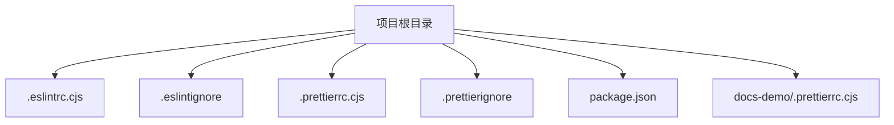
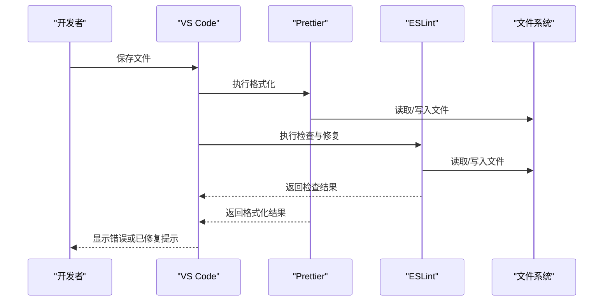
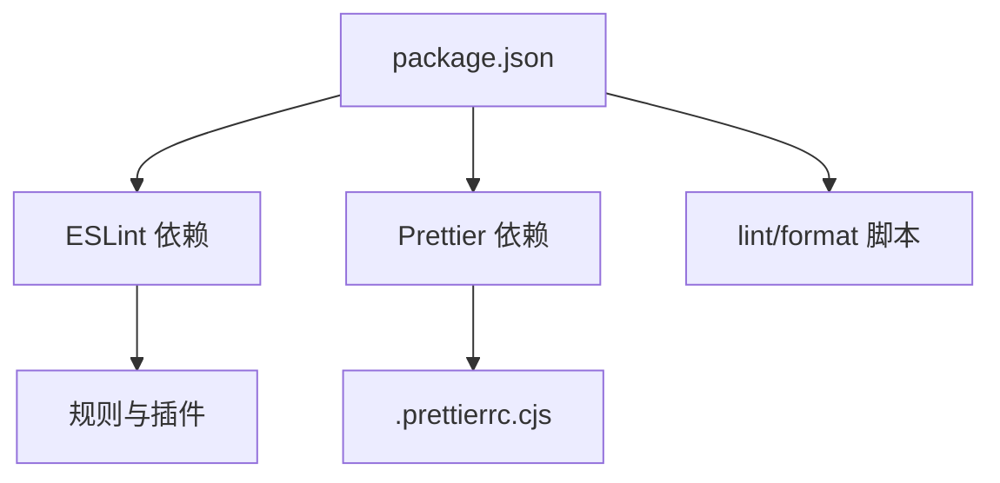

# 代码质量工具

<cite>
**本文档引用的文件**   
- [.eslintrc.cjs](file://.eslintrc.cjs)
- [.eslintignore](file://.eslintignore)
- [.prettierrc.cjs](file://.prettierrc.cjs)
- [.prettierignore](file://.prettierignore)
- [package.json](file://package.json)
- [docs-demo/.prettierrc.cjs](file://docs-demo/.prettierrc.cjs)
</cite>

## 目录
1. [简介](#简介)
2. [项目结构](#项目结构)
3. [核心组件](#核心组件)
4. [架构总览](#架构总览)
5. [详细组件分析](#详细组件分析)
6. [依赖分析](#依赖分析)
7. [性能考虑](#性能考虑)
8. [故障排查指南](#故障排查指南)
9. [结论](#结论)
10. [附录](#附录)

## 简介
本文件为 stk-table-vue 项目的代码质量工具配置文档，聚焦于 ESLint 与 Prettier 的配置、VS Code 集成、团队协作统一方案与冲突解决策略，以及自定义规则与扩展的最佳实践。目标是帮助团队成员在本地与协作中保持一致的代码风格与质量检查流程，减少合并冲突与返工成本。

## 项目结构
本项目根目录包含 ESLint 与 Prettier 的核心配置文件，同时 docs-demo 子目录拥有独立的 Prettier 配置，用于文档示例的格式化一致性。关键文件如下：
- .eslintrc.cjs：ESLint 主配置（规则、插件、忽略等）
- .eslintignore：ESLint 忽略列表
- .prettierrc.cjs：Prettier 主配置（缩进、引号、分号等）
- .prettierignore：Prettier 忽略列表
- package.json：脚本与依赖声明（lint/format 命令、相关依赖）
- docs-demo/.prettierrc.cjs：文档演示区的 Prettier 配置

图表来源
- [.eslintrc.cjs:1-200](file://.eslintrc.cjs#L1-L200)
- [.eslintignore:1-200](file://.eslintignore#L1-L200)
- [.prettierrc.cjs:1-200](file://.prettierrc.cjs#L1-L200)
- [.prettierignore:1-200](file://.prettierignore#L1-L200)
- [package.json:1-200](file://package.json#L1-L200)
- [docs-demo/.prettierrc.cjs:1-200](file://docs-demo/.prettierrc.cjs#L1-L200)

章节来源
- [.eslintrc.cjs:1-200](file://.eslintrc.cjs#L1-L200)
- [.eslintignore:1-200](file://.eslintignore#L1-L200)
- [.prettierrc.cjs:1-200](file://.prettierrc.cjs#L1-L200)
- [.prettierignore:1-200](file://.prettierignore#L1-L200)
- [package.json:1-200](file://package.json#L1-L200)
- [docs-demo/.prettierrc.cjs:1-200](file://docs-demo/.prettierrc.cjs#L1-L200)

## 核心组件
本节对 ESLint 与 Prettier 的关键配置项进行说明，并给出 VS Code 集成建议与团队协作策略。

- ESLint 配置要点
  - 解析器与插件：根据 Vue/TS 项目选择合适的解析器与插件，确保对 .vue/.ts/.js 文件的语法与类型感知正确。
  - 规则设置：启用基础规则集，结合团队规范开启或关闭特定规则；对常见反模式进行告警或错误级别处理。
  - 忽略文件：通过 .eslintignore 排除构建产物、第三方库、生成文件等，避免误报与性能问题。
  - 环境配置：针对浏览器/Node/Vitest 等环境声明全局变量，减少未定义报错。

- Prettier 配置要点
  - 缩进与行宽：统一 tab/空格、缩进大小、最大行长，保证代码可读性。
  - 引号与分号：统一单/双引号、是否加分号、尾逗号等，保持风格一致。
  - 忽略文件：通过 .prettierignore 排除不需要格式化的文件（如构建产物、二进制、锁定文件）。
  - 多工程一致性：docs-demo 使用独立 .prettierrc.cjs 以适配文档示例的特殊需求，但尽量与根目录保持一致。

- VS Code 集成建议
  - 安装 ESLint 与 Prettier 插件，启用保存时自动修复与格式化。
  - 将 Prettier 设为默认格式化程序，并在 .vscode/settings.json 中指定语言级覆盖。
  - 配置编辑器行为：保存时运行 lint --fix、按 Prettier 规则格式化，避免手动调整。

- 团队协作统一方案
  - 将 ESLint/Prettier 配置纳入版本控制，禁止个人覆盖根配置。
  - 提供统一的 EditorConfig 与 VS Code 推荐扩展清单，降低环境差异。
  - 在 CI 中执行 lint 与 format check，阻止不一致代码合并。

章节来源
- [.eslintrc.cjs:1-200](file://.esstintrc.cjs#L1-L200)
- [.prettierrc.cjs:1-200](file://.prettierrc.cjs#L1-L200)
- [package.json:1-200](file://package.json#L1-L200)
- [docs-demo/.prettierrc.cjs:1-200](file://docs-demo/.prettierrc.cjs#L1-L200)

## 架构总览
下图展示了代码质量工具在项目中的角色与交互关系：开发者编辑代码 → VS Code 触发保存钩子 → 调用 Prettier 格式化与 ESLint 检查 → 输出结果与自动修复。

图表来源
- [.eslintrc.cjs:1-200](file://.eslintrc.cjs#L1-L200)
- [.prettierrc.cjs:1-200](file://.prettierrc.cjs#L1-L200)
- [package.json:1-200](file://package.json#L1-L200)

## 详细组件分析

### ESLint 配置分析
- 目标与范围
  - 支持 .vue/.ts/.js 等多类型文件，确保语法与风格一致。
  - 通过规则集与环境配置减少误报，提升开发体验。
- 关键配置项
  - 解析器与插件：选择与项目技术栈匹配的解析器与插件，确保对模板与类型系统的支持。
  - 规则等级：将重要规则设置为 error，次要规则设置为 warn，便于快速定位问题。
  - 忽略策略：通过 .eslintignore 排除构建产物、第三方库与生成文件，提高性能与准确性。
- 最佳实践
  - 使用共享规则包或团队规范，集中管理规则变更。
  - 对复杂业务逻辑添加注释禁用，避免长期遗留问题。
  - 定期审查规则变更，评估影响面后再合并。

章节来源
- [.eslintrc.cjs:1-200](file://.eslintrc.cjs#L1-L200)
- [.eslintignore:1-200](file://.eslintignore#L1-L200)

### Prettier 配置分析
- 目标与范围
  - 统一代码风格，消除人工格式化分歧。
  - 与 ESLint 协同工作，避免规则冲突。
- 关键配置项
  - 缩进与行宽：统一缩进方式与最大行长，保证可读性与可维护性。
  - 引号与分号：统一字符串引号与语句结尾符号，减少视觉噪音。
  - 忽略策略：通过 .prettierignore 排除无需格式化的文件，避免不必要的处理。
- 最佳实践
  - 与 ESLint 配合时，优先让 Prettier 负责样式，ESLint 负责语义与质量。
  - 在多模块工程中保持配置一致，必要时在子目录覆盖少量差异。

章节来源
- [.prettierrc.cjs:1-200](file://.prettierrc.cjs#L1-L200)
- [.prettierignore:1-200](file://.prettierignore#L1-L200)
- [docs-demo/.prettierrc.cjs:1-200](file://docs-demo/.prettierrc.cjs#L1-L200)

### VS Code 集成与保存时自动化
- 插件与设置
  - 安装 ESLint 与 Prettier 插件，启用保存时自动修复与格式化。
  - 在 .vscode/settings.json 中设置默认格式化程序与语言级覆盖。
- 工作流程
  - 保存时先执行 Prettier 格式化，再执行 ESLint 检查与修复。
  - 将错误与警告直接显示在编辑器中，便于即时修正。
- 注意事项
  - 避免重复格式化与冲突规则，确保 Prettier 与 ESLint 的职责边界清晰。
  - 对于大型项目，合理配置缓存与忽略列表，提升响应速度。

章节来源
- [package.json:1-200](file://package.json#L1-L200)
- [.eslintrc.cjs:1-200](file://.eslintrc.cjs#L1-L200)
- [.prettierrc.cjs:1-200](file://.prettierrc.cjs#L1-L200)

### 团队协作与冲突解决策略
- 统一配置
  - 将 ESLint/Prettier 配置纳入版本控制，禁止个人覆盖根配置。
  - 提供 EditorConfig 与 VS Code 推荐扩展清单，降低环境差异。
- 冲突预防
  - 在提交前执行 lint 与 format check，CI 中强制校验。
  - 对历史代码进行一次性格式化，避免频繁改动引发冲突。
- 冲突解决
  - 若出现格式冲突，优先以 Prettier 为准进行统一格式化。
  - 对 ESLint 规则冲突，由团队讨论后更新共享规则，避免分支间不一致。

章节来源
- [package.json:1-200](file://package.json#L1-L200)
- [.eslintrc.cjs:1-200](file://.eslintrc.cjs#L1-L200)
- [.prettierrc.cjs:1-200](file://.prettierrc.cjs#L1-L200)

### 自定义规则与扩展最佳实践
- 自定义规则
  - 将常用规则封装为共享包，便于跨项目复用。
  - 对业务特定场景编写自定义规则，并通过 ESLint 插件发布与维护。
- 扩展使用
  - 引入社区成熟的规则集（如 Vue/TS/React 生态），减少重复配置。
  - 谨慎启用新规则，评估影响面后再逐步推广。
- 维护策略
  - 定期审查规则变更日志，及时升级依赖与修复兼容性问题。
  - 在 PR 中要求附带规则变更的影响说明与测试用例。

章节来源
- [.eslintrc.cjs:1-200](file://.eslintrc.cjs#L1-L200)
- [.prettierrc.cjs:1-200](file://.prettierrc.cjs#L1-L200)
- [package.json:1-200](file://package.json#L1-L200)

## 依赖分析
ESLint 与 Prettier 的依赖与脚本在 package.json 中声明，确保团队使用一致的版本。建议在 CI 中固定依赖版本，避免环境差异导致的失败。

图表来源
- [package.json:1-200](file://package.json#L1-L200)
- [.prettierrc.cjs:1-200](file://.prettierrc.cjs#L1-L200)

章节来源
- [package.json:1-200](file://package.json#L1-L200)

## 性能考虑
- 忽略无关文件：通过 .eslintignore 与 .prettierignore 排除构建产物、第三方库与生成文件，减少扫描范围。
- 增量检查：在 VS Code 中启用增量检查与缓存，提升响应速度。
- 并行执行：在 CI 中使用并行任务执行 lint 与 format check，缩短流水线时间。
- 规则精简：仅启用必要规则，避免过度检查导致性能下降。

[本节为通用指导，不直接分析具体文件]

## 故障排查指南
- 常见问题
  - 规则冲突：当 Prettier 与 ESLint 规则冲突时，优先让 Prettier 负责样式，ESLint 专注语义。
  - 忽略失效：确认 .eslintignore 与 .prettierignore 的路径匹配是否正确。
  - 版本不一致：确保本地与 CI 的依赖版本一致，避免环境差异。
- 排查步骤
  - 在终端直接运行 lint 与 format 命令，观察错误信息。
  - 临时禁用部分规则或格式化选项，定位问题根源。
  - 清理缓存与临时文件，重新执行检查。

章节来源
- [.eslintrc.cjs:1-200](file://.eslintrc.cjs#L1-L200)
- [.prettierrc.cjs:1-200](file://.prettierrc.cjs#L1-L200)
- [package.json:1-200](file://package.json#L1-L200)

## 结论
通过统一的 ESLint 与 Prettier 配置、VS Code 集成与团队协作策略，stk-table-vue 项目能够在保证代码质量的同时提升开发效率。建议持续优化规则与流程，结合 CI 自动化检查，确保代码风格与质量的一致性。

[本节为总结性内容，不直接分析具体文件]

## 附录
- 参考文件路径
  - ESLint 配置：.eslintrc.cjs
  - ESLint 忽略：.eslintignore
  - Prettier 配置：.prettierrc.cjs
  - Prettier 忽略：.prettierignore
  - 脚本与依赖：package.json
  - 文档演示区 Prettier 配置：docs-demo/.prettierrc.cjs

[本节为附录信息，不直接分析具体文件]