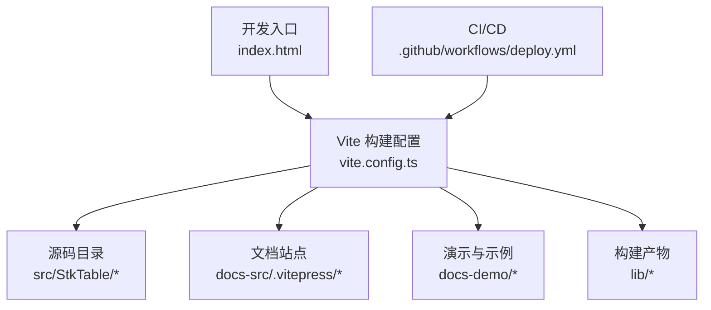
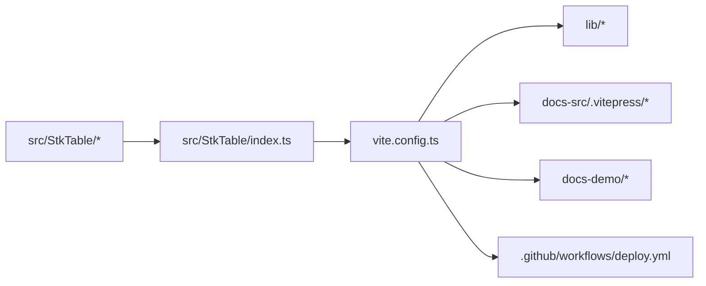

# 构建优化

<cite>
**本文引用的文件**   
- [vite.config.ts](file://vite.config.ts)
- [package.json](file://package.json)
- [.github/workflows/deploy.yml](file://.github/workflows/deploy.yml)
- [index.html](file://index.html)
- [postcss.config.js](file://postcss.config.js)
- [src/StkTable/index.ts](file://src/StkTable/index.ts)
- [lib/stk-table-vue.js](file://lib/stk-table-vue.js)
</cite>

## 目录
1. [简介](#简介)
2. [项目结构](#项目结构)
3. [核心组件](#核心组件)
4. [架构总览](#架构总览)
5. [详细组件分析](#详细组件分析)
6. [依赖分析](#依赖分析)
7. [性能考虑](#性能考虑)
8. [故障排查指南](#故障排查指南)
9. [结论](#结论)
10. [附录](#附录)

## 简介
本指南面向 stk-table-vue 的生产环境构建优化，围绕代码压缩、Tree Shaking、懒加载与代码分割、资源处理（图片/字体/样式）、产物分析与性能监控、以及不同部署场景的构建配置模板展开。目标是帮助团队在保持功能完整性的前提下，显著降低包体积、缩短首屏时间并提升可维护性。

## 项目结构
本项目基于 Vite 进行开发与构建，核心构建入口为 vite.config.ts；文档站点使用 VitePress；示例与演示位于 docs-demo；库产物输出到 lib 目录；CI 通过 GitHub Actions 执行部署流程。



图表来源
- [vite.config.ts](file://vite.config.ts)
- [index.html](file://index.html)
- [src/StkTable/index.ts](file://src/StkTable/index.ts)
- [lib/stk-table-vue.js](file://lib/stk-table-vue.js)
- [.github/workflows/deploy.yml](file://.github/workflows/deploy.yml)

章节来源
- [vite.config.ts](file://vite.config.ts)
- [package.json](file://package.json)
- [index.html](file://index.html)

## 核心组件
- 构建工具链：Vite + esbuild（默认）或 Terser（可选），PostCSS 用于样式处理，TypeScript 编译由 tsconfig 驱动。
- 库导出：src/StkTable/index.ts 作为库入口，配合 vite.config.ts 的 build.lib 生成按需产物。
- 文档与演示：docs-src 使用 VitePress 构建文档；docs-demo 提供交互式示例。
- CI/CD：.github/workflows/deploy.yml 定义发布与部署流水线。

章节来源
- [src/StkTable/index.ts](file://src/StkTable/index.ts)
- [vite.config.ts](file://vite.config.ts)
- [postcss.config.js](file://postcss.config.js)
- [.github/workflows/deploy.yml](file://.github/workflows/deploy.yml)

## 架构总览
下图展示了从源码到生产产物的关键路径与优化点：

```mermaid
sequenceDiagram
participant Dev as "开发者"
participant Vite as "Vite 构建器"
participant TS as "TypeScript/JS 转换"
participant CSS as "PostCSS/CSS 处理"
participant Opt as "压缩与分包"
participant Out as "输出目录 lib/"
Dev->>Vite : 运行构建命令
Vite->>TS : 解析并转换源码(src/StkTable/*)
Vite->>CSS : 处理样式(less/css/postcss)
Vite->>Opt : Tree Shaking/代码分割/压缩
Opt-->>Out : 生成最小化产物(lib/*.js, *.css)
Vite-->>Dev : 构建完成报告
```

图表来源
- [vite.config.ts](file://vite.config.ts)
- [src/StkTable/index.ts](file://src/StkTable/index.ts)
- [postcss.config.js](file://postcss.config.js)
- [lib/stk-table-vue.js](file://lib/stk-table-vue.js)

## 详细组件分析

### 构建配置与优化策略（vite.config.ts）
- 模式与环境变量：区分 development 与 production，启用生产优化开关。
- 代码压缩：生产环境启用 JS/CSS 压缩，必要时引入更严格的压缩器。
- Tree Shaking：确保 ESModule 导出清晰，避免副作用标记，减少无用代码。
- 代码分割：按路由/特性/组件维度拆分 chunk，结合动态导入实现懒加载。
- 资源处理：图片/字体走 asset 插件，设置缓存与尺寸优化；样式经 PostCSS 压缩与兼容处理。
- 外部化依赖：将大型第三方库 external 或通过 CDN 注入，减小主包体积。
- 输出规范：library 模式输出 UMD/ESM，便于多场景消费。

章节来源
- [vite.config.ts](file://vite.config.ts)

### 库入口与按需加载（src/StkTable/index.ts）
- 明确导出公共 API，保证 Tree Shaking 能剔除未使用模块。
- 对重型特性（如虚拟滚动、树形、合并单元格等）采用条件导入或特性开关，避免全量打包。
- 类型声明与运行时解耦，利于消费者仅引入所需部分。

章节来源
- [src/StkTable/index.ts](file://src/StkTable/index.ts)

### 样式处理（postcss.config.js）
- 启用 CSS 压缩与浏览器兼容性降级。
- 按需引入 PostCSS 插件（如 autoprefixer、cssnano 等）。
- 与 Less/Sass 集成时注意顺序，避免重复计算。

章节来源
- [postcss.config.js](file://postcss.config.js)

### 产物与分发（lib/stk-table-vue.js）
- 检查产物是否包含冗余调试信息或未使用的 polyfill。
- 验证命名空间与全局变量冲突风险。
- 确认 CSS 与 JS 分离且引用正确。

章节来源
- [lib/stk-table-vue.js](file://lib/stk-table-vue.js)

### 文档与演示构建（docs-src/.vitepress）
- 文档站点独立构建，避免与库构建互相干扰。
- 静态资源与示例按需懒加载，减少首屏压力。
- 多语言内容可通过路由懒加载进一步拆分。

章节来源
- [vite.config.ts](file://vite.config.ts)

### CI/CD 流水线（.github/workflows/deploy.yml）
- 安装依赖、缓存 node_modules、并行构建任务。
- 构建产物校验（大小阈值、lint、测试）。
- 自动发布到 npm/CDN/静态托管平台。

章节来源
- [.github/workflows/deploy.yml](file://.github/workflows/deploy.yml)

## 依赖分析
下图展示主要依赖关系与优化切入点：



图表来源
- [src/StkTable/index.ts](file://src/StkTable/index.ts)
- [vite.config.ts](file://vite.config.ts)
- [.github/workflows/deploy.yml](file://.github/workflows/deploy.yml)

章节来源
- [package.json](file://package.json)
- [vite.config.ts](file://vite.config.ts)

## 性能考虑
- 代码压缩
  - 启用生产模式下的 JS/CSS 压缩，谨慎选择压缩器以平衡体积与兼容性。
  - 移除 console/debugger 等调试代码，避免 source map 泄露。
- Tree Shaking
  - 使用纯函数与无副作用模块，确保导出清晰。
  - 避免在顶层执行复杂逻辑，延迟初始化重型功能。
- 懒加载与代码分割
  - 对大组件、重型特性（虚拟列表、树、合并单元格）使用动态 import。
  - 路由级与页面级拆分，结合预取与优先级控制。
- 资源优化
  - 图片使用现代格式（WebP/AVIF），按需裁剪与压缩；字体子集化与异步加载。
  - 样式去重与按需引入，避免全局污染。
- 缓存与 CDN
  - 文件名哈希与长期缓存策略；CDN 分层与边缘节点就近分发。
- 构建性能
  - 依赖缓存、增量构建、并行任务；限制并发避免内存峰值。
- 监控与分析
  - 使用 bundle 分析工具定位大包与热路径；埋点上报首屏耗时与错误率。

[本节为通用指导，不直接分析具体文件]

## 故障排查指南
- 构建失败
  - 检查环境变量与模式配置是否正确；确认依赖版本与 Node 版本兼容。
  - 查看构建日志中的警告与错误，优先解决 TypeScript/语法问题。
- 产物异常
  - 对比开发/生产差异，确认压缩与分包策略未破坏运行时行为。
  - 检查 CSS 引用路径与资源路径是否正确。
- 性能回退
  - 使用分析工具定位新增大包；回滚最近变更并逐步定位根因。
  - 检查第三方库是否意外被打包，必要时 external 或替换轻量替代。
- CI 不稳定
  - 固定依赖版本，启用缓存；增加重试与超时策略。
  - 在本地复现 CI 环境，缩小问题范围。

章节来源
- [.github/workflows/deploy.yml](file://.github/workflows/deploy.yml)
- [vite.config.ts](file://vite.config.ts)

## 结论
通过合理的构建配置与优化策略，stk-table-vue 可在生产环境中获得更小的包体积、更快的加载速度与更好的可维护性。建议持续监控构建产物与线上性能指标，结合业务需求迭代优化方案。

[本节为总结性内容，不直接分析具体文件]

## 附录

### 生产环境构建优化清单
- 启用生产模式与严格压缩
- 清理调试代码与 Source Map
- 开启 Tree Shaking 与代码分割
- 懒加载重型特性与大组件
- 资源现代化与子集化
- 依赖 external 与 CDN 加速
- 构建缓存与并行化
- 产物分析与性能基线

[本节为通用清单，不直接分析具体文件]

### 构建产物分析流程
- 生成分析报告（如使用分析插件）
- 识别大包与重复依赖
- 制定拆分与懒加载计划
- 回归测试与性能对比

[本节为通用流程，不直接分析具体文件]

### 资源文件处理策略
- 图片：格式转换、尺寸裁剪、懒加载、占位图
- 字体：子集化、异步加载、字体图标替代
- 样式：模块化、去重、按需引入、CSS 压缩

[本节为通用策略，不直接分析具体文件]

### 部署场景构建配置模板
- CDN 部署
  - 产物上传至 CDN，配置域名与缓存策略
  - 使用绝对路径与版本号管理
- 静态站点生成（VitePress）
  - 独立构建文档与示例
  - 多语言与路由懒加载
- 容器化部署
  - 多阶段构建，最小镜像
  - 健康检查与灰度发布

[本节为通用模板，不直接分析具体文件]

### 构建性能监控与 CI 配置示例
- 构建时长与内存占用监控
- 产物大小阈值告警
- 自动化测试与 lint 检查
- 发布前质量门禁

章节来源
- [.github/workflows/deploy.yml](file://.github/workflows/deploy.yml)