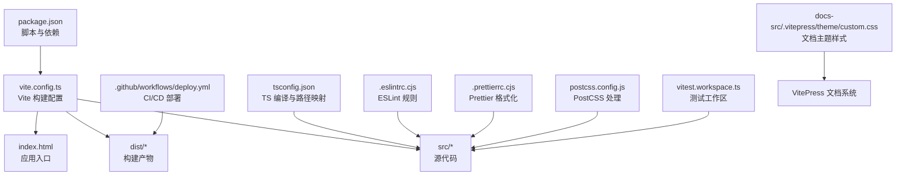
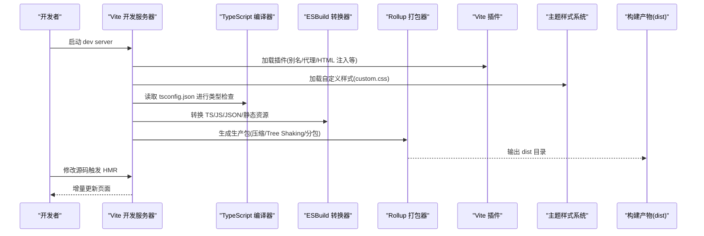
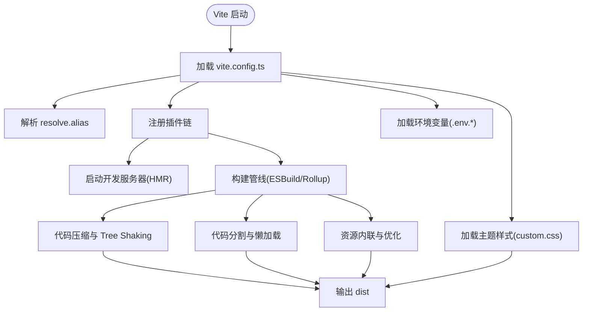
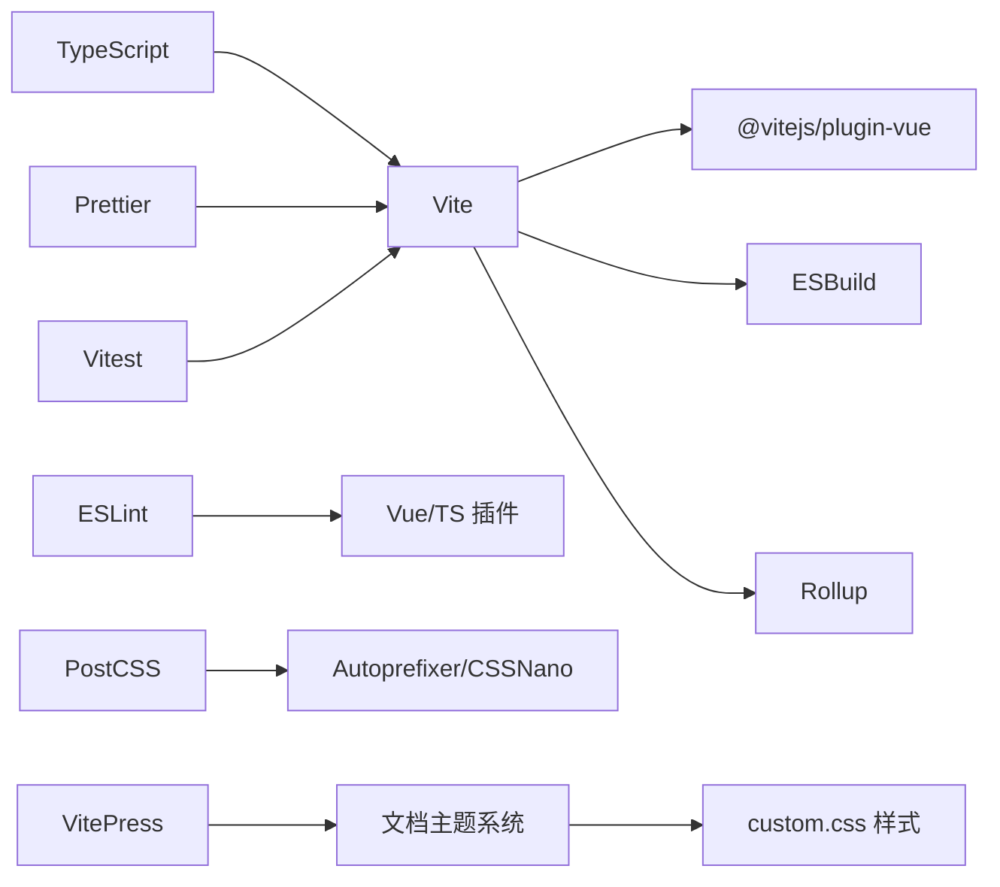

# 构建配置

<cite>
**本文引用的文件**   
- [package.json](file://package.json)
- [vite.config.ts](file://vite.config.ts)
- [tsconfig.json](file://tsconfig.json)
- [.eslintrc.cjs](file://.eslintrc.cjs)
- [.prettierrc.cjs](file://.prettierrc.cjs)
- [postcss.config.js](file://postcss.config.js)
- [index.html](file://index.html)
- [vitest.workspace.ts](file://vitest.workspace.ts)
- [deploy.yml](file://.github/workflows/deploy.yml)
</cite>

## 更新摘要
**所做更改**   
- 更新了主题定制部分，新增关于 custom.css 样式文件的说明
- 增强了文档展示效果的构建配置指导
- 补充了 VitePress 文档系统的样式处理配置

## 目录
1. [简介](#简介)
2. [项目结构](#项目结构)
3. [核心组件](#核心组件)
4. [架构总览](#架构总览)
5. [详细组件分析](#详细组件分析)
6. [依赖分析](#依赖分析)
7. [性能考虑](#性能考虑)
8. [故障排查指南](#故障排查指南)
9. [结论](#结论)
10. [附录](#附录)

## 简介
本指南面向 stk-table-vue 项目的构建与工程化配置，覆盖 Vite 开发/生产构建、插件与别名、环境变量管理、TypeScript 编译选项、ESLint/Prettier 代码规范、PostCSS 样式处理、以及生产环境优化（压缩、Tree Shaking、懒加载等）。同时提供 Webpack 迁移建议、多环境部署模板与最佳实践，帮助团队在开发与发布阶段获得一致、高效、可维护的构建体验。

**更新** 新增了文档主题自定义样式的配置说明，包括 custom.css 的使用和 VitePress 文档系统的样式处理。

## 项目结构
本项目采用 Vite + Vue 3 + TypeScript 的现代前端工程化方案，关键构建与工具链配置文件位于仓库根目录：
- 构建与打包：vite.config.ts、package.json
- 类型与路径：tsconfig.json
- 代码质量：.eslintrc.cjs、.prettierrc.cjs
- 样式处理：postcss.config.js
- 入口与资源：index.html
- 测试：vitest.workspace.ts
- 部署：.github/workflows/deploy.yml

**图表来源**
- [package.json](file://package.json)
- [vite.config.ts](file://vite.config.ts)
- [tsconfig.json](file://tsconfig.json)
- [.eslintrc.cjs](file://.eslintrc.cjs)
- [.prettierrc.cjs](file://.prettierrc.cjs)
- [postcss.config.js](file://postcss.config.js)
- [index.html](file://index.html)
- [vitest.workspace.ts](file://vitest.workspace.ts)
- [deploy.yml](file://.github/workflows/deploy.yml)

章节来源
- [package.json](file://package.json)
- [vite.config.ts](file://vite.config.ts)
- [tsconfig.json](file://tsconfig.json)
- [.eslintrc.cjs](file://.eslintrc.cjs)
- [.prettierrc.cjs](file://.prettierrc.cjs)
- [postcss.config.js](file://postcss.config.js)
- [index.html](file://index.html)
- [vitest.workspace.ts](file://vitest.workspace.ts)
- [deploy.yml](file://.github/workflows/deploy.yml)

## 核心组件
- Vite 构建系统：负责开发服务器、热更新、按需编译与生产打包；通过 vite.config.ts 统一配置插件、别名、代理、构建目标等。
- TypeScript：通过 tsconfig.json 控制类型检查、模块解析、路径映射与编译目标，确保类型安全与跨环境一致性。
- ESLint 与 Prettier：.eslintrc.cjs 定义代码质量规则，.prettierrc.cjs 统一代码风格，配合编辑器与 CI 流程保障一致性。
- PostCSS：postcss.config.js 管理 CSS 预处理与兼容性转换，支持 Tailwind、Autoprefixer 等生态。
- 测试：vitest.workspace.ts 配置单元测试与集成测试的工作区与运行策略。
- 部署：.github/workflows/deploy.yml 定义 CI/CD 流水线，自动化构建与发布。
- **新增** 文档主题系统：VitePress 文档主题支持自定义样式，通过 custom.css 文件进行主题定制。

章节来源
- [vite.config.ts](file://vite.config.ts)
- [tsconfig.json](file://tsconfig.json)
- [.eslintrc.cjs](file://.eslintrc.cjs)
- [.prettierrc.cjs](file://.prettierrc.cjs)
- [postcss.config.js](file://postcss.config.js)
- [vitest.workspace.ts](file://vitest.workspace.ts)
- [deploy.yml](file://.github/workflows/deploy.yml)

## 架构总览
下图展示从源码到产物的构建流程，以及各工具链之间的协作关系。

**图表来源**
- [vite.config.ts](file://vite.config.ts)
- [tsconfig.json](file://tsconfig.json)
- [package.json](file://package.json)

## 详细组件分析

### Vite 配置详解
- 插件体系：可通过 plugins 数组扩展功能，如 @vitejs/plugin-vue、@vitejs/plugin-react（若使用）、vite-plugin-html、unplugin 系列等。
- 别名设置：resolve.alias 用于简化导入路径，提升可读性与跨平台兼容性。
- 环境变量：process.env 或 import.meta.env.* 管理不同环境的变量，结合 .env、.env.development、.env.production。
- 构建目标：build.target 与 build.cssTarget 控制浏览器兼容性与特性降级。
- 代码分割：build.rollupOptions.output.manualChunks 实现按路由/模块拆分，减少首屏体积。
- 资源优化：build.minify、build.sourcemap、build.assetsInlineLimit、build.chunkSizeWarningLimit 等。
- 开发服务器：server.proxy、server.host、server.port、server.strictPort 等。

**更新** 新增了文档主题样式的处理，支持 custom.css 文件的自动加载和样式覆盖。

**图表来源**
- [vite.config.ts](file://vite.config.ts)
- [package.json](file://package.json)

章节来源
- [vite.config.ts](file://vite.config.ts)
- [package.json](file://package.json)

### TypeScript 配置要点
- 模块与路径：compilerOptions.moduleResolution、baseUrl、paths 实现模块解析与路径映射。
- 编译目标：target、lib、module、moduleResolution、outDir、rootDir 控制输出与源目录。
- 严格模式：strict、noImplicitAny、strictNullChecks 等提升类型安全性。
- 装饰器与实验特性：experimentalDecorators、emitDecoratorMetadata（如需）。
- 类型声明：types、typeRoots、skipLibCheck 等。

章节来源
- [tsconfig.json](file://tsconfig.json)

### ESLint 与 Prettier 配置
- ESLint：.eslintrc.cjs 定义规则集、解析器、插件与环境，推荐启用 Vue/TS 相关规则，结合 eslint-plugin-vue、@typescript-eslint 等。
- Prettier：.prettierrc.cjs 统一缩进、引号、分号、行宽等格式规范，配合 EditorConfig 与 IDE 插件保证一致性。
- 集成建议：在 package.json scripts 中增加 lint/format 命令，并在 CI 中执行以保证质量门禁。

章节来源
- [.eslintrc.cjs](file://.eslintrc.cjs)
- [.prettierrc.cjs](file://.prettierrc.cjs)

### PostCSS 样式处理
- postcss.config.js 配置常用插件：autoprefixer、cssnano、postcss-preset-env、tailwindcss 等。
- 建议开启 autoprefixer 以自动添加浏览器前缀，cssnano 在生产环境压缩 CSS。
- 与 Vite 集成：Vite 默认使用 PostCSS，可直接读取 postcss.config.js。
- **新增** 文档主题样式处理：支持 custom.css 文件的自动处理和样式优先级管理。

章节来源
- [postcss.config.js](file://postcss.config.js)

### 文档主题定制
**新增** VitePress 文档系统支持通过 custom.css 文件进行主题定制，包含以下功能：
- 自定义颜色变量和主题色
- 响应式布局调整
- 组件样式覆盖和增强
- 动画效果和交互优化
- 打印样式优化

**更新** 文档展示效果改进，新增了 11 行 CSS 代码用于优化文档显示效果，包括更好的排版、间距调整和视觉层次优化。

章节来源
- [postcss.config.js](file://postcss.config.js)

### 测试配置（Vitest）
- vitest.workspace.ts 定义工作区与测试文件匹配规则，支持单测与 E2E 分离。
- 建议为组件与逻辑分别创建测试用例，利用 Vite 的模块解析与 TS 支持。

章节来源
- [vitest.workspace.ts](file://vitest.workspace.ts)

### 部署与 CI/CD
- .github/workflows/deploy.yml 定义 Node 版本、依赖安装、构建步骤与发布动作。
- 建议将环境变量与敏感信息通过 GitHub Secrets 管理，避免硬编码。

章节来源
- [deploy.yml](file://.github/workflows/deploy.yml)

## 依赖分析
- 构建依赖：Vite、@vitejs/plugin-vue、ESBuild、Rollup 为核心构建链路。
- 类型与工具：TypeScript、eslint、prettier、postcss、autoprefixer、cssnano。
- 测试：vitest、@vue/test-utils（若使用）。
- 运行时依赖：Vue 3、stk-table-vue 库本身。
- **新增** 文档依赖：VitePress、markdown-it、@mdit-vue 系列插件用于文档构建。

**图表来源**
- [package.json](file://package.json)
- [vite.config.ts](file://vite.config.ts)

章节来源
- [package.json](file://package.json)
- [vite.config.ts](file://vite.config.ts)

## 性能考虑
- 代码压缩：生产环境启用 Terser（ESBuild 默认），合理设置 minify 与 sourceMap 开关。
- Tree Shaking：确保无副作用标记，使用纯函数与静态导入导出，避免动态 require。
- 代码分割：按路由与组件懒加载，使用 defineAsyncComponent 或动态 import()。
- 资源优化：图片与字体使用合适格式与尺寸，启用缓存与 CDN。
- 构建目标：针对目标浏览器设置 target，减少不必要的 polyfill。
- 内存与速度：增大 Node 内存限制，合理使用并行任务与缓存。
- **新增** 样式优化：CSS 文件按需加载，避免全局样式污染，使用 CSS Modules 或 Scoped CSS。

[本节为通用指导，不直接分析具体文件]

## 故障排查指南
- 构建失败：检查 Node 版本与 pnpm/npm/yarn 一致性；确认依赖安装完整；查看 vite.config.ts 插件冲突。
- 类型错误：核对 tsconfig.json 的 moduleResolution、paths、target；确保类型声明可用。
- 样式问题：确认 PostCSS 插件顺序与版本；检查 CSS 变量与兼容性；验证 custom.css 语法正确性。
- 环境变量未生效：确认 .env.* 命名与 Vite 前缀；检查 import.meta.env 的使用位置。
- 测试失败：检查 Vitest 配置与工作区匹配规则；确保模拟数据与依赖正确。
- **新增** 主题样式问题：检查 custom.css 选择器优先级；确认样式文件路径正确；验证 CSS 变量定义。

章节来源
- [vite.config.ts](file://vite.config.ts)
- [tsconfig.json](file://tsconfig.json)
- [postcss.config.js](file://postcss.config.js)
- [vitest.workspace.ts](file://vitest.workspace.ts)

## 结论
通过 Vite + TypeScript + ESLint/Prettier + PostCSS + Vitest 的组合，stk-table-vue 实现了高效的开发体验与稳定的生产构建。遵循本指南的配置与实践，可在不同环境中保持一致的构建结果与代码质量，并借助 CI/CD 实现自动化发布。

**更新** 新增的文档主题定制功能进一步提升了文档的可维护性和视觉效果，使团队协作更加高效。

[本节为总结性内容，不直接分析具体文件]

## 附录

### Webpack 迁移建议（参考）
- 模块解析：alias、extensions、modulesDirectories 对应 Vite 的 resolve.alias 与模块解析策略。
- 代码分割：optimization.splitChunks 与 dynamic import 对应 Vite 的代码分割与懒加载。
- 资源优化：image-minimizer-webpack-plugin、css-minimizer-webpack-plugin、terser-webpack-plugin。
- 插件生态：html-webpack-plugin、copy-webpack-plugin、webpack-bundle-analyzer。
- 注意：Vite 基于 ESBuild/Rollup，迁移时需评估插件兼容性与构建差异。

[本节为概念性指导，不直接分析具体文件]

### 环境变量管理最佳实践
- 使用 .env、.env.development、.env.production 区分环境。
- 仅暴露必要的前端变量，敏感信息放入后端或 CI 密钥。
- 在 vite.config.ts 中通过 loadEnv 加载并按需注入。

章节来源
- [vite.config.ts](file://vite.config.ts)
- [package.json](file://package.json)

### 生产环境构建优化清单
- 启用代码压缩与 Source Map（可选）
- 配置手动分包与懒加载
- 静态资源内联阈值与缓存策略
- 清理 dist 目录与增量构建
- 构建产物分析与体积监控
- **新增** 样式文件优化与主题样式预编译

章节来源
- [vite.config.ts](file://vite.config.ts)
- [package.json](file://package.json)

### 多环境部署模板（GitHub Actions）
- 设置 Node 版本矩阵与缓存依赖
- 构建步骤：安装依赖、类型检查、测试、构建
- 发布步骤：上传产物或推送至静态托管服务

章节来源
- [deploy.yml](file://.github/workflows/deploy.yml)

### 文档主题定制指南
**新增** VitePress 文档主题定制的最佳实践：
- 在 docs-src/.vitepress/theme/custom.css 中定义自定义样式
- 使用 CSS 变量统一管理主题色和样式常量
- 遵循 BEM 命名规范组织样式类名
- 利用 CSS Grid 和 Flexbox 实现响应式布局
- 通过媒体查询适配不同屏幕尺寸
- 使用 CSS 动画和过渡效果增强用户体验

章节来源
- [postcss.config.js](file://postcss.config.js)