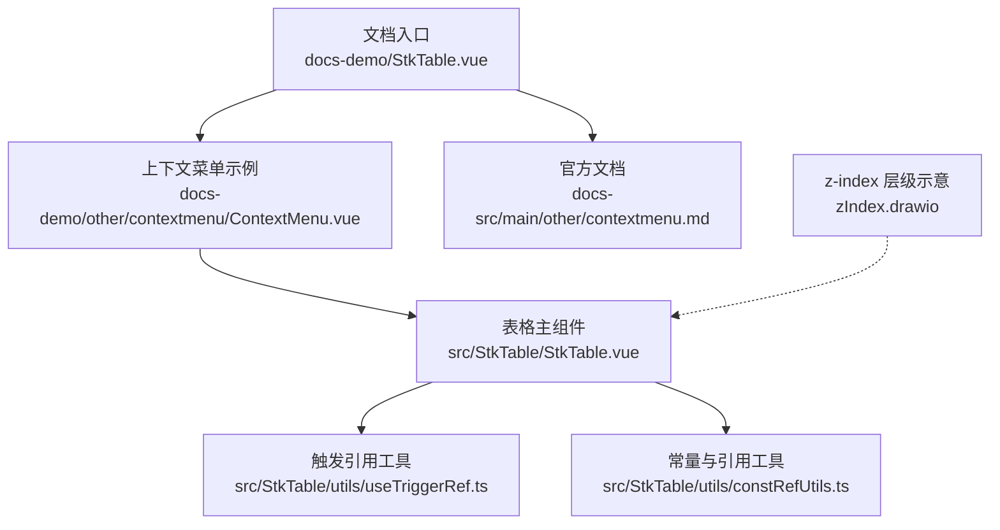
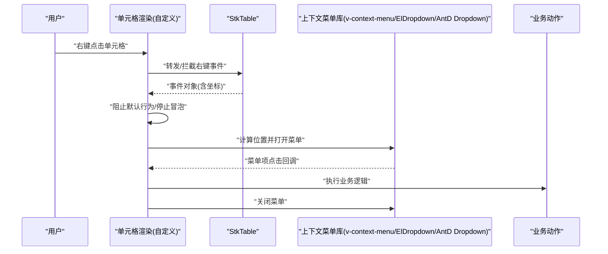
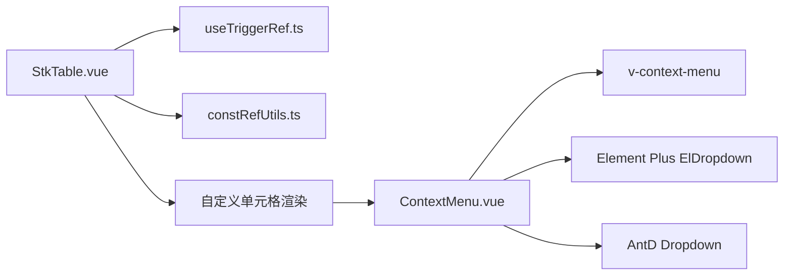

# 上下文菜单集成

<cite>
**本文引用的文件**   
- [StkTable.vue](file://src/StkTable/StkTable.vue)
- [index.ts](file://src/StkTable/index.ts)
- [contextmenu.md](file://docs-src/main/other/contextmenu.md)
- [ContextMenu.vue](file://docs-demo/other/contextmenu/ContextMenu.vue)
- [StkTable.vue（文档入口）](file://docs-demo/StkTable.vue)
- [Filter.vue](file://src/StkTable/custom-cells/FilterCell/Filter.vue)
- [Dropdown/index.vue](file://src/StkTable/custom-cells/FilterCell/Dropdown/index.vue)
- [useTriggerRef.ts](file://src/StkTable/utils/useTriggerRef.ts)
- [constRefUtils.ts](file://src/StkTable/utils/constRefUtils.ts)
- [zIndex.drawio](file://zIndex.drawio)
</cite>

## 目录
1. [简介](#简介)
2. [项目结构](#项目结构)
3. [核心组件与能力](#核心组件与能力)
4. [架构总览](#架构总览)
5. [详细组件分析](#详细组件分析)
6. [依赖关系分析](#依赖关系分析)
7. [性能考虑](#性能考虑)
8. [故障排查指南](#故障排查指南)
9. [结论](#结论)
10. [附录：集成示例与最佳实践](#附录集成示例与最佳实践)

## 简介
本文件面向在 stk-table-vue 中为表格单元格实现右键上下文菜单的开发者，系统讲解如何与 v-context-menu、Element Plus 的 ElDropdown、Ant Design Vue 的 Dropdown 等主流库集成。内容覆盖事件捕获与默认行为阻止、动态菜单项生成、权限控制、位置计算、z-index 层级管理、事件冒泡处理等关键问题，并提供可落地的配置思路与参考路径，帮助你在 StkTable 中通过自定义渲染函数稳定地实现单元格级右键菜单。

## 项目结构
围绕“上下文菜单”相关能力，仓库提供了文档说明、演示组件以及表格内部用于触发与定位的工具方法。整体结构如下：
- 文档与示例
  - docs-src/main/other/contextmenu.md：官方文档中对上下文菜单的说明与使用要点
  - docs-demo/other/contextmenu/ContextMenu.vue：演示用上下文菜单组件
  - docs-demo/StkTable.vue：文档站点入口，承载各示例页面
- 表格核心
  - src/StkTable/StkTable.vue：表格主组件，负责渲染单元格、转发事件、暴露插槽与 API
  - src/StkTable/index.ts：对外导出入口
- 工具与辅助
  - src/StkTable/utils/useTriggerRef.ts：触发元素引用与状态管理
  - src/StkTable/utils/constRefUtils.ts：常量与引用工具
  - zIndex.drawio：z-index 层级示意（概念图）

图表来源
- [StkTable.vue](file://src/StkTable/StkTable.vue)
- [index.ts](file://src/StkTable/index.ts)
- [contextmenu.md](file://docs-src/main/other/contextmenu.md)
- [ContextMenu.vue](file://docs-demo/other/contextmenu/ContextMenu.vue)
- [useTriggerRef.ts](file://src/StkTable/utils/useTriggerRef.ts)
- [constRefUtils.ts](file://src/StkTable/utils/constRefUtils.ts)
- [zIndex.drawio](file://zIndex.drawio)

章节来源
- [StkTable.vue](file://src/StkTable/StkTable.vue)
- [index.ts](file://src/StkTable/index.ts)
- [contextmenu.md](file://docs-src/main/other/contextmenu.md)
- [ContextMenu.vue](file://docs-demo/other/contextmenu/ContextMenu.vue)

## 核心组件与能力
- StkTable 主组件
  - 提供单元格渲染扩展点（如自定义渲染函数/插槽），允许在单元格内嵌入任意 UI 组件（包括上下文菜单）。
  - 负责单元格鼠标事件的监听与转发，便于在单元格层拦截右键事件并阻止默认行为。
- 上下文菜单示例组件
  - 演示如何在单元格中挂载第三方菜单库，并通过事件回调执行操作。
- 触发引用工具
  - 封装触发元素的 ref 管理与状态切换，简化菜单显示/隐藏逻辑。
- 官方文档
  - 对上下文菜单的使用场景、注意事项进行说明，可作为集成时的权威参考。

章节来源
- [StkTable.vue](file://src/StkTable/StkTable.vue)
- [ContextMenu.vue](file://docs-demo/other/contextmenu/ContextMenu.vue)
- [useTriggerRef.ts](file://src/StkTable/utils/useTriggerRef.ts)
- [contextmenu.md](file://docs-src/main/other/contextmenu.md)

## 架构总览
下图展示了在 StkTable 单元格中集成第三方上下文菜单的整体交互流程：用户右键单元格 → 单元格捕获事件 → 阻止默认行为 → 计算坐标 → 调用菜单库展示 → 执行菜单项回调 → 关闭菜单。

图表来源
- [StkTable.vue](file://src/StkTable/StkTable.vue)
- [ContextMenu.vue](file://docs-demo/other/contextmenu/ContextMenu.vue)

## 详细组件分析

### 单元格右键事件捕获与默认行为阻止
- 目标
  - 在单元格层捕获右键事件，阻止浏览器默认菜单，避免与表格内部选择/编辑等行为冲突。
- 关键点
  - 在自定义单元格渲染函数或插槽中绑定右键事件处理器。
  - 调用事件对象的阻止默认方法与冒泡控制方法，确保仅由你的菜单组件接管交互。
  - 将事件坐标传递给菜单库以正确定位弹出层。
- 推荐做法
  - 将“是否显示菜单”的状态保存在单元格实例或父作用域中，结合触发引用工具统一管理。
  - 在菜单关闭时清理状态，避免残留导致重复显示。

章节来源
- [StkTable.vue](file://src/StkTable/StkTable.vue)
- [useTriggerRef.ts](file://src/StkTable/utils/useTriggerRef.ts)

### 与 v-context-menu 集成
- 集成思路
  - 在单元格渲染中引入 v-context-menu，绑定触发元素与菜单项列表。
  - 通过右键事件打开菜单，并在菜单项回调中执行对应业务。
- 常见问题
  - z-index 层级：确保菜单容器不被表格滚动区域或固定列遮挡。
  - 事件冒泡：在单元格层阻止默认行为，避免影响表格行选择或编辑。
  - 坐标计算：根据触发元素与滚动偏移计算准确位置。

章节来源
- [ContextMenu.vue](file://docs-demo/other/contextmenu/ContextMenu.vue)
- [StkTable.vue](file://src/StkTable/StkTable.vue)

### 与 Element Plus ElDropdown 集成
- 集成思路
  - 使用 ElDropdown 作为菜单容器，将单元格内容包裹为触发器。
  - 通过 dropdown 事件或按钮点击事件控制菜单显隐，或在右键事件中直接触发。
- 注意事项
  - 需要设置合适的 placement 与 offset，保证在不同滚动位置下的可见性。
  - 若单元格存在输入控件，需区分输入聚焦与右键菜单的交互优先级。

章节来源
- [StkTable.vue](file://src/StkTable/StkTable.vue)
- [ContextMenu.vue](file://docs-demo/other/contextmenu/ContextMenu.vue)

### 与 Ant Design Vue Dropdown 集成
- 集成思路
  - 使用 AntD 的 Dropdown 组件，将单元格内容作为 trigger。
  - 在右键事件中打开菜单，并根据菜单项执行相应操作。
- 注意事项
  - 注意与表格键盘导航、焦点管理的冲突，必要时禁用默认快捷键。
  - 在虚拟滚动场景下，确保菜单定位基于可视区域而非文档根节点。

章节来源
- [StkTable.vue](file://src/StkTable/StkTable.vue)
- [ContextMenu.vue](file://docs-demo/other/contextmenu/ContextMenu.vue)

### 动态菜单项与权限控制
- 动态生成
  - 根据当前行数据、列定义或全局配置动态构建菜单项数组。
  - 支持条件渲染（如按角色、功能开关、数据状态）控制菜单项可见性与可用性。
- 权限控制
  - 在渲染前过滤不可见项，或对不可用项禁用交互。
  - 将权限判断逻辑下沉到统一的权限服务中，保持单元格渲染简洁。

章节来源
- [StkTable.vue](file://src/StkTable/StkTable.vue)
- [ContextMenu.vue](file://docs-demo/other/contextmenu/ContextMenu.vue)

### 位置计算与滚动适配
- 位置计算
  - 基于触发元素的边界框与滚动偏移计算菜单位置，避免溢出视口。
  - 当表格存在固定列/头部时，需考虑相对容器的坐标系差异。
- 滚动适配
  - 在虚拟滚动或分页加载场景中，确保每次渲染后重新计算位置。
  - 监听滚动事件更新菜单位置，防止错位。

章节来源
- [StkTable.vue](file://src/StkTable/StkTable.vue)
- [useTriggerRef.ts](file://src/StkTable/utils/useTriggerRef.ts)

### 与 FilterCell 的联动参考
- 参考点
  - FilterCell 中的下拉筛选组件展示了如何在单元格内集成下拉类组件，其触发与定位模式可复用到上下文菜单。
- 复用建议
  - 借鉴其触发引用与状态管理方式，统一在单元格层维护“是否展开”的状态。
  - 利用其样式隔离与事件处理经验，减少与表格内部行为的冲突。

章节来源
- [Filter.vue](file://src/StkTable/custom-cells/FilterCell/Filter.vue)
- [Dropdown/index.vue](file://src/StkTable/custom-cells/FilterCell/Dropdown/index.vue)

## 依赖关系分析
- StkTable 主组件依赖
  - 单元格渲染扩展点（插槽/自定义渲染函数）
  - 事件转发机制（鼠标事件、键盘事件）
  - 工具模块（触发引用、常量与引用工具）
- 上下文菜单示例组件依赖
  - 第三方菜单库（v-context-menu / Element Plus / Ant Design Vue）
  - 触发引用工具（用于管理显示状态与触发元素）
- 文档与示例
  - 官方文档提供集成规范与注意事项
  - 示例组件提供可直接参考的实现模式

图表来源
- [StkTable.vue](file://src/StkTable/StkTable.vue)
- [useTriggerRef.ts](file://src/StkTable/utils/useTriggerRef.ts)
- [constRefUtils.ts](file://src/StkTable/utils/constRefUtils.ts)
- [ContextMenu.vue](file://docs-demo/other/contextmenu/ContextMenu.vue)

章节来源
- [StkTable.vue](file://src/StkTable/StkTable.vue)
- [index.ts](file://src/StkTable/index.ts)
- [ContextMenu.vue](file://docs-demo/other/contextmenu/ContextMenu.vue)

## 性能考虑
- 虚拟滚动
  - 避免在单元格渲染中进行昂贵的计算；菜单项生成应缓存或懒加载。
  - 仅在菜单打开时计算位置，关闭后释放资源。
- 事件节流
  - 对频繁触发的事件（如滚动、鼠标移动）进行节流或防抖，降低重排重绘压力。
- DOM 操作
  - 最小化菜单容器的创建与销毁频率，必要时复用同一容器。
- 样式与层级
  - 合理设置 z-index，避免不必要的层级提升导致合成开销增加。

[本节为通用指导，不直接分析具体文件]

## 故障排查指南
- 菜单被遮挡
  - 检查 z-index 层级，确保菜单容器高于表格滚动区域与固定列。
  - 确认菜单挂载点是否在合适的作用域内（如 body 或表格容器）。
- 右键无效或被拦截
  - 确认单元格层已阻止默认行为与冒泡。
  - 检查是否有其他监听器提前消费了事件。
- 位置错乱
  - 校验坐标计算是否考虑了滚动偏移与容器边界。
  - 在虚拟滚动场景下，确保每次渲染后更新位置。
- 与输入控件冲突
  - 区分输入聚焦与右键菜单的交互优先级，必要时禁用输入控件的默认右键行为。

章节来源
- [StkTable.vue](file://src/StkTable/StkTable.vue)
- [ContextMenu.vue](file://docs-demo/other/contextmenu/ContextMenu.vue)
- [zIndex.drawio](file://zIndex.drawio)

## 结论
通过在 StkTable 的单元格层拦截右键事件、阻止默认行为，并结合第三方上下文菜单库进行展示与交互，可以实现稳定且灵活的单元格级右键菜单。借助触发引用工具与位置计算策略，可以解决 z-index 层级、事件冒泡、滚动适配等常见问题。配合动态菜单项与权限控制，能够覆盖复杂业务场景。建议在项目中统一封装单元格菜单渲染逻辑，以提升一致性与可维护性。

[本节为总结性内容，不直接分析具体文件]

## 附录：集成示例与最佳实践
- 示例参考
  - 官方文档：docs-src/main/other/contextmenu.md
  - 示例组件：docs-demo/other/contextmenu/ContextMenu.vue
- 最佳实践清单
  - 在单元格层统一处理右键事件，避免分散在各处。
  - 使用触发引用工具管理菜单状态，避免状态不一致。
  - 动态生成菜单项并进行权限过滤，保证安全与体验。
  - 针对虚拟滚动与固定列场景，完善位置计算与层级管理。
  - 对频繁事件进行节流/防抖，优化性能。
  - 在菜单关闭时清理状态与资源，避免内存泄漏。

章节来源
- [contextmenu.md](file://docs-src/main/other/contextmenu.md)
- [ContextMenu.vue](file://docs-demo/other/contextmenu/ContextMenu.vue)
- [StkTable.vue](file://src/StkTable/StkTable.vue)
- [useTriggerRef.ts](file://src/StkTable/utils/useTriggerRef.ts)