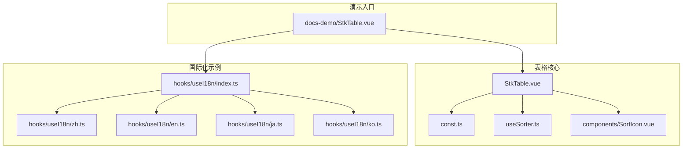
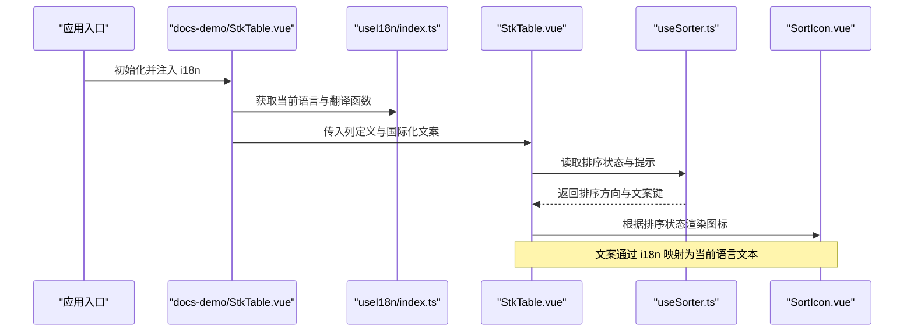
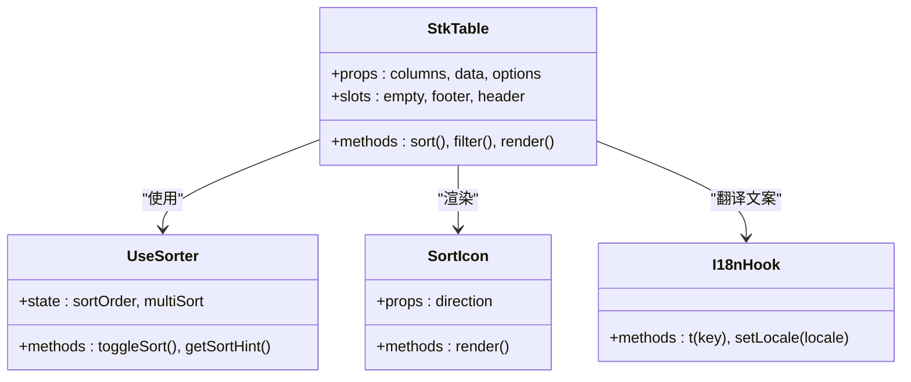
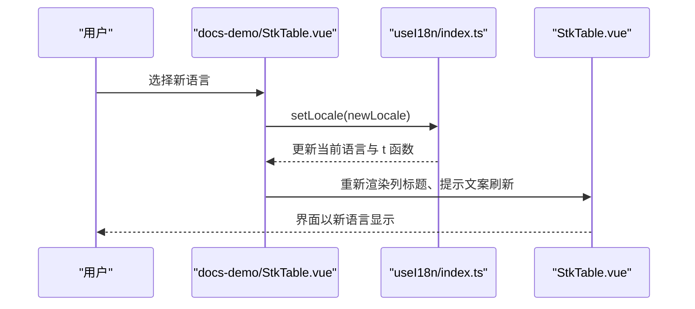
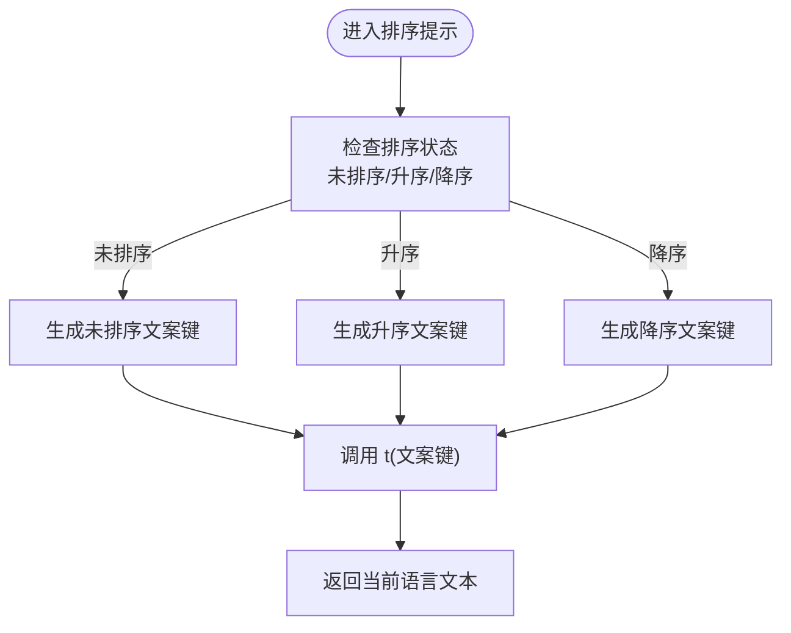
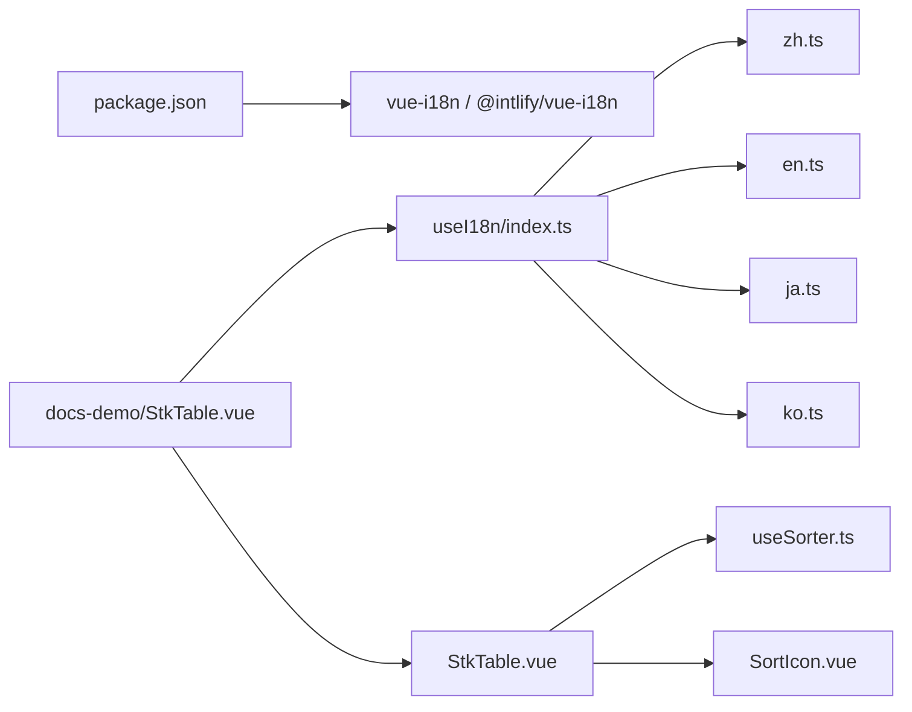

# 国际化集成

<cite>
**本文引用的文件**   
- [src/StkTable/StkTable.vue](file://src/StkTable/StkTable.vue)
- [src/StkTable/const.ts](file://src/StkTable/const.ts)
- [src/StkTable/useSorter.ts](file://src/StkTable/useSorter.ts)
- [src/StkTable/components/SortIcon.vue](file://src/StkTable/components/SortIcon.vue)
- [docs-demo/hooks/useI18n/index.ts](file://docs-demo/hooks/useI18n/index.ts)
- [docs-demo/hooks/useI18n/zh.ts](file://docs-demo/hooks/useI18n/zh.ts)
- [docs-demo/hooks/useI18n/en.ts](file://docs-demo/hooks/useI18n/en.ts)
- [docs-demo/hooks/useI18n/ja.ts](file://docs-demo/hooks/useI18n/ja.ts)
- [docs-demo/hooks/useI18n/ko.ts](file://docs-demo/hooks/useI18n/ko.ts)
- [docs-demo/StkTable.vue](file://docs-demo/StkTable.vue)
- [package.json](file://package.json)
</cite>

## 目录
1. [简介](#简介)
2. [项目结构](#项目结构)
3. [核心组件与能力](#核心组件与能力)
4. [架构总览](#架构总览)
5. [详细组件分析](#详细组件分析)
6. [依赖关系分析](#依赖关系分析)
7. [性能考虑](#性能考虑)
8. [故障排查指南](#故障排查指南)
9. [结论](#结论)
10. [附录](#附录)

## 简介
本指南面向使用 stk-table-vue 的开发者，提供与国际化工具（如 vue-i18n、@intlify/vue-i18n）集成的完整方案。内容涵盖：
- 表格内置文本的多语言化（列标题、分页信息、排序提示、空数据提示等）
- 在 StkTable 中配置多语言资源文件的最佳实践
- 动态语言切换的实现路径
- RTL（从右到左）布局支持
- 日期与数字格式化的本地化配置
- 性能优化建议与常见问题排查

## 项目结构
本项目采用“功能模块 + 工具函数”的组织方式，StkTable 为核心表格组件，国际化相关能力通过 hooks 与示例工程中的 i18n 资源文件进行组织与扩展。

图表来源
- [src/StkTable/StkTable.vue](file://src/StkTable/StkTable.vue)
- [src/StkTable/const.ts](file://src/StkTable/const.ts)
- [src/StkTable/useSorter.ts](file://src/StkTable/useSorter.ts)
- [src/StkTable/components/SortIcon.vue](file://src/StkTable/components/SortIcon.vue)
- [docs-demo/hooks/useI18n/index.ts](file://docs-demo/hooks/useI18n/index.ts)
- [docs-demo/hooks/useI18n/zh.ts](file://docs-demo/hooks/useI18n/zh.ts)
- [docs-demo/hooks/useI18n/en.ts](file://docs-demo/hooks/useI18n/en.ts)
- [docs-demo/hooks/useI18n/ja.ts](file://docs-demo/hooks/useI18n/ja.ts)
- [docs-demo/hooks/useI18n/ko.ts](file://docs-demo/hooks/useI18n/ko.ts)
- [docs-demo/StkTable.vue](file://docs-demo/StkTable.vue)

章节来源
- [src/StkTable/StkTable.vue](file://src/StkTable/StkTable.vue)
- [docs-demo/StkTable.vue](file://docs-demo/StkTable.vue)
- [docs-demo/hooks/useI18n/index.ts](file://docs-demo/hooks/useI18n/index.ts)

## 核心组件与能力
- StkTable 组件：表格渲染与交互的核心，包含排序、固定列、虚拟滚动、树形、合并单元格等功能。国际化需要覆盖其内部文案与交互提示。
- useSorter：排序逻辑与状态管理，涉及排序方向、多列排序、排序提示文案等。
- SortIcon：排序图标展示，通常与排序状态联动，可结合国际化显示不同语言的提示。
- const：表格常量与默认配置，可能包含默认文案或行为开关。
- docs-demo/hooks/useI18n：示例工程中的国际化钩子与多语言资源文件，用于演示如何组织与切换语言。

章节来源
- [src/StkTable/StkTable.vue](file://src/StkTable/StkTable.vue)
- [src/StkTable/useSorter.ts](file://src/StkTable/useSorter.ts)
- [src/StkTable/components/SortIcon.vue](file://src/StkTable/components/SortIcon.vue)
- [src/StkTable/const.ts](file://src/StkTable/const.ts)
- [docs-demo/hooks/useI18n/index.ts](file://docs-demo/hooks/useI18n/index.ts)

## 架构总览
下图展示了 StkTable 与国际化资源的集成关系，以及文档示例工程如何通过 i18n 钩子为表格提供多语言支持。

图表来源
- [docs-demo/StkTable.vue](file://docs-demo/StkTable.vue)
- [docs-demo/hooks/useI18n/index.ts](file://docs-demo/hooks/useI18n/index.ts)
- [src/StkTable/StkTable.vue](file://src/StkTable/StkTable.vue)
- [src/StkTable/useSorter.ts](file://src/StkTable/useSorter.ts)
- [src/StkTable/components/SortIcon.vue](file://src/StkTable/components/SortIcon.vue)

## 详细组件分析

### StkTable 组件与国际化接入点
- 列标题国际化：通过列定义的标题字段绑定 i18n 键，或在组件层统一映射翻译。
- 排序提示国际化：排序方向与提示信息由 useSorter 提供，可在组件层通过 i18n 转换。
- 空数据提示国际化：当无数据时，组件应输出空态文案，可通过 props 或插槽传入 i18n 键。
- 分页信息国际化：若启用分页，页码、每页条数、跳转等文案需通过 i18n 映射。
- 操作提示国际化：如复制、删除、筛选等操作的提示文案，应在调用处传入 i18n 键。

章节来源
- [src/StkTable/StkTable.vue](file://src/StkTable/StkTable.vue)

### useSorter 与排序文案
- 排序状态：维护单列/多列排序、排序方向（升序/降序/未排序）。
- 排序提示：根据排序方向生成提示文案键，供 i18n 转换为具体语言文本。
- 与组件联动：StkTable 在渲染排序图标与 tooltip 时，使用 useSorter 提供的状态与文案键。

章节来源
- [src/StkTable/useSorter.ts](file://src/StkTable/useSorter.ts)

### SortIcon 组件
- 根据排序状态显示对应图标（升序/降序/未排序）。
- 可与 i18n 配合，为无障碍访问提供语言相关的 aria-label。

章节来源
- [src/StkTable/components/SortIcon.vue](file://src/StkTable/components/SortIcon.vue)

### 常量与默认配置
- const.ts 中可能包含默认文案键或行为开关，便于统一管理与替换。
- 建议在国际化资源文件中集中管理所有文案键，避免硬编码。

章节来源
- [src/StkTable/const.ts](file://src/StkTable/const.ts)

### 国际化资源与钩子（示例工程）
- index.ts：封装 i18n 实例与语言切换逻辑，暴露 t 函数与当前语言。
- zh.ts、en.ts、ja.ts、ko.ts：按语言分文件组织文案，确保结构一致。
- 在 docs-demo/StkTable.vue 中引入 i18n 钩子，将翻译函数传递给 StkTable 的列定义与提示文案。

章节来源
- [docs-demo/hooks/useI18n/index.ts](file://docs-demo/hooks/useI18n/index.ts)
- [docs-demo/hooks/useI18n/zh.ts](file://docs-demo/hooks/useI18n/zh.ts)
- [docs-demo/hooks/useI18n/en.ts](file://docs-demo/hooks/useI18n/en.ts)
- [docs-demo/hooks/useI18n/ja.ts](file://docs-demo/hooks/useI18n/ja.ts)
- [docs-demo/hooks/useI18n/ko.ts](file://docs-demo/hooks/useI18n/ko.ts)
- [docs-demo/StkTable.vue](file://docs-demo/StkTable.vue)

### 类图：StkTable 与国际化相关组件关系

图表来源
- [src/StkTable/StkTable.vue](file://src/StkTable/StkTable.vue)
- [src/StkTable/useSorter.ts](file://src/StkTable/useSorter.ts)
- [src/StkTable/components/SortIcon.vue](file://src/StkTable/components/SortIcon.vue)
- [docs-demo/hooks/useI18n/index.ts](file://docs-demo/hooks/useI18n/index.ts)

### 序列图：动态语言切换流程

图表来源
- [docs-demo/StkTable.vue](file://docs-demo/StkTable.vue)
- [docs-demo/hooks/useI18n/index.ts](file://docs-demo/hooks/useI18n/index.ts)
- [src/StkTable/StkTable.vue](file://src/StkTable/StkTable.vue)

### 流程图：排序提示文案生成

图表来源
- [src/StkTable/useSorter.ts](file://src/StkTable/useSorter.ts)
- [docs-demo/hooks/useI18n/index.ts](file://docs-demo/hooks/useI18n/index.ts)

## 依赖关系分析
- StkTable 依赖 useSorter 与 SortIcon，用于排序状态与图标渲染。
- 示例工程通过 useI18n 钩子集中管理多语言资源，并在 StkTable 中使用。
- package.json 中声明了依赖项（如 vue-i18n），确保运行时可用。

图表来源
- [package.json](file://package.json)
- [docs-demo/StkTable.vue](file://docs-demo/StkTable.vue)
- [docs-demo/hooks/useI18n/index.ts](file://docs-demo/hooks/useI18n/index.ts)
- [src/StkTable/StkTable.vue](file://src/StkTable/StkTable.vue)
- [src/StkTable/useSorter.ts](file://src/StkTable/useSorter.ts)
- [src/StkTable/components/SortIcon.vue](file://src/StkTable/components/SortIcon.vue)

章节来源
- [package.json](file://package.json)
- [docs-demo/StkTable.vue](file://docs-demo/StkTable.vue)
- [docs-demo/hooks/useI18n/index.ts](file://docs-demo/hooks/useI18n/index.ts)

## 性能考虑
- 延迟加载语言包：按需加载语言资源，减少首屏体积。
- 缓存翻译结果：对常用文案进行缓存，避免重复计算。
- 最小化重渲染：仅在语言切换或关键状态变化时触发表格重渲染。
- 虚拟滚动与分页：大数据场景下结合虚拟滚动与分页，降低渲染压力。
- 避免频繁 i18n 调用：批量处理文案映射，减少函数调用开销。

## 故障排查指南
- 文案缺失：检查 i18n 资源文件是否包含对应键值，确保 key 一致。
- 语言未切换：确认 setLocale 调用后，组件是否正确响应语言变化。
- 排序提示异常：验证 useSorter 返回的状态与文案键映射是否正确。
- 空数据提示不显示：检查空态文案键是否在 i18n 中定义，并确保组件正确渲染空态。
- 分页文案错误：核对分页相关文案键，确保与 i18n 资源一致。

## 结论
通过合理的架构设计与 i18n 钩子的封装，stk-table-vue 能够灵活地集成多种国际化库，实现表格的多语言支持。遵循本文的最佳实践与性能建议，可以在保证用户体验的同时，提升项目的可维护性与扩展性。

## 附录
- 推荐实践
  - 将文案键集中在 i18n 资源文件中，避免硬编码。
  - 使用统一的命名规范，便于维护与查找。
  - 在组件层提供国际化接口，简化上层使用。
- 常见配置
  - 日期格式化：使用 Intl.DateTimeFormat 或第三方库进行本地化。
  - 数字格式化：使用 Intl.NumberFormat 或第三方库进行本地化。
  - RTL 支持：通过 CSS 变量或样式框架切换布局方向。