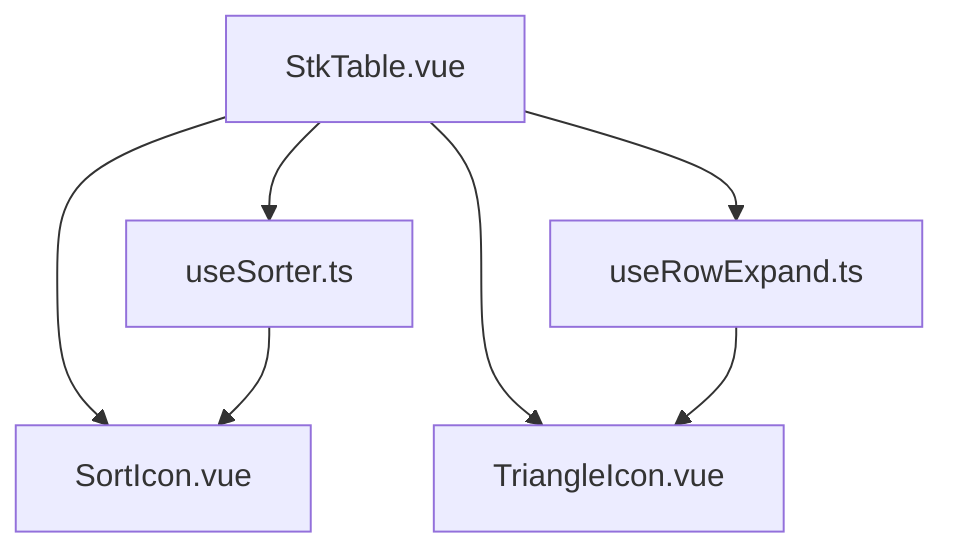
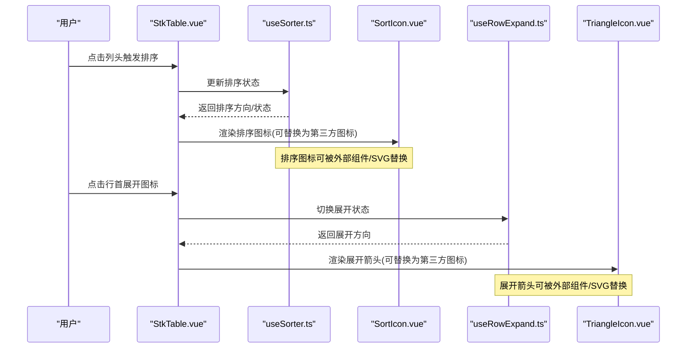
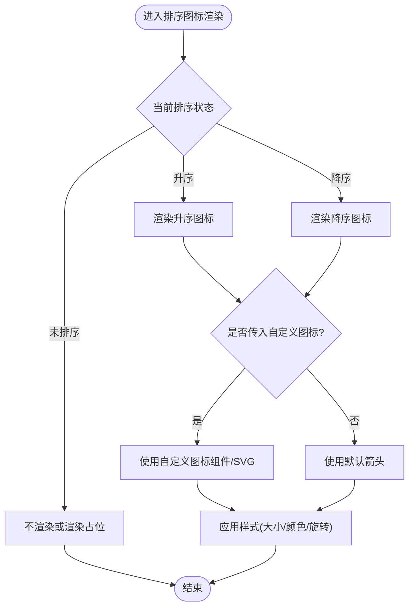
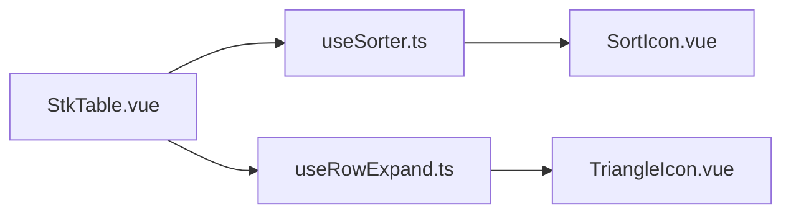

# 图标库集成

<cite>
**本文引用的文件**   
- [src/StkTable/components/SortIcon.vue](file://src/StkTable/components/SortIcon.vue)
- [src/StkTable/components/TriangleIcon.vue](file://src/StkTable/components/TriangleIcon.vue)
- [src/StkTable/useRowExpand.ts](file://src/StkTable/useRowExpand.ts)
- [src/StkTable/useSorter.ts](file://src/StkTable/useSorter.ts)
- [src/StkTable/StkTable.vue](file://src/StkTable/StkTable.vue)
- [docs-demo/basic/sort/DefaultSort.vue](file://docs-demo/basic/sort/DefaultSort.vue)
- [docs-demo/basic/sort/CustomSort.vue](file://docs-demo/basic/sort/CustomSort.vue)
- [docs-demo/basic/expand-row/ExpandRow.vue](file://docs-demo/basic/expand-row/ExpandRow.vue)
- [docs-demo/basic/expand-row/CustomExpandRow.vue](file://docs-demo/basic/expand-row/CustomExpandRow.vue)
- [docs-demo/assets/svg-components/NoData.vue](file://docs-demo/assets/svg-components/NoData.vue)
</cite>

## 目录
1. [简介](#简介)
2. [项目结构](#项目结构)
3. [核心组件](#核心组件)
4. [架构总览](#架构总览)
5. [详细组件分析](#详细组件分析)
6. [依赖关系分析](#依赖关系分析)
7. [性能与兼容性](#性能与兼容性)
8. [故障排查](#故障排查)
9. [结论](#结论)
10. [附录：各图标库集成示例](#附录各图标库集成示例)

## 简介
本指南面向使用 stk-table-vue 的开发者，系统讲解如何替换表格中的默认图标，并与主流图标库（Font Awesome、Material Icons、Ant Design Icons、Element Plus Icons）进行集成。文档覆盖以下要点：
- 排序图标、展开图标、操作按钮等场景的第三方图标替换方案
- SVG 图标的引入与动态切换、样式定制方法
- 字体图标与 SVG 两种方式的优缺点对比与选型建议
- 图标加载性能优化与跨浏览器兼容性注意事项
- 提供可直接参考的完整代码示例路径

## 项目结构
stk-table-vue 将图标相关逻辑集中在少量组件与 Hook 中，便于统一替换与扩展：
- SortIcon.vue：负责列头排序指示图标渲染
- TriangleIcon.vue：用于树形/折叠面板的三角形箭头
- useRowExpand.ts：行展开状态管理与展开图标位置控制
- useSorter.ts：排序状态与排序图标显示逻辑
- StkTable.vue：主表组件，组合上述能力并暴露插槽与配置点



图表来源
- [src/StkTable/StkTable.vue](file://src/StkTable/StkTable.vue)
- [src/StkTable/components/SortIcon.vue](file://src/StkTable/components/SortIcon.vue)
- [src/StkTable/components/TriangleIcon.vue](file://src/StkTable/components/TriangleIcon.vue)
- [src/StkTable/useRowExpand.ts](file://src/StkTable/useRowExpand.ts)
- [src/StkTable/useSorter.ts](file://src/StkTable/useSorter.ts)

章节来源
- [src/StkTable/StkTable.vue](file://src/StkTable/StkTable.vue)
- [src/StkTable/components/SortIcon.vue](file://src/StkTable/components/SortIcon.vue)
- [src/StkTable/components/TriangleIcon.vue](file://src/StkTable/components/TriangleIcon.vue)
- [src/StkTable/useRowExpand.ts](file://src/StkTable/useRowExpand.ts)
- [src/StkTable/useSorter.ts](file://src/StkTable/useSorter.ts)

## 核心组件
- 排序图标组件（SortIcon.vue）
  - 职责：根据排序状态渲染不同方向的箭头或自定义图标
  - 可替换性：通过插槽或 props 传入自定义图标组件/SVG
- 三角形图标组件（TriangleIcon.vue）
  - 职责：展示展开/收起方向，常用于树节点与折叠区域
  - 可替换性：支持传入自定义图标组件以替换默认三角
- 行展开 Hook（useRowExpand.ts）
  - 职责：维护展开状态、计算展开列与展开图标位置
  - 扩展点：在渲染展开图标时允许注入自定义图标
- 排序 Hook（useSorter.ts）
  - 职责：管理多列排序状态、排序方向与排序图标显隐
  - 扩展点：排序图标渲染阶段允许接入自定义图标

章节来源
- [src/StkTable/components/SortIcon.vue](file://src/StkTable/components/SortIcon.vue)
- [src/StkTable/components/TriangleIcon.vue](file://src/StkTable/components/TriangleIcon.vue)
- [src/StkTable/useRowExpand.ts](file://src/StkTable/useRowExpand.ts)
- [src/StkTable/useSorter.ts](file://src/StkTable/useSorter.ts)

## 架构总览
下图展示了排序与展开流程中，Hook 与组件之间的交互关系以及自定义图标的注入点。



图表来源
- [src/StkTable/StkTable.vue](file://src/StkTable/StkTable.vue)
- [src/StkTable/useSorter.ts](file://src/StkTable/useSorter.ts)
- [src/StkTable/components/SortIcon.vue](file://src/StkTable/components/SortIcon.vue)
- [src/StkTable/useRowExpand.ts](file://src/StkTable/useRowExpand.ts)
- [src/StkTable/components/TriangleIcon.vue](file://src/StkTable/components/TriangleIcon.vue)

## 详细组件分析

### 排序图标（SortIcon.vue）
- 功能要点
  - 根据排序状态（升序/降序/未排序）决定图标方向
  - 支持通过插槽或 props 传入自定义图标组件
- 替换策略
  - 使用第三方图标库的图标组件直接替换默认箭头
  - 或使用内联 SVG 作为子节点传入
- 样式定制
  - 通过 CSS 变量或类名控制大小、颜色、旋转角度
  - 结合主题色实现动态配色



图表来源
- [src/StkTable/components/SortIcon.vue](file://src/StkTable/components/SortIcon.vue)

章节来源
- [src/StkTable/components/SortIcon.vue](file://src/StkTable/components/SortIcon.vue)

### 展开箭头（TriangleIcon.vue）
- 功能要点
  - 根据展开/收起状态切换方向
  - 可在树节点或折叠区域中使用
- 替换策略
  - 用第三方图标库的展开/收起图标替换默认三角
  - 使用 SVG 组件作为子节点传入
- 样式定制
  - 通过 transform 旋转实现方向切换
  - 通过 CSS 控制尺寸与颜色

```mermaid
classDiagram
class TriangleIcon {
+props : { expanded : boolean }
+render() string
+rotateAngle() number
}
class ExpandHook {
+expanded : boolean
+toggle() void
}
TriangleIcon <.. ExpandHook : "受控于展开状态"
```

图表来源
- [src/StkTable/components/TriangleIcon.vue](file://src/StkTable/components/TriangleIcon.vue)
- [src/StkTable/useRowExpand.ts](file://src/StkTable/useRowExpand.ts)

章节来源
- [src/StkTable/components/TriangleIcon.vue](file://src/StkTable/components/TriangleIcon.vue)
- [src/StkTable/useRowExpand.ts](file://src/StkTable/useRowExpand.ts)

### 排序 Hook（useSorter.ts）
- 功能要点
  - 维护多列排序状态与排序方向
  - 提供排序回调与排序图标显示规则
- 扩展点
  - 在排序图标渲染前，允许注入自定义图标组件
  - 支持按列配置不同的排序行为与图标映射

章节来源
- [src/StkTable/useSorter.ts](file://src/StkTable/useSorter.ts)

### 行展开 Hook（useRowExpand.ts）
- 功能要点
  - 管理行级展开/收起状态
  - 计算展开列与展开图标位置
- 扩展点
  - 在渲染展开图标时，允许替换为第三方图标或 SVG

章节来源
- [src/StkTable/useRowExpand.ts](file://src/StkTable/useRowExpand.ts)

### 主表组件（StkTable.vue）
- 功能要点
  - 组合排序、展开、虚拟滚动等功能
  - 暴露插槽与配置项，便于替换内部图标
- 扩展点
  - 通过插槽覆盖排序图标与展开图标
  - 通过 props 传递自定义图标组件

章节来源
- [src/StkTable/StkTable.vue](file://src/StkTable/StkTable.vue)

## 依赖关系分析
- 组件间耦合
  - StkTable.vue 依赖 useSorter.ts 与 useRowExpand.ts
  - SortIcon.vue 与 TriangleIcon.vue 为纯展示组件，低耦合
- 外部依赖
  - 第三方图标库通过组件或 SVG 形式注入，无强耦合
- 潜在循环依赖
  - 当前结构清晰，未发现循环依赖



图表来源
- [src/StkTable/StkTable.vue](file://src/StkTable/StkTable.vue)
- [src/StkTable/useSorter.ts](file://src/StkTable/useSorter.ts)
- [src/StkTable/useRowExpand.ts](file://src/StkTable/useRowExpand.ts)
- [src/StkTable/components/SortIcon.vue](file://src/StkTable/components/SortIcon.vue)
- [src/StkTable/components/TriangleIcon.vue](file://src/StkTable/components/TriangleIcon.vue)

章节来源
- [src/StkTable/StkTable.vue](file://src/StkTable/StkTable.vue)
- [src/StkTable/useSorter.ts](file://src/StkTable/useSorter.ts)
- [src/StkTable/useRowExpand.ts](file://src/StkTable/useRowExpand.ts)
- [src/StkTable/components/SortIcon.vue](file://src/StkTable/components/SortIcon.vue)
- [src/StkTable/components/TriangleIcon.vue](file://src/StkTable/components/TriangleIcon.vue)

## 性能与兼容性
- 字体图标 vs SVG
  - 字体图标
    - 优点：体积小、易于通过 CSS 控制颜色与大小、动画友好
    - 缺点：需要额外字体文件请求；不支持渐变/复杂图形；无障碍语义较弱
  - SVG
    - 优点：矢量无损、支持渐变与复杂形状、可通过 DOM 操作增强交互
    - 缺点：DOM 节点增多可能影响渲染性能；需关注内联体积
- 加载性能优化
  - 按需引入图标库，避免全量打包
  - 对常用图标进行缓存（如全局注册或懒加载）
  - 使用雪碧图或 CDN 加速字体/图标资源
- 跨浏览器兼容
  - 字体图标：注意旧版浏览器对 @font-face 的支持
  - SVG：注意 IE11 的 transform 与 viewBox 差异
  - 动画与过渡：必要时添加前缀或降级方案

[本节为通用指导，不直接分析具体文件]

## 故障排查
- 排序图标不显示
  - 检查排序状态是否正确传递到 SortIcon.vue
  - 确认插槽或 props 是否正确传入自定义图标
- 展开箭头方向错误
  - 检查 useRowExpand.ts 中展开状态切换逻辑
  - 确认 TriangleIcon.vue 接收的 expanded 属性
- 图标样式异常
  - 检查 CSS 变量与类名是否生效
  - 确认第三方图标库版本与样式冲突
- 性能问题
  - 减少不必要的重渲染
  - 对大列表启用虚拟滚动与按需加载图标

章节来源
- [src/StkTable/components/SortIcon.vue](file://src/StkTable/components/SortIcon.vue)
- [src/StkTable/components/TriangleIcon.vue](file://src/StkTable/components/TriangleIcon.vue)
- [src/StkTable/useRowExpand.ts](file://src/StkTable/useRowExpand.ts)
- [src/StkTable/useSorter.ts](file://src/StkTable/useSorter.ts)

## 结论
通过 SortIcon.vue、TriangleIcon.vue 以及 useSorter.ts、useRowExpand.ts 的扩展点，stk-table-vue 能够灵活替换默认图标，适配多种图标库与 SVG 方案。选择字体图标还是 SVG 应基于项目需求、性能目标与兼容性要求综合评估。推荐优先按需引入与懒加载，确保用户体验与性能平衡。

[本节为总结性内容，不直接分析具体文件]

## 附录：各图标库集成示例
以下为常见图标库的集成方式与示例路径，供快速参考与复制实践。

- Font Awesome
  - 安装与引入：通过 npm 安装并按需引入对应图标组件或样式
  - 替换排序图标：在 SortIcon.vue 插槽中渲染 FontAwesome 图标组件
  - 替换展开箭头：在 TriangleIcon.vue 插槽中渲染 FontAwesome 展开/收起图标
  - 示例参考
    - [docs-demo/basic/sort/DefaultSort.vue](file://docs-demo/basic/sort/DefaultSort.vue)
    - [docs-demo/basic/sort/CustomSort.vue](file://docs-demo/basic/sort/CustomSort.vue)
    - [docs-demo/basic/expand-row/ExpandRow.vue](file://docs-demo/basic/expand-row/ExpandRow.vue)
    - [docs-demo/basic/expand-row/CustomExpandRow.vue](file://docs-demo/basic/expand-row/CustomExpandRow.vue)

- Material Icons
  - 安装与引入：通过 npm 或 CDN 引入 Material Icons 字体或 SVG 组件
  - 替换排序图标：使用 material-icons 类名或图标组件替换默认箭头
  - 替换展开箭头：使用 expand_more/expand_less 等图标
  - 示例参考
    - [docs-demo/basic/sort/DefaultSort.vue](file://docs-demo/basic/sort/DefaultSort.vue)
    - [docs-demo/basic/sort/CustomSort.vue](file://docs-demo/basic/sort/CustomSort.vue)
    - [docs-demo/basic/expand-row/ExpandRow.vue](file://docs-demo/basic/expand-row/ExpandRow.vue)
    - [docs-demo/basic/expand-row/CustomExpandRow.vue](file://docs-demo/basic/expand-row/CustomExpandRow.vue)

- Ant Design Icons
  - 安装与引入：安装 ant-design-vue 与 @ant-design/icons-vue
  - 替换排序图标：使用 CaretUp/CaretDown 等图标组件
  - 替换展开箭头：使用 RightOutlined/DownOutlined 等
  - 示例参考
    - [docs-demo/basic/sort/DefaultSort.vue](file://docs-demo/basic/sort/DefaultSort.vue)
    - [docs-demo/basic/sort/CustomSort.vue](file://docs-demo/basic/sort/CustomSort.vue)
    - [docs-demo/basic/expand-row/ExpandRow.vue](file://docs-demo/basic/expand-row/ExpandRow.vue)
    - [docs-demo/basic/expand-row/CustomExpandRow.vue](file://docs-demo/basic/expand-row/CustomExpandRow.vue)

- Element Plus Icons
  - 安装与引入：安装 @element-plus/icons-vue
  - 替换排序图标：使用 ArrowUp/ArrowDown 等图标组件
  - 替换展开箭头：使用 ArrowRight/ArrowDown 等
  - 示例参考
    - [docs-demo/basic/sort/DefaultSort.vue](file://docs-demo/basic/sort/DefaultSort.vue)
    - [docs-demo/basic/sort/CustomSort.vue](file://docs-demo/basic/sort/CustomSort.vue)
    - [docs-demo/basic/expand-row/ExpandRow.vue](file://docs-demo/basic/expand-row/ExpandRow.vue)
    - [docs-demo/basic/expand-row/CustomExpandRow.vue](file://docs-demo/basic/expand-row/CustomExpandRow.vue)

- SVG 图标
  - 引入方式：将 SVG 转为 Vue 组件或直接内联使用
  - 动态切换：根据状态切换不同 SVG 组件或 path
  - 样式定制：通过 CSS 控制 fill、stroke、transform
  - 示例参考
    - [docs-demo/assets/svg-components/NoData.vue](file://docs-demo/assets/svg-components/NoData.vue)

章节来源
- [docs-demo/basic/sort/DefaultSort.vue](file://docs-demo/basic/sort/DefaultSort.vue)
- [docs-demo/basic/sort/CustomSort.vue](file://docs-demo/basic/sort/CustomSort.vue)
- [docs-demo/basic/expand-row/ExpandRow.vue](file://docs-demo/basic/expand-row/ExpandRow.vue)
- [docs-demo/basic/expand-row/CustomExpandRow.vue](file://docs-demo/basic/expand-row/CustomExpandRow.vue)
- [docs-demo/assets/svg-components/NoData.vue](file://docs-demo/assets/svg-components/NoData.vue)