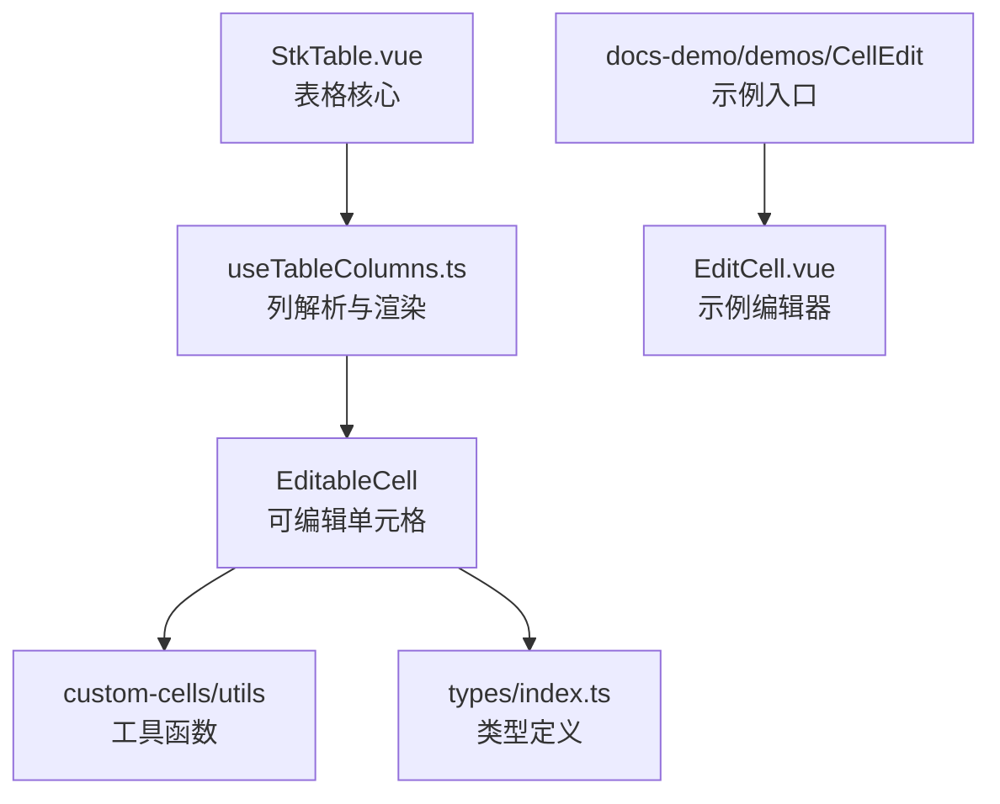
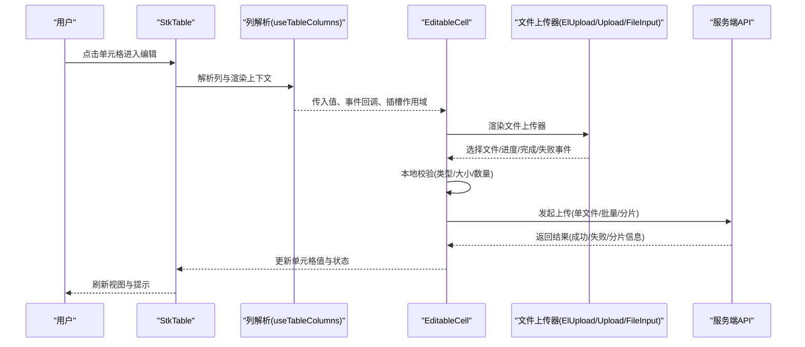
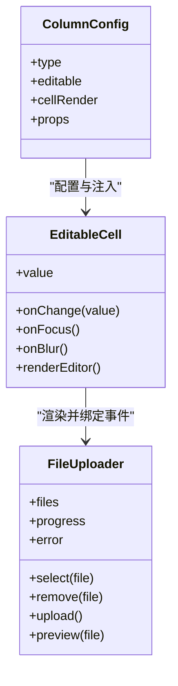
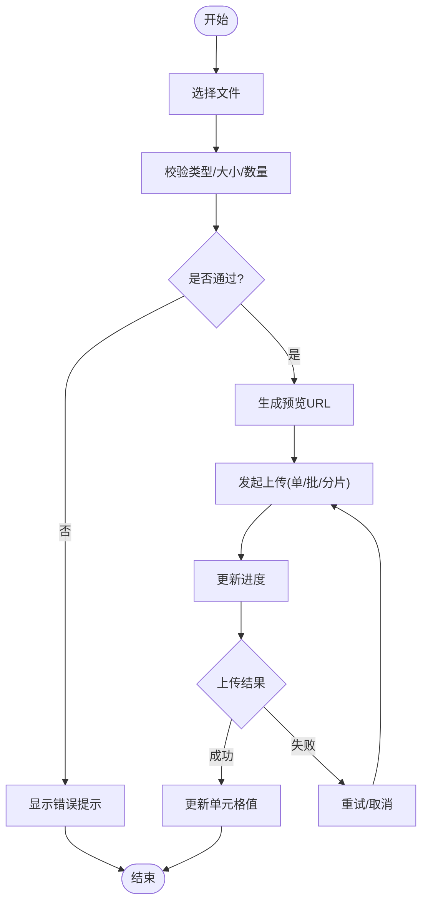
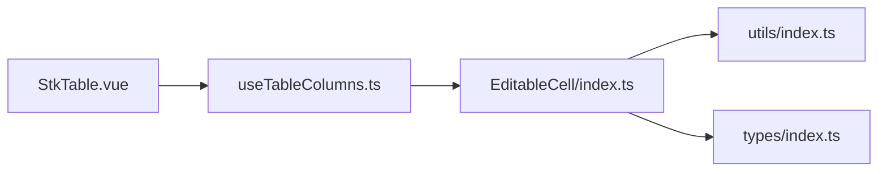

# 文件上传器集成

<cite>
**本文引用的文件**   
- [src/StkTable/custom-cells/EditableCell/index.ts](file://src/StkTable/custom-cells/EditableCell/index.ts)
- [src/StkTable/custom-cells/EditableCell/EditableCell.vue](file://src/StkTable/custom-cells/EditableCell/EditableCell.vue)
- [src/StkTable/custom-cells/EditableCell/createEditableCell.ts](file://src/StkTable/custom-cells/EditableCell/createEditableCell.ts)
- [src/StkTable/custom-cells/FilterCell/index.ts](file://src/StkTable/custom-cells/FilterCell/index.ts)
- [src/StkTable/custom-cells/FilterCell/Filter.vue](file://src/StkTable/custom-cells/FilterCell/Filter.vue)
- [src/StkTable/custom-cells/FilterCell/Dropdown/index.ts](file://src/StkTable/custom-cells/FilterCell/Dropdown/index.ts)
- [src/StkTable/custom-cells/FilterCell/Dropdown/index.vue](file://src/StkTable/custom-cells/FilterCell/Dropdown/index.vue)
- [src/StkTable/custom-cells/utils/index.ts](file://src/StkTable/custom-cells/utils/index.ts)
- [src/StkTable/types/index.ts](file://src/StkTable/types/index.ts)
- [src/StkTable/useTableColumns.ts](file://src/StkTable/useTableColumns.ts)
- [src/StkTable/StkTable.vue](file://src/StkTable/StkTable.vue)
- [docs-demo/demos/CellEdit/index.vue](file://docs-demo/demos/CellEdit/index.vue)
- [docs-demo/demos/CellEdit/EditCell.vue](file://docs-demo/demos/CellEdit/EditCell.vue)
- [docs-demo/demos/CellEdit/type.ts](file://docs-demo/demos/CellEdit/type.ts)
- [docs-src/main/table/advanced/custom-cells/editable-cell.md](file://docs-src/main/table/advanced/custom-cells/editable-cell.md)
</cite>

## 目录
1. [简介](#简介)
2. [项目结构](#项目结构)
3. [核心组件与扩展点](#核心组件与扩展点)
4. [架构总览](#架构总览)
5. [详细组件分析](#详细组件分析)
6. [依赖关系分析](#依赖关系分析)
7. [性能考虑](#性能考虑)
8. [故障排查指南](#故障排查指南)
9. [结论](#结论)
10. [附录：与主流 UI 库的集成方案](#附录与主流-ui-库的集成方案)

## 简介
本指南面向在 stk-table-vue 中为单元格集成文件上传器的开发者，覆盖与 element-plus 的 ElUpload、ant-design-vue 的 Upload、vuetify 的 FileInput 等组件的集成方式。重点说明如何在 EditableCell 中实现文件选择、预览、删除、类型与大小校验、进度显示，以及批量上传、断点续传、图片压缩等高级特性，并给出与后端 API 交互的最佳实践和错误处理策略。

## 项目结构
stk-table-vue 采用“表格核心 + 自定义单元格”的分层设计。与文件上传相关的扩展点主要集中在自定义单元格体系（尤其是 EditableCell）与列定义系统。文档示例位于 docs-demo，便于快速参考与复用。

图表来源
- [src/StkTable/StkTable.vue](file://src/StkTable/StkTable.vue)
- [src/StkTable/useTableColumns.ts](file://src/StkTable/useTableColumns.ts)
- [src/StkTable/custom-cells/EditableCell/index.ts](file://src/StkTable/custom-cells/EditableCell/index.ts)
- [docs-demo/demos/CellEdit/index.vue](file://docs-demo/demos/CellEdit/index.vue)

章节来源
- [src/StkTable/StkTable.vue](file://src/StkTable/StkTable.vue)
- [src/StkTable/useTableColumns.ts](file://src/StkTable/useTableColumns.ts)
- [src/StkTable/custom-cells/EditableCell/index.ts](file://src/StkTable/custom-cells/EditableCell/index.ts)
- [docs-demo/demos/CellEdit/index.vue](file://docs-demo/demos/CellEdit/index.vue)

## 核心组件与扩展点
- EditableCell：提供单元格编辑能力，是集成文件上传器的最佳宿主。通过插槽或工厂方法注入自定义编辑器。
- FilterCell：用于筛选场景，可作为文件过滤或附件列表展示的参考实现。
- utils：通用工具函数，适合封装文件校验、格式转换、URL 生成等逻辑。
- types：统一的类型定义，确保列配置、单元格数据、事件回调的类型安全。

章节来源
- [src/StkTable/custom-cells/EditableCell/index.ts](file://src/StkTable/custom-cells/EditableCell/index.ts)
- [src/StkTable/custom-cells/EditableCell/EditableCell.vue](file://src/StkTable/custom-cells/EditableCell/EditableCell.vue)
- [src/StkTable/custom-cells/FilterCell/index.ts](file://src/StkTable/custom-cells/FilterCell/index.ts)
- [src/StkTable/custom-cells/utils/index.ts](file://src/StkTable/custom-cells/utils/index.ts)
- [src/StkTable/types/index.ts](file://src/StkTable/types/index.ts)

## 架构总览
下图展示了从列定义到单元格渲染、再到文件上传器的事件流与数据流。

图表来源
- [src/StkTable/StkTable.vue](file://src/StkTable/StkTable.vue)
- [src/StkTable/useTableColumns.ts](file://src/StkTable/useTableColumns.ts)
- [src/StkTable/custom-cells/EditableCell/index.ts](file://src/StkTable/custom-cells/EditableCell/index.ts)

## 详细组件分析

### EditableCell 与文件上传器集成
- 目标：在 EditableCell 中嵌入文件上传器，支持选择、预览、删除、进度、错误提示，并将结果同步回表格数据。
- 关键点：
  - 使用插槽或工厂方法将上传器注入到单元格编辑器。
  - 维护本地状态：选中文件列表、上传进度、错误信息、预览 URL。
  - 统一校验：类型、大小、数量限制；失败重试与取消。
  - 事件桥接：将上传器的 change/success/error 事件映射为 EditableCell 的 value/change 事件。

图表来源
- [src/StkTable/custom-cells/EditableCell/index.ts](file://src/StkTable/custom-cells/EditableCell/index.ts)
- [src/StkTable/custom-cells/EditableCell/EditableCell.vue](file://src/StkTable/custom-cells/EditableCell/EditableCell.vue)
- [src/StkTable/types/index.ts](file://src/StkTable/types/index.ts)

章节来源
- [src/StkTable/custom-cells/EditableCell/index.ts](file://src/StkTable/custom-cells/EditableCell/index.ts)
- [src/StkTable/custom-cells/EditableCell/EditableCell.vue](file://src/StkTable/custom-cells/EditableCell/EditableCell.vue)
- [src/StkTable/custom-cells/EditableCell/createEditableCell.ts](file://src/StkTable/custom-cells/EditableCell/createEditableCell.ts)

### 文件上传流程（含校验与进度）

图表来源
- [src/StkTable/custom-cells/utils/index.ts](file://src/StkTable/custom-cells/utils/index.ts)
- [src/StkTable/custom-cells/EditableCell/index.ts](file://src/StkTable/custom-cells/EditableCell/index.ts)

### 与 element-plus 的 ElUpload 集成要点
- 使用 ElUpload 的 before-upload 进行类型与大小校验。
- 利用 on-progress 更新进度，on-success/on-error 处理结果。
- 通过 fileList 管理本地文件列表，结合 preview 与 remove 实现预览与删除。
- 将 ElUpload 的 change 事件映射为 EditableCell 的 value/change。

章节来源
- [src/StkTable/custom-cells/EditableCell/index.ts](file://src/StkTable/custom-cells/EditableCell/index.ts)
- [src/StkTable/custom-cells/utils/index.ts](file://src/StkTable/custom-cells/utils/index.ts)

### 与 ant-design-vue 的 Upload 集成要点
- 使用 customRequest 自定义上传逻辑，便于对接分片与断点续传。
- 通过 file 对象获取元数据，执行类型/大小校验。
- 使用 progress 事件更新进度，success/error 回调处理结果。
- 将 Upload 的 onChange 映射为 EditableCell 的 value/change。

章节来源
- [src/StkTable/custom-cells/EditableCell/index.ts](file://src/StkTable/custom-cells/EditableCell/index.ts)
- [src/StkTable/custom-cells/utils/index.ts](file://src/StkTable/custom-cells/utils/index.ts)

### 与 vuetify 的 FileInput 集成要点
- 使用 @change 监听文件选择，触发校验与预览。
- 通过 v-model 双向绑定文件数组，配合删除按钮移除文件。
- 在提交时调用上传逻辑，并在 success/error 时更新单元格状态。

章节来源
- [src/StkTable/custom-cells/EditableCell/index.ts](file://src/StkTable/custom-cells/EditableCell/index.ts)
- [src/StkTable/custom-cells/utils/index.ts](file://src/StkTable/custom-cells/utils/index.ts)

### 筛选与附件展示（FilterCell 参考）
- FilterCell 展示了如何在单元格内渲染复杂内容（如下拉、列表），可用于附件列表展示与筛选。
- 可复用其渲染模式，在单元格中展示已上传文件的缩略图与名称，并提供删除操作。

章节来源
- [src/StkTable/custom-cells/FilterCell/index.ts](file://src/StkTable/custom-cells/FilterCell/index.ts)
- [src/StkTable/custom-cells/FilterCell/Filter.vue](file://src/StkTable/custom-cells/FilterCell/Filter.vue)
- [src/StkTable/custom-cells/FilterCell/Dropdown/index.ts](file://src/StkTable/custom-cells/FilterCell/Dropdown/index.ts)
- [src/StkTable/custom-cells/FilterCell/Dropdown/index.vue](file://src/StkTable/custom-cells/FilterCell/Dropdown/index.vue)

### 示例与文档参考
- docs-demo/demos/CellEdit 提供了可编辑单元格的示例入口与编辑器实现，可作为文件上传器集成的起点。
- docs-src/main/table/advanced/custom-cells/editable-cell.md 包含 EditableCell 的使用说明与扩展方式。

章节来源
- [docs-demo/demos/CellEdit/index.vue](file://docs-demo/demos/CellEdit/index.vue)
- [docs-demo/demos/CellEdit/EditCell.vue](file://docs-demo/demos/CellEdit/EditCell.vue)
- [docs-demo/demos/CellEdit/type.ts](file://docs-demo/demos/CellEdit/type.ts)
- [docs-src/main/table/advanced/custom-cells/editable-cell.md](file://docs-src/main/table/advanced/custom-cells/editable-cell.md)

## 依赖关系分析
- StkTable 作为核心，负责表格渲染与生命周期管理。
- useTableColumns 解析列配置，决定每个单元格的渲染行为。
- EditableCell 作为可编辑单元格的基类/组件，承载文件上传器的集成。
- utils 提供文件相关工具函数（校验、预览、URL 生成）。
- types 保证列配置与单元格数据的类型一致性。

图表来源
- [src/StkTable/StkTable.vue](file://src/StkTable/StkTable.vue)
- [src/StkTable/useTableColumns.ts](file://src/StkTable/useTableColumns.ts)
- [src/StkTable/custom-cells/EditableCell/index.ts](file://src/StkTable/custom-cells/EditableCell/index.ts)
- [src/StkTable/custom-cells/utils/index.ts](file://src/StkTable/custom-cells/utils/index.ts)
- [src/StkTable/types/index.ts](file://src/StkTable/types/index.ts)

章节来源
- [src/StkTable/StkTable.vue](file://src/StkTable/StkTable.vue)
- [src/StkTable/useTableColumns.ts](file://src/StkTable/useTableColumns.ts)
- [src/StkTable/custom-cells/EditableCell/index.ts](file://src/StkTable/custom-cells/EditableCell/index.ts)
- [src/StkTable/custom-cells/utils/index.ts](file://src/StkTable/custom-cells/utils/index.ts)
- [src/StkTable/types/index.ts](file://src/StkTable/types/index.ts)

## 性能考虑
- 大文件上传：优先使用分片上传与断点续传，减少网络重传成本。
- 图片压缩：在前端对图片进行尺寸与质量压缩，降低带宽占用。
- 预览优化：使用 URL.createObjectURL 生成临时预览链接，及时释放内存。
- 并发控制：限制同时上传的文件数量，避免阻塞主线程与网络资源。
- 虚拟滚动：在大数据量场景下启用虚拟滚动，提升渲染性能。

[本节为通用指导，不直接分析具体文件]

## 故障排查指南
- 类型/大小校验失败：检查 before-upload 或自定义校验逻辑，确认 MIME 类型与文件大小阈值设置正确。
- 进度不更新：确认上传器是否正确触发 progress 事件，并确保状态更新不会导致不必要的重渲染。
- 预览失效：检查 URL.createObjectURL 的生成与释放时机，避免内存泄漏。
- 上传失败重试：记录错误码与消息，区分网络错误与服务端错误，提供重试与取消选项。
- 与后端交互异常：核对请求头、分片参数、续传标识，确保服务端兼容。

章节来源
- [src/StkTable/custom-cells/utils/index.ts](file://src/StkTable/custom-cells/utils/index.ts)
- [src/StkTable/custom-cells/EditableCell/index.ts](file://src/StkTable/custom-cells/EditableCell/index.ts)

## 结论
通过在 EditableCell 中集成文件上传器，stk-table-vue 能够灵活支持多种 UI 库的上传组件，满足从基础选择到高级分片续传的多样化需求。借助统一的校验、预览、进度与错误处理机制，开发者可以快速构建稳定可靠的单元格级文件上传功能。

[本节为总结性内容，不直接分析具体文件]

## 附录：与主流 UI 库的集成方案

### 与 element-plus ElUpload 集成
- 关键步骤：
  - 使用 before-upload 进行类型与大小校验。
  - 通过 on-progress 更新进度，on-success/on-error 处理结果。
  - 将 fileList 与本地状态同步，支持预览与删除。
  - 将 change 事件映射为 EditableCell 的 value/change。
- 适用场景：企业后台、表单密集场景，强调易用性与样式一致性。

章节来源
- [src/StkTable/custom-cells/EditableCell/index.ts](file://src/StkTable/custom-cells/EditableCell/index.ts)
- [src/StkTable/custom-cells/utils/index.ts](file://src/StkTable/custom-cells/utils/index.ts)

### 与 ant-design-vue Upload 集成
- 关键步骤：
  - 使用 customRequest 自定义上传逻辑，便于实现分片与断点续传。
  - 在 file 对象上执行类型与大小校验。
  - 通过 progress 事件更新进度，success/error 回调处理结果。
  - 将 onChange 映射为 EditableCell 的 value/change。
- 适用场景：需要高度定制上传流程的企业应用。

章节来源
- [src/StkTable/custom-cells/EditableCell/index.ts](file://src/StkTable/custom-cells/EditableCell/index.ts)
- [src/StkTable/custom-cells/utils/index.ts](file://src/StkTable/custom-cells/utils/index.ts)

### 与 vuetify FileInput 集成
- 关键步骤：
  - 使用 @change 监听文件选择，触发校验与预览。
  - 通过 v-model 双向绑定文件数组，配合删除按钮移除文件。
  - 在提交时调用上传逻辑，并在 success/error 时更新单元格状态。
- 适用场景：Material Design 风格的应用，追求简洁与一致体验。

章节来源
- [src/StkTable/custom-cells/EditableCell/index.ts](file://src/StkTable/custom-cells/EditableCell/index.ts)
- [src/StkTable/custom-cells/utils/index.ts](file://src/StkTable/custom-cells/utils/index.ts)

### 高级特性集成方案
- 批量上传：维护文件队列，按批次提交，合并结果并更新单元格值。
- 断点续传：计算文件哈希，记录已上传分片，服务端支持断点续传接口。
- 图片压缩：使用前端压缩库在上传前压缩图片，减少带宽占用。
- 预览与删除：生成预览 URL，提供删除按钮，同步更新本地状态与单元格值。

章节来源
- [src/StkTable/custom-cells/utils/index.ts](file://src/StkTable/custom-cells/utils/index.ts)
- [src/StkTable/custom-cells/EditableCell/index.ts](file://src/StkTable/custom-cells/EditableCell/index.ts)