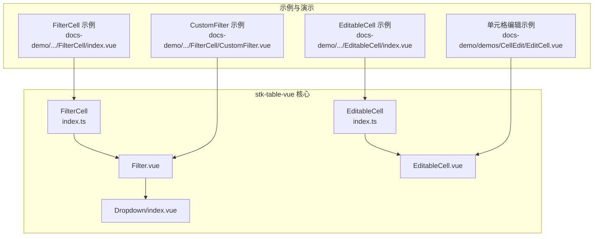
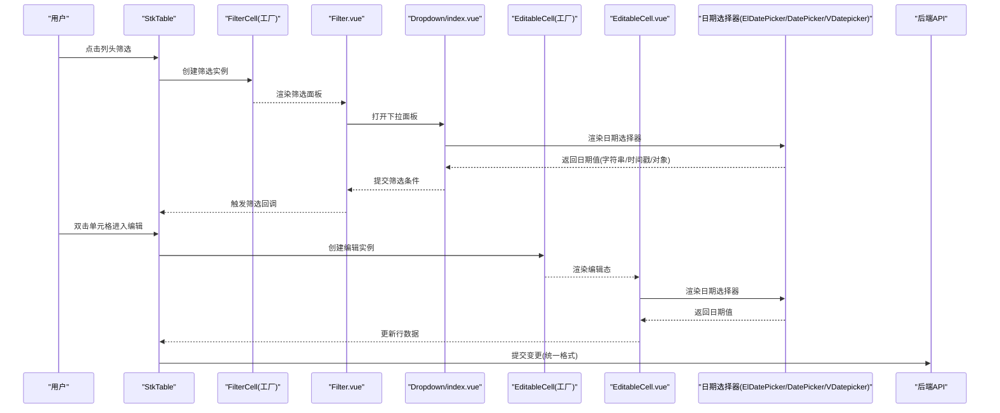
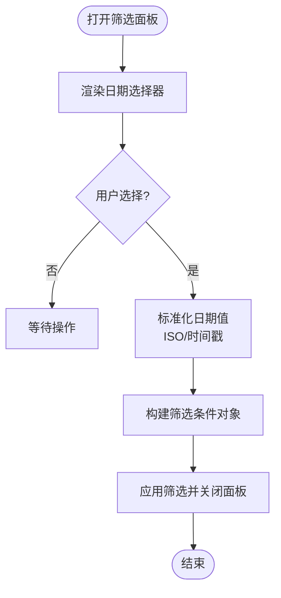
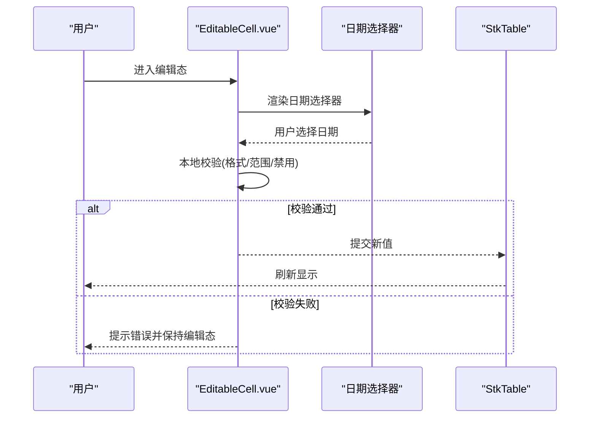
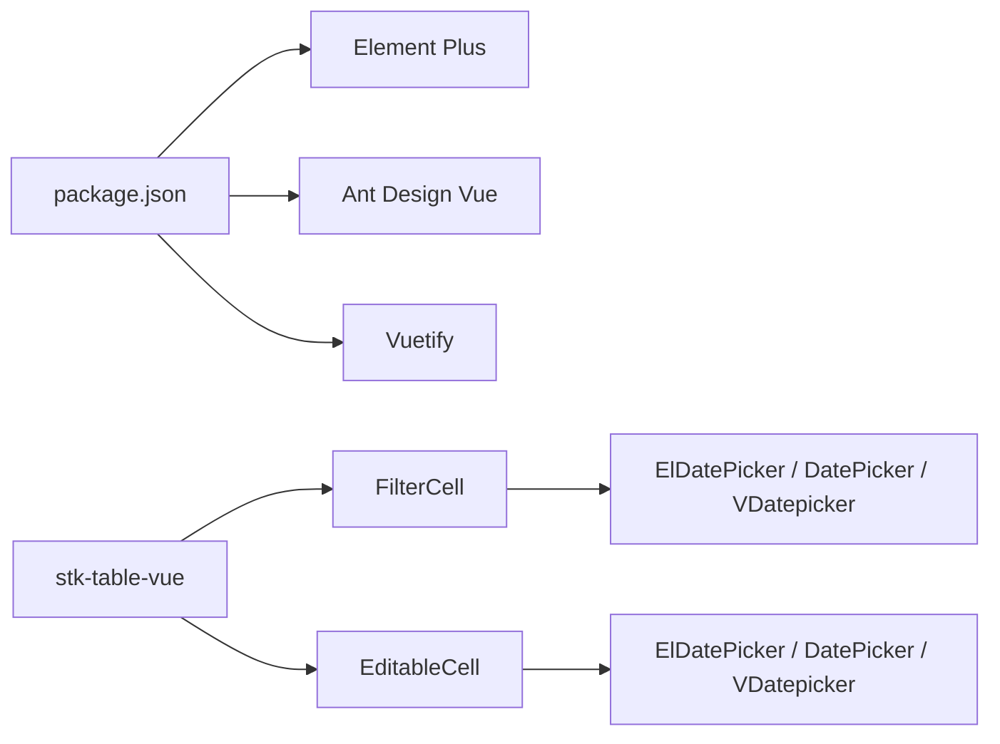

# 日期选择器集成

<cite>
**本文引用的文件**   
- [src/StkTable/custom-cells/FilterCell/index.ts](file://src/StkTable/custom-cells/FilterCell/index.ts)
- [src/StkTable/custom-cells/FilterCell/Filter.vue](file://src/StkTable/custom-cells/FilterCell/Filter.vue)
- [src/StkTable/custom-cells/FilterCell/Dropdown/index.vue](file://src/StkTable/custom-cells/FilterCell/Dropdown/index.vue)
- [src/StkTable/custom-cells/EditableCell/index.ts](file://src/StkTable/custom-cells/EditableCell/index.ts)
- [src/StkTable/custom-cells/EditableCell/EditableCell.vue](file://src/StkTable/custom-cells/EditableCell/EditableCell.vue)
- [docs-demo/advanced/custom-cells/FilterCell/index.vue](file://docs-demo/advanced/custom-cells/FilterCell/index.vue)
- [docs-demo/advanced/custom-cells/FilterCell/CustomFilter.vue](file://docs-demo/advanced/custom-cells/FilterCell/CustomFilter.vue)
- [docs-demo/advanced/custom-cells/EditableCell/index.vue](file://docs-demo/advanced/custom-cells/EditableCell/index.vue)
- [docs-demo/demos/CellEdit/EditCell.vue](file://docs-demo/demos/CellEdit/EditCell.vue)
- [package.json](file://package.json)
</cite>

## 目录
1. [简介](#简介)
2. [项目结构](#项目结构)
3. [核心组件](#核心组件)
4. [架构总览](#架构总览)
5. [详细组件分析](#详细组件分析)
6. [依赖关系分析](#依赖关系分析)
7. [性能考虑](#性能考虑)
8. [故障排查指南](#故障排查指南)
9. [结论](#结论)
10. [附录](#附录)

## 简介
本文件面向在 stk-table-vue 中集成各类日期选择器的开发者，目标是实现单元格日期编辑与筛选功能。内容覆盖：
- 与 Element Plus ElDatePicker、Ant Design Vue DatePicker、Vuetify VDatepicker 的集成方式
- 单元格编辑（EditableCell）与筛选（FilterCell）中的日期处理
- 日期格式配置（输入格式、显示格式、时区处理）
- 高级能力：范围选择、禁用特定日期、最小/最大日期限制
- 数据序列化/反序列化以及与后端 API 的数据格式转换

## 项目结构
stk-table-vue 将“自定义单元格”以插件化形式提供，其中 FilterCell 与 EditableCell 是扩展表格能力的两个关键入口。示例位于 docs-demo 中，便于快速参考与复用。

图表来源 
- [src/StkTable/custom-cells/FilterCell/index.ts](file://src/StkTable/custom-cells/FilterCell/index.ts)
- [src/StkTable/custom-cells/FilterCell/Filter.vue](file://src/StkTable/custom-cells/FilterCell/Filter.vue)
- [src/StkTable/custom-cells/FilterCell/Dropdown/index.vue](file://src/StkTable/custom-cells/FilterCell/Dropdown/index.vue)
- [src/StkTable/custom-cells/EditableCell/index.ts](file://src/StkTable/custom-cells/EditableCell/index.ts)
- [src/StkTable/custom-cells/EditableCell/EditableCell.vue](file://src/StkTable/custom-cells/EditableCell/EditableCell.vue)
- [docs-demo/advanced/custom-cells/FilterCell/index.vue](file://docs-demo/advanced/custom-cells/FilterCell/index.vue)
- [docs-demo/advanced/custom-cells/FilterCell/CustomFilter.vue](file://docs-demo/advanced/custom-cells/FilterCell/CustomFilter.vue)
- [docs-demo/advanced/custom-cells/EditableCell/index.vue](file://docs-demo/advanced/custom-cells/EditableCell/index.vue)
- [docs-demo/demos/CellEdit/EditCell.vue](file://docs-demo/demos/CellEdit/EditCell.vue)

章节来源
- [src/StkTable/custom-cells/FilterCell/index.ts](file://src/StkTable/custom-cells/FilterCell/index.ts)
- [src/StkTable/custom-cells/FilterCell/Filter.vue](file://src/StkTable/custom-cells/FilterCell/Filter.vue)
- [src/StkTable/custom-cells/FilterCell/Dropdown/index.vue](file://src/StkTable/custom-cells/FilterCell/Dropdown/index.vue)
- [src/StkTable/custom-cells/EditableCell/index.ts](file://src/StkTable/custom-cells/EditableCell/index.ts)
- [src/StkTable/custom-cells/EditableCell/EditableCell.vue](file://src/StkTable/custom-cells/EditableCell/EditableCell.vue)
- [docs-demo/advanced/custom-cells/FilterCell/index.vue](file://docs-demo/advanced/custom-cells/FilterCell/index.vue)
- [docs-demo/advanced/custom-cells/FilterCell/CustomFilter.vue](file://docs-demo/advanced/custom-cells/FilterCell/CustomFilter.vue)
- [docs-demo/advanced/custom-cells/EditableCell/index.vue](file://docs-demo/advanced/custom-cells/EditableCell/index.vue)
- [docs-demo/demos/CellEdit/EditCell.vue](file://docs-demo/demos/CellEdit/EditCell.vue)

## 核心组件
- FilterCell：用于列头筛选面板，支持通过下拉面板渲染自定义筛选控件（如日期范围选择）。
- EditableCell：用于单元格内联编辑，支持将第三方日期选择器嵌入编辑态。

两者均通过“工厂函数 + Vue 组件”的方式暴露，便于在列定义中按需启用。

章节来源
- [src/StkTable/custom-cells/FilterCell/index.ts](file://src/StkTable/custom-cells/FilterCell/index.ts)
- [src/StkTable/custom-cells/FilterCell/Filter.vue](file://src/StkTable/custom-cells/FilterCell/Filter.vue)
- [src/StkTable/custom-cells/EditableCell/index.ts](file://src/StkTable/custom-cells/EditableCell/index.ts)
- [src/StkTable/custom-cells/EditableCell/EditableCell.vue](file://src/StkTable/custom-cells/EditableCell/EditableCell.vue)

## 架构总览
下图展示了从列定义到筛选面板与编辑单元格的调用链，以及日期选择器与数据格式的交互点。

图表来源 
- [src/StkTable/custom-cells/FilterCell/index.ts](file://src/StkTable/custom-cells/FilterCell/index.ts)
- [src/StkTable/custom-cells/FilterCell/Filter.vue](file://src/StkTable/custom-cells/FilterCell/Filter.vue)
- [src/StkTable/custom-cells/FilterCell/Dropdown/index.vue](file://src/StkTable/custom-cells/FilterCell/Dropdown/index.vue)
- [src/StkTable/custom-cells/EditableCell/index.ts](file://src/StkTable/custom-cells/EditableCell/index.ts)
- [src/StkTable/custom-cells/EditableCell/EditableCell.vue](file://src/StkTable/custom-cells/EditableCell/EditableCell.vue)

## 详细组件分析

### FilterCell 集成日期筛选
- 目标：在列头筛选面板中集成日期选择器，支持单值或范围筛选。
- 关键点：
  - 使用 FilterCell 工厂函数注册列筛选。
  - 在 Filter.vue 或自定义 CustomFilter 中引入第三方日期组件。
  - 将日期选择器的值转换为统一的筛选条件对象（例如 { field, operator, value }）。
  - 注意日期格式与时区：建议内部统一为 ISO 字符串或时间戳，再根据后端要求转换。

图表来源 
- [src/StkTable/custom-cells/FilterCell/Filter.vue](file://src/StkTable/custom-cells/FilterCell/Filter.vue)
- [src/StkTable/custom-cells/FilterCell/Dropdown/index.vue](file://src/StkTable/custom-cells/FilterCell/Dropdown/index.vue)
- [docs-demo/advanced/custom-cells/FilterCell/CustomFilter.vue](file://docs-demo/advanced/custom-cells/FilterCell/CustomFilter.vue)

章节来源
- [src/StkTable/custom-cells/FilterCell/index.ts](file://src/StkTable/custom-cells/FilterCell/index.ts)
- [src/StkTable/custom-cells/FilterCell/Filter.vue](file://src/StkTable/custom-cells/FilterCell/Filter.vue)
- [src/StkTable/custom-cells/FilterCell/Dropdown/index.vue](file://src/StkTable/custom-cells/FilterCell/Dropdown/index.vue)
- [docs-demo/advanced/custom-cells/FilterCell/index.vue](file://docs-demo/advanced/custom-cells/FilterCell/index.vue)
- [docs-demo/advanced/custom-cells/FilterCell/CustomFilter.vue](file://docs-demo/advanced/custom-cells/FilterCell/CustomFilter.vue)

### EditableCell 集成日期编辑
- 目标：在单元格编辑态中嵌入日期选择器，完成数据的就地修改。
- 关键点：
  - 使用 EditableCell 工厂函数注册可编辑列。
  - 在 EditableCell.vue 或自定义编辑组件中引入第三方日期组件。
  - 双向绑定编辑值，并在失焦或确认时提交更新。
  - 对日期进行校验（必填、范围、禁用日期等），失败则阻止提交。

图表来源 
- [src/StkTable/custom-cells/EditableCell/EditableCell.vue](file://src/StkTable/custom-cells/EditableCell/EditableCell.vue)
- [docs-demo/advanced/custom-cells/EditableCell/index.vue](file://docs-demo/advanced/custom-cells/EditableCell/index.vue)
- [docs-demo/demos/CellEdit/EditCell.vue](file://docs-demo/demos/CellEdit/EditCell.vue)

章节来源
- [src/StkTable/custom-cells/EditableCell/index.ts](file://src/StkTable/custom-cells/EditableCell/index.ts)
- [src/StkTable/custom-cells/EditableCell/EditableCell.vue](file://src/StkTable/custom-cells/EditableCell/EditableCell.vue)
- [docs-demo/advanced/custom-cells/EditableCell/index.vue](file://docs-demo/advanced/custom-cells/EditableCell/index.vue)
- [docs-demo/demos/CellEdit/EditCell.vue](file://docs-demo/demos/CellEdit/EditCell.vue)

### 日期格式与时区处理策略
- 输入格式：由日期选择器决定（如 YYYY-MM-DD、YYYY-MM-DD HH:mm:ss）。
- 显示格式：建议在展示层格式化，避免污染数据模型。
- 存储格式：推荐统一为 ISO 字符串或时间戳，减少歧义。
- 时区处理：
  - 若后端使用 UTC 时间戳，前端统一按 UTC 转换后再发送。
  - 若后端使用带时区的 ISO 字符串，确保客户端与服务端时区一致或使用固定偏移。
  - 对于“仅日期”场景，明确是否包含时分秒（通常置零），避免跨日边界问题。

章节来源
- [src/StkTable/custom-cells/FilterCell/Filter.vue](file://src/StkTable/custom-cells/FilterCell/Filter.vue)
- [src/StkTable/custom-cells/EditableCell/EditableCell.vue](file://src/StkTable/custom-cells/EditableCell/EditableCell.vue)

### 高级功能：范围选择、禁用日期、最小/最大限制
- 范围选择：在 FilterCell 中使用范围型日期组件，输出 [start, end] 数组；在 EditableCell 中可使用单值或范围（视业务而定）。
- 禁用日期：通过日期选择器的 disabled-date 或等效属性限制不可选日期（如节假日、已过期日期）。
- 最小/最大日期：通过 min-date/max-date 或等效属性约束可选范围。
- 校验与反馈：在提交前进行二次校验，失败时给出明确提示。

章节来源
- [src/StkTable/custom-cells/FilterCell/Filter.vue](file://src/StkTable/custom-cells/FilterCell/Filter.vue)
- [src/StkTable/custom-cells/EditableCell/EditableCell.vue](file://src/StkTable/custom-cells/EditableCell/EditableCell.vue)
- [docs-demo/advanced/custom-cells/FilterCell/CustomFilter.vue](file://docs-demo/advanced/custom-cells/FilterCell/CustomFilter.vue)

### 与后端 API 的数据格式转换
- 统一入参：在提交前将日期值转换为后端期望的格式（字符串或时间戳）。
- 批量转换：对整行数据进行映射，保证字段一致性。
- 幂等性：对空值、无效值进行清理，避免脏数据入库。
- 错误处理：捕获后端返回的格式错误，回退到默认值或提示用户修正。

章节来源
- [src/StkTable/custom-cells/EditableCell/EditableCell.vue](file://src/StkTable/custom-cells/EditableCell/EditableCell.vue)
- [src/StkTable/custom-cells/FilterCell/Filter.vue](file://src/StkTable/custom-cells/FilterCell/Filter.vue)

## 依赖关系分析
- 框架依赖：Vue 3 与 TypeScript。
- UI 库依赖：Element Plus、Ant Design Vue、Vuetify（按需引入对应日期组件）。
- 包管理：通过 package.json 声明依赖版本，确保日期组件与主框架兼容。

图表来源 
- [package.json](file://package.json)
- [src/StkTable/custom-cells/FilterCell/index.ts](file://src/StkTable/custom-cells/FilterCell/index.ts)
- [src/StkTable/custom-cells/EditableCell/index.ts](file://src/StkTable/custom-cells/EditableCell/index.ts)

章节来源
- [package.json](file://package.json)
- [src/StkTable/custom-cells/FilterCell/index.ts](file://src/StkTable/custom-cells/FilterCell/index.ts)
- [src/StkTable/custom-cells/EditableCell/index.ts](file://src/StkTable/custom-cells/EditableCell/index.ts)

## 性能考虑
- 虚拟滚动：大列表下结合表格虚拟滚动，避免一次性渲染过多日期组件。
- 懒加载：仅在单元格进入可视区域或进入编辑态时挂载日期组件。
- 防抖与节流：筛选面板提交与搜索接口调用需加防抖，避免频繁请求。
- 内存管理：及时销毁弹窗与监听器，防止内存泄漏。

[本节为通用指导，不直接分析具体文件]

## 故障排查指南
- 日期格式不一致：检查输入/显示/存储三处格式是否统一，必要时增加转换器。
- 时区偏差：确认前后端时区策略，优先使用时间戳或带时区的 ISO 字符串。
- 禁用日期不生效：核对日期组件的属性名与值类型是否正确。
- 范围选择结果异常：确认起止时间的时分秒设置（通常起始置 00:00:00，结束置 23:59:59）。
- 提交失败：查看网络响应与字段映射，定位非法值或缺失字段。

章节来源
- [src/StkTable/custom-cells/FilterCell/Filter.vue](file://src/StkTable/custom-cells/FilterCell/Filter.vue)
- [src/StkTable/custom-cells/EditableCell/EditableCell.vue](file://src/StkTable/custom-cells/EditableCell/EditableCell.vue)

## 结论
通过在 FilterCell 与 EditableCell 中正确集成第三方日期选择器，并统一日期格式与时区策略，可实现稳定可靠的日期编辑与筛选体验。配合范围选择、禁用日期、最小/最大限制等高级能力，可满足复杂业务需求。建议在项目中建立统一的日期转换工具与校验规则，确保前后端数据一致性。

[本节为总结性内容，不直接分析具体文件]

## 附录
- 示例参考路径：
  - FilterCell 示例：[docs-demo/advanced/custom-cells/FilterCell/index.vue](file://docs-demo/advanced/custom-cells/FilterCell/index.vue)
  - 自定义筛选组件：[docs-demo/advanced/custom-cells/FilterCell/CustomFilter.vue](file://docs-demo/advanced/custom-cells/FilterCell/CustomFilter.vue)
  - EditableCell 示例：[docs-demo/advanced/custom-cells/EditableCell/index.vue](file://docs-demo/advanced/custom-cells/EditableCell/index.vue)
  - 单元格编辑示例：[docs-demo/demos/CellEdit/EditCell.vue](file://docs-demo/demos/CellEdit/EditCell.vue)

[本节为补充信息，不直接分析具体文件]