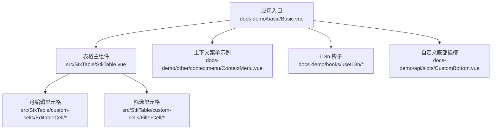
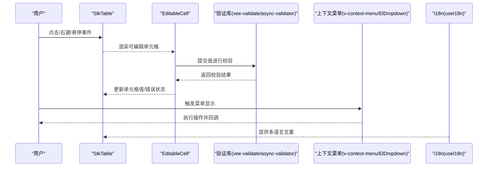
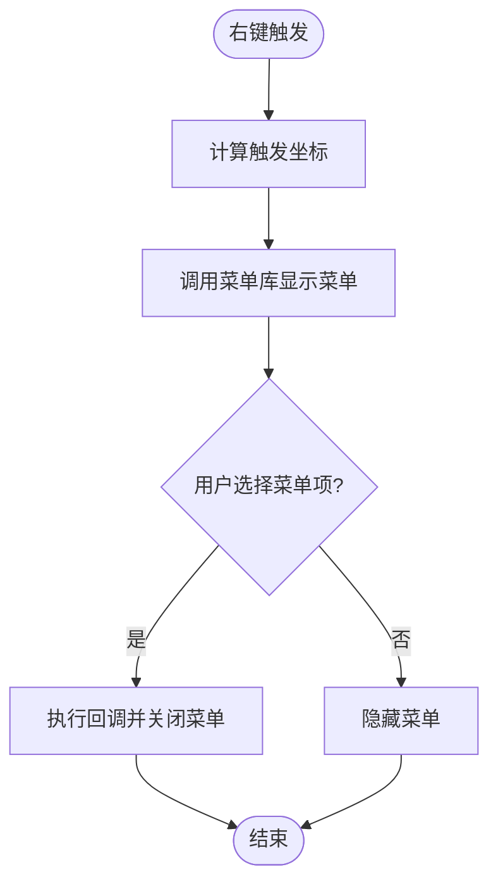
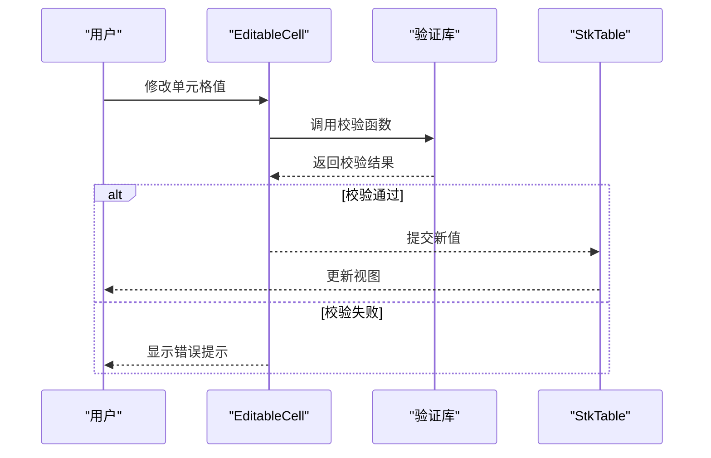
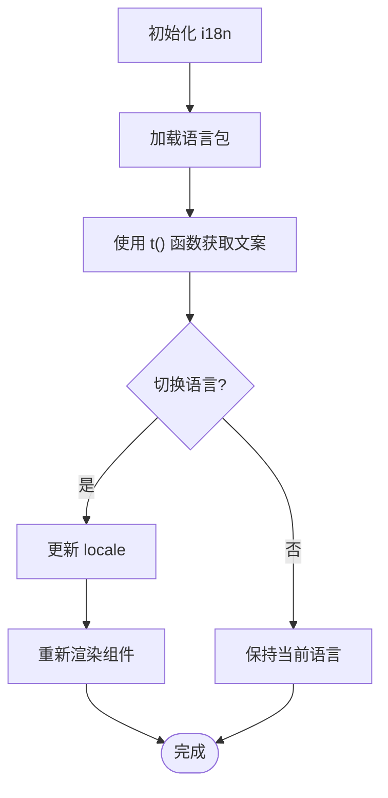
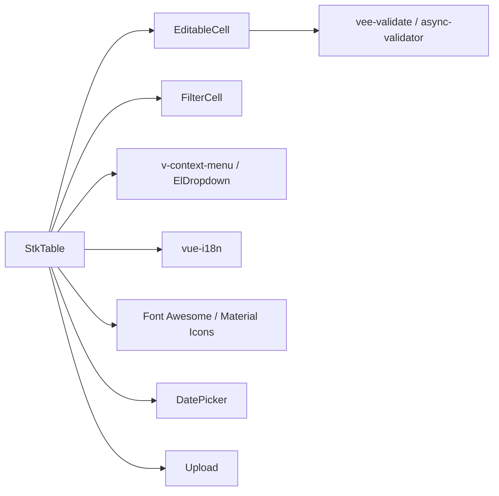

# 第三方库集成

<cite>
**本文引用的文件**   
- [docs-demo/other/contextmenu/ContextMenu.vue](file://docs-demo/other/contextmenu/ContextMenu.vue)
- [docs-demo/demos/CellEdit/index.vue](file://docs-demo/demos/CellEdit/index.vue)
- [docs-demo/demos/CellEdit/EditCell.vue](file://docs-demo/demos/CellEdit/EditCell.vue)
- [src/StkTable/custom-cells/EditableCell/index.ts](file://src/StkTable/custom-cells/EditableCell/index.ts)
- [src/StkTable/custom-cells/EditableCell/EditableCell.vue](file://src/StkTable/custom-cells/EditableCell/EditableCell.vue)
- [src/StkTable/custom-cells/FilterCell/index.ts](file://src/StkTable/custom-cells/FilterCell/index.ts)
- [src/StkTable/custom-cells/FilterCell/Filter.vue](file://src/StkTable/custom-cells/FilterCell/Filter.vue)
- [docs-src/main/other/contextmenu.md](file://docs-src/main/other/contextmenu.md)
- [docs-src/en/main/other/contextmenu.md](file://docs-src/en/main/other/contextmenu.md)
- [docs-src/ja/main/other/contextmenu.md](file://docs-src/ja/main/other/contextmenu.md)
- [docs-src/ko/main/other/contextmenu.md](file://docs-src/ko/main/other/contextmenu.md)
- [docs-demo/hooks/useI18n/index.ts](file://docs-demo/hooks/useI18n/index.ts)
- [docs-demo/hooks/useI18n/zh.ts](file://docs-demo/hooks/useI18n/zh.ts)
- [docs-demo/hooks/useI18n/en.ts](file://docs-demo/hooks/useI18n/en.ts)
- [docs-demo/hooks/useI18n/ja.ts](file://docs-demo/hooks/useI18n/ja.ts)
- [docs-demo/hooks/useI18n/ko.ts](file://docs-demo/hooks/useI18n/ko.ts)
- [docs-demo/basic/Basic.vue](file://docs-demo/basic/Basic.vue)
- [docs-demo/api/slots/CustomBottom.vue](file://docs-demo/api/slots/CustomBottom.vue)
- [package.json](file://package.json)
</cite>

## 目录
1. [简介](#简介)
2. [项目结构](#项目结构)
3. [核心组件与扩展点](#核心组件与扩展点)
4. [架构总览](#架构总览)
5. [详细集成指南](#详细集成指南)
6. [依赖关系分析](#依赖关系分析)
7. [性能注意事项](#性能注意事项)
8. [故障排查指南](#故障排查指南)
9. [结论](#结论)
10. [附录](#附录)

## 简介
本指南面向使用 stk-table-vue 的开发者，提供与第三方库集成的系统化方案。内容覆盖：
- 上下文菜单（右键菜单）：基于 v-context-menu、Element Plus ElDropdown 等
- 表单验证：基于 vee-validate、async-validator 等
- 图标库：Font Awesome、Material Icons 等
- 国际化 i18n：多语言切换与文案管理
- 常用组件：日期选择器、文件上传器等

文档以仓库内现有示例为基础，结合通用最佳实践，给出可落地的集成模式与配置说明。

## 项目结构
stk-table-vue 在 docs-demo 中提供了丰富的示例，包括单元格编辑、自定义底部插槽、i18n 钩子以及上下文菜单示例。这些示例为第三方库集成提供了参考实现。

图表来源
- [docs-demo/basic/Basic.vue](file://docs-demo/basic/Basic.vue)
- [src/StkTable/StkTable.vue](file://src/StkTable/StkTable.vue)
- [src/StkTable/custom-cells/EditableCell/index.ts](file://src/StkTable/custom-cells/EditableCell/index.ts)
- [src/StkTable/custom-cells/FilterCell/index.ts](file://src/StkTable/custom-cells/FilterCell/index.ts)
- [docs-demo/other/contextmenu/ContextMenu.vue](file://docs-demo/other/contextmenu/ContextMenu.vue)
- [docs-demo/hooks/useI18n/index.ts](file://docs-demo/hooks/useI18n/index.ts)
- [docs-demo/api/slots/CustomBottom.vue](file://docs-demo/api/slots/CustomBottom.vue)

章节来源
- [docs-demo/basic/Basic.vue](file://docs-demo/basic/Basic.vue)
- [docs-demo/other/contextmenu/ContextMenu.vue](file://docs-demo/other/contextmenu/ContextMenu.vue)
- [docs-demo/hooks/useI18n/index.ts](file://docs-demo/hooks/useI18n/index.ts)
- [docs-demo/api/slots/CustomBottom.vue](file://docs-demo/api/slots/CustomBottom.vue)

## 核心组件与扩展点
- 可编辑单元格（EditableCell）：用于单元格内嵌输入控件，便于集成表单验证与第三方编辑器
- 筛选单元格（FilterCell）：用于列级筛选，可集成下拉、日期范围等筛选器
- 自定义插槽（如 CustomBottom）：用于在表格底部或头部插入自定义 UI
- 上下文菜单示例（ContextMenu）：展示如何在表格区域触发并定位菜单

章节来源
- [src/StkTable/custom-cells/EditableCell/index.ts](file://src/StkTable/custom-cells/EditableCell/index.ts)
- [src/StkTable/custom-cells/EditableCell/EditableCell.vue](file://src/StkTable/custom-cells/EditableCell/EditableCell.vue)
- [src/StkTable/custom-cells/FilterCell/index.ts](file://src/StkTable/custom-cells/FilterCell/index.ts)
- [src/StkTable/custom-cells/FilterCell/Filter.vue](file://src/StkTable/custom-cells/FilterCell/Filter.vue)
- [docs-demo/api/slots/CustomBottom.vue](file://docs-demo/api/slots/CustomBottom.vue)
- [docs-demo/other/contextmenu/ContextMenu.vue](file://docs-demo/other/contextmenu/ContextMenu.vue)

## 架构总览
下图展示了 stk-table-vue 与第三方库的典型集成路径：表格通过插槽与自定义单元格暴露扩展点，业务侧在这些扩展点中引入第三方库，完成交互与数据流闭环。

图表来源
- [src/StkTable/custom-cells/EditableCell/EditableCell.vue](file://src/StkTable/custom-cells/EditableCell/EditableCell.vue)
- [src/StkTable/custom-cells/EditableCell/index.ts](file://src/StkTable/custom-cells/EditableCell/index.ts)
- [docs-demo/other/contextmenu/ContextMenu.vue](file://docs-demo/other/contextmenu/ContextMenu.vue)
- [docs-demo/hooks/useI18n/index.ts](file://docs-demo/hooks/useI18n/index.ts)

## 详细集成指南

### 一、上下文菜单（右键菜单）集成
目标：在表格任意位置（行、单元格、表头）触发上下文菜单，支持定位与事件回调。

推荐方案
- 使用 v-context-menu：轻量、易定制，适合复杂菜单项
- 使用 Element Plus ElDropdown：与 Element 生态一致，样式统一

关键步骤
- 在表格容器上监听右键事件，计算触发坐标
- 将坐标传递给菜单库，控制菜单显示位置
- 在菜单项回调中获取当前行/列信息，执行业务逻辑

示例参考
- 上下文菜单示例组件：[docs-demo/other/contextmenu/ContextMenu.vue](file://docs-demo/other/contextmenu/ContextMenu.vue)
- 文档说明：[docs-src/main/other/contextmenu.md](file://docs-src/main/other/contextmenu.md)

图表来源
- [docs-demo/other/contextmenu/ContextMenu.vue](file://docs-demo/other/contextmenu/ContextMenu.vue)

章节来源
- [docs-demo/other/contextmenu/ContextMenu.vue](file://docs-demo/other/contextmenu/ContextMenu.vue)
- [docs-src/main/other/contextmenu.md](file://docs-src/main/other/contextmenu.md)
- [docs-src/en/main/other/contextmenu.md](file://docs-src/en/main/other/contextmenu.md)
- [docs-src/ja/main/other/contextmenu.md](file://docs-src/ja/main/other/contextmenu.md)
- [docs-src/ko/main/other/contextmenu.md](file://docs-src/ko/main/other/contextmenu.md)

### 二、表单验证（单元格编辑）集成
目标：在单元格编辑时进行实时校验，支持异步校验与错误提示。

推荐方案
- vee-validate：声明式校验规则，易于与 Vue 表单集成
- async-validator：轻量、高性能，适合复杂字段校验

关键步骤
- 在 EditableCell 中嵌入输入控件（如 Input、Select）
- 绑定值变化事件，触发校验函数
- 根据校验结果更新单元格状态（成功/失败），并显示错误信息

示例参考
- 单元格编辑示例：[docs-demo/demos/CellEdit/index.vue](file://docs-demo/demos/CellEdit/index.vue)
- 编辑单元格组件：[docs-demo/demos/CellEdit/EditCell.vue](file://docs-demo/demos/CellEdit/EditCell.vue)
- 可编辑单元格实现：[src/StkTable/custom-cells/EditableCell/index.ts](file://src/StkTable/custom-cells/EditableCell/index.ts)、[src/StkTable/custom-cells/EditableCell/EditableCell.vue](file://src/StkTable/custom-cells/EditableCell/EditableCell.vue)

图表来源
- [docs-demo/demos/CellEdit/index.vue](file://docs-demo/demos/CellEdit/index.vue)
- [docs-demo/demos/CellEdit/EditCell.vue](file://docs-demo/demos/CellEdit/EditCell.vue)
- [src/StkTable/custom-cells/EditableCell/index.ts](file://src/StkTable/custom-cells/EditableCell/index.ts)
- [src/StkTable/custom-cells/EditableCell/EditableCell.vue](file://src/StkTable/custom-cells/EditableCell/EditableCell.vue)

章节来源
- [docs-demo/demos/CellEdit/index.vue](file://docs-demo/demos/CellEdit/index.vue)
- [docs-demo/demos/CellEdit/EditCell.vue](file://docs-demo/demos/CellEdit/EditCell.vue)
- [src/StkTable/custom-cells/EditableCell/index.ts](file://src/StkTable/custom-cells/EditableCell/index.ts)
- [src/StkTable/custom-cells/EditableCell/EditableCell.vue](file://src/StkTable/custom-cells/EditableCell/EditableCell.vue)

### 三、图标库集成
目标：在表格按钮、排序图标、展开图标等处使用统一图标库。

推荐方案
- Font Awesome：丰富图标集合，按需加载
- Material Icons：Google 风格图标，简洁易用

关键步骤
- 安装并引入图标库
- 在表格插槽或自定义单元格中使用图标组件
- 确保图标尺寸与主题一致

示例参考
- 基础示例入口：[docs-demo/basic/Basic.vue](file://docs-demo/basic/Basic.vue)

章节来源
- [docs-demo/basic/Basic.vue](file://docs-demo/basic/Basic.vue)

### 四、国际化（i18n）集成
目标：支持多语言切换，统一管理表格文案。

推荐方案
- vue-i18n：官方推荐，功能完善
- 或使用项目内 useI18n 钩子

关键步骤
- 初始化 i18n 实例，注册语言包
- 在表格文案处使用翻译函数
- 提供语言切换入口，动态更新当前语言

示例参考
- i18n 钩子实现：[docs-demo/hooks/useI18n/index.ts](file://docs-demo/hooks/useI18n/index.ts)
- 中文语言包：[docs-demo/hooks/useI18n/zh.ts](file://docs-demo/hooks/useI18n/zh.ts)
- 英文语言包：[docs-demo/hooks/useI18n/en.ts](file://docs-demo/hooks/useI18n/en.ts)
- 日文语言包：[docs-demo/hooks/useI18n/ja.ts](file://docs-demo/hooks/useI18n/ja.ts)
- 韩文语言包：[docs-demo/hooks/useI18n/ko.ts](file://docs-demo/hooks/useI18n/ko.ts)

图表来源
- [docs-demo/hooks/useI18n/index.ts](file://docs-demo/hooks/useI18n/index.ts)
- [docs-demo/hooks/useI18n/zh.ts](file://docs-demo/hooks/useI18n/zh.ts)
- [docs-demo/hooks/useI18n/en.ts](file://docs-demo/hooks/useI18n/en.ts)
- [docs-demo/hooks/useI18n/ja.ts](file://docs-demo/hooks/useI18n/ja.ts)
- [docs-demo/hooks/useI18n/ko.ts](file://docs-demo/hooks/useI18n/ko.ts)

章节来源
- [docs-demo/hooks/useI18n/index.ts](file://docs-demo/hooks/useI18n/index.ts)
- [docs-demo/hooks/useI18n/zh.ts](file://docs-demo/hooks/useI18n/zh.ts)
- [docs-demo/hooks/useI18n/en.ts](file://docs-demo/hooks/useI18n/en.ts)
- [docs-demo/hooks/useI18n/ja.ts](file://docs-demo/hooks/useI18n/ja.ts)
- [docs-demo/hooks/useI18n/ko.ts](file://docs-demo/hooks/useI18n/ko.ts)

### 五、日期选择器集成
目标：在单元格或筛选器中集成日期选择器，支持单日期、日期范围等。

推荐方案
- Element Plus DatePicker：与 Element 生态一致
- Vant Picker：移动端友好

关键步骤
- 在 EditableCell 或 FilterCell 中嵌入日期选择器
- 绑定值变化事件，处理格式化与校验
- 注意虚拟滚动下的渲染性能

示例参考
- 可编辑单元格：[src/StkTable/custom-cells/EditableCell/EditableCell.vue](file://src/StkTable/custom-cells/EditableCell/EditableCell.vue)
- 筛选单元格：[src/StkTable/custom-cells/FilterCell/Filter.vue](file://src/StkTable/custom-cells/FilterCell/Filter.vue)

章节来源
- [src/StkTable/custom-cells/EditableCell/EditableCell.vue](file://src/StkTable/custom-cells/EditableCell/EditableCell.vue)
- [src/StkTable/custom-cells/FilterCell/Filter.vue](file://src/StkTable/custom-cells/FilterCell/Filter.vue)

### 六、文件上传器集成
目标：在单元格或表格底部集成文件上传功能。

推荐方案
- Element Plus Upload：功能完整，支持预览与进度
- Vant Uploader：移动端体验佳

关键步骤
- 在 CustomBottom 插槽或 EditableCell 中嵌入上传组件
- 处理文件选择、上传进度、错误提示
- 与表格数据联动，展示上传状态

示例参考
- 自定义底部插槽：[docs-demo/api/slots/CustomBottom.vue](file://docs-demo/api/slots/CustomBottom.vue)

章节来源
- [docs-demo/api/slots/CustomBottom.vue](file://docs-demo/api/slots/CustomBottom.vue)

## 依赖关系分析
stk-table-vue 本身不强制依赖第三方库，集成方式灵活。以下为常见依赖关系图：

图表来源
- [src/StkTable/custom-cells/EditableCell/index.ts](file://src/StkTable/custom-cells/EditableCell/index.ts)
- [src/StkTable/custom-cells/FilterCell/index.ts](file://src/StkTable/custom-cells/FilterCell/index.ts)
- [docs-demo/other/contextmenu/ContextMenu.vue](file://docs-demo/other/contextmenu/ContextMenu.vue)
- [docs-demo/hooks/useI18n/index.ts](file://docs-demo/hooks/useI18n/index.ts)

章节来源
- [package.json](file://package.json)

## 性能注意事项
- 虚拟滚动下避免频繁重渲染：尽量使用受控组件，减少不必要的状态更新
- 大列表场景优化：合并校验请求，使用防抖/节流
- 菜单与弹窗层级：合理设置 z-index，避免遮挡问题
- 图标与资源按需加载：减少首屏体积

## 故障排查指南
常见问题与解决思路
- 菜单定位异常：检查坐标计算与父容器 overflow 设置
- 校验不生效：确认绑定值与校验规则是否正确
- i18n 文案未更新：确保 locale 切换后组件重新渲染
- 上传进度卡顿：检查网络请求与状态更新频率

## 结论
通过 stk-table-vue 提供的扩展点，可以灵活集成各类第三方库，实现强大的表格功能。建议遵循以下原则：
- 优先使用插槽与自定义单元格进行集成
- 保持组件职责单一，关注数据流与状态管理
- 注重性能与用户体验，合理使用虚拟滚动与懒加载

## 附录
- 相关文档链接：
  - 上下文菜单文档：[docs-src/main/other/contextmenu.md](file://docs-src/main/other/contextmenu.md)
  - 英文版上下文菜单文档：[docs-src/en/main/other/contextmenu.md](file://docs-src/en/main/other/contextmenu.md)
  - 日文版上下文菜单文档：[docs-src/ja/main/other/contextmenu.md](file://docs-src/ja/main/other/contextmenu.md)
  - 韩文版上下文菜单文档：[docs-src/ko/main/other/contextmenu.md](file://docs-src/ko/main/other/contextmenu.md)