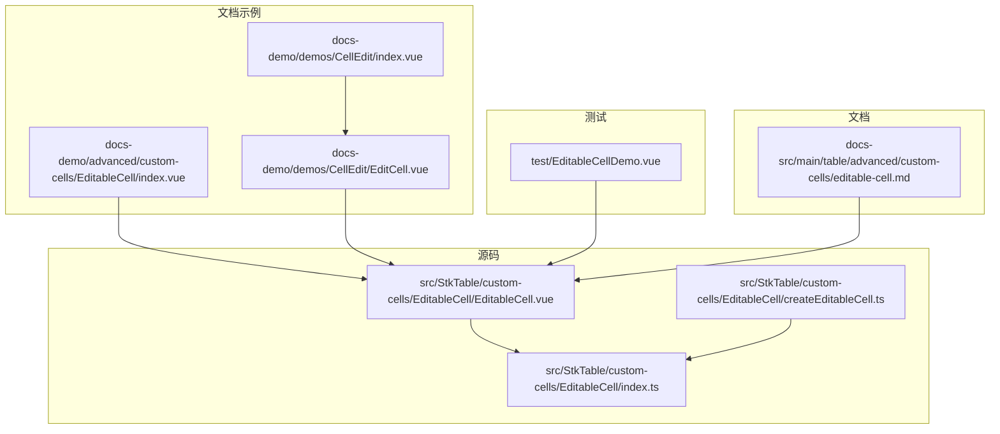
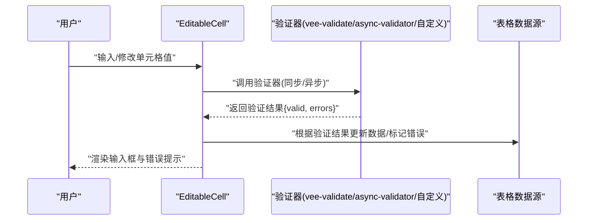
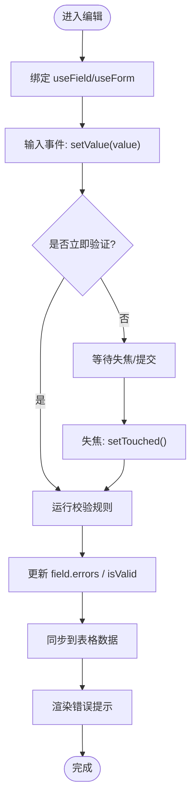
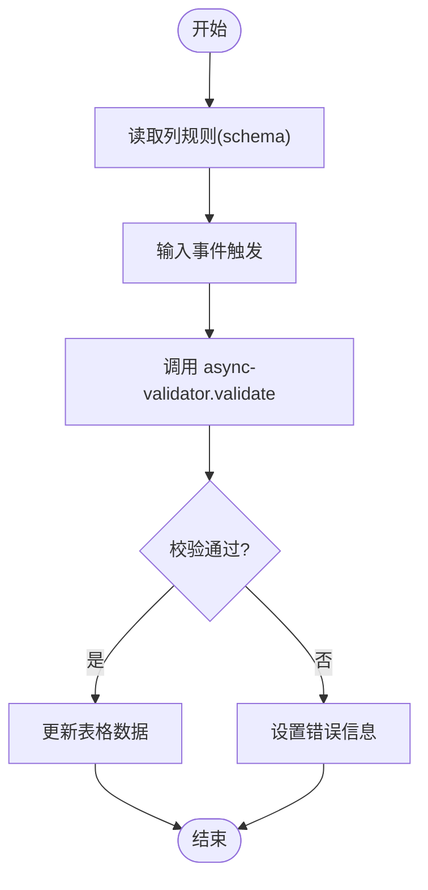
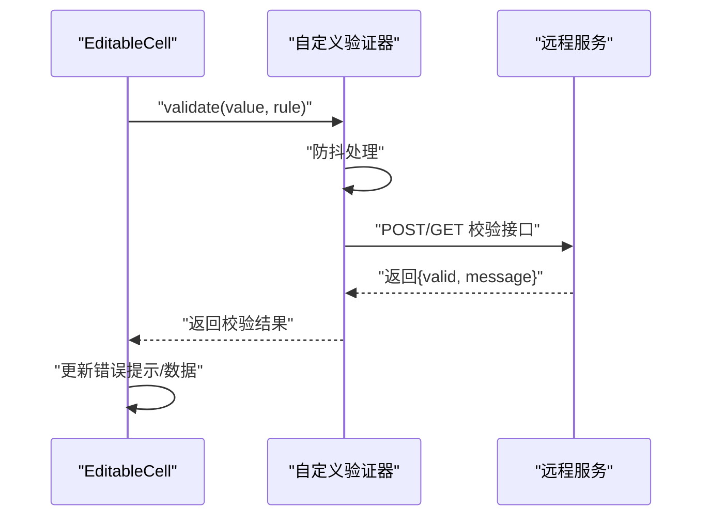
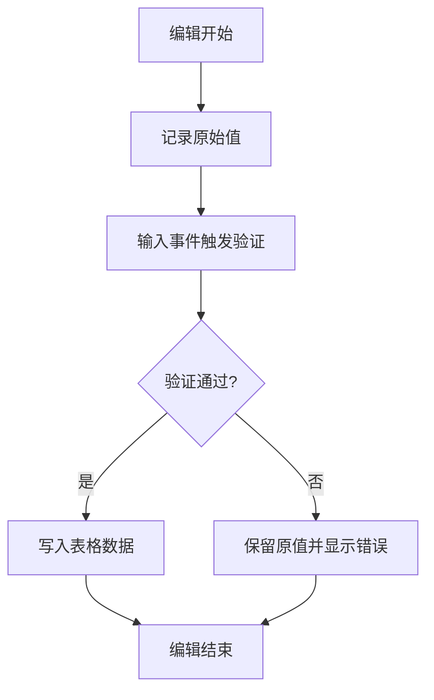
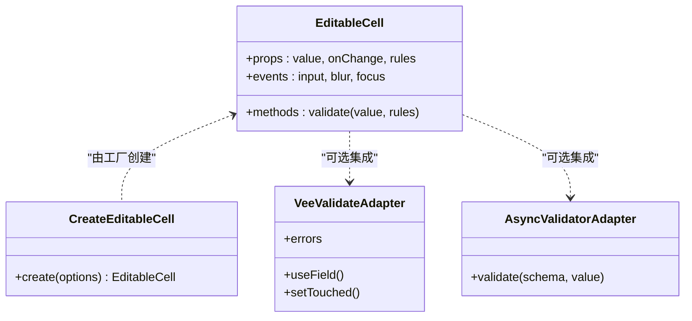

# 表单验证集成

<cite>
**本文引用的文件**   
- [src/StkTable/custom-cells/EditableCell/EditableCell.vue](file://src/StkTable/custom-cells/EditableCell/EditableCell.vue)
- [src/StkTable/custom-cells/EditableCell/createEditableCell.ts](file://src/StkTable/custom-cells/EditableCell/createEditableCell.ts)
- [src/StkTable/custom-cells/EditableCell/index.ts](file://src/StkTable/custom-cells/EditableCell/index.ts)
- [docs-demo/advanced/custom-cells/EditableCell/index.vue](file://docs-demo/advanced/custom-cells/EditableCell/index.vue)
- [docs-demo/demos/CellEdit/EditCell.vue](file://docs-demo/demos/CellEdit/EditCell.vue)
- [docs-demo/demos/CellEdit/index.vue](file://docs-demo/demos/CellEdit/index.vue)
- [test/EditableCellDemo.vue](file://test/EditableCellDemo.vue)
- [docs-src/main/table/advanced/custom-cells/editable-cell.md](file://docs-src/main/table/advanced/custom-cells/editable-cell.md)
</cite>

## 目录
1. [简介](#简介)
2. [项目结构](#项目结构)
3. [核心组件](#核心组件)
4. [架构总览](#架构总览)
5. [详细组件分析](#详细组件分析)
6. [依赖关系分析](#依赖关系分析)
7. [性能考虑](#性能考虑)
8. [故障排查指南](#故障排查指南)
9. [结论](#结论)
10. [附录](#附录)

## 简介
本指南面向在 stk-table-vue 中实现单元格编辑与表单验证集成的开发者，重点覆盖以下主题：
- 与主流表单验证库的集成方案（vee-validate、async-validator、vee-validate 4.x）
- 在 EditableCell 中实现实时数据验证与错误提示
- 验证规则配置（必填、格式、自定义逻辑）
- 异步验证（远程校验、防抖）
- 验证状态与表格数据的同步策略
- 错误显示与清除机制

## 项目结构
stk-table-vue 将可编辑单元格能力封装为“自定义单元格”模式，其中 EditableCell 是官方提供的通用编辑单元格。文档示例与测试用例展示了如何在业务中使用该单元格进行编辑与扩展。

图表来源 
- [src/StkTable/custom-cells/EditableCell/EditableCell.vue](file://src/StkTable/custom-cells/EditableCell/EditableCell.vue)
- [src/StkTable/custom-cells/EditableCell/createEditableCell.ts](file://src/StkTable/custom-cells/EditableCell/createEditableCell.ts)
- [src/StkTable/custom-cells/EditableCell/index.ts](file://src/StkTable/custom-cells/EditableCell/index.ts)
- [docs-demo/advanced/custom-cells/EditableCell/index.vue](file://docs-demo/advanced/custom-cells/EditableCell/index.vue)
- [docs-demo/demos/CellEdit/EditCell.vue](file://docs-demo/demos/CellEdit/EditCell.vue)
- [docs-demo/demos/CellEdit/index.vue](file://docs-demo/demos/CellEdit/index.vue)
- [test/EditableCellDemo.vue](file://test/EditableCellDemo.vue)
- [docs-src/main/table/advanced/custom-cells/editable-cell.md](file://docs-src/main/table/advanced/custom-cells/editable-cell.md)

章节来源
- [src/StkTable/custom-cells/EditableCell/EditableCell.vue](file://src/StkTable/custom-cells/EditableCell/EditableCell.vue)
- [src/StkTable/custom-cells/EditableCell/createEditableCell.ts](file://src/StkTable/custom-cells/EditableCell/createEditableCell.ts)
- [src/StkTable/custom-cells/EditableCell/index.ts](file://src/StkTable/custom-cells/EditableCell/index.ts)
- [docs-demo/advanced/custom-cells/EditableCell/index.vue](file://docs-demo/advanced/custom-cells/EditableCell/index.vue)
- [docs-demo/demos/CellEdit/EditCell.vue](file://docs-demo/demos/CellEdit/EditCell.vue)
- [docs-demo/demos/CellEdit/index.vue](file://docs-demo/demos/CellEdit/index.vue)
- [test/EditableCellDemo.vue](file://test/EditableCellDemo.vue)
- [docs-src/main/table/advanced/custom-cells/editable-cell.md](file://docs-src/main/table/advanced/custom-cells/editable-cell.md)

## 核心组件
- EditableCell.vue：提供单元格编辑的基础能力，包括输入框渲染、值变更事件、焦点管理等。它是集成各类验证器的宿主组件。
- createEditableCell.ts：用于创建或增强可编辑单元格的工厂函数，暴露必要的 props、事件与插槽，便于上层复用。
- index.ts：导出可编辑单元格相关类型与工具，供业务侧按需引入。

章节来源
- [src/StkTable/custom-cells/EditableCell/EditableCell.vue](file://src/StkTable/custom-cells/EditableCell/EditableCell.vue)
- [src/StkTable/custom-cells/EditableCell/createEditableCell.ts](file://src/StkTable/custom-cells/EditableCell/createEditableCell.ts)
- [src/StkTable/custom-cells/EditableCell/index.ts](file://src/StkTable/custom-cells/EditableCell/index.ts)

## 架构总览
下图展示“用户输入 → 验证器 → 表格数据”的数据流与状态流转。无论使用 vee-validate、async-validator 还是自研验证器，核心流程一致：监听输入变化，触发验证，更新验证状态与错误信息，最终同步到表格数据源。

图表来源 
- [src/StkTable/custom-cells/EditableCell/EditableCell.vue](file://src/StkTable/custom-cells/EditableCell/EditableCell.vue)
- [docs-demo/demos/CellEdit/EditCell.vue](file://docs-demo/demos/CellEdit/EditCell.vue)

## 详细组件分析

### EditableCell 与验证集成要点
- 输入事件绑定：在 EditableCell 内部监听输入事件，将新值传递给验证器。
- 验证时机：支持 onInput/onBlur/onSubmit 等时机，建议结合业务选择合适时机。
- 错误展示：通过插槽或外部 UI 组件渲染错误信息；若使用 vee-validate，可直接消费其字段状态。
- 数据同步：验证通过后更新表格数据；失败时保持原值或回滚，并展示错误。

章节来源
- [src/StkTable/custom-cells/EditableCell/EditableCell.vue](file://src/StkTable/custom-cells/EditableCell/EditableCell.vue)
- [docs-demo/advanced/custom-cells/EditableCell/index.vue](file://docs-demo/advanced/custom-cells/EditableCell/index.vue)
- [docs-demo/demos/CellEdit/EditCell.vue](file://docs-demo/demos/CellEdit/EditCell.vue)

### 与 vee-validate 4.x 集成
- 使用 Form + Field 包裹 EditableCell，利用 useField/useForm 管理字段值与校验状态。
- 在 EditableCell 的输入事件中调用 field.setValue，并在 onBlur 时触发 field.setTouched。
- 通过 field.errors 获取错误消息，渲染到单元格下方或悬浮提示。
- 适用于需要统一表单上下文、跨字段联动的场景。

图表来源 
- [docs-demo/demos/CellEdit/EditCell.vue](file://docs-demo/demos/CellEdit/EditCell.vue)
- [docs-src/main/table/advanced/custom-cells/editable-cell.md](file://docs-src/main/table/advanced/custom-cells/editable-cell.md)

章节来源
- [docs-demo/demos/CellEdit/EditCell.vue](file://docs-demo/demos/CellEdit/EditCell.vue)
- [docs-src/main/table/advanced/custom-cells/editable-cell.md](file://docs-src/main/table/advanced/custom-cells/editable-cell.md)

### 与 async-validator 集成
- 定义 schema 规则（required、pattern、message 等），在 EditableCell 的输入事件中调用 validator.validate。
- 对 Promise 返回的结果进行处理：成功则更新数据，失败则设置错误信息。
- 适合轻量级、无需全局表单上下文的场景。

图表来源 
- [docs-demo/demos/CellEdit/EditCell.vue](file://docs-demo/demos/CellEdit/EditCell.vue)

章节来源
- [docs-demo/demos/CellEdit/EditCell.vue](file://docs-demo/demos/CellEdit/EditCell.vue)

### 自定义验证器与远程校验
- 自定义验证器：封装统一的 validate(value, rule) => Promise<{valid, message}>，便于复用。
- 远程校验：在验证器中发起请求，结合防抖避免频繁请求；失败时展示后端返回的错误信息。
- 防抖策略：在 EditableCell 中输入时延迟触发验证，减少网络压力。

图表来源 
- [docs-demo/demos/CellEdit/EditCell.vue](file://docs-demo/demos/CellEdit/EditCell.vue)

章节来源
- [docs-demo/demos/CellEdit/EditCell.vue](file://docs-demo/demos/CellEdit/EditCell.vue)

### 验证状态与表格数据同步
- 同步策略：仅在验证通过时写入表格数据；失败时保留原值并展示错误。
- 撤销/重做：可在编辑前缓存旧值，失败时回滚。
- 批量验证：提交时遍历所有编辑过的单元格，集中验证并汇总错误。

图表来源 
- [test/EditableCellDemo.vue](file://test/EditableCellDemo.vue)

章节来源
- [test/EditableCellDemo.vue](file://test/EditableCellDemo.vue)

### 错误显示与清除机制
- 显示：在 EditableCell 内或外层容器渲染错误文本/图标；可使用 Tooltip 或行内提示。
- 清除：在输入过程中逐步清除错误；或在聚焦/失焦时按策略控制显示。
- 联动：多字段校验时，一个字段错误可能影响其他字段的提示。

章节来源
- [docs-demo/advanced/custom-cells/EditableCell/index.vue](file://docs-demo/advanced/custom-cells/EditableCell/index.vue)
- [docs-demo/demos/CellEdit/EditCell.vue](file://docs-demo/demos/CellEdit/EditCell.vue)

## 依赖关系分析
- EditableCell 作为基础组件，向上暴露输入事件与值变更回调，向下由业务侧注入验证器。
- 文档示例与测试用例展示了不同集成方式：vee-validate、async-validator、自定义验证器。
- 工厂函数 createEditableCell 提供可扩展点，便于二次封装。

图表来源 
- [src/StkTable/custom-cells/EditableCell/EditableCell.vue](file://src/StkTable/custom-cells/EditableCell/EditableCell.vue)
- [src/StkTable/custom-cells/EditableCell/createEditableCell.ts](file://src/StkTable/custom-cells/EditableCell/createEditableCell.ts)

章节来源
- [src/StkTable/custom-cells/EditableCell/EditableCell.vue](file://src/StkTable/custom-cells/EditableCell/EditableCell.vue)
- [src/StkTable/custom-cells/EditableCell/createEditableCell.ts](file://src/StkTable/custom-cells/EditableCell/createEditableCell.ts)

## 性能考虑
- 防抖与节流：在高频输入场景下对验证进行防抖，降低 CPU 与网络开销。
- 懒验证：仅在必要时机（如失焦、提交）触发验证，减少不必要的计算。
- 局部更新：仅更新当前单元格的状态与 DOM，避免全表重渲染。
- 异步优化：合并重复请求、取消未完成的请求、缓存校验结果。

[本节为通用指导，不直接分析具体文件]

## 故障排查指南
- 问题：输入后无错误提示
  - 检查验证器是否正确绑定到输入事件
  - 确认 field.setTouched 或手动触发验证
- 问题：数据未同步
  - 确保验证通过后才写入表格数据
  - 检查 onChange 回调是否被正确调用
- 问题：远程校验卡顿
  - 增加防抖时间
  - 取消上一次未完成请求
  - 合理缓存校验结果

章节来源
- [docs-demo/demos/CellEdit/EditCell.vue](file://docs-demo/demos/CellEdit/EditCell.vue)
- [test/EditableCellDemo.vue](file://test/EditableCellDemo.vue)

## 结论
通过在 EditableCell 中接入 vee-validate、async-validator 或自定义验证器，可以实现灵活、高效的单元格级实时验证。关键在于选择合适的验证时机、合理的错误展示策略以及稳定的数据同步机制。对于复杂场景，建议结合防抖、取消请求与缓存等手段提升性能与用户体验。

[本节为总结性内容，不直接分析具体文件]

## 附录
- 参考文档：editable-cell 使用说明
- 示例代码：CellEdit 演示、EditableCell 高级用法、测试用例

章节来源
- [docs-src/main/table/advanced/custom-cells/editable-cell.md](file://docs-src/main/table/advanced/custom-cells/editable-cell.md)
- [docs-demo/advanced/custom-cells/EditableCell/index.vue](file://docs-demo/advanced/custom-cells/EditableCell/index.vue)
- [docs-demo/demos/CellEdit/index.vue](file://docs-demo/demos/CellEdit/index.vue)
- [test/EditableCellDemo.vue](file://test/EditableCellDemo.vue)