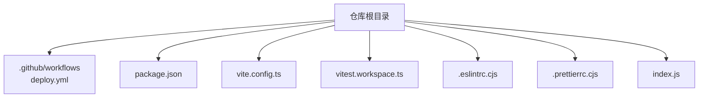
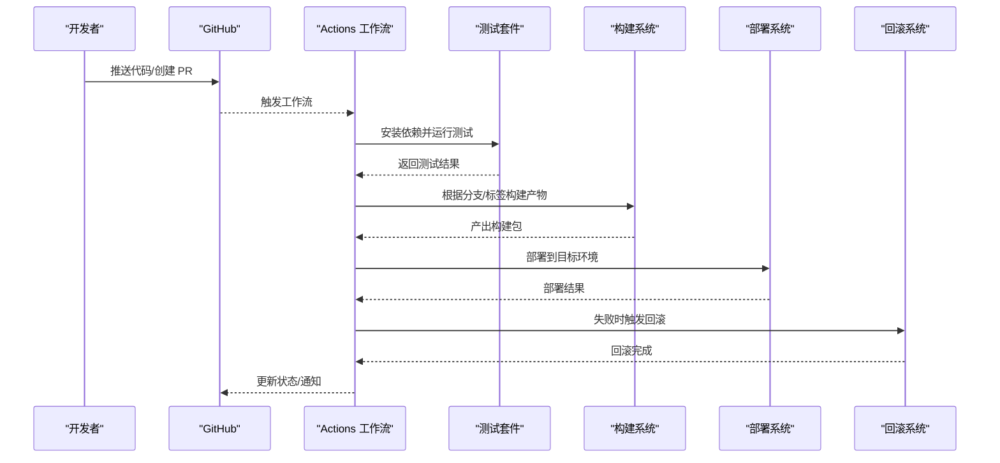
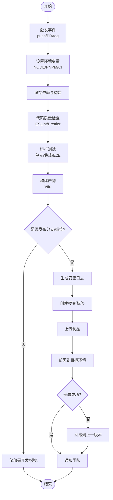
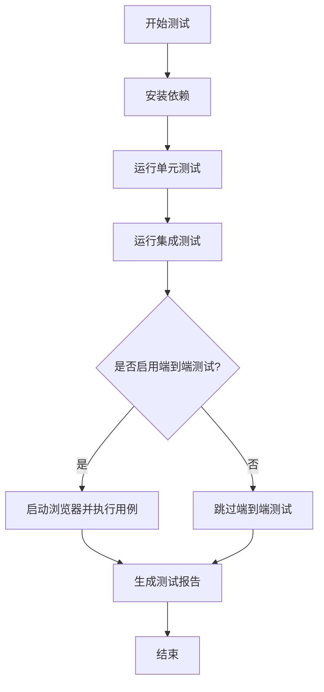
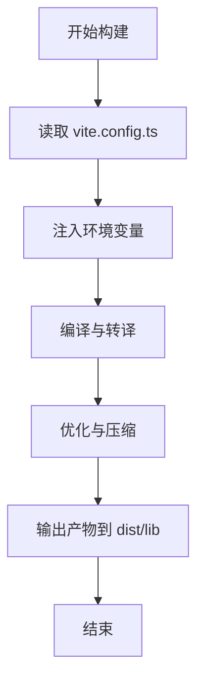
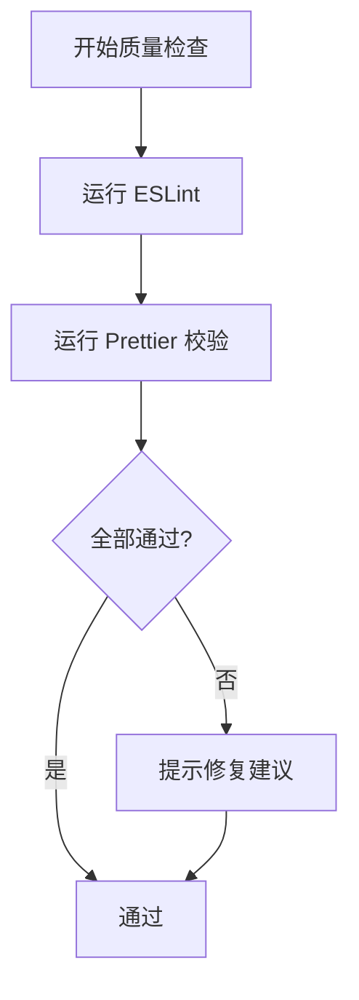
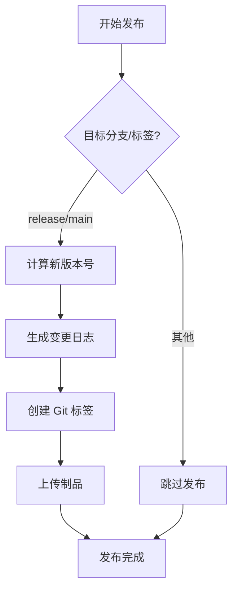
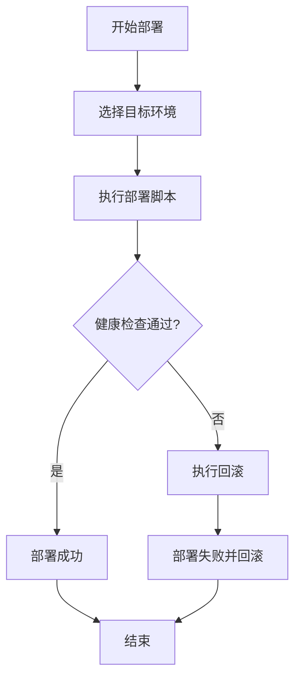
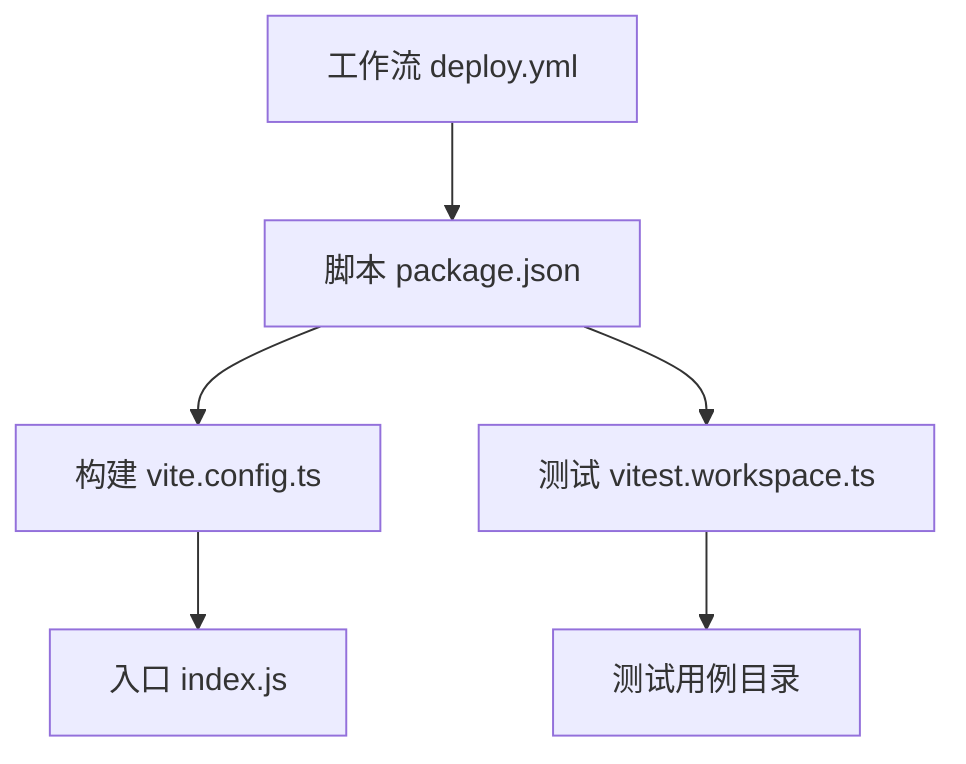

# CI/CD 流水线

<cite>
**本文引用的文件**   
- [deploy.yml](file://.github/workflows/deploy.yml)
- [package.json](file://package.json)
- [vite.config.ts](file://vite.config.ts)
- [vitest.workspace.ts](file://vitest.workspace.ts)
- [.eslintrc.cjs](file://.eslintrc.cjs)
- [.prettierrc.cjs](file://.prettierrc.cjs)
- [index.js](file://index.js)
</cite>

## 目录
1. [简介](#简介)
2. [项目结构](#项目结构)
3. [核心组件](#核心组件)
4. [架构总览](#架构总览)
5. [详细组件分析](#详细组件分析)
6. [依赖分析](#依赖分析)
7. [性能考虑](#性能考虑)
8. [故障排查指南](#故障排查指南)
9. [结论](#结论)
10. [附录](#附录)

## 简介
本指南面向 stk-table-vue 项目的持续集成与持续交付（CI/CD）实践，目标是在 GitHub Actions 中构建一条覆盖自动化测试、代码质量检查、构建打包、部署发布的全链路流水线。内容涵盖：
- 多环境差异化配置（开发、测试、生产）
- 分支管理策略与语义化版本控制
- 变更日志自动生成
- 测试自动化（单元测试、集成测试、端到端测试）
- 部署回滚机制与故障恢复流程

## 项目结构
仓库根目录包含以下与 CI/CD 相关的关键位置：
- .github/workflows：GitHub Actions 工作流定义
- package.json：脚本入口与依赖声明
- vite.config.ts：构建配置
- vitest.workspace.ts：测试工作区配置
- .eslintrc.cjs / .prettierrc.cjs：代码质量规则
- index.js：包入口文件

**图表来源** 
- [deploy.yml](file://.github/workflows/deploy.yml)
- [package.json](file://package.json)
- [vite.config.ts](file://vite.config.ts)
- [vitest.workspace.ts](file://vitest.workspace.ts)
- [.eslintrc.cjs](file://.eslintrc.cjs)
- [.prettierrc.cjs](file://.prettierrc.cjs)
- [index.js](file://index.js)

**章节来源**
- [deploy.yml](file://.github/workflows/deploy.yml)
- [package.json](file://package.json)
- [vite.config.ts](file://vite.config.ts)
- [vitest.workspace.ts](file://vitest.workspace.ts)
- [.eslintrc.cjs](file://.eslintrc.cjs)
- [.prettierrc.cjs](file://.prettierrc.cjs)
- [index.js](file://index.js)

## 核心组件
- 工作流触发器与分支策略：基于 push/PR 事件触发，按分支名区分环境与产物标签
- 任务矩阵与环境变量：为不同环境注入不同的构建参数与部署凭据
- 缓存与增量构建：缓存依赖与构建产物，提升流水线速度
- 测试执行：统一通过 npm/pnpm 脚本驱动 Vitest 运行单测与集成测试
- 构建打包：使用 Vite 生成静态资源或库产物
- 发布与部署：根据分支与标签生成制品并推送到目标环境；支持回滚到上一稳定版本

**章节来源**
- [deploy.yml](file://.github/workflows/deploy.yml)
- [package.json](file://package.json)
- [vite.config.ts](file://vite.config.ts)
- [vitest.workspace.ts](file://vitest.workspace.ts)

## 架构总览
下图展示从代码提交到部署发布的端到端流程，包括分支判定、测试、构建、发布与回滚路径。

[此图为概念性流程图，不直接映射具体源码文件]

## 详细组件分析

### GitHub Actions 工作流（deploy.yml）
- 触发条件：push 至受保护分支、创建/更新标签、PR 事件
- 环境变量：NODE_VERSION、PNPM_VERSION、CI、环境变量注入（如 API_BASE_URL、DEPLOY_TARGET）
- 任务划分：
  - 初始化与缓存：Node/pnpm 缓存、依赖缓存
  - 代码质量：ESLint、Prettier 校验
  - 测试：单元测试、集成测试、可选的端到端测试
  - 构建：Vite 构建，输出产物到 dist 或 lib
  - 发布：生成 changelog、打 tag、上传制品
  - 部署：按环境部署（dev/test/prod），支持灰度与回滚

**图表来源** 
- [deploy.yml](file://.github/workflows/deploy.yml)

**章节来源**
- [deploy.yml](file://.github/workflows/deploy.yml)

### 测试自动化（Vitist + 脚本）
- 工作区配置：vitest.workspace.ts 定义测试范围与并行策略
- 脚本入口：package.json 中的 test、test:unit、test:integration、test:e2e 等命令
- 执行策略：
  - 单元测试：快速验证工具函数与组件逻辑
  - 集成测试：模拟表格交互场景
  - 端到端测试：浏览器级用例（可选）
- 报告与覆盖率：输出测试报告与覆盖率统计，便于回归分析

**图表来源** 
- [vitest.workspace.ts](file://vitest.workspace.ts)
- [package.json](file://package.json)

**章节来源**
- [vitest.workspace.ts](file://vitest.workspace.ts)
- [package.json](file://package.json)

### 构建打包（Vite）
- 构建目标：库模式或站点模式，依据环境变量切换
- 产物输出：dist 或 lib 目录，包含 JS/CSS/类型声明
- 优化项：Tree-shaking、压缩、SourceMap、分包策略
- 环境变量：通过 Vite 的 defineEnv 注入运行时配置

**图表来源** 
- [vite.config.ts](file://vite.config.ts)
- [package.json](file://package.json)

**章节来源**
- [vite.config.ts](file://vite.config.ts)
- [package.json](file://package.json)

### 代码质量检查（ESLint + Prettier）
- ESLint：语法错误、潜在问题、规范检查
- Prettier：统一代码风格，格式化校验
- 集成方式：在流水线中作为独立任务执行，失败即阻断后续步骤

**图表来源** 
- [.eslintrc.cjs](file://.eslintrc.cjs)
- [.prettierrc.cjs](file://.prettierrc.cjs)
- [package.json](file://package.json)

**章节来源**
- [.eslintrc.cjs](file://.eslintrc.cjs)
- [.prettierrc.cjs](file://.prettierrc.cjs)
- [package.json](file://package.json)

### 发布与版本管理（语义化版本 + 变更日志）
- 分支策略：main 为稳定分支，release/* 用于预发布，feature/* 用于功能开发
- 版本控制：遵循 SemVer（主版本.次版本.修订号）
- 变更日志：基于提交消息或 PR 描述自动生成 changelog
- 制品管理：上传构建产物到仓库 Release 或包管理器

**图表来源** 
- [deploy.yml](file://.github/workflows/deploy.yml)
- [package.json](file://package.json)

**章节来源**
- [deploy.yml](file://.github/workflows/deploy.yml)
- [package.json](file://package.json)

### 部署策略与回滚机制
- 多环境部署：
  - 开发环境：每次 push 自动部署预览
  - 测试环境：PR 合并后部署
  - 生产环境：仅对 release 标签或 main 分支特定提交部署
- 回滚机制：
  - 记录每次部署的版本与时间戳
  - 失败时自动回滚到上一个稳定版本
  - 提供手动回滚入口（命令行或控制台）

**图表来源** 
- [deploy.yml](file://.github/workflows/deploy.yml)

**章节来源**
- [deploy.yml](file://.github/workflows/deploy.yml)

## 依赖分析
- 外部依赖：Node.js、pnpm/npm、Vite、Vitest、ESLint、Prettier
- 内部依赖：index.js 作为包入口，vite.config.ts 定义构建行为，vitest.workspace.ts 定义测试范围
- 耦合关系：工作流依赖 package.json 脚本，构建依赖 vite.config.ts，测试依赖 vitest.workspace.ts

**图表来源** 
- [deploy.yml](file://.github/workflows/deploy.yml)
- [package.json](file://package.json)
- [vite.config.ts](file://vite.config.ts)
- [vitest.workspace.ts](file://vitest.workspace.ts)
- [index.js](file://index.js)

**章节来源**
- [deploy.yml](file://.github/workflows/deploy.yml)
- [package.json](file://package.json)
- [vite.config.ts](file://vite.config.ts)
- [vitest.workspace.ts](file://vitest.workspace.ts)
- [index.js](file://index.js)

## 性能考虑
- 依赖缓存：缓存 node_modules 与 pnpm store，减少安装时间
- 增量构建：利用 Vite 的模块热替换与缓存机制
- 并行执行：测试与构建任务并行化，缩短流水线时长
- 产物优化：启用压缩、Tree-shaking、按需加载

[本节为通用指导，不直接分析具体文件]

## 故障排查指南
- 常见问题：
  - 依赖安装失败：检查 Node/pnpm 版本与网络代理
  - 测试失败：查看测试报告与日志定位用例问题
  - 构建失败：检查环境变量与构建配置
  - 部署失败：检查权限、域名解析与健康检查
- 回滚操作：
  - 自动回滚：流水线检测到部署失败时自动执行
  - 手动回滚：通过命令行或控制台指定版本号进行回滚

**章节来源**
- [deploy.yml](file://.github/workflows/deploy.yml)
- [package.json](file://package.json)

## 结论
通过本指南，stk-table-vue 项目可在 GitHub Actions 中实现完整的 CI/CD 流水线，覆盖测试、质量检查、构建、发布与部署全流程。结合分支策略与语义化版本控制，确保发布过程可控、可追溯、可回滚。

[本节为总结性内容，不直接分析具体文件]

## 附录
- 最佳实践：
  - 使用分支保护规则限制直接推送
  - 在 PR 中强制要求测试通过与代码审查
  - 定期更新依赖与安全补丁
- 参考文件：
  - 工作流定义：.github/workflows/deploy.yml
  - 脚本与依赖：package.json
  - 构建配置：vite.config.ts
  - 测试配置：vitest.workspace.ts
  - 代码质量：.eslintrc.cjs、.prettierrc.cjs
  - 包入口：index.js

[本节为补充信息，不直接分析具体文件]