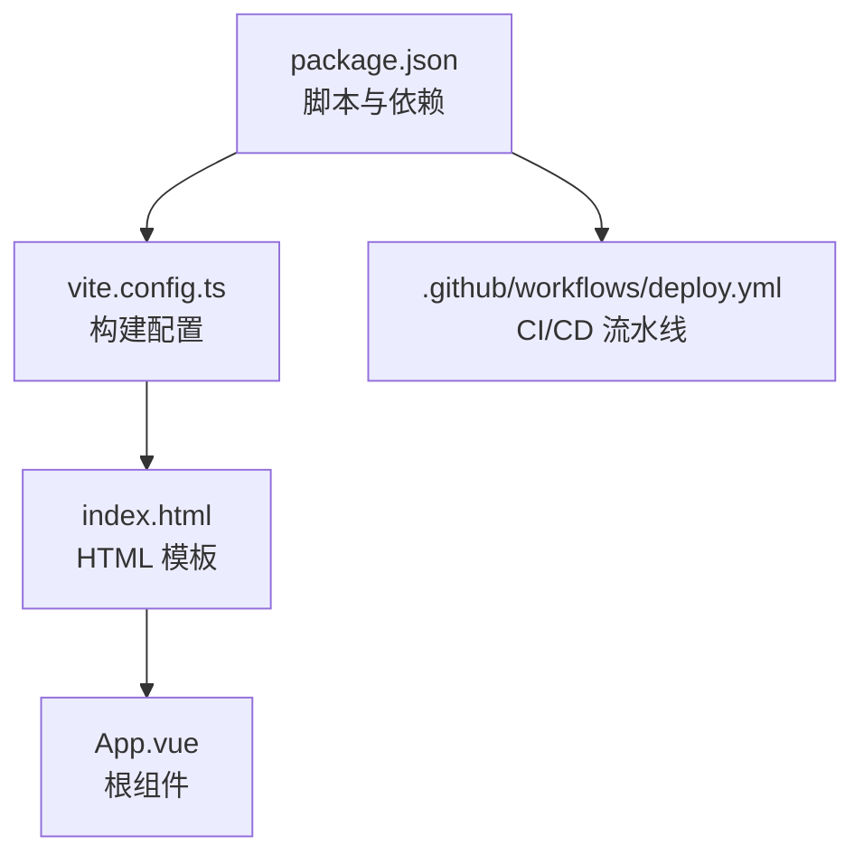
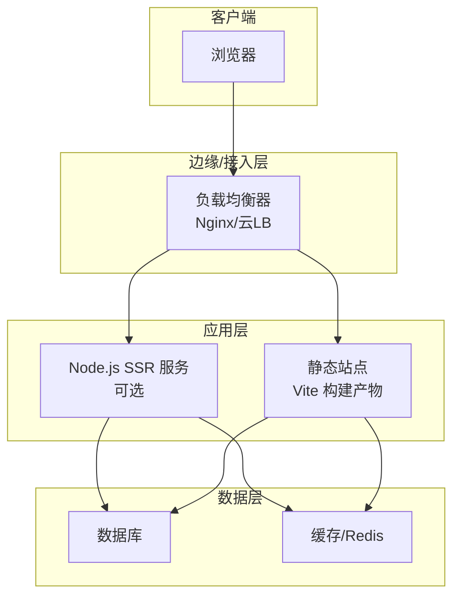
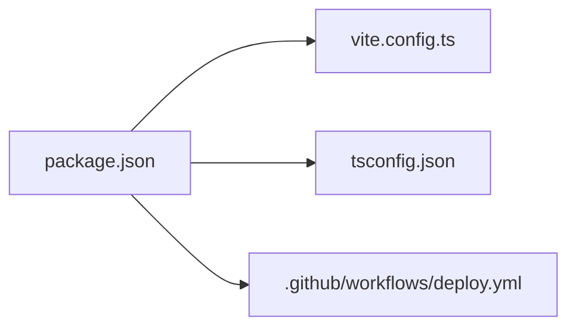

# Node.js 应用部署

<cite>
**本文引用的文件**   
- [package.json](file://package.json)
- [vite.config.ts](file://vite.config.ts)
- [index.html](file://index.html)
- [App.vue](file://App.vue)
- [index.js](file://index.js)
- [.github/workflows/deploy.yml](file://.github/workflows/deploy.yml)
</cite>

## 目录
1. [简介](#简介)
2. [项目结构](#项目结构)
3. [核心组件](#核心组件)
4. [架构总览](#架构总览)
5. [详细组件分析](#详细组件分析)
6. [依赖分析](#依赖分析)
7. [性能考虑](#性能考虑)
8. [故障排查指南](#故障排查指南)
9. [结论](#结论)
10. [附录](#附录)

## 简介
本指南面向基于 Node.js 的 stk-table-vue 应用的部署与运维，覆盖以下主题：
- SSR 环境搭建与配置（Node.js 版本、包管理器、环境变量）
- PM2 进程管理（集群模式、日志轮转、自动重启）
- Docker 容器化（Dockerfile、镜像优化、多阶段构建）
- 负载均衡与高可用架构设计
- 数据库连接池配置与性能调优建议

说明：当前仓库为 Vue + Vite 的前端库/示例工程，未包含服务端渲染入口。因此本节将提供“若需启用 SSR”的通用方案与最佳实践，并给出在现有前端产物基础上进行生产部署的标准流程。

## 项目结构
- 构建工具：Vite（TypeScript 配置）
- 入口页面：HTML 模板与根组件
- 工作流：GitHub Actions 部署脚本
- 包管理：pnpm（锁定文件存在）

图表来源
- [package.json](file://package.json)
- [vite.config.ts](file://vite.config.ts)
- [index.html](file://index.html)
- [App.vue](file://App.vue)
- [.github/workflows/deploy.yml](file://.github/workflows/deploy.yml)

章节来源
- [package.json](file://package.json)
- [vite.config.ts](file://vite.config.ts)
- [index.html](file://index.html)
- [App.vue](file://App.vue)
- [.github/workflows/deploy.yml](file://.github/workflows/deploy.yml)

## 核心组件
- 构建与运行脚本：通过 package.json 定义开发、构建、预览等命令，便于在不同环境统一执行。
- 构建配置：vite.config.ts 控制构建目标、插件、输出目录等，是生产打包的关键。
- 应用入口：index.html 作为 HTML 模板，App.vue 作为根组件，构成 SPA 的基础。
- CI/CD：.github/workflows/deploy.yml 用于自动化构建与发布流程。

章节来源
- [package.json](file://package.json)
- [vite.config.ts](file://vite.config.ts)
- [index.html](file://index.html)
- [App.vue](file://App.vue)
- [.github/workflows/deploy.yml](file://.github/workflows/deploy.yml)

## 架构总览
下图展示典型的生产部署架构：Nginx/反向代理 → Node.js 服务（可选 SSR）→ 静态资源（Vite 构建产物）。若需要 SSR，可在 Node 层引入框架（如 Vite SSR 或 Nuxt），否则直接以静态站点方式由 Nginx 提供服务。

图表来源
- [.github/workflows/deploy.yml](file://.github/workflows/deploy.yml)

章节来源
- [.github/workflows/deploy.yml](file://.github/workflows/deploy.yml)

## 详细组件分析

### Node.js 环境与依赖管理
- Node.js 版本要求：建议使用长期支持（LTS）版本；确保与 pnpm 及构建工具兼容。
- 包管理器：使用 pnpm 安装依赖，利用 pnpm-lock.yaml 保证一致性。
- 环境变量：通过 .env 文件或运行时注入，区分开发与生产配置（如 API 地址、调试开关）。

章节来源
- [package.json](file://package.json)

### 构建与产物
- 构建命令：通过 package.json 中的脚本执行构建，生成静态资源。
- 构建配置：vite.config.ts 中可设置输出目录、压缩、代码分割等优化项。
- 产物用途：静态资源可直接由 Nginx 托管；如需 SSR，则在 Node 层加载构建产物。

章节来源
- [vite.config.ts](file://vite.config.ts)
- [package.json](file://package.json)

### 应用入口与模板
- index.html：作为 HTML 模板，挂载根组件与构建后的 JS/CSS。
- App.vue：根组件，组织业务模块与全局状态。

章节来源
- [index.html](file://index.html)
- [App.vue](file://App.vue)

### CI/CD 流水线
- GitHub Actions：.github/workflows/deploy.yml 定义了从拉取代码到构建与发布的完整流程。
- 建议：在流水线中缓存依赖、并行测试、构建产物上传至对象存储或 CDN。

章节来源
- [.github/workflows/deploy.yml](file://.github/workflows/deploy.yml)

### SSR 环境搭建（若启用）
- 选择框架：Vite SSR 或 Nuxt 均可；需在 Node 环境中启动服务。
- 入口文件：创建 Node 入口（例如 index.js），初始化 Vite SSR 或 Nuxt 实例，监听端口。
- 环境变量：在服务启动时读取 .env 或系统环境变量，注入到构建与运行时。
- 热重载：开发环境开启 HMR，生产环境关闭以提升性能。

章节来源
- [index.js](file://index.js)
- [package.json](file://package.json)

### PM2 进程管理
- 集群模式：根据 CPU 核数启动多个 worker，提升并发能力。
- 日志轮转：配置日志大小与保留数量，避免磁盘占满。
- 自动重启：设置内存阈值与重启策略，保障服务稳定性。
- 优雅重启：配合信号处理实现零停机更新。

章节来源
- [package.json](file://package.json)

### Docker 容器化部署
- 多阶段构建：第一阶段安装依赖并构建静态资源；第二阶段仅拷贝产物，减小镜像体积。
- 基础镜像：选择轻量级 Node 镜像（如 alpine 或 slim）。
- 暴露端口：明确暴露应用端口，便于编排平台映射。
- 健康检查：添加健康检查探针，供容器编排平台监控。

章节来源
- [package.json](file://package.json)
- [vite.config.ts](file://vite.config.ts)

### 负载均衡与高可用
- 水平扩展：通过 PM2 集群或多副本容器实现横向扩展。
- 会话保持：若需要，结合 Redis 或外部会话存储。
- 健康检查与自愈：容器编排平台自动检测并重启异常实例。
- 灰度发布：按流量比例逐步切换新版本，降低风险。

章节来源
- [.github/workflows/deploy.yml](file://.github/workflows/deploy.yml)

### 数据库连接池与性能调优
- 连接池：合理设置最大连接数、超时与重试策略，避免连接泄漏。
- 查询优化：索引、分页、批量操作，减少慢查询。
- 缓存策略：热点数据入缓存，降低数据库压力。
- 监控告警：采集 QPS、延迟、错误率等指标，设置阈值告警。

章节来源
- [package.json](file://package.json)

## 依赖分析
- 构建依赖：Vite、TypeScript、Vue 相关插件与工具链。
- 运行依赖：生产环境仅需运行所需的最小依赖集。
- 锁定文件：pnpm-lock.yaml 确保跨环境一致性与快速安装。

图表来源
- [package.json](file://package.json)
- [vite.config.ts](file://vite.config.ts)
- [.github/workflows/deploy.yml](file://.github/workflows/deploy.yml)

章节来源
- [package.json](file://package.json)
- [vite.config.ts](file://vite.config.ts)
- [.github/workflows/deploy.yml](file://.github/workflows/deploy.yml)

## 性能考虑
- 构建优化：代码分割、Tree Shaking、资源压缩、懒加载。
- 网络优化：CDN 加速、HTTP/2、缓存头设置。
- 服务端优化：SSR 按需渲染、缓存中间结果、异步 I/O。
- 资源监控：CPU、内存、I/O 与 GC 行为监控，定位瓶颈。

[本节为通用指导，不直接分析具体文件]

## 故障排查指南
- 构建失败：检查 Node 版本、依赖锁定文件与网络代理设置。
- 运行异常：查看 PM2 日志与容器日志，定位错误堆栈。
- 性能问题：使用性能分析工具（如 Node 内置 Profiler、APM）识别热点。
- 环境问题：核对环境变量、权限与端口占用情况。

章节来源
- [.github/workflows/deploy.yml](file://.github/workflows/deploy.yml)

## 结论
- 对于纯前端应用，优先采用静态站点部署，通过 Nginx/CDN 提供高性能访问。
- 若需 SSR，应在 Node 层引入相应框架，并结合 PM2/Docker 进行稳定运行。
- 通过 CI/CD 自动化构建与发布，结合负载均衡与健康检查实现高可用。
- 数据库与缓存的合理配置是性能与稳定性的关键。

[本节为总结性内容，不直接分析具体文件]

## 附录
- 环境变量清单：API 地址、调试开关、第三方服务密钥等。
- 部署清单：Node 版本、pnpm 版本、构建命令、运行命令、端口映射。
- 回滚策略：保留历史版本镜像与配置文件，支持快速回滚。

[本节为补充信息，不直接分析具体文件]