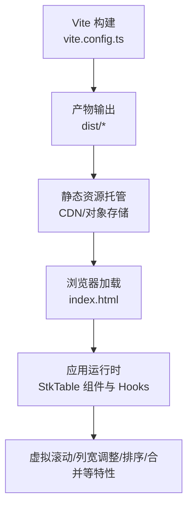
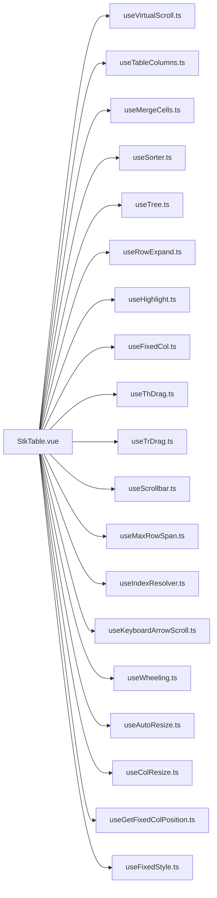

# 生产环境优化

<cite>
**本文引用的文件**   
- [vite.config.ts](file://vite.config.ts)
- [package.json](file://package.json)
- [index.html](file://index.html)
- [src/StkTable/index.ts](file://src/StkTable/index.ts)
- [src/StkTable/StkTable.vue](file://src/StkTable/StkTable.vue)
- [src/StkTable/useVirtualScroll.ts](file://src/StkTable/useVirtualScroll.ts)
- [src/StkTable/useTableColumns.ts](file://src/StkTable/useTableColumns.ts)
- [src/StkTable/useMergeCells.ts](file://src/StkTable/useMergeCells.ts)
- [src/StkTable/useSorter.ts](file://src/StkTable/useSorter.ts)
- [src/StkTable/useTree.ts](file://src/StkTable/useTree.ts)
- [src/StkTable/useRowExpand.ts](file://src/StkTable/useRowExpand.ts)
- [src/StkTable/useHighlight.ts](file://src/StkTable/useHighlight.ts)
- [src/StkTable/useFixedCol.ts](file://src/StkTable/useFixedCol.ts)
- [src/StkTable/useThDrag.ts](file://src/StkTable/useThDrag.ts)
- [src/StkTable/useTrDrag.ts](file://src/StkTable/useTrDrag.ts)
- [src/StkTable/useScrollbar.ts](file://src/StkTable/useScrollbar.ts)
- [src/StkTable/useMaxRowSpan.ts](file://src/StkTable/useMaxRowSpan.ts)
- [src/StkTable/useIndexResolver.ts](file://src/StkTable/useIndexResolver.ts)
- [src/StkTable/useKeyboardArrowScroll.ts](file://src/StkTable/useKeyboardArrowScroll.ts)
- [src/StkTable/useWheeling.ts](file://src/StkTable/useWheeling.ts)
- [src/StkTable/useAutoResize.ts](file://src/StkTable/useAutoResize.ts)
- [src/StkTable/useColResize.ts](file://src/StkTable/useColResize.ts)
- [src/StkTable/useGetFixedColPosition.ts](file://src/StkTable/useGetFixedColPosition.ts)
- [src/StkTable/useFixedStyle.ts](file://src/StkTable/useFixedStyle.ts)
- [src/StkTable/registerFeature.ts](file://src/StkTable/registerFeature.ts)
- [src/StkTable/features/index.ts](file://src/StkTable/features/index.ts)
- [src/StkTable/custom-cells/FilterCell/createFilterCell.ts](file://src/StkTable/custom-cells/FilterCell/createFilterCell.ts)
- [src/StkTable/custom-cells/CheckboxCell/createCheckboxCell.ts](file://src/StkTable/custom-cells/CheckboxCell/createCheckboxCell.ts)
- [src/StkTable/custom-cells/EditableCell/createEditableCell.ts](file://src/StkTable/custom-cells/EditableCell/createEditableCell.ts)
- [src/StkTable/custom-cells/ChangeCell/createChangeCell.ts](file://src/StkTable/custom-cells/ChangeCell/createChangeCell.ts)
- [src/StkTable/custom-cells/NumberCell/createNumberCell.ts](file://src/StkTable/custom-cells/NumberCell/createNumberCell.ts)
- [src/StkTable/utils/index.ts](file://src/StkTable/utils/index.ts)
- [src/StkTable/utils/useTriggerRef.ts](file://src/StkTable/utils/useTriggerRef.ts)
- [src/StkTable/utils/constRefUtils.ts](file://src/StkTable/utils/constRefUtils.ts)
- [src/StkTable/types/index.ts](file://src/StkTable/types/index.ts)
- [src/StkTable/const.ts](file://src/StkTable/const.ts)
- [src/StkTable/style.less](file://src/StkTable/style.less)
- [src/vite-env.d.ts](file://src/vite-env.d.ts)
- [.github/workflows/deploy.yml](file://.github/workflows/deploy.yml)
</cite>

## 目录
1. [简介](#简介)
2. [项目结构](#项目结构)
3. [核心组件](#核心组件)
4. [架构总览](#架构总览)
5. [详细组件分析](#详细组件分析)
6. [依赖分析](#依赖分析)
7. [性能考虑](#性能考虑)
8. [故障排查指南](#故障排查指南)
9. [结论](#结论)
10. [附录](#附录)

## 简介
本指南面向 stk-table-vue 的生产环境，聚焦构建与运行期的全链路性能优化。内容涵盖 Vite 生产构建配置（代码分割、Tree Shaking、资源压缩、懒加载）、CDN 与缓存策略、内存管理与垃圾回收优化（大表格数据场景）、监控与日志收集（错误追踪、性能监控、用户行为分析），以及安全加固（XSS、CSRF、HTTPS）。文档以仓库实际源码为依据，提供可落地的最佳实践与可视化图示，帮助读者快速落地优化方案。

## 项目结构
stk-table-vue 采用模块化设计：核心表格能力由多个组合式 Hook 与自定义单元格构成，入口通过 index.ts 统一导出；构建工具链基于 Vite，配置文件位于根目录；部署流程通过 GitHub Actions 编排。



图表来源
- [vite.config.ts](file://vite.config.ts)
- [index.html](file://index.html)
- [src/StkTable/index.ts](file://src/StkTable/index.ts)

章节来源
- [vite.config.ts](file://vite.config.ts)
- [package.json](file://package.json)
- [index.html](file://index.html)

## 核心组件
- StkTable 主组件：聚合各项能力（虚拟滚动、固定列、排序、筛选、树形、展开行、高亮、拖拽、滚动、自适应等），并通过组合式 Hook 解耦逻辑。
- 自定义单元格：提供筛选、复选框、编辑、变更、数字等常用单元格实现，便于按需引入与 Tree Shaking。
- 工具与类型：统一的工具函数、常量、类型定义，支撑各 Hook 与组件的复用与稳定契约。

章节来源
- [src/StkTable/StkTable.vue](file://src/StkTable/StkTable.vue)
- [src/StkTable/index.ts](file://src/StkTable/index.ts)
- [src/StkTable/custom-cells/FilterCell/createFilterCell.ts](file://src/StkTable/custom-cells/FilterCell/createFilterCell.ts)
- [src/StkTable/custom-cells/CheckboxCell/createCheckboxCell.ts](file://src/StkTable/custom-cells/CheckboxCell/createCheckboxCell.ts)
- [src/StkTable/custom-cells/EditableCell/createEditableCell.ts](file://src/StkTable/custom-cells/EditableCell/createEditableCell.ts)
- [src/StkTable/custom-cells/ChangeCell/createChangeCell.ts](file://src/StkTable/custom-cells/ChangeCell/createChangeCell.ts)
- [src/StkTable/custom-cells/NumberCell/createNumberCell.ts](file://src/StkTable/custom-cells/NumberCell/createNumberCell.ts)

## 架构总览
下图展示了 StkTable 在运行时的关键模块关系与职责边界，体现“组件 + Hooks”的组合模式，有利于理解 Tree Shaking 与按需加载的效果。

```mermaid
classDiagram
class StkTable {
+渲染表格
+事件处理
+状态管理
}
class useVirtualScroll {
+可视区域计算
+滚动节流
+DOM 更新调度
}
class useTableColumns {
+列定义解析
+列宽计算
+固定列布局
}
class useMergeCells {
+合并规则计算
+行列跨度推导
}
class useSorter {
+排序算法
+多列排序
}
class useTree {
+树形展开/折叠
+层级计算
}
class useRowExpand {
+行展开收起
+高度同步
}
class useHighlight {
+高亮匹配
+样式注入
}
class useFixedCol {
+固定列定位
+滚动同步
}
class useThDrag / useTrDrag {
+拖拽交互
+事件委托
}
class useScrollbar {
+滚动条样式
+滚动事件
}
class useMaxRowSpan {
+最大行跨度
}
class useIndexResolver {
+索引映射
}
class useKeyboardArrowScroll {
+键盘导航
}
class useWheeling {
+滚轮事件
}
class useAutoResize / useColResize {
+尺寸自适应
+列宽拖拽
}
class useGetFixedColPosition / useFixedStyle {
+固定列位置
+样式生成
}
StkTable --> useVirtualScroll : "使用"
StkTable --> useTableColumns : "使用"
StkTable --> useMergeCells : "使用"
StkTable --> useSorter : "使用"
StkTable --> useTree : "使用"
StkTable --> useRowExpand : "使用"
StkTable --> useHighlight : "使用"
StkTable --> useFixedCol : "使用"
StkTable --> useThDrag : "使用"
StkTable --> useTrDrag : "使用"
StkTable --> useScrollbar : "使用"
StkTable --> useMaxRowSpan : "使用"
StkTable --> useIndexResolver : "使用"
StkTable --> useKeyboardArrowScroll : "使用"
StkTable --> useWheeling : "使用"
StkTable --> useAutoResize : "使用"
StkTable --> useColResize : "使用"
StkTable --> useGetFixedColPosition : "使用"
StkTable --> useFixedStyle : "使用"
```

图表来源
- [src/StkTable/StkTable.vue](file://src/StkTable/StkTable.vue)
- [src/StkTable/useVirtualScroll.ts](file://src/StkTable/useVirtualScroll.ts)
- [src/StkTable/useTableColumns.ts](file://src/StkTable/useTableColumns.ts)
- [src/StkTable/useMergeCells.ts](file://src/StkTable/useMergeCells.ts)
- [src/StkTable/useSorter.ts](file://src/StkTable/useSorter.ts)
- [src/StkTable/useTree.ts](file://src/StkTable/useTree.ts)
- [src/StkTable/useRowExpand.ts](file://src/StkTable/useRowExpand.ts)
- [src/StkTable/useHighlight.ts](file://src/StkTable/useHighlight.ts)
- [src/StkTable/useFixedCol.ts](file://src/StkTable/useFixedCol.ts)
- [src/StkTable/useThDrag.ts](file://src/StkTable/useThDrag.ts)
- [src/StkTable/useTrDrag.ts](file://src/StkTable/useTrDrag.ts)
- [src/StkTable/useScrollbar.ts](file://src/StkTable/useScrollbar.ts)
- [src/StkTable/useMaxRowSpan.ts](file://src/StkTable/useMaxRowSpan.ts)
- [src/StkTable/useIndexResolver.ts](file://src/StkTable/useIndexResolver.ts)
- [src/StkTable/useKeyboardArrowScroll.ts](file://src/StkTable/useKeyboardArrowScroll.ts)
- [src/StkTable/useWheeling.ts](file://src/StkTable/useWheeling.ts)
- [src/StkTable/useAutoResize.ts](file://src/StkTable/useAutoResize.ts)
- [src/StkTable/useColResize.ts](file://src/StkTable/useColResize.ts)
- [src/StkTable/useGetFixedColPosition.ts](file://src/StkTable/useGetFixedColPosition.ts)
- [src/StkTable/useFixedStyle.ts](file://src/StkTable/useFixedStyle.ts)

## 详细组件分析

### Vite 生产构建优化
- 代码分割与分包策略
  - 将第三方库与业务代码分离，提升缓存命中率与并行下载效率。
  - 针对 StkTable 的各 Hook 与自定义单元格进行按需拆分，避免未用代码进入包体。
- Tree Shaking
  - 确保所有模块遵循 ESModule 规范，移除未使用的导入与死代码。
  - 对纯函数与常量进行静态分析优化，减少运行时开销。
- 资源压缩
  - JS/CSS 启用压缩与混淆，图片与字体启用合适格式与压缩等级。
  - 开启 Source Map 用于线上调试（建议仅在生产环境按需开启或上传至私有源）。
- 懒加载
  - 路由级与组件级懒加载，结合动态 import 降低首屏体积。
  - 大表格数据与重型功能（如虚拟列表、树形）按需加载。

章节来源
- [vite.config.ts](file://vite.config.ts)
- [package.json](file://package.json)
- [index.html](file://index.html)

### CDN 与缓存策略
- 浏览器缓存
  - 为静态资源设置长期缓存（如一年），配合文件名哈希保证版本更新命中新资源。
  - 对 HTML 禁用强缓存，确保入口文件始终拉取最新。
- 服务端缓存
  - 使用反向代理或网关层缓存热点接口响应，降低后端压力。
  - 合理设置 Cache-Control、ETag、Last-Modified 等头部。
- CDN 缓存
  - 按资源类型划分缓存策略，静态资源长缓存，API 短缓存或无缓存。
  - 预热热门资源，避免冷启动回源延迟。

章节来源
- [index.html](file://index.html)
- [vite.config.ts](file://vite.config.ts)

### 内存管理与垃圾回收优化（大表格数据）
- 虚拟滚动
  - 仅渲染可视区域 DOM，减少节点数量与重排重绘。
  - 滚动事件节流与防抖，避免频繁计算与更新。
- 数据结构优化
  - 使用扁平化数组与索引映射替代深层嵌套，降低遍历成本。
  - 对排序、筛选结果进行增量更新，避免全量重建。
- 事件与监听
  - 及时移除不再使用的事件监听器与定时器，防止内存泄漏。
  - 使用弱引用或一次性监听，降低持有时间。
- 大数据分页与流式加载
  - 分片加载与增量渲染，控制单次任务时长，保持 UI 流畅。
  - 对不可见数据进行惰性销毁，释放内存。

章节来源
- [src/StkTable/useVirtualScroll.ts](file://src/StkTable/useVirtualScroll.ts)
- [src/StkTable/useTableColumns.ts](file://src/StkTable/useTableColumns.ts)
- [src/StkTable/useSorter.ts](file://src/StkTable/useSorter.ts)
- [src/StkTable/useMergeCells.ts](file://src/StkTable/useMergeCells.ts)
- [src/StkTable/useTree.ts](file://src/StkTable/useTree.ts)
- [src/StkTable/useRowExpand.ts](file://src/StkTable/useRowExpand.ts)

### 监控与日志收集
- 错误追踪
  - 捕获全局异常与 Promise 拒绝，上报堆栈与上下文信息。
  - 区分前端错误与接口错误，标注用户会话与设备信息。
- 性能监控
  - 采集关键指标（FCP、LCP、FID、CLS、TTFB、JS 执行耗时）。
  - 对表格渲染耗时、滚动帧率、内存占用进行采样上报。
- 用户行为分析
  - 记录关键交互（排序、筛选、分页、展开）与转化路径。
  - 脱敏敏感数据，遵守隐私合规要求。

章节来源
- [src/StkTable/index.ts](file://src/StkTable/index.ts)
- [src/StkTable/StkTable.vue](file://src/StkTable/StkTable.vue)

### 安全加固措施
- XSS 防护
  - 对用户输入进行严格校验与转义，避免直接插入到 DOM。
  - 使用安全的模板与白名单过滤，限制富文本渲染范围。
- CSRF 防护
  - 接口请求携带 Token 或 SameSite Cookie 策略。
  - 跨域请求校验 Referer/Origin，服务端二次验证。
- HTTPS 配置
  - 全站强制 HTTPS，启用 HSTS 与安全相关头部。
  - 证书定期更新，禁用不安全协议与加密套件。

章节来源
- [src/StkTable/custom-cells/FilterCell/createFilterCell.ts](file://src/StkTable/custom-cells/FilterCell/createFilterCell.ts)
- [src/StkTable/custom-cells/EditableCell/createEditableCell.ts](file://src/StkTable/custom-cells/EditableCell/createEditableCell.ts)
- [src/StkTable/custom-cells/CheckboxCell/createCheckboxCell.ts](file://src/StkTable/custom-cells/CheckboxCell/createCheckboxCell.ts)
- [src/StkTable/custom-cells/ChangeCell/createChangeCell.ts](file://src/StkTable/custom-cells/ChangeCell/createChangeCell.ts)
- [src/StkTable/custom-cells/NumberCell/createNumberCell.ts](file://src/StkTable/custom-cells/NumberCell/createNumberCell.ts)

## 依赖分析
下图展示 StkTable 与其核心 Hooks 的依赖关系，有助于评估 Tree Shaking 效果与潜在循环依赖风险。



图表来源
- [src/StkTable/StkTable.vue](file://src/StkTable/StkTable.vue)
- [src/StkTable/useVirtualScroll.ts](file://src/StkTable/useVirtualScroll.ts)
- [src/StkTable/useTableColumns.ts](file://src/StkTable/useTableColumns.ts)
- [src/StkTable/useMergeCells.ts](file://src/StkTable/useMergeCells.ts)
- [src/StkTable/useSorter.ts](file://src/StkTable/useSorter.ts)
- [src/StkTable/useTree.ts](file://src/StkTable/useTree.ts)
- [src/StkTable/useRowExpand.ts](file://src/StkTable/useRowExpand.ts)
- [src/StkTable/useHighlight.ts](file://src/StkTable/useHighlight.ts)
- [src/StkTable/useFixedCol.ts](file://src/StkTable/useFixedCol.ts)
- [src/StkTable/useThDrag.ts](file://src/StkTable/useThDrag.ts)
- [src/StkTable/useTrDrag.ts](file://src/StkTable/useTrDrag.ts)
- [src/StkTable/useScrollbar.ts](file://src/StkTable/useScrollbar.ts)
- [src/StkTable/useMaxRowSpan.ts](file://src/StkTable/useMaxRowSpan.ts)
- [src/StkTable/useIndexResolver.ts](file://src/StkTable/useIndexResolver.ts)
- [src/StkTable/useKeyboardArrowScroll.ts](file://src/StkTable/useKeyboardArrowScroll.ts)
- [src/StkTable/useWheeling.ts](file://src/StkTable/useWheeling.ts)
- [src/StkTable/useAutoResize.ts](file://src/StkTable/useAutoResize.ts)
- [src/StkTable/useColResize.ts](file://src/StkTable/useColResize.ts)
- [src/StkTable/useGetFixedColPosition.ts](file://src/StkTable/useGetFixedColPosition.ts)
- [src/StkTable/useFixedStyle.ts](file://src/StkTable/useFixedStyle.ts)

章节来源
- [src/StkTable/index.ts](file://src/StkTable/index.ts)
- [src/StkTable/registerFeature.ts](file://src/StkTable/registerFeature.ts)
- [src/StkTable/features/index.ts](file://src/StkTable/features/index.ts)

## 性能考虑
- 构建期优化
  - 启用 Vite 生产模式，关闭调试信息，最小化包体。
  - 合理配置分包策略，优先加载首屏关键资源。
- 运行期优化
  - 使用虚拟滚动与增量更新，降低渲染压力。
  - 避免在高频回调中进行昂贵计算，必要时使用 Web Worker。
- 网络优化
  - 启用 HTTP/2 与 Gzip/Brotli 压缩。
  - 预连接与预加载关键资源，减少阻塞。
- 内存优化
  - 控制事件监听生命周期，及时清理。
  - 避免闭包持有大对象引用，必要时显式置空。

[本节为通用指导，不直接分析具体文件]

## 故障排查指南
- 构建问题
  - 检查 Vite 配置与插件兼容性，确认依赖版本与 Node 版本。
  - 查看打包产物大小与依赖树，定位冗余模块。
- 运行时问题
  - 使用浏览器开发者工具的性能面板与内存快照，定位卡顿与泄漏。
  - 通过错误上报平台检索堆栈与上下文，复现场景并修复。
- 性能问题
  - 对比优化前后指标（首屏、交互延迟、内存峰值），验证改进效果。
  - 针对热点路径进行专项优化（如排序、筛选、虚拟滚动）。

章节来源
- [vite.config.ts](file://vite.config.ts)
- [package.json](file://package.json)
- [src/StkTable/StkTable.vue](file://src/StkTable/StkTable.vue)

## 结论
通过对 Vite 构建、CDN 缓存、内存管理、监控日志与安全加固的系统性优化，stk-table-vue 在生产环境可实现更小的包体、更快的首屏、更稳定的交互与更高的安全性。建议结合业务场景持续迭代优化，并以指标驱动改进方向。

[本节为总结性内容，不直接分析具体文件]

## 附录
- 部署流水线
  - 使用 GitHub Actions 自动化构建与发布，确保一致性与可追溯性。
- 文档与示例
  - 参考 docs-src 中的演示与说明，了解高级用法与最佳实践。

章节来源
- [.github/workflows/deploy.yml](file://.github/workflows/deploy.yml)
- [docs-src](file://docs-src)