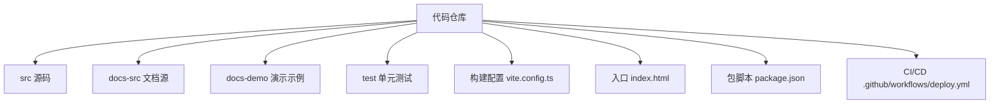
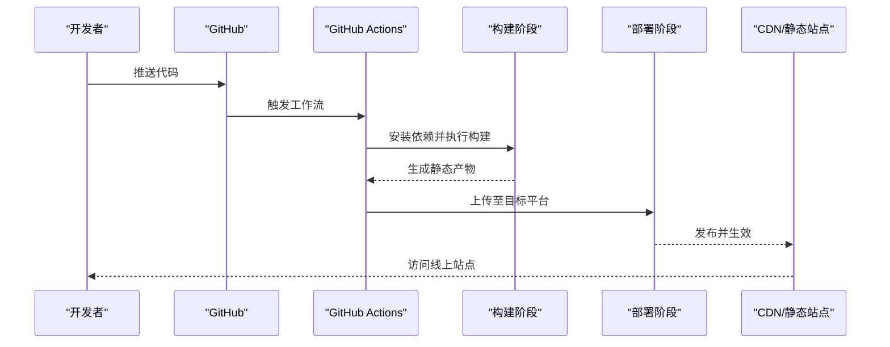
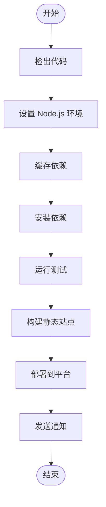
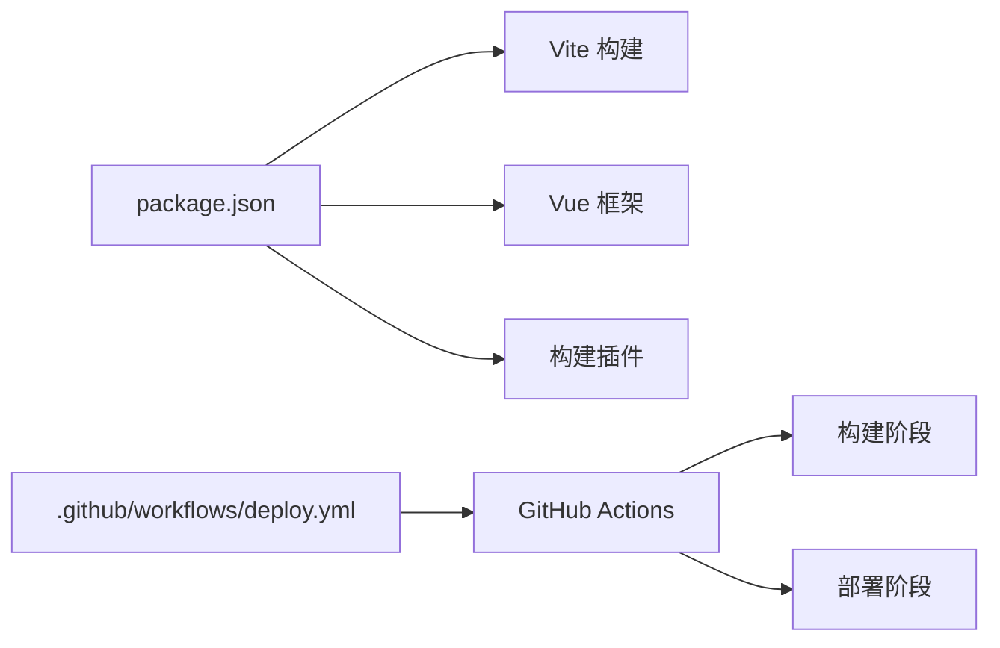

# 部署指南

<cite>
**本文引用的文件**   
- [package.json](file://package.json)
- [vite.config.ts](file://vite.config.ts)
- [.github/workflows/deploy.yml](file://.github/workflows/deploy.yml)
- [index.html](file://index.html)
- [README.md](file://README.md)
</cite>

## 目录
1. [简介](#简介)
2. [项目结构](#项目结构)
3. [核心组件](#核心组件)
4. [架构总览](#架构总览)
5. [详细组件分析](#详细组件分析)
6. [依赖分析](#依赖分析)
7. [性能考虑](#性能考虑)
8. [故障排查指南](#故障排查指南)
9. [结论](#结论)
10. [附录](#附录)

## 简介
本指南面向 stk-table-vue 项目的生产部署，覆盖静态站点与 Node.js 应用两类场景：
- 静态站点：GitHub Pages、Netlify、Vercel 的构建与发布配置要点
- Node.js 应用：Docker 容器化、PM2 进程管理、负载均衡策略
- CI/CD：自动化测试、构建、部署流水线示例
- 生产优化：CDN、缓存、资源压缩、分包策略
- 监控与日志：指标采集、日志收集与告警建议
- 故障排查与回滚：常见问题定位与快速恢复

本项目基于 Vite 构建 Vue 应用，输出静态资源；同时提供 GitHub Actions 工作流用于自动化部署。

## 项目结构
仓库包含文档、示例、源码与测试等模块。与部署相关的关键位置如下：
- 构建配置：vite.config.ts（构建产物、路径、插件）
- 入口页面：index.html（HTML 模板与基础资源引用）
- 包脚本：package.json（构建、预览、测试命令）
- CI/CD：.github/workflows/deploy.yml（GitHub Actions 工作流）
- 说明文档：README.md（项目概述与使用说明）

**图表来源** 
- [vite.config.ts](file://vite.config.ts)
- [index.html](file://index.html)
- [package.json](file://package.json)
- [.github/workflows/deploy.yml](file://.github/workflows/deploy.yml)

**章节来源**
- [vite.config.ts](file://vite.config.ts)
- [index.html](file://index.html)
- [package.json](file://package.json)
- [.github/workflows/deploy.yml](file://.github/workflows/deploy.yml)

## 核心组件
- 构建系统：Vite + Vue，支持开发服务器与生产构建
- 打包产物：静态 HTML/CSS/JS，适合直接托管到静态站点平台
- 脚本命令：通过 package.json 定义 build、dev、preview、test 等常用命令
- CI/CD：GitHub Actions 工作流触发构建与部署任务

**章节来源**
- [package.json](file://package.json)
- [vite.config.ts](file://vite.config.ts)

## 架构总览
下图展示从代码提交到线上产物的端到端流程，涵盖本地构建、CI/CD 流水线与静态站点托管。

**图表来源** 
- [.github/workflows/deploy.yml](file://.github/workflows/deploy.yml)
- [package.json](file://package.json)
- [vite.config.ts](file://vite.config.ts)

## 详细组件分析

### 静态站点部署方案
- GitHub Pages
  - 使用 GitHub Actions 工作流进行构建与发布
  - 将构建产物推送到 gh-pages 分支或指定目录
  - 在仓库设置中启用 Pages 服务并选择正确的分支与根目录
- Netlify
  - 配置构建命令为项目构建脚本（如 pnpm build）
  - 设置发布目录为构建输出目录（通常为 dist）
  - 可选环境变量注入与重定向规则
- Vercel
  - 自动识别 Vite/Vue 项目
  - 构建命令与输出目录按默认或自定义配置
  - 支持预览分支与生产分支的自动部署

注意事项
- 确保构建命令与包管理器一致（pnpm/npm/yarn）
- 检查 base 路径与路由模式（history/hash）与平台路由匹配
- 静态资源路径需正确，避免 404

**章节来源**
- [.github/workflows/deploy.yml](file://.github/workflows/deploy.yml)
- [package.json](file://package.json)
- [vite.config.ts](file://vite.config.ts)

### Node.js 应用部署流程
若项目扩展为服务端应用（例如 SSR 或 API），可参考以下流程：
- Docker 容器化
  - 多阶段构建：先安装依赖并构建前端，再运行轻量运行时
  - 暴露端口与环境变量配置
  - 镜像标签与版本管理
- PM2 进程管理
  - 启动多个实例实现高可用
  - 集群模式与内存限制
  - 日志轮转与重启策略
- 负载均衡
  - 反向代理（Nginx/Traefik）分发请求
  - 健康检查与优雅停机
  - 灰度发布与蓝绿部署

**章节来源**
- [package.json](file://package.json)
- [vite.config.ts](file://vite.config.ts)

### CI/CD 流水线配置示例
- 触发条件：push/PR 事件
- 环境准备：Node.js 版本、缓存依赖
- 步骤：
  - 安装依赖
  - 运行测试套件
  - 构建静态站点
  - 部署到目标平台（GitHub Pages/Netlify/Vercel）
- 通知与回滚：失败告警、成功状态标记、一键回滚

**图表来源** 
- [.github/workflows/deploy.yml](file://.github/workflows/deploy.yml)
- [package.json](file://package.json)

**章节来源**
- [.github/workflows/deploy.yml](file://.github/workflows/deploy.yml)
- [package.json](file://package.json)

### 生产环境性能优化策略
- CDN 配置
  - 启用全球边缘节点加速
  - 静态资源开启强缓存与协商缓存
  - 合理设置缓存失效与版本号
- 缓存策略
  - HTML 短缓存，JS/CSS 长缓存
  - 使用内容哈希文件名
  - 浏览器与服务端缓存协同
- 资源压缩
  - Gzip/Brotli 压缩
  - 图片格式优化与懒加载
  - 按需引入与代码分割
- 构建优化
  - Tree-shaking 与最小化
  - 预渲染与预取关键资源
  - 减少首屏体积与阻塞

**章节来源**
- [vite.config.ts](file://vite.config.ts)
- [package.json](file://package.json)

### 监控与日志收集
- 指标采集
  - 前端错误上报与性能指标（LCP、FID、CLS）
  - 后端健康检查与业务指标
- 日志收集
  - 统一日志格式与结构化输出
  - 集中式日志存储与检索
  - 日志级别与采样策略
- 告警与可视化
  - 阈值告警与多渠道通知
  - 仪表盘与趋势分析

[本节为通用指导，不直接分析具体文件]

### 故障排查与回滚策略
- 常见问题
  - 构建失败：依赖缺失、Node 版本不匹配、环境变量未配置
  - 部署失败：权限不足、路径错误、平台限制
  - 运行时错误：路由模式不匹配、资源 404、跨域问题
- 定位方法
  - 查看构建与部署日志
  - 检查浏览器控制台与网络面板
  - 验证 CDN 缓存与版本更新
- 回滚策略
  - 保留历史版本与制品
  - 快速切换域名或路由指向旧版本
  - 灰度发布与逐步放量

**章节来源**
- [.github/workflows/deploy.yml](file://.github/workflows/deploy.yml)
- [package.json](file://package.json)

## 依赖分析
- 构建依赖：Vite、Vue 及相关插件
- 包管理器：pnpm/npm/yarn（根据实际环境选择）
- CI/CD：GitHub Actions、平台 SDK（如 netlify-cli、vercel CLI）
- 运行时：Node.js（如需服务端）、PM2（进程管理）、Nginx（反向代理）

**图表来源** 
- [package.json](file://package.json)
- [.github/workflows/deploy.yml](file://.github/workflows/deploy.yml)

**章节来源**
- [package.json](file://package.json)
- [.github/workflows/deploy.yml](file://.github/workflows/deploy.yml)

## 性能考虑
- 首屏优化：减少 JS 体积、延迟加载非关键资源
- 缓存策略：利用浏览器与 CDN 缓存提升加载速度
- 资源优化：图片压缩、字体子集化、按需引入
- 构建优化：代码分割、Tree-shaking、并行构建
- 监控反馈：持续跟踪性能指标并迭代优化

[本节为通用指导，不直接分析具体文件]

## 故障排查指南
- 构建阶段
  - 检查 Node 版本与包管理器一致性
  - 清理缓存后重试安装依赖
  - 查看构建日志定位错误堆栈
- 部署阶段
  - 确认平台权限与密钥配置
  - 校验构建产物目录与发布路径
  - 检查环境变量与域名解析
- 运行阶段
  - 浏览器控制台错误与网络请求
  - CDN 缓存刷新与版本校验
  - 日志聚合与异常追踪

**章节来源**
- [.github/workflows/deploy.yml](file://.github/workflows/deploy.yml)
- [package.json](file://package.json)

## 结论
通过合理的构建配置、CI/CD 流水线与生产优化策略，stk-table-vue 可以稳定高效地部署到各类静态站点与 Node.js 平台。建议结合监控与日志体系，持续改进性能与可靠性，并在出现问题时快速回滚与恢复。

[本节为总结性内容，不直接分析具体文件]

## 附录
- 参考文档：README.md（项目介绍与使用说明）
- 构建命令：参考 package.json 中的脚本定义
- 工作流：参考 .github/workflows/deploy.yml 的部署流程

**章节来源**
- [README.md](file://README.md)
- [package.json](file://package.json)
- [.github/workflows/deploy.yml](file://.github/workflows/deploy.yml)