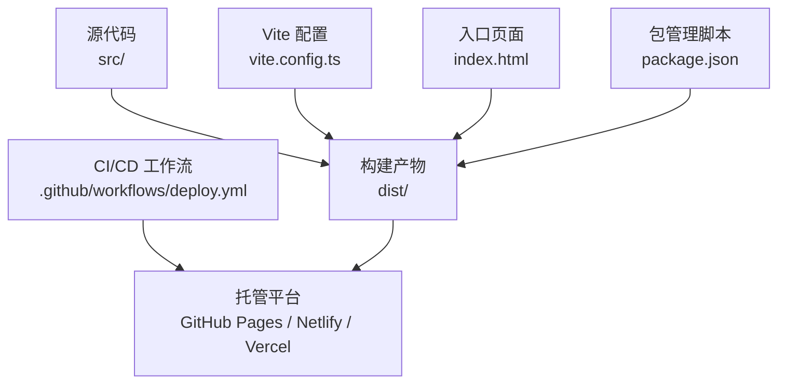
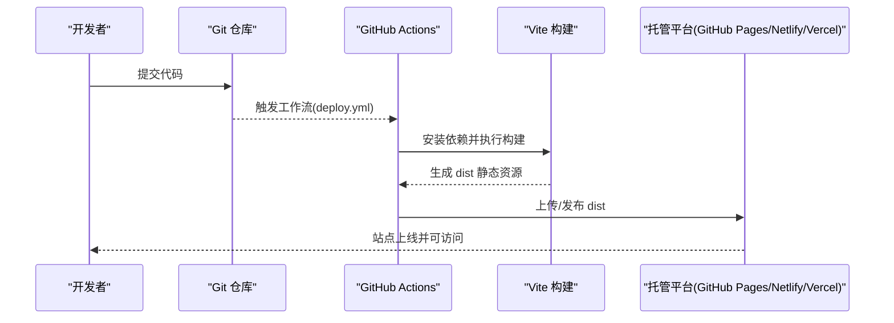
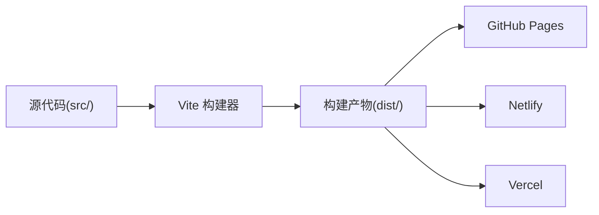

# 静态站点部署

<cite>
**本文引用的文件**   
- [vite.config.ts](file://vite.config.ts)
- [package.json](file://package.json)
- [.github/workflows/deploy.yml](file://.github/workflows/deploy.yml)
- [index.html](file://index.html)
</cite>

## 目录
1. [简介](#简介)
2. [项目结构](#项目结构)
3. [核心组件](#核心组件)
4. [架构总览](#架构总览)
5. [详细组件分析](#详细组件分析)
6. [依赖分析](#依赖分析)
7. [性能考虑](#性能考虑)
8. [故障排查指南](#故障排查指南)
9. [结论](#结论)
10. [附录](#附录)

## 简介
本指南面向 stk-table-vue 项目的静态站点发布，覆盖以下主题：
- 使用 Vite 构建静态资源（生产环境优化、路径设置、资源压缩）
- GitHub Pages 自动化部署（GitHub Actions 工作流与自动发布）
- Netlify 与 Vercel 平台部署配置（环境变量、自定义域名）
- CDN 集成方法与缓存策略
- 部署后性能监控与优化建议

## 项目结构
本项目采用 Vite + Vue 的常规前端工程结构。关键与部署相关的目录/文件包括：
- vite.config.ts：Vite 构建与插件配置
- package.json：脚本命令与依赖声明
- .github/workflows/deploy.yml：GitHub Actions 自动化部署
- index.html：应用入口 HTML

图表来源
- [vite.config.ts](file://vite.config.ts)
- [package.json](file://package.json)
- [.github/workflows/deploy.yml](file://.github/workflows/deploy.yml)
- [index.html](file://index.html)

章节来源
- [vite.config.ts](file://vite.config.ts)
- [package.json](file://package.json)
- [.github/workflows/deploy.yml](file://.github/workflows/deploy.yml)
- [index.html](file://index.html)

## 核心组件
- 构建系统：Vite 负责开发服务器与生产构建，输出静态资源到 dist 目录
- 打包产物：HTML、JS、CSS 及静态资源（图片、字体等），默认开启代码分割与压缩
- 部署流水线：通过 GitHub Actions 触发构建并推送至目标平台；或直接在 Netlify/Vercel 中连接仓库自动构建
- 运行入口：index.html 作为 SPA 根页面，由 Vite 注入运行时与路由基础路径

章节来源
- [package.json](file://package.json)
- [vite.config.ts](file://vite.config.ts)
- [index.html](file://index.html)

## 架构总览
下图展示从源码到线上站点的完整流程，包括本地构建、CI 构建与多平台发布。

图表来源
- [.github/workflows/deploy.yml](file://.github/workflows/deploy.yml)
- [vite.config.ts](file://vite.config.ts)
- [package.json](file://package.json)

## 详细组件分析

### Vite 构建与生产优化
- 构建目标：将 src 下的 Vue 单文件组件、样式与静态资源编译为浏览器可执行的静态文件，输出到 dist
- 生产优化要点：
  - 启用代码分割与按需加载，减少首屏体积
  - 启用 JS/CSS 压缩与资源哈希，提升缓存命中率
  - 合理设置 base 路径，确保在子路径部署时资源引用正确
- 常见配置项：
  - build.outDir：指定构建输出目录（通常为 dist）
  - build.minify：是否启用压缩（默认开启）
  - build.rollupOptions.output.manualChunks：按模块拆分，利于缓存与并行加载
  - build.assetsInlineLimit：小资源内联阈值，减少请求数
  - build.cssCodeSplit：CSS 代码分割开关
  - build.sourcemap：调试用 SourceMap（生产通常关闭）
- 路径设置：
  - base：当站点部署在子路径（如 /stk-table-vue/）时需设置为对应前缀
  - assetsDir：静态资源目录名（默认 assets）
- 资源压缩与缓存：
  - JS/CSS 默认压缩；图片/字体等资源可通过插件进一步压缩
  - 文件名带哈希，配合服务端长缓存头实现强缓存

章节来源
- [vite.config.ts](file://vite.config.ts)
- [package.json](file://package.json)

### GitHub Pages 自动化部署
- 工作流触发：push 或 pull_request 事件触发 .github/workflows/deploy.yml
- 基本步骤：
  - 检出代码
  - 安装 Node.js 与 pnpm/npm/yarn
  - 安装依赖
  - 执行构建（生成 dist）
  - 发布到 GitHub Pages（使用官方 action）
- 关键配置点：
  - 分支选择（通常为 main 或 gh-pages）
  - 发布目录（dist）
  - 环境变量（如 NODE_ENV=production）
  - 权限与令牌（GITHUB_TOKEN 默认可用）
- 注意事项：
  - 若部署在子路径，需在 Vite 中设置 base
  - 避免将敏感信息写入工作流文件，使用 Secrets

章节来源
- [.github/workflows/deploy.yml](file://.github/workflows/deploy.yml)
- [vite.config.ts](file://vite.config.ts)
- [package.json](file://package.json)

### Netlify 部署配置
- 连接仓库：在 Netlify 中绑定 Git 仓库，选择分支与构建命令
- 构建命令：执行 Vite 构建（例如 pnpm build 或 npm run build）
- 发布目录：dist
- 环境变量：在 Netlify 控制台添加（如 API 地址、功能开关等）
- 自定义域名：在 Domain settings 中添加域名与 DNS 解析记录
- 重定向与缓存：
  - 通过 netlify.toml 或控制台配置 301/302 重定向
  - 设置静态资源 Cache-Control 为长期缓存，HTML 短缓存或 no-cache

章节来源
- [package.json](file://package.json)
- [vite.config.ts](file://vite.config.ts)

### Vercel 部署配置
- 连接仓库：在 Vercel 中导入项目，自动识别 Vite 项目
- 构建命令：pnpm build 或 npm run build
- 输出目录：dist
- 环境变量：在 Vercel 项目设置中添加
- 自定义域名：在 Domains 中绑定并验证 DNS
- 路由与缓存：
  - 使用 vercel.json 配置 rewrites、headers、cache-control
  - 对静态资源设置 longCache，HTML 设置 shortCache

章节来源
- [package.json](file://package.json)
- [vite.config.ts](file://vite.config.ts)

### CDN 集成与缓存策略
- 静态资源上 CDN：
  - 将 dist 中的 JS/CSS/图片等上传至 CDN 或对象存储（如阿里云 OSS、腾讯云 COS、Cloudflare R2）
  - 在 index.html 或构建阶段替换资源 URL 为 CDN 地址
- 缓存策略：
  - 带哈希的资源：Cache-Control: public, max-age=31536000, immutable
  - HTML 文件：Cache-Control: no-cache 或较短 max-age，配合 ETag
- 回源与版本控制：
  - 通过版本号或时间戳区分不同构建
  - 灰度发布时可切换 CDN 路径或权重

章节来源
- [index.html](file://index.html)
- [vite.config.ts](file://vite.config.ts)

### 环境变量与运行时配置
- 构建期变量：通过 Vite 的 define 或 import.meta.env 注入（如 API_BASE_URL）
- 运行期变量：在托管平台的环境变量中设置，并在应用启动时读取
- 安全建议：
  - 不要在前端暴露密钥类信息
  - 使用最小权限原则配置平台 Secret

章节来源
- [vite.config.ts](file://vite.config.ts)
- [package.json](file://package.json)

## 依赖分析
- 构建依赖：Vite、Vue 编译器、TypeScript/ESLint/Prettier（可选）、压缩插件（可选）
- 运行时依赖：Vue 运行时库、第三方 UI 库（如存在）
- 部署依赖：Node.js、包管理器（pnpm/npm/yarn）、平台 CLI（可选）

图表来源
- [package.json](file://package.json)
- [vite.config.ts](file://vite.config.ts)

章节来源
- [package.json](file://package.json)
- [vite.config.ts](file://vite.config.ts)

## 性能考虑
- 首屏优化：
  - 启用代码分割与懒加载，减少主包体积
  - 预加载关键资源（preload/prefetch）
- 缓存优化：
  - 资源文件名带哈希，启用长期缓存
  - HTML 短缓存或 no-cache，保证更新及时
- 网络优化：
  - 启用 HTTP/2 或 HTTP/3
  - 使用 CDN 就近分发
- 监控指标：
  - LCP、FID、CLS、TTFB、FCP
  - 使用 Web Vitals、Lighthouse、Sentry 进行采集与分析

[本节为通用指导，不直接分析具体文件]

## 故障排查指南
- 构建失败：
  - 检查 Node.js 版本与包管理器一致性
  - 清理缓存后重试（node_modules/.cache、dist）
  - 查看构建日志定位错误模块
- 路径问题：
  - 子路径部署需设置 base
  - 检查资源引用是否为绝对路径或相对路径
- 缓存导致未更新：
  - 强制刷新或清除浏览器缓存
  - 确认资源文件名已变更（哈希变化）
- 权限与令牌：
  - GitHub Actions 需要 GITHUB_TOKEN
  - Netlify/Vercel 的 Secret 与环境变量是否正确

章节来源
- [.github/workflows/deploy.yml](file://.github/workflows/deploy.yml)
- [vite.config.ts](file://vite.config.ts)
- [package.json](file://package.json)

## 结论
通过合理的 Vite 构建配置与多平台部署方案，stk-table-vue 的静态站点可以实现高效构建、稳定发布与良好性能。结合 CDN、缓存策略与监控手段，可进一步提升用户体验与运维效率。

[本节为总结性内容，不直接分析具体文件]

## 附录
- 常用命令：
  - 本地开发：pnpm dev 或 npm run dev
  - 生产构建：pnpm build 或 npm run build
  - 预览构建产物：pnpm preview 或 npm run preview
- 推荐插件：
  - 图片压缩、SVG 优化、CSS 压缩
  - SourceMap 与性能分析插件（仅开发环境）

章节来源
- [package.json](file://package.json)
- [vite.config.ts](file://vite.config.ts)