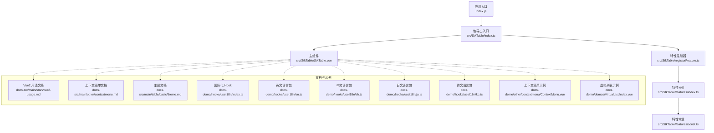
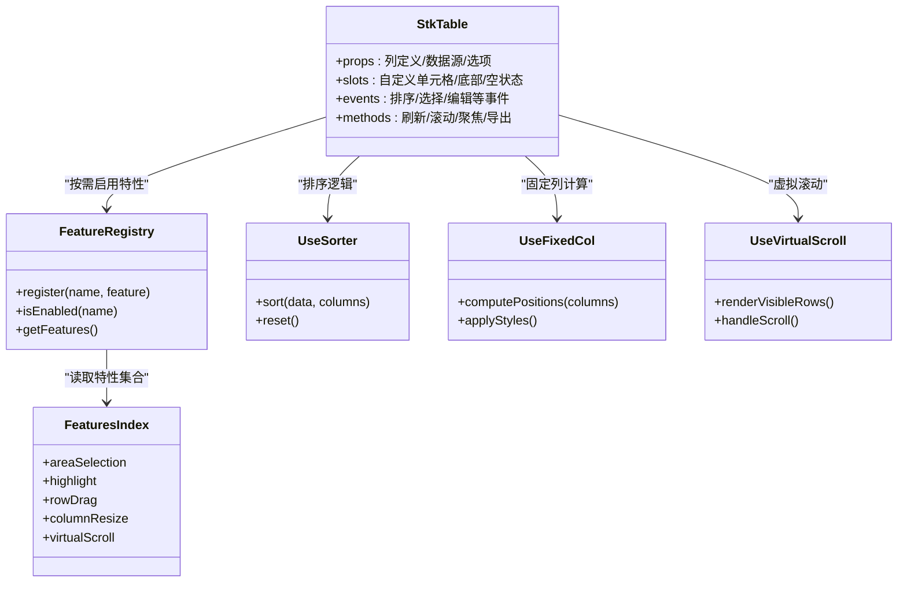
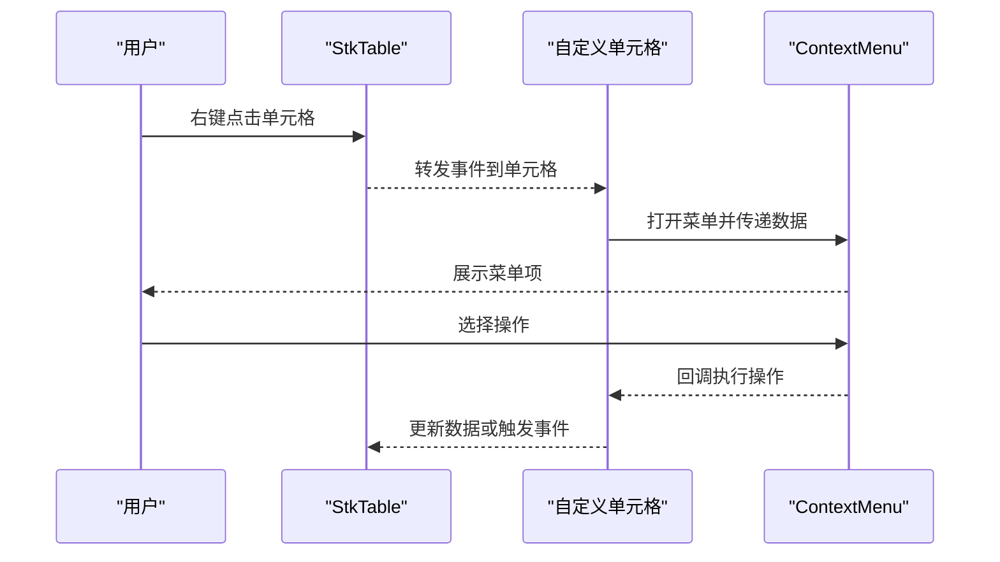
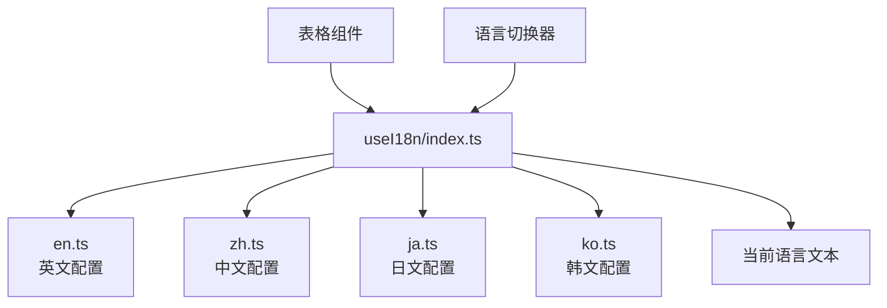
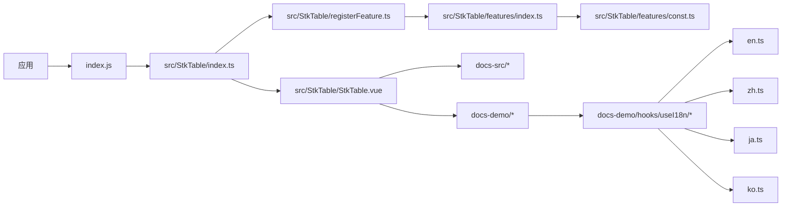

# 集成指南

<cite>
**本文引用的文件**   
- [package.json](file://package.json)
- [vite.config.ts](file://vite.config.ts)
- [index.js](file://index.js)
- [src/StkTable/index.ts](file://src/StkTable/index.ts)
- [src/StkTable/StkTable.vue](file://src/StkTable/StkTable.vue)
- [src/StkTable/registerFeature.ts](file://src/StkTable/registerFeature.ts)
- [src/StkTable/features/index.ts](file://src/StkTable/features/index.ts)
- [src/StkTable/features/const.ts](file://src/StkTable/features/const.ts)
- [docs-src/main/start/vue2-usage.md](file://docs-src/main/start/vue2-usage.md)
- [docs-src/main/other/experimental.md](file://docs-src/main/other/experimental.md)
- [docs-src/main/other/contextmenu.md](file://docs-src/main/other/contextmenu.md)
- [docs-src/main/table/basic/theme.md](file://docs-src/main/table/basic/theme.md)
- [docs-demo/hooks/useI18n/index.ts](file://docs-demo/hooks/useI18n/index.ts)
- [docs-demo/hooks/useI18n/en.ts](file://docs-demo/hooks/useI18n/en.ts)
- [docs-demo/hooks/useI18n/zh.ts](file://docs-demo/hooks/useI18n/zh.ts)
- [docs-demo/hooks/useI18n/ja.ts](file://docs-demo/hooks/useI18n/ja.ts)
- [docs-demo/hooks/useI18n/ko.ts](file://docs-demo/hooks/useI18n/ko.ts)
- [docs-demo/other/contextmenu/ContextMenu.vue](file://docs-demo/other/contextmenu/ContextMenu.vue)
- [docs-demo/demos/VirtualList/index.vue](file://docs-demo/demos/VirtualList/index.vue)
- [test/StkTableSimple.vue](file://test/StkTableSimple.vue)
</cite>

## 更新摘要
**所做更改**   
- 更新了国际化配置部分，详细说明了多语言支持的文件结构和使用方法
- 新增了 en.ts、zh.ts、ja.ts、ko.ts 四个语言文件的详细说明
- 完善了国际化 Hook 的使用示例和最佳实践
- 增强了多语言文档集成的指导内容

## 目录
1. [简介](#简介)
2. [项目结构](#项目结构)
3. [核心组件与入口](#核心组件与入口)
4. [架构总览](#架构总览)
5. [详细集成步骤](#详细集成步骤)
6. [依赖关系分析](#依赖关系分析)
7. [性能与构建优化](#性能与构建优化)
8. [常见问题与排错](#常见问题与排错)
9. [结论](#结论)
10. [附录：示例与参考](#附录示例与参考)

## 简介
本指南面向在 Vue 2 与 Vue 3 项目中集成 stk-table-vue 的开发者，覆盖安装、注册、基础使用、第三方库集成（上下文菜单、国际化、主题定制）、实验性功能启用、构建工具配置、打包优化与生产部署，以及常见兼容性问题的解决方案。文档以仓库源码与官方文档为依据，确保内容可落地、可验证。

## 项目结构
stk-table-vue 采用"核心组件 + 特性插件 + 文档与示例"的分层组织方式：
- 核心组件位于 src/StkTable，提供表格渲染、列管理、排序、固定列、虚拟滚动等能力。
- 特性系统通过 features 与 registerFeature 进行扩展与按需启用。
- 文档与示例位于 docs-src 与 docs-demo，包含多语言文档与演示代码。
- 构建与发布由 vite.config.ts、package.json、index.js 等驱动。

图表来源 
- [index.js:1-200](file://index.js#L1-L200)
- [src/StkTable/index.ts:1-200](file://src/StkTable/index.ts#L1-L200)
- [src/StkTable/StkTable.vue:1-200](file://src/StkTable/StkTable.vue#L1-L200)
- [src/StkTable/registerFeature.ts:1-200](file://src/StkTable/registerFeature.ts#L1-L200)
- [src/StkTable/features/index.ts:1-200](file://src/StkTable/features/index.ts#L1-L200)
- [src/StkTable/features/const.ts:1-200](file://src/StkTable/features/const.ts#L1-L200)
- [docs-src/main/start/vue2-usage.md:1-200](file://docs-src/main/start/vue2-usage.md#L1-L200)
- [docs-src/main/other/contextmenu.md:1-200](file://docs-src/main/other/contextmenu.md#L1-L200)
- [docs-src/main/table/basic/theme.md:1-200](file://docs-src/main/table/basic/theme.md#L1-L200)
- [docs-demo/hooks/useI18n/index.ts:1-200](file://docs-demo/hooks/useI18n/index.ts#L1-L200)
- [docs-demo/hooks/useI18n/en.ts:1-200](file://docs-demo/hooks/useI18n/en.ts#L1-L200)
- [docs-demo/hooks/useI18n/zh.ts:1-200](file://docs-demo/hooks/useI18n/zh.ts#L1-L200)
- [docs-demo/hooks/useI18n/ja.ts:1-200](file://docs-demo/hooks/useI18n/ja.ts#L1-L200)
- [docs-demo/hooks/useI18n/ko.ts:1-200](file://docs-demo/hooks/useI18n/ko.ts#L1-L200)
- [docs-demo/other/contextmenu/ContextMenu.vue:1-200](file://docs-demo/other/contextmenu/ContextMenu.vue#L1-L200)
- [docs-demo/demos/VirtualList/index.vue:1-200](file://docs-demo/demos/VirtualList/index.vue#L1-L200)

章节来源
- [package.json:1-200](file://package.json#L1-L200)
- [vite.config.ts:1-200](file://vite.config.ts#L1-L200)
- [index.js:1-200](file://index.js#L1-L200)
- [src/StkTable/index.ts:1-200](file://src/StkTable/index.ts#L1-L200)

## 核心组件与入口
- 包入口 index.js 负责对外暴露组件与样式，供外部项目引入。
- src/StkTable/index.ts 统一导出 StkTable 组件与相关类型、工具函数。
- src/StkTable/StkTable.vue 是表格核心实现，聚合列定义、数据源、事件与插槽。
- 特性系统通过 registerFeature.ts 与 features/index.ts 集中管理，支持按需启用。

章节来源
- [index.js:1-200](file://index.js#L1-L200)
- [src/StkTable/index.ts:1-200](file://src/StkTable/index.ts#L1-L200)
- [src/StkTable/StkTable.vue:1-200](file://src/StkTable/StkTable.vue#L1-L200)
- [src/StkTable/registerFeature.ts:1-200](file://src/StkTable/registerFeature.ts#L1-L200)
- [src/StkTable/features/index.ts:1-200](file://src/StkTable/features/index.ts#L1-L200)

## 架构总览
stk-table-vue 的运行时架构围绕"组件 + 特性 + 工具"展开：
- 组件层：StkTable.vue 作为根组件，负责渲染表头、行、单元格、滚动与交互。
- 特性层：features 模块提供可选能力（如区域选择、高亮、拖拽等），通过 registerFeature 注入。
- 工具层：use* 组合式函数处理排序、固定列、虚拟滚动、键盘导航等逻辑。
- 文档与示例：docs-src 与 docs-demo 提供多语言文档与可运行示例，便于快速上手与二次开发。

图表来源 
- [src/StkTable/StkTable.vue:1-200](file://src/StkTable/StkTable.vue#L1-L200)
- [src/StkTable/registerFeature.ts:1-200](file://src/StkTable/registerFeature.ts#L1-L200)
- [src/StkTable/features/index.ts:1-200](file://src/StkTable/features/index.ts#L1-L200)
- [src/StkTable/useSorter.ts:1-200](file://src/StkTable/useSorter.ts#L1-L200)
- [src/StkTable/useFixedCol.ts:1-200](file://src/StkTable/useFixedCol.ts#L1-L200)
- [src/StkTable/useVirtualScroll.ts:1-200](file://src/StkTable/useVirtualScroll.ts#L1-L200)

## 详细集成步骤

### 安装与基础使用
- 通过包管理器安装依赖后，在应用入口引入并注册组件。
- 在页面中直接使用 <StkTable> 标签，传入 columns 与 data 即可渲染基础表格。
- 如需全局样式，请确保引入样式文件。

章节来源
- [package.json:1-200](file://package.json#L1-L200)
- [index.js:1-200](file://index.js#L1-L200)
- [src/StkTable/index.ts:1-200](file://src/StkTable/index.ts#L1-L200)
- [test/StkTableSimple.vue:1-200](file://test/StkTableSimple.vue#L1-L200)

### Vue 2 与 Vue 3 的差异与兼容
- Vue 2 使用方式请参考官方文档中的说明，包括组件注册、生命周期差异与 API 适配点。
- Vue 3 推荐使用组合式 API 与响应式更新模式，注意 props 与 emits 的类型声明。
- 若在同一项目中同时存在 Vue 2 与 Vue 3，需分别引入对应版本的组件或做版本判断。

章节来源
- [docs-src/main/start/vue2-usage.md:1-200](file://docs-src/main/start/vue2-usage.md#L1-L200)

### 第三方库集成：上下文菜单
- 将上下文菜单组件与表格单元格或行绑定，监听右键事件触发菜单显示。
- 建议通过插槽或自定义单元格扩展，避免侵入核心渲染逻辑。
- 注意 z-index 层级与事件冒泡控制，防止与表格交互冲突。

图表来源 
- [docs-src/main/other/contextmenu.md:1-200](file://docs-src/main/other/contextmenu.md#L1-L200)
- [docs-demo/other/contextmenu/ContextMenu.vue:1-200](file://docs-demo/other/contextmenu/ContextMenu.vue#L1-L200)

章节来源
- [docs-src/main/other/contextmenu.md:1-200](file://docs-src/main/other/contextmenu.md#L1-L200)
- [docs-demo/other/contextmenu/ContextMenu.vue:1-200](file://docs-demo/other/contextmenu/ContextMenu.vue#L1-L200)

### 第三方库集成：国际化

**更新** 新增了完整的多语言支持配置，包含四种语言的配置文件

stk-table-vue 提供了完善的国际化解决方案，通过 hooks/useI18n 模块为表格文案（如排序、分页、空状态）提供多语言支持。项目现已支持以下语言：

- **en.ts** - 英文语言包
- **zh.ts** - 中文语言包  
- **ja.ts** - 日文语言包
- **ko.ts** - 韩文语言包

#### 国际化配置结构

图表来源 
- [docs-demo/hooks/useI18n/index.ts:1-200](file://docs-demo/hooks/useI18n/index.ts#L1-L200)
- [docs-demo/hooks/useI18n/en.ts:1-200](file://docs-demo/hooks/useI18n/en.ts#L1-L200)
- [docs-demo/hooks/useI18n/zh.ts:1-200](file://docs-demo/hooks/useI18n/zh.ts#L1-L200)
- [docs-demo/hooks/useI18n/ja.ts:1-200](file://docs-demo/hooks/useI18n/ja.ts#L1-L200)
- [docs-demo/hooks/useI18n/ko.ts:1-200](file://docs-demo/hooks/useI18n/ko.ts#L1-L200)

#### 使用方法

1. **初始化国际化配置**
   - 在应用启动时引入 useI18n hook
   - 设置默认语言和语言包

2. **在表格中使用**
   - 表格会自动识别当前语言并显示相应文案
   - 支持动态切换语言而无需重新渲染整个表格

3. **自定义翻译内容**
   - 对于自定义单元格与插槽内容，同样需要遵循 i18n 规范
   - 可通过扩展语言包添加自定义翻译键值

**Section sources**   
- [docs-demo/hooks/useI18n/index.ts:1-200](file://docs-demo/hooks/useI18n/index.ts#L1-L200)
- [docs-demo/hooks/useI18n/en.ts:1-200](file://docs-demo/hooks/useI18n/en.ts#L1-L200)
- [docs-demo/hooks/useI18n/zh.ts:1-200](file://docs-demo/hooks/useI18n/zh.ts#L1-L200)
- [docs-demo/hooks/useI18n/ja.ts:1-200](file://docs-demo/hooks/useI18n/ja.ts#L1-L200)
- [docs-demo/hooks/useI18n/ko.ts:1-200](file://docs-demo/hooks/useI18n/ko.ts#L1-L200)

### 第三方库集成：主题定制
- 通过 CSS 变量或样式覆盖的方式定制主题，包括颜色、字号、边框、滚动条等。
- 建议在应用级样式文件中集中管理主题变量，避免分散修改。
- 对于复杂主题场景，可使用预处理器（Less/Sass）统一管理样式。

章节来源
- [docs-src/main/table/basic/theme.md:1-200](file://docs-src/main/table/basic/theme.md#L1-L200)

### 实验性功能启用
- 实验性功能需在特性注册阶段显式启用，查看 features/const.ts 中的开关标识。
- 启用前阅读 experimental.md 的注意事项，评估稳定性与兼容性影响。
- 在生产环境建议关闭实验性功能，或在灰度环境中逐步验证。

章节来源
- [src/StkTable/features/const.ts:1-200](file://src/StkTable/features/const.ts#L1-L200)
- [docs-src/main/other/experimental.md:1-200](file://docs-src/main/other/experimental.md#L1-L200)

### 构建工具配置与打包优化
- Vite 配置中可设置别名、压缩、Tree Shaking 与分包策略，提升构建性能。
- 针对大表格场景，建议开启虚拟滚动与懒加载，减少首屏渲染压力。
- 生产环境启用代码压缩、资源哈希与 CDN 缓存策略。

章节来源
- [vite.config.ts:1-200](file://vite.config.ts#L1-L200)
- [package.json:1-200](file://package.json#L1-L200)

### 生产环境部署
- 构建产物输出至 dist 目录，部署至静态服务器或 CDN。
- 确保样式与字体资源路径正确，跨域问题提前解决。
- 监控与错误上报建议在应用层接入，便于定位线上问题。

章节来源
- [index.js:1-200](file://index.js#L1-L200)
- [package.json:1-200](file://package.json#L1-L200)

## 依赖关系分析
stk-table-vue 的依赖关系清晰分层：
- 应用层依赖包入口 index.js 与组件导出 src/StkTable/index.ts。
- 组件层依赖特性注册器与各类 use* 工具函数。
- 特性层依赖 features/index.ts 与 const.ts 中的开关与元信息。
- 文档与示例层依赖 hooks 与示例组件，用于演示最佳实践。

图表来源 
- [index.js:1-200](file://index.js#L1-L200)
- [src/StkTable/index.ts:1-200](file://src/StkTable/index.ts#L1-L200)
- [src/StkTable/StkTable.vue:1-200](file://src/StkTable/StkTable.vue#L1-L200)
- [src/StkTable/registerFeature.ts:1-200](file://src/StkTable/registerFeature.ts#L1-L200)
- [src/StkTable/features/index.ts:1-200](file://src/StkTable/features/index.ts#L1-L200)
- [src/StkTable/features/const.ts:1-200](file://src/StkTable/features/const.ts#L1-L200)
- [docs-src/main/start/vue2-usage.md:1-200](file://docs-src/main/start/vue2-usage.md#L1-L200)
- [docs-demo/hooks/useI18n/index.ts:1-200](file://docs-demo/hooks/useI18n/index.ts#L1-L200)
- [docs-demo/hooks/useI18n/en.ts:1-200](file://docs-demo/hooks/useI18n/en.ts#L1-L200)
- [docs-demo/hooks/useI18n/zh.ts:1-200](file://docs-demo/hooks/useI18n/zh.ts#L1-L200)
- [docs-demo/hooks/useI18n/ja.ts:1-200](file://docs-demo/hooks/useI18n/ja.ts#L1-L200)
- [docs-demo/hooks/useI18n/ko.ts:1-200](file://docs-demo/hooks/useI18n/ko.ts#L1-L200)

章节来源
- [src/StkTable/index.ts:1-200](file://src/StkTable/index.ts#L1-L200)
- [src/StkTable/StkTable.vue:1-200](file://src/StkTable/StkTable.vue#L1-L200)
- [src/StkTable/registerFeature.ts:1-200](file://src/StkTable/registerFeature.ts#L1-L200)
- [src/StkTable/features/index.ts:1-200](file://src/StkTable/features/index.ts#L1-L200)
- [src/StkTable/features/const.ts:1-200](file://src/StkTable/features/const.ts#L1-L200)

## 性能与构建优化
- 虚拟滚动：对大数据集启用虚拟滚动，仅渲染可视区域，显著降低内存占用与渲染耗时。
- 懒加载：结合异步数据加载，按需获取行或列数据，减少初始请求体积。
- 样式优化：使用 CSS 变量与最小化样式文件，避免重复样式与冗余类名。
- 构建优化：启用 Tree Shaking、代码分割与资源压缩，缩短构建时间与首屏加载时间。

章节来源
- [docs-demo/demos/VirtualList/index.vue:1-200](file://docs-demo/demos/VirtualList/index.vue#L1-L200)
- [vite.config.ts:1-200](file://vite.config.ts#L1-L200)

## 常见问题与排错
- 组件未渲染：检查是否正确引入样式与组件，确认 props 与 data 格式符合预期。
- 事件冲突：与第三方库（如上下文菜单）的事件冒泡与捕获顺序需明确，必要时使用 stopPropagation。
- 主题不生效：确认样式优先级与变量覆盖顺序，避免被全局样式覆盖。
- 虚拟滚动异常：检查容器高度与数据长度，确保滚动容器具备明确尺寸。
- 构建报错：检查依赖版本与 Node 版本兼容性，清理缓存后重试。
- 国际化问题：确认语言包文件路径正确，语言切换时是否触发了必要的重新渲染。

**更新** 新增了国际化相关问题的排查指导

章节来源
- [docs-src/main/other/contextmenu.md:1-200](file://docs-src/main/other/contextmenu.md#L1-L200)
- [docs-src/main/table/basic/theme.md:1-200](file://docs-src/main/table/basic/theme.md#L1-L200)
- [docs-demo/other/contextmenu/ContextMenu.vue:1-200](file://docs-demo/other/contextmenu/ContextMenu.vue#L1-L200)
- [docs-demo/hooks/useI18n/index.ts:1-200](file://docs-demo/hooks/useI18n/index.ts#L1-L200)

## 结论
stk-table-vue 提供了高性能、可扩展的表格解决方案，适用于 Vue 2 与 Vue 3 项目。通过清晰的架构设计与丰富的示例文档，开发者可以快速集成并定制所需功能。新增的多语言支持使得国际化配置更加完善，支持英文、中文、日文、韩文等多种语言。在生产环境中，建议关注性能优化与兼容性测试，确保稳定交付。

## 附录：示例与参考
- 基础使用示例：test/StkTableSimple.vue
- 虚拟列表示例：docs-demo/demos/VirtualList/index.vue
- 上下文菜单示例：docs-demo/other/contextmenu/ContextMenu.vue
- 国际化 Hook：docs-demo/hooks/useI18n/index.ts
- 英文语言包：docs-demo/hooks/useI18n/en.ts
- 中文语言包：docs-demo/hooks/useI18n/zh.ts
- 日文语言包：docs-demo/hooks/useI18n/ja.ts
- 韩文语言包：docs-demo/hooks/useI18n/ko.ts
- Vue 2 用法文档：docs-src/main/start/vue2-usage.md
- 上下文菜单文档：docs-src/main/other/contextmenu.md
- 主题文档：docs-src/main/table/basic/theme.md
- 实验性功能说明：docs-src/main/other/experimental.md

章节来源
- [test/StkTableSimple.vue:1-200](file://test/StkTableSimple.vue#L1-L200)
- [docs-demo/demos/VirtualList/index.vue:1-200](file://docs-demo/demos/VirtualList/index.vue#L1-L200)
- [docs-demo/other/contextmenu/ContextMenu.vue:1-200](file://docs-demo/other/contextmenu/ContextMenu.vue#L1-L200)
- [docs-demo/hooks/useI18n/index.ts:1-200](file://docs-demo/hooks/useI18n/index.ts#L1-L200)
- [docs-demo/hooks/useI18n/en.ts:1-200](file://docs-demo/hooks/useI18n/en.ts#L1-L200)
- [docs-demo/hooks/useI18n/zh.ts:1-200](file://docs-demo/hooks/useI18n/zh.ts#L1-L200)
- [docs-demo/hooks/useI18n/ja.ts:1-200](file://docs-demo/hooks/useI18n/ja.ts#L1-L200)
- [docs-demo/hooks/useI18n/ko.ts:1-200](file://docs-demo/hooks/useI18n/ko.ts#L1-L200)
- [docs-src/main/start/vue2-usage.md:1-200](file://docs-src/main/start/vue2-usage.md#L1-L200)
- [docs-src/main/other/contextmenu.md:1-200](file://docs-src/main/other/contextmenu.md#L1-L200)
- [docs-src/main/table/basic/theme.md:1-200](file://docs-src/main/table/basic/theme.md#L1-L200)
- [docs-src/main/other/experimental.md:1-200](file://docs-src/main/other/experimental.md#L1-L200)