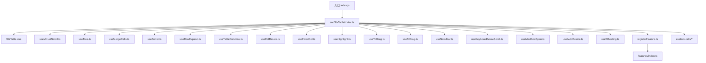
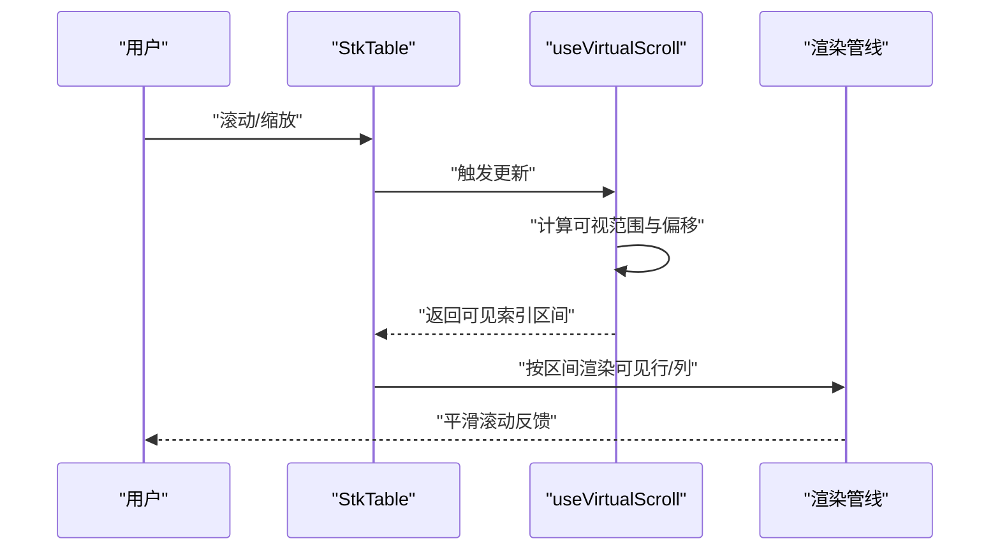
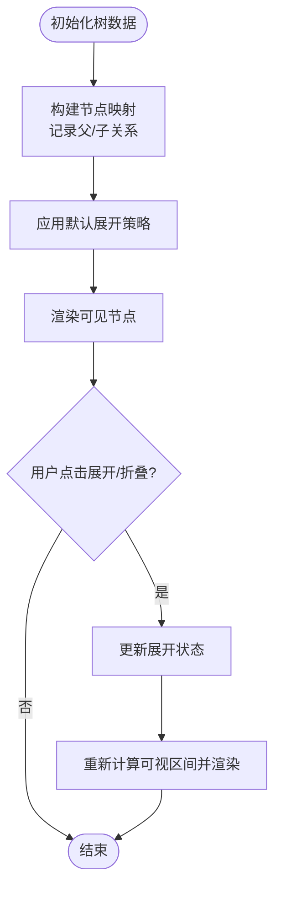
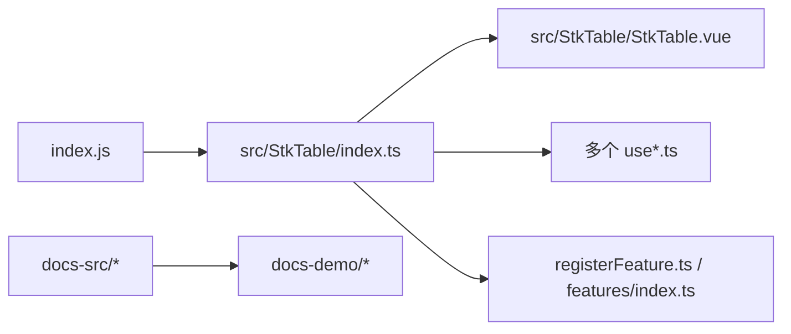

# 项目概览

<cite>
**本文引用的文件**   
- [package.json](file://package.json)
- [README.md](file://README.md)
- [index.js](file://index.js)
- [src/StkTable/index.ts](file://src/StkTable/index.ts)
- [src/StkTable/StkTable.vue](file://src/StkTable/StkTable.vue)
- [src/StkTable/useVirtualScroll.ts](file://src/StkTable/useVirtualScroll.ts)
- [src/StkTable/useTree.ts](file://src/StkTable/useTree.ts)
- [src/StkTable/useMergeCells.ts](file://src/StkTable/useMergeCells.ts)
- [src/StkTable/useSorter.ts](file://src/StkTable/useSorter.ts)
- [src/StkTable/useRowExpand.ts](file://src/StkTable/useRowExpand.ts)
- [src/StkTable/useTableColumns.ts](file://src/StkTable/useTableColumns.ts)
- [src/StkTable/useColResize.ts](file://src/StkTable/useColResize.ts)
- [src/StkTable/useFixedCol.ts](file://src/StkTable/useFixedCol.ts)
- [src/StkTable/useHighlight.ts](file://src/StkTable/useHighlight.ts)
- [src/StkTable/useThDrag.ts](file://src/StkTable/useThDrag.ts)
- [src/StkTable/useTrDrag.ts](file://src/StkTable/useTrDrag.ts)
- [src/StkTable/useScrollbar.ts](file://src/StkTable/useScrollbar.ts)
- [src/StkTable/useKeyboardArrowScroll.ts](file://src/StkTable/useKeyboardArrowScroll.ts)
- [src/StkTable/useMaxRowSpan.ts](file://src/StkTable/useMaxRowSpan.ts)
- [src/StkTable/useAutoResize.ts](file://src/StkTable/useAutoResize.ts)
- [src/StkTable/useWheeling.ts](file://src/StkTable/useWheeling.ts)
- [src/StkTable/registerFeature.ts](file://src/StkTable/registerFeature.ts)
- [src/StkTable/features/index.ts](file://src/StkTable/features/index.ts)
- [src/StkTable/custom-cells/CheckboxCell/index.ts](file://src/StkTable/custom-cells/CheckboxCell/index.ts)
- [src/StkTable/custom-cells/EditableCell/index.ts](file://src/StkTable/custom-cells/EditableCell/index.ts)
- [src/StkTable/custom-cells/FilterCell/index.ts](file://src/StkTable/custom-cells/FilterCell/index.ts)
- [src/StkTable/custom-cells/NumberCell/index.ts](file://src/StkTable/custom-cells/NumberCell/index.ts)
- [src/StkTable/custom-cells/ChangeCell/index.ts](file://src/StkTable/custom-cells/ChangeCell/index.ts)
- [docs-demo/basic/Basic.vue](file://docs-demo/basic/Basic.vue)
- [docs-demo/advanced/virtual/VirtualX.vue](file://docs-demo/advanced/virtual/VirtualX.vue)
- [docs-demo/advanced/virtual/VirtualY.vue](file://docs-demo/advanced/virtual/VirtualY.vue)
- [docs-demo/basic/tree/Tree.vue](file://docs-demo/basic/tree/Tree.vue)
- [docs-demo/demos/HugeData/index.vue](file://docs-demo/demos/HugeData/index.vue)
- [docs-demo/demos/VirtualList/index.vue](file://docs-demo/demos/VirtualList/index.vue)
- [docs-src/main/start/introduce.md](file://docs-src/main/start/introduce.md)
- [docs-src/main/table/advanced/virtual.md](file://docs-src/main/table/advanced/virtual.md)
- [docs-src/main/table/basic/tree.md](file://docs-src/main/table/basic/tree.md)
</cite>

## 目录
1. [简介](#简介)
2. [项目结构](#项目结构)
3. [核心组件与能力](#核心组件与能力)
4. [架构总览](#架构总览)
5. [关键模块详解](#关键模块详解)
6. [依赖关系分析](#依赖关系分析)
7. [性能与优化](#性能与优化)
8. [故障排查指南](#故障排查指南)
9. [结论](#结论)
10. [附录](#附录)

## 简介
stk-table-vue 是一个面向现代 Web 开发的高性能 Vue 表格组件库，聚焦于大数据量渲染、虚拟滚动、树形数据、自定义单元格、列宽调整、固定列、排序、合并单元格、行展开、高亮、拖拽、键盘导航等高级特性。其设计目标是在保证易用性的同时，提供接近原生 DOM 的渲染性能与灵活的扩展能力，适用于后台管理系统、数据分析面板、复杂表单与报表场景。

- 技术栈：Vue（支持 Vue 3，文档中亦包含 Vue 2 使用指引）、TypeScript、Vite、Vitest、VitePress 文档站点
- 版本兼容：详见 package.json 中的依赖与引擎要求；文档中包含 Vue 2 用法说明
- 许可证：参见 README.md 中的许可信息
- 适用场景：海量数据展示、可编辑表格、树形数据浏览、矩阵式数据、实时合并单元格、虚拟列表等

章节来源
- [README.md](file://README.md)
- [package.json](file://package.json)
- [docs-src/main/start/introduce.md](file://docs-src/main/start/introduce.md)

## 项目结构
仓库采用“源码 + 示例 + 文档”的分层组织方式：
- src：核心源码，包含 StkTable 主组件、功能 Hook、自定义单元格、类型定义与样式
- docs-demo：基于 Vite 的演示工程，覆盖基础与高级用例
- docs-src：VitePress 文档站点源码，含多语言文档
- lib：构建产物（打包后的 JS/CSS）
- test：单元测试与集成测试
- history：历史版本与兼容性代码

图表来源
- [index.js](file://index.js)
- [src/StkTable/index.ts](file://src/StkTable/index.ts)
- [src/StkTable/StkTable.vue](file://src/StkTable/StkTable.vue)
- [src/StkTable/registerFeature.ts](file://src/StkTable/registerFeature.ts)
- [src/StkTable/features/index.ts](file://src/StkTable/features/index.ts)

章节来源
- [index.js](file://index.js)
- [src/StkTable/index.ts](file://src/StkTable/index.ts)
- [src/StkTable/StkTable.vue](file://src/StkTable/StkTable.vue)

## 核心组件与能力
- 主组件：StkTable，统一暴露 props、事件、插槽与 API，内部通过多个 Hook 组合实现各项能力
- 列配置：useTableColumns 负责列解析、宽度计算、对齐与溢出处理
- 虚拟滚动：useVirtualScroll 提供 X/Y 方向虚拟滚动，支撑百万级数据流畅渲染
- 树形数据：useTree 管理节点展开/折叠、层级与虚拟滚动协同
- 排序：useSorter 支持单列/多列排序、空值处理、远程排序
- 合并单元格：useMergeCells 与 useMaxRowSpan 协作，支持行列合并与虚拟滚动兼容
- 行展开：useRowExpand 支持嵌套详情展示
- 列宽调整：useColResize 支持拖拽调整列宽
- 固定列：useFixedCol 与 useFixedStyle 配合，实现左右固定列与错位修正
- 高亮：useHighlight 支持行/单元格高亮与动画
- 拖拽：useThDrag（表头拖拽）、useTrDrag（行拖拽）
- 滚动体验：useScrollbar、useWheeling、useKeyboardArrowScroll 提升交互体验
- 自适应：useAutoResize 监听容器尺寸变化
- 自定义单元格：内置 CheckboxCell、EditableCell、FilterCell、NumberCell、ChangeCell 等，支持按需注册与扩展

章节来源
- [src/StkTable/StkTable.vue](file://src/StkTable/StkTable.vue)
- [src/StkTable/useTableColumns.ts](file://src/StkTable/useTableColumns.ts)
- [src/StkTable/useVirtualScroll.ts](file://src/StkTable/useVirtualScroll.ts)
- [src/StkTable/useTree.ts](file://src/StkTable/useTree.ts)
- [src/StkTable/useSorter.ts](file://src/StkTable/useSorter.ts)
- [src/StkTable/useMergeCells.ts](file://src/StkTable/useMergeCells.ts)
- [src/StkTable/useRowExpand.ts](file://src/StkTable/useRowExpand.ts)
- [src/StkTable/useColResize.ts](file://src/StkTable/useColResize.ts)
- [src/StkTable/useFixedCol.ts](file://src/StkTable/useFixedCol.ts)
- [src/StkTable/useHighlight.ts](file://src/StkTable/useHighlight.ts)
- [src/StkTable/useThDrag.ts](file://src/StkTable/useThDrag.ts)
- [src/StkTable/useTrDrag.ts](file://src/StkTable/useTrDrag.ts)
- [src/StkTable/useScrollbar.ts](file://src/StkTable/useScrollbar.ts)
- [src/StkTable/useKeyboardArrowScroll.ts](file://src/StkTable/useKeyboardArrowScroll.ts)
- [src/StkTable/useMaxRowSpan.ts](file://src/StkTable/useMaxRowSpan.ts)
- [src/StkTable/useAutoResize.ts](file://src/StkTable/useAutoResize.ts)
- [src/StkTable/useWheeling.ts](file://src/StkTable/useWheeling.ts)
- [src/StkTable/custom-cells/CheckboxCell/index.ts](file://src/StkTable/custom-cells/CheckboxCell/index.ts)
- [src/StkTable/custom-cells/EditableCell/index.ts](file://src/StkTable/custom-cells/EditableCell/index.ts)
- [src/StkTable/custom-cells/FilterCell/index.ts](file://src/StkTable/custom-cells/FilterCell/index.ts)
- [src/StkTable/custom-cells/NumberCell/index.ts](file://src/StkTable/custom-cells/NumberCell/index.ts)
- [src/StkTable/custom-cells/ChangeCell/index.ts](file://src/StkTable/custom-cells/ChangeCell/index.ts)

## 架构总览
StkTable 以“主组件 + 功能 Hook”的架构为核心，将渲染、布局、交互与业务逻辑解耦。各 Hook 专注于单一职责，通过响应式状态与事件总线在组件内协作。自定义单元格与插件通过 registerFeature 机制注入，形成可扩展的能力生态。

```mermaid
classDiagram
class StkTable {
+props
+events
+slots
+expose()
}
class UseVirtualScroll {
+init()
+update()
+renderVisible()
}
class UseTree {
+expand(key)
+collapse(key)
+getLevelMap()
}
class UseMergeCells {
+compute()
+applyToRender()
}
class UseSorter {
+sort(column, order)
+multiSort(columns)
}
class UseRowExpand {
+toggle(rowKey)
+isExpanded(key)
}
class UseTableColumns {
+parseColumns()
+calcWidths()
}
class UseColResize {
+start(col)
+resize(width)
+end()
}
class UseFixedCol {
+fixLeft(cols)
+fixRight(cols)
}
class UseHighlight {
+highlight(rows/cells)
+clear()
}
class UseThDrag {
+onHeaderDrag()
}
class UseTrDrag {
+onRowDrag()
}
class UseScrollbar {
+sync(scrollTop)
+sync(scrollLeft)
}
class UseKeyboardArrowScroll {
+handleKeydown(e)
}
class UseMaxRowSpan {
+computeSpans()
}
class UseAutoResize {
+observe()
+onResize()
}
class UseWheeling {
+bindWheel()
}
class RegisterFeature {
+register(name, feature)
+execute(features)
}
StkTable --> UseVirtualScroll : "组合"
StkTable --> UseTree : "组合"
StkTable --> UseMergeCells : "组合"
StkTable --> UseSorter : "组合"
StkTable --> UseRowExpand : "组合"
StkTable --> UseTableColumns : "组合"
StkTable --> UseColResize : "组合"
StkTable --> UseFixedCol : "组合"
StkTable --> UseHighlight : "组合"
StkTable --> UseThDrag : "组合"
StkTable --> UseTrDrag : "组合"
StkTable --> UseScrollbar : "组合"
StkTable --> UseKeyboardArrowScroll : "组合"
StkTable --> UseMaxRowSpan : "组合"
StkTable --> UseAutoResize : "组合"
StkTable --> UseWheeling : "组合"
StkTable --> RegisterFeature : "扩展点"
```

图表来源
- [src/StkTable/StkTable.vue](file://src/StkTable/StkTable.vue)
- [src/StkTable/useVirtualScroll.ts](file://src/StkTable/useVirtualScroll.ts)
- [src/StkTable/useTree.ts](file://src/StkTable/useTree.ts)
- [src/StkTable/useMergeCells.ts](file://src/StkTable/useMergeCells.ts)
- [src/StkTable/useSorter.ts](file://src/StkTable/useSorter.ts)
- [src/StkTable/useRowExpand.ts](file://src/StkTable/useRowExpand.ts)
- [src/StkTable/useTableColumns.ts](file://src/StkTable/useTableColumns.ts)
- [src/StkTable/useColResize.ts](file://src/StkTable/useColResize.ts)
- [src/StkTable/useFixedCol.ts](file://src/StkTable/useFixedCol.ts)
- [src/StkTable/useHighlight.ts](file://src/StkTable/useHighlight.ts)
- [src/StkTable/useThDrag.ts](file://src/StkTable/useThDrag.ts)
- [src/StkTable/useTrDrag.ts](file://src/StkTable/useTrDrag.ts)
- [src/StkTable/useScrollbar.ts](file://src/StkTable/useScrollbar.ts)
- [src/StkTable/useKeyboardArrowScroll.ts](file://src/StkTable/useKeyboardArrowScroll.ts)
- [src/StkTable/useMaxRowSpan.ts](file://src/StkTable/useMaxRowSpan.ts)
- [src/StkTable/useAutoResize.ts](file://src/StkTable/useAutoResize.ts)
- [src/StkTable/useWheeling.ts](file://src/StkTable/useWheeling.ts)
- [src/StkTable/registerFeature.ts](file://src/StkTable/registerFeature.ts)

## 关键模块详解

### 虚拟滚动（X/Y 方向）
- 作用：仅渲染可视区域行/列，大幅降低 DOM 节点数量，提升大数据渲染性能
- 关键点：可视窗口计算、偏移控制、边界回退、与固定列/合并单元格/树形数据的协同
- 典型用法：参考演示 VirtualX/VirtualY 与 HugeData/VirtualList

图表来源
- [src/StkTable/useVirtualScroll.ts](file://src/StkTable/useVirtualScroll.ts)
- [docs-demo/advanced/virtual/VirtualX.vue](file://docs-demo/advanced/virtual/VirtualX.vue)
- [docs-demo/advanced/virtual/VirtualY.vue](file://docs-demo/advanced/virtual/VirtualY.vue)
- [docs-demo/demos/HugeData/index.vue](file://docs-demo/demos/HugeData/index.vue)
- [docs-demo/demos/VirtualList/index.vue](file://docs-demo/demos/VirtualList/index.vue)

章节来源
- [src/StkTable/useVirtualScroll.ts](file://src/StkTable/useVirtualScroll.ts)
- [docs-src/main/table/advanced/virtual.md](file://docs-src/main/table/advanced/virtual.md)

### 树形数据
- 作用：支持层级数据展示、展开/折叠、默认展开策略与虚拟滚动协同
- 关键点：节点键映射、层级深度、懒加载扩展点、与排序/筛选的兼容

图表来源
- [src/StkTable/useTree.ts](file://src/StkTable/useTree.ts)
- [docs-demo/basic/tree/Tree.vue](file://docs-demo/basic/tree/Tree.vue)

章节来源
- [src/StkTable/useTree.ts](file://src/StkTable/useTree.ts)
- [docs-src/main/table/basic/tree.md](file://docs-src/main/table/basic/tree.md)

### 排序（单列/多列）
- 作用：对数据进行本地或远程排序，支持空值处理与多列优先级
- 关键点：排序算法稳定性、字段映射、与树形/分页/筛选的协同

章节来源
- [src/StkTable/useSorter.ts](file://src/StkTable/useSorter.ts)

### 合并单元格
- 作用：支持行列合并，提升报表类数据的可读性
- 关键点：合并规则计算、最大行跨度、与虚拟滚动的坐标映射

章节来源
- [src/StkTable/useMergeCells.ts](file://src/StkTable/useMergeCells.ts)
- [src/StkTable/useMaxRowSpan.ts](file://src/StkTable/useMaxRowSpan.ts)

### 行展开
- 作用：为每行提供可展开的详情区域，适合明细数据展示
- 关键点：展开状态管理、高度自适应、与虚拟滚动冲突规避

章节来源
- [src/StkTable/useRowExpand.ts](file://src/StkTable/useRowExpand.ts)

### 列宽调整与固定列
- 列宽调整：拖拽表头边缘调整列宽，支持最小/最大宽度限制
- 固定列：左右固定列与错位修正，确保滚动时视觉一致性

章节来源
- [src/StkTable/useColResize.ts](file://src/StkTable/useColResize.ts)
- [src/StkTable/useFixedCol.ts](file://src/StkTable/useFixedCol.ts)

### 高亮、拖拽与滚动体验
- 高亮：行/单元格级别高亮，支持动画过渡
- 拖拽：表头拖拽（如重排/调整）、行拖拽（如排序/分组）
- 滚动体验：自定义滚动条、滚轮行为、键盘上下键滚动

章节来源
- [src/StkTable/useHighlight.ts](file://src/StkTable/useHighlight.ts)
- [src/StkTable/useThDrag.ts](file://src/StkTable/useThDrag.ts)
- [src/StkTable/useTrDrag.ts](file://src/StkTable/useTrDrag.ts)
- [src/StkTable/useScrollbar.ts](file://src/StkTable/useScrollbar.ts)
- [src/StkTable/useWheeling.ts](file://src/StkTable/useWheeling.ts)
- [src/StkTable/useKeyboardArrowScroll.ts](file://src/StkTable/useKeyboardArrowScroll.ts)

### 自适应与列解析
- 自适应：监听容器尺寸变化，自动调整表格布局
- 列解析：解析列配置、计算宽度、处理对齐与溢出

章节来源
- [src/StkTable/useAutoResize.ts](file://src/StkTable/useAutoResize.ts)
- [src/StkTable/useTableColumns.ts](file://src/StkTable/useTableColumns.ts)

### 自定义单元格与扩展机制
- 内置单元格：复选框、可编辑、过滤、数字格式化、变更提示等
- 扩展机制：通过 registerFeature 注册新能力，按需启用

章节来源
- [src/StkTable/custom-cells/CheckboxCell/index.ts](file://src/StkTable/custom-cells/CheckboxCell/index.ts)
- [src/StkTable/custom-cells/EditableCell/index.ts](file://src/StkTable/custom-cells/EditableCell/index.ts)
- [src/StkTable/custom-cells/FilterCell/index.ts](file://src/StkTable/custom-cells/FilterCell/index.ts)
- [src/StkTable/custom-cells/NumberCell/index.ts](file://src/StkTable/custom-cells/NumberCell/index.ts)
- [src/StkTable/custom-cells/ChangeCell/index.ts](file://src/StkTable/custom-cells/ChangeCell/index.ts)
- [src/StkTable/registerFeature.ts](file://src/StkTable/registerFeature.ts)
- [src/StkTable/features/index.ts](file://src/StkTable/features/index.ts)

## 依赖关系分析
- 入口导出：index.js 统一导出库能力，指向 src/StkTable/index.ts
- 组件与 Hook：StkTable.vue 作为宿主，组合多个 Hook 完成功能拼装
- 扩展点：registerFeature 与 features/index.ts 提供插件化扩展
- 示例与文档：docs-demo 与 docs-src 分别承载演示与文档，便于学习与发布

图表来源
- [index.js](file://index.js)
- [src/StkTable/index.ts](file://src/StkTable/index.ts)
- [src/StkTable/StkTable.vue](file://src/StkTable/StkTable.vue)
- [src/StkTable/registerFeature.ts](file://src/StkTable/registerFeature.ts)
- [src/StkTable/features/index.ts](file://src/StkTable/features/index.ts)

章节来源
- [index.js](file://index.js)
- [src/StkTable/index.ts](file://src/StkTable/index.ts)

## 性能与优化
- 虚拟滚动：仅渲染可视区域，显著减少 DOM 节点与重绘开销
- 列解析缓存：避免重复计算列宽与布局
- 合并单元格优化：预计算最大行跨度，减少渲染时的复杂度
- 滚动节流：结合滚轮与键盘事件，降低高频事件带来的抖动
- 自适应监听：使用 ResizeObserver 精准监听容器变化，避免频繁重排
- 建议实践：
  - 大数据集优先开启虚拟滚动
  - 合理设置列宽与行高，避免动态计算过多
  - 合并单元格尽量静态化，减少运行时计算
  - 自定义单元格保持轻量，避免重型操作

[本节为通用指导，不直接分析具体文件]

## 故障排查指南
- 虚拟滚动异常：检查可视区计算与偏移是否正确，确认与固定列/合并单元格的兼容
- 树形数据错乱：核对节点键唯一性与父子关系映射，确认默认展开策略
- 排序结果不稳定：检查排序函数稳定性与空值处理逻辑
- 列宽错乱：确认列宽约束与自适应监听是否生效
- 拖拽卡顿：检查事件绑定与防抖/节流策略
- 滚动条样式异常：确认滚动条 Hook 与容器样式是否冲突

[本节为通用指导，不直接分析具体文件]

## 结论
stk-table-vue 以清晰的“主组件 + 功能 Hook”架构，提供了完善的大数据表格能力与灵活的扩展机制。通过虚拟滚动、树形数据、自定义单元格、排序、合并单元格、固定列、拖拽与键盘导航等特性，能够覆盖绝大多数企业级表格场景。对于初学者，可从基础示例入手逐步掌握；对于有经验的开发者，可通过扩展机制与 Hook 深入定制，满足复杂业务需求。

[本节为总结性内容，不直接分析具体文件]

## 附录
- 快速上手：参考 docs-src/main/start/introduce.md 与 docs-demo/basic/Basic.vue
- 虚拟滚动进阶：参考 docs-src/main/table/advanced/virtual.md 与 docs-demo/advanced/virtual/*
- 树形数据：参考 docs-src/main/table/basic/tree.md 与 docs-demo/basic/tree/Tree.vue
- 大数据与虚拟列表：参考 docs-demo/demos/HugeData/index.vue 与 docs-demo/demos/VirtualList/index.vue

章节来源
- [docs-src/main/start/introduce.md](file://docs-src/main/start/introduce.md)
- [docs-demo/basic/Basic.vue](file://docs-demo/basic/Basic.vue)
- [docs-src/main/table/advanced/virtual.md](file://docs-src/main/table/advanced/virtual.md)
- [docs-demo/advanced/virtual/VirtualX.vue](file://docs-demo/advanced/virtual/VirtualX.vue)
- [docs-demo/advanced/virtual/VirtualY.vue](file://docs-demo/advanced/virtual/VirtualY.vue)
- [docs-src/main/table/basic/tree.md](file://docs-src/main/table/basic/tree.md)
- [docs-demo/basic/tree/Tree.vue](file://docs-demo/basic/tree/Tree.vue)
- [docs-demo/demos/HugeData/index.vue](file://docs-demo/demos/HugeData/index.vue)
- [docs-demo/demos/VirtualList/index.vue](file://docs-demo/demos/VirtualList/index.vue)