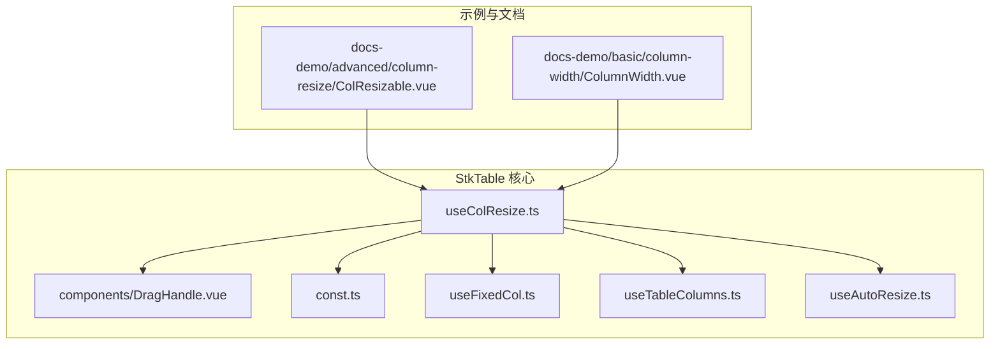
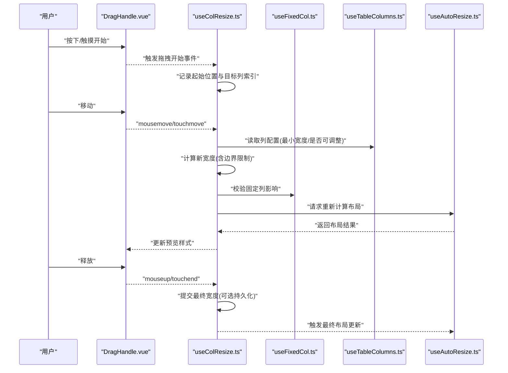
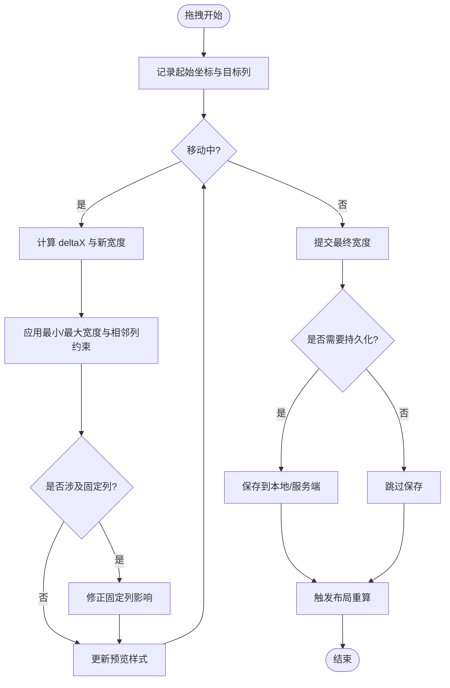
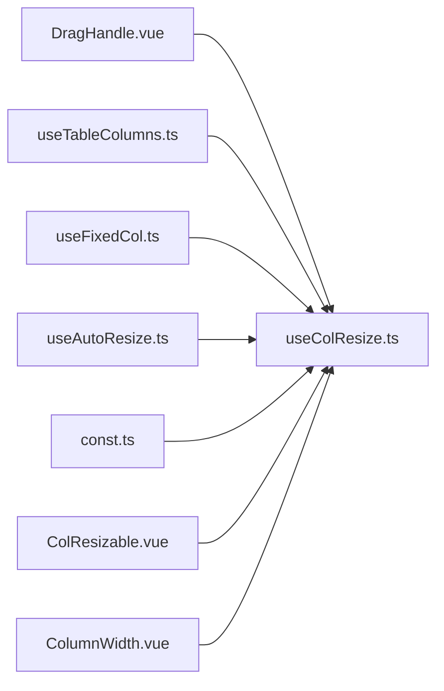

# 列宽调整

<cite>
**本文引用的文件**   
- [src/StkTable/useColResize.ts](file://src/StkTable/useColResize.ts)
- [src/StkTable/components/DragHandle.vue](file://src/StkTable/components/DragHandle.vue)
- [src/StkTable/const.ts](file://src/StkTable/const.ts)
- [src/StkTable/useFixedCol.ts](file://src/StkTable/useFixedCol.ts)
- [src/StkTable/useTableColumns.ts](file://src/StkTable/useTableColumns.ts)
- [src/StkTable/useAutoResize.ts](file://src/StkTable/useAutoResize.ts)
- [docs-demo/advanced/column-resize/ColResizable.vue](file://docs-demo/advanced/column-resize/ColResizable.vue)
- [docs-demo/basic/column-width/ColumnWidth.vue](file://docs-demo/basic/column-width/ColumnWidth.vue)
</cite>

## 目录
1. [简介](#简介)
2. [项目结构](#项目结构)
3. [核心组件与钩子](#核心组件与钩子)
4. [架构总览](#架构总览)
5. [详细组件分析](#详细组件分析)
6. [依赖关系分析](#依赖关系分析)
7. [性能考量](#性能考量)
8. [故障排查指南](#故障排查指南)
9. [结论](#结论)
10. [附录](#附录)

## 简介
本技术文档围绕 stk-table-vue 的“列宽调整”能力，系统阐述交互实现（拖拽手柄、实时预览、边界限制）、列宽计算算法（最小宽度、自适应布局、固定列与可调整列协调）、持久化存储方案（本地存储与服务端同步），以及响应式设计与多屏幕尺寸下的表现优化。文档面向开发者与使用者，既提供代码级细节，也给出实践建议与排错指引。

## 项目结构
与列宽调整相关的核心代码位于 src/StkTable 目录下，关键文件包括：
- useColResize.ts：列宽调整的核心逻辑（事件绑定、拖拽状态、宽度计算与更新）
- components/DragHandle.vue：拖拽手柄 UI 组件
- const.ts：常量定义（如默认最小宽度、拖拽样式等）
- useFixedCol.ts：固定列相关逻辑，与可调整列协同
- useTableColumns.ts：列配置与计算（是否可调整、初始宽度、最小宽度等）
- useAutoResize.ts：表格整体自适应布局（与列宽联动）
- docs-demo 中的示例：演示列宽调整在不同场景下的用法

图表来源
- [src/StkTable/useColResize.ts](file://src/StkTable/useColResize.ts)
- [src/StkTable/components/DragHandle.vue](file://src/StkTable/components/DragHandle.vue)
- [src/StkTable/const.ts](file://src/StkTable/const.ts)
- [src/StkTable/useFixedCol.ts](file://src/StkTable/useFixedCol.ts)
- [src/StkTable/useTableColumns.ts](file://src/StkTable/useTableColumns.ts)
- [src/StkTable/useAutoResize.ts](file://src/StkTable/useAutoResize.ts)
- [docs-demo/advanced/column-resize/ColResizable.vue](file://docs-demo/advanced/column-resize/ColResizable.vue)
- [docs-demo/basic/column-width/ColumnWidth.vue](file://docs-demo/basic/column-width/ColumnWidth.vue)

章节来源
- [src/StkTable/useColResize.ts](file://src/StkTable/useColResize.ts)
- [src/StkTable/components/DragHandle.vue](file://src/StkTable/components/DragHandle.vue)
- [src/StkTable/const.ts](file://src/StkTable/const.ts)
- [src/StkTable/useFixedCol.ts](file://src/StkTable/useFixedCol.ts)
- [src/StkTable/useTableColumns.ts](file://src/StkTable/useTableColumns.ts)
- [src/StkTable/useAutoResize.ts](file://src/StkTable/useAutoResize.ts)
- [docs-demo/advanced/column-resize/ColResizable.vue](file://docs-demo/advanced/column-resize/ColResizable.vue)
- [docs-demo/basic/column-width/ColumnWidth.vue](file://docs-demo/basic/column-width/ColumnWidth.vue)

## 核心组件与钩子
- useColResize.ts：负责监听鼠标/触摸事件，维护拖拽状态，计算目标列的新宽度，处理边界限制（最小宽度、最大宽度、相邻列约束），并触发列宽更新与渲染刷新。
- DragHandle.vue：渲染在表头单元格右侧的拖拽手柄，提供视觉反馈（光标变化、拖拽中样式），并将指针移动事件转发给父级逻辑。
- const.ts：集中定义列宽调整的常量（例如默认最小宽度、拖拽时的样式类名、阈值等）。
- useFixedCol.ts：管理固定列的位置与样式，确保在拖拽非固定列时不影响固定列布局；或在启用固定列模式时，限制可调整列的范围。
- useTableColumns.ts：解析列配置，决定哪些列可调整、初始宽度策略（固定/百分比/自适应）、最小宽度约束等。
- useAutoResize.ts：根据容器尺寸与列配置计算表格整体宽度与列宽分配策略，与列宽调整联动，避免溢出或留白异常。

章节来源
- [src/StkTable/useColResize.ts](file://src/StkTable/useColResize.ts)
- [src/StkTable/components/DragHandle.vue](file://src/StkTable/components/DragHandle.vue)
- [src/StkTable/const.ts](file://src/StkTable/const.ts)
- [src/StkTable/useFixedCol.ts](file://src/StkTable/useFixedCol.ts)
- [src/StkTable/useTableColumns.ts](file://src/StkTable/useTableColumns.ts)
- [src/StkTable/useAutoResize.ts](file://src/StkTable/useAutoResize.ts)

## 架构总览
列宽调整的整体流程如下：
- 用户在表头单元格的拖拽手柄上按下鼠标/触摸，进入拖拽状态
- 移动过程中实时计算新宽度，应用最小/最大宽度与相邻列约束，进行即时预览
- 释放后提交最终宽度，可选择持久化到本地存储或服务端
- 表格重新计算布局，保证固定列、自适应列与滚动条的协调

图表来源
- [src/StkTable/components/DragHandle.vue](file://src/StkTable/components/DragHandle.vue)
- [src/StkTable/useColResize.ts](file://src/StkTable/useColResize.ts)
- [src/StkTable/useFixedCol.ts](file://src/StkTable/useFixedCol.ts)
- [src/StkTable/useTableColumns.ts](file://src/StkTable/useTableColumns.ts)
- [src/StkTable/useAutoResize.ts](file://src/StkTable/useAutoResize.ts)

## 详细组件分析

### 拖拽手柄 DragHandle.vue
- 职责：渲染拖拽手柄元素，设置合适的 CSS 光标与拖拽态样式，捕获 pointerdown/mousemove/mouseup 等事件，将事件数据转发给上层逻辑。
- 交互要点：
  - 仅在允许调整的列显示手柄
  - 拖拽过程中禁用文本选择与默认行为，防止干扰
  - 支持触摸设备的事件兼容
- 与 useColResize 的协作：通过事件回调传递坐标与目标列信息，由 useColResize 完成宽度计算与更新。

章节来源
- [src/StkTable/components/DragHandle.vue](file://src/StkTable/components/DragHandle.vue)

### 列宽调整核心 useColResize.ts
- 事件生命周期：
  - 开始：记录起始 X 坐标、目标列索引、当前列宽快照
  - 移动：计算 deltaX，推导新宽度，应用最小/最大宽度与相邻列约束，实时更新预览
  - 结束：提交最终宽度，触发布局重算，可选持久化
- 边界限制：
  - 最小宽度：来自列配置或全局默认值
  - 最大宽度：可选配置或容器宽度限制
  - 相邻列约束：避免某列过窄导致内容不可读
- 固定列协调：
  - 若目标列邻近固定列，需考虑固定列的宽度与位置不变性
  - 在固定模式下，仅允许对非固定列进行调整
- 自适应布局：
  - 与 useAutoResize 配合，根据容器尺寸与列配置动态分配剩余空间
  - 当存在百分比或自适应列时，调整固定宽度列会按比例影响其他列

图表来源
- [src/StkTable/useColResize.ts](file://src/StkTable/useColResize.ts)
- [src/StkTable/useFixedCol.ts](file://src/StkTable/useFixedCol.ts)
- [src/StkTable/useTableColumns.ts](file://src/StkTable/useTableColumns.ts)
- [src/StkTable/useAutoResize.ts](file://src/StkTable/useAutoResize.ts)

章节来源
- [src/StkTable/useColResize.ts](file://src/StkTable/useColResize.ts)

### 固定列协调 useFixedCol.ts
- 职责：维护固定列的宽度与位置，确保在拖拽非固定列时不破坏固定布局
- 与列宽调整协作：
  - 在计算新宽度时，检查是否与固定列相邻，必要时限制调整范围
  - 在固定模式下，屏蔽对固定列的直接调整，仅允许调整非固定列

章节来源
- [src/StkTable/useFixedCol.ts](file://src/StkTable/useFixedCol.ts)

### 列配置与计算 useTableColumns.ts
- 职责：解析列配置，确定每列的最小宽度、是否可调整、初始宽度策略（像素/百分比/自适应）
- 与列宽调整协作：
  - 为 useColResize 提供列的可调整性与边界约束
  - 在自适应模式下，参与剩余空间的分配计算

章节来源
- [src/StkTable/useTableColumns.ts](file://src/StkTable/useTableColumns.ts)

### 自适应布局 useAutoResize.ts
- 职责：根据容器尺寸与列配置计算表格整体宽度与列宽分配策略
- 与列宽调整协作：
  - 在拖拽过程中，根据新宽度快速估算布局变化，提升预览性能
  - 在拖拽结束后，执行精确布局计算，确保无溢出或留白异常

章节来源
- [src/StkTable/useAutoResize.ts](file://src/StkTable/useAutoResize.ts)

### 常量定义 const.ts
- 职责：集中定义列宽调整相关的全局常量（如默认最小宽度、拖拽样式类名、阈值等）
- 使用场景：
  - 为 DragHandle 提供样式类名
  - 为 useColResize 提供默认最小宽度与阈值

章节来源
- [src/StkTable/const.ts](file://src/StkTable/const.ts)

### 示例与用法
- ColResizable.vue：展示高级列宽调整用法，包括与虚拟滚动、固定列等特性的组合
- ColumnWidth.vue：基础列宽控制示例，演示如何配置列的最小宽度与初始宽度

章节来源
- [docs-demo/advanced/column-resize/ColResizable.vue](file://docs-demo/advanced/column-resize/ColResizable.vue)
- [docs-demo/basic/column-width/ColumnWidth.vue](file://docs-demo/basic/column-width/ColumnWidth.vue)

## 依赖关系分析
- useColResize.ts 依赖：
  - DragHandle.vue：获取拖拽事件
  - useTableColumns.ts：读取列配置与约束
  - useFixedCol.ts：协调固定列布局
  - useAutoResize.ts：触发布局重算
  - const.ts：使用全局常量
- 示例组件依赖 useColResize.ts 提供的能力，以演示不同场景下的列宽调整

图表来源
- [src/StkTable/components/DragHandle.vue](file://src/StkTable/components/DragHandle.vue)
- [src/StkTable/useColResize.ts](file://src/StkTable/useColResize.ts)
- [src/StkTable/useTableColumns.ts](file://src/StkTable/useTableColumns.ts)
- [src/StkTable/useFixedCol.ts](file://src/StkTable/useFixedCol.ts)
- [src/StkTable/useAutoResize.ts](file://src/StkTable/useAutoResize.ts)
- [src/StkTable/const.ts](file://src/StkTable/const.ts)
- [docs-demo/advanced/column-resize/ColResizable.vue](file://docs-demo/advanced/column-resize/ColResizable.vue)
- [docs-demo/basic/column-width/ColumnWidth.vue](file://docs-demo/basic/column-width/ColumnWidth.vue)

章节来源
- [src/StkTable/useColResize.ts](file://src/StkTable/useColResize.ts)
- [src/StkTable/components/DragHandle.vue](file://src/StkTable/components/DragHandle.vue)
- [src/StkTable/useTableColumns.ts](file://src/StkTable/useTableColumns.ts)
- [src/StkTable/useFixedCol.ts](file://src/StkTable/useFixedCol.ts)
- [src/StkTable/useAutoResize.ts](file://src/StkTable/useAutoResize.ts)
- [src/StkTable/const.ts](file://src/StkTable/const.ts)
- [docs-demo/advanced/column-resize/ColResizable.vue](file://docs-demo/advanced/column-resize/ColResizable.vue)
- [docs-demo/basic/column-width/ColumnWidth.vue](file://docs-demo/basic/column-width/ColumnWidth.vue)

## 性能考量
- 事件节流与防抖：在拖拽移动过程中对 mousemove/touchmove 进行节流，减少频繁计算与渲染
- 增量更新：仅更新受影响的列与行，避免全表重绘
- 布局计算优化：结合 useAutoResize 的缓存策略，避免重复计算
- 固定列优先：优先保证固定列布局稳定，减少不必要的重排
- 移动端适配：降低触摸事件的频率，优化预览流畅度

[本节为通用指导，无需特定文件引用]

## 故障排查指南
- 拖拽无效：
  - 检查列配置是否允许调整（useTableColumns.ts）
  - 确认 DragHandle.vue 是否正确挂载与事件绑定
- 宽度异常：
  - 查看最小/最大宽度配置（const.ts 与 useTableColumns.ts）
  - 检查固定列冲突（useFixedCol.ts）
- 布局错位：
  - 验证 useAutoResize.ts 的计算逻辑与容器尺寸
- 持久化失败：
  - 检查本地存储权限与服务端接口可用性

章节来源
- [src/StkTable/useTableColumns.ts](file://src/StkTable/useTableColumns.ts)
- [src/StkTable/components/DragHandle.vue](file://src/StkTable/components/DragHandle.vue)
- [src/StkTable/const.ts](file://src/StkTable/const.ts)
- [src/StkTable/useFixedCol.ts](file://src/StkTable/useFixedCol.ts)
- [src/StkTable/useAutoResize.ts](file://src/StkTable/useAutoResize.ts)

## 结论
stk-table-vue 的列宽调整功能通过清晰的组件与钩子分工，实现了从交互到计算的完整闭环。其设计兼顾了用户体验（实时预览、边界限制）与工程实践（固定列协调、自适应布局、性能优化）。在实际应用中，可根据业务需求扩展持久化策略与响应式行为，以获得更佳的跨设备体验。

[本节为总结性内容，无需特定文件引用]

## 附录
- 最佳实践建议：
  - 合理设置列的最小宽度，避免内容被截断
  - 在固定列模式下，明确可调整列的范围
  - 针对移动端优化拖拽手感与性能
- 常见问题解答：
  - 如何在虚拟滚动下保持列宽一致？
  - 如何处理百分比列与固定宽度列的混合布局？

[本节为补充说明，无需特定文件引用]