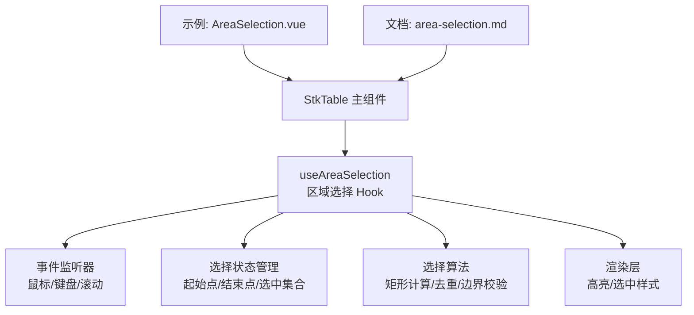
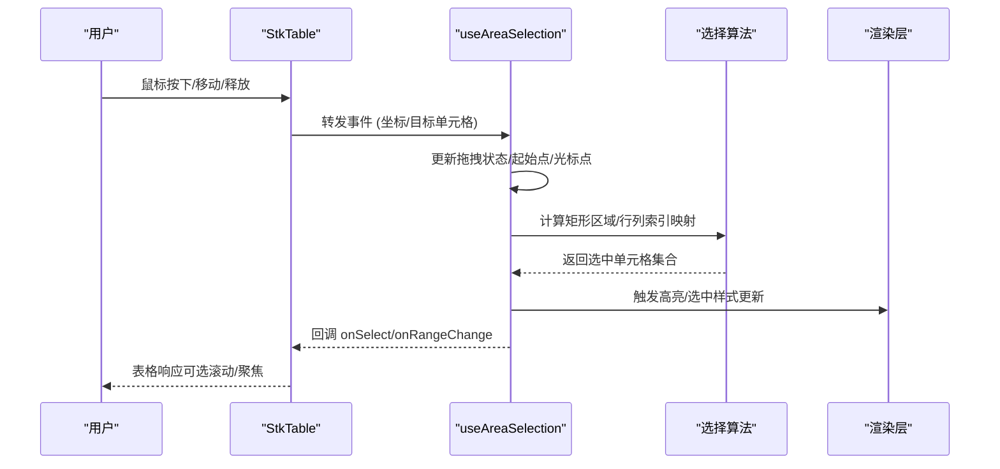
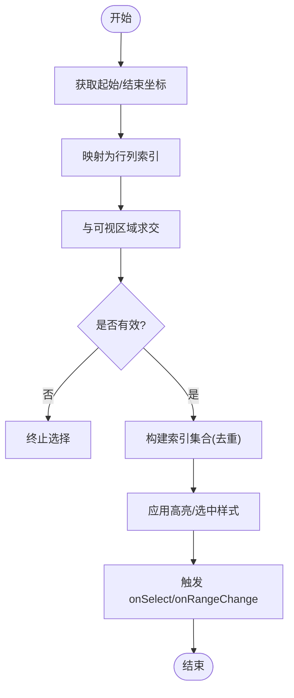

# 区域选择

<cite>
**本文引用的文件**   
- [src/StkTable/features/useAreaSelection.ts](file://src/StkTable/features/useAreaSelection.ts)
- [src/StkTable/features/useAreaSelection.bak.ts](file://src/StkTable/features/useAreaSelection.bak.ts)
- [docs-demo/advanced/area-selection/AreaSelection.vue](file://docs-demo/advanced/area-selection/AreaSelection.vue)
- [docs-src/main/table/advanced/area-selection.md](file://docs-src/main/table/advanced/area-selection.md)
</cite>

## 目录
1. [简介](#简介)
2. [项目结构](#项目结构)
3. [核心组件](#核心组件)
4. [架构总览](#架构总览)
5. [详细组件分析](#详细组件分析)
6. [依赖关系分析](#依赖关系分析)
7. [性能考虑](#性能考虑)
8. [故障排查指南](#故障排查指南)
9. [结论](#结论)
10. [附录](#附录)

## 简介
本技术文档聚焦 stk-table-vue 的区域选择功能，系统性阐述其交互逻辑、状态管理、选择算法与性能优化策略。内容覆盖鼠标拖拽选择、键盘操作支持、矩形区域计算、重叠单元格处理、选择范围验证，以及批量操作、数据导出、统计分析等典型使用场景。同时提供面向大数据量表格的性能保障建议与常见问题排查方法，帮助开发者高效集成并稳定扩展该能力。

## 项目结构
区域选择功能的核心实现位于 features 目录下的 useAreaSelection.ts，示例与文档分别位于 docs-demo 与 docs-src。整体组织方式遵循“特性插件化”的架构：通过组合式 Hook 暴露区域选择能力，并在表格主组件中按需启用。



图表来源 
- [src/StkTable/features/useAreaSelection.ts](file://src/StkTable/features/useAreaSelection.ts)
- [docs-demo/advanced/area-selection/AreaSelection.vue](file://docs-demo/advanced/area-selection/AreaSelection.vue)
- [docs-src/main/table/advanced/area-selection.md](file://docs-src/main/table/advanced/area-selection.md)

章节来源
- [src/StkTable/features/useAreaSelection.ts](file://src/StkTable/features/useAreaSelection.ts)
- [docs-demo/advanced/area-selection/AreaSelection.vue](file://docs-demo/advanced/area-selection/AreaSelection.vue)
- [docs-src/main/table/advanced/area-selection.md](file://docs-src/main/table/advanced/area-selection.md)

## 核心组件
- 区域选择 Hook（useAreaSelection）
  - 职责：封装区域选择的完整生命周期，包括事件绑定、状态维护、算法计算与结果输出。
  - 关键能力：
    - 鼠标拖拽：mousedown/mousemove/mouseup 驱动选择框绘制与更新。
    - 键盘操作：方向键移动焦点、Shift+方向键扩展选择、Ctrl/Cmd+点击切换单个单元格、Esc 取消选择。
    - 选择状态：记录起始坐标、当前光标位置、已选集合、是否处于拖拽中。
    - 选择算法：基于可视区域的矩形交集计算、行列索引映射、重复单元格去重、越界裁剪。
    - 事件回调：onSelect/onRangeChange 等钩子，供上层执行批量操作或统计。
    - 性能优化：增量更新选中集合、避免全表遍历、虚拟滚动兼容、防抖节流。

章节来源
- [src/StkTable/features/useAreaSelection.ts](file://src/StkTable/features/useAreaSelection.ts)

## 架构总览
区域选择以 Hook 为中心，向上暴露 API，向下对接表格的事件系统与渲染系统。下图展示从用户输入到选择结果输出的调用链。



图表来源 
- [src/StkTable/features/useAreaSelection.ts](file://src/StkTable/features/useAreaSelection.ts)

## 详细组件分析

### 交互逻辑与事件流
- 鼠标拖拽选择
  - mousedown：记录起始单元格坐标，进入拖拽态。
  - mousemove：根据当前鼠标位置计算结束坐标，实时刷新选择区域。
  - mouseup：结束拖拽，提交最终选择集合并触发回调。
- 键盘操作支持
  - 方向键：移动焦点单元格。
  - Shift+方向键：以焦点为基准扩展选择范围。
  - Ctrl/Cmd+点击：切换单个单元格的选中状态。
  - Esc：清空选择并退出拖拽态。
- 滚动联动
  - 在拖拽过程中若跨越可视区边界，自动滚动以保持选择连续性。

章节来源
- [src/StkTable/features/useAreaSelection.ts](file://src/StkTable/features/useAreaSelection.ts)

### 选择算法与数据结构
- 矩形区域计算
  - 将起始点与结束点映射为行列索引对，形成二维矩形。
  - 与可视区域求交，确保仅处理可见范围内的单元格。
- 重叠单元格处理
  - 使用行列索引作为唯一键，构建 Set 进行去重。
  - 支持跨页/分页场景下的索引归一化。
- 选择范围验证
  - 边界检查：防止超出最大行列数。
  - 非法输入过滤：忽略不可选列/行（如固定列、隐藏列）。
  - 冲突处理：与合并单元格、树形展开等特性的兼容性判断。



图表来源 
- [src/StkTable/features/useAreaSelection.ts](file://src/StkTable/features/useAreaSelection.ts)

### 状态管理与数据流
- 内部状态
  - isDragging：是否处于拖拽中。
  - startCell：起始单元格坐标（行/列索引）。
  - currentCell：当前光标单元格坐标。
  - selectedCells：已选单元格集合（基于索引的唯一标识）。
  - focusCell：当前焦点单元格坐标（用于键盘导航）。
- 数据流
  - 事件输入 → 状态更新 → 算法计算 → 渲染反馈 → 回调输出。
  - 支持撤销/重做扩展（预留接口）。

章节来源
- [src/StkTable/features/useAreaSelection.ts](file://src/StkTable/features/useAreaSelection.ts)

### 使用示例与场景
- 批量操作
  - 通过 onSelect 回调收集选中行数据，统一执行删除/修改等操作。
- 数据导出
  - 将选中单元格对应的原始数据序列化为 CSV/Excel 格式。
- 统计分析
  - 对选中数值型字段进行求和、均值、方差等聚合计算。
- 复杂表格
  - 与合并单元格、树形结构、虚拟滚动等特性协同工作。

章节来源
- [docs-demo/advanced/area-selection/AreaSelection.vue](file://docs-demo/advanced/area-selection/AreaSelection.vue)
- [docs-src/main/table/advanced/area-selection.md](file://docs-src/main/table/advanced/area-selection.md)

## 依赖关系分析
- 内部依赖
  - 表格事件系统：负责捕获鼠标/键盘事件并传递给 Hook。
  - 渲染系统：根据选中集合更新单元格样式。
  - 虚拟滚动：保证在大列表下仍可进行精确坐标映射与区域计算。
- 外部依赖
  - 无强耦合第三方库，保持轻量与可移植性。

```mermaid
graph LR
Events["事件系统"] --> AS["useAreaSelection"]
Render["渲染系统"] <- --> AS
Virtual["虚拟滚动"] --> AS
AS --> Callbacks["回调接口"]
```

图表来源 
- [src/StkTable/features/useAreaSelection.ts](file://src/StkTable/features/useAreaSelection.ts)

章节来源
- [src/StkTable/features/useAreaSelection.ts](file://src/StkTable/features/useAreaSelection.ts)

## 性能考虑
- 大数据量优化
  - 增量更新：仅重新计算受影响的行列区间，避免全表遍历。
  - 索引缓存：复用行列索引映射，减少重复计算。
  - 防抖节流：在 mousemove 高频事件中限制计算频率。
  - 虚拟滚动兼容：基于可视区域裁剪计算范围，降低 DOM 操作开销。
- 内存管理
  - 及时清理无效选中项，避免集合膨胀。
  - 使用弱引用或池化对象减少 GC 压力。
- 渲染优化
  - 批量更新样式，减少重排重绘。
  - 使用 CSS 类切换而非内联样式。

[本节为通用性能指导，不直接分析具体文件]

## 故障排查指南
- 常见问题
  - 选择区域错位：检查坐标映射与可视区域求交逻辑。
  - 键盘操作无效：确认焦点管理与事件冒泡控制。
  - 大数据卡顿：启用防抖与增量计算，检查虚拟滚动配置。
  - 合并单元格冲突：调整选择算法对合并区域的识别规则。
- 调试技巧
  - 打印中间状态：起始点、结束点、选中集合大小。
  - 可视化选择框：临时开启调试模式观察矩形变化。
  - 性能剖析：使用浏览器性能面板定位热点函数。

章节来源
- [src/StkTable/features/useAreaSelection.ts](file://src/StkTable/features/useAreaSelection.ts)

## 结论
stk-table-vue 的区域选择功能通过模块化 Hook 设计，实现了高内聚、低耦合的选择能力。其交互逻辑完善、算法健壮、性能优化到位，能够胜任从简单表格到大数据量复杂场景的需求。开发者可基于提供的回调接口快速集成批量操作、数据导出与统计分析等功能，并通过扩展点适配更多业务特性。

[本节为总结性内容，不直接分析具体文件]

## 附录
- 相关文档
  - 区域选择使用说明与示例见 [docs-src/main/table/advanced/area-selection.md](file://docs-src/main/table/advanced/area-selection.md)
  - 示例代码见 [docs-demo/advanced/area-selection/AreaSelection.vue](file://docs-demo/advanced/area-selection/AreaSelection.vue)
- 历史版本
  - 旧版实现参考 [src/StkTable/features/useAreaSelection.bak.ts](file://src/StkTable/features/useAreaSelection.bak.ts)

章节来源
- [docs-src/main/table/advanced/area-selection.md](file://docs-src/main/table/advanced/area-selection.md)
- [docs-demo/advanced/area-selection/AreaSelection.vue](file://docs-demo/advanced/area-selection/AreaSelection.vue)
- [src/StkTable/features/useAreaSelection.bak.ts](file://src/StkTable/features/useAreaSelection.bak.ts)