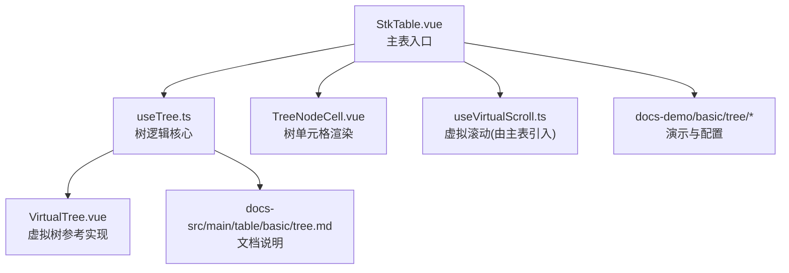
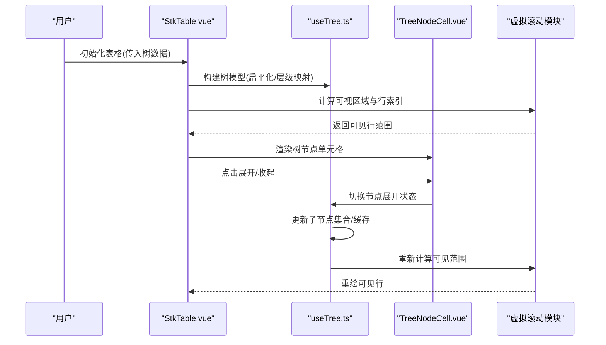
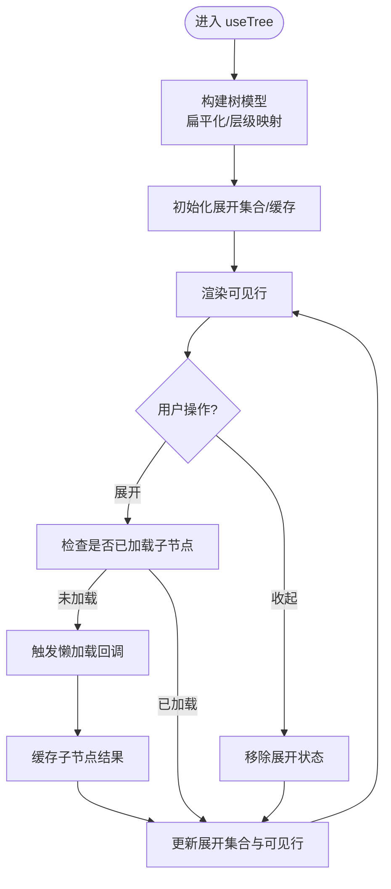
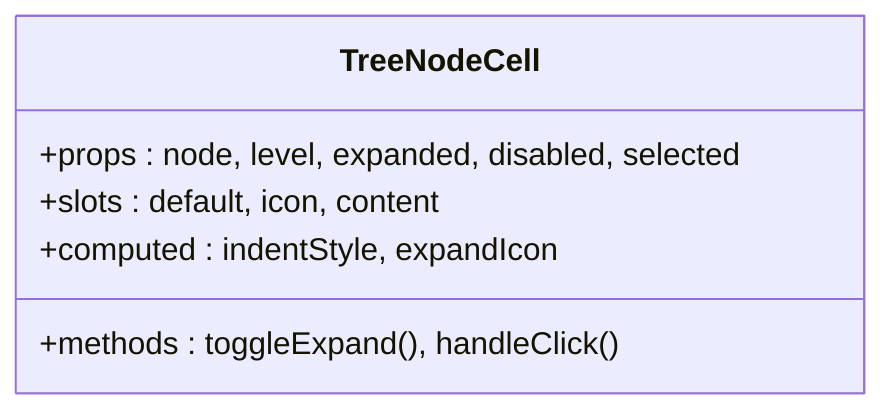
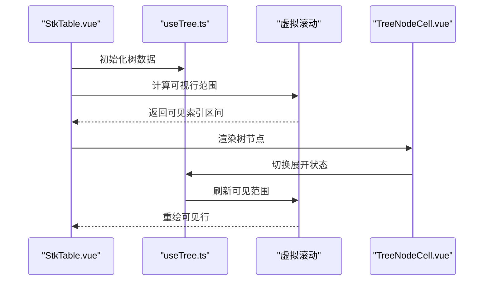
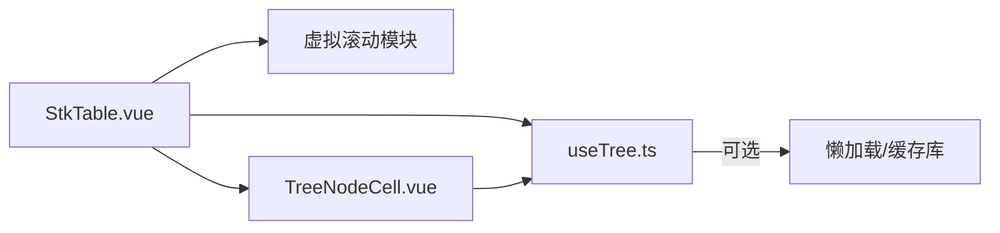

# 树形数据

<cite>
**本文引用的文件**   
- [src/StkTable/useTree.ts](file://src/StkTable/useTree.ts)
- [src/StkTable/components/TreeNodeCell.vue](file://src/StkTable/components/TreeNodeCell.vue)
- [src/StkTable/StkTable.vue](file://src/StkTable/StkTable.vue)
- [src/VirtualTree.vue](file://src/VirtualTree.vue)
- [docs-demo/basic/tree/Tree.vue](file://docs-demo/basic/tree/Tree.vue)
- [docs-demo/basic/tree/TreeVirtualList.vue](file://docs-demo/basic/tree/TreeVirtualList.vue)
- [docs-demo/basic/tree/config.ts](file://docs-demo/basic/tree/config.ts)
- [docs-src/main/table/basic/tree.md](file://docs-src/main/table/basic/tree.md)
</cite>

## 目录
1. [简介](#简介)
2. [项目结构](#项目结构)
3. [核心组件与能力](#核心组件与能力)
4. [架构总览](#架构总览)
5. [详细组件分析](#详细组件分析)
6. [依赖关系分析](#依赖关系分析)
7. [性能考量](#性能考量)
8. [故障排查指南](#故障排查指南)
9. [结论](#结论)
10. [附录](#附录)

## 简介
本技术文档聚焦 stk-table-vue 的树形数据能力，系统性阐述：
- 树形数据模型设计（父子关系、层级展开/收起、节点状态管理）
- 渲染机制（递归渲染优化、懒加载策略、虚拟滚动与树结构的结合）
- 操作方法（展开/折叠、搜索过滤等）
- 大数据量场景下的性能优化建议与实践

目标是帮助开发者快速理解并高效使用树形表格功能，同时提供可操作的优化与排障指引。

## 项目结构
与树形数据相关的关键代码集中在以下位置：
- 树逻辑核心：useTree.ts（树状态、展开/收起、懒加载、虚拟滚动集成）
- 树单元格渲染：TreeNodeCell.vue（缩进、展开图标、点击交互）
- 主表入口：StkTable.vue（启用树模式、与虚拟滚动协同）
- 独立虚拟树示例：VirtualTree.vue（纯树列表的虚拟滚动参考实现）
- 演示与配置：docs-demo/basic/tree/*（树基础用法、虚拟树、默认展开配置）
- 文档说明：docs-src/main/table/basic/tree.md（API 与使用说明）

图表来源
- [src/StkTable/StkTable.vue](file://src/StkTable/StkTable.vue)
- [src/StkTable/useTree.ts](file://src/StkTable/useTree.ts)
- [src/StkTable/components/TreeNodeCell.vue](file://src/StkTable/components/TreeNodeCell.vue)
- [src/VirtualTree.vue](file://src/VirtualTree.vue)
- [docs-demo/basic/tree/Tree.vue](file://docs-demo/basic/tree/Tree.vue)
- [docs-src/main/table/basic/tree.md](file://docs-src/main/table/basic/tree.md)

章节来源
- [src/StkTable/StkTable.vue](file://src/StkTable/StkTable.vue)
- [src/StkTable/useTree.ts](file://src/StkTable/useTree.ts)
- [src/StkTable/components/TreeNodeCell.vue](file://src/StkTable/components/TreeNodeCell.vue)
- [src/VirtualTree.vue](file://src/VirtualTree.vue)
- [docs-demo/basic/tree/Tree.vue](file://docs-demo/basic/tree/Tree.vue)
- [docs-src/main/table/basic/tree.md](file://docs-src/main/table/basic/tree.md)

## 核心组件与能力
- useTree.ts：封装树的核心能力，包括：
  - 树节点扁平化与层级映射
  - 展开/收起状态管理与批量操作
  - 懒加载子节点的触发与缓存
  - 与虚拟滚动的坐标/索引对齐
- TreeNodeCell.vue：负责树节点的视觉呈现与交互：
  - 缩进计算与层级展示
  - 展开/收起图标与点击事件
  - 选中态、禁用态、高亮态等样式联动
- StkTable.vue：作为表格容器，启用树模式后：
  - 将 useTree 的状态注入到行渲染管线
  - 与虚拟滚动模块协作，保证展开/收起后的滚动稳定性
- VirtualTree.vue：独立的虚拟树组件，用于对比与参考：
  - 仅树结构的虚拟滚动实现
  - 适合不需要列编辑、排序等复杂能力的场景

章节来源
- [src/StkTable/useTree.ts](file://src/StkTable/useTree.ts)
- [src/StkTable/components/TreeNodeCell.vue](file://src/StkTable/components/TreeNodeCell.vue)
- [src/StkTable/StkTable.vue](file://src/StkTable/StkTable.vue)
- [src/VirtualTree.vue](file://src/VirtualTree.vue)

## 架构总览
下图展示了树形数据在表格中的整体流程：从数据源到渲染，再到用户交互与状态更新。

图表来源
- [src/StkTable/StkTable.vue](file://src/StkTable/StkTable.vue)
- [src/StkTable/useTree.ts](file://src/StkTable/useTree.ts)
- [src/StkTable/components/TreeNodeCell.vue](file://src/StkTable/components/TreeNodeCell.vue)

## 详细组件分析

### 树数据模型与状态管理（useTree.ts）
- 数据模型设计
  - 支持父子关系的树形数据结构，通常包含标识字段、父级引用或层级路径
  - 内部维护扁平化视图，便于与表格行一一对应
  - 层级信息（depth）与缩进值用于渲染
- 展开/收起逻辑
  - 基于节点 key 的展开集合管理，支持单点切换与批量控制
  - 默认展开策略：按 key 列表、按层级深度、或全部展开
  - 切换时同步更新可见行索引，确保虚拟滚动正确性
- 懒加载策略
  - 首次展开时触发加载回调，按需获取子节点并缓存
  - 支持并发请求去抖与错误重试
  - 加载状态反馈（加载中占位、失败提示）
- 节点状态管理
  - 选中、禁用、高亮等状态与 UI 联动
  - 状态变更通过统一接口暴露，便于上层业务订阅

图表来源
- [src/StkTable/useTree.ts](file://src/StkTable/useTree.ts)

章节来源
- [src/StkTable/useTree.ts](file://src/StkTable/useTree.ts)

### 树单元格渲染与交互（TreeNodeCell.vue）
- 渲染机制
  - 根据层级 depth 计算缩进，确保树形层次清晰
  - 展开/收起图标与节点文本并列显示
  - 支持自定义插槽以扩展单元格内容
- 交互处理
  - 点击图标触发展开/收起
  - 支持键盘导航与无障碍访问
  - 与表格选中、高亮等状态联动
- 性能优化
  - 避免不必要的重渲染，利用 Vue 的响应式粒度控制
  - 对大列表采用惰性渲染与条件渲染

图表来源
- [src/StkTable/components/TreeNodeCell.vue](file://src/StkTable/components/TreeNodeCell.vue)

章节来源
- [src/StkTable/components/TreeNodeCell.vue](file://src/StkTable/components/TreeNodeCell.vue)

### 主表集成与虚拟滚动（StkTable.vue）
- 树模式启用
  - 通过配置项开启树模式，绑定 useTree 状态
  - 将树节点渲染为特殊行类型
- 与虚拟滚动协作
  - 展开/收起后重新计算可视区域与行偏移
  - 保持滚动位置稳定，避免抖动
- 事件总线
  - 暴露展开/收起、选中、懒加载等事件供上层监听

图表来源
- [src/StkTable/StkTable.vue](file://src/StkTable/StkTable.vue)
- [src/StkTable/useTree.ts](file://src/StkTable/useTree.ts)
- [src/StkTable/components/TreeNodeCell.vue](file://src/StkTable/components/TreeNodeCell.vue)

章节来源
- [src/StkTable/StkTable.vue](file://src/StkTable/StkTable.vue)

### 独立虚拟树参考（VirtualTree.vue）
- 适用场景
  - 仅需树形列表展示，无需列编辑、排序等复杂能力
- 特性
  - 纯虚拟滚动实现，内存占用低
  - 支持展开/收起、懒加载、选中态
- 与表格的差异
  - 无列体系，结构简单
  - 更适合轻量级树展示需求

章节来源
- [src/VirtualTree.vue](file://src/VirtualTree.vue)

### 演示与配置（docs-demo/basic/tree/*）
- Tree.vue：基础树形表格用法
- TreeVirtualList.vue：树与虚拟滚动结合示例
- config.ts：默认展开策略、键名映射等配置

章节来源
- [docs-demo/basic/tree/Tree.vue](file://docs-demo/basic/tree/Tree.vue)
- [docs-demo/basic/tree/TreeVirtualList.vue](file://docs-demo/basic/tree/TreeVirtualList.vue)
- [docs-demo/basic/tree/config.ts](file://docs-demo/basic/tree/config.ts)

## 依赖关系分析
- 组件耦合
  - StkTable.vue 依赖 useTree.ts 与虚拟滚动模块
  - TreeNodeCell.vue 依赖 useTree.ts 暴露的状态与方法
- 外部依赖
  - Vue 响应式系统用于状态驱动渲染
  - 可选的第三方库用于懒加载与缓存（如 axios、lodash）
- 潜在循环依赖
  - 通过模块化拆分避免循环引用
  - useTree.ts 作为纯逻辑层，不直接依赖 UI 组件

图表来源
- [src/StkTable/StkTable.vue](file://src/StkTable/StkTable.vue)
- [src/StkTable/useTree.ts](file://src/StkTable/useTree.ts)
- [src/StkTable/components/TreeNodeCell.vue](file://src/StkTable/components/TreeNodeCell.vue)

章节来源
- [src/StkTable/StkTable.vue](file://src/StkTable/StkTable.vue)
- [src/StkTable/useTree.ts](file://src/StkTable/useTree.ts)
- [src/StkTable/components/TreeNodeCell.vue](file://src/StkTable/components/TreeNodeCell.vue)

## 性能考量
- 大数据量树形结构优化
  - 使用虚拟滚动限制 DOM 节点数量
  - 懒加载子节点，避免一次性加载全量数据
  - 扁平化树模型，减少层级遍历开销
- 渲染优化
  - 合理设置 key，避免不必要的重渲染
  - 使用 computed 缓存中间结果
  - 避免在模板中执行复杂计算
- 交互优化
  - 展开/收起操作防抖，减少频繁状态更新
  - 批量操作合并更新，降低重绘次数
- 内存管理
  - 及时清理未使用的缓存与监听器
  - 避免闭包持有大量数据引用

[本节为通用性能指导，不直接分析具体文件]

## 故障排查指南
- 常见问题
  - 展开后滚动错乱：检查虚拟滚动与树状态更新的时序
  - 懒加载不触发：确认展开事件与回调绑定是否正确
  - 节点重复或丢失：验证 key 的唯一性与扁平化逻辑
- 调试技巧
  - 打印 useTree 的内部状态（展开集合、缓存、可见行索引）
  - 使用浏览器性能面板分析渲染耗时
  - 逐步缩小数据规模定位问题

章节来源
- [src/StkTable/useTree.ts](file://src/StkTable/useTree.ts)
- [src/StkTable/components/TreeNodeCell.vue](file://src/StkTable/components/TreeNodeCell.vue)

## 结论
stk-table-vue 的树形数据功能通过 useTree.ts 与 TreeNodeCell.vue 的紧密协作，实现了高性能、可扩展的树形表格体验。结合虚拟滚动与懒加载，能够有效应对大数据量场景。开发者可根据实际需求选择合适的配置与优化策略，以获得最佳的用户体验。

[本节为总结性内容，不直接分析具体文件]

## 附录
- API 参考：docs-src/main/table/basic/tree.md
- 演示代码：docs-demo/basic/tree/*
- 独立虚拟树：src/VirtualTree.vue

章节来源
- [docs-src/main/table/basic/tree.md](file://docs-src/main/table/basic/tree.md)
- [docs-demo/basic/tree/Tree.vue](file://docs-demo/basic/tree/Tree.vue)
- [src/VirtualTree.vue](file://src/VirtualTree.vue)