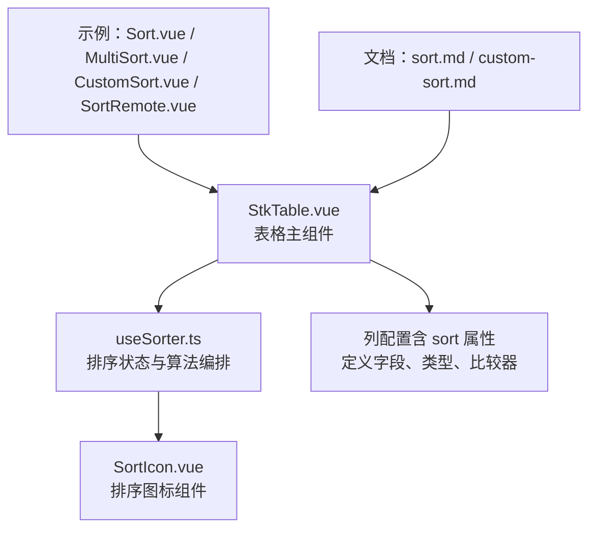
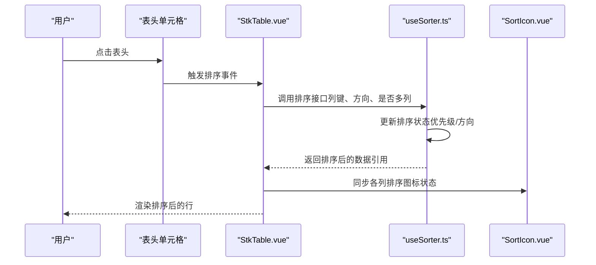
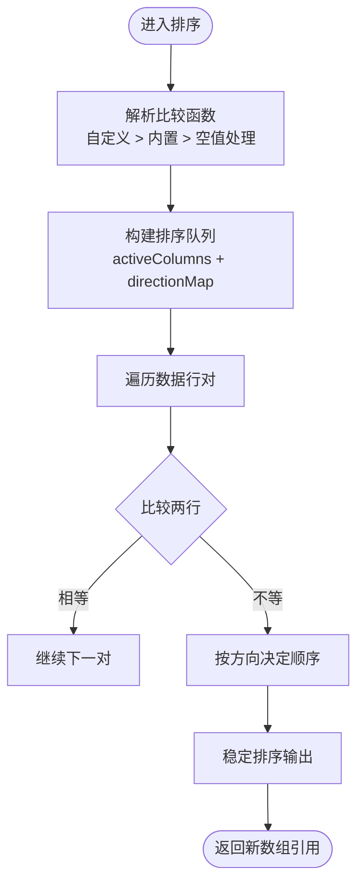
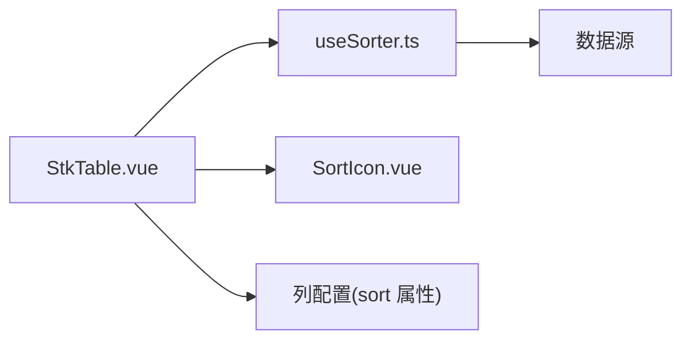

# 自定义排序

<cite>
**本文引用的文件**   
- [useSorter.ts](file://src/StkTable/useSorter.ts)
- [StkTable.vue](file://src/StkTable/StkTable.vue)
- [SortIcon.vue](file://src/StkTable/components/SortIcon.vue)
- [sort.md](file://docs-src/main/table/basic/sort.md)
- [custom-sort.md](file://docs-src/main/table/advanced/custom-sort.md)
- [Sort.vue](file://docs-demo/basic/sort/Sort.vue)
- [MultiSort.vue](file://docs-demo/basic/sort/MultiSort.vue)
- [CustomSort.vue](file://docs-demo/basic/sort/CustomSort.vue)
- [SortRemote.vue](file://docs-demo/basic/sort/SortRemote.vue)
- [InsertSort.vue](file://docs-demo/advanced/custom-sort/InsertSort.vue)
- [defaultSort.test.js](file://test/defaultSort.test.js)
- [setSorter.test.js](file://test/setSorter.test.js)
</cite>

## 目录
1. [简介](#简介)
2. [项目结构](#项目结构)
3. [核心组件](#核心组件)
4. [架构总览](#架构总览)
5. [详细组件分析](#详细组件分析)
6. [依赖关系分析](#依赖关系分析)
7. [性能考量](#性能考量)
8. [故障排查指南](#故障排查指南)
9. [结论](#结论)
10. [附录](#附录)

## 简介
本文件面向 stk-table-vue 的“自定义排序”能力，系统性阐述排序算法实现原理、多列排序与优先级处理、自定义比较函数编写方法、排序状态管理、排序图标显示、以及服务端排序方案与最佳实践。文档兼顾初学者与进阶开发者，提供从概念到代码级实现的完整说明，并附带丰富的场景示例路径，便于快速上手与深入定制。

## 项目结构
与排序相关的核心源码位于 src/StkTable 目录，其中 useSorter.ts 负责排序逻辑编排与状态管理；StkTable.vue 作为表格主组件，集成排序能力并与列配置交互；components/SortIcon.vue 提供排序图标展示。示例与文档位于 docs-demo 与 docs-src，覆盖基础排序、多列排序、自定义排序与服务端排序等场景。

图表来源
- [StkTable.vue](file://src/StkTable/StkTable.vue)
- [useSorter.ts](file://src/StkTable/useSorter.ts)
- [SortIcon.vue](file://src/StkTable/components/SortIcon.vue)

章节来源
- [StkTable.vue](file://src/StkTable/StkTable.vue)
- [useSorter.ts](file://src/StkTable/useSorter.ts)
- [SortIcon.vue](file://src/StkTable/components/SortIcon.vue)
- [sort.md](file://docs-src/main/table/basic/sort.md)
- [custom-sort.md](file://docs-src/main/table/advanced/custom-sort.md)

## 核心组件
- 排序引擎 useSorter.ts
  - 维护排序状态：当前激活的列、排序方向、多列排序队列与优先级。
  - 提供排序执行入口：根据列配置选择内置或自定义比较器，生成稳定排序结果。
  - 支持空值策略：统一将 undefined/null 置于末尾或开头，保证排序稳定性。
  - 暴露 API：设置默认排序、切换排序方向、追加/移除排序列、清空排序等。
- 表格主组件 StkTable.vue
  - 接收列配置中的排序相关属性，驱动 useSorter 进行排序。
  - 在渲染阶段应用排序后的数据顺序，确保虚拟滚动、固定列等特性与排序兼容。
- 排序图标 SortIcon.vue
  - 根据当前列的排序状态显示升序/降序/未排序图标，支持无障碍标签与国际化文案。

章节来源
- [useSorter.ts](file://src/StkTable/useSorter.ts)
- [StkTable.vue](file://src/StkTable/StkTable.vue)
- [SortIcon.vue](file://src/StkTable/components/SortIcon.vue)

## 架构总览
下图展示了用户点击表头触发排序时，从 UI 到排序引擎再到视图更新的调用链。

图表来源
- [StkTable.vue](file://src/StkTable/StkTable.vue)
- [useSorter.ts](file://src/StkTable/useSorter.ts)
- [SortIcon.vue](file://src/StkTable/components/SortIcon.vue)

## 详细组件分析

### 排序引擎 useSorter.ts
- 设计要点
  - 排序状态模型：包含 activeColumns（按优先级排列的列键）、directionMap（列键→方向）、compareFns（列键→比较函数）。
  - 比较函数解析：优先使用列配置的自定义 compare，其次回退到基于字段类型的内置比较（数值、字符串、日期等），最后处理空值。
  - 多列排序：按 activeColumns 的顺序依次比较，直到出现非零结果，保证稳定的优先级。
  - 稳定性：采用稳定排序策略，避免相同键值的行发生位置抖动。
- 关键流程
  - 初始化：根据 props 或默认配置构建初始排序状态。
  - 切换排序：点击列头时，若该列已存在则反转方向；否则追加至队列头部。
  - 执行排序：遍历数据，逐对比较，生成新数组引用以触发响应式更新。
  - 清理：当列被移除或禁用排序时，自动从状态中剔除。

图表来源
- [useSorter.ts](file://src/StkTable/useSorter.ts)

章节来源
- [useSorter.ts](file://src/StkTable/useSorter.ts)

### 表格主组件 StkTable.vue
- 职责
  - 将列配置中的排序属性传递给 useSorter，并在数据变化时重新计算排序结果。
  - 与虚拟滚动、固定列、树形展开等功能协同，确保排序后索引映射正确。
  - 向子组件（如 SortIcon.vue）下发当前列的排序状态，用于图标显示。
- 交互点
  - 监听表头点击事件，调用 useSorter 的排序方法。
  - 对外暴露 setSorter/getSortState 等方法，供外部控制排序。

章节来源
- [StkTable.vue](file://src/StkTable/StkTable.vue)

### 排序图标 SortIcon.vue
- 职责
  - 根据传入的排序状态（未排序/升序/降序）渲染对应图标。
  - 提供可访问性文本与国际化文案，提升用户体验。
- 状态来源
  - 由父组件 StkTable.vue 根据当前列的排序状态注入。

章节来源
- [SortIcon.vue](file://src/StkTable/components/SortIcon.vue)

### 示例与文档
- 基础排序与多列排序
  - 示例：[Sort.vue](file://docs-demo/basic/sort/Sort.vue)、[MultiSort.vue](file://docs-demo/basic/sort/MultiSort.vue)
  - 文档：[sort.md](file://docs-src/main/table/basic/sort.md)
- 自定义排序与服务端排序
  - 示例：[CustomSort.vue](file://docs-demo/basic/sort/CustomSort.vue)、[SortRemote.vue](file://docs-demo/basic/sort/SortRemote.vue)
  - 文档：[custom-sort.md](file://docs-src/main/table/advanced/custom-sort.md)
- 高级插入排序演示
  - 示例：[InsertSort.vue](file://docs-demo/advanced/custom-sort/InsertSort.vue)

章节来源
- [Sort.vue](file://docs-demo/basic/sort/Sort.vue)
- [MultiSort.vue](file://docs-demo/basic/sort/MultiSort.vue)
- [CustomSort.vue](file://docs-demo/basic/sort/CustomSort.vue)
- [SortRemote.vue](file://docs-demo/basic/sort/SortRemote.vue)
- [InsertSort.vue](file://docs-demo/advanced/custom-sort/InsertSort.vue)
- [sort.md](file://docs-src/main/table/basic/sort.md)
- [custom-sort.md](file://docs-src/main/table/advanced/custom-sort.md)

## 依赖关系分析
- 组件耦合
  - StkTable.vue 依赖 useSorter.ts 提供的排序状态与 API。
  - StkTable.vue 依赖 SortIcon.vue 展示排序状态。
  - 列配置通过 sort 属性影响 useSorter 的比较函数解析。
- 外部依赖
  - 无重型第三方库依赖，排序逻辑为纯函数式实现，利于测试与复用。

图表来源
- [StkTable.vue](file://src/StkTable/StkTable.vue)
- [useSorter.ts](file://src/StkTable/useSorter.ts)
- [SortIcon.vue](file://src/StkTable/components/SortIcon.vue)

章节来源
- [StkTable.vue](file://src/StkTable/StkTable.vue)
- [useSorter.ts](file://src/StkTable/useSorter.ts)
- [SortIcon.vue](file://src/StkTable/components/SortIcon.vue)

## 性能考量
- 时间复杂度
  - 单列排序：O(n log n)，n 为行数。
  - 多列排序：仍为 O(n log n)，但比较次数随列数线性增长，建议限制多列数量。
- 空间复杂度
  - 排序过程产生新数组引用，内存占用 O(n)。
- 优化建议
  - 大数据量场景优先使用服务端排序，减少前端计算压力。
  - 缓存比较结果（如预提取字段值、归一化格式）以降低重复计算。
  - 使用稳定排序避免不必要的重排。
  - 结合虚拟滚动，仅渲染可视区域，降低 DOM 压力。

## 故障排查指南
- 常见问题
  - 排序无效：检查列配置是否正确声明 sort 属性，compare 函数返回值是否为数字（-1/0/1）。
  - 多列优先级异常：确认 activeColumns 顺序与 directionMap 是否一致。
  - 空值导致错位：检查空值策略是否符合预期（通常置末）。
  - 图标不更新：确认父组件是否正确传递排序状态给 SortIcon.vue。
- 调试手段
  - 打印排序状态快照，观察 activeColumns/directionMap/compareFns。
  - 在 compare 函数中加入日志，定位比较分支。
  - 使用单元测试验证边界情况（空值、重复键、负数、小数、日期字符串等）。

章节来源
- [defaultSort.test.js](file://test/defaultSort.test.js)
- [setSorter.test.js](file://test/setSorter.test.js)

## 结论
stk-table-vue 的自定义排序功能以 useSorter.ts 为核心，提供灵活的多列排序、优先级管理与可扩展的比较函数机制。配合 StkTable.vue 的集成与 SortIcon.vue 的状态展示，形成完整的排序体验。对于大规模数据，推荐服务端排序方案，并结合缓存与虚拟滚动优化性能。通过示例与文档，开发者可快速掌握从基础到高级的排序用法。

## 附录
- 常用排序场景与示例路径
  - 数值排序：参考 [Sort.vue](file://docs-demo/basic/sort/Sort.vue)
  - 字符串排序：参考 [Sort.vue](file://docs-demo/basic/sort/Sort.vue)
  - 日期排序：参考 [Sort.vue](file://docs-demo/basic/sort/Sort.vue)
  - 自定义对象排序：参考 [CustomSort.vue](file://docs-demo/basic/sort/CustomSort.vue)
  - 多列排序：参考 [MultiSort.vue](file://docs-demo/basic/sort/MultiSort.vue)
  - 服务端排序：参考 [SortRemote.vue](file://docs-demo/basic/sort/SortRemote.vue)
- 服务端排序最佳实践
  - 前端仅维护排序状态（列键、方向、优先级），不执行实际排序。
  - 将排序参数序列化后发送至后端，后端返回排序后的数据。
  - 保持分页、过滤与排序参数的组合一致性。
  - 对频繁排序的列建立后端索引，提升查询性能。
  - 前端做防抖与去抖，避免频繁请求。