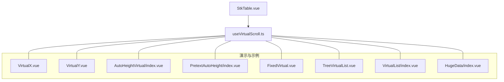
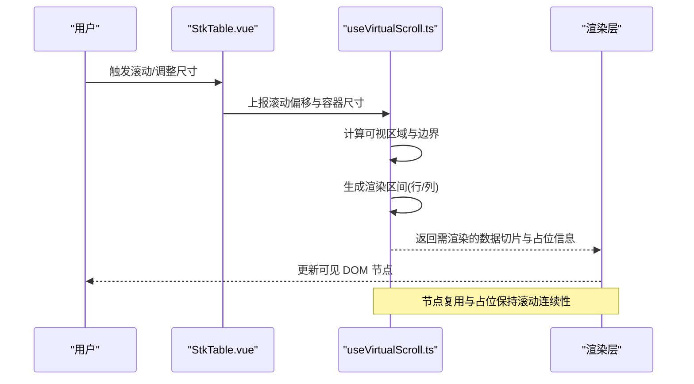
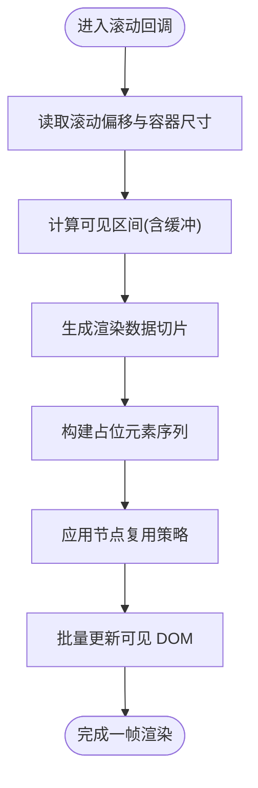
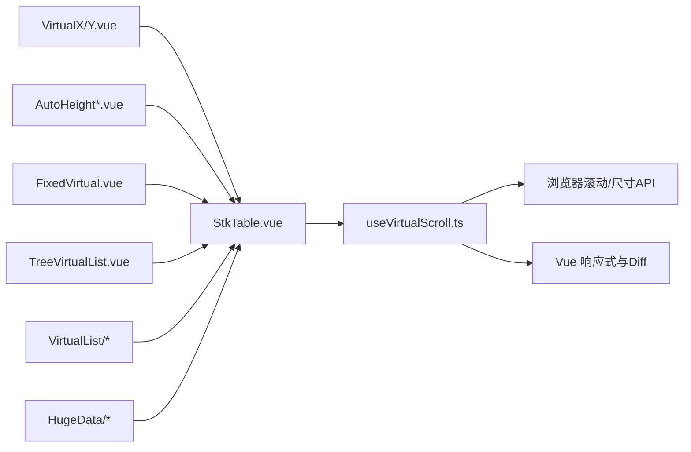

# 虚拟滚动

<cite>
**本文引用的文件**   
- [useVirtualScroll.ts](file://src/StkTable/useVirtualScroll.ts)
- [StkTable.vue](file://src/StkTable/StkTable.vue)
- [virtual.md](file://docs-src/main/table/advanced/virtual.md)
- [AutoHeightVirtual/index.vue](file://docs-demo/advanced/auto-height-virtual/AutoHeightVirtual/index.vue)
- [PretextAutoHeight/index.vue](file://docs-demo/advanced/auto-height-virtual/PretextAutoHeight/index.vue)
- [VirtualX.vue](file://docs-demo/advanced/virtual/VirtualX.vue)
- [VirtualY.vue](file://docs-demo/advanced/virtual/VirtualY.vue)
- [FixedVirtual.vue](file://docs-demo/basic/fixed/FixedVirtual.vue)
- [TreeVirtualList.vue](file://docs-demo/basic/tree/TreeVirtualList.vue)
- [VirtualList/index.vue](file://docs-demo/demos/VirtualList/index.vue)
- [VirtualList/Panel.vue](file://docs-demo/demos/VirtualList/Panel.vue)
- [VirtualList/types.ts](file://docs-demo/demos/VirtualList/types.ts)
- [HugeData/index.vue](file://docs-demo/demos/HugeData/index.vue)
- [HugeData/mockData.ts](file://docs-demo/demos/HugeData/mockData.ts)
- [HugeData/columns.ts](file://docs-demo/demos/HugeData/columns.ts)
- [HugeData/event.ts](file://docs-demo/demos/HugeData/event.ts)
- [HugeData/types.ts](file://docs-demo/demos/HugeData/types.ts)
</cite>

## 目录
1. [简介](#简介)
2. [项目结构](#项目结构)
3. [核心组件与能力](#核心组件与能力)
4. [架构总览](#架构总览)
5. [详细组件分析](#详细组件分析)
6. [依赖关系分析](#依赖关系分析)
7. [性能考量与调优](#性能考量与调优)
8. [故障排查指南](#故障排查指南)
9. [结论](#结论)
10. [附录：配置参数与使用示例](#附录配置参数与使用示例)

## 简介
本技术文档围绕 stk-table-vue 的虚拟滚动能力，系统阐述其核心原理、实现差异（横向与纵向）、可视区域计算、DOM 节点复用机制、滚动性能优化策略，以及大数据场景下的内存管理与性能调优。同时提供配置说明与多场景使用示例，帮助开发者在不同业务条件下正确启用并优化虚拟滚动。

## 项目结构
虚拟滚动相关代码主要位于 StkTable 内部逻辑与演示用例中：
- 核心实现：useVirtualScroll.ts
- 主表集成：StkTable.vue
- 文档与示例：docs-src 与 docs-demo 下多个虚拟滚动示例

图表来源 
- [StkTable.vue](file://src/StkTable/StkTable.vue)
- [useVirtualScroll.ts](file://src/StkTable/useVirtualScroll.ts)

章节来源
- [StkTable.vue](file://src/StkTable/StkTable.vue)
- [useVirtualScroll.ts](file://src/StkTable/useVirtualScroll.ts)

## 核心组件与能力
- 虚拟滚动核心 Hook：useVirtualScroll.ts
  - 负责可视区域计算、偏移量管理、渲染区间切片、DOM 占位与节点复用、滚动事件节流与防抖、尺寸变化监听等。
- 表格主组件：StkTable.vue
  - 将虚拟滚动能力与列布局、固定列、树形、合并单元格等功能集成，统一暴露 props、事件与插槽。
- 演示与示例：
  - 基础横向/纵向虚拟滚动：VirtualX.vue、VirtualY.vue
  - 自适应高度虚拟滚动：AutoHeightVirtual/index.vue、PretextAutoHeight/index.vue
  - 固定列+虚拟滚动：FixedVirtual.vue
  - 树形数据+虚拟滚动：TreeVirtualList.vue
  - 通用虚拟列表封装：VirtualList/index.vue、Panel.vue、types.ts
  - 大数据场景：HugeData/index.vue、mockData.ts、columns.ts、event.ts、types.ts

章节来源
- [useVirtualScroll.ts](file://src/StkTable/useVirtualScroll.ts)
- [StkTable.vue](file://src/StkTable/StkTable.vue)
- [VirtualX.vue](file://docs-demo/advanced/virtual/VirtualX.vue)
- [VirtualY.vue](file://docs-demo/advanced/virtual/VirtualY.vue)
- [AutoHeightVirtual/index.vue](file://docs-demo/advanced/auto-height-virtual/AutoHeightVirtual/index.vue)
- [PretextAutoHeight/index.vue](file://docs-demo/advanced/auto-height-virtual/PretextAutoHeight/index.vue)
- [FixedVirtual.vue](file://docs-demo/basic/fixed/FixedVirtual.vue)
- [TreeVirtualList.vue](file://docs-demo/basic/tree/TreeVirtualList.vue)
- [VirtualList/index.vue](file://docs-demo/demos/VirtualList/index.vue)
- [VirtualList/Panel.vue](file://docs-demo/demos/VirtualList/Panel.vue)
- [VirtualList/types.ts](file://docs-demo/demos/VirtualList/types.ts)
- [HugeData/index.vue](file://docs-demo/demos/HugeData/index.vue)
- [HugeData/mockData.ts](file://docs-demo/demos/HugeData/mockData.ts)
- [HugeData/columns.ts](file://docs-demo/demos/HugeData/columns.ts)
- [HugeData/event.ts](file://docs-demo/demos/HugeData/event.ts)
- [HugeData/types.ts](file://docs-demo/demos/HugeData/types.ts)

## 架构总览
虚拟滚动在 StkTable 中以 Hook 形式注入，通过监听容器滚动与尺寸变化，动态计算可见区间的行/列范围，仅渲染该范围内的 DOM 节点，并通过占位元素维持整体滚动条长度与位置。

图表来源 
- [StkTable.vue](file://src/StkTable/StkTable.vue)
- [useVirtualScroll.ts](file://src/StkTable/useVirtualScroll.ts)

章节来源
- [StkTable.vue](file://src/StkTable/StkTable.vue)
- [useVirtualScroll.ts](file://src/StkTable/useVirtualScroll.ts)

## 详细组件分析

### 虚拟滚动核心 Hook：useVirtualScroll.ts
- 功能职责
  - 可视区域计算：根据容器尺寸、滚动偏移、行列尺寸估算当前可见范围。
  - 渲染区间切片：基于可见范围生成起始索引、结束索引与缓冲区间，减少不必要的渲染。
  - DOM 占位与节点复用：使用占位元素维持滚动高度/宽度；对可见节点进行复用，避免频繁创建销毁。
  - 滚动事件处理：对滚动事件进行节流/防抖，降低高频回调带来的重排重绘压力。
  - 尺寸监听与自适应：监听容器尺寸变化，重新计算可见区间与占位。
- 关键流程
  - 初始化：读取容器尺寸、默认行高/列宽或测量值，建立初始占位。
  - 滚动回调：接收滚动偏移，计算可见区间，输出渲染切片与占位信息。
  - 尺寸变更：当容器或内容尺寸变化时，刷新计算结果并触发重渲染。
  - 节点复用：为每个可见项分配稳定 key，结合 Vue 的 diff 算法最小化更新。

图表来源 
- [useVirtualScroll.ts](file://src/StkTable/useVirtualScroll.ts)

章节来源
- [useVirtualScroll.ts](file://src/StkTable/useVirtualScroll.ts)

### 主表集成：StkTable.vue
- 集成点
  - 将 useVirtualScroll 的计算结果应用到表格主体区域，确保头部、固定列、树形、合并单元格等与虚拟滚动协同工作。
  - 对外暴露虚拟滚动相关 props（如是否启用横向/纵向虚拟滚动、行高/列宽策略、缓冲大小等），并提供事件回调用于上层自定义行为。
- 注意事项
  - 与固定列、合并单元格、树形展开等功能的兼容性需要在渲染前进行坐标与尺寸对齐。
  - 大数据场景下建议配合懒加载与分页策略，进一步降低首屏压力。

章节来源
- [StkTable.vue](file://src/StkTable/StkTable.vue)

### 横向与纵向虚拟滚动的实现差异
- 纵向虚拟滚动（行方向）
  - 以行高为基础单位，按可视高度计算可见行范围，行高可固定或自适应。
  - 适用于数据量大、行数多的场景，常见于列表型表格。
- 横向虚拟滚动（列方向）
  - 以列宽为基础单位，按可视宽度计算可见列范围，列宽可固定或自适应。
  - 适用于列数较多、列宽不等的场景，常见于宽表或矩阵展示。
- 混合模式
  - 同时启用横纵虚拟滚动时，需分别维护两个维度的可见区间与占位，并确保交叉区域的渲染顺序与层级正确。

章节来源
- [VirtualX.vue](file://docs-demo/advanced/virtual/VirtualX.vue)
- [VirtualY.vue](file://docs-demo/advanced/virtual/VirtualY.vue)

### 自适应高度与预文本场景
- 自适应高度
  - 行高随内容动态变化，需要测量实际 DOM 高度或使用预估高度+增量修正策略。
  - 典型用例：AutoHeightVirtual/index.vue、PretextAutoHeight/index.vue
- 预文本占位
  - 在内容未完全测量前，使用占位文本或骨架屏提升感知性能与用户体验。

章节来源
- [AutoHeightVirtual/index.vue](file://docs-demo/advanced/auto-height-virtual/AutoHeightVirtual/index.vue)
- [PretextAutoHeight/index.vue](file://docs-demo/advanced/auto-height-virtual/PretextAutoHeight/index.vue)

### 固定列与虚拟滚动
- 固定列需与虚拟滚动协调：固定列不参与滚动偏移，但需与虚拟渲染的可见区间同步，保证视觉一致性。
- 典型用例：FixedVirtual.vue

章节来源
- [FixedVirtual.vue](file://docs-demo/basic/fixed/FixedVirtual.vue)

### 树形数据与虚拟滚动
- 树形结构的行高与层级展开状态会影响可见区间计算，需在展开/折叠时及时刷新占位与渲染切片。
- 典型用例：TreeVirtualList.vue

章节来源
- [TreeVirtualList.vue](file://docs-demo/basic/tree/TreeVirtualList.vue)

### 通用虚拟列表封装
- 提供独立的虚拟列表组件与类型定义，便于在非表格场景复用虚拟滚动能力。
- 典型用例：VirtualList/index.vue、Panel.vue、types.ts

章节来源
- [VirtualList/index.vue](file://docs-demo/demos/VirtualList/index.vue)
- [VirtualList/Panel.vue](file://docs-demo/demos/VirtualList/Panel.vue)
- [VirtualList/types.ts](file://docs-demo/demos/VirtualList/types.ts)

### 大数据场景实践
- 数据规模与渲染策略
  - 百万级数据建议使用分页/懒加载与虚拟滚动组合，控制首屏渲染量。
  - 合理设置缓冲区间，平衡滚动流畅度与内存占用。
- 典型用例：HugeData/index.vue、mockData.ts、columns.ts、event.ts、types.ts

章节来源
- [HugeData/index.vue](file://docs-demo/demos/HugeData/index.vue)
- [HugeData/mockData.ts](file://docs-demo/demos/HugeData/mockData.ts)
- [HugeData/columns.ts](file://docs-demo/demos/HugeData/columns.ts)
- [HugeData/event.ts](file://docs-demo/demos/HugeData/event.ts)
- [HugeData/types.ts](file://docs-demo/demos/HugeData/types.ts)

## 依赖关系分析
- 模块耦合
  - StkTable.vue 依赖 useVirtualScroll.ts 提供的计算与渲染切片能力。
  - 各演示用例通过 props 与事件与 StkTable 交互，验证不同场景下的虚拟滚动效果。
- 外部依赖
  - 依赖浏览器滚动事件与尺寸 API（如 scroll、resize、IntersectionObserver 等）。
  - 依赖 Vue 的响应式与组件 diff 机制以实现节点复用。

图表来源 
- [StkTable.vue](file://src/StkTable/StkTable.vue)
- [useVirtualScroll.ts](file://src/StkTable/useVirtualScroll.ts)

章节来源
- [StkTable.vue](file://src/StkTable/StkTable.vue)
- [useVirtualScroll.ts](file://src/StkTable/useVirtualScroll.ts)

## 性能考量与调优
- 可视区域计算
  - 采用预估行高/列宽 + 增量修正，减少频繁测量带来的重排。
  - 引入缓冲区间，提前渲染即将进入可视区的节点，提升滚动流畅度。
- DOM 节点复用
  - 使用稳定的 key 绑定，结合 Vue 的 diff 最小化更新。
  - 避免在渲染函数中进行复杂计算，尽量将计算前置到 Hook 层。
- 滚动事件优化
  - 对滚动事件进行节流/防抖，限制每帧更新次数。
  - 使用 requestAnimationFrame 批量更新，避免阻塞主线程。
- 内存管理最佳实践
  - 及时释放不可见节点的引用，避免内存泄漏。
  - 大数据场景下结合分页/懒加载，控制一次性渲染数量。
- 大数据场景调优
  - 合理设置行高/列宽策略，优先使用固定尺寸以提升性能。
  - 对复杂单元格内容进行懒渲染或虚拟化，减少首屏压力。
  - 使用 Web Worker 或分片渲染处理超大数据集。

[本节为通用指导，不直接分析具体文件]

## 故障排查指南
- 滚动卡顿
  - 检查滚动事件是否被过度节流/防抖导致更新不及时。
  - 确认渲染区间是否过大，适当减小缓冲区间。
- 错位与闪烁
  - 核对行高/列宽测量逻辑，确保占位与实际内容一致。
  - 检查固定列与虚拟滚动的坐标对齐。
- 内存增长
  - 排查是否存在未释放的节点引用或闭包持有大对象。
  - 在数据切换或卸载时清理缓存与订阅。
- 自适应高度异常
  - 确认测量时机是否正确，必要时增加延迟或增量修正。
  - 预文本占位需与最终高度保持一致，避免抖动。

章节来源
- [useVirtualScroll.ts](file://src/StkTable/useVirtualScroll.ts)
- [StkTable.vue](file://src/StkTable/StkTable.vue)

## 结论
stk-table-vue 的虚拟滚动通过 Hook 化的核心实现，将可视区域计算、渲染区间切片、DOM 占位与节点复用有机结合，能够在横向与纵向维度高效渲染海量数据。结合自适应高度、固定列、树形等特性，满足多样化业务场景。通过合理的性能调优与内存管理，可在大数据环境下获得流畅的用户体验。

[本节为总结性内容，不直接分析具体文件]

## 附录：配置参数与使用示例
- 常用配置参数（概念性说明）
  - 启用纵向虚拟滚动：开启后按行高计算可见区间，适合行数较多的列表。
  - 启用横向虚拟滚动：开启后按列宽计算可见区间，适合列数较多的宽表。
  - 行高/列宽策略：支持固定尺寸与自适应两种模式，固定尺寸性能更优。
  - 缓冲区间：控制可视区外额外渲染的数量，影响流畅度与内存占用。
  - 滚动事件节流/防抖：控制滚动回调频率，平衡性能与实时性。
  - 自适应高度：启用后根据内容动态测量行高，需配合占位与增量修正。
- 使用示例参考
  - 基础横向/纵向虚拟滚动：VirtualX.vue、VirtualY.vue
  - 自适应高度虚拟滚动：AutoHeightVirtual/index.vue、PretextAutoHeight/index.vue
  - 固定列+虚拟滚动：FixedVirtual.vue
  - 树形数据+虚拟滚动：TreeVirtualList.vue
  - 通用虚拟列表：VirtualList/index.vue、Panel.vue、types.ts
  - 大数据场景：HugeData/index.vue、mockData.ts、columns.ts、event.ts、types.ts
- 文档参考
  - 官方文档页面：virtual.md

章节来源
- [virtual.md](file://docs-src/main/table/advanced/virtual.md)
- [VirtualX.vue](file://docs-demo/advanced/virtual/VirtualX.vue)
- [VirtualY.vue](file://docs-demo/advanced/virtual/VirtualY.vue)
- [AutoHeightVirtual/index.vue](file://docs-demo/advanced/auto-height-virtual/AutoHeightVirtual/index.vue)
- [PretextAutoHeight/index.vue](file://docs-demo/advanced/auto-height-virtual/PretextAutoHeight/index.vue)
- [FixedVirtual.vue](file://docs-demo/basic/fixed/FixedVirtual.vue)
- [TreeVirtualList.vue](file://docs-demo/basic/tree/TreeVirtualList.vue)
- [VirtualList/index.vue](file://docs-demo/demos/VirtualList/index.vue)
- [VirtualList/Panel.vue](file://docs-demo/demos/VirtualList/Panel.vue)
- [VirtualList/types.ts](file://docs-demo/demos/VirtualList/types.ts)
- [HugeData/index.vue](file://docs-demo/demos/HugeData/index.vue)
- [HugeData/mockData.ts](file://docs-demo/demos/HugeData/mockData.ts)
- [HugeData/columns.ts](file://docs-demo/demos/HugeData/columns.ts)
- [HugeData/event.ts](file://docs-demo/demos/HugeData/event.ts)
- [HugeData/types.ts](file://docs-demo/demos/HugeData/types.ts)